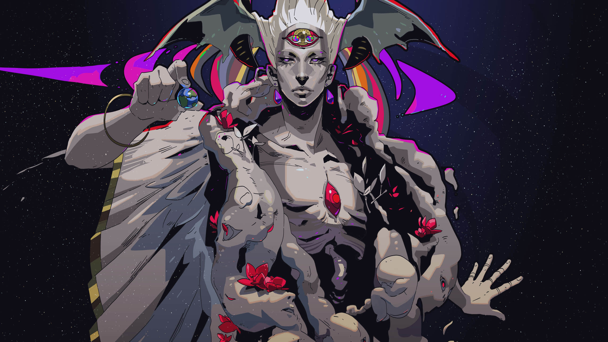
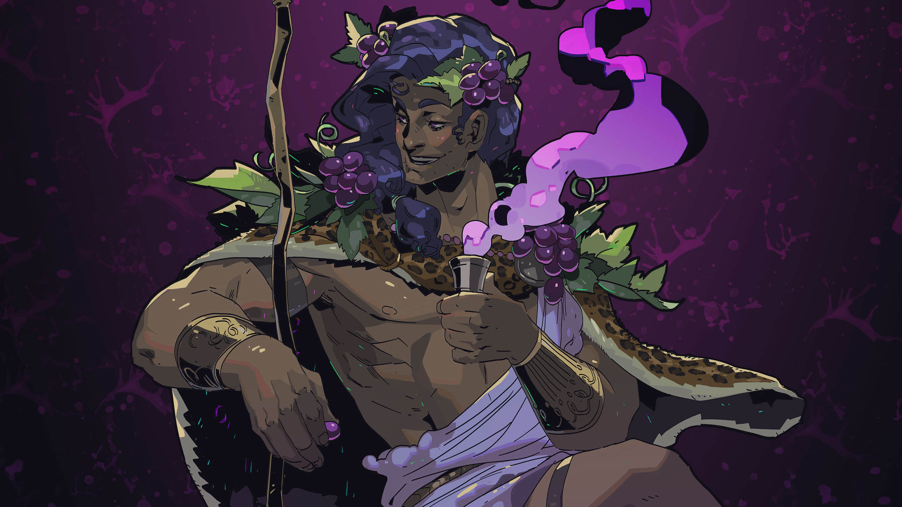
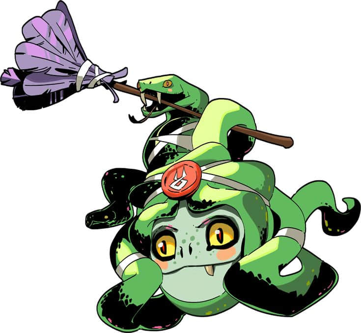
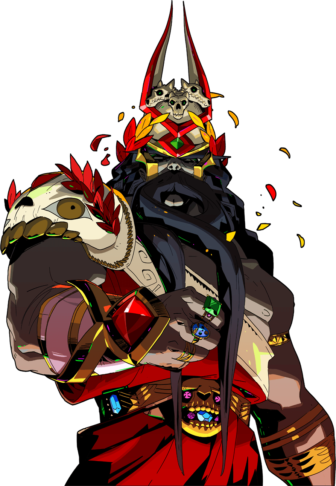
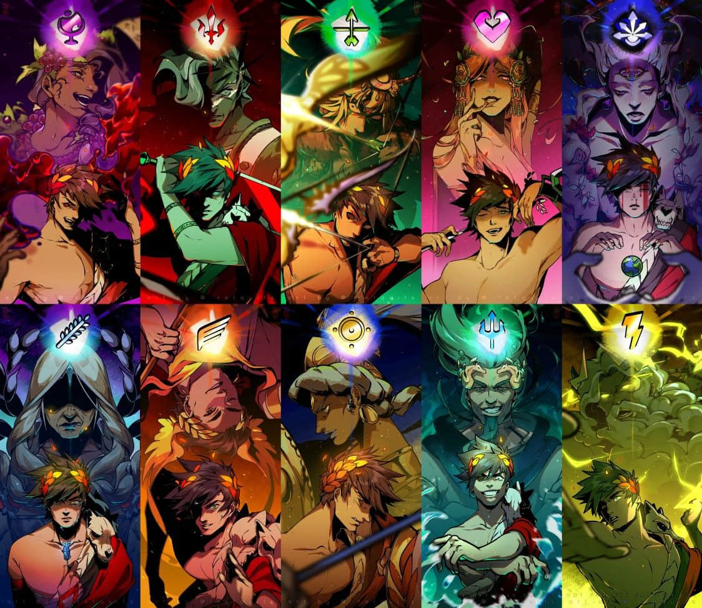
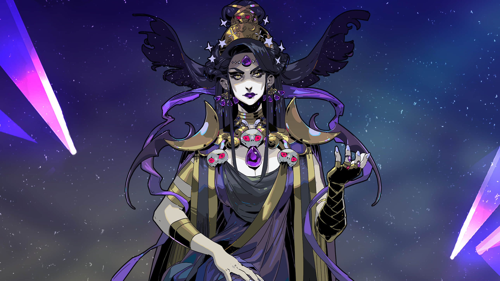
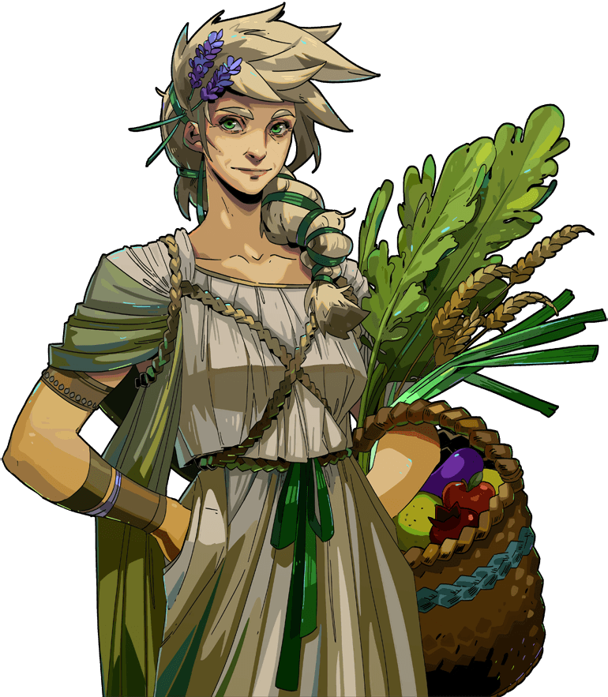
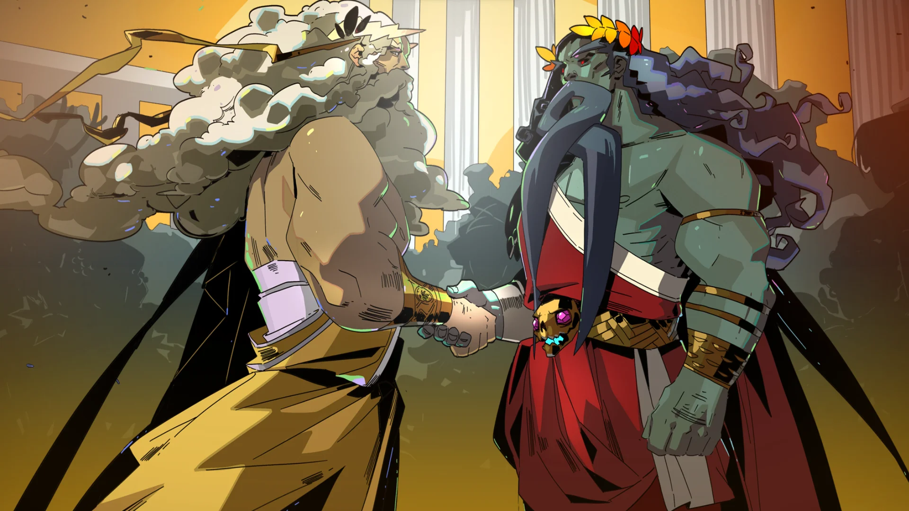
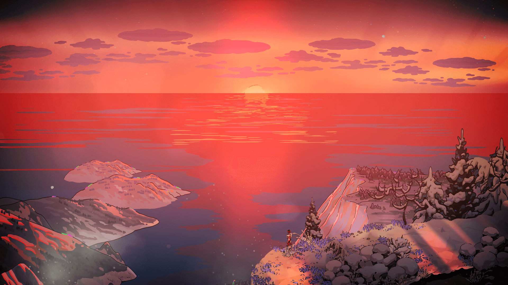
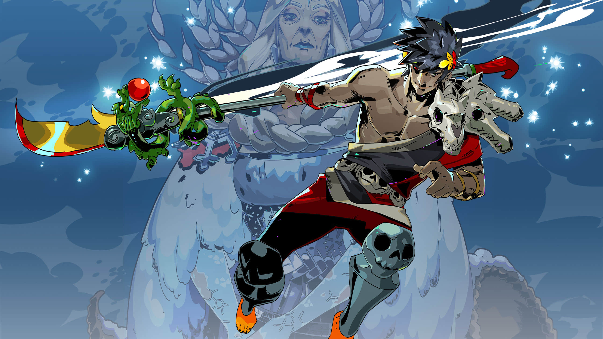

# Hades骚话海报合集

[Hades](https://www.supergiantgames.com/games/hades/)采用了碎片化叙事，每次挑战，NPC们都会和玩家有不同的对话，这些对话都存储在游戏的目录的`Subtitles`文件夹，于是我写了个[脚本](./main.py)，将各个NPC的对话去重，并按照中英对照的形式绘制成了表格，表格展示在[./README.md]。

通过阅读本仓库的README，你可以通过对话深入地了解各个NPC，了解这款游戏的各种隐藏剧情，中英对照学学英语，欣赏一下Hade独特美术风格的[海报](./images/)。

<h2 id='hadesIndex'>Index(目录)</h1> <a href='#Achilles' id='AchillesIndex'>
Achilles 阿喀琉斯(他生前曾是位伟大的英雄，如今成了神殿的警卫长)
</a>
 <a href='#Alecto' id='AlectoIndex'>
Alecto 阿勒克图(复仇女神墨纪拉的姐姐)
</a>
 <a href='#Aphrodite' id='AphroditeIndex'>
Aphrodite 阿弗洛狄忒(司爱女神)
</a>
 <a href='#Ares' id='AresIndex'>
Ares 阿瑞斯(战神)
</a>
 <a href='#Artemis' id='ArtemisIndex'>
Artemis 阿尔忒弥斯(狩猎女神)
</a>
 <a href='#Athena' id='AthenaIndex'>
Athena 雅典娜(智慧女神)
</a>
 <a href='#Chaos' id='ChaosIndex'>
Chaos 卡俄斯(万物的创造者)
</a>
 <a href='#Demeter' id='DemeterIndex'>
Demeter 得墨忒尔(四季女神)
</a>
 <a href='#Dionysus' id='DionysusIndex'>
Dionysus 迪奥尼索司(酒神)
</a>
 <a href='#Dusa' id='DusaIndex'>
Dusa 杜莎(身负重任的蛇发女妖)
</a>
 <a href='#Eurydice' id='EurydiceIndex'>
Eurydice 欧律狄克(无忧无虑的缪斯女神)
</a>
 <a href='#ExtraLines' id='ExtraLinesIndex'>
ExtraLines 一些零散的补充
</a>
 <a href='#Hades' id='HadesIndex'>
Hades 哈迪斯(死者之主)
</a>
 <a href='#HadesField' id='HadesFieldIndex'>
HadesField 哈迪斯的场景
</a>
 <a href='#Hypnos' id='HypnosIndex'>
Hypnos 修普诺斯(睡神)
</a>
 <a href='#Intercom' id='IntercomIndex'>
Intercom BOSS战斗相关
</a>
 <a href='#MegaeraField' id='MegaeraFieldIndex'>
MegaeraField 墨纪拉的场景
</a>
 <a href='#MegaeraHome' id='MegaeraHomeIndex'>
MegaeraHome 墨纪拉在家
</a>
 <a href='#Minotaur' id='MinotaurIndex'>
Minotaur 阿斯忒里俄斯(米诺斯之牛)
</a>
 <a href='#Nyx' id='NyxIndex'>
Nyx 倪克斯(黑夜之神)
</a>
 <a href='#Orpheus' id='OrpheusIndex'>
Orpheus 俄耳甫斯(宫廷乐师)
</a>
 <a href='#Patroclus' id='PatroclusIndex'>
Patroclus 普特洛克勒斯(陨落的勇士)
</a>
 <a href='#Persephone' id='PersephoneIndex'>
Persephone 珀尔塞福涅(常青女神,冥界皇后)
</a>
 <a href='#Poseidon' id='PoseidonIndex'>
Poseidon 波塞冬(海神)
</a>
 <a href='#Scratch' id='ScratchIndex'>
Scratch 离开
</a>
 <a href='#Sisyphus' id='SisyphusIndex'>
Sisyphus 西西弗斯(他欺骗了亡灵，因此他被判处在塔耳塔罗斯从事长期的劳役)
</a>
 <a href='#Skelly' id='SkellyIndex'>
Skelly 骨头(训练傀儡)
</a>
 <a href='#Songs' id='SongsIndex'>
Songs 歌声
</a>
 <a href='#Storyteller' id='StorytellerIndex'>
Storyteller 画外音
</a>
 <a href='#Thanatos' id='ThanatosIndex'>
Thanatos 塔纳托斯(死神)
</a>
 <a href='#ThanatosField' id='ThanatosFieldIndex'>
ThanatosField 
</a>
 <a href='#Theseus' id='TheseusIndex'>
Theseus 忒修斯(雅典英雄)
</a>
 <a href='#Tisiphone' id='TisiphoneIndex'>
Tisiphone 提西福涅(复仇三女神之一)
</a>
 <a href='#ZagreusField' id='ZagreusFieldIndex'>
ZagreusField 扎格列欧斯区域
</a>
 <a href='#ZagreusHome' id='ZagreusHomeIndex'>
ZagreusHome 扎格列欧斯的家
</a>
 <a href='#ZagreusScratch' id='ZagreusScratchIndex'>
ZagreusScratch 扎格列欧斯离开
</a>
 <a href='#Zeus' id='ZeusIndex'>
Zeus 宙斯(奥林匹斯之王)
</a>

<h2 id='Achilles'>Achilles 阿喀琉斯(他生前曾是位伟大的英雄，如今成了神殿的警卫长) </h2><table><tr><td>EN 🍭</td><td>ZH-CN 🚀</td></tr><tr><td width='400'>Hey, lad.</td><td width='400'>嘿，孩子。</td></tr><tr><td width='400'>You're back.</td><td width='400'>你回来了。</td></tr><tr><td width='400'>You've returned.</td><td width='400'>你回家了。</td></tr><tr><td width='400'>A moment, lad?</td><td width='400'>能和你谈谈吗，孩子？</td></tr><tr><td width='400'>Hail.</td><td width='400'>欢迎。</td></tr><tr><td width='400'>Yes, lad?</td><td width='400'>怎么了，孩子？</td></tr><tr><td width='400'>What is it, lad.</td><td width='400'>怎么了，孩子。</td></tr><tr><td width='400'>Zagreus?</td><td width='400'>扎格列欧斯？</td></tr><tr><td width='400'>Something you require?</td><td width='400'>有什么需要的吗？</td></tr><tr><td width='400'>Tell me what I can do.</td><td width='400'>告诉我我能做点什么。</td></tr><tr><td width='400'>What's on your mind.</td><td width='400'>有什么想说的吗。</td></tr><tr><td width='400'>What might I do for you?</td><td width='400'>我能为你做点什么？</td></tr><tr><td width='400'>Certainly.</td><td width='400'>没问题。</td></tr><tr><td width='400'>Splendid.</td><td width='400'>非常好。</td></tr><tr><td width='400'>As good as done.</td><td width='400'>干得好。</td></tr><tr><td width='400'>Very well.</td><td width='400'>好吧。</td></tr><tr><td width='400'>I was thinking the same.</td><td width='400'>我也是这么想。</td></tr><tr><td width='400'>I'll give it my all.</td><td width='400'>我尽力而为。</td></tr><tr><td width='400'>You got it.</td><td width='400'>拿去。</td></tr><tr><td width='400'>Of course.</td><td width='400'>理所当然。</td></tr><tr><td width='400'>That can be arranged.</td><td width='400'>这个可以。</td></tr><tr><td width='400'>Indeed.</td><td width='400'>没错。</td></tr><tr><td width='400'>Hmm.</td><td width='400'>嗯。</td></tr><tr><td width='400'>Be well.</td><td width='400'>保重。</td></tr><tr><td width='400'>Be strong.</td><td width='400'>坚强。</td></tr><tr><td width='400'>Prince.</td><td width='400'>王子。</td></tr><tr><td width='400'>Your Highness.</td><td width='400'>殿下。</td></tr><tr><td width='400'>Thank you for thinking of me, lad. Now, I have something for you, too. It's just a trifle, really, though I thought that maybe it could help from time to time.</td><td width='400'>感谢你的关心，孩子。现在我也要给你一点东西。虽然不是什么宝贝，不过我想它应该能帮助到你。</td></tr><tr><td width='400'>You honor me. And I shall honor you. Lord Zagreus, O god of blood, I bid that you accept this humble offering on my behalf, and may our friendship endure until the end of time.</td><td width='400'>我很荣幸，而我当礼尚往来。扎格列欧斯大人，鲜血之神啊，望汝接受吾这卑微的献礼，愿吾等之友谊延至地久天长。</td></tr><tr><td width='400'>Hm. Yes. I was careless.... Though, you must have been quite the respected warrior in your mortal days, Skelly.</td><td width='400'>是的，当时是我的疏忽…不过，你生前一定是一位备受尊敬的勇士吧，骷榔头。</td></tr><tr><td width='400'>I think your father's in no mood for bargaining. Impulsiveness is how Patroclus and myself got in this situation to begin with. So I ask your patience. Thank you for bringing news of him to me. Keep talking to him when you can, will you?</td><td width='400'>我觉得你父亲现在没心情谈条件。我和普特洛克勒斯是因为一时的冲动才导致现在的结果。所以现在我要你耐心等待。谢谢你带给我他的消息。如果有机会的话，和他多聊聊吧，好吗？</td></tr><tr><td width='400'>That's good, then. Glad to hear it.</td><td width='400'>太好了。真是好消息。</td></tr><tr><td width='400'>Indeed, lad.</td><td width='400'>当然了，孩子。</td></tr><tr><td width='400'>Now that you mention it... I can't.</td><td width='400'>既然你这么说... 我做不到啊。</td></tr><tr><td width='400'>A word, Prince?</td><td width='400'>王子，有空聊一聊吗？</td></tr><tr><td width='400'>Your Highness, over here.</td><td width='400'>殿下，来这里一下。</td></tr><tr><td width='400'>Oh there you are, Highness.</td><td width='400'>殿下你来了。</td></tr><tr><td width='400'>Let's have a brief word, Prince.</td><td width='400'>让我们简单聊几句吧，王子。</td></tr><tr><td width='400'>Suggest you hurry in there, lad...</td><td width='400'>我建议你快点过去，小伙子……</td></tr><tr><td width='400'>Can't let you in there, lad.</td><td width='400'>这个地方可不能进，小伙子。</td></tr><tr><td width='400'>Off limits, I'm afraid.</td><td width='400'>恐怕这里还不能进。</td></tr><tr><td width='400'>You know your father's rules.</td><td width='400'>你也清楚你父亲定下来的规矩。</td></tr><tr><td width='400'>Come on, lad.</td><td width='400'>拜托了，小伙子。</td></tr><tr><td width='400'>Locked for a reason, lad.</td><td width='400'>这地方不是无缘无故被锁起来的，小伙子。</td></tr><tr><td width='400'>Not permitted there.</td><td width='400'>那边不能进。</td></tr><tr><td width='400'>House rules, lad.</td><td width='400'>是圣殿的规矩，小伙子。</td></tr><tr><td width='400'>Has to stay shut like that.</td><td width='400'>那扇门不能打开。</td></tr><tr><td width='400'>No use in trying, lad.</td><td width='400'>再怎么试也没用，小伙子。</td></tr><tr><td width='400'>Not going to open, lad.</td><td width='400'>那扇门是打不开的，小伙子。</td></tr><tr><td width='400'>You have my thanks.</td><td width='400'>谢谢你。</td></tr><tr><td width='400'>Why, look who.</td><td width='400'>看看是谁来了。</td></tr><tr><td width='400'>Hah, haha.</td><td width='400'>哈，哈哈。</td></tr><tr><td width='400'>Hello, lad.</td><td width='400'>你好啊，小伙子。</td></tr><tr><td width='400'>Look, Pat.</td><td width='400'>你看，小普。</td></tr><tr><td width='400'>We've a guest.</td><td width='400'>有客人来了。</td></tr><tr><td width='400'>Ah, you're here.</td><td width='400'>啊，是你来了。</td></tr><tr><td width='400'>How goes it, lad?</td><td width='400'>你还好吗，小伙子？</td></tr><tr><td width='400'>Come all this way, huh.</td><td width='400'>你一路赶到这里了，是嘛。</td></tr><tr><td width='400'>Fight on.</td><td width='400'>继续努力吧。</td></tr><tr><td width='400'>Farewell.</td><td width='400'>再见了。</td></tr><tr><td width='400'>Farewell, lad.</td><td width='400'>再见了，小伙子。</td></tr><tr><td width='400'>Till we meet again.</td><td width='400'>后会有期。</td></tr><tr><td width='400'>Fight like I'd fight out there.</td><td width='400'>像我一样去外面战斗吧。</td></tr><tr><td width='400'>Good journey.</td><td width='400'>祝你一帆风顺。</td></tr><tr><td width='400'>Fear is for the weak.</td><td width='400'>恐惧是弱者的专利。</td></tr><tr><td width='400'>We'll see you.</td><td width='400'>好吧，再见。</td></tr><tr><td width='400'>Come, lad.</td><td width='400'>来吧，小伙子。</td></tr><tr><td width='400'>No mood for sparring, lad.</td><td width='400'>我现在没心情陪练，小伙子。</td></tr><tr><td width='400'>Not now, lad.</td><td width='400'>现在不行，小伙子。</td></tr><tr><td width='400'>I've fought enough I think.</td><td width='400'>我觉得我已经打够了。</td></tr><tr><td width='400'>Rest while you're able.</td><td width='400'>趁着有空的时候休息休息吧。</td></tr><tr><td width='400'>Not here to fight you, lad.</td><td width='400'>我不是来和你打架的，小伙子。</td></tr><tr><td width='400'>Heh.</td><td width='400'>呵。</td></tr><tr><td width='400'>Ehh.</td><td width='400'>呃。</td></tr><tr><td width='400'>No, thank you.</td><td width='400'>不用了，谢谢。</td></tr><tr><td width='400'>Yes, Master. Thank you.</td><td width='400'>好的，大人，谢谢。</td></tr><tr><td width='400'>Of course, Mistress. I shall. By your command.</td><td width='400'>当然没问题，夫人，愿意听从您的差遣。</td></tr><tr><td width='400'>...and then, when that pig-headed braggart ordered me to do it, I swear...</td><td width='400'>……后来，那个固执的吹牛大王命令我去做那件事的时候，我发誓……</td></tr><tr><td width='400'>More than quite sure, indeed!</td><td width='400'>完全正确，一点都没错！</td></tr><tr><td width='400'>Well I suppose you're right.</td><td width='400'>好吧，我猜你说得没错。</td></tr><tr><td width='400'>Oh, come on, you can fight better than that.</td><td width='400'>哦，加把劲儿，你可不是只有这点能耐。</td></tr><tr><td width='400'>Indeed it is, you're right.</td><td width='400'>确实如此，你说得没错。</td></tr><tr><td width='400'>You're right!</td><td width='400'>你说得没错！</td></tr><tr><td width='400'>We do.</td><td width='400'>是啊。</td></tr><tr><td width='400'>Ah, yes.</td><td width='400'>啊，没错。</td></tr><tr><td width='400'>Indeed!</td><td width='400'>确实如此！</td></tr><tr><td width='400'>I do believe it is!</td><td width='400'>我相信是这样！</td></tr><tr><td width='400'>Here!</td><td width='400'>来了！</td></tr><tr><td width='400'>On our way!</td><td width='400'>马上就到！</td></tr><tr><td width='400'>Ready!</td><td width='400'>准备好了！</td></tr><tr><td width='400'>We hear you!</td><td width='400'>我们听到你的呼唤了！</td></tr><tr><td width='400'>We hear you, lad!</td><td width='400'>我们听到你的呼唤了，小伙子！</td></tr><tr><td width='400'>Yes, lad!</td><td width='400'>没问题，小伙子！</td></tr><tr><td width='400'>We'll be right there!</td><td width='400'>我们马上就到！</td></tr><tr><td width='400'>Be right there!</td><td width='400'>马上就到！</td></tr><tr><td width='400'>Steady, lad!</td><td width='400'>坚持住，小伙子！</td></tr><tr><td width='400'>This shall be quick.</td><td width='400'>马上就好了。</td></tr><tr><td width='400'>Patroclus!</td><td width='400'>普特洛克勒斯！</td></tr><tr><td width='400'>Now, Patroclus!</td><td width='400'>就是现在，普特洛克勒斯！</td></tr><tr><td width='400'>Let's go, Pat!</td><td width='400'>我们上吧，小普！</td></tr><tr><td width='400'>Now, Pat!</td><td width='400'>动手吧，小普！</td></tr><tr><td width='400'>Let's go!</td><td width='400'>我们上！</td></tr><tr><td width='400'>Now!</td><td width='400'>就是现在！</td></tr><tr><td width='400'>Attack!</td><td width='400'>杀啊！</td></tr><tr><td width='400'>To battle!</td><td width='400'>勇往直前！</td></tr><tr><td width='400'>Shall we?</td><td width='400'>一起来吗？</td></tr><tr><td width='400'>Come on, Pat!</td><td width='400'>上吧，小普！</td></tr><tr><td width='400'>Asterius!</td><td width='400'>是阿斯忒里俄斯！</td></tr><tr><td width='400'>The Bull of Minos!</td><td width='400'>是米诺斯的公牛！</td></tr><tr><td width='400'>Why, it's the champion!</td><td width='400'>怎么，那不是最强战士嘛！</td></tr><tr><td width='400'>Theseus causing trouble, lad?</td><td width='400'>是忒修斯在惹你的麻烦吗，小伙子？</td></tr><tr><td width='400'>Time we unseated the champion.</td><td width='400'>是时候夺走他的冠军宝座了。</td></tr><tr><td width='400'>We're off.</td><td width='400'>我们上吧。</td></tr><tr><td width='400'>Keep fighting!</td><td width='400'>继续战斗！</td></tr><tr><td width='400'>Fight on, lad!</td><td width='400'>再加把劲，小伙子！</td></tr><tr><td width='400'>Keep going!</td><td width='400'>就是这样！</td></tr><tr><td width='400'>Now finish this!</td><td width='400'>干掉他吧！</td></tr><tr><td width='400'>We've returned!</td><td width='400'>我们回来了！</td></tr><tr><td width='400'>We heed you, lad.</td><td width='400'>我们就在你身后，小伙子。</td></tr><tr><td width='400'>Once more, then!</td><td width='400'>那就再来一次！</td></tr><tr><td width='400'>Find what you need?</td><td width='400'>找到你要的了吗？</td></tr><tr><td width='400'>And you in turn.</td><td width='400'>你也是，再见了。</td></tr><tr><td width='400'>You are most kind, O Night.</td><td width='400'>你真是太仁慈了，暗夜之母。</td></tr><tr><td width='400'>It sounds absurd when you put it quite like that, but yes.</td><td width='400'>这么说的话，听起来还真是挺荒谬的。</td></tr><tr><td width='400'>Hah, I suppose that's true.</td><td width='400'>哈，我猜你说得没错。</td></tr><tr><td width='400'>Hail, Prince.</td><td width='400'>你好，王子殿下。</td></tr><tr><td width='400'>How goes it?</td><td width='400'>你还好吗？</td></tr><tr><td width='400'>Ah.</td><td width='400'>啊。</td></tr><tr><td width='400'>...were it not for you, Pat, I don't even like to think about what I'd have done. The war would have gone differently, then, I suppose.</td><td width='400'>……要不是因为有你，小普，我甚至不愿意去想我会做什么。我猜，要是那样的话，那场战争的结局恐怕就要不一样了。</td></tr><tr><td width='400'>Thank you, O Night.</td><td width='400'>谢谢您，黑夜女神。</td></tr><tr><td width='400'>Hahaha, well... you got me there.</td><td width='400'>哈哈哈，这……服了你了。</td></tr><tr><td width='400'>I'll have to take your word for it.</td><td width='400'>那就信你的了。</td></tr><tr><td width='400'>Just watch yourself.</td><td width='400'>小心行事。</td></tr><tr><td width='400'>I know the type. Both types.</td><td width='400'>那种人，我了解。两种都了解。</td></tr><tr><td width='400'>Keep at it.</td><td width='400'>再接再厉。</td></tr><tr><td width='400'>You sure about this, lad?</td><td width='400'>你确定吗，小伙子？</td></tr><tr><td width='400'>Apologies, Master...</td><td width='400'>非常抱歉，主人……</td></tr><tr><td width='400'>Hope your father doesn't mind...!</td><td width='400'>希望你父亲不会介意……！</td></tr><tr><td width='400'>Your father won't like this!</td><td width='400'>你父亲会生气的！</td></tr><tr><td width='400'>Maybe both. I've met the sort.</td><td width='400'>也许二者皆有。我遇到过这种情况。</td></tr></table> <a href='#AchillesIndex'>Return Achilles Index / 返回阿喀琉斯(他生前曾是位伟大的英雄，如今成了神殿的警卫长)目录)</a>
<h2 id='Alecto'>Alecto 阿勒克图(复仇女神墨纪拉的姐姐) </h2><table><tr><td>EN 🍭</td><td>ZH-CN 🚀</td></tr><tr><td width='400'>I wish it didn't have to be this way.</td><td width='400'>我真希望我们可以不要这样。</td></tr><tr><td width='400'>Why must we always have to fight.</td><td width='400'>为什么就一定要战斗呢。</td></tr><tr><td width='400'>It's time we had one of our little fights.</td><td width='400'>是时候清算一下了。</td></tr><tr><td width='400'>I so was hoping you'd show up just now.</td><td width='400'>我还在想你应该出现了吧。</td></tr><tr><td width='400'>Take this!</td><td width='400'>吃我一招！</td></tr><tr><td width='400'>Nraaugh!</td><td width='400'>呃啊啊！</td></tr><tr><td width='400'>Pain.</td><td width='400'>痛。</td></tr><tr><td width='400'>Try this!</td><td width='400'>接招！</td></tr><tr><td width='400'>Catch this!</td><td width='400'>尝尝这个！</td></tr><tr><td width='400'>Die already!</td><td width='400'>快死吧！</td></tr><tr><td width='400'>Eat this!</td><td width='400'>吃我一招！</td></tr><tr><td width='400'>Die!</td><td width='400'>死吧！</td></tr><tr><td width='400'>Kill!</td><td width='400'>杀！</td></tr><tr><td width='400'>Suffer!</td><td width='400'>受苦吧！</td></tr><tr><td width='400'>Catch!</td><td width='400'>接着！</td></tr><tr><td width='400'>Bleed!</td><td width='400'>流血吧！</td></tr><tr><td width='400'>Here you go!</td><td width='400'>看看这个！</td></tr><tr><td width='400'>I said die!</td><td width='400'>我说了快死！</td></tr><tr><td width='400'>Catch, redblood!</td><td width='400'>接好了，流红血的！</td></tr><tr><td width='400'>How's this!</td><td width='400'>如何！</td></tr><tr><td width='400'>Run.</td><td width='400'>跑吧。</td></tr><tr><td width='400'>Run!</td><td width='400'>跑吧！</td></tr><tr><td width='400'>You run!</td><td width='400'>你跑呀！</td></tr><tr><td width='400'>Pitiful.</td><td width='400'>真是可怜。</td></tr><tr><td width='400'>I'll kill you!</td><td width='400'>我要杀死你！</td></tr><tr><td width='400'>Enough!</td><td width='400'>够了！</td></tr><tr><td width='400'>Run for it.</td><td width='400'>跑吧。</td></tr><tr><td width='400'>No escape.</td><td width='400'>你跑不了的。</td></tr><tr><td width='400'>Hold still.</td><td width='400'>站住别动。</td></tr><tr><td width='400'>You'll get yours.</td><td width='400'>有你好看的。</td></tr><tr><td width='400'>You better run.</td><td width='400'>你最好快跑。</td></tr><tr><td width='400'>Hold still!</td><td width='400'>站住别动！</td></tr><tr><td width='400'>Look out below.</td><td width='400'>注意脚下。</td></tr><tr><td width='400'>I'll get you.</td><td width='400'>我会打败你。</td></tr><tr><td width='400'>Pain...</td><td width='400'>痛苦…</td></tr><tr><td width='400'>Hold it...</td><td width='400'>拿好…</td></tr><tr><td width='400'>Right here.</td><td width='400'>在这里。</td></tr><tr><td width='400'>Got you.</td><td width='400'>抓到你了。</td></tr><tr><td width='400'>Have another.</td><td width='400'>再来一下。</td></tr><tr><td width='400'>Ready?</td><td width='400'>准备好了吗？</td></tr><tr><td width='400'>Dodge this.</td><td width='400'>试试躲开这个。</td></tr><tr><td width='400'>Come closer.</td><td width='400'>再靠近点。</td></tr><tr><td width='400'>Don't move.</td><td width='400'>别动。</td></tr><tr><td width='400'>Remember this?</td><td width='400'>记得这个吗？</td></tr><tr><td width='400'>I'll make you hurt.</td><td width='400'>我会让你喊疼的。</td></tr><tr><td width='400'>Still standing huh.</td><td width='400'>还死撑呢。</td></tr><tr><td width='400'>Die already.</td><td width='400'>去死吧。</td></tr><tr><td width='400'>Still kicking?</td><td width='400'>还没死？</td></tr><tr><td width='400'>Still kicking are you.</td><td width='400'>你怎么还没死呢。</td></tr><tr><td width='400'>Still alive huh.</td><td width='400'>还活着呢。</td></tr><tr><td width='400'>Ooh, you're hurt.</td><td width='400'>噢，你受伤了噢。</td></tr><tr><td width='400'>I'm going to kill you.</td><td width='400'>我会杀死你的。</td></tr><tr><td width='400'>I'll kill you yet.</td><td width='400'>我要杀死你。</td></tr><tr><td width='400'>Aw, you're hurt.</td><td width='400'>噢，你受伤了。</td></tr><tr><td width='400'>Not finished? Fine.</td><td width='400'>还没完？行。</td></tr><tr><td width='400'>You're as good as dead.</td><td width='400'>只要你死了就好了。</td></tr><tr><td width='400'>Nice trick.</td><td width='400'>真机灵。</td></tr><tr><td width='400'>Give up.</td><td width='400'>放弃吧。</td></tr><tr><td width='400'>You're dead.</td><td width='400'>你已经死了。</td></tr><tr><td width='400'>You're mine.</td><td width='400'>你是我的。</td></tr><tr><td width='400'>You won't last.</td><td width='400'>你撑不下去了。</td></tr><tr><td width='400'>Got you that time.</td><td width='400'>可逮着你了。</td></tr><tr><td width='400'>I bet that hurt.</td><td width='400'>一定很疼吧。</td></tr><tr><td width='400'>For last time.</td><td width='400'>最后一次了。</td></tr><tr><td width='400'>Hah!</td><td width='400'>哈！</td></tr><tr><td width='400'>I'll get you yet.</td><td width='400'>我会抓到你的。</td></tr><tr><td width='400'>Hurts, doesn't it?</td><td width='400'>疼吗？</td></tr><tr><td width='400'>Interesting...!</td><td width='400'>有趣…！</td></tr><tr><td width='400'>Oho, hoh...!</td><td width='400'>噢嚯嚯…！</td></tr><tr><td width='400'>Angry now?</td><td width='400'>生气了吗？</td></tr><tr><td width='400'>Guess I hit a nerve.</td><td width='400'>一定是命中要害了。</td></tr><tr><td width='400'>What's the matter?</td><td width='400'>怎么了？</td></tr><tr><td width='400'>So...!</td><td width='400'>所以…！</td></tr><tr><td width='400'>So...</td><td width='400'>所以...</td></tr><tr><td width='400'>What the--</td><td width='400'>什么——</td></tr><tr><td width='400'>What the?</td><td width='400'>什么？</td></tr><tr><td width='400'>Huh?</td><td width='400'>呃？</td></tr><tr><td width='400'>Whoa.</td><td width='400'>喔啊。</td></tr><tr><td width='400'>Easy, redblood.</td><td width='400'>别激动，流红血的。</td></tr><tr><td width='400'>Ooh, you're mad!</td><td width='400'>噢，你疯了！</td></tr><tr><td width='400'>Relax, redblood.</td><td width='400'>放松点，流红血的。</td></tr><tr><td width='400'>Aw, did that hurt?</td><td width='400'>噢，很疼吗？</td></tr><tr><td width='400'>How was that?</td><td width='400'>这下如何？</td></tr><tr><td width='400'>That was nothing.</td><td width='400'>这没什么。</td></tr><tr><td width='400'>You're bleeding.</td><td width='400'>你在流血。</td></tr><tr><td width='400'>Remember that.</td><td width='400'>记住了。</td></tr><tr><td width='400'>I'll make you scream.</td><td width='400'>我会让你叫出来。</td></tr><tr><td width='400'>I'll hurt you worse than that.</td><td width='400'>我会比之前更狠。</td></tr><tr><td width='400'>I feel your pain.</td><td width='400'>我感受到你的痛苦了。</td></tr><tr><td width='400'>That's it!</td><td width='400'>就是这样！</td></tr><tr><td width='400'>My turn.</td><td width='400'>到我了。</td></tr><tr><td width='400'>That does it!</td><td width='400'>真是够了！</td></tr><tr><td width='400'>Now you've done it.</td><td width='400'>你做到了。</td></tr><tr><td width='400'>Graahhh!</td><td width='400'>嘎啊啊啊！</td></tr><tr><td width='400'>Rrryaah!</td><td width='400'>呃啊啊啊！</td></tr><tr><td width='400'>Raaahh!</td><td width='400'>啊啊啊！</td></tr><tr><td width='400'>Enough of this!</td><td width='400'>够了！</td></tr><tr><td width='400'>Now!!</td><td width='400'>现在！！</td></tr><tr><td width='400'>Why, you!</td><td width='400'>你为什么！</td></tr><tr><td width='400'>Whew.</td><td width='400'>呼。</td></tr><tr><td width='400'>Whew!</td><td width='400'>呼！</td></tr><tr><td width='400'>Nrrgghh...</td><td width='400'>呃啊啊…</td></tr><tr><td width='400'>Mmph.</td><td width='400'>嗯。</td></tr><tr><td width='400'>Tsch.</td><td width='400'>哧。</td></tr><tr><td width='400'>Brrr.</td><td width='400'>呸。</td></tr><tr><td width='400'>Yeuggh.</td><td width='400'>噫啊。</td></tr><tr><td width='400'>Urgh.</td><td width='400'>啊。</td></tr><tr><td width='400'>Hrrr.</td><td width='400'>喝。</td></tr><tr><td width='400'>T'ha, hah.</td><td width='400'>哈，哈。</td></tr><tr><td width='400'>You trash.</td><td width='400'>你这垃圾。</td></tr><tr><td width='400'>Piece of trash.</td><td width='400'>你就是垃圾。</td></tr><tr><td width='400'>Tsch, heh.</td><td width='400'>哧，呵呵。</td></tr><tr><td width='400'>Huh.</td><td width='400'>呃。</td></tr><tr><td width='400'>Pff.</td><td width='400'>切。</td></tr><tr><td width='400'>You little.</td><td width='400'>你这小鬼。</td></tr><tr><td width='400'>Really.</td><td width='400'>真的。</td></tr><tr><td width='400'>Really?</td><td width='400'>真的？</td></tr><tr><td width='400'>Damn.</td><td width='400'>见鬼。</td></tr><tr><td width='400'>Damn it.</td><td width='400'>该死。</td></tr><tr><td width='400'>Felt that.</td><td width='400'>感受到了。</td></tr><tr><td width='400'>Ow.</td><td width='400'>喔。</td></tr><tr><td width='400'>Not bad.</td><td width='400'>还行。</td></tr><tr><td width='400'>How dare you.</td><td width='400'>你竟敢。</td></tr><tr><td width='400'>Urgh no.</td><td width='400'>呃不。</td></tr><tr><td width='400'>Augh damn!</td><td width='400'>啊该死！</td></tr><tr><td width='400'>Ungh, you!</td><td width='400'>呃啊，你！</td></tr><tr><td width='400'>Pfah!</td><td width='400'>呕！</td></tr><tr><td width='400'>Gah!</td><td width='400'>啊啊！</td></tr><tr><td width='400'>I don't think so.</td><td width='400'>我不这么认为。</td></tr><tr><td width='400'>Try harder!</td><td width='400'>再来！</td></tr><tr><td width='400'>Weak.</td><td width='400'>弱者。</td></tr><tr><td width='400'>Not a chance.</td><td width='400'>不行。</td></tr><tr><td width='400'>No way.</td><td width='400'>没门。</td></tr><tr><td width='400'>Nice try.</td><td width='400'>想得美。</td></tr><tr><td width='400'>Pshh.</td><td width='400'>噗。</td></tr><tr><td width='400'>Get out of here, redblood.</td><td width='400'>离开这里，流红血的。</td></tr><tr><td width='400'>See you next time, you trash.</td><td width='400'>下回见，垃圾。</td></tr><tr><td width='400'>You're just like Megaera.</td><td width='400'>你跟墨纪拉一样。</td></tr><tr><td width='400'>I told you what was going to happen.</td><td width='400'>我告诉过你事情的结果了。</td></tr><tr><td width='400'>Go on now back to daddy.</td><td width='400'>该回去找你爸爸了。</td></tr><tr><td width='400'>Bye now, see you next time!</td><td width='400'>再见，下次再见！</td></tr><tr><td width='400'>Aw, we were just getting started.</td><td width='400'>啊，我们才刚开始呢。</td></tr><tr><td width='400'>Right down the drain with you.</td><td width='400'>你是在白费工夫。</td></tr><tr><td width='400'>Aw, over so soon?</td><td width='400'>这么快就完了？</td></tr><tr><td width='400'>Another piece of trash goes down the drain.</td><td width='400'>又一个垃圾倒下了。</td></tr><tr><td width='400'>Tell Daddy I said hi.</td><td width='400'>替我向你爸爸问好。</td></tr><tr><td width='400'>Finally.</td><td width='400'>终于。</td></tr><tr><td width='400'>All right, all right, that's enough.</td><td width='400'>好了，好了，够了。</td></tr><tr><td width='400'>Satisfied? I am.</td><td width='400'>满意了吗？我是满意了。</td></tr><tr><td width='400'>Laughter</td><td width='400'>笑声</td></tr><tr><td width='400'>Come back again sometime!</td><td width='400'>记得回来噢！</td></tr><tr><td width='400'>Until the next one, redblood.</td><td width='400'>下次再见，流红血的。</td></tr><tr><td width='400'>That never gets old, redblood.</td><td width='400'>我乐此不疲，流红血的。</td></tr><tr><td width='400'>You know, I can get used to this!</td><td width='400'>你知道吗，我都快习惯这样了！</td></tr><tr><td width='400'>You don't have what it takes, redblood.</td><td width='400'>你还差得远呢，流红血的。</td></tr><tr><td width='400'>Try not to waste my time again, hm?</td><td width='400'>别再浪费我时间了好吗？</td></tr><tr><td width='400'>Finally, whew.</td><td width='400'>终于，呼。</td></tr><tr><td width='400'>Was just a matter of time I guess.</td><td width='400'>应该只是时间问题。</td></tr><tr><td width='400'>We Fury Sisters do like our revenge.</td><td width='400'>我们复仇女神最爱复仇了。</td></tr><tr><td width='400'>About damn time I got my way with you.</td><td width='400'>也该是时候让我来对付你了。</td></tr><tr><td width='400'>You better not be going easy on me, redblood.</td><td width='400'>你最好别在这里放水啊，流红血的。</td></tr><tr><td width='400'>That was a sloppy fight even for you, redblood.</td><td width='400'>这战斗只能说是马马虎虎吧，流红血的。</td></tr><tr><td width='400'>No way...!</td><td width='400'>不可能…！</td></tr><tr><td width='400'>Damn, I--!</td><td width='400'>可恶，我——！</td></tr><tr><td width='400'>How...!</td><td width='400'>怎么…！</td></tr><tr><td width='400'>How...?!</td><td width='400'>怎么…？！</td></tr><tr><td width='400'>What...?!</td><td width='400'>什么…？！</td></tr><tr><td width='400'>Gaah!</td><td width='400'>啊！</td></tr><tr><td width='400'>I can't--!</td><td width='400'>我不能——！</td></tr><tr><td width='400'>Again?!</td><td width='400'>又来？！</td></tr><tr><td width='400'>Ahh, why--!</td><td width='400'>啊，为什么——！</td></tr><tr><td width='400'>Why, you--!</td><td width='400'>为什么你——！</td></tr><tr><td width='400'>Ungh, damn...</td><td width='400'>呃嗯，该死…</td></tr><tr><td width='400'>Damn you...</td><td width='400'>你该死…</td></tr><tr><td width='400'>Argh, how--!</td><td width='400'>啊啊，怎么——！</td></tr><tr><td width='400'>Megaera!</td><td width='400'>墨纪拉！</td></tr><tr><td width='400'>Megaera...!</td><td width='400'>墨纪拉…！</td></tr><tr><td width='400'>Here, Megaera!</td><td width='400'>这里，墨纪拉！</td></tr><tr><td width='400'>Here, Megaera...!</td><td width='400'>这里，墨纪拉…！</td></tr><tr><td width='400'>Megaera, now!</td><td width='400'>就是现在，墨纪拉！</td></tr><tr><td width='400'>Megaera, now!!</td><td width='400'>就是现在，墨纪拉！！</td></tr><tr><td width='400'>Now, Megaera!</td><td width='400'>现在，墨纪拉！</td></tr><tr><td width='400'>Now, Megaera!!</td><td width='400'>现在，墨纪拉！！</td></tr><tr><td width='400'>Megaera, get him!</td><td width='400'>抓住他，墨纪拉！</td></tr><tr><td width='400'>Megaera!!</td><td width='400'>墨纪拉！！</td></tr><tr><td width='400'>Damn it, Megaera.</td><td width='400'>该死，墨纪拉。</td></tr><tr><td width='400'>Megaera...</td><td width='400'>墨纪拉…</td></tr><tr><td width='400'>Ready, Megaera.</td><td width='400'>准备，墨纪拉。</td></tr><tr><td width='400'>Ready, Sister!</td><td width='400'>准备，姐妹们！</td></tr><tr><td width='400'>Ready, Sis!</td><td width='400'>准备，姐妹！</td></tr><tr><td width='400'>Tisiphone!</td><td width='400'>提西福涅！</td></tr><tr><td width='400'>Tisiphone...!</td><td width='400'>提西福涅…！</td></tr><tr><td width='400'>Here, Tis!</td><td width='400'>这里，提西！</td></tr><tr><td width='400'>Here, Tis...!</td><td width='400'>这里，提西…！</td></tr><tr><td width='400'>Tis, now!</td><td width='400'>就是现在，提西！</td></tr><tr><td width='400'>Tisiphone, now!!</td><td width='400'>就是现在，提西福涅！！</td></tr><tr><td width='400'>Now, Tis!</td><td width='400'>现在，提西！</td></tr><tr><td width='400'>Now, Tis!!</td><td width='400'>现在，提西！！</td></tr><tr><td width='400'>Tisiphone, kill him!</td><td width='400'>提西福涅，杀了他！</td></tr><tr><td width='400'>Tisiphone, kill!</td><td width='400'>提西福涅，杀！</td></tr><tr><td width='400'>Tisiphone!!</td><td width='400'>提西福涅！！</td></tr><tr><td width='400'>Tis, no...</td><td width='400'>提西，不…</td></tr><tr><td width='400'>Tisiphone...</td><td width='400'>提西福涅…</td></tr><tr><td width='400'>Ready, Tis.</td><td width='400'>准备，提西。</td></tr><tr><td width='400'>I'm ready, Sister.</td><td width='400'>我准备好了，姐妹们。</td></tr><tr><td width='400'>I'm ready, Sis.</td><td width='400'>我准备好了，姐妹。</td></tr><tr><td width='400'>Let's go, sisters!</td><td width='400'>上吧，姐妹们！</td></tr><tr><td width='400'>Now, sisters!</td><td width='400'>现在，姐妹们！</td></tr><tr><td width='400'>Ready, sisters.</td><td width='400'>准备，姐妹们。</td></tr><tr><td width='400'>Ready, sisters!</td><td width='400'>准备，姐妹们！</td></tr><tr><td width='400'>Ready, sisters?</td><td width='400'>准备好了吗，姐妹们？</td></tr><tr><td width='400'>Megaera, Tisiphone, now!!</td><td width='400'>墨纪拉，提西福涅，就是现在！！</td></tr><tr><td width='400'>Erinyes, ready.</td><td width='400'>厄里倪厄斯准备出击。</td></tr><tr><td width='400'>Guess it's all up to me.</td><td width='400'>看来现在得靠我了。</td></tr><tr><td width='400'>I'll handle this myself.</td><td width='400'>由我亲自来了结。</td></tr><tr><td width='400'>We are the Furies!!</td><td width='400'>我们是复仇女神！</td></tr><tr><td width='400'>We got him.</td><td width='400'>逮着他了！</td></tr><tr><td width='400'>We are the Furies.</td><td width='400'>我们是复仇女神。</td></tr><tr><td width='400'>I guess we're finished here.</td><td width='400'>我想应该是时候结束了。</td></tr><tr><td width='400'>He never stood a chance.</td><td width='400'>他毫无胜算可言。</td></tr><tr><td width='400'>Redblood!</td><td width='400'>流红血的！</td></tr><tr><td width='400'>Oh, finally.</td><td width='400'>哦，你终于来了。</td></tr><tr><td width='400'>You...!</td><td width='400'>你…！</td></tr><tr><td width='400'>Nrrggh....</td><td width='400'>呃呃呃……</td></tr><tr><td width='400'>Good...</td><td width='400'>不错……</td></tr><tr><td width='400'>Well!</td><td width='400'>不错！</td></tr><tr><td width='400'>Well, well!</td><td width='400'>不错，不错！</td></tr><tr><td width='400'>Oh, good.</td><td width='400'>哦，很不错。</td></tr><tr><td width='400'>Oh...</td><td width='400'>哦……</td></tr><tr><td width='400'>Trash god...</td><td width='400'>小杂碎神……</td></tr><tr><td width='400'>There you are.</td><td width='400'>你来了。</td></tr><tr><td width='400'>Hohohoho.</td><td width='400'>呵呵呵呵。</td></tr><tr><td width='400'>Stay there.</td><td width='400'>站住。</td></tr><tr><td width='400'>Have this!</td><td width='400'>吃我一招！</td></tr><tr><td width='400'>Ready?!</td><td width='400'>准备好了吗？！</td></tr><tr><td width='400'>Want this?!</td><td width='400'>想尝尝这招吗？！</td></tr><tr><td width='400'>You'll die!</td><td width='400'>去死吧！</td></tr><tr><td width='400'>T'hah!</td><td width='400'>喝啊！</td></tr><tr><td width='400'>Nrah, haha!</td><td width='400'>哈啊，哈哈！</td></tr><tr><td width='400'>Like that?!</td><td width='400'>你喜欢吗？！</td></tr><tr><td width='400'>How's that!</td><td width='400'>这招怎么样！</td></tr><tr><td width='400'>There!</td><td width='400'>接招！</td></tr><tr><td width='400'>Want more?!</td><td width='400'>还没尝够苦头吗？！</td></tr><tr><td width='400'>Oh we're not done!</td><td width='400'>哦，还没完呢！</td></tr><tr><td width='400'>That hurt?</td><td width='400'>那一下疼吗？</td></tr><tr><td width='400'>You trash!</td><td width='400'>你这个杂碎！</td></tr><tr><td width='400'>What, Thanatos?!</td><td width='400'>什么，塔纳托斯？！</td></tr><tr><td width='400'>You bastard, Thanatos!</td><td width='400'>塔纳托斯，你这个混蛋！</td></tr><tr><td width='400'>Get out of here, death god!</td><td width='400'>滚出这里，死亡之神！</td></tr><tr><td width='400'>Not your fight, Thanatos!</td><td width='400'>这场仗和你无关，塔纳托斯！</td></tr><tr><td width='400'>Thanatos, again?</td><td width='400'>塔纳托斯，又是你？</td></tr><tr><td width='400'>Thanatos!</td><td width='400'>塔纳托斯！</td></tr><tr><td width='400'>Thanatos?!</td><td width='400'>塔纳托斯？！</td></tr><tr><td width='400'>Do I know you, dead man?!</td><td width='400'>我认识你吗，死人？！</td></tr><tr><td width='400'>This idiot again?!</td><td width='400'>又是这个白痴？！</td></tr><tr><td width='400'>I didn't call for you!</td><td width='400'>我可没叫你过来！</td></tr><tr><td width='400'>How did he get in?!</td><td width='400'>他是怎么混进来的？！</td></tr><tr><td width='400'>Some friend you got, redblood!</td><td width='400'>你的朋友还挺多的嘛，流红血的！</td></tr><tr><td width='400'>That skeleton again!</td><td width='400'>又是那个骷髅！</td></tr><tr><td width='400'>What in the hell was that?!</td><td width='400'>那是什么鬼东西？！</td></tr><tr><td width='400'>I know that damn boulder!</td><td width='400'>我见过那块该死的石头！</td></tr><tr><td width='400'>The hell did that come from?!</td><td width='400'>那个鬼东西是从哪里来的？！</td></tr><tr><td width='400'>You need some help, redblood?!</td><td width='400'>你需要帮忙吗，流红血的？！</td></tr><tr><td width='400'>Fight me yourself, redblood!</td><td width='400'>来单挑啊，流红血的！</td></tr><tr><td width='400'>Can't handle me yourself, huh?</td><td width='400'>你一个人打不过我，嗯？</td></tr><tr><td width='400'>You again?</td><td width='400'>又是你？</td></tr><tr><td width='400'>You again!</td><td width='400'>又是你！</td></tr><tr><td width='400'>Get lost!</td><td width='400'>快滚吧！</td></tr><tr><td width='400'>Stay out of this, I said!</td><td width='400'>我说了，不准插手！</td></tr><tr><td width='400'>Get out of here!!</td><td width='400'>给我滚出去！</td></tr><tr><td width='400'>Oh don't you mess with me!</td><td width='400'>哦，你可别惹我发火！</td></tr><tr><td width='400'>The hell you doing here?</td><td width='400'>你在这里干什么呢？</td></tr></table> <a href='#AlectoIndex'>Return Alecto Index / 返回阿勒克图(复仇女神墨纪拉的姐姐)目录)</a>
<h2 id='Aphrodite'>Aphrodite 阿弗洛狄忒(司爱女神) </h2><table><tr><td>EN 🍭</td><td>ZH-CN 🚀</td></tr><tr><td width='400'>Material finery shall never win me over, dearest, but: It helps! Here, while we're feeling generous, I'll send you something, too.</td><td width='400'>光靠衣装可得不到我的青睐哦，亲爱的，不过：这也是加分项哦！来，趁这好时机，我也来回个礼吧。</td></tr><tr><td width='400'>An offering imbued with your affections, little godling? I'll positively drink it up first chance I get; and I want you to have something of mine.</td><td width='400'>满载着你的爱的贡品吗，小小神？有机会我就把它一口喝光；现在我也送你一样东西。</td></tr><tr><td width='400'>To your dignified countenance, Lady Athena, I'd direct only the kindest and sincerest compliments! Whatever else?</td><td width='400'>雅典娜女士，在您尊贵的庇护下，我向您致以我最诚挚的赞颂！还有什么来着？</td></tr><tr><td width='400'>You're going to love this!</td><td width='400'>你会爱上这个的！</td></tr><tr><td width='400'>Who dares threaten my little godling?</td><td width='400'>谁敢威胁我的小小神？</td></tr><tr><td width='400'>Just leave it to me, dearest!</td><td width='400'>放着我来，亲爱的！</td></tr><tr><td width='400'>Hello there, little godling!</td><td width='400'>你好哦，小小神！</td></tr><tr><td width='400'>Lovely to see you, hm?</td><td width='400'>见到你真开心呢。</td></tr><tr><td width='400'>Take heart, now, dearest!</td><td width='400'>振作起来，亲爱的！</td></tr><tr><td width='400'>Well look at you, hm-hm.</td><td width='400'>看看你哦。</td></tr><tr><td width='400'>Oh good, we meet again!</td><td width='400'>好呀，又见面了！</td></tr><tr><td width='400'>Perfection, dearest.</td><td width='400'>完美，亲爱的。</td></tr><tr><td width='400'>I'd love to.</td><td width='400'>没问题。</td></tr><tr><td width='400'>Would be my pleasure!</td><td width='400'>乐意效劳！</td></tr><tr><td width='400'>I like the sound of that.</td><td width='400'>我喜欢那声音。</td></tr><tr><td width='400'>Beautiful.</td><td width='400'>美啊。</td></tr><tr><td width='400'>I'm grateful, dearest.</td><td width='400'>我很高兴，亲爱的。</td></tr><tr><td width='400'>How thoughtful.</td><td width='400'>真周到。</td></tr><tr><td width='400'>Why thank you, love!</td><td width='400'>哎呀谢谢你，亲爱的！</td></tr><tr><td width='400'>You really shouldn't have!</td><td width='400'>你真不该那样做！</td></tr><tr><td width='400'>I won't forget this, not anytime soon!</td><td width='400'>我不会忘记的，没那么快！</td></tr><tr><td width='400'>I very much appreciate it.</td><td width='400'>感激不尽。</td></tr><tr><td width='400'>I'm positively moved!</td><td width='400'>我好感动！</td></tr><tr><td width='400'>Hold on, I have something for you!</td><td width='400'>站好了，我给你个东西！</td></tr><tr><td width='400'>I got you something, dearest.</td><td width='400'>给你这个，亲爱的。</td></tr><tr><td width='400'>A symbol of my love.</td><td width='400'>这是我爱的证明。</td></tr><tr><td width='400'>There's something I wish you to have.</td><td width='400'>我希望把这个交给你。</td></tr><tr><td width='400'>You've earned this, dearest.</td><td width='400'>你应得的，亲爱的。</td></tr><tr><td width='400'>Oh, hohoho, no.</td><td width='400'>哦嚯嚯嚯，不。</td></tr><tr><td width='400'>How disappointing, honestly.</td><td width='400'>太令人失望了，说实话。</td></tr><tr><td width='400'>When shall they ever learn?</td><td width='400'>他们怎么就学不乖呢？</td></tr><tr><td width='400'>I oughtn't have expected more.</td><td width='400'>我不该抱过多期望。</td></tr><tr><td width='400'>We sometimes make mistakes.</td><td width='400'>我们有时候也会犯错。</td></tr><tr><td width='400'>Well that did not turn out.</td><td width='400'>好像没什么用。</td></tr><tr><td width='400'>Best not to anger me.</td><td width='400'>最好别惹我。</td></tr><tr><td width='400'>You little...!</td><td width='400'>你这小…！</td></tr><tr><td width='400'>You are impossible!</td><td width='400'>你简直没救了！</td></tr><tr><td width='400'>What has gotten into you?</td><td width='400'>你怎么回事？</td></tr><tr><td width='400'>You truly dare?</td><td width='400'>你认真的？</td></tr><tr><td width='400'>Such utter foolishness.</td><td width='400'>真是愚昧至极。</td></tr><tr><td width='400'>You don't want to make me angrier.</td><td width='400'>你最好不要再惹我了。</td></tr><tr><td width='400'>Not now, love, I'm busy.</td><td width='400'>现在不行，亲爱的，我很忙。</td></tr><tr><td width='400'>I've not the time for this.</td><td width='400'>我现在没空。</td></tr><tr><td width='400'>Shoo, I'm not interested now.</td><td width='400'>走开，现在没兴趣。</td></tr><tr><td width='400'>Really...?</td><td width='400'>真的…？</td></tr><tr><td width='400'>That's unexpected.</td><td width='400'>真想不到。</td></tr><tr><td width='400'>How could this be!</td><td width='400'>怎么可能！</td></tr><tr><td width='400'>Whaaat?</td><td width='400'>什么？</td></tr><tr><td width='400'>What...?</td><td width='400'>什么…？</td></tr><tr><td width='400'>I can't believe it!</td><td width='400'>不敢相信！</td></tr><tr><td width='400'>I can't believe it...!</td><td width='400'>不敢相信…！</td></tr><tr><td width='400'>That's absurd!</td><td width='400'>太荒谬了！</td></tr><tr><td width='400'>That's absurd...!</td><td width='400'>太荒谬了…！</td></tr><tr><td width='400'>That was beautiful!</td><td width='400'>太美了！</td></tr><tr><td width='400'>You're such a sweetheart.</td><td width='400'>你可真是个甜心呢。</td></tr><tr><td width='400'>How lovely.</td><td width='400'>真好呀。</td></tr><tr><td width='400'>Quite impressive!</td><td width='400'>真了不起！</td></tr><tr><td width='400'>That was terrific.</td><td width='400'>好极了。</td></tr><tr><td width='400'>I knew your heart was true!</td><td width='400'>我知道你对我是真心实意的！</td></tr><tr><td width='400'>I knew you'd come around.</td><td width='400'>我就知道你会来我身边。</td></tr><tr><td width='400'>What choice was there, really?</td><td width='400'>你还能选谁呢？</td></tr><tr><td width='400'>Always trust your heart.</td><td width='400'>永远听从你的真心。</td></tr><tr><td width='400'>Your heart shall never carry you astray.</td><td width='400'>你的本心永远不会使你偏离正道。</td></tr><tr><td width='400'>Wisely decided, dearest.</td><td width='400'>真是个明智的决定啊，亲爱的。</td></tr><tr><td width='400'>I'll pierce them through the heart!</td><td width='400'>我要让他们心如刀割！</td></tr><tr><td width='400'>Let's complicate things, hm?</td><td width='400'>来让事情变得复杂一点吧，嗯？</td></tr><tr><td width='400'>Oh it shall be my pleasure!</td><td width='400'>哦，这是我的荣幸！</td></tr><tr><td width='400'>Pure passion, coming up!</td><td width='400'>纯粹的激情，燃烧吧！</td></tr><tr><td width='400'>Of all the nerve, dearest!!</td><td width='400'>亲爱的，你可真是勇敢啊！</td></tr><tr><td width='400'>You call upon me now?</td><td width='400'>你现在知道找我帮忙了？</td></tr><tr><td width='400'>I'll break your heart next!</td><td width='400'>我下次要伤透你的心！</td></tr><tr><td width='400'>You break my heart, I break your body, little godling.</td><td width='400'>你伤透了我的心，我就要粉碎你的身体，小小神。</td></tr><tr><td width='400'>You ought to worship me, rather than anger me.</td><td width='400'>你应该崇拜我，而不是激怒我。</td></tr><tr><td width='400'>Don't you refuse my good graces like that again.</td><td width='400'>别再像那样拒绝我的好意了。</td></tr></table> <a href='#AphroditeIndex'>Return Aphrodite Index / 返回阿弗洛狄忒(司爱女神)目录)</a>
<h2 id='Ares'>Ares 阿瑞斯(战神) </h2><table><tr><td>EN 🍭</td><td>ZH-CN 🚀</td></tr><tr><td width='400'>How beautiful an offering is this...! But I cannot accept such things without due recompense. Here, I know just the thing.</td><td width='400'>真是件漂亮的贡品啊…！看样子我得回个礼了。拿着，绝对适合你。</td></tr><tr><td width='400'>A gift so splendid cannot be accepted if not for a suitable exchange. I have something for you in turn, my faithful friend.</td><td width='400'>如果不拿点东西做交换，我真的不好意思收下如此美妙的礼物。这是我送给你的东西，我忠实的朋友。</td></tr><tr><td width='400'>Pain and suffering upon you all!</td><td width='400'>让痛苦和折磨降临于你们！</td></tr><tr><td width='400'>Blood and death, together hand in hand!</td><td width='400'>血与死亡，祸不单行！</td></tr><tr><td width='400'>Death and destruction!</td><td width='400'>死亡和毁灭！</td></tr><tr><td width='400'>Hail, my kin.</td><td width='400'>欢迎你，亲人。</td></tr><tr><td width='400'>Greetings, fellow bringer of death and so on.</td><td width='400'>你好，死亡的使者，之类的。</td></tr><tr><td width='400'>How is hell treating you today?</td><td width='400'>今天的地狱感觉如何？</td></tr><tr><td width='400'>How fares your war against the dead?</td><td width='400'>与亡灵打得怎样？</td></tr><tr><td width='400'>Greetings, it is I.</td><td width='400'>你好，我来了。</td></tr><tr><td width='400'>I accept.</td><td width='400'>我接受。</td></tr><tr><td width='400'>I approve.</td><td width='400'>我赞同。</td></tr><tr><td width='400'>So be it.</td><td width='400'>就这样吧。</td></tr><tr><td width='400'>You have my blessing.</td><td width='400'>我保佑你。</td></tr><tr><td width='400'>How very thoughtful.</td><td width='400'>真是周到。</td></tr><tr><td width='400'>An offering, I see?</td><td width='400'>是贡品吗？</td></tr><tr><td width='400'>Most intriguing.</td><td width='400'>真是有趣。</td></tr><tr><td width='400'>Why thank you.</td><td width='400'>谢谢你啊。</td></tr><tr><td width='400'>How very gracious.</td><td width='400'>真是高尚。</td></tr><tr><td width='400'>I shall remember this.</td><td width='400'>我会记住的。</td></tr><tr><td width='400'>A thoughtful gesture.</td><td width='400'>举止得体。</td></tr><tr><td width='400'>You are most welcome.</td><td width='400'>不用客气。</td></tr><tr><td width='400'>Please, I insist.</td><td width='400'>请务必接受。</td></tr><tr><td width='400'>This is for you.</td><td width='400'>这是给你的。</td></tr><tr><td width='400'>A token of my gratitude.</td><td width='400'>谨此表示感谢。</td></tr><tr><td width='400'>I have something for you.</td><td width='400'>我给你个东西。</td></tr><tr><td width='400'>That was ill-advised.</td><td width='400'>有点不太明智。</td></tr><tr><td width='400'>Now that was careless.</td><td width='400'>真是太不小心了。</td></tr><tr><td width='400'>I thought we were on better terms.</td><td width='400'>我还以为我们关系不错呢。</td></tr><tr><td width='400'>How disappointing.</td><td width='400'>真令人失望。</td></tr><tr><td width='400'>Alas.</td><td width='400'>可惜。</td></tr><tr><td width='400'>Poor judgement on your part.</td><td width='400'>判断力不足。</td></tr><tr><td width='400'>Whom do you take me for.</td><td width='400'>你以为我是谁？</td></tr><tr><td width='400'>A terrible mistake.</td><td width='400'>这是你不该犯的错。</td></tr><tr><td width='400'>You test my patience.</td><td width='400'>你要测试我的耐心？</td></tr><tr><td width='400'>A foolish move.</td><td width='400'>愚昧之举。</td></tr><tr><td width='400'>Disgusting.</td><td width='400'>令人生厌。</td></tr><tr><td width='400'>Now I am angry.</td><td width='400'>我生气了。</td></tr><tr><td width='400'>Get from my sight.</td><td width='400'>滚出我的视线。</td></tr><tr><td width='400'>Begone from here.</td><td width='400'>离开这里。</td></tr><tr><td width='400'>I've nothing more to say.</td><td width='400'>我已无话可说。</td></tr><tr><td width='400'>Upon my word.</td><td width='400'>我保证。</td></tr><tr><td width='400'>Most unexpected.</td><td width='400'>难以想象。</td></tr><tr><td width='400'>How utterly intriguing.</td><td width='400'>真是有趣。</td></tr><tr><td width='400'>Now that is a surprise.</td><td width='400'>真让人惊喜啊。</td></tr><tr><td width='400'>I daresay...!</td><td width='400'>我猜就是……！</td></tr><tr><td width='400'>Most excellently done.</td><td width='400'>非常优秀。</td></tr><tr><td width='400'>Impressive work, my kin.</td><td width='400'>非常棒，我的亲人。</td></tr><tr><td width='400'>Executed rather masterfully.</td><td width='400'>十分娴熟的操作。</td></tr><tr><td width='400'>You are your father's son.</td><td width='400'>虎父无犬子。</td></tr><tr><td width='400'>Quite a performance there.</td><td width='400'>表现得不错。</td></tr><tr><td width='400'>Perish, all of you!</td><td width='400'>你们，给我滚！</td></tr><tr><td width='400'>Behold the violence!</td><td width='400'>在暴力面前屈服吧！</td></tr><tr><td width='400'>Suffer and die!</td><td width='400'>受尽折磨的死去吧！</td></tr><tr><td width='400'>War is inevitable!</td><td width='400'>战争无可避免！</td></tr><tr><td width='400'>You're wise to side with me.</td><td width='400'>与我并肩作战是个明智的选择。</td></tr><tr><td width='400'>Let us wage war together, then.</td><td width='400'>那就让我们一起挑起战争吧。</td></tr><tr><td width='400'>A shrewd decision on your part.</td><td width='400'>你做了个明智的决定。</td></tr><tr><td width='400'>Neutrality was not an option here.</td><td width='400'>这种时候可别想保持中立。</td></tr><tr><td width='400'>Then, let us stand together.</td><td width='400'>既然如此，我们并肩作战吧。</td></tr><tr><td width='400'>I knew you would be sensible.</td><td width='400'>我就知道你是个通情达理的人。</td></tr><tr><td width='400'>You must know mercy simply isn't in my nature.</td><td width='400'>你肯定知道，仁慈不是我的天性。</td></tr><tr><td width='400'>What is a war without its tragic losses here and there?</td><td width='400'>如果没有伤亡，那还算什么战争呢？</td></tr><tr><td width='400'>It is unwise to side against me in a war.</td><td width='400'>对我刀剑相向不是什么明智之举。</td></tr></table> <a href='#AresIndex'>Return Ares Index / 返回阿瑞斯(战神)目录)</a>
<h2 id='Artemis'>Artemis 阿尔忒弥斯(狩猎女神) </h2><table><tr><td>EN 🍭</td><td>ZH-CN 🚀</td></tr><tr><td width='400'>What, for me, you want to trade or something, let's see what I've got in that case, here!</td><td width='400'>什么，给我的吗，你是想做个交易吗，我看看我有什么，给！</td></tr><tr><td width='400'>I thought maybe you'd get me something else, and this time you won't catch me by surprise. I got something for you as well, so, here.</td><td width='400'>我以为你会给我些不一样的东西，不过还是毫无惊喜。我也给你准备了样东西，拿着吧。</td></tr><tr><td width='400'>Nowhere to hide from me!</td><td width='400'>你藏不住的！</td></tr><tr><td width='400'>Picked up their scent!</td><td width='400'>循着他们的踪迹！</td></tr><tr><td width='400'>I'll take care of this!</td><td width='400'>我来处理！</td></tr><tr><td width='400'>How goes it, Zagreus?</td><td width='400'>怎么样，扎格列欧斯？</td></tr><tr><td width='400'>Hey it's me again.</td><td width='400'>嗨又见面啦。</td></tr><tr><td width='400'>Care to hunt with me?</td><td width='400'>要跟我一起打猎吗？</td></tr><tr><td width='400'>Glad you're still in one piece.</td><td width='400'>很高兴看到你还活着。</td></tr><tr><td width='400'>Oh hi remember me?</td><td width='400'>嗨还记得我吗？</td></tr><tr><td width='400'>Understood.</td><td width='400'>了解。</td></tr><tr><td width='400'>Sure thing.</td><td width='400'>小意思。</td></tr><tr><td width='400'>I can do that.</td><td width='400'>交给我。</td></tr><tr><td width='400'>Don't see why not.</td><td width='400'>没什么好拒绝的。</td></tr><tr><td width='400'>Hey thanks!</td><td width='400'>谢谢啦！</td></tr><tr><td width='400'>You're very kind.</td><td width='400'>你人不错。</td></tr><tr><td width='400'>I'm grateful.</td><td width='400'>我很高兴。</td></tr><tr><td width='400'>Thank you for this.</td><td width='400'>谢谢你。</td></tr><tr><td width='400'>Bless you Zagreus.</td><td width='400'>保佑你，扎格列欧斯。</td></tr><tr><td width='400'>I won't forget this.</td><td width='400'>我不会忘记的。</td></tr><tr><td width='400'>How nice of you.</td><td width='400'>你真好啊。</td></tr><tr><td width='400'>Now here's something for you.</td><td width='400'>这是给你的。</td></tr><tr><td width='400'>Here's something in return.</td><td width='400'>这是我的回礼。</td></tr><tr><td width='400'>I want you to have this.</td><td width='400'>我想给你这个。</td></tr><tr><td width='400'>A little gift from me.</td><td width='400'>送你的小礼物。</td></tr><tr><td width='400'>You've earned my blessing.</td><td width='400'>你获得了我的祝福。</td></tr><tr><td width='400'>Such a shame.</td><td width='400'>真可惜啊。</td></tr><tr><td width='400'>That's disappointing.</td><td width='400'>令人失望。</td></tr><tr><td width='400'>Pretty careless there.</td><td width='400'>太不小心了。</td></tr><tr><td width='400'>That's a mistake.</td><td width='400'>犯了个错。</td></tr><tr><td width='400'>Shouldn't've done that.</td><td width='400'>不该那样做。</td></tr><tr><td width='400'>Bad choice.</td><td width='400'>糟糕的选择。</td></tr><tr><td width='400'>Why, you...!</td><td width='400'>你为什么…！</td></tr><tr><td width='400'>You, ugh...!</td><td width='400'>你，啊…！</td></tr><tr><td width='400'>What is the matter with you.</td><td width='400'>你有毛病吧？</td></tr><tr><td width='400'>What are you doing?</td><td width='400'>你干什么？</td></tr><tr><td width='400'>I can't believe this.</td><td width='400'>不敢相信。</td></tr><tr><td width='400'>Is this some sort of joke?</td><td width='400'>这是在开玩笑吗？</td></tr><tr><td width='400'>Don't bother me right now.</td><td width='400'>现在别惹我。</td></tr><tr><td width='400'>I'd like to be alone?</td><td width='400'>让我一个人呆会好吗？</td></tr><tr><td width='400'>I can't believe this...!</td><td width='400'>不敢相信…！</td></tr><tr><td width='400'>This really happening?</td><td width='400'>这是真的吗？</td></tr><tr><td width='400'>Huh, really...</td><td width='400'>呃，真的…</td></tr><tr><td width='400'>Not what I expected...</td><td width='400'>不是我所期望的…</td></tr><tr><td width='400'>What, I...?</td><td width='400'>什么，我…？</td></tr><tr><td width='400'>Not bad at all.</td><td width='400'>一点不赖。</td></tr><tr><td width='400'>Hey nicely done.</td><td width='400'>做得不错。</td></tr><tr><td width='400'>That's pretty good.</td><td width='400'>真不错。</td></tr><tr><td width='400'>Hm, I'm impressed.</td><td width='400'>嗯，优秀。</td></tr><tr><td width='400'>You know what you're doing.</td><td width='400'>你明白就好。</td></tr><tr><td width='400'>You chose correctly, Zagreus!</td><td width='400'>你选的很正确啊，扎格列欧斯！</td></tr><tr><td width='400'>Right on the mark!</td><td width='400'>正中靶心！</td></tr><tr><td width='400'>Not much of a choice, admittedly!</td><td width='400'>没啥好选的，我支持！</td></tr><tr><td width='400'>I'd say you made the right decision there!</td><td width='400'>我会说你做了正确的决定！</td></tr><tr><td width='400'>Uh-oh, somebody's going to be upset!</td><td width='400'>啊哦，有人要不高兴了！</td></tr><tr><td width='400'>Ah good, you didn't make me mad this time!</td><td width='400'>很好，这次你没让我抓狂!</td></tr><tr><td width='400'>I have them in my sights!</td><td width='400'>我盯住他们了!</td></tr><tr><td width='400'>I hear you, firing!</td><td width='400'>我听见你了，射！</td></tr><tr><td width='400'>They are as good as dead!</td><td width='400'>他们和死人没两样！</td></tr><tr><td width='400'>All right, taking the shot!</td><td width='400'>好吧，吃我一箭！</td></tr><tr><td width='400'>Sure, I don't see why not!</td><td width='400'>当然，为什么不呢！</td></tr><tr><td width='400'>Oh let me get right on it, Zagreus!</td><td width='400'>哦，那我这就开始吧，接招吧扎格列欧斯！</td></tr><tr><td width='400'>Pray I don't accidentally miss my mark!</td><td width='400'>祈祷我意外射偏吧！</td></tr><tr><td width='400'>You may be good at running, Zagreus, but you're bad at hiding.</td><td width='400'>你可能擅长跑路，扎格列欧斯，但你躲藏的技巧可糟透了。</td></tr><tr><td width='400'>You make me mad, I'll hunt you like a stag. You heard of those?</td><td width='400'>你令我抓狂，我饿虎擒羊，你听见没听见？</td></tr><tr><td width='400'>Don't anger me next time, won't shoot you dead, is it a deal?</td><td width='400'>下次别再惹我了，否则我就一箭射死你，知道了吗？</td></tr></table> <a href='#ArtemisIndex'>Return Artemis Index / 返回阿尔忒弥斯(狩猎女神)目录)</a>
<h2 id='Athena'>Athena 雅典娜(智慧女神) </h2><table><tr><td>EN 🍭</td><td>ZH-CN 🚀</td></tr><tr><td width='400'>You flatter me unnecessarily, dear Cousin. You need not strive to win my favor. Though, here, have something more, a gift from me to you.</td><td width='400'>你无须这么奉承我，亲爱的表弟。你不必这样来获得我的庇佑。不过，来吧，收下祝福以外的东西吧，这是我给你的礼物。</td></tr><tr><td width='400'>Zagreus, you honor me again? I seem to be unable to deter you from entirely unnecessary gestures such as these. Though, at least I can reciprocate!</td><td width='400'>扎格列欧斯，你又来？！似乎我没法打消你这些毫无必要的客气。不过，起码我可以给你回个礼！</td></tr><tr><td width='400'>The fury of Olympus!</td><td width='400'>奥林匹斯之怒！</td></tr><tr><td width='400'>Behold our power!</td><td width='400'>看这神力！</td></tr><tr><td width='400'>I shall protect you, Cousin!</td><td width='400'>我会保护你的，表弟！</td></tr><tr><td width='400'>I greet you, Cousin.</td><td width='400'>欢迎你，表弟。</td></tr><tr><td width='400'>I've come to offer my support.</td><td width='400'>我来支援你了。</td></tr><tr><td width='400'>I'm here for you, dear Cousin.</td><td width='400'>我来了，亲爱的表弟。</td></tr><tr><td width='400'>Fight onward, Cousin, knowing I am at your side.</td><td width='400'>战斗吧，表弟，我将伴你左右。</td></tr><tr><td width='400'>Wisdom guide you, Cousin.</td><td width='400'>让智慧引导你，表弟。</td></tr><tr><td width='400'>As you wish.</td><td width='400'>如你所愿。</td></tr><tr><td width='400'>I understand.</td><td width='400'>了解。</td></tr><tr><td width='400'>It shall be so.</td><td width='400'>既然如此。</td></tr><tr><td width='400'>I am most grateful.</td><td width='400'>非常感谢。</td></tr><tr><td width='400'>I thank you, Cousin.</td><td width='400'>谢谢你，表弟。</td></tr><tr><td width='400'>How thoughtful, Zagreus.</td><td width='400'>很贴心，扎格列欧斯。</td></tr><tr><td width='400'>You are most generous.</td><td width='400'>你太慷慨了。</td></tr><tr><td width='400'>You honor me.</td><td width='400'>我的荣幸。</td></tr><tr><td width='400'>Thank you, Zagreus.</td><td width='400'>谢谢你，扎格列欧斯。</td></tr><tr><td width='400'>My blessing be with you.</td><td width='400'>我祝福你。</td></tr><tr><td width='400'>I wanted you to have this.</td><td width='400'>我想让你收下这个。</td></tr><tr><td width='400'>I have a gift, Cousin.</td><td width='400'>我有礼物给你，表弟。</td></tr><tr><td width='400'>A token of my faith in you, dear Cousin.</td><td width='400'>谨此表示我对你的信任，亲爱的表弟。</td></tr><tr><td width='400'>Please take this, Cousin.</td><td width='400'>请收下，表弟。</td></tr><tr><td width='400'>With grace and gratitude.</td><td width='400'>我满怀感激。</td></tr><tr><td width='400'>That was an oversight.</td><td width='400'>疏忽大意了。</td></tr><tr><td width='400'>A foreseeable mistake.</td><td width='400'>这是不该犯的错误。</td></tr><tr><td width='400'>An inauspicious outcome.</td><td width='400'>这会导致不详的结果。</td></tr><tr><td width='400'>Not exactly as expected there.</td><td width='400'>这与我期望的有所差距。</td></tr><tr><td width='400'>A lapse in judgment.</td><td width='400'>你判断失误了。</td></tr><tr><td width='400'>I thought that you knew better.</td><td width='400'>我还以为你很清楚。</td></tr><tr><td width='400'>A questionable choice.</td><td width='400'>令人不解的选择。</td></tr><tr><td width='400'>Why choose this course of action?</td><td width='400'>为何做出这样的举动？</td></tr><tr><td width='400'>I strongly disapprove.</td><td width='400'>我表示强烈反对。</td></tr><tr><td width='400'>Have you gone mad, Cousin?</td><td width='400'>你疯了吗，表弟？</td></tr><tr><td width='400'>You should not test me.</td><td width='400'>你不该试探我。</td></tr><tr><td width='400'>You truly wish to anger me?</td><td width='400'>你真的想惹怒我吗？</td></tr><tr><td width='400'>Leave me be, Cousin.</td><td width='400'>离我远点，表弟。</td></tr><tr><td width='400'>At present I would ask for privacy.</td><td width='400'>此刻我只要求一点隐私空间。</td></tr><tr><td width='400'>I have no wisdom to impart right now.</td><td width='400'>现在没什么智慧好分享的。</td></tr><tr><td width='400'>I scarce believe it.</td><td width='400'>我简直不敢相信。</td></tr><tr><td width='400'>How is this possible.</td><td width='400'>这怎么可能。</td></tr><tr><td width='400'>How can this be?</td><td width='400'>为什么会这样？</td></tr><tr><td width='400'>Most unexpected...!</td><td width='400'>难以想象…！</td></tr><tr><td width='400'>I am speechless, Cousin.</td><td width='400'>我无话可说了，表弟。</td></tr><tr><td width='400'>Excellent work, Cousin.</td><td width='400'>干得漂亮，表弟。</td></tr><tr><td width='400'>A most impressive feat.</td><td width='400'>非常优秀。</td></tr><tr><td width='400'>Quite the accomplishment.</td><td width='400'>相当了不起。</td></tr><tr><td width='400'>Why I am thoroughly impressed.</td><td width='400'>佩服得五体投地。</td></tr><tr><td width='400'>I commend you for your efforts.</td><td width='400'>我对你表示赞赏。</td></tr><tr><td width='400'>I scarce believe this.</td><td width='400'>我简直不敢相信。</td></tr><tr><td width='400'>How is this possible...</td><td width='400'>这怎么可能……</td></tr><tr><td width='400'>How can this be...?</td><td width='400'>怎么会这样……？</td></tr><tr><td width='400'>What is the meaning of this?</td><td width='400'>这是什么意思？</td></tr><tr><td width='400'>I have no words!</td><td width='400'>我无话可说！</td></tr><tr><td width='400'>Noble Cousin, you are going to get out of there. I'll see that all of us upon Olympus do our part, beginning with me now.</td><td width='400'>我高尚的兄弟啊，你要逃离这里。我预见奥林匹斯众神都将助你一臂之力，由我开始。</td></tr><tr><td width='400'>Wisely decided, Cousin.</td><td width='400'>明智的决定，表兄弟。</td></tr><tr><td width='400'>A strategic choice.</td><td width='400'>这个决定很有战略眼光。</td></tr><tr><td width='400'>Correct decision, Zagreus.</td><td width='400'>正确的决定，扎格列欧斯。</td></tr><tr><td width='400'>I trusted I could count on you.</td><td width='400'>我就知道你是个靠得住的人。</td></tr><tr><td width='400'>No pleasing all upon Olympus, I suppose.</td><td width='400'>我猜，你没办法让奥林匹斯山所有人都满意。</td></tr><tr><td width='400'>Very good. That is, for me, at least.</td><td width='400'>非常好，至少对我而言非常好。</td></tr><tr><td width='400'>Perhaps next time you shall cooperate with me again.</td><td width='400'>或许你下次应该再次与我合作。</td></tr><tr><td width='400'>Wound the pride of an Olympian, and pay the price.</td><td width='400'>你伤害了奥林匹斯之神的尊严，就必须付出代价。</td></tr><tr><td width='400'>Know that this could have been avoided, Zagreus.</td><td width='400'>你要知道，这种事情真可以不必发生的，扎格列欧斯。</td></tr><tr><td width='400'>You're under my protection!</td><td width='400'>让我来保护你吧！</td></tr><tr><td width='400'>You are untouchable for now, Cousin!</td><td width='400'>暂时没人能伤得到你了，表兄弟！</td></tr><tr><td width='400'>Just let them try and stop you!</td><td width='400'>让他们试试能不能拦得住你吧！</td></tr><tr><td width='400'>Become unstoppable!</td><td width='400'>势不可挡！</td></tr><tr><td width='400'>I ought not help you thus!</td><td width='400'>那我就不帮你了！</td></tr><tr><td width='400'>You ask me now to aid you, is that so?!</td><td width='400'>你现在想让我帮你了，是吗？！</td></tr><tr><td width='400'>Are you quite serious about this, Zagreus?!</td><td width='400'>你是认真的吗，扎格列欧斯？！</td></tr></table> <a href='#AthenaIndex'>Return Athena Index / 返回雅典娜(智慧女神)目录)</a>
<h2 id='Chaos'>Chaos 卡俄斯(万物的创造者) </h2><table><tr><td>EN 🍭</td><td>ZH-CN 🚀</td></tr><tr><td width='400'>So shall it be.</td><td width='400'>那就这样吧。</td></tr><tr><td width='400'>I see no reason not to make it so.</td><td width='400'>我觉得没理由不同意。</td></tr><tr><td width='400'>If that is your desire, we shall call it done.</td><td width='400'>如果你希望这样，那就实现它吧。</td></tr><tr><td width='400'>Very well, O Son of Hades.</td><td width='400'>很好，冥王之子。</td></tr><tr><td width='400'>That is acceptable.</td><td width='400'>可以接受。</td></tr><tr><td width='400'>I had suspected you would choose the same.</td><td width='400'>我猜到你会这样选择。</td></tr><tr><td width='400'>It shall be done.</td><td width='400'>那就这样吧。</td></tr><tr><td width='400'>Well then, why not.</td><td width='400'>为何不呢。</td></tr><tr><td width='400'>This should be interesting.</td><td width='400'>这样应该很有意思。</td></tr><tr><td width='400'>Go forth, then, Son of Hades.</td><td width='400'>前进吧，冥王之子。</td></tr><tr><td width='400'>My mark be with you.</td><td width='400'>我的印记跟随着你。</td></tr><tr><td width='400'>I appreciate your patronage.</td><td width='400'>感谢光顾。</td></tr><tr><td width='400'>You shall have it.</td><td width='400'>按你说的来。</td></tr><tr><td width='400'>Not worth the risk I see?</td><td width='400'>不想赌一把是吗？</td></tr><tr><td width='400'>Some other time, perhaps.</td><td width='400'>下次再见了。</td></tr><tr><td width='400'>I understand entirely.</td><td width='400'>我完全理解。</td></tr><tr><td width='400'>Be careful, Son of Hades.</td><td width='400'>在外小心，冥王之子。</td></tr><tr><td width='400'>How circumspect of you.</td><td width='400'>你考虑得可真周到。</td></tr><tr><td width='400'>Oh, very well.</td><td width='400'>噢，好吧。</td></tr><tr><td width='400'>Farewell, then, for the time.</td><td width='400'>那么，再会了。</td></tr><tr><td width='400'>No choice is still a choice.</td><td width='400'>别无他选也是一种选择。</td></tr><tr><td width='400'>An acceptable decision.</td><td width='400'>可以接受这决定。</td></tr><tr><td width='400'>Do what you think is best.</td><td width='400'>做你认为最好的决定。</td></tr><tr><td width='400'>Next time, then, I suppose.</td><td width='400'>我们下次再见。</td></tr><tr><td width='400'>You have your reasons certainly.</td><td width='400'>你一定有自己的想法。</td></tr><tr><td width='400'>If you are to extend to me an offering as this, then I believe it necessary to respond in kind. You are unerringly an interesting one, O Son of Hades.</td><td width='400'>如果你献给我这样的贡品，那我可就得好好回礼了。冥王之子，你可真是个有趣的人呢。</td></tr><tr><td width='400'>Most interesting.</td><td width='400'>真是有趣。</td></tr><tr><td width='400'>How unexpected.</td><td width='400'>真没想到。</td></tr><tr><td width='400'>How amusing.</td><td width='400'>真好玩。</td></tr><tr><td width='400'>Death and rebirth.</td><td width='400'>死亡然后重生。</td></tr><tr><td width='400'>How very droll.</td><td width='400'>真是搞笑。</td></tr><tr><td width='400'>That was unfortunate.</td><td width='400'>太惨了。</td></tr><tr><td width='400'>A perfectly fine death.</td><td width='400'>这死法恰到好处。</td></tr><tr><td width='400'>Have it your way.</td><td width='400'>按你的来吧。</td></tr><tr><td width='400'>I am grateful.</td><td width='400'>我很高兴。</td></tr><tr><td width='400'>Thank you, Son of Hades.</td><td width='400'>感谢你，冥王之子。</td></tr><tr><td width='400'>This pleases me.</td><td width='400'>我喜欢。</td></tr><tr><td width='400'>I appreciate the gesture.</td><td width='400'>这贡品不错。</td></tr><tr><td width='400'>Much appreciated.</td><td width='400'>我很喜欢。</td></tr><tr><td width='400'>I give my thanks to you.</td><td width='400'>感谢你。</td></tr><tr><td width='400'>You are too generous.</td><td width='400'>你太慷慨了。</td></tr><tr><td width='400'>Take this with my compliments.</td><td width='400'>谨此表达我的谢意。</td></tr><tr><td width='400'>A small token of my appreciation.</td><td width='400'>小小礼品以表谢意。</td></tr><tr><td width='400'>I wish for you to have this.</td><td width='400'>我希望让你收下这个。</td></tr><tr><td width='400'>How predictable.</td><td width='400'>毫无新意。</td></tr><tr><td width='400'>Entirely expected.</td><td width='400'>可以料到。</td></tr><tr><td width='400'>An inevitable outcome.</td><td width='400'>这是不可避免的后果。</td></tr><tr><td width='400'>I suppose that this was unavoidable.</td><td width='400'>我觉得这应该躲不了。</td></tr><tr><td width='400'>This was the only way.</td><td width='400'>只有这样了。</td></tr><tr><td width='400'>That was not what I had in mind.</td><td width='400'>这跟我想象的不太一样。</td></tr><tr><td width='400'>Be careful with me, Son of Hades.</td><td width='400'>当心，冥王之子。</td></tr><tr><td width='400'>That was perhaps unwise.</td><td width='400'>很不明智。</td></tr><tr><td width='400'>You forget yourself within my presence.</td><td width='400'>你太放肆了。</td></tr><tr><td width='400'>I do not care for such behavior there.</td><td width='400'>你的行为我都不放在眼里。</td></tr><tr><td width='400'>Best not to test me in this fashion.</td><td width='400'>最好不要这样试探我。</td></tr><tr><td width='400'>You ought not test the limits of my kindness.</td><td width='400'>你最好不要这样试探我善良的底线。</td></tr><tr><td width='400'>You are exhibiting a lack of judgment.</td><td width='400'>你的行为缺乏判断力。</td></tr><tr><td width='400'>I wish to be alone, so leave me be.</td><td width='400'>我想一个人呆着，你走吧。</td></tr><tr><td width='400'>I do not wish to be disturbed right now.</td><td width='400'>我现在不想被人打扰。</td></tr><tr><td width='400'>Do not outstay your welcome, Son of Hades.</td><td width='400'>呆太久会令人生厌的，冥王之子。</td></tr><tr><td width='400'>Now that was unexpected.</td><td width='400'>真是令人意想不到。</td></tr><tr><td width='400'>Why, that is rather strange.</td><td width='400'>噢，这可有点奇怪啊。</td></tr><tr><td width='400'>How very interesting.</td><td width='400'>真是有趣啊。</td></tr><tr><td width='400'>That was quite strange.</td><td width='400'>真是太奇特了。</td></tr><tr><td width='400'>Quite unanticipated.</td><td width='400'>真是没料到。</td></tr><tr><td width='400'>That was commendable.</td><td width='400'>真是厉害啊。</td></tr><tr><td width='400'>A praiseworthy attempt.</td><td width='400'>值得表扬。</td></tr><tr><td width='400'>You have provided me amusement.</td><td width='400'>你的表现令我愉悦。</td></tr><tr><td width='400'>You are quite different, Son of Hades.</td><td width='400'>你真是与众不同，冥王之子。</td></tr><tr><td width='400'>Amusingly accomplished.</td><td width='400'>真是有趣的技巧。</td></tr><tr><td width='400'>That was enjoyable I have to say.</td><td width='400'>不得不说真是令人享受的表现。</td></tr><tr><td width='400'>I summon you...</td><td width='400'>我呼唤你...</td></tr><tr><td width='400'>Son of Hades...</td><td width='400'>哈迪斯之子...</td></tr><tr><td width='400'>Come, Son of Hades.</td><td width='400'>来吧，冥王之子。</td></tr><tr><td width='400'>Come to me...</td><td width='400'>来我身边...</td></tr><tr><td width='400'>Follow my voice...</td><td width='400'>跟从我的声音...</td></tr><tr><td width='400'>Return to the abyss...</td><td width='400'>回到那深渊去吧...</td></tr><tr><td width='400'>Enter the abyss...</td><td width='400'>进入深渊...</td></tr><tr><td width='400'>Fall into the abyss...</td><td width='400'>陷入深渊...</td></tr><tr><td width='400'>I recommend making a brief detour.</td><td width='400'>我建议你绕一段路。</td></tr><tr><td width='400'>Heed my call...</td><td width='400'>留意我的召唤...</td></tr><tr><td width='400'>Welcome.</td><td width='400'>欢迎。</td></tr><tr><td width='400'>Welcome back.</td><td width='400'>欢迎回来。</td></tr><tr><td width='400'>It is you.</td><td width='400'>是你啊。</td></tr><tr><td width='400'>You have returned.</td><td width='400'>你回来了。</td></tr><tr><td width='400'>You have arrived.</td><td width='400'>你到了。</td></tr><tr><td width='400'>You are back.</td><td width='400'>你又回来了。</td></tr><tr><td width='400'>Son of Hades.</td><td width='400'>哈迪斯之子。</td></tr><tr><td width='400'>You have come.</td><td width='400'>你来了。</td></tr><tr><td width='400'>I have a guest.</td><td width='400'>贵客临门啊。</td></tr><tr><td width='400'>You are expected here.</td><td width='400'>我预见你来到这里了。</td></tr><tr><td width='400'>Uh-uh!</td><td width='400'>这可不行。</td></tr><tr><td width='400'>Have you forgotten?</td><td width='400'>难道你已经忘了？</td></tr><tr><td width='400'>I think not.</td><td width='400'>我不这么认为。</td></tr><tr><td width='400'>Inadvisable.</td><td width='400'>我无话可说。</td></tr><tr><td width='400'>No.</td><td width='400'>不。</td></tr><tr><td width='400'>Here.</td><td width='400'>拿着。</td></tr><tr><td width='400'>There.</td><td width='400'>这儿。</td></tr><tr><td width='400'>Behold.</td><td width='400'>见证吧。</td></tr><tr><td width='400'>Live.</td><td width='400'>活下去。</td></tr><tr><td width='400'>I give you power.</td><td width='400'>我给予你力量。</td></tr><tr><td width='400'>Amusing.</td><td width='400'>有趣。</td></tr><tr><td width='400'>Interesting.</td><td width='400'>有意思。</td></tr><tr><td width='400'>Intriguing.</td><td width='400'>真是有趣。</td></tr><tr><td width='400'>Well...</td><td width='400'>那么...</td></tr><tr><td width='400'>Fine.</td><td width='400'>行吧。</td></tr><tr><td width='400'>Is this preferable?</td><td width='400'>这更被偏爱吗？</td></tr><tr><td width='400'>This, perhaps?</td><td width='400'>也许选这个？</td></tr><tr><td width='400'>Perhaps this.</td><td width='400'>这个好。</td></tr><tr><td width='400'>This, then?</td><td width='400'>那么这个？</td></tr><tr><td width='400'>This outcome, then.</td><td width='400'>那么是这个结果。</td></tr><tr><td width='400'>Then, this?</td><td width='400'>然后是这个？</td></tr><tr><td width='400'>Done.</td><td width='400'>结束了。</td></tr><tr><td width='400'>Granted.</td><td width='400'>允许了。</td></tr><tr><td width='400'>A good procurement.</td><td width='400'>不错的选择。</td></tr><tr><td width='400'>A perfect specimen.</td><td width='400'>完美的样品。</td></tr><tr><td width='400'>Keep it, Son of Hades.</td><td width='400'>留着吧，哈迪斯之子。</td></tr><tr><td width='400'>Specimen received.</td><td width='400'>样品已收到。</td></tr><tr><td width='400'>Specimen procured.</td><td width='400'>样品已获得。</td></tr><tr><td width='400'>You caught a specimen.</td><td width='400'>你抓到了一个样品。</td></tr><tr><td width='400'>You have outsmarted it.</td><td width='400'>你证明了比它聪明。</td></tr><tr><td width='400'>A fine display.</td><td width='400'>精彩的表演。</td></tr><tr><td width='400'>You are eluded.</td><td width='400'>你避开了不幸。</td></tr><tr><td width='400'>Thwarted.</td><td width='400'>真令人沮丧。</td></tr><tr><td width='400'>Thwarted again.</td><td width='400'>我又失望了。</td></tr><tr><td width='400'>Defeated.</td><td width='400'>失败者。</td></tr><tr><td width='400'>Defeated, once again.</td><td width='400'>你又失败了。</td></tr><tr><td width='400'>Denied of victory.</td><td width='400'>你被胜利回绝了。</td></tr><tr><td width='400'>Elimination.</td><td width='400'>歼灭。</td></tr><tr><td width='400'>Returned to the abyss.</td><td width='400'>回到深渊去吧。</td></tr><tr><td width='400'>Inevitable.</td><td width='400'>这是无可避免的。</td></tr><tr><td width='400'>Yes.</td><td width='400'>对。</td></tr><tr><td width='400'>Destruction.</td><td width='400'>毁灭。</td></tr><tr><td width='400'>Devastation.</td><td width='400'>灾变。</td></tr><tr><td width='400'>Annihilation.</td><td width='400'>灭绝。</td></tr><tr><td width='400'>Eradication.</td><td width='400'>除尽。</td></tr><tr><td width='400'>Extinction.</td><td width='400'>绝灭。</td></tr><tr><td width='400'>Entropy.</td><td width='400'>衰变。</td></tr><tr><td width='400'>Death.</td><td width='400'>死亡。</td></tr><tr><td width='400'>Combustion.</td><td width='400'>爆燃。</td></tr><tr><td width='400'>Purification.</td><td width='400'>净化。</td></tr><tr><td width='400'>Dissolution.</td><td width='400'>分裂。</td></tr><tr><td width='400'>Extermination.</td><td width='400'>灭尽。</td></tr><tr><td width='400'>Ruination.</td><td width='400'>毁灭。</td></tr><tr><td width='400'>Impressive.</td><td width='400'>值得赞赏。</td></tr><tr><td width='400'>I see.</td><td width='400'>明白了。</td></tr><tr><td width='400'>Greetings.</td><td width='400'>你好。</td></tr><tr><td width='400'>Ah, at last.</td><td width='400'>啊，终于。</td></tr><tr><td width='400'>This was one of the potential outcomes of my gift.</td><td width='400'>这便是我的礼物可能导致的结果。</td></tr><tr><td width='400'>All of this was in accordance with the Fates' design; or perhaps not.</td><td width='400'>这一切都是命运女神的安排，也可能不是。</td></tr><tr><td width='400'>I expected you would perish soon; but I knew not exactly how.</td><td width='400'>我猜测你马上就要死了，但我不知道具体会是什么方式。</td></tr><tr><td width='400'>Your demises are unfortunate and yet a source of some amusement.</td><td width='400'>你的死亡是件不幸的事故，但也为我带来了一些乐趣。</td></tr></table> <a href='#ChaosIndex'>Return Chaos Index / 返回卡俄斯(万物的创造者)目录)</a>
<h2 id='Demeter'>Demeter 得墨忒尔(四季女神) </h2><table><tr><td>EN 🍭</td><td>ZH-CN 🚀</td></tr><tr><td width='400'>The Horn of Plenty which you bear once overflowed. It holds a certain power still, of course. But never again shall mortalkind take it for granted.</td><td width='400'>你手上这支丰饶角神力已经溢出。不过现在还有些残留的力量。但千万别让它再落到凡人手里。</td></tr><tr><td width='400'>Beware of winter's cold!</td><td width='400'>寒冬已至！</td></tr><tr><td width='400'>A wasteland void of life!</td><td width='400'>万物凋零！</td></tr><tr><td width='400'>All shall soon decay!</td><td width='400'>一切都将枯萎！</td></tr><tr><td width='400'>Freeze to death!</td><td width='400'>在冰冻中灭亡！</td></tr><tr><td width='400'>I shall take everything away!</td><td width='400'>我要赶尽杀绝！</td></tr><tr><td width='400'>They shall have nothing!</td><td width='400'>一个不留！</td></tr><tr><td width='400'>No comfort from the bitter cold!</td><td width='400'>严寒之下，无人幸免！</td></tr><tr><td width='400'>You beg my favor now?!</td><td width='400'>现在才来摇尾乞怜？！</td></tr><tr><td width='400'>The limitless audacity of youth!</td><td width='400'>像孩子般厚颜无耻！</td></tr><tr><td width='400'>Shiver and rot, for all I care!</td><td width='400'>冻得你皮开肉烂，与我又有何干！</td></tr><tr><td width='400'>I have no tolerance for disrespect.</td><td width='400'>对我不敬，难逃法眼。</td></tr><tr><td width='400'>I warned you not to side against me, little sprout.</td><td width='400'>千万不要冒犯我，小宝宝。</td></tr><tr><td width='400'>Respect your elders next time, Zagreus.</td><td width='400'>下次要记得尊重长辈，扎格列欧斯。</td></tr><tr><td width='400'>Why, it appears you wield Varatha's form known as the Frost Fair Blade! So then it's travelled that much farther than I thought. Make swift use of its power, Zagreus; it may soon leave you as the seasons do.</td><td width='400'>你手中的瓦拉塔似乎是霜冻冰剑的形态！真没想到，过了这么久还能见到它。好好驾驭它的神力吧，扎格列欧斯，它很快就会离你而去的。</td></tr><tr><td width='400'>My greetings to you, little sprout.</td><td width='400'>你好啊，我的小朋友。</td></tr><tr><td width='400'>I greet you, Zagreus.</td><td width='400'>你好，扎格列欧斯。</td></tr><tr><td width='400'>Hello, young Zagreus.</td><td width='400'>你好，小扎格列欧斯。</td></tr><tr><td width='400'>You staying warm of late, young Zagreus?</td><td width='400'>最近还暖和吧，小扎格列欧斯？</td></tr><tr><td width='400'>A winter's greeting to you, Zagreus.</td><td width='400'>为你送上来自冬天的问候，扎格列欧斯。</td></tr><tr><td width='400'>That's not a problem, little sprout.</td><td width='400'>没问题，小朋友。</td></tr><tr><td width='400'>Oh very well.</td><td width='400'>噢，很好。</td></tr><tr><td width='400'>Ah yes, indeed.</td><td width='400'>啊，当然可以。</td></tr><tr><td width='400'>Then, very well.</td><td width='400'>行，好的。</td></tr><tr><td width='400'>I'm grateful, Zagreus.</td><td width='400'>我很感激，扎格列欧斯。</td></tr><tr><td width='400'>You have my gratitude.</td><td width='400'>真是要谢谢你。</td></tr><tr><td width='400'>Why thank you, little sprout.</td><td width='400'>哦，谢谢你，小朋友。</td></tr><tr><td width='400'>I've something for you, little sprout.</td><td width='400'>我有件东西要给你，小朋友。</td></tr><tr><td width='400'>I have a gift for you, young Zagreus.</td><td width='400'>我要送你一件礼物，小扎格列欧斯。</td></tr><tr><td width='400'>A simple oversight is all it was.</td><td width='400'>那只是一时疏忽。</td></tr><tr><td width='400'>That was most certainly in error, Zagreus.</td><td width='400'>这样做肯定是不对的，扎格列欧斯。</td></tr><tr><td width='400'>Poor judgment, little sprout.</td><td width='400'>判断失误了，小朋友。</td></tr><tr><td width='400'>You oughtn't test my patience, little sprout.</td><td width='400'>千万不要挑战我的耐心，小朋友。</td></tr><tr><td width='400'>That was an eminently foolish choice.</td><td width='400'>这是非常愚昧的做法。</td></tr><tr><td width='400'>So now you've angered me.</td><td width='400'>你真是气死我了。</td></tr><tr><td width='400'>Begone, young Zagreus.</td><td width='400'>你快走吧，小扎格列欧斯。</td></tr><tr><td width='400'>Not interested, little sprout.</td><td width='400'>我不感兴趣，小朋友。</td></tr><tr><td width='400'>What's this?</td><td width='400'>不是吧？</td></tr><tr><td width='400'>Oh truly?</td><td width='400'>真的吗？</td></tr><tr><td width='400'>Well done, my little sprout.</td><td width='400'>干得好，我的小朋友。</td></tr><tr><td width='400'>I'm very proud of you, young Zagreus.</td><td width='400'>真为你感到骄傲，我的小扎格列欧斯。</td></tr><tr><td width='400'>This cannot be.</td><td width='400'>不会是这样吧。</td></tr><tr><td width='400'>How, what is going on?</td><td width='400'>这到底是怎么回事？</td></tr><tr><td width='400'>I'm speechless, Zagreus!</td><td width='400'>我不知道该说什么好了，扎格列欧斯！</td></tr><tr><td width='400'>Winter's Harvest!</td><td width='400'>严冬收割！</td></tr><tr><td width='400'>Reap what you sow!</td><td width='400'>一分耕耘，一分收获！</td></tr><tr><td width='400'>Wither and die!</td><td width='400'>枯萎吧！凋零吧！</td></tr><tr><td width='400'>Ripe for harvest!</td><td width='400'>收割的时候到了！</td></tr></table> <a href='#DemeterIndex'>Return Demeter Index / 返回得墨忒尔(四季女神)目录)</a>
<h2 id='Dionysus'>Dionysus 迪奥尼索司(酒神) </h2><table><tr><td>EN 🍭</td><td>ZH-CN 🚀</td></tr><tr><td width='400'>Oh oh oh oh really Zag another offering, for me, why I just don't know what to say, except for: Cheers! And, here, a gift from me!</td><td width='400'>噢噢噢噢扎格你又来了，除了举杯感谢我还能说什么呢，来吧，这是我给你的礼物！</td></tr><tr><td width='400'>You got good taste, I ever tell you, man? And I got good taste too, so I'll be certain to enjoy your little offering, and you go enjoy this!</td><td width='400'>兄弟，我跟你说过没，你品味真不错。当然我也一样，我很喜欢你的贡品，所以你也一定喜欢这个！</td></tr><tr><td width='400'>You want to tangle with us?!</td><td width='400'>你敢跟我们作对？！</td></tr><tr><td width='400'>Here, this one's on me!!</td><td width='400'>来，这个我请！！</td></tr><tr><td width='400'>Drink up, mates!!</td><td width='400'>一口闷了，兄弟！！</td></tr><tr><td width='400'>Heeey Zag!</td><td width='400'>嘿，扎格！</td></tr><tr><td width='400'>Oh hey man, what is new?</td><td width='400'>你好兄弟，最近怎么样？</td></tr><tr><td width='400'>Hey you hanging in there yeah?</td><td width='400'>你没事儿呢？</td></tr><tr><td width='400'>You still in one piece, man?</td><td width='400'>你还活着呢，兄弟？</td></tr><tr><td width='400'>It's me, Zag, how're you!!</td><td width='400'>是我，扎格，你好啊！</td></tr><tr><td width='400'>Sure man why not?</td><td width='400'>当然了！</td></tr><tr><td width='400'>Sounds good to me there Zag.</td><td width='400'>我觉得可以，扎格。</td></tr><tr><td width='400'>Positively man!</td><td width='400'>没问题，兄弟！</td></tr><tr><td width='400'>Oh absolutely!</td><td width='400'>当然可以！</td></tr><tr><td width='400'>Hoh yeah I'm into it!</td><td width='400'>噢耶我喜欢！</td></tr><tr><td width='400'>Hey cheers man!</td><td width='400'>干杯，兄弟！</td></tr><tr><td width='400'>What, for me, Zag, wow...!</td><td width='400'>什么，给我的，扎格？哇哦…！</td></tr><tr><td width='400'>Hey now that is something, yeah!</td><td width='400'>这下才像样，耶！</td></tr><tr><td width='400'>I can't say no to that!</td><td width='400'>无法拒绝！</td></tr><tr><td width='400'>I owe you one man!</td><td width='400'>我欠你的兄弟！</td></tr><tr><td width='400'>Cheers, I'll take it man!</td><td width='400'>干杯，我收下了！</td></tr><tr><td width='400'>Oh yeah I dig it man!</td><td width='400'>噢耶这个我喜欢！</td></tr><tr><td width='400'>Here this one's for you!</td><td width='400'>来，这个给你！</td></tr><tr><td width='400'>Here, now, don't be shy!</td><td width='400'>拿着，别客气！</td></tr><tr><td width='400'>Have I got just the thing for you!</td><td width='400'>这个是专门给你的！</td></tr><tr><td width='400'>Check this out man!</td><td width='400'>给你看看这个！</td></tr><tr><td width='400'>I got you something man!</td><td width='400'>给你这个！</td></tr><tr><td width='400'>Eh not exactly what I had in mind.</td><td width='400'>呃这跟我想象的不太一样。</td></tr><tr><td width='400'>What can I say, man, it's a shame all right.</td><td width='400'>我还能说什么呢，兄弟，挺可惜的。</td></tr><tr><td width='400'>I'm absolutely gutted man.</td><td width='400'>很失望，兄弟。</td></tr><tr><td width='400'>Nice one, Zag.</td><td width='400'>干得好，扎格。</td></tr><tr><td width='400'>Now that's a crying shame.</td><td width='400'>太可惜了。</td></tr><tr><td width='400'>What happened there man?</td><td width='400'>怎么回事，兄弟？</td></tr><tr><td width='400'>Oh come off it Zag.</td><td width='400'>少吹牛了扎格。</td></tr><tr><td width='400'>Now don't be like that man.</td><td width='400'>你可不能像这样。</td></tr><tr><td width='400'>Come on already man.</td><td width='400'>别闹了，兄弟。</td></tr><tr><td width='400'>Now that's uncalled for Zag.</td><td width='400'>扎格，你这样就不对了。</td></tr><tr><td width='400'>You serious right now?</td><td width='400'>你认真的吗？</td></tr><tr><td width='400'>You kidding me with this?</td><td width='400'>你开玩笑呢？</td></tr><tr><td width='400'>I can't believe this man.</td><td width='400'>不敢相信。</td></tr><tr><td width='400'>Need some alone time man.</td><td width='400'>我要一个人静一静。</td></tr><tr><td width='400'>Back off already man.</td><td width='400'>让我一个人呆着。</td></tr><tr><td width='400'>Killing my buzz here man.</td><td width='400'>你好烦啊兄弟。</td></tr><tr><td width='400'>I can't believe it man!</td><td width='400'>不敢相信！</td></tr><tr><td width='400'>Whoa whaaat?</td><td width='400'>哇什么？</td></tr><tr><td width='400'>Far out man...!</td><td width='400'>好神奇噢…！</td></tr><tr><td width='400'>What really man?</td><td width='400'>真的吗兄弟？</td></tr><tr><td width='400'>Whaa no way, for real?</td><td width='400'>哇真的吗？</td></tr><tr><td width='400'>Nice work there Zag!</td><td width='400'>干得好，扎格！</td></tr><tr><td width='400'>Knew you could do it man!</td><td width='400'>我就知道你能行兄弟！</td></tr><tr><td width='400'>Now that was pretty good!</td><td width='400'>你做得真不错！</td></tr><tr><td width='400'>You done it proper, Zag!</td><td width='400'>干得漂亮，扎格！</td></tr><tr><td width='400'>Really nicely done!</td><td width='400'>你真的很不错！</td></tr><tr><td width='400'>Time for a real feast!</td><td width='400'>盛宴、隆重开始！</td></tr><tr><td width='400'>Something for everyone!</td><td width='400'>神神有份！</td></tr><tr><td width='400'>You got it, man!</td><td width='400'>有型啊兄弟！</td></tr><tr><td width='400'>Hahaha, don't you know it, man!</td><td width='400'>哈哈哈，你说得太对啦，兄弟！</td></tr><tr><td width='400'>Oh we are going to have a feast tonight!</td><td width='400'>哦，我们今晚要来场盛宴才行！</td></tr><tr><td width='400'>Ooh you're in a real heap of trouble, Zag!</td><td width='400'>哎哟，你可真是有大麻烦了啊，扎格！</td></tr><tr><td width='400'>Yeaaah, man, you know what it's all about!</td><td width='400'>没——错，兄弟！你知道是怎么回事！</td></tr><tr><td width='400'>Hah, cheers to you, then, man!</td><td width='400'>哈哈哈，那敬你一杯吧，兄弟！</td></tr><tr><td width='400'>That definitely was a good decision, man!</td><td width='400'>这可真是个明智的决定啊，兄弟！</td></tr><tr><td width='400'>Didn't have to be like this, man! We were having such a good time!</td><td width='400'>事情没必要闹成那个样子，我们之前明明相处得很好！</td></tr><tr><td width='400'>Hate to sour the occasion like this, Zag. What was I supposed to do?</td><td width='400'>我很不想把事情搞得这么僵，扎格，可我又该怎么做呢？</td></tr><tr><td width='400'>Eugh, I feel bad all of a sudden, man, I mean, what happened, there?</td><td width='400'>呃，我突然感觉不太舒服，我是说真的，到底发生了什么？</td></tr></table> <a href='#DionysusIndex'>Return Dionysus Index / 返回迪奥尼索司(酒神)目录)</a>
<h2 id='Dusa'>Dusa 杜莎(身负重任的蛇发女妖) </h2><table><tr><td>EN 🍭</td><td>ZH-CN 🚀</td></tr><tr><td width='400'>I-is there something I can do for you?</td><td width='400'>有……有什么需要帮忙的吗？</td></tr><tr><td width='400'>W, what can I do to help?</td><td width='400'>我……我能帮到忙吗？</td></tr><tr><td width='400'>Y, your Highness, what is it?</td><td width='400'>殿……殿下，有何吩咐？</td></tr><tr><td width='400'>M, may I help you, Prince?</td><td width='400'>有……有什么可以为您效劳吗，王子？</td></tr><tr><td width='400'>Hi, um, Prince, hello!</td><td width='400'>嗨……呃……你好，王子殿下！</td></tr><tr><td width='400'>Oh, um, yes, of course!</td><td width='400'>噢……呃……对，没错！</td></tr><tr><td width='400'>R, right away!</td><td width='400'>马……马上！</td></tr><tr><td width='400'>I can do that, sure!</td><td width='400'>包在我身上！</td></tr><tr><td width='400'>What, oh yes, of course!</td><td width='400'>什么……噢……没问题！</td></tr><tr><td width='400'>Y-you can count on me!</td><td width='400'>您……您放心，包在我身上！</td></tr><tr><td width='400'>I'll get right on it, Prince!!</td><td width='400'>马上照办，王子！！</td></tr><tr><td width='400'>It, um, shall be done?</td><td width='400'>那……呃……没什么问题吧？</td></tr><tr><td width='400'>Definitely, yes!</td><td width='400'>当然了，没错！</td></tr><tr><td width='400'>I'm on it, Prince...!</td><td width='400'>马上去办，王子……！</td></tr><tr><td width='400'>Uh, um, Prince, this is amazing, really, though, I thought that maybe I could give you something, too...?</td><td width='400'>呃……嗯……王子，太好了，真的，我在想我是不是也该回个礼……？</td></tr><tr><td width='400'>W, wow, Your Highness, I am flattered, really, and, I wanted you to have this, too, from me...</td><td width='400'>啊……哇……殿下……我太高兴了，真的，我也希望您能收下我送您的礼物……</td></tr><tr><td width='400'>Eek!</td><td width='400'>哎呀！</td></tr><tr><td width='400'>Ah!</td><td width='400'>啊！</td></tr><tr><td width='400'>It's him!</td><td width='400'>他来了！</td></tr><tr><td width='400'>Y, your Highness!</td><td width='400'>殿……殿下！</td></tr><tr><td width='400'>Gasp</td><td width='400'>气喘吁吁</td></tr><tr><td width='400'>Uh-oh!</td><td width='400'>呃……哦！</td></tr><tr><td width='400'>Oh!</td><td width='400'>噢！</td></tr><tr><td width='400'>Whaa--?</td><td width='400'>什么……？</td></tr><tr><td width='400'>H, hi!</td><td width='400'>嘿……嗨！</td></tr><tr><td width='400'>B, bye!</td><td width='400'>再……再见！</td></tr><tr><td width='400'>Hah, haha!</td><td width='400'>哈……哈哈！</td></tr><tr><td width='400'>Hah, haha...!</td><td width='400'>哈……哈哈……！</td></tr><tr><td width='400'>Hah, haha...</td><td width='400'>哈……哈哈……</td></tr><tr><td width='400'>Oh, hi!</td><td width='400'>噢，嗨！</td></tr><tr><td width='400'>Hello!</td><td width='400'>你好!</td></tr><tr><td width='400'>There you are!</td><td width='400'>您来了！</td></tr><tr><td width='400'>You're back!</td><td width='400'>您回来了！</td></tr><tr><td width='400'>It's you!</td><td width='400'>是您呀！</td></tr><tr><td width='400'>Hi there!</td><td width='400'>你好！</td></tr><tr><td width='400'>Highness!</td><td width='400'>您好，殿下！</td></tr><tr><td width='400'>Look who!</td><td width='400'>看是谁!</td></tr><tr><td width='400'>The Prince himself!</td><td width='400'>是王子本尊！</td></tr><tr><td width='400'>Whoa!</td><td width='400'>哎呀！</td></tr><tr><td width='400'>Hey!</td><td width='400'>嘿！</td></tr><tr><td width='400'>Oh yes, absolutely! Thanks for asking, Prince!</td><td width='400'>啊……绝对没问题！谢谢关心，王子！</td></tr><tr><td width='400'>Maybe it is!</td><td width='400'>也许是的！</td></tr><tr><td width='400'>What are you, kidding me? Of course!</td><td width='400'>什么……开什么玩笑？当然了！</td></tr><tr><td width='400'>Hey, look, I understand. I really do.</td><td width='400'>我能理解的，真的。</td></tr><tr><td width='400'>I got here right away!</td><td width='400'>我立刻就来了！</td></tr><tr><td width='400'>Something need cleaning up?</td><td width='400'>要打扫吗？</td></tr><tr><td width='400'>You called, Prince Zagreus?</td><td width='400'>您叫我吗，扎格列欧斯王子？</td></tr><tr><td width='400'>Oh hi, I'm here, I'm here!</td><td width='400'>噢……嗨！我在这，我在这！</td></tr><tr><td width='400'>Time to do my thing!</td><td width='400'>该干活儿了！</td></tr><tr><td width='400'>Time to take out the trash!</td><td width='400'>我要把垃圾都扫出去！</td></tr><tr><td width='400'>Your gal's right here!</td><td width='400'>向您报到！</td></tr><tr><td width='400'>Need a gorgon, Prince?</td><td width='400'>需要戈耳工吗，王子？</td></tr><tr><td width='400'>Gorgon coming through!!</td><td width='400'>戈耳工来喽！！</td></tr><tr><td width='400'>Statue-making time!</td><td width='400'>做石像咯！</td></tr><tr><td width='400'>Who wants to get rocked?!</td><td width='400'>谁想变石头？！</td></tr><tr><td width='400'>Incomiiing!</td><td width='400'>来啦来啦！</td></tr><tr><td width='400'>Who wants to tangle, huh?!</td><td width='400'>是谁在这纠缠不清？！</td></tr><tr><td width='400'>Got here as fast as I could!</td><td width='400'>我马上就来了！</td></tr><tr><td width='400'>You can count on me!</td><td width='400'>包在我身上！</td></tr><tr><td width='400'>I'm here, I-- here I am!</td><td width='400'>我来啦，我……来啦！</td></tr><tr><td width='400'>Don't worry, I'll save you!</td><td width='400'>别怕，我来救您了！</td></tr><tr><td width='400'>I'm here to rescue you!!</td><td width='400'>我来救您了！！</td></tr><tr><td width='400'>This sure beats mopping floors!</td><td width='400'>这可比搓地有意思多了！</td></tr><tr><td width='400'>It's my big chance!!</td><td width='400'>是时候露两手了！</td></tr><tr><td width='400'>It's time for me to shine!</td><td width='400'>我也可以露两手啦！</td></tr><tr><td width='400'>I'm tougher than I look!</td><td width='400'>你可别以貌取人！</td></tr><tr><td width='400'>You got it, on the double!</td><td width='400'>没问题，我马上就到！</td></tr><tr><td width='400'>I'll get right on it, Prince!</td><td width='400'>马上照办，王子！</td></tr><tr><td width='400'>Oh hi, sorry, Miss Meg!</td><td width='400'>噢……嗨……对不住了，墨纪小姐！</td></tr><tr><td width='400'>I really hate this part of the job, Miss Meg!</td><td width='400'>我也不想事情变成这样，墨纪小姐！</td></tr><tr><td width='400'>Miss Meg, I am so sorry!</td><td width='400'>墨纪小姐，真的非常对不起！</td></tr><tr><td width='400'>Um hi again, Miss Meg!</td><td width='400'>呃……又见面啦，墨纪小姐！</td></tr><tr><td width='400'>Prince, this is so mean!!</td><td width='400'>王子，这可真是太卑鄙了！！</td></tr><tr><td width='400'>Now break it up, you two!</td><td width='400'>你们两个，别再打啦！</td></tr><tr><td width='400'>I hate to see you fight!</td><td width='400'>看到你们两个互相残杀，我很难过！</td></tr><tr><td width='400'>No way, Miss Meg?!</td><td width='400'>不会吧，墨纪小姐？！</td></tr><tr><td width='400'>Oh hi Big Snake!</td><td width='400'>你好呀，大蛇！</td></tr><tr><td width='400'>Look at this big old snake!</td><td width='400'>快看这条又大又老的蛇！</td></tr><tr><td width='400'>Oh wow that thing is huge!</td><td width='400'>真是好大啊！</td></tr><tr><td width='400'>That big snake making trouble, Prince?</td><td width='400'>就是这条大蛇惹您麻烦吗，王子？</td></tr><tr><td width='400'>I'm not afraid of snakes!</td><td width='400'>我可不怕蛇！</td></tr><tr><td width='400'>I'm not afraid of snakes!! That would be weird.</td><td width='400'>我可不怕蛇！！真奇怪。</td></tr><tr><td width='400'>Oh wow this guy is huge!</td><td width='400'>哦，哇哦……这家伙好大啊！</td></tr><tr><td width='400'>Whoa it's the Minotaur!</td><td width='400'>哇哦……这就是牛头人吗！</td></tr><tr><td width='400'>Look at the size of this guy!</td><td width='400'>这家伙长得可真壮！</td></tr><tr><td width='400'>This looks like trouble, Prince!</td><td width='400'>看上去麻烦不小哇，王子！</td></tr><tr><td width='400'>Let's slow this bruiser down!</td><td width='400'>咱们一起对付这个大块头！</td></tr><tr><td width='400'>Hey, toughguy, over here!</td><td width='400'>喂，大块头，这儿呢！</td></tr><tr><td width='400'>Whoa, what a crowd!</td><td width='400'>哇哦……好多人啊！</td></tr><tr><td width='400'>Hey, look, an audience!</td><td width='400'>哎……快看啊，有观众呢！</td></tr><tr><td width='400'>Would you look at this crowd?</td><td width='400'>看这人山人海的！</td></tr><tr><td width='400'>Is this the main event?!</td><td width='400'>这是在打什么擂台赛吗？！</td></tr><tr><td width='400'>Wow look at all this!</td><td width='400'>哇……看看这里！</td></tr><tr><td width='400'>Wow this place is amazing, Prince!</td><td width='400'>哇哦……这地方真是绝了，王子！</td></tr><tr><td width='400'>Ooh, Thanatos!</td><td width='400'>噢……塔纳托斯！</td></tr><tr><td width='400'>It's Thanatos, what do you need me for?</td><td width='400'>是塔纳托斯呀，要我做什么？</td></tr><tr><td width='400'>Oh wow, it's Thanatos!</td><td width='400'>哇哦……是塔纳托斯！</td></tr><tr><td width='400'>Whoa is that Thanatos?</td><td width='400'>哇哦……那是塔纳托斯吗？</td></tr><tr><td width='400'>Ah, that is Thanatos!</td><td width='400'>啊……那是塔纳托斯！</td></tr><tr><td width='400'>Wait, Thanatos, that's him!</td><td width='400'>等等……塔纳托斯，是他！</td></tr><tr><td width='400'>Ah, it's your father, Prince!!</td><td width='400'>啊……是您父亲啊，王子！</td></tr><tr><td width='400'>Am I supposed to be here, Prince?!</td><td width='400'>需要我回避一下吗，王子？</td></tr><tr><td width='400'>Um, I could get in lots of trouble here!</td><td width='400'>呃……我可能惹上大麻烦了！</td></tr><tr><td width='400'>Oh wow, Lord Hades, sir!!</td><td width='400'>哇哇哇……哈迪斯大人！！</td></tr><tr><td width='400'>Ahh, oh no, it's him!</td><td width='400'>啊……不会吧，是他！</td></tr><tr><td width='400'>Ahh it's the big boss!!</td><td width='400'>啊……是大老板！！</td></tr><tr><td width='400'>Don't worry, Prince, I'm back!</td><td width='400'>别担心，王子，我回来了！</td></tr><tr><td width='400'>It's good to be back!!</td><td width='400'>能回来真好啊！</td></tr><tr><td width='400'>Need help with something else?</td><td width='400'>还需要其他帮助吗？</td></tr><tr><td width='400'>Something else I can do for you?</td><td width='400'>还有其他事情为您效劳吗？</td></tr><tr><td width='400'>What else needs doing, Prince?</td><td width='400'>还有其他事吗，王子？</td></tr><tr><td width='400'>Got more need taking care of, Prince?</td><td width='400'>还有其他敌人要解决吗，王子？</td></tr><tr><td width='400'>Aw, you called me back!</td><td width='400'>啊……您又召唤我啦！</td></tr><tr><td width='400'>Oh hi, remember me?!</td><td width='400'>嗨……还记得我吗？！</td></tr><tr><td width='400'>What a bunch of phonies!</td><td width='400'>一群酒囊饭袋！</td></tr><tr><td width='400'>You give gorgons a bad name!</td><td width='400'>就是你们坏了戈耳工的名声！</td></tr><tr><td width='400'>You no-good gorgons!</td><td width='400'>你们是坏戈耳工！</td></tr><tr><td width='400'>Get ready for the real deal, gorgon heads!</td><td width='400'>准备受死吧，你这多头的戈耳工！</td></tr><tr><td width='400'>You ladies ready?!</td><td width='400'>女士们，准备好受死了吗？！</td></tr><tr><td width='400'>Come get a taste of your own medicine!</td><td width='400'>你们也尝尝石化的滋味儿！</td></tr><tr><td width='400'>Come and get it, ladies!!</td><td width='400'>受死吧，女士们！！</td></tr><tr><td width='400'>Gorgons causing problems for you, Prince?</td><td width='400'>戈耳工找您的麻烦了吗，王子？</td></tr><tr><td width='400'>Whoa, big momma!</td><td width='400'>哇……真是个大家伙！</td></tr><tr><td width='400'>May I remind you, no relation, Prince?</td><td width='400'>我确认下，王子，您跟这家伙没关系吧？</td></tr><tr><td width='400'>Hey, sister, let's see what you've got!</td><td width='400'>嘿，姐们儿，让我看看你有多大能耐！</td></tr><tr><td width='400'>This lady's trouble, Prince!</td><td width='400'>这位女士可真难对付啊，王子！</td></tr><tr><td width='400'>I'm not afraid of you!!</td><td width='400'>我不怕你！！</td></tr><tr><td width='400'>You're not so tough!</td><td width='400'>你也不是很厉害啊！</td></tr><tr><td width='400'>Got one!</td><td width='400'>干掉了一个！</td></tr><tr><td width='400'>I got one!</td><td width='400'>我干掉了一个！</td></tr><tr><td width='400'>Take that!</td><td width='400'>接招！</td></tr><tr><td width='400'>Got you!</td><td width='400'>中招了！</td></tr><tr><td width='400'>Go away!</td><td width='400'>走开！</td></tr><tr><td width='400'>Ooh I got one!</td><td width='400'>哦……我干掉了一个！</td></tr><tr><td width='400'>Got 'em!</td><td width='400'>终于干掉他们了！</td></tr><tr><td width='400'>Haha!</td><td width='400'>哈哈！</td></tr><tr><td width='400'>That'll show you!</td><td width='400'>给你们点颜色瞧瞧！</td></tr><tr><td width='400'>Rocked one!</td><td width='400'>石化了一个！</td></tr><tr><td width='400'>Ooh nice one!</td><td width='400'>哦……干得好！</td></tr><tr><td width='400'>Wow!</td><td width='400'>哇噢！</td></tr><tr><td width='400'>Whoo!</td><td width='400'>噢！</td></tr><tr><td width='400'>Hoh, wow!</td><td width='400'>嚯……哇噢！</td></tr><tr><td width='400'>Hoo, wow!</td><td width='400'>嚯……哇哦！</td></tr><tr><td width='400'>Look at you!!</td><td width='400'>看看你！！</td></tr><tr><td width='400'>Ooh, ouch!</td><td width='400'>噢……哎哟！</td></tr><tr><td width='400'>Ooh!</td><td width='400'>噢！</td></tr><tr><td width='400'>Ouch!</td><td width='400'>哎哟！</td></tr><tr><td width='400'>Nice shot!</td><td width='400'>打得好！</td></tr><tr><td width='400'>Wow look at you!</td><td width='400'>哇……真厉害！</td></tr><tr><td width='400'>Oh no are you OK?</td><td width='400'>噢……不……您还好吧？</td></tr><tr><td width='400'>Prince, no!</td><td width='400'>王子，不要啊！</td></tr><tr><td width='400'>Ah, watch out!</td><td width='400'>啊……小心！</td></tr><tr><td width='400'>Oh no!!</td><td width='400'>噢……不！！</td></tr><tr><td width='400'>Are you OK?</td><td width='400'>您还好吗？</td></tr><tr><td width='400'>Ah you're hurt!</td><td width='400'>您受伤了！</td></tr><tr><td width='400'>No, keep fighting!</td><td width='400'>不，继续战斗！</td></tr><tr><td width='400'>Keep fighting, Prince!</td><td width='400'>继续战斗，王子！</td></tr><tr><td width='400'>Oh, ow!!</td><td width='400'>噢……哇！</td></tr><tr><td width='400'>No, I...!</td><td width='400'>不……我……！</td></tr><tr><td width='400'>I can't look...!</td><td width='400'>我可受不了这个……！</td></tr><tr><td width='400'>Prince!</td><td width='400'>王子！</td></tr><tr><td width='400'>Zagreus!</td><td width='400'>扎格列欧斯！</td></tr><tr><td width='400'>Oh wow, look at you go!</td><td width='400'>噢……您可真行呀！</td></tr><tr><td width='400'>Whoa, that is something, Prince!</td><td width='400'>哇噢……您可真是厉害呀，王子！</td></tr><tr><td width='400'>Woo, you get them, Prince!</td><td width='400'>哇哦……您打败他们了，王子！</td></tr><tr><td width='400'>Wow, would you look at that!</td><td width='400'>哇……快看那个！</td></tr><tr><td width='400'>Calling in extra favors, Prince?</td><td width='400'>要我再帮帮您吗，王子？</td></tr><tr><td width='400'>That'll show them!</td><td width='400'>给他们好好上一课！</td></tr><tr><td width='400'>Oh, it's Athena, huh...</td><td width='400'>噢……是雅典娜，呃……</td></tr><tr><td width='400'>Athena's helping you?</td><td width='400'>雅典娜也在帮助您吗？</td></tr><tr><td width='400'>Careful with that one, Prince.</td><td width='400'>小心那边那个，王子。</td></tr><tr><td width='400'>Help from Athena, huh?</td><td width='400'>雅典娜也来助阵了？</td></tr><tr><td width='400'>Heyy!</td><td width='400'>嘿……！</td></tr><tr><td width='400'>Um, hey!</td><td width='400'>呃……嘿！</td></tr><tr><td width='400'>Oh stop!</td><td width='400'>哦……快停下！</td></tr><tr><td width='400'>Not me, Prince!</td><td width='400'>别打我，王子！</td></tr><tr><td width='400'>Nuh-uh!</td><td width='400'>呃……不！</td></tr><tr><td width='400'>No sir!</td><td width='400'>您打错啦！</td></tr><tr><td width='400'>Uh, Prince?</td><td width='400'>呃……王子？</td></tr><tr><td width='400'>Your Highness!</td><td width='400'>殿下！</td></tr><tr><td width='400'>Honest mistake!</td><td width='400'>不好意思呀！</td></tr><tr><td width='400'>Don't worry about me!</td><td width='400'>不用担心我！</td></tr><tr><td width='400'>Ow!! Kidding.</td><td width='400'>哎呀！！开玩笑的。</td></tr><tr><td width='400'>I'm only here to help!</td><td width='400'>我是来这里帮忙的！</td></tr><tr><td width='400'>Hey, what gives?</td><td width='400'>嘿……怎么回事？</td></tr><tr><td width='400'>Good thing we have this bond!</td><td width='400'>我们能有这种交情真是难得啊！</td></tr><tr><td width='400'>Woo, I'm invincible!!</td><td width='400'>哇……我太厉害啦！！</td></tr><tr><td width='400'>You did it!!</td><td width='400'>您成功了！！</td></tr><tr><td width='400'>Yay, you did it!</td><td width='400'>耶……您成功了！</td></tr><tr><td width='400'>Woo-hoo!</td><td width='400'>哇……噢！</td></tr><tr><td width='400'>I knew you could do it!</td><td width='400'>我就知道您会成功的！</td></tr><tr><td width='400'>Great work, Prince!</td><td width='400'>干得好啊，王子！</td></tr><tr><td width='400'>Well that was exciting!</td><td width='400'>刚刚真是太刺激了！</td></tr><tr><td width='400'>Whew, you made it!</td><td width='400'>您终于成功了！</td></tr><tr><td width='400'>All right, this place is clean!</td><td width='400'>好了，这块地方清理干净了！</td></tr><tr><td width='400'>That's one less problem, right?</td><td width='400'>又少了一个麻烦，对吧？</td></tr><tr><td width='400'>You showed them, Prince!</td><td width='400'>您给他们好看了呢，王子！</td></tr><tr><td width='400'>That's what you get!!</td><td width='400'>您真是太厉害了！！</td></tr><tr><td width='400'>Don't mess with Zagreus!!</td><td width='400'>别惹扎格列欧斯！！</td></tr><tr><td width='400'>Hah, take that!</td><td width='400'>哈……接招吧！</td></tr><tr><td width='400'>Take care, OK?!</td><td width='400'>多多保重，好吗？</td></tr><tr><td width='400'>I have to go!</td><td width='400'>我得走了！</td></tr><tr><td width='400'>Aah I have to go!</td><td width='400'>啊……我要走了！</td></tr><tr><td width='400'>Bye, Prince!</td><td width='400'>再见，王子！</td></tr><tr><td width='400'>Hope I could help!</td><td width='400'>希望还能为您效劳！</td></tr><tr><td width='400'>Please be OK?</td><td width='400'>请您保重！</td></tr><tr><td width='400'>I need to get back!</td><td width='400'>我要回去啦！</td></tr><tr><td width='400'>Oh no I'm late!</td><td width='400'>哦……我要迟到了！</td></tr><tr><td width='400'>Keep fighting, Zagreus!</td><td width='400'>继续战斗，扎格列欧斯！</td></tr><tr><td width='400'>OK byeee!</td><td width='400'>那就再见吧！</td></tr><tr><td width='400'>Go on without me, Prince!</td><td width='400'>您自己继续前进吧，王子！</td></tr><tr><td width='400'>Hope I did OK!</td><td width='400'>希望我没让您失望！</td></tr><tr><td width='400'>So, then I say...</td><td width='400'>所以呢，我就说……</td></tr><tr><td width='400'>And, then I said...</td><td width='400'>然后我说……</td></tr><tr><td width='400'>But you know what else?</td><td width='400'>你猜怎么着？</td></tr><tr><td width='400'>Oh that's not all.</td><td width='400'>噢……还有后续呢。</td></tr><tr><td width='400'>Oh there's more.</td><td width='400'>噢，还有呢。</td></tr><tr><td width='400'>There's more.</td><td width='400'>还有呢。</td></tr><tr><td width='400'>There's more, though.</td><td width='400'>不过后面还有呢。</td></tr><tr><td width='400'>Oh but get this.</td><td width='400'>哦，我给你说噢。</td></tr><tr><td width='400'>But get this.</td><td width='400'>我给你说噢。</td></tr><tr><td width='400'>Get this.</td><td width='400'>我给你说。</td></tr><tr><td width='400'>It gets worse!</td><td width='400'>更糟了！</td></tr><tr><td width='400'>You know what I heard?</td><td width='400'>你猜我听到什么了？</td></tr><tr><td width='400'>What I heard is...</td><td width='400'>我听见……</td></tr><tr><td width='400'>Know what?</td><td width='400'>你猜怎么样？</td></tr><tr><td width='400'>You know what else?</td><td width='400'>你猜怎么样了？</td></tr><tr><td width='400'>Listen to this.</td><td width='400'>听我说。</td></tr><tr><td width='400'>I know, right?</td><td width='400'>我说的没错吧？</td></tr><tr><td width='400'>Right?</td><td width='400'>对吧？</td></tr><tr><td width='400'>Right!</td><td width='400'>对呀！</td></tr><tr><td width='400'>I know!!</td><td width='400'>我知道的！</td></tr><tr><td width='400'>I know.</td><td width='400'>我知道。</td></tr><tr><td width='400'>Seriously.</td><td width='400'>是真的。</td></tr><tr><td width='400'>Seriously!</td><td width='400'>是真的！</td></tr><tr><td width='400'>You better believe it!</td><td width='400'>你最好相信噢！</td></tr><tr><td width='400'>Uh huh.</td><td width='400'>嗯嗯。</td></tr><tr><td width='400'>Can you imagine?</td><td width='400'>你想象不到呀。</td></tr><tr><td width='400'>Can you believe it?</td><td width='400'>真是难以置信呀。</td></tr><tr><td width='400'>I swear.</td><td width='400'>我发誓。</td></tr><tr><td width='400'>No kidding.</td><td width='400'>不开玩笑。</td></tr><tr><td width='400'>Yep.</td><td width='400'>对。</td></tr><tr><td width='400'>Really!</td><td width='400'>真的！</td></tr><tr><td width='400'>For sure.</td><td width='400'>当然。</td></tr><tr><td width='400'>-- Oh!</td><td width='400'>——噢！</td></tr><tr><td width='400'>Oh! Hi, Prince.</td><td width='400'>噢！您好，王子。</td></tr><tr><td width='400'>Anyway...</td><td width='400'>好吧……</td></tr><tr><td width='400'>Sigh Anyway...</td><td width='400'>叹气好吧……</td></tr><tr><td width='400'>Anyhow...</td><td width='400'>总之呢……</td></tr><tr><td width='400'>...Tell you later.</td><td width='400'>……下次再说吧。</td></tr><tr><td width='400'>...You know how it goes.</td><td width='400'>……你也知道经过了。</td></tr><tr><td width='400'>...You can guess the rest.</td><td width='400'>……你应该能猜到后边发生的事吧。</td></tr><tr><td width='400'>Well, you know...</td><td width='400'>你也知道的……</td></tr><tr><td width='400'>Eh, what can you do.</td><td width='400'>呃……我还能怎么办呢。</td></tr><tr><td width='400'>You get the gist.</td><td width='400'>你已经知道了大概了。</td></tr><tr><td width='400'>...Told you.</td><td width='400'>……我都告诉你了。</td></tr><tr><td width='400'>See?</td><td width='400'>看到没？</td></tr><tr><td width='400'>What'd I tell you?</td><td width='400'>该怎么跟你说呢？</td></tr><tr><td width='400'>Foo! Foh! Fhoo! Hoo!</td><td width='400'>噗！噗！噗！呼！</td></tr><tr><td width='400'>Fwah! Hyah! Yah! Huah!</td><td width='400'>哇！嘿！呀！喝！</td></tr><tr><td width='400'>Hss! Hrss! Sss! SSss! Ssah!</td><td width='400'>嘶！嘶！嘶嘶！</td></tr><tr><td width='400'>Thank you!</td><td width='400'>谢谢！</td></tr><tr><td width='400'>Oh wow, that's Charon, Prince!</td><td width='400'>哦，哇哦，那不是卡戎嘛，王子殿下！</td></tr><tr><td width='400'>You stay away from him, please, Charon sir!</td><td width='400'>拜托了，请你离他远点，卡戎大人！</td></tr><tr><td width='400'>You'll please forgive us, won't you, Charon sir?</td><td width='400'>你会原谅我们的，是吧，卡戎大人？</td></tr><tr><td width='400'>Um, no hard feelings, OK, Charon sir?</td><td width='400'>呃，别太难过了，好吗，卡戎大人？</td></tr></table> <a href='#DusaIndex'>Return Dusa Index / 返回杜莎(身负重任的蛇发女妖)目录)</a>
<h2 id='Eurydice'>Eurydice 欧律狄克(无忧无虑的缪斯女神) </h2><table><tr><td>EN 🍭</td><td>ZH-CN 🚀</td></tr><tr><td width='400'>He put you up to this? Look, hon, why don't you get on with your business, then. But you can't leave empty-handed, that's the rule, so take your pick, my treat! Nothing for him, though.</td><td width='400'>是他让你这么做的？好吧，亲爱的，你快继续你自己的事去吧。但你不能空手而归，这是规矩，你随便挑吧，我请客！不过没他的份。</td></tr><tr><td width='400'>You know, you're much more generous than you get credit for, Your Majesty! I'm feeling pretty generous, myself, so here! I want you to have this.</td><td width='400'>你知道，你比他们说的要慷慨的多，陛下！我觉得自己也很慷慨，所以这样吧！我要把这个敬献给您。</td></tr><tr><td width='400'>Who's there?</td><td width='400'>谁在那儿？</td></tr><tr><td width='400'>Yeah, what do you want? Oh!</td><td width='400'>是的，你想要什么？哦！</td></tr><tr><td width='400'>Someone there?</td><td width='400'>那有人吗？</td></tr><tr><td width='400'>Oh hey!</td><td width='400'>噢嗨！</td></tr><tr><td width='400'>Hi hon!</td><td width='400'>嗨，亲爱的！</td></tr><tr><td width='400'>Hey hon!</td><td width='400'>你好，亲爱的！</td></tr><tr><td width='400'>Hey you!</td><td width='400'>嘿，你好！</td></tr><tr><td width='400'>Majesty!</td><td width='400'>陛下！</td></tr><tr><td width='400'>Majesty.</td><td width='400'>陛下。</td></tr><tr><td width='400'>Look-ee who.</td><td width='400'>看看谁来了。</td></tr><tr><td width='400'>Hi!</td><td width='400'>嗨！</td></tr><tr><td width='400'>Welcome!</td><td width='400'>欢迎！</td></tr><tr><td width='400'>Come on in!</td><td width='400'>赶快进来！</td></tr><tr><td width='400'>Make yourself at home.</td><td width='400'>别拘束。</td></tr><tr><td width='400'>Everybody!</td><td width='400'>所有人！</td></tr><tr><td width='400'>Come on!</td><td width='400'>来吧！</td></tr><tr><td width='400'>Sing it with me!</td><td width='400'>和我一起唱吧！</td></tr><tr><td width='400'>Sing it!</td><td width='400'>唱吧！</td></tr><tr><td width='400'>Yeah!</td><td width='400'>耶！</td></tr><tr><td width='400'>Give yourself a hand!</td><td width='400'>给自己一点鼓励！</td></tr><tr><td width='400'>You're a natural!</td><td width='400'>你真是个天才！</td></tr><tr><td width='400'>Well, see you!</td><td width='400'>好吧，再见！</td></tr><tr><td width='400'>Careful, hon!</td><td width='400'>小心点，亲爱的！</td></tr><tr><td width='400'>Take care, yeah?</td><td width='400'>多保重，好吗？</td></tr><tr><td width='400'>Farewell Your Majesty!</td><td width='400'>再见了，陛下！</td></tr><tr><td width='400'>Bye!!</td><td width='400'>再见！！</td></tr><tr><td width='400'>OK bye!</td><td width='400'>好的，再见！</td></tr><tr><td width='400'>Later then, yeah?</td><td width='400'>那就再见吧，好吗？</td></tr><tr><td width='400'>Smooth sailing!</td><td width='400'>一帆风顺！</td></tr><tr><td width='400'>Stay cool!</td><td width='400'>多保重！</td></tr><tr><td width='400'>See you next time!</td><td width='400'>下次见！</td></tr><tr><td width='400'>Come again!</td><td width='400'>再会！</td></tr><tr><td width='400'>You can do it!</td><td width='400'>您可以的！</td></tr><tr><td width='400'>Enjoy!</td><td width='400'>好好享用吧！</td></tr><tr><td width='400'>That one's on me!</td><td width='400'>那个我请客！</td></tr><tr><td width='400'>All yours!</td><td width='400'>全是你的！</td></tr><tr><td width='400'>Freshly made!</td><td width='400'>新鲜出炉的！</td></tr><tr><td width='400'>You got it!</td><td width='400'>您说了算！</td></tr><tr><td width='400'>Sure thing!</td><td width='400'>没问题！</td></tr><tr><td width='400'>Sounds good!</td><td width='400'>听起来不错！</td></tr><tr><td width='400'>For you!</td><td width='400'>愿意为您效劳！</td></tr><tr><td width='400'>What can I do for you, hon?</td><td width='400'>我能为你做点什么，亲爱的？</td></tr><tr><td width='400'>What do you need, hon.</td><td width='400'>你需要什么，亲爱的。</td></tr><tr><td width='400'>Yeah, what is it?</td><td width='400'>好的，这是什么？</td></tr><tr><td width='400'>Hey, Your Royal Majesty, to what do I owe the pleasure?</td><td width='400'>嘿，尊敬的陛下，我该怎么感谢您呢？</td></tr><tr><td width='400'>You got it, hon!</td><td width='400'>没问题，亲爱的！</td></tr><tr><td width='400'>Coming right up!</td><td width='400'>赶快过来！</td></tr><tr><td width='400'>Sure thing, hon.</td><td width='400'>没问题，亲爱的。</td></tr><tr><td width='400'>It'll be my pleasure.</td><td width='400'>那将是我的荣幸。</td></tr><tr><td width='400'>Hah, I knew it!</td><td width='400'>哈，我就知道！</td></tr><tr><td width='400'>Oh good choice there, hon.</td><td width='400'>哦，真有眼光，亲爱的。</td></tr><tr><td width='400'>You bet!</td><td width='400'>当然啦！</td></tr><tr><td width='400'>As you wish, Your Royal Majesty.</td><td width='400'>悉听尊便，我的陛下。</td></tr><tr><td width='400'>Sounds good, no problem!</td><td width='400'>听起来不错，没问题！</td></tr><tr><td width='400'>Chuckle</td><td width='400'>轻笑</td></tr><tr><td width='400'>Laugh</td><td width='400'>大笑</td></tr><tr><td width='400'>Scoff</td><td width='400'>嘲笑</td></tr><tr><td width='400'>Come on, now.</td><td width='400'>来吧，请进。</td></tr><tr><td width='400'>Not now.</td><td width='400'>现在不行。</td></tr><tr><td width='400'>Please.</td><td width='400'>请便吧。</td></tr><tr><td width='400'>Let me sing.</td><td width='400'>让我高歌一曲吧。</td></tr><tr><td width='400'>Excuse me!</td><td width='400'>不好意思！</td></tr><tr><td width='400'>Eh!</td><td width='400'>呃啊！</td></tr><tr><td width='400'>Whatever!</td><td width='400'>随便你吧！</td></tr><tr><td width='400'>Sorry, singing!</td><td width='400'>抱歉，我在唱歌呢！</td></tr><tr><td width='400'>Really, hon?</td><td width='400'>真的吗，亲爱的？</td></tr><tr><td width='400'>Having fun?</td><td width='400'>玩得还开心吗？</td></tr><tr><td width='400'>Come on.</td><td width='400'>来吧。</td></tr><tr><td width='400'>See you!</td><td width='400'>下次见！</td></tr><tr><td width='400'>Take it easy!</td><td width='400'>别担心！</td></tr><tr><td width='400'>Take care!</td><td width='400'>多保重！</td></tr><tr><td width='400'>Bye, hon!</td><td width='400'>再见了，亲爱的！</td></tr><tr><td width='400'>Stay safe!</td><td width='400'>一路顺风！</td></tr><tr><td width='400'>Safe travels!</td><td width='400'>祝你安全！</td></tr><tr><td width='400'>Good choice!</td><td width='400'>选得不错！</td></tr><tr><td width='400'>Excellent.</td><td width='400'>太棒了。</td></tr><tr><td width='400'>Sure, here!</td><td width='400'>没问题，给你吧！</td></tr><tr><td width='400'>Careful, it's hot!</td><td width='400'>当心点，这东西很烫！</td></tr><tr><td width='400'>Here, enjoy!</td><td width='400'>来吧，好好尝尝吧！</td></tr><tr><td width='400'>Hope you like it!</td><td width='400'>希望你还喜欢！</td></tr><tr><td width='400'>Hades kid!</td><td width='400'>是哈迪斯之子！</td></tr><tr><td width='400'>Welcome back!</td><td width='400'>欢迎回来！</td></tr><tr><td width='400'>Come in!</td><td width='400'>进来吧！</td></tr><tr><td width='400'>What's going on?</td><td width='400'>发生了什么事情？</td></tr><tr><td width='400'>Look, Orphy!</td><td width='400'>快看，俄耳！</td></tr><tr><td width='400'>Look who, Orphy!</td><td width='400'>快看是谁来了，俄耳！</td></tr></table> <a href='#EurydiceIndex'>Return Eurydice Index / 返回欧律狄克(无忧无虑的缪斯女神)目录)</a>
<h2 id='ExtraLines'>ExtraLines 一些零散的补充 </h2><table><tr><td>EN 🍭</td><td>ZH-CN 🚀</td></tr><tr><td width='400'>Where now....</td><td width='400'>现在在哪儿…</td></tr><tr><td width='400'>Do not despair and hold to your resolve, child. Tell me something; has the goddess Athena thus been true to her word, in her willingness to lend you her support?</td><td width='400'>不要绝望，坚持下去，孩子。跟我说说，女神雅典娜信守承诺，愿意给予你帮助了吗？</td></tr><tr><td width='400'>Thank you, Goddess.</td><td width='400'>感谢你，我的女神。</td></tr><tr><td width='400'>Hey mate.</td><td width='400'>嗨，哥们。</td></tr><tr><td width='400'>In the name of Hades!</td><td width='400'>以哈迪斯之名！</td></tr><tr><td width='400'>Olympus! I accept this message!</td><td width='400'>奥林匹斯山！我收到了这条消息！</td></tr><tr><td width='400'>Olympus!</td><td width='400'>奥林匹斯！</td></tr><tr><td width='400'>Hey Room, I'm back.</td><td width='400'>嘿，房间，我回来了。</td></tr><tr><td width='400'>Few tales are told of Hades, whose very name inspires fear and penitence, reminding us of the inevitable fate which we all share.</td><td width='400'>关于哈迪斯的传说少有人提起，但他的名字总能唤起恐惧和悔恨，让所有人对难以避免的宿命喟然兴叹。</td></tr><tr><td width='400'>I, however, mean to tell you such a tale. Listen carefully...</td><td width='400'>可是我呢，想讲这个故事。听好了……</td></tr><tr><td width='400'>Some of us more than others.</td><td width='400'>而其中有些人的感触更深。</td></tr></table> <a href='#ExtraLinesIndex'>Return ExtraLines Index / 返回一些零散的补充目录)</a>
<h2 id='Hades'>Hades 哈迪斯(死者之主) </h2><table><tr><td>EN 🍭</td><td>ZH-CN 🚀</td></tr><tr><td width='400'>Stupid boy. I told you you'd be back. And how was your wanton ransacking of my domain?</td><td width='400'>傻孩子。我早说过你会回来。这次在我的地盘搞破坏搞得怎么样？</td></tr><tr><td width='400'>To suffer such indignity, from my own kin. Such foolishness as yours I scarce can comprehend, but you, boy! You've made foolishness an art.</td><td width='400'>被自己的亲人如此侮辱。我实在无法理解你为何这样愚蠢，孩子，你的愚蠢已经到达了一种极致。</td></tr><tr><td width='400'>Quite an accomplishment, there, boy, now leave me be. Ten thousands souls in Tartarus today. A bloody war! And not a lot of bloody help.</td><td width='400'>嗯，好的，真厉害，孩子。现在别烦了。塔耳塔罗斯今天有数万的亡灵等着我呢。狗屁战争！屁用都没有。</td></tr><tr><td width='400'>Almost as though my realm is built to keep you here. You, and every single soul that's ever lived. But, by all means, keep running from yourself.</td><td width='400'>就好像我的王国只为留住你一样。你，还有每一个曾经活过的亡灵。不过，你这是在逃避自己。</td></tr><tr><td width='400'>Leave me be.</td><td width='400'>走吧。</td></tr><tr><td width='400'>I've nothing left to say to you.</td><td width='400'>我已无话可说。</td></tr><tr><td width='400'>Out of my sight.</td><td width='400'>离我远点。</td></tr><tr><td width='400'>Not interested, boy.</td><td width='400'>没有兴趣，孩子。</td></tr><tr><td width='400'>Our conversation's well and truly done.</td><td width='400'>我们的谈话已经完整结束了。</td></tr><tr><td width='400'>I told you not to speak to me.</td><td width='400'>我说了不要找我说话。</td></tr><tr><td width='400'>Be on your way already.</td><td width='400'>做你自己的事去吧。</td></tr><tr><td width='400'>Out with you, I said.</td><td width='400'>我说了你走。</td></tr><tr><td width='400'>I'm busy, out with you.</td><td width='400'>我现在很忙，别来找我。</td></tr><tr><td width='400'>Enough, I've work to do.</td><td width='400'>现在，我有事。</td></tr><tr><td width='400'>That's well off limits, boy.</td><td width='400'>你真是够了，孩子。</td></tr><tr><td width='400'>Do not so much as think about it.</td><td width='400'>想都不要想。</td></tr><tr><td width='400'>Turn yourself around.</td><td width='400'>给我转身走人。</td></tr><tr><td width='400'>I do not think so, boy.</td><td width='400'>我觉得不行，孩子。</td></tr><tr><td width='400'>Cease with your endless snooping.</td><td width='400'>停止你的套话行为。</td></tr><tr><td width='400'>Keep out of there, I said.</td><td width='400'>我说了让你走开。</td></tr><tr><td width='400'>You stay away from there.</td><td width='400'>你不要来这里。</td></tr><tr><td width='400'>Quit meddling back there.</td><td width='400'>不要烦人。</td></tr><tr><td width='400'>Stay out of there.</td><td width='400'>不要过来。</td></tr><tr><td width='400'>Piss off, boy.</td><td width='400'>滚开，孩子。</td></tr><tr><td width='400'>Pathetic.</td><td width='400'>可悲。</td></tr><tr><td width='400'>Useless.</td><td width='400'>没用。</td></tr><tr><td width='400'>That almost tickled.</td><td width='400'>似乎痒了一下。</td></tr><tr><td width='400'>Was that supposed to be some sort of joke?</td><td width='400'>这是在开什么玩笑吗？</td></tr><tr><td width='400'>What is it that you're trying now to do?</td><td width='400'>你这次又想怎么样？</td></tr><tr><td width='400'>Bugger off already, boy.</td><td width='400'>快点滚开，小子。</td></tr><tr><td width='400'>You truly are an idiot, aren't you.</td><td width='400'>你真是个白痴。</td></tr><tr><td width='400'>To suffer such indignity, from my own kin.</td><td width='400'>被自己的亲人如此侮辱。</td></tr><tr><td width='400'>A pitiful attempt.</td><td width='400'>真差劲。</td></tr><tr><td width='400'>Don't make me laugh.</td><td width='400'>可别逗我笑了。</td></tr><tr><td width='400'>Death is inescapable. If you think otherwise... why, then, don't let me stop you.</td><td width='400'>死亡是不可避免的。如果你不同意…那你就试试吧。</td></tr><tr><td width='400'>Family? Death is your only family. Death, and I. Best get accustomed to the both of us.</td><td width='400'>家人？死亡是你唯一的家人。死亡，还有我。你最好能让自己习惯起来。</td></tr><tr><td width='400'>Nobody gets out of here, boy, whether alive or dead. You think I jest? You think I haven't tried?!</td><td width='400'>我说过了不管是死人还是活人，没人能离开这里。你觉得我开玩笑？你觉得我自己就没试过？</td></tr><tr><td width='400'>That dog is not your plaything, boy! Cerberus defends our realm so that no-one gets in alive, or gets out either way.</td><td width='400'>这狗不是养着好玩的，孩子！刻耳伯洛斯守护着这个地方，不让生者进来，也不会放亡灵出去。</td></tr><tr><td width='400'>You are a weakling, boy! Disgraceful!! Now, strike again, and make it hurt, this time!</td><td width='400'>你太弱了，孩子！简直丢人！现在再进攻一次，这次用点力！</td></tr><tr><td width='400'>Watch where you step, you oaf! My House is not a sty through which to track your filth!</td><td width='400'>注意自己的脚下，笨蛋！我的圣殿可不是遍地污秽的猪圈！</td></tr><tr><td width='400'>A mortal's life is short, and fraught with pain; is that truly the life you yearn for, boy?</td><td width='400'>凡人的一生非常短暂，并且充满痛苦。你难道也寻求这样的生活吗，孩子？</td></tr><tr><td width='400'>What have I wrought, that such a witless, careless brat would be my progeny?</td><td width='400'>我到底造了什么孽才养出你这么个愚蠢冷漠的混账东西？</td></tr><tr><td width='400'>The fear of death keeps mortals well in check. You'd best learn to fear something yourself, you hear me, boy?</td><td width='400'>死亡的恐惧控制着凡间的人类。你最好也学会恐惧是什么东西，听到了吗，孩子？</td></tr><tr><td width='400'>How dare you, boy! Learn well to shut that foolish mouth of yours, or I shall shut it for you!</td><td width='400'>小兔崽子，真是岂有此理！你最好把你的笨嘴给我闭上，不然我亲自给你缝上！</td></tr><tr><td width='400'>Blast you, brother Zeus, and you as well, Poseidon, both of you, you mis'rable ungrateful wretches. You, and all your pig-faced children, and your concubines, all there with you, all gaily celebrating every waking moment there upon your mountain, while I alone, alone! remain at work, here, tending to the blasted remnants of those mortals whom you send to me in droves, in DROVES, without regard, without so much as reaching out to me from, time to time, to check upon your oft-forgotten brother? With whom you sealed those blasted Titans underneath this realm, so that you could consort without concern, as now you do?! That such a fate as this would have been wrought for me, by those three cursed hags, or by the two of you, I swear, I swear...! And do not get me started on that damned ungrateful little runt now tending to his hopeless undertaking at my own expense, brazen little bastard that he is. His mother would be oh so very proud, so very proud, no doubt, to see him violating my domain, my home, my rules! The boy, he's even got into the dog's damned heads with his damnable notions, certainly his mother's guiles, plainly on display. Those fools upon Olympus, all abetting his inglorious attempts to give up everything he has, to give up everything I ever gave him!</td><td width='400'>去死吧，宙斯弟弟，你也是，波塞冬，你们两个忘恩负义的混账。你们还有你们那些一个个怪物后代，你们的情妇，都在一起，一起愉快地度过山顶的每一分每一秒，而我却孤身一人！只能工作，照顾你们送来的一批又一批的人类亡灵，一批又一批。你们一声招呼都不打，甚至不曾主动联系我，就好像我这个兄弟根本不存在一样。我们当年一同打败了那些该死的泰坦，把他们禁锢在这地下，然后你们就像现在这样高枕无忧地幸福生活了？！那三个混账老巫女就给了我这样的命运吗，也许你们两个也掺了一脚吧，我发誓，我发誓…！我还没说我那个毫无良心可言的混账儿子，他正想着他那毫无希望的逃跑大计，现在弄得像我出资给他造反一样，这个不要脸的混账东西。他母亲肯定会感到骄傲吧，肯定的，没什么好说的，看到他这样糟蹋我的地盘，我的家，我的统治！这孩子，他甚至还拉拢了那条狗，很明显是继承了他母亲的狡诈。这些奥林匹斯山上的白痴东西，一个个都在怂恿他放弃一切，放弃我给他的一切！</td></tr><tr><td width='400'>Sigh</td><td width='400'>叹气</td></tr><tr><td width='400'>Groan</td><td width='400'>呻吟</td></tr><tr><td width='400'>Scoffing</td><td width='400'>嘲笑</td></tr><tr><td width='400'>Unnngghhh...</td><td width='400'>呃嗯嗯…</td></tr><tr><td width='400'>Urrnnggghhh....</td><td width='400'>呃啊啊啊啊…</td></tr><tr><td width='400'>Back again, hm?</td><td width='400'>又回来了，嗯？</td></tr><tr><td width='400'>Tsk, tsk, tsk, tsk Too bad, boy.</td><td width='400'>啧，啧，啧，啧真不幸，孩子。</td></tr><tr><td width='400'>Hrrnn?</td><td width='400'>嗯？</td></tr><tr><td width='400'>Euugghh...</td><td width='400'>呃…</td></tr><tr><td width='400'>Snoring</td><td width='400'>呼噜声</td></tr><tr><td width='400'>Back already?</td><td width='400'>这么快就回来了？</td></tr><tr><td width='400'>Who dares?</td><td width='400'>谁敢？</td></tr><tr><td width='400'>You dare?</td><td width='400'>你敢？</td></tr><tr><td width='400'>Thief!</td><td width='400'>小偷！</td></tr><tr><td width='400'>Interloper!</td><td width='400'>有人闯入！</td></tr><tr><td width='400'>You shall pay for that!</td><td width='400'>你要为此付出代价！</td></tr><tr><td width='400'>You shall regret this.</td><td width='400'>你会后悔的！</td></tr><tr><td width='400'>That is private property.</td><td width='400'>那是私人财产。</td></tr><tr><td width='400'>We have an intruder.</td><td width='400'>有人入侵。</td></tr><tr><td width='400'>Trespasser!</td><td width='400'>有小偷！</td></tr><tr><td width='400'>Transgressions are not tolerated.</td><td width='400'>对犯罪行为零容忍。</td></tr><tr><td width='400'>Consider this a warning.</td><td width='400'>这次就算是警告。</td></tr><tr><td width='400'>We have a pest problem.</td><td width='400'>有害虫。</td></tr><tr><td width='400'>Ahem.</td><td width='400'>哎。</td></tr><tr><td width='400'>Ahem?</td><td width='400'>哎？</td></tr><tr><td width='400'>Forget something again?</td><td width='400'>忘带东西了？</td></tr><tr><td width='400'>For shame.</td><td width='400'>可惜。</td></tr><tr><td width='400'>Disgraceful.</td><td width='400'>丢人。</td></tr><tr><td width='400'>Had enough yet?</td><td width='400'>够了没？</td></tr><tr><td width='400'>Ah, tough luck.</td><td width='400'>啊，真倒霉啊。</td></tr><tr><td width='400'>Didn't hear you come in.</td><td width='400'>没注意到你进来了。</td></tr><tr><td width='400'>Psh.</td><td width='400'>哧。</td></tr><tr><td width='400'>You.</td><td width='400'>你。</td></tr><tr><td width='400'>You again.</td><td width='400'>又是你。</td></tr><tr><td width='400'>Pardon the interruption, everyone.</td><td width='400'>不好意思打扰了，各位。</td></tr><tr><td width='400'>You never learn.</td><td width='400'>你就是学不会啊。</td></tr><tr><td width='400'>Look who's back.</td><td width='400'>哎哟这是谁啊。</td></tr><tr><td width='400'>Oh it's only you.</td><td width='400'>噢只能是你了。</td></tr><tr><td width='400'>Next.</td><td width='400'>下一位。</td></tr><tr><td width='400'>Next...</td><td width='400'>下一位…</td></tr><tr><td width='400'>Next!</td><td width='400'>下一位！</td></tr><tr><td width='400'>Next...?</td><td width='400'>下一位…？</td></tr><tr><td width='400'>Who is next.</td><td width='400'>下一位是谁。</td></tr><tr><td width='400'>Who is next?</td><td width='400'>下一位是谁？</td></tr><tr><td width='400'>Keep it moving.</td><td width='400'>继续。</td></tr><tr><td width='400'>Come forth.</td><td width='400'>来吧。</td></tr><tr><td width='400'>Come forth!</td><td width='400'>来吧。</td></tr><tr><td width='400'>State your business.</td><td width='400'>请说明你的业务。</td></tr><tr><td width='400'>State your purpose.</td><td width='400'>请说明你的目的。</td></tr><tr><td width='400'>State your case.</td><td width='400'>请说明你的情况。</td></tr><tr><td width='400'>Make your claim.</td><td width='400'>请说明要求。</td></tr><tr><td width='400'>What is it.</td><td width='400'>怎么了。</td></tr><tr><td width='400'>Make it quick.</td><td width='400'>搞快点。</td></tr><tr><td width='400'>What.</td><td width='400'>什么。</td></tr><tr><td width='400'>Well?</td><td width='400'>嗯？</td></tr><tr><td width='400'>Why are you here.</td><td width='400'>你为什么在这里。</td></tr><tr><td width='400'>Your business?</td><td width='400'>什么业务？</td></tr><tr><td width='400'>Mmm-hm.</td><td width='400'>嗯——</td></tr><tr><td width='400'>Mmm.</td><td width='400'>嗯。</td></tr><tr><td width='400'>Hmph.</td><td width='400'>哼。</td></tr><tr><td width='400'>Go on.</td><td width='400'>继续。</td></tr><tr><td width='400'>Indeed?</td><td width='400'>没错？</td></tr><tr><td width='400'>What else.</td><td width='400'>其他呢？</td></tr><tr><td width='400'>Granted!</td><td width='400'>允许！</td></tr><tr><td width='400'>Granted...</td><td width='400'>允许…</td></tr><tr><td width='400'>Claim granted.</td><td width='400'>要求同意。</td></tr><tr><td width='400'>Your claim is granted.</td><td width='400'>同意你的要求。</td></tr><tr><td width='400'>Fair point. Granted.</td><td width='400'>有道理。同意。</td></tr><tr><td width='400'>Very well. Claim granted.</td><td width='400'>不错。同意要求。</td></tr><tr><td width='400'>Enough, granted.</td><td width='400'>行了，同意。</td></tr><tr><td width='400'>Fine, granted.</td><td width='400'>好吧，同意。</td></tr><tr><td width='400'>Granted. This time.</td><td width='400'>同意。仅这次。</td></tr><tr><td width='400'>Denied.</td><td width='400'>拒绝。</td></tr><tr><td width='400'>Denied!</td><td width='400'>拒绝！</td></tr><tr><td width='400'>Denied...</td><td width='400'>拒绝…</td></tr><tr><td width='400'>Claim denied.</td><td width='400'>拒绝要求。</td></tr><tr><td width='400'>Your claim is denied.</td><td width='400'>拒绝你的要求。</td></tr><tr><td width='400'>Not a chance. Denied.</td><td width='400'>不可能。拒绝。</td></tr><tr><td width='400'>Laughable. Denied.</td><td width='400'>可笑。拒绝。</td></tr><tr><td width='400'>Waste of time. Denied.</td><td width='400'>浪费时间。拒绝。</td></tr><tr><td width='400'>Certainly not. Denied.</td><td width='400'>当然不行。拒绝。</td></tr><tr><td width='400'>Most certainly denied.</td><td width='400'>完全拒绝。</td></tr><tr><td width='400'>Absurd. Denied.</td><td width='400'>荒谬。拒绝。</td></tr><tr><td width='400'>Denied, and out with you.</td><td width='400'>拒绝，你可以走了。</td></tr><tr><td width='400'>You have a tendency to ask too many questions, boy. Would that you had a tendency to wonder silently, instead.</td><td width='400'>你真的很喜欢问问题啊，孩子。不知道你喜不喜欢做一个安静一点的人。</td></tr><tr><td width='400'>You're not to speak of that accursed Mount Olympus in this household, do you hear me? Nor shall you invoke the names of its inhabitants.</td><td width='400'>不许你在这家里提那个该死的奥林匹斯山，听到没有？也不许提上面的家伙的名字。</td></tr><tr><td width='400'>Say it: Blood and darkness. It's a curse, boy. Say it with me. Blood. And. Darkness. Each available in high abundance here.</td><td width='400'>跟我说：血与黑暗。这是个诅咒，孩子。跟我说，来。血，与，黑暗。这两样东西在这里要多少有多少。</td></tr><tr><td width='400'>Time you learned the bearing of the gods, and to assert yourself. For this I have employed the greatest of the Greeks, or what became of him.</td><td width='400'>你也是时候学会成为一个独当一面的神，树立自己的威信了。为此，我特地聘请了最伟大的希腊人。</td></tr><tr><td width='400'>Where do you think you are? Who do you think you're talking to? Nobody gets out of my domain, whether alive or dead.</td><td width='400'>你以为自己在哪儿？你以为自己在跟谁说话？没人逃得出我的王国，不管是死是活。</td></tr><tr><td width='400'>You wish to meet your uncle Zeus someday? Imagine me, with a luxurious white mane, without a modicum of self-control. That's your Zeus.</td><td width='400'>你是不是想着有朝一日能见到你的宙斯叔叔？你想象一个一点自制力都没有，长着一头华丽白毛的我就行了。</td></tr><tr><td width='400'>In my domain, you either find your place, or learn your place. There's work enough to go around, believe you me.</td><td width='400'>在我的王国，你要么找到自己的定位，要么学习自己的定位。这里的工作做不完，相信我。</td></tr><tr><td width='400'>This is where you belong. You feel out of place? Where would you even go, what would you have me do? Your place is here.</td><td width='400'>你属于这里。觉得不合适？你还想去哪儿，你还想让我怎么做？你就属于这里。</td></tr><tr><td width='400'>One thing the mortals have on us is that they quickly become men. This is the Fury, Megaera. She shall accelerate the process in your case.</td><td width='400'>凡人有一点好，他们很快就能长大成人。这位是复仇女神，墨纪拉。她会在这一点上帮助你的。</td></tr><tr><td width='400'>The dead are judged and sent to Asphodel, Elysium, or Tartarus. We keep the process neat and orderly. Everyone gets in, no one gets out.</td><td width='400'>亡者们会被审判发配到水仙花平原、至福乐土或是塔耳塔罗斯。我们会确保整个流程的整洁有序。大家可以进来，但是不准出去。</td></tr><tr><td width='400'>Your mother is the Night; your brothers, Death, and Sleep. What does that make you, I wonder. There is no god of talking back to me.</td><td width='400'>你的母亲是夜之圣母，你的兄弟是死神和睡神。那样的话，你是什么神？还没有哪个神敢跟我顶嘴的。</td></tr><tr><td width='400'>Congratulations...!</td><td width='400'>恭喜…！</td></tr><tr><td width='400'>Congratulations, boy.</td><td width='400'>恭喜你，孩子。</td></tr><tr><td width='400'>He's finally returned.</td><td width='400'>他可算回来了。</td></tr><tr><td width='400'>Welcome home, boy!</td><td width='400'>欢迎回家，孩子！</td></tr><tr><td width='400'>Death is inescapable.</td><td width='400'>死亡是不可避免的。</td></tr><tr><td width='400'>You cannot escape.</td><td width='400'>你逃不出这里的。</td></tr><tr><td width='400'>That is far enough.</td><td width='400'>真是够了。</td></tr><tr><td width='400'>Wretches of the Underworld, this is your chance.</td><td width='400'>冥界的卑劣暗灵啊，你们的机会来了。</td></tr><tr><td width='400'>Come forth, wretches, and stop this meddler.</td><td width='400'>来吧，暗灵们，阻止这个好事的人。</td></tr><tr><td width='400'>Do not presume that you escape my notice, boy.</td><td width='400'>别以为我没注意到你，孩子。</td></tr><tr><td width='400'>You really think you can get out of here?</td><td width='400'>你真以为自己能逃出这里？</td></tr><tr><td width='400'>Let's see if you can live through this.</td><td width='400'>让我们看看你能否活过这关吧。</td></tr><tr><td width='400'>Nobody gets out of here, whether alive or dead.</td><td width='400'>不管是死人还是活人，没人能离开这里。</td></tr><tr><td width='400'>You're out well past your curfew, boy.</td><td width='400'>你已经严重违反宵禁了，孩子。</td></tr><tr><td width='400'>I've tolerated your impudence for long enough.</td><td width='400'>我已经受够你的无礼了。</td></tr><tr><td width='400'>I see you there.</td><td width='400'>到时候见。</td></tr><tr><td width='400'>You think you can just walk away from here?</td><td width='400'>你以为自己能大摇大摆走出这里？</td></tr><tr><td width='400'>If I could spare a minute of your time...</td><td width='400'>如果你能给我一分钟的时间…</td></tr><tr><td width='400'>Let's see your relatives upon Olympus get you out of this.</td><td width='400'>让我们看看你的奥林匹斯山亲戚要怎么帮你逃出这里。</td></tr><tr><td width='400'>Allow me, boy, to introduce some of my loyal subjects.</td><td width='400'>现在请允许我向你介绍我忠实的臣民们。</td></tr><tr><td width='400'>You're not going anywhere.</td><td width='400'>你哪儿也去不了。</td></tr><tr><td width='400'>Worthless wretches.</td><td width='400'>没用的暗灵。</td></tr><tr><td width='400'>Pah, useless.</td><td width='400'>呸，废物。</td></tr><tr><td width='400'>Blood and darkness.</td><td width='400'>血与黑暗啊。</td></tr><tr><td width='400'>They had their chance.</td><td width='400'>他们怎么就不行。</td></tr><tr><td width='400'>I shall deal with you later, then.</td><td width='400'>我待会再跟你算账。</td></tr><tr><td width='400'>You lived through all of that?</td><td width='400'>你全都通过了？</td></tr><tr><td width='400'>Who is going to clean all of this up?</td><td width='400'>那这些谁来打扫啊？</td></tr><tr><td width='400'>Idiots!</td><td width='400'>愚蠢！</td></tr><tr><td width='400'>Worthless!</td><td width='400'>没用！</td></tr><tr><td width='400'>Useless!</td><td width='400'>没用！</td></tr><tr><td width='400'>Damnable fools.</td><td width='400'>白痴。</td></tr><tr><td width='400'>It seems I need to look for better help.</td><td width='400'>看样子我要找更好的帮手了。</td></tr><tr><td width='400'>Back to the lowest depths with them.</td><td width='400'>跟他们一同去最深的深渊吧。</td></tr><tr><td width='400'>Enough, I've better things to do.</td><td width='400'>够了，我还有其他事要做。</td></tr><tr><td width='400'>Kkh, you waste my time.</td><td width='400'>咳，你浪费我时间。</td></tr><tr><td width='400'>What did I tell you?</td><td width='400'>我没告诉过你吗？</td></tr><tr><td width='400'>What did I tell you.</td><td width='400'>我不是告诉过你了吗。</td></tr><tr><td width='400'>What did you expect?</td><td width='400'>你还想怎么样？</td></tr><tr><td width='400'>What did you expect.</td><td width='400'>你还想怎么样。</td></tr><tr><td width='400'>Surely you could have avoided that.</td><td width='400'>这样的攻击竟然都没有躲掉？</td></tr><tr><td width='400'>That was inevitable.</td><td width='400'>这是不可避免的。</td></tr><tr><td width='400'>I'll see you back at home.</td><td width='400'>回家再见。</td></tr><tr><td width='400'>You are a weakling, boy.</td><td width='400'>你太弱了，孩子。</td></tr><tr><td width='400'>Was that truly your best?</td><td width='400'>你就这点本事吗？</td></tr><tr><td width='400'>Die, like a mere mortal.</td><td width='400'>像个凡人一样死去吧。</td></tr><tr><td width='400'>Oh, that was it?</td><td width='400'>噢，就这？</td></tr><tr><td width='400'>You wouldn't dare.</td><td width='400'>你不敢。</td></tr><tr><td width='400'>How did you... grrr.</td><td width='400'>你怎么…呃。</td></tr><tr><td width='400'>Go on and try.</td><td width='400'>继续尝试吧。</td></tr><tr><td width='400'>You're going nowhere, boy.</td><td width='400'>你哪儿也去不了，孩子。</td></tr><tr><td width='400'>You won't be anything at all.</td><td width='400'>你不过如此。</td></tr><tr><td width='400'>Megaera failed again?</td><td width='400'>墨纪拉又失败了？</td></tr><tr><td width='400'>You're not permitted to leave Tartarus...!</td><td width='400'>不准你离开塔耳塔罗斯…！</td></tr><tr><td width='400'>It seems the Fury failed to do her job.</td><td width='400'>看样子复仇女神失败了。</td></tr><tr><td width='400'>Let's see if you're as skillful as you think.</td><td width='400'>看看你是否真的如自己所想那样厉害。</td></tr><tr><td width='400'>Wretches of the Underworld, take him.</td><td width='400'>冥界的暗灵啊，把他拿下。</td></tr><tr><td width='400'>We shall see how good you really are.</td><td width='400'>看看你到底几斤几两。</td></tr><tr><td width='400'>How about a little contest, boy.</td><td width='400'>来打一场怎么样，孩子。</td></tr><tr><td width='400'>My wretches have come to collect.</td><td width='400'>我的暗灵都来吧。</td></tr><tr><td width='400'>Let's see you avoid this.</td><td width='400'>看看你怎么对付这个。</td></tr><tr><td width='400'>I have a challenge for you, boy.</td><td width='400'>我给你个挑战，孩子。</td></tr><tr><td width='400'>Can you evade my wretches, boy?</td><td width='400'>你能躲开我的暗灵吗，孩子？</td></tr><tr><td width='400'>Get him, wretches, now!</td><td width='400'>拿下他，暗灵们，就现在！</td></tr><tr><td width='400'>Time now to pay your dues.</td><td width='400'>现在该还了。</td></tr><tr><td width='400'>I'd like to see you dodge the following.</td><td width='400'>想看看你怎么对付这些。</td></tr><tr><td width='400'>Don't let yourself get hit, or else, boy!</td><td width='400'>可别被击中了，孩子！</td></tr><tr><td width='400'>As expected.</td><td width='400'>意料之中。</td></tr><tr><td width='400'>Another failure.</td><td width='400'>又失败了。</td></tr><tr><td width='400'>Oh, too bad.</td><td width='400'>噢，真不好啊。</td></tr><tr><td width='400'>You've always been slow, boy.</td><td width='400'>你总是这样慢啊，孩子。</td></tr><tr><td width='400'>You failed.</td><td width='400'>你失败了。</td></tr><tr><td width='400'>I knew you couldn't do it.</td><td width='400'>我就知道你办不到的。</td></tr><tr><td width='400'>Predictable.</td><td width='400'>可以预料。</td></tr><tr><td width='400'>Laughable.</td><td width='400'>笑死人了。</td></tr><tr><td width='400'>Aww.</td><td width='400'>哎哟。</td></tr><tr><td width='400'>You thank the Fates for this.</td><td width='400'>你真得感谢命运之神。</td></tr><tr><td width='400'>Useless lot.</td><td width='400'>丢人现眼。</td></tr><tr><td width='400'>Miserable fools.</td><td width='400'>蠢到家了。</td></tr><tr><td width='400'>Mere luck is all.</td><td width='400'>全靠运气。</td></tr><tr><td width='400'>How fortunate for you.</td><td width='400'>你还真是好运啊。</td></tr><tr><td width='400'>Enough of this.</td><td width='400'>够了吧。</td></tr><tr><td width='400'>Grr...</td><td width='400'>呃…</td></tr><tr><td width='400'>Blast.</td><td width='400'>可恶。</td></tr><tr><td width='400'>Gloat all you like.</td><td width='400'>幸灾乐祸吧。</td></tr><tr><td width='400'>Feh, the dead are useless.</td><td width='400'>呸，这些亡灵真废物。</td></tr><tr><td width='400'>Fine, keep your trinket, then.</td><td width='400'>行吧，你就拿着那小玩意吧。</td></tr><tr><td width='400'>Megaera seems to be having difficulties.</td><td width='400'>墨纪拉看来遇到了困难。</td></tr><tr><td width='400'>Go on to Asphodel, and die.</td><td width='400'>去水仙花平原，去死吧。</td></tr><tr><td width='400'>Did you enjoy this stint in Tartarus?</td><td width='400'>这段时间在塔耳塔罗斯还愉快吗？</td></tr><tr><td width='400'>Tartarus has proved unable to contain you.</td><td width='400'>塔耳塔罗斯容不下你了。</td></tr><tr><td width='400'>A very tragic end.</td><td width='400'>真是悲惨啊。</td></tr><tr><td width='400'>Your time is up, boy.</td><td width='400'>你的时间到了，孩子。</td></tr><tr><td width='400'>So much for that attempt.</td><td width='400'>该长点心了。</td></tr><tr><td width='400'>Whatever happened there?</td><td width='400'>不管发生了什么？</td></tr><tr><td width='400'>You don't have what it takes. Nobody does.</td><td width='400'>你不可能的。没人做得到。</td></tr><tr><td width='400'>A tragic end fit for a poet's verse.</td><td width='400'>如诗一般的悲惨。</td></tr><tr><td width='400'>How many deaths is that?</td><td width='400'>死了多少次了？</td></tr><tr><td width='400'>You never seem to learn.</td><td width='400'>你就是学不会啊。</td></tr><tr><td width='400'>The Hydra shall grow back, boy.</td><td width='400'>九头蛇的头会重新长出来的，孩子。</td></tr><tr><td width='400'>He did it again, Cerberus!</td><td width='400'>他又来了，刻耳伯洛斯！</td></tr><tr><td width='400'>Everyone, look who it is!</td><td width='400'>大家都看看啊，这是谁！</td></tr><tr><td width='400'>He's done it, Cerberus!</td><td width='400'>他做到了，刻耳伯洛斯！</td></tr><tr><td width='400'>You'll go no further, boy; at least, not yet.</td><td width='400'>你别想再前进了，孩子。起码现在不行。</td></tr><tr><td width='400'>Alecto failed...?!</td><td width='400'>阿勒克图失败了…？！</td></tr><tr><td width='400'>Alecto failed just as her sister did.</td><td width='400'>阿勒克图和她的姐妹一样失败了。</td></tr><tr><td width='400'>Tisiphone has failed me, has she.</td><td width='400'>提西福涅失败了，是吧。</td></tr><tr><td width='400'>Tisiphone, defeated...?!</td><td width='400'>提西福涅，败了…？！</td></tr><tr><td width='400'>So much for the fearsome Furies.</td><td width='400'>骇人的复仇三女神也不过如此。</td></tr><tr><td width='400'>Your place is here, and nowhere else. The same as it is mine. There's naught of any worth to see beyond this realm, besides.</td><td width='400'>你只属于这里。和我一样。外面的世界其实没有什么好看的。</td></tr><tr><td width='400'>Poseidon's an incomparable fool I am ashamed to call my brother. He can shake the earth up there all he pleases; he is unwelcome here.</td><td width='400'>波塞冬就是个举世无双的白痴，做他的兄弟我自己都感到丢人。他在地上世界怎么造都行，但是这里不欢迎他。</td></tr><tr><td width='400'>Elysium? It isn't for the good; it's for the great. Great kings or killers. Oft one and the same. They left their mark upon the world. Shall you?</td><td width='400'>至福乐土？那里不是给好人呆的，是给强者呆的。强大的国王或者杀手，都一样。他们在世界上留下了自己的印记。你呢？</td></tr><tr><td width='400'>For their mistakes in life, the wretched shades of Tartarus are bound to me in death, however hatefully. They answer to me; quite unlike you.</td><td width='400'>因为生前犯下的错，无论自己有多么愤恨，塔耳塔罗斯的暗灵们在死后都与我连结在了一起。他们听命于我，这点跟你大不相同。</td></tr><tr><td width='400'>How many times must I explain this, boy? Each Pact of Punishment needs to be promptly signed, and sealed, and filed. Rather than pile up!</td><td width='400'>你到底要我解释几次？每道惩罚契约在签好后都要密封，存档。而不是随便乱放！</td></tr><tr><td width='400'>What exactly is it, boy, that makes you feel entitled to show me such disrespect? You dare not say such things to Nyx!</td><td width='400'>孩子，到底是什么原因，让你觉得自己可以对我如此不敬？你绝对不敢这样跟倪克斯说话！</td></tr><tr><td width='400'>Asphodel has flooded once again, with flame! Not quite the afterlife experience promised to the dead residing there, now, is it, boy?</td><td width='400'>水仙花平原又发水灾了，这次还带火了！这可不是那里的居民们期待的死后生活，是吧，孩子？</td></tr><tr><td width='400'>Upon my name, you lack the cheerfulness of Hypnos and the competence of Thanatos, but have more willfulness than both, combined!</td><td width='400'>我敢保证，你缺乏修普诺斯的乐观和塔纳托斯的能力，但是你的任性，比两者加起来还要多！</td></tr><tr><td width='400'>Sometimes I think this mess you call your chambers is one which you've cultivated with great pride, is that the way of it?</td><td width='400'>你这狗窝一样乱的房间，是不是还觉得挺自豪的？</td></tr><tr><td width='400'>Do not stray far again into the pits of Tartarus, or become lost like all its residents. Content yourself to look upon it from afar.</td><td width='400'>别再去塔耳塔罗斯的深渊了，又或是跟那里的居民一样深陷其中。那种地方，还是不接近为好。</td></tr><tr><td width='400'>Sulk in your chambers all you like, for I care not! I have eternity to finish with this work, so your assistance is entirely unneeded.</td><td width='400'>尽管在你的房间里生闷气吧，好像我在乎似的！我有的是时间来做这些工作，根本不需要你的帮助。</td></tr><tr><td width='400'>Why do you bleed like mortals do? An aberration, nothing more! And nothing to be proud of. I suggest you keep it to yourself.</td><td width='400'>为什么你会像凡人一样流血？出现异常了呗！这事没什么好骄傲的。我希望你不要跟别人说。</td></tr><tr><td width='400'>Don't you dare look at me like that, boy, with your mismatched eyes. You save it for yourself. You have a mirror in your chambers, don't you?</td><td width='400'>不准你用那种眼神看我，孩子，你不配。用它去看你自己吧。你房间里不是有镜子吗？</td></tr><tr><td width='400'>How suitably disgusting. Fling your blood at me like that again, boy, and I'll have you cast into the Styx, where you can drown in it.</td><td width='400'>真是太恶心了。孩子，你再那样朝我身上扔你的血，我就把你丢到冥河里淹死你。</td></tr><tr><td width='400'>You surpassed my Hydra.</td><td width='400'>你通过了我的九头蛇。</td></tr><tr><td width='400'>The Hydra fell to you again, did it.</td><td width='400'>九头蛇又被你打败了。</td></tr><tr><td width='400'>Where do you think you're going?</td><td width='400'>你想去哪儿？</td></tr><tr><td width='400'>No paradise awaits you, boy.</td><td width='400'>没有什么天堂，孩子。</td></tr><tr><td width='400'>Tread lightly, boy.</td><td width='400'>踏步别那么重，孩子。</td></tr><tr><td width='400'>You are testing my patience.</td><td width='400'>你在测试我的耐心。</td></tr><tr><td width='400'>Still there, are you?</td><td width='400'>还在呢？</td></tr><tr><td width='400'>We'll have you back here soon enough I think.</td><td width='400'>马上就能让你回去了。</td></tr><tr><td width='400'>Go no further, boy. I'm warning you.</td><td width='400'>不准前进了，孩子。我警告你。</td></tr><tr><td width='400'>How could you, boy? That Hydra had a family!</td><td width='400'>你怎么这么狠心，孩子？九头蛇也有家啊！</td></tr><tr><td width='400'>That victory of yours shall be short-lived.</td><td width='400'>你的胜利不过是昙花一现。</td></tr><tr><td width='400'>Oh, I didn't see you come in.</td><td width='400'>噢，我没注意到你进来了。</td></tr><tr><td width='400'>I trust you had a pleasant stay in Asphodel?</td><td width='400'>相信你在水仙花平原一定很愉快吧？</td></tr><tr><td width='400'>You think you can just walk into Elysium, do you?</td><td width='400'>你以为自己能大摇大摆进入至福乐土？</td></tr><tr><td width='400'>The Champion of Elysium has fallen!</td><td width='400'>至福乐土的最强战士倒下了！</td></tr><tr><td width='400'>Fought all the way out of Elysium, only to end up here.</td><td width='400'>一路杀出至福乐土，结果倒在了这里。</td></tr><tr><td width='400'>Don't you see, boy? You are trapped.</td><td width='400'>还没发现吗，孩子？你被困住了。</td></tr><tr><td width='400'>Elysium is up in arms again because of you.</td><td width='400'>至福乐土因为你又开始搞武斗了。</td></tr><tr><td width='400'>I didn't think you had it in you, boy.</td><td width='400'>我不认为你够格，孩子。</td></tr><tr><td width='400'>I know where you are.</td><td width='400'>我知道你在哪儿。</td></tr><tr><td width='400'>You shall not escape.</td><td width='400'>你逃不掉的。</td></tr><tr><td width='400'>Stop right there.</td><td width='400'>停住。</td></tr><tr><td width='400'>You should know when to quit.</td><td width='400'>你应该见好就收。</td></tr><tr><td width='400'>You're trapped, boy. Don't you understand?</td><td width='400'>你被困住了，孩子。懂吗？</td></tr><tr><td width='400'>All right, break it up!</td><td width='400'>好了，停下吧！</td></tr><tr><td width='400'>That's all the time we have.</td><td width='400'>我们时间不够了。</td></tr><tr><td width='400'>Bah, that's enough!</td><td width='400'>呸，够了！</td></tr><tr><td width='400'>Decidedly below my expectations.</td><td width='400'>很明显低于我的预期了。</td></tr><tr><td width='400'>Work faster next time!</td><td width='400'>下次手脚快点！</td></tr><tr><td width='400'>No more of this buffoonery!</td><td width='400'>胡闹够了！</td></tr><tr><td width='400'>Well, well, well.</td><td width='400'>嗯，嗯，嗯。</td></tr><tr><td width='400'>Hmph! I was looking all over for you.</td><td width='400'>哼！我正在找你呢。</td></tr><tr><td width='400'>Everything is as it always was.</td><td width='400'>一切照旧。</td></tr><tr><td width='400'>Grown any wiser yet?</td><td width='400'>长点心没有？</td></tr><tr><td width='400'>Alas for ongoing Underworld renovations.</td><td width='400'>唉，冥界翻修计划。</td></tr><tr><td width='400'>I just got back shortly before you did!</td><td width='400'>我前脚坐下你后脚就回来了。</td></tr><tr><td width='400'>Resolved the trouble with the Satyrs yet?</td><td width='400'>解决萨提尔的问题没有？</td></tr><tr><td width='400'>You're bound to my domain, boy.</td><td width='400'>你注定要乖乖待在我的领地上，孩子。</td></tr><tr><td width='400'>So very tired...</td><td width='400'>真是累啊…</td></tr><tr><td width='400'>Urgh, how could he... you.</td><td width='400'>呃，他怎么…你。</td></tr><tr><td width='400'>So you withstood the finest of Elysium.</td><td width='400'>这么说你通过了至福乐土最强战士的考验。</td></tr><tr><td width='400'>King Theseus has fallen to the likes of you?</td><td width='400'>忒修斯国王竟然败在你的手下了。</td></tr><tr><td width='400'>Your struggles soon shall be in vain.</td><td width='400'>再挣扎也没用。</td></tr><tr><td width='400'>So you thwarted the Champion of Elysium.</td><td width='400'>你打败了至福乐土的最强战士。</td></tr><tr><td width='400'>Don't make me come up there, boy.</td><td width='400'>你可别逼我上去，孩子。</td></tr><tr><td width='400'>Nothing good awaits beyond my realm.</td><td width='400'>外面的世界没有什么好的。</td></tr><tr><td width='400'>The worst is yet to come, boy.</td><td width='400'>最坏的还没来呢，孩子。</td></tr><tr><td width='400'>You think you can just walk away from me?</td><td width='400'>你以为自己能大摇大摆从我这里走过？</td></tr><tr><td width='400'>A disappointing show from Theseus.</td><td width='400'>忒修斯真是令人失望了。</td></tr><tr><td width='400'>Must I send Cerberus to block your path again?</td><td width='400'>是不是又要我派刻耳伯洛斯阻止你？</td></tr><tr><td width='400'>I shall have to have a word with our King Theseus.</td><td width='400'>我应该跟忒修斯国王谈一谈了。</td></tr><tr><td width='400'>Your stubborness shall only bring you pain.</td><td width='400'>你的固执只会带给你痛苦。</td></tr><tr><td width='400'>I shall stop you by my own hand if I must.</td><td width='400'>如果必须的话，我会亲手阻止你。</td></tr><tr><td width='400'>Champions of Elysium, now prove yourselves!</td><td width='400'>至福乐土的最强战士们，证明你们自己吧！</td></tr><tr><td width='400'>Come, heroes of Elysium, and vanquish the intruder!</td><td width='400'>来吧，至福乐土的英雄们，给我拿下这个入侵者！</td></tr><tr><td width='400'>I expected more from the Exalted.</td><td width='400'>是我高看这些高级战士了。</td></tr><tr><td width='400'>Disappointing for these so-called Champions.</td><td width='400'>这些最强战士也不过如此吧。</td></tr><tr><td width='400'>The surface is off limits. And furthermore, you are forbidden from the Temple of Styx, until such time as you are fit to tend the situation there.</td><td width='400'>要去地上是不可能的。而且，你现在不准进入冥河神庙，直到你处理完那里的问题为止。</td></tr><tr><td width='400'>You wish to feel the breeze against your skin? Perhaps the coolness of the seas? You shall writhe from such sensations, I assure you.</td><td width='400'>想知道清风拂面的感觉？凉爽的海风？相信我，你不会喜欢这种东西的。</td></tr><tr><td width='400'>You are immortal, boy, but in a manner, you can die; as you now understand. A most unpleasant feeling, is it not?</td><td width='400'>你是神，孩子，但是在某种程度上，你也会死，正如你现在所知道的。这种感觉是最不舒服的，对吧？</td></tr><tr><td width='400'>The rivers flowing through this realm divide its regions suitably enough. And every shade knows better than to try and cross them!</td><td width='400'>河流把这冥界分隔成几个不同的区域，每一个暗灵都知道，并且不会擅自跨越这些区域！</td></tr><tr><td width='400'>Why are some chambers in my House off limits? Someone deserving access would not ask. You can't always go where you please.</td><td width='400'>为什么家里的几间房子是锁上的？有权进入的人是不会问这个问题的。你不可能想去哪儿就去哪儿。</td></tr><tr><td width='400'>Get away from back there.</td><td width='400'>你给我回来。</td></tr><tr><td width='400'>Go about your business.</td><td width='400'>做你的事去。</td></tr><tr><td width='400'>You are irritating me, boy.</td><td width='400'>小子，你惹恼我了。</td></tr><tr><td width='400'>Get where I can see you.</td><td width='400'>快现身吧。</td></tr><tr><td width='400'>Back away from there.</td><td width='400'>离开那儿。</td></tr><tr><td width='400'>Stop being a fool.</td><td width='400'>别犯傻了。</td></tr><tr><td width='400'>Don't you have someplace else to be?</td><td width='400'>你没有别的地方可以待吗？</td></tr><tr><td width='400'>Begone from there.</td><td width='400'>离开那里。</td></tr><tr><td width='400'>Cease this, boy.</td><td width='400'>快停下来，小子。</td></tr><tr><td width='400'>Have you no better way to pass the time?</td><td width='400'>你没事干了么？</td></tr><tr><td width='400'>I'm sorry he disturbed you, Cerberus.</td><td width='400'>我很抱歉他打扰你了，刻耳柏洛斯。</td></tr><tr><td width='400'>Cease bothering the dog.</td><td width='400'>别去烦那条狗了。</td></tr><tr><td width='400'>Permit the dog his rest.</td><td width='400'>让那条狗休息休息吧。</td></tr><tr><td width='400'>Cerberus merely feigns concern for you.</td><td width='400'>刻耳柏洛斯只是装着在乎你。</td></tr><tr><td width='400'>Do not let him manipulate you, Cerberus.</td><td width='400'>别让他把你骗了，刻耳柏洛斯。</td></tr><tr><td width='400'>Seek pity someplace else.</td><td width='400'>去别处找同情去。</td></tr><tr><td width='400'>I grow nauseous merely listening to this.</td><td width='400'>我听着就难受。</td></tr><tr><td width='400'>Oh, please.</td><td width='400'>噢，拜托了。</td></tr><tr><td width='400'>You're fortunate Cerberus sees something in you.</td><td width='400'>你很幸运，刻耳柏洛斯看到了你身上的闪光点。</td></tr><tr><td width='400'>The dog has enough troubles of his own.</td><td width='400'>那条狗自己的麻烦事就够多了。</td></tr><tr><td width='400'>Eughh....</td><td width='400'>呃....</td></tr><tr><td width='400'>Why don't you clean your chambers rather than adorn them?</td><td width='400'>你有空装饰你的房间为什么不把它打扫一下？</td></tr><tr><td width='400'>A garish hue.</td><td width='400'>颜色扎眼。</td></tr><tr><td width='400'>Indecisive as ever.</td><td width='400'>还是犹豫不决。</td></tr><tr><td width='400'>Make up your mind.</td><td width='400'>做个决定吧。</td></tr><tr><td width='400'>Quit changing the blasted drapery.</td><td width='400'>不要再换这该死的窗帘了。</td></tr><tr><td width='400'>Would that you cared about more than the drapery.</td><td width='400'>你更应该关心其他事情，而不是这窗帘。</td></tr><tr><td width='400'>It was perfectly acceptable before.</td><td width='400'>以前的挺好来着。</td></tr><tr><td width='400'>A decadent acquisition.</td><td width='400'>买的还可以。</td></tr><tr><td width='400'>Who requested that?</td><td width='400'>谁要的？</td></tr><tr><td width='400'>I did not authorize such an expenditure.</td><td width='400'>我没有批准过这份开销。</td></tr><tr><td width='400'>That would not have been next on my list.</td><td width='400'>它不在我的待办清单上。</td></tr><tr><td width='400'>If that is how you wish to spend your wealth.</td><td width='400'>如果你希望就这样浪费自己的财富。</td></tr><tr><td width='400'>What are you doing to this House.</td><td width='400'>你在对圣殿做什么。</td></tr><tr><td width='400'>Betrayed, by my own Contractor...</td><td width='400'>我的承包商背叛了我...</td></tr><tr><td width='400'>What is that doing there?</td><td width='400'>这在这干嘛?</td></tr><tr><td width='400'>Now I suppose no work shall ever be complete.</td><td width='400'>现在，我怀疑所有的工作都不曾完成过。</td></tr><tr><td width='400'>Finally you cleared the mess you caused.</td><td width='400'>你终于把你的烂摊子给收拾了。</td></tr><tr><td width='400'>It wasn't your fault, Cerberus.</td><td width='400'>那不是你的错，刻耳柏洛斯。</td></tr><tr><td width='400'>You wish for warmth, go visit Asphodel.</td><td width='400'>你要温暖，去水仙花平原。</td></tr><tr><td width='400'>You think you can avoid me through there, boy?</td><td width='400'>你以为那样就可以躲开我吗，小子？</td></tr><tr><td width='400'>The prior hue was fine.</td><td width='400'>之前的颜色挺好。</td></tr><tr><td width='400'>A senseless change.</td><td width='400'>没意义的改变。</td></tr><tr><td width='400'>Our court musician need not be so indulged.</td><td width='400'>不需要如此放任我们的宫廷乐师。</td></tr><tr><td width='400'>Hmm, that one is not so bad.</td><td width='400'>嗯，这一个还不错。</td></tr><tr><td width='400'>What did you purchase now.</td><td width='400'>你又买了什么。</td></tr><tr><td width='400'>What are we supposed to do with that?</td><td width='400'>我们要这个干什么？</td></tr><tr><td width='400'>What is that even supposed to be.</td><td width='400'>这该是什么。</td></tr><tr><td width='400'>I don't recall approving that expense.</td><td width='400'>我不记得批准过这份开销。</td></tr><tr><td width='400'>I'm attempting to work here.</td><td width='400'>我在试着工作。</td></tr><tr><td width='400'>You turn that down this instant.</td><td width='400'>你赶紧把那玩意儿给我关了。</td></tr><tr><td width='400'>It is not music hour yet!</td><td width='400'>还没到奏乐的时间！</td></tr><tr><td width='400'>Keep it down.</td><td width='400'>小声点。</td></tr><tr><td width='400'>Keep it down, I say.</td><td width='400'>我说，小声点。</td></tr><tr><td width='400'>...A decent choice for once.</td><td width='400'>...正确的选择，也就这么一次。</td></tr><tr><td width='400'>You withstood the combined might of the Furies...</td><td width='400'>你承受了复仇三女神团队合作的力量……</td></tr><tr><td width='400'>At least the Fury Sisters are on better terms.</td><td width='400'>至少复仇三女神之间的关系好点了。</td></tr><tr><td width='400'>Enough. Get out.</td><td width='400'>够了。出去。</td></tr><tr><td width='400'>Why you...</td><td width='400'>你为什么……</td></tr><tr><td width='400'>That does not belong to you.</td><td width='400'>这不属于你。</td></tr><tr><td width='400'>Again with your tampering?</td><td width='400'>你又乱搞？</td></tr><tr><td width='400'>What, again?</td><td width='400'>什——又是这样？</td></tr><tr><td width='400'>My coffers are not yours for pillaging.</td><td width='400'>我的宝库不是用来被你洗劫一空的。</td></tr><tr><td width='400'>You thief.</td><td width='400'>你这个贼。</td></tr><tr><td width='400'>Security!</td><td width='400'>保安！</td></tr><tr><td width='400'>Why do I pay these wretches.</td><td width='400'>真是白雇这些暗灵了。</td></tr><tr><td width='400'>That's quite enough.</td><td width='400'>够了。</td></tr><tr><td width='400'>Fine, help yourself.</td><td width='400'>好，随你的便。</td></tr><tr><td width='400'>You did not earn this, boy.</td><td width='400'>你靠的不是自己的本事，小子。</td></tr><tr><td width='400'>Nrgh, how many times...</td><td width='400'>呃啊……！周而复始……</td></tr><tr><td width='400'>There. Satisfied?</td><td width='400'>你满意了？</td></tr><tr><td width='400'>Ugh, why do I bother.</td><td width='400'>哼，我何必多此一举。</td></tr><tr><td width='400'>I should not be the supervisor here.</td><td width='400'>我真不该来这。</td></tr><tr><td width='400'>Halt.</td><td width='400'>停。</td></tr><tr><td width='400'>Seal the chamber.</td><td width='400'>封锁房间。</td></tr><tr><td width='400'>He's there. Get him.</td><td width='400'>他在那。逮住他。</td></tr><tr><td width='400'>What's your rush, there, boy?</td><td width='400'>你急什么，孩子？</td></tr><tr><td width='400'>My subjects wish to have a word with you.</td><td width='400'>我的部下想和你来场谈心。</td></tr><tr><td width='400'>No need to be in such a hurry, boy.</td><td width='400'>不需要那么急，孩子。</td></tr><tr><td width='400'>I thought I'd find you here.</td><td width='400'>我就知道在这里能找到你。</td></tr><tr><td width='400'>Fine, get out.</td><td width='400'>好，走吧。</td></tr><tr><td width='400'>Again you make a mockery of me.</td><td width='400'>你又一次戏弄了我。</td></tr><tr><td width='400'>I've no more time for this.</td><td width='400'>现在没空管你。</td></tr><tr><td width='400'>Out, all of you!</td><td width='400'>出去，全出去！</td></tr><tr><td width='400'>Utterly incompetent.</td><td width='400'>完全不称职。</td></tr><tr><td width='400'>I ought have left them all in Erebus.</td><td width='400'>我真该把它们都关进厄瑞玻斯。</td></tr><tr><td width='400'>I trust they inconvenienced you at least.</td><td width='400'>它们好歹让你费了点力。</td></tr><tr><td width='400'>Why do I even bother.</td><td width='400'>我为什么在乎。</td></tr><tr><td width='400'>So you've returned.</td><td width='400'>你这就回来了。</td></tr><tr><td width='400'>Welcome to Erebus.</td><td width='400'>欢迎来到厄瑞玻斯。</td></tr><tr><td width='400'>What sort of fool goes into Erebus at will?</td><td width='400'>什么蠢货直接走进厄瑞玻斯？</td></tr><tr><td width='400'>I see that you've returned.</td><td width='400'>你回来了。</td></tr><tr><td width='400'>One scratch and all your efforts will be lost.</td><td width='400'>一道伤口就能让你的努力全部白费。</td></tr><tr><td width='400'>Remember not to get too nervous, boy.</td><td width='400'>可别太紧张啊，小子。</td></tr><tr><td width='400'>You must be under so much pressure.</td><td width='400'>你肯定压力很大吧。</td></tr><tr><td width='400'>I ought to lock you up in Tartarus.</td><td width='400'>我真该把你锁在塔耳塔罗斯。</td></tr><tr><td width='400'>How many times...</td><td width='400'>多少次了……</td></tr><tr><td width='400'>Enjoy the searing heat of Asphodel.</td><td width='400'>好好享受水仙花平原的灼热吧。</td></tr><tr><td width='400'>Here's to a pleasant voyage up in Asphodel.</td><td width='400'>祝你在水仙花平原航行愉快。</td></tr><tr><td width='400'>Do bathe yourself in magma when you get to Asphodel.</td><td width='400'>你可以在水仙花平原洗个岩浆澡。</td></tr><tr><td width='400'>Off to taint Elysium again?</td><td width='400'>又去玷污至福乐土啦？</td></tr><tr><td width='400'>King Theseus is eager to see you again soon.</td><td width='400'>忒修斯国王急切希望 能再见到你。</td></tr><tr><td width='400'>Just as we were finishing cleaning up Elysium...</td><td width='400'>我们才把至福乐土清干净……</td></tr><tr><td width='400'>They're already expecting you up in Elysium.</td><td width='400'>他们已经在至福乐土等着你了。</td></tr><tr><td width='400'>Go give the vermin in the Temple my regards.</td><td width='400'>替我问候神庙里的鼠兽。</td></tr><tr><td width='400'>Befriended any Satyrs lately, boy?</td><td width='400'>小子，最近和哪个萨提尔交上朋友了？</td></tr><tr><td width='400'>You force me to send Cerberus ahead, again.</td><td width='400'>你让我不得不派出刻尔柏洛斯，又一次。</td></tr><tr><td width='400'>Cerberus is patiently at work, instead of resting here.</td><td width='400'>刻尔柏洛斯对待工作很有耐心，在底下可待不住。</td></tr><tr><td width='400'>I suppose that I shall be seeing you quite soon.</td><td width='400'>我想我们不久之后就会见面。</td></tr><tr><td width='400'>Hurry up, then, and I shall see you outside.</td><td width='400'>加快速度，我在外面等着你。</td></tr><tr><td width='400'>Blame yourself for that, not Cerberus.</td><td width='400'>怨你自己，别赖在刻尔柏洛斯头上。</td></tr><tr><td width='400'>Go occupy yourself someplace else.</td><td width='400'>滚去别的地方。</td></tr><tr><td width='400'>Oh be still.</td><td width='400'>待着别动。</td></tr><tr><td width='400'>You've no authority in my domain.</td><td width='400'>你妄想在我的领地里发号施令。</td></tr><tr><td width='400'>You need not listen to him, Contractor.</td><td width='400'>你没必要听他的，承包商。</td></tr><tr><td width='400'>You are distracting me!</td><td width='400'>你使我分心了！</td></tr><tr><td width='400'>Keep it down!</td><td width='400'>小点声！</td></tr><tr><td width='400'>What is it that you're on about?</td><td width='400'>你能忙些什么？</td></tr><tr><td width='400'>I give the orders around here.</td><td width='400'>在这里只有我才能发号施令。</td></tr><tr><td width='400'>You think the Contractor is going to help you?</td><td width='400'>你以为那承包商会帮你？</td></tr><tr><td width='400'>That shall be of no help to you, I'm sure.</td><td width='400'>我敢肯定，那对你没有好处。</td></tr><tr><td width='400'>Go practice your declaiming someplace else.</td><td width='400'>上别处去练习你那雄辩口才。</td></tr><tr><td width='400'>What is it do you think that shall achieve?</td><td width='400'>你以为那会带来什么？</td></tr><tr><td width='400'>This realm requires much more maintenance than that!</td><td width='400'>这片领地需要的修缮远比那更多！</td></tr><tr><td width='400'>I cannot concentrate with you about!</td><td width='400'>你在那晃的我无法集中精力！</td></tr><tr><td width='400'>You requisitioned that useless bit of parchment?</td><td width='400'>你征用了那张没用的破羊皮纸？</td></tr><tr><td width='400'>That contract has long since expired anyhow.</td><td width='400'>反正那份契约已经过期很久了。</td></tr><tr><td width='400'>Nyx is the Night herself; her twin sons, Sleep, and Death! But, you? I cannot think of anything, I fear! Except the god of talking back to me.</td><td width='400'>倪克斯是夜晚本身；她的孪生双子，是睡眠与死亡！但你呢？恐怕连我都想不出来。除非你是跟我顶嘴的神。</td></tr><tr><td width='400'>I don't remember having seen, let alone having authorized, these utterly outlandish ornaments!</td><td width='400'>我不记得我见过，更别提批准过，这些乱七八糟、稀奇古怪的装饰！</td></tr><tr><td width='400'>How did that fool Poseidon's useless handiwork get all the way down here?</td><td width='400'>那个蠢货波塞冬的手工玩意儿怎么会一路漂到这儿来？</td></tr><tr><td width='400'>I shall review this work once the time permits!</td><td width='400'>要是有时间，我一定得重新看看这些东西！</td></tr><tr><td width='400'>Whatever are you are going on about?</td><td width='400'>你究竟在唠叨什么？</td></tr><tr><td width='400'>Of all the things, you think that takes priority?</td><td width='400'>在一众事务之中，你觉得那是最重要的？</td></tr><tr><td width='400'>Would that your birthright gave you better sense.</td><td width='400'>你这品味真是白养了。</td></tr><tr><td width='400'>So wasteful of my realm's resources, boy.</td><td width='400'>你太浪费我领地里的种种资源了，崽子。</td></tr><tr><td width='400'>What are you prattling about now?</td><td width='400'>你在闲扯些什么？</td></tr><tr><td width='400'>You'll not be burning down this House, you hear me, boy?</td><td width='400'>你别想烧毁这座大殿，听见了没，小子？</td></tr><tr><td width='400'>If your chambers engulf in flame, cry not for help.</td><td width='400'>如果你的房间被火海吞没，别喊救命。</td></tr><tr><td width='400'>Cheap blessing from Poseidon on a stick, and nothing more.</td><td width='400'>一根木棍附着波塞冬的廉价恩赐，不过如此。</td></tr><tr><td width='400'>You could make better use of your limitless time.</td><td width='400'>你本可以更好地利用有限的时间。</td></tr><tr><td width='400'>Would that your sense of taste exceeded rugs.</td><td width='400'>你的品味绕不开这些毯子了。</td></tr><tr><td width='400'>The poets doubtless shall be singing of your rug.</td><td width='400'>诗人们无疑会歌颂你的毯子的。</td></tr><tr><td width='400'>What have you done to my floor surfaces?</td><td width='400'>你对我的地板做了什么？</td></tr><tr><td width='400'>Are you quite finished alternating rugs?</td><td width='400'>你换完地毯没有？</td></tr><tr><td width='400'>Meddling with rugs again are we?</td><td width='400'>又在弄地毯？</td></tr><tr><td width='400'>Oh leave the blasted rugs alone for once.</td><td width='400'>噢你放过这些该死的地毯吧。</td></tr><tr><td width='400'>Reflect upon your many failings with that, boy.</td><td width='400'>反思一下你在那方面的诸多缺陷吧，孩子。</td></tr><tr><td width='400'>I'll catch none sitting in my House!</td><td width='400'>何人胆敢在我的大殿里坐着！</td></tr><tr><td width='400'>I ought have named you Narcissus instead.</td><td width='400'>我该给你起名为那耳喀索斯。</td></tr><tr><td width='400'>You dare to thusly mock me, boy?</td><td width='400'>你胆敢以这种方式嘲弄我，小子？</td></tr><tr><td width='400'>Whose countenance have you stuck to the wall this time?</td><td width='400'>你这次又把谁的尊容挂在墙上了？</td></tr><tr><td width='400'>I much prefer the walls to remain bare.</td><td width='400'>我喜欢墙上不挂东西。</td></tr><tr><td width='400'>You'll never be a match for such a champion.</td><td width='400'>你永远无法和这样一位最强战士相媲美。</td></tr><tr><td width='400'>What are you doing to my hall up there?</td><td width='400'>你在那上面对我的大厅做些什么？</td></tr><tr><td width='400'>Why don't you go see Tartarus firsthand?</td><td width='400'>你为什么不直接去塔耳塔罗斯看看？</td></tr><tr><td width='400'>Another tastelessly constructed piece.</td><td width='400'>又是一件没品味的东西。</td></tr><tr><td width='400'>Daedalus ought stick to chamber work.</td><td width='400'>狄德勒斯应该去忙点室内装修。</td></tr><tr><td width='400'>You'd put construction tools out on display?</td><td width='400'>你会把建造工具摆在外面当装饰？</td></tr><tr><td width='400'>I don't believe I heard what you just said?</td><td width='400'>我简直不敢相信我的耳朵。</td></tr><tr><td width='400'>Would that you saw beyond such trinkets, boy.</td><td width='400'>除了那些廉价饰品以外，你能不能盯着点别的，小子。</td></tr><tr><td width='400'>May it strike fear into these worthless shades.</td><td width='400'>希望这些没用的幽灵能感到恐惧。</td></tr><tr><td width='400'>What is that utterly preposterous design?</td><td width='400'>那个蠢得要命的设计是什么？</td></tr><tr><td width='400'>You would associate my House with flowers, boy?</td><td width='400'>你是要把我的大殿和花朵联系起来吗，小子？</td></tr><tr><td width='400'>That is no place for flowers, clean that up!</td><td width='400'>那不是摆花的地方，把它收拾掉！</td></tr><tr><td width='400'>The dog is perfectly content such as it is.</td><td width='400'>这狗就它现在而言已经知足了。</td></tr><tr><td width='400'>Don't you disturb the dog, you hear me, boy?</td><td width='400'>你别去打扰那狗，听见了没，小子？</td></tr><tr><td width='400'>Exactly whose unwanted countenance is that?</td><td width='400'>那究竟是谁的面容，不情不愿的？</td></tr><tr><td width='400'>The columns were just fine the way they were.</td><td width='400'>那些圆柱原先挺好的。</td></tr><tr><td width='400'>Those columns are for function not for show!</td><td width='400'>那些圆柱不是用来展览的！</td></tr><tr><td width='400'>What do you think the dog shall do with that?</td><td width='400'>你觉得那条狗拿那个能做什么？</td></tr><tr><td width='400'>Hypnos has an important job to do!</td><td width='400'>修普诺斯有很重要的工作要做！</td></tr><tr><td width='400'>You think you have the necessary strength?</td><td width='400'>你认为你真有那本事？</td></tr><tr><td width='400'>A fair enough adjustment I should say.</td><td width='400'>我得说是个不错的改动。</td></tr><tr><td width='400'>The light of Ixion is bright enough.</td><td width='400'>伊克西翁的光够亮了。</td></tr><tr><td width='400'>What are you doing to my central hall?</td><td width='400'>你在对我的中央大殿做什么？</td></tr><tr><td width='400'>That's not of use to anyone.</td><td width='400'>那种东西并不是对所有人都有用。</td></tr><tr><td width='400'>The dead need not be coddled with such things.</td><td width='400'>亡灵们不应被纵容至此。</td></tr><tr><td width='400'>Go clean your room before you clutter it.</td><td width='400'>在乱放东西之前先把你的房间收拾干净。</td></tr><tr><td width='400'>I see you're cultivating quite the mess.</td><td width='400'>依我看你是在制造混乱。</td></tr><tr><td width='400'>Keep entertaining yourself, boy.</td><td width='400'>继续自娱自乐吧，小子。</td></tr><tr><td width='400'>Blood and darkness, what have you done now?</td><td width='400'>血与黑暗啊，你都做了些什么？</td></tr><tr><td width='400'>The broker was already comfortable!</td><td width='400'>那个中间人本来已经够舒服的了！</td></tr><tr><td width='400'>It ties nothing of the sort.</td><td width='400'>它没起到任何作用。</td></tr><tr><td width='400'>All right, where were we?</td><td width='400'>好吧，我们刚才进行到哪儿了？</td></tr><tr><td width='400'>Shall we get back to business?</td><td width='400'>我们该做正经事了吧？</td></tr><tr><td width='400'>Shall we get back to work?</td><td width='400'>我们该回到工作了吧？</td></tr><tr><td width='400'>Court is back in session.</td><td width='400'>继续开庭审判。</td></tr><tr><td width='400'>Court is back in session!</td><td width='400'>继续开庭审判！</td></tr><tr><td width='400'>Blast. Court is in session!</td><td width='400'>嗤。审判开庭！</td></tr><tr><td width='400'>Court is now in session!</td><td width='400'>现在开庭审判！</td></tr><tr><td width='400'>Court is in session now!</td><td width='400'>现在开庭审判！</td></tr><tr><td width='400'>Form up, shades!</td><td width='400'>站好，幽灵们！</td></tr><tr><td width='400'>Form up!</td><td width='400'>站好！</td></tr><tr><td width='400'>Shades, form up!</td><td width='400'>幽灵们，站好！</td></tr><tr><td width='400'>Shades! Come forth.</td><td width='400'>幽灵们！往前走。</td></tr><tr><td width='400'>I'll hear your cases now!</td><td width='400'>我正要听你们的案子！</td></tr><tr><td width='400'>Bring forth your cases, shades!</td><td width='400'>报上你们的案子来，幽灵们！</td></tr><tr><td width='400'>A hearing is now in session!</td><td width='400'>我现在可以听取案子！</td></tr><tr><td width='400'>I must get back to work.</td><td width='400'>我必须继续工作了。</td></tr><tr><td width='400'>All those with claims, form up!</td><td width='400'>有申诉的幽灵们，列队！</td></tr><tr><td width='400'>Shades, get back in line!</td><td width='400'>幽灵们，站回队伍里去！</td></tr><tr><td width='400'>Shades, line up!</td><td width='400'>幽灵们，排好队！</td></tr><tr><td width='400'>Shades! Please form a line.</td><td width='400'>幽灵们！请排好队。</td></tr><tr><td width='400'>Let us hold court!</td><td width='400'>开庭！</td></tr><tr><td width='400'>Let us hold court, then!</td><td width='400'>那么，开庭！</td></tr><tr><td width='400'>Let us resume court!</td><td width='400'>继续开庭！</td></tr><tr><td width='400'>We're holding court!</td><td width='400'>现在开庭！</td></tr><tr><td width='400'>Shades of the court! I'll hear your claims for now.</td><td width='400'>上庭的幽灵们！我现在可以听你们的申诉了。</td></tr><tr><td width='400'>Shades! We've kept you waiting long enough.</td><td width='400'>幽灵们！你们已经等得够久了。</td></tr><tr><td width='400'>If that will be all, then. Shades?</td><td width='400'>看起来就这么多人。幽灵们？</td></tr><tr><td width='400'>Well, shades, what are you waiting for?!</td><td width='400'>幽灵们，你们还在等些什么？！</td></tr><tr><td width='400'>Come, shades, I don't have all day!</td><td width='400'>上前来，幽灵们，我并非整日有空！</td></tr><tr><td width='400'>Come, shades, I don't have all night!</td><td width='400'>上前来，幽灵们，我并非整晚有空！</td></tr><tr><td width='400'>Come, shades, I don't have all day! Or night?</td><td width='400'>上前来，幽灵们，我并非整日有空！……或是整晚？</td></tr><tr><td width='400'>And, next.</td><td width='400'>下一个。</td></tr><tr><td width='400'>And, next?</td><td width='400'>下一个？</td></tr><tr><td width='400'>And next!</td><td width='400'>下一个！</td></tr><tr><td width='400'>And, next...</td><td width='400'>下一个……</td></tr><tr><td width='400'>Next, already.</td><td width='400'>下一个，快点。</td></tr><tr><td width='400'>Next, you.</td><td width='400'>下一个，你。</td></tr><tr><td width='400'>Next. You.</td><td width='400'>下一个。你。</td></tr><tr><td width='400'>Keep moving, next.</td><td width='400'>队列别停，下一个。</td></tr><tr><td width='400'>Well? Next?</td><td width='400'>是吗？然后呢？</td></tr><tr><td width='400'>Your claim?</td><td width='400'>你的诉求？</td></tr><tr><td width='400'>State your claim.</td><td width='400'>陈述你的诉求。</td></tr><tr><td width='400'>What is your claim?</td><td width='400'>你的诉求是什么？</td></tr><tr><td width='400'>Quickly.</td><td width='400'>快一点。</td></tr><tr><td width='400'>Quickly!</td><td width='400'>快一点！</td></tr><tr><td width='400'>Speak up.</td><td width='400'>大声点。</td></tr><tr><td width='400'>Speak up!</td><td width='400'>大声点！</td></tr><tr><td width='400'>I'm listening.</td><td width='400'>我听着呢。</td></tr><tr><td width='400'>Next case.</td><td width='400'>下一案。</td></tr><tr><td width='400'>Next claim.</td><td width='400'>下一单。</td></tr><tr><td width='400'>I'm waiting.</td><td width='400'>我等着呢。</td></tr><tr><td width='400'>What brings you here.</td><td width='400'>干什么来的。</td></tr><tr><td width='400'>Explain.</td><td width='400'>解释。</td></tr><tr><td width='400'>Go ahead.</td><td width='400'>往前走。</td></tr><tr><td width='400'>I'm waiting...!</td><td width='400'>我在等着……！</td></tr><tr><td width='400'>Proceed.</td><td width='400'>继续。</td></tr><tr><td width='400'>Out with it.</td><td width='400'>带着这个出去吧。</td></tr><tr><td width='400'>Hrm.</td><td width='400'>哼。</td></tr><tr><td width='400'>Ngh.</td><td width='400'>嗯。</td></tr><tr><td width='400'>Is that all.</td><td width='400'>就这些了。</td></tr><tr><td width='400'>Is that all?</td><td width='400'>就这些了？</td></tr><tr><td width='400'>Get to the point.</td><td width='400'>说到重点。</td></tr><tr><td width='400'>Get to the point!</td><td width='400'>说到重点！</td></tr><tr><td width='400'>And, so...</td><td width='400'>然后，所以……</td></tr><tr><td width='400'>So?</td><td width='400'>所以?</td></tr><tr><td width='400'>So what.</td><td width='400'>那又怎样。</td></tr><tr><td width='400'>And...?</td><td width='400'>所以……？</td></tr><tr><td width='400'>Truly.</td><td width='400'>真的。</td></tr><tr><td width='400'>Truly?</td><td width='400'>真的？</td></tr><tr><td width='400'>Truly...!</td><td width='400'>真的……！</td></tr><tr><td width='400'>Is that so.</td><td width='400'>是么。</td></tr><tr><td width='400'>Is that so...!</td><td width='400'>是么……！</td></tr><tr><td width='400'>Anything else?</td><td width='400'>有别的事吗？</td></tr><tr><td width='400'>Continue.</td><td width='400'>继续。</td></tr><tr><td width='400'>Elaborate.</td><td width='400'>说详细点。</td></tr><tr><td width='400'>What happened then.</td><td width='400'>然后发生了什么。</td></tr><tr><td width='400'>What happened next.</td><td width='400'>后来发生了什么。</td></tr><tr><td width='400'>And you did what.</td><td width='400'>然后你做了什么。</td></tr><tr><td width='400'>I see. Granted.</td><td width='400'>明白了。批准。</td></tr><tr><td width='400'>Granted. Go.</td><td width='400'>批准。走。</td></tr><tr><td width='400'>Granted. Now, go.</td><td width='400'>批准。快走。</td></tr><tr><td width='400'>Granted, then.</td><td width='400'>那，批准。</td></tr><tr><td width='400'>Claim... granted.</td><td width='400'>要求……批准了。</td></tr><tr><td width='400'>I've heard enough, granted.</td><td width='400'>我听够了，批准。</td></tr><tr><td width='400'>Simple. Granted.</td><td width='400'>简单。批准。</td></tr><tr><td width='400'>Sigh Granted...</td><td width='400'>叹气 批准……</td></tr><tr><td width='400'>I think not. Denied.</td><td width='400'>我不那么认为。拒绝。</td></tr><tr><td width='400'>Denied, again.</td><td width='400'>再一次，拒绝。</td></tr><tr><td width='400'>Categorically denied.</td><td width='400'>全部拒绝。</td></tr><tr><td width='400'>No. Denied.</td><td width='400'>不行。拒绝。</td></tr><tr><td width='400'>Claim... denied.</td><td width='400'>要求……拒绝。</td></tr><tr><td width='400'>Absolutely denied.</td><td width='400'>完全拒绝。</td></tr><tr><td width='400'>Denied. Out.</td><td width='400'>拒绝。出去。</td></tr><tr><td width='400'>I've heard enough. Denied.</td><td width='400'>我听够了。拒绝。</td></tr><tr><td width='400'>Sigh Denied...</td><td width='400'>叹气 拒绝……</td></tr><tr><td width='400'>Pah. Denied.</td><td width='400'>呸。拒绝。</td></tr><tr><td width='400'>We are adjourned.</td><td width='400'>我们休庭。</td></tr><tr><td width='400'>Court adjourned.</td><td width='400'>休庭。</td></tr><tr><td width='400'>Court adjourned!</td><td width='400'>休庭！</td></tr><tr><td width='400'>I'll hear no more for now.</td><td width='400'>目前我不再处理。</td></tr><tr><td width='400'>Enough for now.</td><td width='400'>到此为止。</td></tr><tr><td width='400'>That's enough.</td><td width='400'>到此为止。</td></tr><tr><td width='400'>Enough, disperse.</td><td width='400'>够了，散开。</td></tr><tr><td width='400'>That's quite enough for now.</td><td width='400'>到此为止。</td></tr><tr><td width='400'>We'll take a short recess.</td><td width='400'>我们暂时休庭。</td></tr><tr><td width='400'>Wait.</td><td width='400'>等等。</td></tr><tr><td width='400'>Hold.</td><td width='400'>站住。</td></tr><tr><td width='400'>At ease.</td><td width='400'>放松。</td></tr><tr><td width='400'>A moment.</td><td width='400'>等一下。</td></tr><tr><td width='400'>You're late, boy! Again.</td><td width='400'>你迟到了，小子！又一次。</td></tr><tr><td width='400'>Get on with your responsibilities.</td><td width='400'>去做你分内之事。</td></tr><tr><td width='400'>That is not correct.</td><td width='400'>这不对。</td></tr><tr><td width='400'>Incorrect.</td><td width='400'>不对。</td></tr><tr><td width='400'>That's not correct.</td><td width='400'>这不对啊。</td></tr><tr><td width='400'>Wrong again.</td><td width='400'>又错了。</td></tr><tr><td width='400'>Do you not remember anything I taught?</td><td width='400'>你难道不记得我教你的任何东西？</td></tr><tr><td width='400'>No, wrong.</td><td width='400'>不，不对。</td></tr><tr><td width='400'>Absolutely wrong.</td><td width='400'>完全错。</td></tr><tr><td width='400'>I trust you're learning from all these mistakes?</td><td width='400'>我相信你正从这些失误中吸取教训？</td></tr><tr><td width='400'>Other desk.</td><td width='400'>另一个办公桌。</td></tr><tr><td width='400'>Other desk!</td><td width='400'>另一个办公桌！</td></tr><tr><td width='400'>Wrong desk!</td><td width='400'>弄错办公桌了！</td></tr><tr><td width='400'>That goes to desk sigma.</td><td width='400'>这个应该去第十八号办公桌。</td></tr><tr><td width='400'>You're looking for desk epsilon.</td><td width='400'>你找的是第五号办公桌。</td></tr><tr><td width='400'>Not there, desk alpha.</td><td width='400'>不是那个，是第一号办公桌。</td></tr><tr><td width='400'>No, desk omega for that step.</td><td width='400'>不对，这份应该是第二十四号办公桌。</td></tr><tr><td width='400'>I have seen quite enough.</td><td width='400'>我已经看够了。</td></tr><tr><td width='400'>More mistakes even than last time, hm?</td><td width='400'>竟比上次错误还多，是吗？</td></tr><tr><td width='400'>Ah, Orpheus.</td><td width='400'>啊，俄耳甫斯。</td></tr><tr><td width='400'>Do not touch anything again in the administrative chamber.</td><td width='400'>别再碰行政厅里的任何东西。</td></tr><tr><td width='400'>The Infernal Arms are sealed away for a reason, boy! Your curiosity exceeds your common sense, but heed my words, you stay away from those accursed things!</td><td width='400'>这些冥府兵器被封印是有理由的，小子！你所好奇之物已经超过了你的常识范围，留心我的话，离那些被诅咒的东西远一点！</td></tr><tr><td width='400'>Heroes? Mere mortals, same as all the rest. Someday you shall visit Elysium and meet some of these heroes, and discover that they are quite different than the songs suggest.</td><td width='400'>英雄？他们只是凡人，跟其他人一样。总有一天你会在至福乐土遇到这些英雄们，然后你就会发现他们和歌谣里唱的完全不同。</td></tr><tr><td width='400'>How dare you to insinuate Poseidon has the slightest jurisdiction, here! Once waters from the surface flow beneath the earth, they become mine. Each of the rivers, they are mine, not his!</td><td width='400'>你竟敢暗示波塞冬在这里，冥界，有他丝毫的管辖权！一旦地表水流到地下，它们便成为我的。那每一条河都是我的，不是他的！</td></tr><tr><td width='400'>You would have better conversation with your chamber-walls than with the boatman Charon, boy. Not all those of the Underworld are prone to ceaseless chatter quite like you.</td><td width='400'>比起摆渡人卡戎，你会和你卧室里的墙壁更聊得来，小子。冥界里并不是所有人都像你一样喜欢喋喋不休。</td></tr><tr><td width='400'>Now, fling the blasted thing again, I said! And put your anger into it, this time, like so. Or if you've not anger enough for it yet, you'll learn, I promise you.</td><td width='400'>现在，再把这该死的东西扔出去，照我说的！而且这次把你的怒火倾泻其中，就像这样。如果你还没有愤怒到会这样做，你将来也会学会的，我保证。</td></tr><tr><td width='400'>Never lay hands upon Gigaros, boy, ever again. The power in that spear could tear you to pieces finer than the ones to which some of your ancestors were once reduced.</td><td width='400'>永远不要再碰吉加罗斯，孩子。蕴含在那支矛中的力量会将你撕成碎片，下场只是比你那些同样被撕碎的祖先们略好一些。</td></tr><tr><td width='400'>All of this realm are born of darkness, boy. It's part of everything you'll ever see. The mortals on the surface, they all fear it, foolish as they are. Unable to even see its power.</td><td width='400'>整片领地都是从黑暗中诞生的，孩子。黑暗是构成你所见万物的一部分。地表上的那些凡人们虽然愚蠢但仍畏惧着它，他们甚至看不见它的力量。</td></tr><tr><td width='400'>These gemstones that you mock, boy, are a symbol of the power of this realm. To you they're merely trinkets, but to mortals, gemstones hold more value than their very lives.</td><td width='400'>小子，你嘲笑的这些宝石，可是这冥界领域力量的象征。 对你来说，它们只是小饰品，但对凡人而言，宝石比他们的生命更有价值。</td></tr><tr><td width='400'>Another vermin outbreak near the surface, then. Would that I had someone dependable to deal with it. Where are those blasted satyrs coming from, and to what end? The vile things.</td><td width='400'>又有一只鼠兽在地表附近闯入了。要是我能有什么可靠的人去处理这件事就好了。那些该死的萨提尔到底是从哪儿来的，又要到哪儿去？邪恶的东西。</td></tr><tr><td width='400'>You seek such fame as your great relatives upon their mountaintop? Seek to be valuable, not to be known. Obscurity is not what makes you weak. Worship from mortals is a nuisance, not a boon.</td><td width='400'>你想去你那些伟大的亲戚们所在的山顶寻求像他们一般的名声？劝你寻求自身价值，别想着声名显赫。默默无闻并不会使你变弱。凡人的崇拜是一种损害，而不是恩典。</td></tr><tr><td width='400'>Enough, boy! Wrap it up.</td><td width='400'>够了，小子！到此为止。</td></tr><tr><td width='400'>You what? All this, just for that wretched shade.</td><td width='400'>你做了什么？你所做的这一切，就只是为了那个可怜的幽灵。</td></tr><tr><td width='400'>What, where did you unearth that blasted contract?</td><td width='400'>什么，你是从哪里挖出来那张该死的契约的？</td></tr><tr><td width='400'>Hah, already?</td><td width='400'>哈，这么快？</td></tr><tr><td width='400'>Pah, haha.</td><td width='400'>噗，哈哈。</td></tr><tr><td width='400'>Ah, too bad.</td><td width='400'>啊，真糟糕。</td></tr><tr><td width='400'>You already failed?</td><td width='400'>你这就输了？</td></tr><tr><td width='400'>Well that was quick.</td><td width='400'>哎，你回来得还真快。</td></tr><tr><td width='400'>Already?</td><td width='400'>这就回来了？</td></tr><tr><td width='400'>An immediate failure.</td><td width='400'>一下子就玩完了。</td></tr><tr><td width='400'>You waste your time; the Sigil shall never work for you.</td><td width='400'>你是在浪费时间，远古印记永远不会为你效劳。</td></tr><tr><td width='400'>Such leniency with binding pacts shall tarnish our good reputation at this rate.</td><td width='400'>如果你继续这么随意毁约的话，我们良好的声誉就要受到影响了。</td></tr><tr><td width='400'>Those bats are for reconnaissance not for your mood!</td><td width='400'>那些蝙蝠是用来侦查的，不是用来陪你闹着玩的！</td></tr><tr><td width='400'>A sundial, at last? Indeed?</td><td width='400'>你弄了个日晷？你是认真的吗？</td></tr><tr><td width='400'>Would that you were a painted skeleton yourself.</td><td width='400'>要是你也是个五颜六色的骷髅就好了。</td></tr><tr><td width='400'>Go cast yourself in there, why don't you, boy.</td><td width='400'>不如把你自己弄进去吧，你说呢，孩子？</td></tr><tr><td width='400'>No mosaic shall eliminate your shame, boy!</td><td width='400'>就算是马赛克，也遮挡不了你的耻辱，孩子！</td></tr><tr><td width='400'>You would squander your earnings on that?</td><td width='400'>你要把辛苦赚来的钱这么挥霍掉吗？</td></tr><tr><td width='400'>Only those with pure contempt for honest victory.</td><td width='400'>只不过是一群鄙视堂堂正正获胜的人罢了。</td></tr><tr><td width='400'>Nrgh...</td><td width='400'>呃啊……</td></tr><tr><td width='400'>Redecorating once again, I see?</td><td width='400'>你又打算重新装修一番了吗？</td></tr><tr><td width='400'>An utterly unnecessary change.</td><td width='400'>这么折腾真是一点必要都没有。</td></tr><tr><td width='400'>What did you do now...</td><td width='400'>你刚刚干什么了……</td></tr><tr><td width='400'>What are you doing now?</td><td width='400'>你这是想干什么？</td></tr><tr><td width='400'>What have you done this time...</td><td width='400'>你这次干什么了……</td></tr><tr><td width='400'>You use your limited authority for that?</td><td width='400'>我给了你权力，你就拿来干这个？</td></tr><tr><td width='400'>A change for change's sake.</td><td width='400'>完全是为了折腾而折腾。</td></tr><tr><td width='400'>Blast, just leave it be!</td><td width='400'>天啊，别乱折腾了！</td></tr><tr><td width='400'>What are you even going on about?</td><td width='400'>你到底是想干什么啊？</td></tr><tr><td width='400'>Whose House do you think this is?</td><td width='400'>你以为这里是谁的圣殿？</td></tr><tr><td width='400'>Augh, what did you do, now.</td><td width='400'>啊啊，你刚才干什么了？</td></tr><tr><td width='400'>You need not listen to him, Contractor!</td><td width='400'>你没必要听他的，承包商！</td></tr><tr><td width='400'>Was that truly necessary, boy?</td><td width='400'>这真的有必要吗，孩子？</td></tr><tr><td width='400'>Why bother with such triviality?</td><td width='400'>干嘛要在这种小事上大费周章？</td></tr><tr><td width='400'>Utterly senseless.</td><td width='400'>真是毫无必要。</td></tr><tr><td width='400'>It was fine!</td><td width='400'>原来那样挺好的！</td></tr><tr><td width='400'>Leave that poor Contractor alone.</td><td width='400'>别再折磨那可怜的承包商了。</td></tr><tr><td width='400'>Can you believe this, Cerberus?</td><td width='400'>你敢信吗，刻耳柏洛斯？</td></tr><tr><td width='400'>You're wasting everybody's time.</td><td width='400'>你这是在浪费所有人的时间。</td></tr><tr><td width='400'>I'd better not catch anybody sitting down on that.</td><td width='400'>可别让我看到有人坐在那东西上。</td></tr><tr><td width='400'>What good shall that do all the way down there?</td><td width='400'>这么折腾到底有什么好处？</td></tr><tr><td width='400'>Thanatos has no need for such embellishments!</td><td width='400'>塔纳托斯不需要这样的装饰！</td></tr><tr><td width='400'>There is sufficient warmth already in that hall.</td><td width='400'>大厅里已经够暖和了。</td></tr><tr><td width='400'>None shall sit besides myself and Cerberus!</td><td width='400'>没人能坐在我和刻耳柏洛斯身边！</td></tr><tr><td width='400'>You wish to see the Fury Sisters, go to Tartarus.</td><td width='400'>你要是想见复仇女神的话，去塔耳塔罗斯就行了。</td></tr><tr><td width='400'>Nyx surely is unwanting of attention such as that.</td><td width='400'>倪克斯肯定不希望得到这样的关注。</td></tr><tr><td width='400'>Well, Little Brother. The Queen and I, in turn, appreciate you all taking time out of your doubtless-busy lives, to come all this distance to my House.</td><td width='400'>我的弟弟，你从百忙之中抽出时间不远千里来到这里，着实令本舍蓬荜生辉，夫人和我对此感激不尽。</td></tr><tr><td width='400'>Hrm. Farewell, indeed, Lord Zeus.</td><td width='400'>嗯，再见了，众神之王宙斯。</td></tr><tr><td width='400'>...He has.</td><td width='400'>……这倒也是。</td></tr><tr><td width='400'>Our best... that I can promise you.</td><td width='400'>尽力而为……我保证。</td></tr><tr><td width='400'>I do. Your mother, the Queen, is working on that.</td><td width='400'>确实如此，你的母亲冥后正在负责那件事情。</td></tr><tr><td width='400'>No! I'll hear no demands from you.</td><td width='400'>闭嘴！不许你再提什么希望！</td></tr><tr><td width='400'>You need to learn to hold a spear, observe! A sturdy grip is necessary, here and here. Though, we must find for you an instructor with more time to spare.</td><td width='400'>看好了！要想用矛，先要学会握矛。一手握这，另一手握这。握稳了才能出击。不行，得给你找个老师专门教你才行。</td></tr><tr><td width='400'>You must accept that you are not like all the others here. Your differences do not make you deficient. They can make you strong. It's up to you.</td><td width='400'>你要接受这个事实，你自己与这里的人都不一样。你的不同之处并不意味着低人一等，相反，它可以让你变得更强。这都取决于你自己。</td></tr><tr><td width='400'>I have no idle time to spare you, boy! Have you observed the parchmentwork upon my desk? Go play with Thanatos, or Hypnos, or the dog. I need to finish this!</td><td width='400'>我现在没时间陪你闹，孩子！看到我桌子上这堆文件了没有？去和你的塔纳托斯，修普诺斯玩吧，逗逗狗也行。我还得把工作做完呢！</td></tr><tr><td width='400'>Your grandparents? The Titans, they were called. Long since passed from this world, boy. You have my assurance, however, that you did not miss much, in having never met.</td><td width='400'>你的爷爷奶奶？他们叫做泰坦。那是很久以前的事情了，孩子。我向你保证，这世上有些东西，你最好一辈子都不要去见到。</td></tr><tr><td width='400'>Keep to yourself, then! Our House is not so great in size, thus boundaries must be set. I shall refrain from entering your chambers, as you shall never again try to enter mine.</td><td width='400'>那就有点分寸！我们的圣殿虽然地方不大，但是得有规矩。我不会擅自进入你的房间，你也不要随便就进我的房间。</td></tr><tr><td width='400'>Waste not your time, though it is limitless. Busy yourself in doing things of use. Learn. Learn how to learn. I cannot teach you everything myself.</td><td width='400'>就算你时间再多，也不要去浪费。花时间去做有用的事情。学习，学习如何学习，我不可能样样事都亲自教你。</td></tr><tr><td width='400'>The Eldest Sigil shall never work for you, boy. Only a privileged few have unconstrained authority to traverse this realm, and you are not among them, I'm afraid.</td><td width='400'>远古印记对你没用的，孩子。只有极少数享有特权的人才可以自由穿梭这片领域，而恐怕你不在其中。</td></tr><tr><td width='400'>You call this shouting?! This is not shouting, boy. This is merely having certain expectations, which you have not met. Now, try once again.</td><td width='400'>你管这叫吼？！这可不是在吼你，孩子，这是因为你没有达到期望。好了，再试一次吧。</td></tr><tr><td width='400'>Look to me for clear instruction, boy! Not for the embodiment of the standard to which you are held. Set your aim higher than to be like me.</td><td width='400'>给我听好了，孩子！不是说你像现在这样本分做事就可以了，你要设立更远大的目标，要超越我才行。</td></tr><tr><td width='400'>Forget about the surface, boy! You are not missing much. Here we have warmth, and wealth. Stability! Up there? Nothing of the sort.</td><td width='400'>忘记地上世界吧，孩子！你什么都不缺。这里有温暖，有财富，有稳定！而上面呢？什么都没有。</td></tr><tr><td width='400'>Speak not to me of failure! Failure is the greatest instructor of all. Your existence is a sequence of mistakes; avoid making the same one twice.</td><td width='400'>不要跟我谈失败！失败是最好的老师。你的存在就是一连串的错误，同样的错误别再犯第二次了。</td></tr><tr><td width='400'>Ask Nyx about such things, do not ask me! She is the one born to this realm. I am a foreigner. Moved here to take this job, can you believe it, boy?</td><td width='400'>这种事情去问倪克斯，不要问我！她才是出生在冥界的人，而我只是个外来者。我是被调到这里来的，你敢信吗，孩子？</td></tr><tr><td width='400'>Mortals believe that there is no return from here. They are correct! And we all must do our part to keep it that way. We have a certain reputation to uphold.</td><td width='400'>凡人们都相信没人能从这里出去，他们想得没错！而我们的工作就是让这一切继续保持下去。我们要维护自己的声誉。</td></tr><tr><td width='400'>Why am I never proud of you? Don't take it personally, boy. I'm never proud of anything. Pride is perhaps our family's worst trait. See how many mortals are with us, because of it?</td><td width='400'>为何我不曾以你为荣？可别往心里去，孩子。我不以任何人或事为荣，骄傲可能是我们家族最大的陋习。就因为这个，看看我们身边有多少凡人？</td></tr><tr><td width='400'>Precisely.</td><td width='400'>确实如此。</td></tr><tr><td width='400'>Suitably achieved, this time around.</td><td width='400'>你这次做得还不错。</td></tr><tr><td width='400'>The Furies seem incapable of thwarting you.</td><td width='400'>复仇三女神似乎挡不住你。</td></tr><tr><td width='400'>Your progress has been duly noted, boy.</td><td width='400'>我已经留意到你的进步了，孩子。</td></tr><tr><td width='400'>Is Tartarus some sort of joke to you?</td><td width='400'>你认为塔耳塔罗斯只是个笑话吗？</td></tr><tr><td width='400'>Those wretches of Tartarus cannot be relied upon.</td><td width='400'>塔耳塔罗斯的暗灵根本就靠不住。</td></tr><tr><td width='400'>You'll have more difficulties up in Asphodel.</td><td width='400'>水仙花平原会有更多难关等着你。</td></tr><tr><td width='400'>Are you suitably warmed up for Asphodel?</td><td width='400'>你暖好身了吗？准备好去水仙花平原了吗？</td></tr><tr><td width='400'>Let's see how you fare in warmer environs.</td><td width='400'>看看你能不能适应更暖和的地方吧。</td></tr><tr><td width='400'>Alecto's performance has been lacking as of late.</td><td width='400'>阿勒克图最近的表现可不太出色。</td></tr><tr><td width='400'>That Tisiphone has met her match with you.</td><td width='400'>那个提西福涅也已经和你交过手了。</td></tr><tr><td width='400'>Megaera had better not be going easy on you.</td><td width='400'>墨纪拉最好没对你放水。</td></tr><tr><td width='400'>Hrm, already made it out of Tartarus...</td><td width='400'>嗯嗯，你已经走出塔耳塔罗斯了……</td></tr><tr><td width='400'>Short work of the Hydra, then, I take it.</td><td width='400'>我明白了，你几下就把九头蛇解决掉了。</td></tr><tr><td width='400'>Had enough heat for now, I presume?</td><td width='400'>我猜你已经热得受不了了吧？</td></tr><tr><td width='400'>That blasted Hydra never takes my feedback...</td><td width='400'>那只该死的九头蛇总是不听我的劝告……</td></tr><tr><td width='400'>It seems you're off to cooler climates, then.</td><td width='400'>看来，你是要去比较凉爽的地方了。</td></tr><tr><td width='400'>The Bloodless failed to stop you once again...</td><td width='400'>无血僵尸又没能挡住你……</td></tr><tr><td width='400'>You crossed through all of Asphodel's defenses...</td><td width='400'>你已经突破了水仙花平原的所有守卫……</td></tr><tr><td width='400'>Hrm, you crossed through Asphodel quite rapidly...</td><td width='400'>嗯，你很快就穿过了水仙花平原……</td></tr><tr><td width='400'>Emerged from Asphodel intact, have you?</td><td width='400'>你毫发无伤地走出了水仙花平原，是吗？</td></tr><tr><td width='400'>Go tend to the Satyr problem, for a change.</td><td width='400'>也是时候去管管萨提尔的问题了。</td></tr><tr><td width='400'>You made short work of Theseus, I take it, boy?</td><td width='400'>你几下就把忒修斯解决掉了，是吗，孩子？</td></tr><tr><td width='400'>The finest of Elysium all failed to thwart you, eh?</td><td width='400'>就连至福乐土最出色的战士也没挡住你，是吗？</td></tr><tr><td width='400'>It seems I had best prepare myself, at this rate.</td><td width='400'>走到这一步了，看来我得准备好亲自出马了。</td></tr><tr><td width='400'>You won't get through me quite that easily.</td><td width='400'>我这关可没那么容易过。</td></tr><tr><td width='400'>So close to the surface, already...</td><td width='400'>已经快到地面世界了啊……</td></tr><tr><td width='400'>Elysium ought to be harder to escape than that.</td><td width='400'>至福乐土应该没那么容易突破才对。</td></tr><tr><td width='400'>Already made it that far, have you, boy?</td><td width='400'>你已经走了这么远了，是吗，孩子？</td></tr><tr><td width='400'>Cerberus has much better things to do than play with toys!</td><td width='400'>刻耳柏洛斯没时间玩玩具，它还有更重要的事情要做！</td></tr><tr><td width='400'>I welcome you to go about your business, boy!</td><td width='400'>你就忙你自己的事情去吧，我没意见，孩子！</td></tr><tr><td width='400'>What you do with your wretched bedchambers is your business alone.</td><td width='400'>你愿意怎么折腾你的卧室，你就怎么折腾吧，这是你自己的事情。</td></tr><tr><td width='400'>If that mess of a table enhances the Contractor's productivity, then so be it.</td><td width='400'>如果那张乱七八糟的桌子能提高承包商的效率的话，那就这样吧。</td></tr><tr><td width='400'>Those blades don't even work. No wonder you prefer them so.</td><td width='400'>这些刀钝得都砍不伤人，难怪你这么喜欢。</td></tr><tr><td width='400'>I've always had a thing for silence around here!</td><td width='400'>我一直想要个能让大家保持安静的东西！</td></tr><tr><td width='400'>Do give the champion of Elysium my best regards when next you're slain by him.</td><td width='400'>等至福乐土的最强战士把你干掉的时候，记得替我向他问个好。</td></tr><tr><td width='400'>The climate in this House is perfectly attuned as it is!</td><td width='400'>这座圣殿的温度早就恰到好处了！</td></tr><tr><td width='400'>What, what happened to my... nrgh, another of your foolish pranks.</td><td width='400'>什么，你对我的……啊，你又干这种蠢事了。</td></tr><tr><td width='400'>He is a shade, boy! What use has he for supple carpeting?</td><td width='400'>他是个幽灵啊，孩子！他哪里需要什么柔软的地毯？</td></tr><tr><td width='400'>Hrm, I do suppose that gold suits those sufficiently...</td><td width='400'>嗯，我觉得那些黄金应该很适合……</td></tr><tr><td width='400'>Thanatos would never sit down on the job!</td><td width='400'>塔纳托斯工作的时候才不会坐下来休息呢！</td></tr><tr><td width='400'>Thanatos is far too industrious to require such a thing!</td><td width='400'>像塔纳托斯这么勤劳的人，根本不需要这种东西！</td></tr><tr><td width='400'>What use has Death Incarnate for such things?</td><td width='400'>死亡的化身怎么会需要这种东西？</td></tr><tr><td width='400'>The prior dimness of that hall was entirely intentional!</td><td width='400'>这座大厅以前是特意弄得这么暗的！</td></tr><tr><td width='400'>This is my blasted hall, rather than yours!</td><td width='400'>这可是我的大厅，不是你的！</td></tr><tr><td width='400'>Why settle for a painting when you could just go get yourself killed there, now?</td><td width='400'>你只要忙着害死自己就好了，还要什么画呢？</td></tr><tr><td width='400'>Green is perhaps last among the list of colors I would have selected!</td><td width='400'>绿色大概是我最不会选的颜色！</td></tr><tr><td width='400'>You shall always be at their mercy, boy. Remember that.</td><td width='400'>你最好别惹火他们，孩子，记住我的话。</td></tr><tr><td width='400'>There were no complaints on record of the prior tables!</td><td width='400'>之前的桌子可没收到过投诉！</td></tr><tr><td width='400'>Last that I checked, this was not Poseidon's domain!</td><td width='400'>上次我看的时候，这里还不是波塞冬的地盘呢！</td></tr><tr><td width='400'>You ought to be displayed with all the rest.</td><td width='400'>你最好别瞎给我独出心裁。</td></tr><tr><td width='400'>I pity those who have depended on our lounge for its formal, understated atmosphere.</td><td width='400'>有很多人喜欢我们休息室那种正式、低调的气氛，我真为他们感到遗憾。</td></tr><tr><td width='400'>Hahaha, healthy attitude? From him?</td><td width='400'>哈哈哈，健康的生活方式？就他？</td></tr><tr><td width='400'>You do not need another blasted bed!</td><td width='400'>你不需要再弄一张破床了！</td></tr><tr><td width='400'>Such an ignoble way to step into this House needs no adornment!</td><td width='400'>你这么恬不知耻地走进圣殿，还想要什么装饰吗！</td></tr><tr><td width='400'>Oh, I'm certain I shall figure something out.</td><td width='400'>哦，我肯定能发现什么端倪的。</td></tr><tr><td width='400'>They are very easy to maintain!</td><td width='400'>打理这些东西简单的很！</td></tr><tr><td width='400'>You wish to mine my realm for gemstones, be my guest.</td><td width='400'>你想在我的王国里到处开采宝石，那就随你的便吧。</td></tr><tr><td width='400'>Pah.</td><td width='400'>呸。</td></tr><tr><td width='400'>...Zagreus.</td><td width='400'>……扎格列欧斯。</td></tr><tr><td width='400'>Nyx! Gah.</td><td width='400'>倪克斯！哈。</td></tr><tr><td width='400'>You're better off.</td><td width='400'>你赶紧走吧。</td></tr><tr><td width='400'>Zagreus.</td><td width='400'>扎格列欧斯。</td></tr><tr><td width='400'>Our work is never done...</td><td width='400'>我们的工作永无止境……</td></tr><tr><td width='400'>More to be done.</td><td width='400'>还有更多工作要做。</td></tr><tr><td width='400'>Thought I had you, there.</td><td width='400'>我还以为是我赢了呢。</td></tr><tr><td width='400'>Boy.</td><td width='400'>孩子。</td></tr><tr><td width='400'>Boy, erm. Zagreus.</td><td width='400'>孩子，呃，扎格列欧斯。</td></tr><tr><td width='400'>Returned, have you?</td><td width='400'>你回来了，是吗？</td></tr><tr><td width='400'>All right, wretches, get to work!</td><td width='400'>好了，暗灵们，该干活了！</td></tr><tr><td width='400'>Stop him, wretches!</td><td width='400'>阻止他，暗灵们！</td></tr><tr><td width='400'>Stop him, wretches, now!</td><td width='400'>阻止他，暗灵们，别磨蹭！</td></tr><tr><td width='400'>You leave my troves alone!</td><td width='400'>不准碰我的财宝！</td></tr><tr><td width='400'>Those troves are not for you!</td><td width='400'>那些财宝不是给你的！</td></tr><tr><td width='400'>Get your hands off my trove!</td><td width='400'>别碰我的财宝！</td></tr><tr><td width='400'>Wretches, take him, now!</td><td width='400'>暗灵们，赶紧把他拿下！</td></tr><tr><td width='400'>Remain exactly where you are.</td><td width='400'>你给我站好了，不许动。</td></tr><tr><td width='400'>I'll give these wretches not a minute more.</td><td width='400'>我只给这些暗灵一分钟的时间。</td></tr><tr><td width='400'>How foolhardy of you.</td><td width='400'>真是有勇无谋。</td></tr><tr><td width='400'>Every time!</td><td width='400'>每次都这样！</td></tr><tr><td width='400'>Incompetents.</td><td width='400'>没用的废物。</td></tr><tr><td width='400'>Pah. Fine, go!</td><td width='400'>算了，你走吧！</td></tr><tr><td width='400'>Fine, go, then!</td><td width='400'>行，你走吧！</td></tr><tr><td width='400'>Time's up!</td><td width='400'>时间到了！</td></tr><tr><td width='400'>All right, all right!</td><td width='400'>好了，好了！</td></tr><tr><td width='400'>Grr....</td><td width='400'>呃……</td></tr><tr><td width='400'>The honor is mine.</td><td width='400'>这是我的荣幸。</td></tr><tr><td width='400'>You hung the painting where I asked?</td><td width='400'>你把画挂在我说的地方了？</td></tr><tr><td width='400'>I've a delicious onion waiting for you, boy.</td><td width='400'>我这里有颗美味的洋葱给你，孩子。</td></tr><tr><td width='400'>Let's see you put your youthful reflexes to work.</td><td width='400'>让我看看你有没有年轻人的机灵劲儿吧。</td></tr><tr><td width='400'>I doubt you'll outmaneuver all this lot.</td><td width='400'>我怀疑你能不能躲过这一切。</td></tr><tr><td width='400'>Longing for the bitter taste of onion, boy?</td><td width='400'>你想尝一口又苦又辣的洋葱吗，孩子？</td></tr><tr><td width='400'>One false move is all it takes here, boy.</td><td width='400'>只要走错一步，你就完蛋了，孩子。</td></tr><tr><td width='400'>Not quite nimble enough.</td><td width='400'>你还不够灵巧。</td></tr><tr><td width='400'>I was more spry than that when I was young.</td><td width='400'>我年轻的时候可比你现在敏捷多了。</td></tr><tr><td width='400'>Too slow!</td><td width='400'>太慢了！</td></tr><tr><td width='400'>An onion you shall have!</td><td width='400'>那这颗洋葱就给你吧！</td></tr><tr><td width='400'>Fell short of expectations.</td><td width='400'>真是不出所料。</td></tr><tr><td width='400'>A failed attempt.</td><td width='400'>又失败了。</td></tr><tr><td width='400'>You could do better than that.</td><td width='400'>你可以做得更好。</td></tr><tr><td width='400'>You're quick, I'll give you that.</td><td width='400'>你的速度很快，这一点我得承认。</td></tr><tr><td width='400'>A perfectly good onion gone to waste!</td><td width='400'>又一颗完美无瑕的洋葱被浪费掉了！</td></tr><tr><td width='400'>Hapless wretches.</td><td width='400'>没用的暗灵。</td></tr><tr><td width='400'>All right, I've seen enough.</td><td width='400'>好了，我已经看够了。</td></tr><tr><td width='400'>Deft on your feet as ever.</td><td width='400'>和以前一样熟练嘛。</td></tr><tr><td width='400'>Eluded all of them...</td><td width='400'>都躲过去了啊……</td></tr><tr><td width='400'>Become unseen as I!</td><td width='400'>和我一样隐去身形吧！</td></tr><tr><td width='400'>Become unseen, once more!</td><td width='400'>再次隐去身形吧！</td></tr><tr><td width='400'>You shall become unseen!</td><td width='400'>你会变得目不可视！</td></tr><tr><td width='400'>Darkness conceal you.</td><td width='400'>潜伏到黑暗中去。</td></tr><tr><td width='400'>Your foes shall have to watch their backs.</td><td width='400'>你的敌人们得当心身后了。</td></tr><tr><td width='400'>Become one with the dark.</td><td width='400'>与黑暗融为一体吧。</td></tr><tr><td width='400'>Vanish, and terrify your foes.</td><td width='400'>消失吧，让你的敌人们吓破胆。</td></tr><tr><td width='400'>All right, I heard you, boy!</td><td width='400'>好了，我听到你的声音了，孩子！</td></tr><tr><td width='400'>Oh, you are in for it, now, boy...</td><td width='400'>哦，你这可是在自找麻烦，孩子……</td></tr><tr><td width='400'>You won't be better off, believe you me.</td><td width='400'>你是不会好起来的，随便你信不信。</td></tr><tr><td width='400'>You spend exorbitant resources on festoonery?</td><td width='400'>你是不是在装饰上浪费了太多资源？</td></tr><tr><td width='400'>What force compelled you to commission such a thing?</td><td width='400'>你到底是怎么回事，非要弄这种东西？</td></tr><tr><td width='400'>To trifles such as that, in times such as these!</td><td width='400'>在这种时候，你居然忙那种琐碎的破事！</td></tr><tr><td width='400'>You wish to throw away your gemstones, fine by me.</td><td width='400'>如果你打算把赚来的宝石挥霍掉，我是不会反对的。</td></tr><tr><td width='400'>I'll have no part in paying for such things.</td><td width='400'>我可不会为这些东西付钱。</td></tr><tr><td width='400'>Your resources to waste the way you please.</td><td width='400'>你想怎么浪费你的东西就怎么浪费吧。</td></tr><tr><td width='400'>Counting on resources you have not yet earned?</td><td width='400'>你打算寅吃卯粮吗？</td></tr><tr><td width='400'>The work nevertheless has to be done!</td><td width='400'>活还是要有人干的！</td></tr><tr><td width='400'>...Well done, Zagreus.</td><td width='400'>……做得好， 扎格列欧斯。</td></tr><tr><td width='400'>Your performance has been adequate of late...</td><td width='400'>你最近的表现还可以……</td></tr><tr><td width='400'>You are... a hard worker.</td><td width='400'>你工作……很努力。</td></tr><tr><td width='400'>Your mother's proud of you, as you can see.</td><td width='400'>如你所见，你母亲为你感到骄傲。</td></tr><tr><td width='400'>You lack several of my worst traits.</td><td width='400'>你没有继承我的陋习。</td></tr><tr><td width='400'>Your contributions to this realm are appreciated.</td><td width='400'>你对冥界的贡献，大家都是有目共睹的。</td></tr><tr><td width='400'>See to it. And... well done.</td><td width='400'>继续努力。嗯……你做得不错。</td></tr><tr><td width='400'>Who are these self-appointed judges, I would like to know!</td><td width='400'>我倒是想知道，这些自诩为评委的家伙都是些什么人！</td></tr><tr><td width='400'>Are you quite finished with your decorating yet?</td><td width='400'>你的装修工作结束了吗？</td></tr><tr><td width='400'>It would be lovely if you let me work in peace!</td><td width='400'>如果你能不打扰我工作的话，那可真是太好了！</td></tr><tr><td width='400'>I'm certain it is very modest in comparison to Mount Olympus, but... I trust that you were suitably entertained.</td><td width='400'>想必我这圣殿与奥林匹斯山相比，确实寒酸了点。不过……相信这番招待应该没有让你感到失望吧。</td></tr></table> <a href='#HadesIndex'>Return Hades Index / 返回哈迪斯(死者之主)目录)</a>
<h2 id='HadesField'>HadesField 哈迪斯的场景 </h2><table><tr><td>EN 🍭</td><td>ZH-CN 🚀</td></tr><tr><td width='400'>...I never grew accustomed to the air, up here.</td><td width='400'>…我一直都不习惯这里的空气。</td></tr><tr><td width='400'>You impertinent brat. Fine. But, it did not have to come to this.</td><td width='400'>没有礼貌的臭小子。好吧。但是，事情本不该这样。</td></tr><tr><td width='400'>I suppose that you must hate the very sight of me. You'll understand, then, why I wear the Helm of Darkness.</td><td width='400'>我觉得你一定很讨厌我现在的样子。你会理解的，为什么我会戴上这黑暗之盔。</td></tr><tr><td width='400'>...I know your question, Zagreus. But, ask it anyway.</td><td width='400'>…我知道你想问什么，扎格列欧斯。你问吧。</td></tr><tr><td width='400'>Helm of Darkness.</td><td width='400'>黑暗之盔。</td></tr><tr><td width='400'>Helm of Darkness!</td><td width='400'>黑暗之盔！</td></tr><tr><td width='400'>Helm of Darkness...!</td><td width='400'>黑暗之盔…！</td></tr><tr><td width='400'>You are blind even to simple truths.</td><td width='400'>你连最简单的事实都弄不明白。</td></tr><tr><td width='400'>Your eyes deceive you, boy.</td><td width='400'>你被自己的双眼蒙蔽了，孩子。</td></tr><tr><td width='400'>Excuse me for a moment.</td><td width='400'>请稍等。</td></tr><tr><td width='400'>I shall be right back.</td><td width='400'>我马上回来。</td></tr><tr><td width='400'>Come forth, wretches! And dispose of this unfilial oaf.</td><td width='400'>出来吧，卑劣的暗灵们！处置这个不孝子。</td></tr><tr><td width='400'>Wretches of the Underworld! Heed me, and rise from the earth to do my bidding!</td><td width='400'>冥界的卑劣暗灵们！从地下出来吧，听我号令！</td></tr><tr><td width='400'>Hear me, wretches! Rise now from my realm, and fight again!</td><td width='400'>听令，卑劣暗灵们！崛起吧，在我的国度，再次战斗！</td></tr><tr><td width='400'>On my authority, as Lord of Death! Awaken, wretches, and defend your king!</td><td width='400'>以死亡之神的名义！觉醒吧，卑劣暗灵们，保卫你们的王！</td></tr><tr><td width='400'>Upon my name, I order all you wretches of the Underworld to attend me, now!</td><td width='400'>我以自己的名义命令你们这些冥界的卑劣暗灵们，立刻现身！</td></tr><tr><td width='400'>Now.</td><td width='400'>现在。</td></tr><tr><td width='400'>Here, boy!</td><td width='400'>这里，孩子！</td></tr><tr><td width='400'>Observe!</td><td width='400'>注意。</td></tr><tr><td width='400'>Enough of this!!</td><td width='400'>够了！！</td></tr><tr><td width='400'>You test my patience!</td><td width='400'>你在测试我的耐心！</td></tr><tr><td width='400'>You asked for this!</td><td width='400'>是你自找的！</td></tr><tr><td width='400'>You had your chance!</td><td width='400'>你有过选择！</td></tr><tr><td width='400'>Enough!!</td><td width='400'>够了！</td></tr><tr><td width='400'>Hrryyaaaahhh!</td><td width='400'>呼啊啊啊啊啊啊！</td></tr><tr><td width='400'>Grraaauuuugggghhh!</td><td width='400'>嘎啊啊啊啊啊！</td></tr><tr><td width='400'>You wish to anger me?!</td><td width='400'>你想惹怒我吗？</td></tr><tr><td width='400'>I have something for you!!</td><td width='400'>我给你个东西！！</td></tr><tr><td width='400'>Zagreus!!</td><td width='400'>扎格列欧斯！！</td></tr><tr><td width='400'>You blasted little...!</td><td width='400'>你这个该死的小……！</td></tr><tr><td width='400'>No more!</td><td width='400'>住手！</td></tr><tr><td width='400'>Enough of you!</td><td width='400'>你够了！</td></tr><tr><td width='400'>Out of my sight!</td><td width='400'>离开我的视线！</td></tr><tr><td width='400'>You're going back!</td><td width='400'>你会回来的！</td></tr><tr><td width='400'>You cannot cheat death!</td><td width='400'>你没法欺骗死亡！</td></tr><tr><td width='400'>There is no escape.</td><td width='400'>没人逃得出去。</td></tr><tr><td width='400'>Go home, boy.</td><td width='400'>回家去吧，孩子。</td></tr><tr><td width='400'>Kick and scream all you like.</td><td width='400'>随便你怎么踢打喊叫。</td></tr><tr><td width='400'>You can't withstand me.</td><td width='400'>你是挡不住我的。</td></tr><tr><td width='400'>My foolish brother cannot help you now.</td><td width='400'>我愚蠢的兄弟现在帮不了你了。</td></tr><tr><td width='400'>Blast that wretched Zeus!</td><td width='400'>可恶的宙斯给我去死！</td></tr><tr><td width='400'>Poseidon ought not meddle in others' affairs!</td><td width='400'>波塞冬就不应该多管闲事！</td></tr><tr><td width='400'>I don't appreciate this, Brother Poseidon!</td><td width='400'>我可不喜欢这样，波塞冬弟弟！</td></tr><tr><td width='400'>You'd cower underneath Athena's shield?</td><td width='400'>缩在雅典娜的盾牌后面？</td></tr><tr><td width='400'>Athena cannot save you from me, boy.</td><td width='400'>雅典娜可救不了你，孩子。</td></tr><tr><td width='400'>Aphrodite has no jurisdiction here!</td><td width='400'>阿弗洛狄忒可管不到这里！</td></tr><tr><td width='400'>Pah, that meddlesome goddess of love!</td><td width='400'>呸，爱管闲事的女爱神！</td></tr><tr><td width='400'>The hunting-goddess ought choose lesser prey.</td><td width='400'>狩猎女神选错猎物了。</td></tr><tr><td width='400'>Artemis! This hunt is well out of your league!</td><td width='400'>阿尔忒弥斯！你太自不量力了！</td></tr><tr><td width='400'>Predictable the war-god would be here!</td><td width='400'>战神果然会在这里啊！</td></tr><tr><td width='400'>You'd best stay out of my affairs, Ares!</td><td width='400'>阿瑞斯，你最好少管我的事！</td></tr><tr><td width='400'>That drunkard's power means nothing to me!</td><td width='400'>你那醉汉能力就别拿出来秀了吧！</td></tr><tr><td width='400'>Why are you staining my clothes with wine?!</td><td width='400'>为什么拿酒泼我衣服？！</td></tr><tr><td width='400'>I'll not indulge such outbursts from you, boy!</td><td width='400'>我可不会纵容你的脾气，孩子！</td></tr><tr><td width='400'>You'd pit my own kin, against me?</td><td width='400'>你让我的亲人都来与我作对。</td></tr><tr><td width='400'>How vile that you'd drag Olympus into this!</td><td width='400'>把奥林匹斯扯进来真是太卑鄙了！</td></tr><tr><td width='400'>You see?</td><td width='400'>看到没有？</td></tr><tr><td width='400'>Go home.</td><td width='400'>回家去吧。</td></tr><tr><td width='400'>Go home!</td><td width='400'>回家去吧！</td></tr><tr><td width='400'>Go home, I said!</td><td width='400'>我说了，回家去吧！</td></tr><tr><td width='400'>You brought this on yourself.</td><td width='400'>这都是你自己作的。</td></tr><tr><td width='400'>Another?</td><td width='400'>又来？</td></tr><tr><td width='400'>More?</td><td width='400'>还来？</td></tr><tr><td width='400'>Again?</td><td width='400'>再来？</td></tr><tr><td width='400'>Again!</td><td width='400'>再来！</td></tr><tr><td width='400'>You...</td><td width='400'>你真是…</td></tr><tr><td width='400'>Khh.</td><td width='400'>咳。</td></tr><tr><td width='400'>Nrgh.</td><td width='400'>呃。</td></tr><tr><td width='400'>Harder.</td><td width='400'>来啊。</td></tr><tr><td width='400'>Harder!</td><td width='400'>来啊！</td></tr><tr><td width='400'>You waste your strength.</td><td width='400'>你是在白费力气。</td></tr><tr><td width='400'>Idiot.</td><td width='400'>愚蠢。</td></tr><tr><td width='400'>Would that you applied yourself to something worth the while.</td><td width='400'>你就不能做一点有意义的事情吗？</td></tr><tr><td width='400'>I send you home now with nothing to show for it.</td><td width='400'>我把你送回家但是一点用也没有。</td></tr><tr><td width='400'>You're as disgraceful as our kin upon Olympus.</td><td width='400'>你跟我的奥林匹斯亲戚一样丢脸</td></tr><tr><td width='400'>I told you, boy, that there is no escape.</td><td width='400'>我告诉你，孩子，你逃不出去。</td></tr><tr><td width='400'>Someday or night you shall look back on this, and thank me, boy.</td><td width='400'>总有一天，当你回想起这事的时候，你会感谢我的，孩子。</td></tr><tr><td width='400'>If this must be the way to teach you discipline, then so be it.</td><td width='400'>如果只有这样才能教会你纪律，那也无妨。</td></tr><tr><td width='400'>You mind your manners once you return to my hall.</td><td width='400'>回到大殿后你给我注意一下自己的态度。</td></tr><tr><td width='400'>How disappointingly predictable an outcome.</td><td width='400'>真是令人失望的结果。</td></tr><tr><td width='400'>You well could have expected this result.</td><td width='400'>你应该能料到这结果。</td></tr><tr><td width='400'>Weakling! Remember that I vanquished Titans, boy.</td><td width='400'>你太弱了！我可是打败过泰坦的，孩子。</td></tr><tr><td width='400'>How many times shall you make me do this?</td><td width='400'>你到底要让我重复几次？</td></tr><tr><td width='400'>Keep trying vainly as often as you like.</td><td width='400'>继续做你的无用功吧。</td></tr><tr><td width='400'>Your flailing attempts against me are embarrassing.</td><td width='400'>你三番五次反抗我，真是家门不幸。</td></tr><tr><td width='400'>Consider that a reimbursement for last time.</td><td width='400'>这算是上一次的补偿。</td></tr><tr><td width='400'>You are somewhat stronger than expected, boy.</td><td width='400'>你好像比期望的要强一些了，孩子。</td></tr><tr><td width='400'>How arrogant of you to think you are superior to me.</td><td width='400'>你觉得自己比我强吗，真是傲慢啊。</td></tr><tr><td width='400'>Guh... blast...</td><td width='400'>呃啊…可恶…</td></tr><tr><td width='400'>Tsch... how...</td><td width='400'>哧…怎么…</td></tr><tr><td width='400'>Nrghh... you...</td><td width='400'>嗯啊啊…你…</td></tr><tr><td width='400'>Khh... heh, heh...</td><td width='400'>咳…呵呵…</td></tr><tr><td width='400'>Mmph... hrm, hrm.</td><td width='400'>嗯…呃，呃。</td></tr><tr><td width='400'>See... you... at... home....</td><td width='400'>回…家…再…见…</td></tr><tr><td width='400'>Charon... take me home.</td><td width='400'>卡戎…带我回去。</td></tr><tr><td width='400'>There... is... no... escape...</td><td width='400'>无…处…可…逃…</td></tr><tr><td width='400'>Fare... well.</td><td width='400'>再…见。</td></tr><tr><td width='400'>Good... riddance...</td><td width='400'>好了…解脱了…</td></tr><tr><td width='400'>Ungh... no...</td><td width='400'>呃啊…不…</td></tr><tr><td width='400'>Darkness!</td><td width='400'>黑暗啊！</td></tr><tr><td width='400'>Darkness...!</td><td width='400'>黑暗啊…！</td></tr><tr><td width='400'>Darkness.</td><td width='400'>黑暗啊。</td></tr><tr><td width='400'>You dare lash out against me like this, boy?</td><td width='400'>你竟敢这样反抗我，孩子？</td></tr><tr><td width='400'>I think that you are an ignoble brat!</td><td width='400'>我认为你就是一个卑鄙的顽童！</td></tr><tr><td width='400'>I think you are wasting your time.</td><td width='400'>我觉得你是在浪费自己的时间。</td></tr><tr><td width='400'>Why do you keep up this foolishness?</td><td width='400'>为什么你就是不放弃这样的愚蠢行为？</td></tr><tr><td width='400'>Would that you could be useful there from time to time!</td><td width='400'>你就不能让人省点心吗！</td></tr><tr><td width='400'>You shall never find her! She is gone!</td><td width='400'>你找不到她的，她已经走了！</td></tr><tr><td width='400'>You're but a simple fool!</td><td width='400'>你真的是愚蠢到无可救药！</td></tr><tr><td width='400'>All that I've told you is for your own good.</td><td width='400'>我这样对你说都是为了你好。</td></tr><tr><td width='400'>She's gone, I say!</td><td width='400'>我说了，她已经走了！</td></tr><tr><td width='400'>You know nothing!</td><td width='400'>你什么都不懂！</td></tr><tr><td width='400'>You'd like to perish, wouldn't you?!</td><td width='400'>你就是想消失对吧？</td></tr><tr><td width='400'>What would you know of it!</td><td width='400'>你又知道些什么！</td></tr><tr><td width='400'>Oh I can do just that.</td><td width='400'>噢我想不都会想。</td></tr><tr><td width='400'>I'll happily oblige.</td><td width='400'>欣然接受。</td></tr><tr><td width='400'>Perish!</td><td width='400'>给我消失！</td></tr><tr><td width='400'>Fall!</td><td width='400'>倒下吧！</td></tr><tr><td width='400'>You still resist?</td><td width='400'>还在顽抗？</td></tr><tr><td width='400'>You're bleeding, boy.</td><td width='400'>你在流血，孩子。</td></tr><tr><td width='400'>Wide open.</td><td width='400'>破绽。</td></tr><tr><td width='400'>I thought Achilles taught you to be quick.</td><td width='400'>我还以为阿喀琉斯会教你快点。</td></tr><tr><td width='400'>You're not getting out of here.</td><td width='400'>你逃不出这里的。</td></tr><tr><td width='400'>You're not leaving.</td><td width='400'>你别想离开。</td></tr><tr><td width='400'>Did you really think you could just walk away?</td><td width='400'>你是不是真以为自己能这样一走了之？</td></tr><tr><td width='400'>Prepare...!</td><td width='400'>准备…！</td></tr><tr><td width='400'>Do you feel your blood beginning to boil?</td><td width='400'>感受到血液开始沸腾了吗？</td></tr><tr><td width='400'>Too slow.</td><td width='400'>太慢了。</td></tr><tr><td width='400'>Beware, boy.</td><td width='400'>当心，孩子。</td></tr><tr><td width='400'>I'll boil your blood.</td><td width='400'>我来把你的血给煮沸。</td></tr><tr><td width='400'>You should have avoided that.</td><td width='400'>你应该可以避开的。</td></tr><tr><td width='400'>What's wrong, boy?</td><td width='400'>怎么了，孩子？</td></tr><tr><td width='400'>Wake up, boy!</td><td width='400'>醒醒，孩子！</td></tr><tr><td width='400'>Surely you could have avoided that?</td><td width='400'>这样的攻击竟然都没有躲掉？</td></tr><tr><td width='400'>What's the matter, boy?</td><td width='400'>怎么了，孩子？</td></tr><tr><td width='400'>You're stuck.</td><td width='400'>你困住了。</td></tr><tr><td width='400'>You're trapped.</td><td width='400'>你动不了了。</td></tr><tr><td width='400'>Hold still...!</td><td width='400'>站住别动…！</td></tr><tr><td width='400'>No squirming out of this.</td><td width='400'>这样蠕动是行不通的。</td></tr><tr><td width='400'>Be careful where you step.</td><td width='400'>当心自己脚下。</td></tr><tr><td width='400'>You stepped in something, boy.</td><td width='400'>你踩到什么东西了，孩子。</td></tr><tr><td width='400'>Even my wretches don't want you to leave.</td><td width='400'>就连我的暗灵们都不想让你离开。</td></tr><tr><td width='400'>You wait right there.</td><td width='400'>你给我等在这。</td></tr><tr><td width='400'>You've no control over your brutish strength!</td><td width='400'>你没法控制自己的这股野兽般的力量！</td></tr><tr><td width='400'>What shall it take for you to cease with this madness?</td><td width='400'>到底要怎样才能平息这种疯狂举动？</td></tr><tr><td width='400'>And I'll show you the might that vanquished the Titans themselves.</td><td width='400'>我会让你看看足以毁灭泰坦的力量。</td></tr><tr><td width='400'>No! You're holding back, as always.</td><td width='400'>不！你跟往常一样，退缩了。</td></tr><tr><td width='400'>You have no inkling of what you need.</td><td width='400'>你完全不知道自己需要什么。</td></tr><tr><td width='400'>Oh I think it's the perfect time.</td><td width='400'>噢我觉得这个时间点蛮好。</td></tr><tr><td width='400'>Stubborn oaf!</td><td width='400'>倔强的傻孩子！</td></tr><tr><td width='400'>What you desire is impossible!</td><td width='400'>你的想法不可能实现！</td></tr><tr><td width='400'>You cannot talk to me that way!</td><td width='400'>你不准这样跟我说话！</td></tr><tr><td width='400'>No; that shall accomplish nothing.</td><td width='400'>不，这样是没用的。</td></tr><tr><td width='400'>You ought to be.</td><td width='400'>你就应该这样。</td></tr><tr><td width='400'>You impudent...!</td><td width='400'>真是太放肆…！</td></tr><tr><td width='400'>I'll make you regret this.</td><td width='400'>我会让你后悔的。</td></tr><tr><td width='400'>Fine!</td><td width='400'>行！</td></tr><tr><td width='400'>Such utter disrespect!</td><td width='400'>一点尊重都没有！</td></tr><tr><td width='400'>Happily.</td><td width='400'>开心了。</td></tr><tr><td width='400'>I thought you might!</td><td width='400'>我还以为你会呢！</td></tr><tr><td width='400'>You'd not listen even if I did!</td><td width='400'>你根本不听！</td></tr><tr><td width='400'>What would you know of misery?!</td><td width='400'>你又知道什么叫痛苦了？</td></tr><tr><td width='400'>Unfilial oaf!</td><td width='400'>不孝子！</td></tr><tr><td width='400'>We certainly shall!</td><td width='400'>我们当然会！</td></tr><tr><td width='400'>I do, you idiot!</td><td width='400'>我就是知道，白痴！</td></tr><tr><td width='400'>You won't do it again.</td><td width='400'>你不会再来一次了。</td></tr><tr><td width='400'>I'll treat you as you deserve.</td><td width='400'>我会好好招待你的。</td></tr><tr><td width='400'>Varatha... I recognize its presence, now. That's not just any two-pronged lance you wield. I could never stand to look at it, once my brothers and my sisters and myself... once our foul work was done.</td><td width='400'>瓦拉塔……我认得出来。你手里的可不是什么普通的双刃长矛。我不愿正眼看它，我和我的兄弟姐妹曾经……曾经做过的那些丑恶的事。</td></tr><tr><td width='400'>That won't be working here.</td><td width='400'>在这儿不起作用。</td></tr><tr><td width='400'>No one shall help you here.</td><td width='400'>这里没人帮你。</td></tr><tr><td width='400'>Face me yourself!</td><td width='400'>你给我出来亲自面对我！</td></tr><tr><td width='400'>What is the matter, boy?</td><td width='400'>怎么了，小子？</td></tr><tr><td width='400'>No help is coming, boy!</td><td width='400'>无人会援助你，小子！</td></tr><tr><td width='400'>I do not think so.</td><td width='400'>我觉得不行。</td></tr><tr><td width='400'>You think that Megaera would aid you, here?!</td><td width='400'>你以为墨纪拉会帮你，在此处？！</td></tr><tr><td width='400'>You truly think that Thanatos would defy me?!</td><td width='400'>你真的认为塔纳托斯会违抗我？！</td></tr><tr><td width='400'>What did you think would happen, boy?</td><td width='400'>你本以为会发生点什么，小子？</td></tr><tr><td width='400'>I did not summon you!</td><td width='400'>我没召唤你！</td></tr><tr><td width='400'>Return immediately to your post, you wretch!</td><td width='400'>立刻回到你的位置上去，暗灵！</td></tr><tr><td width='400'>You, identify yourself!!</td><td width='400'>你，认清你的身份！！！</td></tr><tr><td width='400'>Who is this miscreant?!</td><td width='400'>这个歹徒是谁啊？！</td></tr><tr><td width='400'>What baseborn wretch is this?!</td><td width='400'>多么卑劣的小混蛋！</td></tr><tr><td width='400'>That blasted wretch is back?</td><td width='400'>那该死的混蛋又来了？</td></tr><tr><td width='400'>Begone from here, blast you!!</td><td width='400'>该死的东西，从这里滚出去！！</td></tr><tr><td width='400'>You shall be very sorry for this, wretch!</td><td width='400'>你会为此后悔的，混账！</td></tr><tr><td width='400'>Was that a boulder from the blasted sky?</td><td width='400'>从天上掉下来的是一块该死的巨石吗？</td></tr><tr><td width='400'>Your handiwork, I take it, Brother Zeus?!</td><td width='400'>我就当是你干的好事，宙斯？！</td></tr><tr><td width='400'>Was that your foolish doing, Poseidon?!</td><td width='400'>是你干的蠢事吗，波塞冬？！</td></tr><tr><td width='400'>Another of your blasted boulders, boy?!</td><td width='400'>又是你那该死的石头吗，臭小子？！</td></tr><tr><td width='400'>A collapse from the Temple, nothing more!</td><td width='400'>只不过是神庙顶上的坍塌，没别的了！</td></tr><tr><td width='400'>Was that the blasted boulder from before?!</td><td width='400'>刚刚那是像之前一样的该死的石头吗？！</td></tr><tr><td width='400'>You mean to mock me with such tricks?</td><td width='400'>用这种把戏糊弄我，你当真？</td></tr><tr><td width='400'>A laughable excuse for an assault.</td><td width='400'>为了进攻真是个可笑的借口。</td></tr><tr><td width='400'>Foul weather is the only kind!</td><td width='400'>此处永远只有坏透了的天气！</td></tr><tr><td width='400'>Fall, blast you!</td><td width='400'>给我倒下，混账东西！</td></tr><tr><td width='400'>Fall, I said!</td><td width='400'>给我倒下！</td></tr><tr><td width='400'>I've had it with you, boy!!</td><td width='400'>我受够了你，孩子！</td></tr><tr><td width='400'>Let's have it out, then, boy!!</td><td width='400'>让我们就此了结，小子！！</td></tr><tr><td width='400'>I shall not take such disrespect from you!!</td><td width='400'>我绝不原谅你的无礼！</td></tr><tr><td width='400'>You brought this on yourself!!</td><td width='400'>这都是你自作自受！！</td></tr><tr><td width='400'>I'll tolerate no more of this from you!!</td><td width='400'>我不会再纵容你了！！</td></tr><tr><td width='400'>Raauuugghhhh!!</td><td width='400'>呃啊啊啊啊啊啊！！</td></tr><tr><td width='400'>Nrrraaaaghh!!</td><td width='400'>呃啊啊啊啊啊！！</td></tr><tr><td width='400'>Idiot!</td><td width='400'>蠢货！</td></tr><tr><td width='400'>You'll perish yet.</td><td width='400'>你将消亡。</td></tr><tr><td width='400'>Think you can keep this up?</td><td width='400'>你以为你能一直如此？</td></tr><tr><td width='400'>You're merely stalling, boy!</td><td width='400'>你只是在拖延时间，小子！</td></tr><tr><td width='400'>Not yet persuaded to go back I see?</td><td width='400'>我看你还没下决心回去呢？</td></tr><tr><td width='400'>Hungry for more, I see?</td><td width='400'>还想多吃几招，是吗？</td></tr><tr><td width='400'>Now this!!</td><td width='400'>尝尝这个！</td></tr><tr><td width='400'>This is for your own good!</td><td width='400'>这是为了你的好！</td></tr><tr><td width='400'>Let's see you run from this!</td><td width='400'>看看你逃不逃得了这招！</td></tr><tr><td width='400'>You'll burn!</td><td width='400'>你必将燃尽……！</td></tr><tr><td width='400'>Behold!!</td><td width='400'>看着！！</td></tr><tr><td width='400'>Fire!!</td><td width='400'>火！！</td></tr><tr><td width='400'>Hrngh... grrr...</td><td width='400'>呃嗯…咕……</td></tr><tr><td width='400'>Ungh... scoff</td><td width='400'>哼…嗤笑</td></tr><tr><td width='400'>Ngh... you...!</td><td width='400'>嗯…你…！</td></tr><tr><td width='400'>Dah... brat...</td><td width='400'>啐……臭小子……</td></tr><tr><td width='400'>How... augh...</td><td width='400'>怎么……啊……</td></tr><tr><td width='400'>Blast... you...</td><td width='400'>可恶……</td></tr><tr><td width='400'>Un... grate... ful...</td><td width='400'>忘恩……负义……</td></tr><tr><td width='400'>How... dare... you...</td><td width='400'>你…竟…敢……</td></tr><tr><td width='400'>You'll... pay... for...</td><td width='400'>你会……付出代价……</td></tr><tr><td width='400'>You... shall... not...</td><td width='400'>你……永远都……不会……</td></tr><tr><td width='400'>Why... you... how...?</td><td width='400'>为何……你……怎么……？</td></tr><tr><td width='400'>You never, ever learn.</td><td width='400'>你永远都不会懂。</td></tr><tr><td width='400'>You're stubborn, boy; however, so am I.</td><td width='400'>你是如此固执，孩子；不过，我何尝不是。</td></tr><tr><td width='400'>Achilles taught you reasonably well.</td><td width='400'>阿喀琉斯确实把你教得不错。</td></tr><tr><td width='400'>Supposing I shall see you here again some other eve.</td><td width='400'>我想某一天我还会在这儿见到你的。</td></tr><tr><td width='400'>Now that we're finished here, I can get back to work.</td><td width='400'>既然我们在这里了结，我也能回去工作了。</td></tr><tr><td width='400'>Demeter had best stay out of my affairs!</td><td width='400'>得墨忒尔最好别插手我的事情！</td></tr><tr><td width='400'>That cold witch worsens the weather still?!</td><td width='400'>那个冷血的女巫还想让天气变得更糟？！</td></tr><tr><td width='400'>You really think you can just walk away?</td><td width='400'>你当真觉得你能这样一走了之？</td></tr><tr><td width='400'>You dare attempt to vanquish me, again?</td><td width='400'>你胆敢尝试击败我，又一次？</td></tr><tr><td width='400'>You truly think this surface is where you belong?</td><td width='400'>你真的以为这地表是你的归属？</td></tr><tr><td width='400'>Do you even realize what you're doing, boy?</td><td width='400'>你有没有意识到你在做什么，小子？</td></tr><tr><td width='400'>Why do you keep doing this, time after blasted time?</td><td width='400'>为什么你总要这么做，一次又一次？</td></tr><tr><td width='400'>Why have you forced me to confront you here, again?</td><td width='400'>为何你又一次要逼我在这儿面对你？</td></tr><tr><td width='400'>Why do you wish to die repeatedly like this?</td><td width='400'>你为何会如此希望生而复死？</td></tr><tr><td width='400'>Why have you come all this way, again?</td><td width='400'>你为何再次一路闯来？</td></tr><tr><td width='400'>That brutish strength of yours! How like your relatives you are!</td><td width='400'>瞧瞧你那蛮力！和你那些亲戚们一模一样！</td></tr><tr><td width='400'>You lack the proper form! Pure brutish strength!</td><td width='400'>你缺乏正确的技巧！纯粹是蛮力！</td></tr><tr><td width='400'>Is this another showing of your brutish strength?</td><td width='400'>又要炫耀你的蛮力了吗？</td></tr><tr><td width='400'>What shall it take for all of this to end?</td><td width='400'>要怎样才能终结这一切？</td></tr><tr><td width='400'>What shall it take for you to cease making me face you here?</td><td width='400'>你要怎样才能不再逼我与你对战？</td></tr><tr><td width='400'>What shall it take for you to stop this foolishness?</td><td width='400'>到底要怎样才能让你停止这种愚蠢行动？</td></tr><tr><td width='400'>What is it going to take for you to get some sense into your head?</td><td width='400'>到底要怎样才能让你有点理智？</td></tr><tr><td width='400'>I... cannot... remain.</td><td width='400'>我…不能…留下。</td></tr><tr><td width='400'>My... strength... fails...</td><td width='400'>我的……力量……衰落了……</td></tr><tr><td width='400'>Blast... I... urgh...</td><td width='400'>可恶……我……呃……</td></tr><tr><td width='400'>Again, I... you...</td><td width='400'>又一次，我……你……</td></tr><tr><td width='400'>You'll never... truly... win...</td><td width='400'>你永远不会……真正……胜利……</td></tr><tr><td width='400'>I shall... remember... this...</td><td width='400'>我会……记住……的……</td></tr><tr><td width='400'>Are you... yet... satisfied...</td><td width='400'>你……还不……满足吗……</td></tr><tr><td width='400'>You shall... soon... follow...</td><td width='400'>很快你也会……重蹈覆辙……</td></tr><tr><td width='400'>To me, wretches! Destroy my kin, and an eternal torment to you if you speak of this!</td><td width='400'>听我号令，暗灵！杀死我的亲生儿子，如若泄露此事，尔等必受永世酷刑！</td></tr><tr><td width='400'>Rise, wretches, and fight with the ferocity with which you once clung to your meager lives!</td><td width='400'>出来吧，暗灵们，拿出最残忍的手段战斗，就像你们曾为了保命那样！</td></tr><tr><td width='400'>Wretches of the Underworld, I command you now to rise and fight for me!</td><td width='400'>冥界的暗灵，我命令尔等此刻为我而战！</td></tr><tr><td width='400'>Awaken, wretches, and fight once more upon this surface-realm where you were slain!</td><td width='400'>觉醒吧，暗灵们，在这片你们曾被杀死的地面再度战斗吧！</td></tr><tr><td width='400'>Heed now my summons, wretches, and come bring my wayward son down to your depths!</td><td width='400'>听从我的召唤，暗灵们，将我那一意孤行的儿子带下深渊！</td></tr><tr><td width='400'>Go. Before I reconsider.</td><td width='400'>快走吧，免得我反悔。</td></tr><tr><td width='400'>Not this time.</td><td width='400'>这次不行。</td></tr><tr><td width='400'>You cannot goad me this time.</td><td width='400'>这次你可气不到我了。</td></tr><tr><td width='400'>Do not keep her waiting.</td><td width='400'>别让她等了。</td></tr><tr><td width='400'>Go to her, I said.</td><td width='400'>我说了，快去找她。</td></tr><tr><td width='400'>I still have some of my old strength, it seems.</td><td width='400'>看起来我还宝刀未老。</td></tr><tr><td width='400'>Better fortunes next time, Zagreus.</td><td width='400'>希望你下次运气好点，扎格列欧斯。</td></tr><tr><td width='400'>You did make it this far at least.</td><td width='400'>至少你已经走了这么远了。</td></tr><tr><td width='400'>Be mindful of the House while I am gone.</td><td width='400'>我不在的时候，替我好好看管圣殿。</td></tr><tr><td width='400'>Until our next exchange.</td><td width='400'>下次再交手吧。</td></tr><tr><td width='400'>Perhaps next time you shall fare differently.</td><td width='400'>或许下一次你就会有所改观了。</td></tr><tr><td width='400'>Sometimes one's best is insufficient, boy.</td><td width='400'>有的时候，哪怕是做到最好也是不够的，孩子。</td></tr><tr><td width='400'>Next time, I shall expect better results from you.</td><td width='400'>我希望你下一次能做得更好。</td></tr><tr><td width='400'>Not even the combined might of Olympus was enough.</td><td width='400'>就连奥林匹斯众神的力量合起来，也是不够的。</td></tr><tr><td width='400'>Seek better help from all your relatives next time.</td><td width='400'>等到下次，你最好向你的亲戚们寻求更强大的援助。</td></tr><tr><td width='400'>Megaera, what are you doing here?</td><td width='400'>墨纪拉，你在这里干什么呢？</td></tr><tr><td width='400'>Why spring to his assistance, Megaera?</td><td width='400'>你怎么还跑去帮他了，墨纪拉？</td></tr><tr><td width='400'>You're surely needed elsewhere, Megaera!</td><td width='400'>还有别的地方需要你呢，墨纪拉！</td></tr><tr><td width='400'>Don't bother to assist him, Megaera!</td><td width='400'>你用不着帮他，墨纪拉！</td></tr><tr><td width='400'>You're wasting Megaera's valuable time!</td><td width='400'>你这是在浪费墨纪拉的宝贵时间！</td></tr><tr><td width='400'>Get back to your assignments, Thanatos!</td><td width='400'>回去忙你自己的事情去，塔纳托斯！</td></tr><tr><td width='400'>Don't you have mortals to attend to, Thanatos?</td><td width='400'>你不是还得照顾那些凡人吗，塔纳托斯？</td></tr><tr><td width='400'>No need to listen to him, Thanatos!</td><td width='400'>你不用听他的，塔纳托斯！</td></tr><tr><td width='400'>Distracting Thanatos from his duties, I see!</td><td width='400'>我看得出来，你这是不让塔纳托斯好好干活！</td></tr><tr><td width='400'>You needn't drag poor Thanatos into this mess!</td><td width='400'>别把可怜的塔纳托斯卷到这些破事里！</td></tr><tr><td width='400'>Back to your post, Shade!</td><td width='400'>回到你的岗位上去，幽灵！</td></tr><tr><td width='400'>I don't appreciate this, Shade!</td><td width='400'>我可不喜欢你这样，幽灵！</td></tr><tr><td width='400'>Begone with you, back to Elysium!</td><td width='400'>赶紧走吧，回到至福乐土去！</td></tr><tr><td width='400'>The famous spearwork of the Myrmidons!</td><td width='400'>密尔弥冬赫赫有名的长枪手！</td></tr><tr><td width='400'>You've still some spark, then, Shade?</td><td width='400'>看来你还有点余热，是吗，幽灵？</td></tr><tr><td width='400'>This isn't what we compensate the gorgon for!</td><td width='400'>我付你工资可不是让你干这个，蛇发女妖！</td></tr><tr><td width='400'>Return immediately to your post, gorgon!</td><td width='400'>立刻回到你的岗位上去，蛇发女妖！</td></tr><tr><td width='400'>You're a custodian, not a combatant, gorgon!</td><td width='400'>你是管家，不是战士，蛇发女妖！</td></tr><tr><td width='400'>What is the gorgon doing here again?</td><td width='400'>那只蛇发女妖在这里干什么呢？</td></tr><tr><td width='400'>You summon our custodian for help?</td><td width='400'>你这是把我们的管家都叫来帮忙了吗？</td></tr><tr><td width='400'>Invite more of your friends, why don't you, boy?</td><td width='400'>再多叫几个朋友来吧，你说呢，小子？</td></tr><tr><td width='400'>Leave that one out of this!</td><td width='400'>别把他也卷进来！</td></tr><tr><td width='400'>You need assistance even now?</td><td width='400'>你现在也要叫人帮忙吗？</td></tr><tr><td width='400'>Who else shall you drag into this?</td><td width='400'>你还打算把谁也卷进来？</td></tr><tr><td width='400'>Another contribution from my brother Zeus!</td><td width='400'>是我弟弟宙斯给你的另一个礼物！</td></tr><tr><td width='400'>Be thankful that my brother favors you!</td><td width='400'>心怀感激吧，我弟弟喜欢你！</td></tr><tr><td width='400'>Brother Poseidon making time to meddle here?</td><td width='400'>波塞冬二弟还有时间来这里胡闹吗？</td></tr><tr><td width='400'>Poseidon must assert himself at every opportunity!</td><td width='400'>波塞冬一有机会就想出风头！</td></tr><tr><td width='400'>How good of wise Athena to join in!</td><td width='400'>连机灵的雅典娜都参与进来了！</td></tr><tr><td width='400'>Where would you be without Athena's aid?</td><td width='400'>要是雅典娜不帮你，你现在会在哪呢？</td></tr><tr><td width='400'>Must Aphrodite get involved in everything?</td><td width='400'>阿弗洛狄忒什么事情都要插一腿吗？</td></tr><tr><td width='400'>To Aphrodite all of this must be some sort of jest!</td><td width='400'>对阿弗洛狄忒来说，这一切都不过是玩笑吧！</td></tr><tr><td width='400'>Boy, you're the one who's being hunted here!</td><td width='400'>孩子，在这里，你才是猎物！</td></tr><tr><td width='400'>The goddess of the hunt ought know when to retreat.</td><td width='400'>狩猎女神应该明白什么时候撤退才对。</td></tr><tr><td width='400'>This must be a delight for your dear cousin Ares, boy!</td><td width='400'>你亲爱的兄弟阿瑞斯肯定会相当开心吧，孩子！</td></tr><tr><td width='400'>That Ares can turn any small dispute into a war!</td><td width='400'>那个阿瑞斯，就算是小小的拌嘴，也能煽动成一场战争！</td></tr><tr><td width='400'>This is a battle, not a time for revelry!</td><td width='400'>这是战斗，不是什么庆典！</td></tr><tr><td width='400'>You would seek aid from drunken Dionysus, then?</td><td width='400'>你居然找那个醉鬼迪奥尼索司帮你？</td></tr><tr><td width='400'>My foster sister must have better things to do!</td><td width='400'>我的姐姐还有更重要的事情要做呢！</td></tr><tr><td width='400'>That Demeter ought tend some other plot of land!</td><td width='400'>那个得墨忒尔应该去管别的事情才对！</td></tr><tr><td width='400'>It seems you need all of the help that you can get!</td><td width='400'>看起来，你需要能得到的所有帮助！</td></tr><tr><td width='400'>Ah, yes, my dear family being of such help!</td><td width='400'>啊，是啊，我亲爱的家人们真是帮了大忙！</td></tr><tr><td width='400'>So this is how Olympus is assisting our domain?!</td><td width='400'>奥林匹斯众神就是这么帮助我们的王国的吗？！</td></tr><tr><td width='400'>How cordial of Olympus to appear!</td><td width='400'>奥林匹斯众神装得可真亲切啊！</td></tr><tr><td width='400'>You... win... boy...</td><td width='400'>算你……赢了……孩子……</td></tr><tr><td width='400'>Well... done... boy....</td><td width='400'>干的……漂亮……孩子……</td></tr><tr><td width='400'>You're... quite... strong...</td><td width='400'>你……真……厉害……</td></tr><tr><td width='400'>You... fought... well...</td><td width='400'>你……打得……不错……</td></tr><tr><td width='400'>Let's... do... this... again...</td><td width='400'>下……次……再……打……</td></tr><tr><td width='400'>I'll... get... you... yet...</td><td width='400'>总有……一天……我会……赢你……</td></tr><tr><td width='400'>Beaten... once... again...</td><td width='400'>我……又……败了……</td></tr><tr><td width='400'>I... could have... had... you...</td><td width='400'>我……本可以……赢的……</td></tr><tr><td width='400'>Such... strength... boy...</td><td width='400'>好强……的力量……孩子……</td></tr><tr><td width='400'>I... must... go...</td><td width='400'>我得……走了……</td></tr><tr><td width='400'>You think I shall go easy on you, boy?</td><td width='400'>你以为我会对你手下留情吗，孩子？</td></tr><tr><td width='400'>You think your mother shall make me go soft, do you?</td><td width='400'>你以为你母亲回来了，我就变得好说话了，是吗？</td></tr><tr><td width='400'>Why don't you clean your chambers so ferociously?</td><td width='400'>打扫房间的时候，怎么不见你这么有干劲？</td></tr><tr><td width='400'>You'd not have made it here without Olympus, boy!</td><td width='400'>要是没了奥林匹斯众神，你连这个地方都到不了，孩子！</td></tr><tr><td width='400'>Which of our relatives aided you this time, boy?</td><td width='400'>这次又是哪些亲戚来帮你了，孩子？</td></tr><tr><td width='400'>Your mother already begins to coddle you!</td><td width='400'>你的母亲已经开始娇惯你了！</td></tr><tr><td width='400'>I trust you're having a most pleasant evening, boy?</td><td width='400'>我相信你今晚一定会过得很开心，是吧，孩子？</td></tr><tr><td width='400'>Zagreus! Is this the best that you can do?</td><td width='400'>扎格列欧斯！你就这点本事吗？</td></tr><tr><td width='400'>Zagreus! Show me what you have learned!</td><td width='400'>扎格列欧斯！让我看看你都学到了什么！</td></tr><tr><td width='400'>Zagreus! I trust you had a pleasant journey here?</td><td width='400'>扎格列欧斯！你这一路玩得挺高兴的吧？</td></tr><tr><td width='400'>Zagreus! How fared your plundering of my domain?</td><td width='400'>扎格列欧斯！你洗劫我的王国，抢得还开心吗？</td></tr><tr><td width='400'>To think you're so receptive to this form of discipline!</td><td width='400'>想想看，你居然也能这么守纪律！</td></tr><tr><td width='400'>You know, I think you're right!</td><td width='400'>说真的，我觉得你说得没错！</td></tr><tr><td width='400'>You're easily distracted, you know that?</td><td width='400'>你总是很容易分心，你知道吗？</td></tr><tr><td width='400'>That we most certainly do.</td><td width='400'>毫无疑问。</td></tr><tr><td width='400'>A useless thought is all!</td><td width='400'>就知道瞎想，一点用都没有！</td></tr><tr><td width='400'>I suppose we shall!</td><td width='400'>我想也是！</td></tr><tr><td width='400'>You treat her with respect!</td><td width='400'>你对她放尊重点！</td></tr><tr><td width='400'>Do not treat her as you allow yourself with me!</td><td width='400'>我不准你像对我一样对她！</td></tr><tr><td width='400'>Ah, how could I forget?</td><td width='400'>啊，我怎么忘得掉呢？</td></tr><tr><td width='400'>You take that back about my chambers!</td><td width='400'>你把我的房间恢复原样！</td></tr><tr><td width='400'>What would you know of real work?</td><td width='400'>你哪知道什么叫真正的工作啊？</td></tr><tr><td width='400'>I ask the questions here!</td><td width='400'>是我在问你问题！</td></tr><tr><td width='400'>Bah, blast you, boy!</td><td width='400'>啧，去你的吧，孩子！</td></tr><tr><td width='400'>More than you know!</td><td width='400'>你又知道什么！</td></tr><tr><td width='400'>Oh, I'm delighted, boy!</td><td width='400'>哦，我可真高兴，孩子！</td></tr><tr><td width='400'>Someday you'll understand!</td><td width='400'>总有一天你会理解！</td></tr><tr><td width='400'>I think it's time for you to die!</td><td width='400'>我觉得你是时候去死了！</td></tr><tr><td width='400'>Do not pretend to even care!</td><td width='400'>别假装好像在乎了！</td></tr><tr><td width='400'>Ah, thank you for the information, there!</td><td width='400'>啊，谢谢你提供的信息！</td></tr><tr><td width='400'>Please, teach me more, then!</td><td width='400'>来啊，多教教我吧，拜托了！</td></tr><tr><td width='400'>Always such accusations, from you!</td><td width='400'>你总是没完没了地指责我！</td></tr><tr><td width='400'>Oh, you know, same as ever, here!</td><td width='400'>哦，说真的，和以前一样！</td></tr><tr><td width='400'>Just as I thought!</td><td width='400'>我也是这么想的！</td></tr><tr><td width='400'>And such a shame for that!</td><td width='400'>这可真是丢人！</td></tr><tr><td width='400'>You're very welcome, boy!</td><td width='400'>不用客气，孩子！</td></tr><tr><td width='400'>How thoughtful, there, indeed!</td><td width='400'>你还真体贴，真的！</td></tr><tr><td width='400'>How truly wonderful to hear.</td><td width='400'>真是个好消息啊。</td></tr><tr><td width='400'>I can do this!</td><td width='400'>我可以的！</td></tr><tr><td width='400'>Losing your spirit, same as ever, there!</td><td width='400'>你又萎靡不振了，和以前一样！</td></tr><tr><td width='400'>Ah, yes, indeed!</td><td width='400'>啊，是啊，没错！</td></tr><tr><td width='400'>We've all a lot to learn, I think!</td><td width='400'>我觉得，我们所有人都有很多东西要学！</td></tr><tr><td width='400'>Incorrigible brat!</td><td width='400'>真是个屡教不改的混蛋！</td></tr><tr><td width='400'>You impertinent...!</td><td width='400'>你太无礼了……！</td></tr><tr><td width='400'>Silence!</td><td width='400'>闭嘴！</td></tr><tr><td width='400'>All right!</td><td width='400'>好吧！</td></tr><tr><td width='400'>End of discussion, boy!</td><td width='400'>下次再说，小子！</td></tr><tr><td width='400'>Bah...!</td><td width='400'>啧……！</td></tr><tr><td width='400'>You and your clever wit!</td><td width='400'>就你聪明！</td></tr><tr><td width='400'>Go back!</td><td width='400'>给我回去！</td></tr><tr><td width='400'>Prepare!</td><td width='400'>准备好！</td></tr><tr><td width='400'>Boy...!</td><td width='400'>小子……！</td></tr><tr><td width='400'>Zagreus...!</td><td width='400'>扎格列欧斯……！</td></tr><tr><td width='400'>We're not finished!</td><td width='400'>还没完呢！</td></tr><tr><td width='400'>Blast you!</td><td width='400'>你这混蛋！</td></tr><tr><td width='400'>Do not hold back!</td><td width='400'>别手下留情！</td></tr><tr><td width='400'>No holding back!</td><td width='400'>不准放水！</td></tr><tr><td width='400'>Try that again!</td><td width='400'>再试试啊！</td></tr><tr><td width='400'>I expected more from you than this.</td><td width='400'>我以为你要更厉害呢。</td></tr><tr><td width='400'>Come, you've bested me before!</td><td width='400'>来啊，你不是打败过我吗！</td></tr><tr><td width='400'>Where was your savage strength this time?</td><td width='400'>你之前的蛮力，这次怎么不见了？</td></tr><tr><td width='400'>I expect more consistency from you.</td><td width='400'>我还以为你的表现能更稳定一些呢。</td></tr><tr><td width='400'>I am still more than capable of besting you.</td><td width='400'>想打败你，我还是游刃有余的。</td></tr><tr><td width='400'>Do not become too prideful with me, boy.</td><td width='400'>面对我可不能太骄傲啊，孩子。</td></tr><tr><td width='400'>You could have done better than that.</td><td width='400'>你本可以做得更好。</td></tr><tr><td width='400'>Got you again, there, boy.</td><td width='400'>我又打败你了，孩子。</td></tr><tr><td width='400'>Beats listening to incessantly complaining shades.</td><td width='400'>总比听那些幽冥没完没了抱怨要好多了。</td></tr><tr><td width='400'>A wasted effort.</td><td width='400'>真是徒劳。</td></tr><tr><td width='400'>How reckless.</td><td width='400'>有勇无谋。</td></tr><tr><td width='400'>I'm afraid not.</td><td width='400'>我觉得不行。</td></tr><tr><td width='400'>Urgh...</td><td width='400'>呃啊……</td></tr><tr><td width='400'>How...</td><td width='400'>怎么可能……</td></tr><tr><td width='400'>No...</td><td width='400'>不……</td></tr><tr><td width='400'>Hrm...</td><td width='400'>嗯嗯……</td></tr><tr><td width='400'>I see...</td><td width='400'>我明白了……</td></tr><tr><td width='400'>Right...</td><td width='400'>好吧……</td></tr><tr><td width='400'>Cerberus!!</td><td width='400'>刻耳柏洛斯！！</td></tr><tr><td width='400'>Cerberus?!</td><td width='400'>刻耳柏洛斯？！</td></tr><tr><td width='400'>Now, Cerberus!!</td><td width='400'>来吧， 刻耳柏洛斯！！</td></tr><tr><td width='400'>I'm right here!!</td><td width='400'>我就在这里！！</td></tr><tr><td width='400'>Yes, I hear you fine!</td><td width='400'>没错，我听到你了！</td></tr><tr><td width='400'>What?!</td><td width='400'>什么？！</td></tr><tr><td width='400'>Boy!!</td><td width='400'>小子！！</td></tr><tr><td width='400'>Son!!</td><td width='400'>儿子！！</td></tr><tr><td width='400'>Oh, shut up!</td><td width='400'>啊，闭嘴吧！</td></tr><tr><td width='400'>Vanish, see if I care!</td><td width='400'>消失吧，看看我在不在乎！</td></tr><tr><td width='400'>Dead souls, restore my strength!</td><td width='400'>死者之魂，赐我力量！</td></tr><tr><td width='400'>Through death, I regain life!</td><td width='400'>跨越死亡，重获新生！</td></tr><tr><td width='400'>Souls of the dead, to me!</td><td width='400'>死者之魂，来我身边！</td></tr><tr><td width='400'>These mortal souls are mine!</td><td width='400'>这些凡人的灵魂属于我！</td></tr><tr><td width='400'>You cannot break me, boy!</td><td width='400'>你是打不败我的，孩子！</td></tr><tr><td width='400'>All you damned souls, come on!</td><td width='400'>被诅咒的灵魂啊，来我身边！</td></tr><tr><td width='400'>All you dead souls are mine!</td><td width='400'>你们这些亡魂都属于我！</td></tr><tr><td width='400'>I shall be whole again!</td><td width='400'>我会再度重生！</td></tr><tr><td width='400'>Become as darkness, wretches, and destroy him, now!</td><td width='400'>化为黑暗吧，暗灵们，消灭他！</td></tr><tr><td width='400'>Come, wretches! I shall turn you from our sight!</td><td width='400'>来我身边，暗灵们！我会隐去你们的身型！</td></tr><tr><td width='400'>Arise, wretches, and fight without a trace!</td><td width='400'>苏醒吧，暗灵们，不露痕迹地战斗吧！</td></tr><tr><td width='400'>Deathless wretches, I compel you to fight!</td><td width='400'>永生不死的暗灵啊，我命令你们战斗！</td></tr><tr><td width='400'>Heed me, wretches, on my authority!</td><td width='400'>来我身边，暗灵，听我号令！</td></tr><tr><td width='400'>I shall not fall to you again!!</td><td width='400'>我可不会再输给你了！！</td></tr><tr><td width='400'>I... can... still... fight!</td><td width='400'>我……还……能……打！</td></tr><tr><td width='400'>We're... not... finished!</td><td width='400'>还没……完……呢！</td></tr><tr><td width='400'>Let's see you deal with this!</td><td width='400'>让我看看你能不能接得住这一招！</td></tr><tr><td width='400'>You... can't... kill... me!</td><td width='400'>你……杀不死……我……</td></tr><tr><td width='400'>Come on and die!</td><td width='400'>来受死吧！</td></tr><tr><td width='400'>Then, this is it!</td><td width='400'>好了，就是这样！</td></tr><tr><td width='400'>Fight me for real, damn you!</td><td width='400'>来和我真刀真枪打一场，该死的！</td></tr><tr><td width='400'>Zeus...!</td><td width='400'>宙斯……！</td></tr><tr><td width='400'>Brother? Blast!</td><td width='400'>弟弟？真该死！</td></tr><tr><td width='400'>Poseidon...!</td><td width='400'>波塞冬……！</td></tr><tr><td width='400'>Damn you, Brother!</td><td width='400'>二弟，你这个混蛋！</td></tr><tr><td width='400'>I'll slay you once her shield falls.</td><td width='400'>等她的护盾失效了，我就杀了你。</td></tr><tr><td width='400'>Athena would be wiser to stay out of this!</td><td width='400'>雅典娜要是聪明的话，就根本不该插手！</td></tr><tr><td width='400'>You think of her at such a time as this?!</td><td width='400'>这种时候你要找她吗？！</td></tr><tr><td width='400'>You cannot sway me, boy!</td><td width='400'>别以为我会分心，孩子！</td></tr><tr><td width='400'>You are the prey, not me.</td><td width='400'>猎物是你，不是我。</td></tr><tr><td width='400'>You'll need more arrows than that!</td><td width='400'>这几支箭可远远不够！</td></tr><tr><td width='400'>Turn back this instant, boy!</td><td width='400'>赶紧给我变回去，孩子！</td></tr><tr><td width='400'>This shape-shifting of yours won't last for long.</td><td width='400'>你的变形术持续不了多长时间。</td></tr><tr><td width='400'>You think this cause for celebration, boy?!</td><td width='400'>你觉得这种时候该庆祝吗，孩子？！</td></tr><tr><td width='400'>You cloud your senses with this foolishness!</td><td width='400'>你的愚蠢让你的感觉都变钝了！</td></tr><tr><td width='400'>The cold is of no consequence to me!</td><td width='400'>这点凉气对我没什么影响！</td></tr><tr><td width='400'>Demeter, you...!</td><td width='400'>得墨忒尔，你……！</td></tr><tr><td width='400'>Grrr...!</td><td width='400'>呃啊啊……！</td></tr><tr><td width='400'>You and your relatives!</td><td width='400'>你和你那些亲戚们！</td></tr><tr><td width='400'>That blasted...!</td><td width='400'>那该死的……！</td></tr><tr><td width='400'>How dare that...!</td><td width='400'>那家伙竟敢……！</td></tr><tr><td width='400'>Nrgh, that meddler!</td><td width='400'>呃啊，捣乱的家伙！</td></tr><tr><td width='400'>Cry all you like!</td><td width='400'>想哭就哭吧！</td></tr><tr><td width='400'>You leave Olympus out of this!</td><td width='400'>不要把奥林匹斯神牵扯进来！</td></tr></table> <a href='#HadesFieldIndex'>Return HadesField Index / 返回哈迪斯的场景目录)</a>
<h2 id='Hypnos'>Hypnos 修普诺斯(睡神) </h2><table><tr><td>EN 🍭</td><td>ZH-CN 🚀</td></tr><tr><td width='400'>I'm up! I'm up.</td><td width='400'>我起来了！我起来了。</td></tr><tr><td width='400'>Aw...</td><td width='400'>啊哦……</td></tr><tr><td width='400'>There he is!</td><td width='400'>他来了！</td></tr><tr><td width='400'>May I help you?</td><td width='400'>需要我帮忙吗？</td></tr><tr><td width='400'>I'll give it a shot!</td><td width='400'>我会试试的！</td></tr><tr><td width='400'>Will do!</td><td width='400'>没问题！</td></tr><tr><td width='400'>Good-bye!!</td><td width='400'>再见咯！！</td></tr><tr><td width='400'>Mark it away!</td><td width='400'>我记一下！</td></tr><tr><td width='400'>Don't worry, I won't!</td><td width='400'>别担心，我不会的！</td></tr><tr><td width='400'>Aww, thanks!</td><td width='400'>啊哦，谢谢你！</td></tr><tr><td width='400'>Huh, that is right!</td><td width='400'>哈，这就对了！</td></tr><tr><td width='400'>Oh you bet!</td><td width='400'>哦，当然啦！</td></tr><tr><td width='400'>Whooooaaa.</td><td width='400'>哇啊啊啊啊。</td></tr><tr><td width='400'>Um, can I...?</td><td width='400'>呃，能不能……？</td></tr><tr><td width='400'>OK!</td><td width='400'>好嘞！</td></tr><tr><td width='400'>Yes, Mom. I mean...Mother!</td><td width='400'>好的，妈。我是说……母亲！</td></tr><tr><td width='400'>Great! I will!</td><td width='400'>好！我会的！</td></tr><tr><td width='400'>Welcome to the House of Hades!</td><td width='400'>欢迎来到冥王圣殿！</td></tr><tr><td width='400'>Please, make yourself at home!</td><td width='400'>来，在这里千万别拘束！</td></tr><tr><td width='400'>You're home!</td><td width='400'>你回来啦！</td></tr><tr><td width='400'>Welcome to the House of Hades?</td><td width='400'>欢迎来到冥王圣殿？</td></tr><tr><td width='400'>Thanks for stopping by!</td><td width='400'>谢谢你来看我！</td></tr><tr><td width='400'>Thanks for stopping in!</td><td width='400'>谢谢你回到这里！</td></tr><tr><td width='400'>Huh, how was it out there?</td><td width='400'>嗯，这次怎么样？</td></tr><tr><td width='400'>You're back, huh?</td><td width='400'>你回来了，嗯？</td></tr><tr><td width='400'>Hiya, friend!</td><td width='400'>嘿呀，朋友！</td></tr><tr><td width='400'>Hey, hey!</td><td width='400'>嘿，嘿！</td></tr><tr><td width='400'>Hey it's you!</td><td width='400'>嘿，是你啊！</td></tr><tr><td width='400'>Thanks for dying!</td><td width='400'>谢谢你愿意赴死！</td></tr><tr><td width='400'>Somebody's mad...</td><td width='400'>某人恐怕在大发雷霆……</td></tr><tr><td width='400'>Aw, too bad!</td><td width='400'>啊，真糟糕！</td></tr><tr><td width='400'>Oof, sorry!</td><td width='400'>哎哟，抱歉！</td></tr><tr><td width='400'>Tough one, huh?</td><td width='400'>被打得很惨，是吗？</td></tr><tr><td width='400'>Daw...</td><td width='400'>哎哟……</td></tr><tr><td width='400'>Hey, sorry!</td><td width='400'>嘿，不好意思！</td></tr><tr><td width='400'>Hey, died again, huh?</td><td width='400'>嘿，你又死了啊？</td></tr><tr><td width='400'>Aw, it happens!</td><td width='400'>啊，很正常啦！</td></tr><tr><td width='400'>That's rough...</td><td width='400'>真是太惨了……</td></tr><tr><td width='400'>Redacteds...?</td><td width='400'>被消灭了吗……？</td></tr><tr><td width='400'>Redacteds, huh.</td><td width='400'>被消灭了啊，嗯。</td></tr><tr><td width='400'>You did it!</td><td width='400'>你成功了！</td></tr><tr><td width='400'>Hurray!</td><td width='400'>为你欢呼！</td></tr><tr><td width='400'>Everyone, he's back!</td><td width='400'>各位，他回来了！</td></tr><tr><td width='400'>He's back!</td><td width='400'>他回来了！</td></tr><tr><td width='400'>Heeey!</td><td width='400'>嘿——！</td></tr><tr><td width='400'>Nice going!</td><td width='400'>干得漂亮！</td></tr><tr><td width='400'>Great job!</td><td width='400'>太好了！</td></tr><tr><td width='400'>Oh! I, I, um, hi!</td><td width='400'>哦！我、我，嗯，嗨！</td></tr><tr><td width='400'>Ah, I, um, hello!</td><td width='400'>啊！我、呃，你好！</td></tr><tr><td width='400'>Bye now!</td><td width='400'>再见了！</td></tr><tr><td width='400'>So long!</td><td width='400'>再见了！</td></tr><tr><td width='400'>Great!!</td><td width='400'>太好了！！</td></tr><tr><td width='400'>Yep!</td><td width='400'>没错！</td></tr><tr><td width='400'>Haha, yeah!</td><td width='400'>哈哈，是啊！</td></tr><tr><td width='400'>Why else?</td><td width='400'>还能有啥？</td></tr></table> <a href='#HypnosIndex'>Return Hypnos Index / 返回修普诺斯(睡神)目录)</a>
<h2 id='Intercom'>Intercom BOSS战斗相关 </h2><table><tr><td>EN 🍭</td><td>ZH-CN 🚀</td></tr><tr><td width='400'>If I could take a minute of your time...</td><td width='400'>如果我能占用你一点时间的话……</td></tr><tr><td width='400'>Go tend to the satyr problem, for a change.</td><td width='400'>转换一下心情，去惹萨提尔的麻烦吧。</td></tr></table> <a href='#IntercomIndex'>Return Intercom Index / 返回BOSS战斗相关目录)</a>
<h2 id='MegaeraField'>MegaeraField 墨纪拉的场景 </h2><table><tr><td>EN 🍭</td><td>ZH-CN 🚀</td></tr><tr><td width='400'>Dodge this!</td><td width='400'>躲这个啊！</td></tr><tr><td width='400'>Blood and darkness!</td><td width='400'>血与黑暗啊！</td></tr><tr><td width='400'>Start running, fool!</td><td width='400'>跑啊，笨蛋！</td></tr><tr><td width='400'>I'll kill you where you stand!</td><td width='400'>我要在你站着的地方杀死你！</td></tr><tr><td width='400'>Run for it, little man!</td><td width='400'>跑吧，小家伙！</td></tr><tr><td width='400'>You can't escape from me.</td><td width='400'>你逃不出我的手心。</td></tr><tr><td width='400'>Have some of this...!</td><td width='400'>试试这个…！</td></tr><tr><td width='400'>I'll make you pay...!</td><td width='400'>我要让你付出代价…！</td></tr><tr><td width='400'>You are a waste of time.</td><td width='400'>你真是浪费我的时间。</td></tr><tr><td width='400'>Hold it right there.</td><td width='400'>站住别动。</td></tr><tr><td width='400'>I'll make this quick.</td><td width='400'>我马上就可以解决。</td></tr><tr><td width='400'>Beg me for mercy, fool.</td><td width='400'>求我饶你啊，笨蛋。</td></tr><tr><td width='400'>You want a taste of this?</td><td width='400'>你想来一下？</td></tr><tr><td width='400'>Come closer, Zagreus.</td><td width='400'>再靠近点，扎格列欧斯。</td></tr><tr><td width='400'>You stay right there.</td><td width='400'>你站住别动。</td></tr><tr><td width='400'>Bastard!</td><td width='400'>崽种！</td></tr><tr><td width='400'>You bastard!</td><td width='400'>你这崽种！</td></tr><tr><td width='400'>You little brat!</td><td width='400'>混蛋！</td></tr><tr><td width='400'>You brat!</td><td width='400'>你这混蛋！</td></tr><tr><td width='400'>How dare you!</td><td width='400'>你竟敢！</td></tr><tr><td width='400'>That hurt.</td><td width='400'>好疼。</td></tr><tr><td width='400'>Damn it!</td><td width='400'>该死！</td></tr><tr><td width='400'>Damn you!</td><td width='400'>你去死！</td></tr><tr><td width='400'>Curse you!</td><td width='400'>我诅咒你！</td></tr><tr><td width='400'>Not again!</td><td width='400'>又来吗！</td></tr><tr><td width='400'>Wretches of Tartarus, to me!</td><td width='400'>塔耳塔罗斯的卑劣暗灵啊，随我来！</td></tr><tr><td width='400'>Wretches of the Underworld, to me!</td><td width='400'>冥界的暗灵啊，随我来！</td></tr><tr><td width='400'>Hear me, on my authority!</td><td width='400'>听命于我！</td></tr><tr><td width='400'>Hear me, you wretched shades!</td><td width='400'>卑劣暗灵们，听令！</td></tr><tr><td width='400'>I need some backup, now!</td><td width='400'>我需要支援！</td></tr><tr><td width='400'>Let's see you handle this!</td><td width='400'>看看你怎么对付这个！</td></tr><tr><td width='400'>We're not finished yet.</td><td width='400'>还没完呢！</td></tr><tr><td width='400'>We're only getting started.</td><td width='400'>我们才刚刚开始呢。</td></tr><tr><td width='400'>You're going to pay for this.</td><td width='400'>你要为此付出代价。</td></tr><tr><td width='400'>I'll make you suffer.</td><td width='400'>我会让你受苦的。</td></tr><tr><td width='400'>I am not finished yet.</td><td width='400'>我还没结束呢。</td></tr><tr><td width='400'>Best not get overconfident.</td><td width='400'>你可别自信过头。</td></tr><tr><td width='400'>This isn't over yet.</td><td width='400'>这还没有结束。</td></tr><tr><td width='400'>I will not let you win.</td><td width='400'>我不会让你赢的。</td></tr><tr><td width='400'>You haven't beat me yet.</td><td width='400'>你还没打败我呢。</td></tr><tr><td width='400'>You've got a lot of nerve.</td><td width='400'>你真是勇气可嘉。</td></tr><tr><td width='400'>Go home, Zagreus.</td><td width='400'>回家去吧，扎格列欧斯。</td></tr><tr><td width='400'>That's what you get.</td><td width='400'>这是你应得的。</td></tr><tr><td width='400'>Hah! Idiot.</td><td width='400'>哈！蠢蛋。</td></tr><tr><td width='400'>There! Now get out of my hall.</td><td width='400'>好了！现在滚出我的地盘。</td></tr><tr><td width='400'>You're nothing to me anymore.</td><td width='400'>你现在对我毫无威胁。</td></tr><tr><td width='400'>Give Hades my regards.</td><td width='400'>替我向哈迪斯问个好。</td></tr><tr><td width='400'>You should have known better.</td><td width='400'>你竟如此无知。</td></tr><tr><td width='400'>To hell with you.</td><td width='400'>你去死吧。</td></tr><tr><td width='400'>Get the hell out of here.</td><td width='400'>滚出这里。</td></tr><tr><td width='400'>You stupid little fool.</td><td width='400'>你这白痴蠢蛋。</td></tr><tr><td width='400'>I think we're finished here.</td><td width='400'>我想应该是时候结束了。</td></tr><tr><td width='400'>You'll never beat me, Zag.</td><td width='400'>你永远没法打败我，扎格。</td></tr><tr><td width='400'>Don't you know when to quit?</td><td width='400'>你就是不知道什么时候该收手。</td></tr><tr><td width='400'>Give up, already, damn you.</td><td width='400'>快点放弃吧，混蛋。</td></tr><tr><td width='400'>I'll kill you next time, too.</td><td width='400'>我下次也会杀死你。</td></tr><tr><td width='400'>Must I keep doing this?</td><td width='400'>要我一直这样做吗？</td></tr><tr><td width='400'>You just can't take a hint.</td><td width='400'>你就是不长记性啊。</td></tr><tr><td width='400'>About damn time I finally got you, Zag.</td><td width='400'>终于抓到你了，扎格。</td></tr><tr><td width='400'>That took me long enough.</td><td width='400'>真是有够花时间的。</td></tr><tr><td width='400'>Revenge is always sweet.</td><td width='400'>复仇的味道就是如此甜美。</td></tr><tr><td width='400'>I finally got you, Zagreus.</td><td width='400'>终于抓到你了，扎格列欧斯。</td></tr><tr><td width='400'>Did you go easy on me, Zagreus?</td><td width='400'>你放水了吗，扎格列欧斯？</td></tr><tr><td width='400'>Did you just let me win...?</td><td width='400'>你刚刚让我了…？</td></tr><tr><td width='400'>No...!</td><td width='400'>不…！</td></tr><tr><td width='400'>No!</td><td width='400'>不！</td></tr><tr><td width='400'>Impossible!</td><td width='400'>不可能！</td></tr><tr><td width='400'>Not again?!</td><td width='400'>还来？！</td></tr><tr><td width='400'>Surprised to see me, Zagreus?</td><td width='400'>看到我惊喜不，扎格列欧斯？</td></tr><tr><td width='400'>Hello again, there, Zagreus.</td><td width='400'>我们又见面了，扎格列欧斯。</td></tr><tr><td width='400'>You're easy to track down, you know that, Zag?</td><td width='400'>你真是很容易找啊，扎格。</td></tr><tr><td width='400'>Ah there you are.</td><td width='400'>噢你来了。</td></tr><tr><td width='400'>I found you, Zagreus.</td><td width='400'>我找到你了，扎格列欧斯。</td></tr><tr><td width='400'>Get out, Zagreus. What I mean is... I won't try to stop you. Go.</td><td width='400'>出去，扎格列欧斯。我是说……我不会阻止你的。走吧。</td></tr><tr><td width='400'>A change of mind, but not a change of heart. What we've been doing here... it isn't working. Now go, or there is going to be trouble.</td><td width='400'>只是改变了主意，并非改变心意。一直以来我们在这里的战斗……它不再奏效了。你现在走吧，不然会有麻烦。</td></tr><tr><td width='400'>I will not fight you. Go.</td><td width='400'>我不跟你打。走。</td></tr><tr><td width='400'>Let's say we had our fight already. Go.</td><td width='400'>就算是我们打过了。走。</td></tr><tr><td width='400'>Keep going, Zagreus. And not a word of this, to anyone.</td><td width='400'>继续前进吧，扎格列欧斯。别对任何人谈起这事。</td></tr><tr><td width='400'>Fates favor you in Asphodel and onward. Go.</td><td width='400'>命运偏爱你前往水仙花平原。走吧。</td></tr><tr><td width='400'>I'm finished fighting with you, Zag. Get out of here.</td><td width='400'>我跟你打完了，扎格。去吧。</td></tr><tr><td width='400'>The exit's just behind me over there. Now go.</td><td width='400'>出口就在我后面。快走。</td></tr><tr><td width='400'>You're going to need your strength for what's ahead. Go on.</td><td width='400'>你需要为你的前路保存实力。走吧。</td></tr><tr><td width='400'>Keep moving, Zagreus. Pretend I never even saw you here.</td><td width='400'>接着走吧，扎格列欧斯。假装我从未在这儿见过你。</td></tr><tr><td width='400'>You lived through that?</td><td width='400'>你活下来了？</td></tr><tr><td width='400'>Die, damn you.</td><td width='400'>去死吧你。</td></tr><tr><td width='400'>Cute.</td><td width='400'>好甜噢。</td></tr><tr><td width='400'>You're bleeding, Zagreus.</td><td width='400'>你流血了，扎格列欧斯。</td></tr><tr><td width='400'>You can't hold out forever.</td><td width='400'>你撑不了多久的。</td></tr><tr><td width='400'>You're going home.</td><td width='400'>你要回家了。</td></tr><tr><td width='400'>Give up already.</td><td width='400'>快点放弃吧。</td></tr><tr><td width='400'>I know Nyx is helping you.</td><td width='400'>我知道倪克斯在帮助你。</td></tr><tr><td width='400'>You cheating little...</td><td width='400'>你这作弊的…</td></tr><tr><td width='400'>You're running out of chances, Zagreus.</td><td width='400'>你没有胜算了，扎格列欧斯。</td></tr><tr><td width='400'>You'll get what you deserve.</td><td width='400'>马上就有你好看的了。</td></tr><tr><td width='400'>Got you for once.</td><td width='400'>抓到你了。</td></tr><tr><td width='400'>I hope that hurt.</td><td width='400'>一定很疼吧。</td></tr><tr><td width='400'>You and your dirty tricks.</td><td width='400'>你和你的这些小伎俩。</td></tr><tr><td width='400'>I can beat you.</td><td width='400'>我能打败你。</td></tr><tr><td width='400'>Slowed you down, have I?</td><td width='400'>你慢下来了。</td></tr><tr><td width='400'>Here then!</td><td width='400'>接招！</td></tr><tr><td width='400'>Catch, Zagreus!</td><td width='400'>接着，扎格列欧斯！</td></tr><tr><td width='400'>How about this!</td><td width='400'>这样如何！</td></tr><tr><td width='400'>Suffer in darkness!</td><td width='400'>在黑暗中受苦吧！</td></tr><tr><td width='400'>Why won't you give up?</td><td width='400'>你为什么就是不放弃呢？</td></tr><tr><td width='400'>Stand still for me.</td><td width='400'>给我站好！</td></tr><tr><td width='400'>Stand still!</td><td width='400'>站好了！</td></tr><tr><td width='400'>Don't go anywhere.</td><td width='400'>哪儿也别想去。</td></tr><tr><td width='400'>One lash is not enough.</td><td width='400'>一鞭子肯定是不够。</td></tr><tr><td width='400'>You like my whip?</td><td width='400'>喜欢我的鞭子吗？</td></tr><tr><td width='400'>Here's my whip!</td><td width='400'>鞭子来了！</td></tr><tr><td width='400'>Augh damn it!</td><td width='400'>啊，该死！</td></tr><tr><td width='400'>Gah, hrngh!</td><td width='400'>嘎啊啊！</td></tr><tr><td width='400'>I'll show you pain.</td><td width='400'>我会让你痛苦。</td></tr><tr><td width='400'>How did that feel?</td><td width='400'>感觉如何？</td></tr><tr><td width='400'>You're weak, Zag.</td><td width='400'>你太弱了，扎格。</td></tr><tr><td width='400'>Fool.</td><td width='400'>笨蛋。</td></tr><tr><td width='400'>You can't hurt me.</td><td width='400'>你伤不到我的。</td></tr><tr><td width='400'>I need backup, now!</td><td width='400'>我需要支援！</td></tr><tr><td width='400'>Come, wretches!</td><td width='400'>来吧，暗灵们！</td></tr><tr><td width='400'>Requesting backup, damn it!</td><td width='400'>需要支援，该死！</td></tr><tr><td width='400'>Come and kill him, wretches!</td><td width='400'>给我杀了他，暗灵们！</td></tr><tr><td width='400'>Wretches, bring him down!</td><td width='400'>暗灵们，给我拿下他！</td></tr><tr><td width='400'>Meet some of my friends.</td><td width='400'>给你介绍下我的朋友们。</td></tr><tr><td width='400'>That's it.</td><td width='400'>就是这样。</td></tr><tr><td width='400'>All right.</td><td width='400'>好的。</td></tr><tr><td width='400'>Let's end this.</td><td width='400'>该了结了。</td></tr><tr><td width='400'>This ends here.</td><td width='400'>现在就结束吧。</td></tr><tr><td width='400'>I'm not through with you yet.</td><td width='400'>我跟你还没完。</td></tr><tr><td width='400'>I finally got you.</td><td width='400'>终于逮到你了。</td></tr><tr><td width='400'>I got you.</td><td width='400'>逮到你了。</td></tr><tr><td width='400'>Do not come back.</td><td width='400'>别再回来了。</td></tr><tr><td width='400'>Stupid fool.</td><td width='400'>白痴。</td></tr><tr><td width='400'>You little fool.</td><td width='400'>你这笨蛋。</td></tr><tr><td width='400'>Do say hello to Nyx for me.</td><td width='400'>一定替我向倪克斯问好噢。</td></tr><tr><td width='400'>Drown in the River Styx.</td><td width='400'>在冥河里淹死吧。</td></tr><tr><td width='400'>We're through.</td><td width='400'>结束了。</td></tr><tr><td width='400'>We're finished here.</td><td width='400'>没什么可说的了。</td></tr><tr><td width='400'>I'll kill you again, and again, and again.</td><td width='400'>我会一次又一次地杀死你。</td></tr><tr><td width='400'>Your shining relatives can't help you here.</td><td width='400'>你闪闪发光的亲戚在这里可帮不了你。</td></tr><tr><td width='400'>Next time will pan out just like this.</td><td width='400'>下一次也会是这样的结果。</td></tr><tr><td width='400'>I'll send you back as often as it takes.</td><td width='400'>不管几次我都会把你送回去。</td></tr><tr><td width='400'>You must have let me win.</td><td width='400'>我必须得赢。</td></tr><tr><td width='400'>Your heart just wasn't in it... why?</td><td width='400'>为何心不在焉…？</td></tr><tr><td width='400'>I'll take what vengeance I can get.</td><td width='400'>我会尽全力去复仇。</td></tr><tr><td width='400'>The Fates were on my side for once.</td><td width='400'>命运之神这次站在了我这边。</td></tr><tr><td width='400'>You're out of practice, Zag.</td><td width='400'>你手生了，扎格。</td></tr><tr><td width='400'>Get out of here.</td><td width='400'>滚吧。</td></tr><tr><td width='400'>Ngh, blood and--</td><td width='400'>啊，血与——</td></tr><tr><td width='400'>Lord Hades, I...</td><td width='400'>冥王哈迪斯，我…</td></tr><tr><td width='400'>Sisters...</td><td width='400'>妹妹们…</td></tr><tr><td width='400'>Why, you...</td><td width='400'>为什么你…</td></tr><tr><td width='400'>This is...</td><td width='400'>这难道…</td></tr><tr><td width='400'>How could I--!</td><td width='400'>我怎么会——！</td></tr><tr><td width='400'>Absurd...</td><td width='400'>太可笑了…</td></tr><tr><td width='400'>Why...</td><td width='400'>为什么…</td></tr><tr><td width='400'>Alecto!</td><td width='400'>阿莱克托!</td></tr><tr><td width='400'>Alecto...!</td><td width='400'>阿勒克图……！</td></tr><tr><td width='400'>Here, Alecto!</td><td width='400'>阿莱克托, 这边！</td></tr><tr><td width='400'>Here, Alecto...!</td><td width='400'>阿莱克托, 这边……！</td></tr><tr><td width='400'>Alecto, now!</td><td width='400'>阿莱克托，现在！</td></tr><tr><td width='400'>Alecto, now!!</td><td width='400'>阿莱克托，快！！</td></tr><tr><td width='400'>Now, Alecto!</td><td width='400'>现在，阿莱克托！</td></tr><tr><td width='400'>Now, Alecto!!</td><td width='400'>快，阿莱克托！！</td></tr><tr><td width='400'>Alecto, get him!</td><td width='400'>阿勒克图，逮住他！</td></tr><tr><td width='400'>Alecto, bleed him!</td><td width='400'>阿勒克图，让他流血！</td></tr><tr><td width='400'>Alecto!!</td><td width='400'>阿勒克图！！</td></tr><tr><td width='400'>Damn it, Alecto.</td><td width='400'>妈的，阿勒克图。</td></tr><tr><td width='400'>Alecto...</td><td width='400'>阿勒克图……</td></tr><tr><td width='400'>Ready, Alecto.</td><td width='400'>准备好，阿勒克图。</td></tr><tr><td width='400'>Come, sisters!</td><td width='400'>来啊，妹妹们！</td></tr><tr><td width='400'>Prepare, sisters!</td><td width='400'>准备，妹妹们！</td></tr><tr><td width='400'>Alecto, Tisiphone, now!!</td><td width='400'>阿勒克图，提西福涅，就是现在！！</td></tr><tr><td width='400'>Alecto, Tis, you ready?</td><td width='400'>阿勒克图，提西，你们准备好了吗？</td></tr><tr><td width='400'>I'll do this myself.</td><td width='400'>由我亲自来了结。</td></tr><tr><td width='400'>Our work here is done.</td><td width='400'>我们这里的工作做完了。</td></tr><tr><td width='400'>He had no chance against us.</td><td width='400'>他在我们面前没有还手之力。</td></tr><tr><td width='400'>I would be very much obliged. But first, I'd like to introduce you to my whip.</td><td width='400'>我真是谢谢你。不过首先我要给你介绍一下我的鞭子。</td></tr><tr><td width='400'>What--?</td><td width='400'>什么——？</td></tr><tr><td width='400'>What...!</td><td width='400'>什么…！</td></tr><tr><td width='400'>Zagreus...</td><td width='400'>扎格列欧斯…</td></tr><tr><td width='400'>Come then.</td><td width='400'>那来吧。</td></tr><tr><td width='400'>Do your worst.</td><td width='400'>放马过来。</td></tr><tr><td width='400'>How...?</td><td width='400'>怎么…？</td></tr><tr><td width='400'>What is this.</td><td width='400'>怎么回事。</td></tr><tr><td width='400'>What's gotten into you.</td><td width='400'>你到底怎么了。</td></tr><tr><td width='400'>How did you--?</td><td width='400'>你怎么能——？</td></tr><tr><td width='400'>How did you...!</td><td width='400'>你怎么能…！</td></tr><tr><td width='400'>This again.</td><td width='400'>又来了。</td></tr><tr><td width='400'>You're angry.</td><td width='400'>你生气了。</td></tr><tr><td width='400'>You have no self control.</td><td width='400'>你毫无自制力。</td></tr><tr><td width='400'>Control yourself.</td><td width='400'>控制住你自己。</td></tr><tr><td width='400'>Alecto and I. We've had a chance to talk, and we have come to an agreement, Zagreus. As you can see.</td><td width='400'>阿勒克图和我。我们有机会谈了谈，然后我们达成了协议，扎格列欧斯。如你所见。</td></tr><tr><td width='400'>Tisiphone and I. We've had a chance to work things out, and we have come to an agreement, Zagreus. As you can see.</td><td width='400'>提西福涅和我。我们有机会解决了我们之间的一些问题，然后我们达成了协议，扎格列欧斯。如你所见。</td></tr><tr><td width='400'>We're each well past the need for any sport. We'll kill you, whatever it takes. Sister! Now.</td><td width='400'>我们这边没人在乎什么体育精神。只要能杀死你就行了。姐妹们，就是现在！</td></tr><tr><td width='400'>Hold on!</td><td width='400'>站住！</td></tr><tr><td width='400'>I'm here.</td><td width='400'>我在这儿呢。</td></tr><tr><td width='400'>Get back.</td><td width='400'>退后。</td></tr><tr><td width='400'>Zag!</td><td width='400'>扎格!</td></tr><tr><td width='400'>You called?</td><td width='400'>你叫我了？</td></tr><tr><td width='400'>Look at this mess!</td><td width='400'>真是一团烂摊子！</td></tr><tr><td width='400'>What a mess!</td><td width='400'>真是一团糟！</td></tr><tr><td width='400'>Fine mess, Zag.</td><td width='400'>真是一团糟啊，扎格。</td></tr><tr><td width='400'>I have this.</td><td width='400'>我赢了。</td></tr><tr><td width='400'>Need help, Zag?</td><td width='400'>需要帮助吗，扎格？</td></tr><tr><td width='400'>I'll take care of this.</td><td width='400'>我来处理。</td></tr><tr><td width='400'>No problem.</td><td width='400'>没问题。</td></tr><tr><td width='400'>Got your message.</td><td width='400'>收到。</td></tr><tr><td width='400'>Keep fighting.</td><td width='400'>接着战斗吧。</td></tr><tr><td width='400'>Get away from him!</td><td width='400'>离他远点！</td></tr><tr><td width='400'>Back off!</td><td width='400'>退下！</td></tr><tr><td width='400'>Back. Off.</td><td width='400'>退下。</td></tr><tr><td width='400'>Get off him!</td><td width='400'>离他远点！</td></tr><tr><td width='400'>This monster, huh.</td><td width='400'>这只怪物，哼。</td></tr><tr><td width='400'>Too hot for you here, Zag?</td><td width='400'>这里太炎热了吗，扎格？</td></tr><tr><td width='400'>Hydra trouble, Zagreus?</td><td width='400'>遇上九头蛇了，扎格列欧斯？</td></tr><tr><td width='400'>Hello, Hydra.</td><td width='400'>你好，九头蛇。</td></tr><tr><td width='400'>Back, Hydra!</td><td width='400'>退下，九头蛇！</td></tr><tr><td width='400'>How can you stand this heat?</td><td width='400'>你怎能忍受如此酷热？</td></tr><tr><td width='400'>Hail, Asterius!</td><td width='400'>可恶，阿斯忒里俄斯！</td></tr><tr><td width='400'>Pardon the interruption.</td><td width='400'>不好意思打扰了。</td></tr><tr><td width='400'>So much for a fair fight.</td><td width='400'>公平战斗到此为止了。</td></tr><tr><td width='400'>Looks like you have your hands full, Zagreus.</td><td width='400'>你看上去很忙，扎格列欧斯。</td></tr><tr><td width='400'>Beware, Bull of Minos.</td><td width='400'>看好了，米诺斯之牛。</td></tr><tr><td width='400'>Beware me, Champion!</td><td width='400'>我要上了，勇士！</td></tr><tr><td width='400'>Hail, King of Athens!</td><td width='400'>可恶，雅典的王！</td></tr><tr><td width='400'>Mind if I drop in?</td><td width='400'>介意我不请自来吗？</td></tr><tr><td width='400'>Let's even this up.</td><td width='400'>我们平分。</td></tr><tr><td width='400'>Theseus!!</td><td width='400'>忒修斯！！</td></tr><tr><td width='400'>Don't you touch him!</td><td width='400'>你别敢碰他一根毫毛！</td></tr><tr><td width='400'>Thanatos.</td><td width='400'>塔纳托斯。</td></tr><tr><td width='400'>Hi Than.</td><td width='400'>嗨，塔纳。</td></tr><tr><td width='400'>How much help do you need?</td><td width='400'>你需要多少帮助？</td></tr><tr><td width='400'>Don't you have enough help?</td><td width='400'>你难道没得到足够帮助吗？</td></tr><tr><td width='400'>You don't need me if he's here, Zagreus.</td><td width='400'>如果他在这里，你就不需要我了，扎格列欧斯。</td></tr><tr><td width='400'>Am I interrupting something?</td><td width='400'>我打断了什么事吗？</td></tr><tr><td width='400'>Forgive me, Lord Hades.</td><td width='400'>原谅我，冥王哈迪斯。</td></tr><tr><td width='400'>Forgive me, lord.</td><td width='400'>请原谅我，冥王。</td></tr><tr><td width='400'>Lord Hades!</td><td width='400'>冥王哈迪斯！</td></tr><tr><td width='400'>I have to help him, lord!</td><td width='400'>我不得不帮他，大人！</td></tr><tr><td width='400'>Really, Zagreus?!</td><td width='400'>真的吗，扎格列欧斯？！</td></tr><tr><td width='400'>You are embarrassing me, Zag!</td><td width='400'>你陷我于不义之地，扎格！</td></tr><tr><td width='400'>Not had enough of me?</td><td width='400'>还没受够我吗？</td></tr><tr><td width='400'>More help already?</td><td width='400'>已经要求助了？</td></tr><tr><td width='400'>What is it now?</td><td width='400'>又怎么了？</td></tr><tr><td width='400'>Tsch already?</td><td width='400'>嗤，这么快？</td></tr><tr><td width='400'>You miss me, Zagreus?</td><td width='400'>想我了吗，扎格列欧斯？</td></tr><tr><td width='400'>I'm here again.</td><td width='400'>我又来了。</td></tr><tr><td width='400'>What, already?</td><td width='400'>什么，这么快？</td></tr><tr><td width='400'>Don't die.</td><td width='400'>别死。</td></tr><tr><td width='400'>Keep going.</td><td width='400'>继续走吧。</td></tr><tr><td width='400'>See you.</td><td width='400'>拜拜。</td></tr><tr><td width='400'>Got to go.</td><td width='400'>我得走了。</td></tr><tr><td width='400'>Take it away.</td><td width='400'>快拿开。</td></tr><tr><td width='400'>I have to go.</td><td width='400'>我得走了。</td></tr><tr><td width='400'>Got to get back.</td><td width='400'>我得回去了。</td></tr><tr><td width='400'>What did you expect to happen there?</td><td width='400'>你以为会怎么样？</td></tr><tr><td width='400'>That's not going to work.</td><td width='400'>那可不奏效。</td></tr><tr><td width='400'>No saving you from this one.</td><td width='400'>没人会来救你。</td></tr><tr><td width='400'>Hahaha, no.</td><td width='400'>哈哈哈，不。</td></tr><tr><td width='400'>No way, Zag.</td><td width='400'>绝无可能，扎格。</td></tr><tr><td width='400'>Don't be absurd.</td><td width='400'>别说笑了。</td></tr><tr><td width='400'>Come off it, Zag.</td><td width='400'>别吹牛了，扎格。</td></tr><tr><td width='400'>Thanatos, here?!</td><td width='400'>塔纳托斯？在这儿？</td></tr><tr><td width='400'>What is this, Than?!</td><td width='400'>怎么回事，塔纳？</td></tr><tr><td width='400'>Get out of here, Than.</td><td width='400'>滚出去，塔纳。</td></tr><tr><td width='400'>This isn't your fight, Than.</td><td width='400'>你不该插手，塔纳。</td></tr><tr><td width='400'>Who is this idiot?</td><td width='400'>这是哪位蠢蛋？</td></tr><tr><td width='400'>I didn't summon you!</td><td width='400'>我可没召唤你！</td></tr><tr><td width='400'>How did that get in?!</td><td width='400'>那个东西怎么会进来？！</td></tr><tr><td width='400'>Odd friends you're making, Zagreus!</td><td width='400'>你结交了一些古怪的朋友，扎格列欧斯！</td></tr><tr><td width='400'>It's that damn skeleton!</td><td width='400'>是那天杀的骷髅！</td></tr><tr><td width='400'>The skeleton, again?</td><td width='400'>又是那个骷髅？</td></tr><tr><td width='400'>Sisyphus!!</td><td width='400'>西西弗斯！！</td></tr><tr><td width='400'>Sisyphus?!</td><td width='400'>西西弗斯？！</td></tr><tr><td width='400'>How dare you, Sisyphus?!</td><td width='400'>你好大的胆子，西西弗斯！</td></tr><tr><td width='400'>It can't be, Sisyphus?!</td><td width='400'>这不可能，西西弗斯？！</td></tr><tr><td width='400'>Damn you, Sisyphus!</td><td width='400'>可恶，西西弗斯！</td></tr><tr><td width='400'>You blasted wretch!!</td><td width='400'>你这该死的东西！</td></tr><tr><td width='400'>How could you, Zagreus!!</td><td width='400'>扎格列欧斯，你怎么能——！</td></tr><tr><td width='400'>You're going to be sorry, Sisyphus!</td><td width='400'>你会后悔的，西西弗斯！</td></tr><tr><td width='400'>What is this, Zagreus?</td><td width='400'>怎么回事，扎格列欧斯？</td></tr><tr><td width='400'>Fight me yourself!</td><td width='400'>给我出来，和我打一架！</td></tr><tr><td width='400'>Can't handle me yourself?</td><td width='400'>你一个人打不过我吗？</td></tr><tr><td width='400'>I told you to get out!</td><td width='400'>我说了，给我出去！</td></tr><tr><td width='400'>I said stay out of this!</td><td width='400'>我说过你别插手！</td></tr><tr><td width='400'>Don't interfere with this!</td><td width='400'>这里你别插手！</td></tr><tr><td width='400'>You are not authorized to be here!</td><td width='400'>你没有许可在这出现！</td></tr><tr><td width='400'>Do something with your hair?</td><td width='400'>想用你的头发耍什么手段？</td></tr><tr><td width='400'>You look different somehow.</td><td width='400'>你好像有点不一样。</td></tr><tr><td width='400'>What did you do to me....</td><td width='400'>你对我做了什么……</td></tr><tr><td width='400'>What in the...</td><td width='400'>什么……？</td></tr><tr><td width='400'>Quit messing with my heart...</td><td width='400'>我的内心混乱了……</td></tr><tr><td width='400'>Have you been working out?</td><td width='400'>你最近健身了？</td></tr><tr><td width='400'>What is going on...</td><td width='400'>发生了什么……</td></tr><tr><td width='400'>This is embarrassing...</td><td width='400'>这太令人难堪了……</td></tr><tr><td width='400'>Dirty trick...</td><td width='400'>脏把戏……</td></tr><tr><td width='400'>Oh no...</td><td width='400'>噢不……</td></tr><tr><td width='400'>Now...</td><td width='400'>现在…</td></tr><tr><td width='400'>Swarm!</td><td width='400'>你这蛆虫！</td></tr><tr><td width='400'>You!</td><td width='400'>你！</td></tr><tr><td width='400'>Here, Zag!</td><td width='400'>这里，扎格！</td></tr><tr><td width='400'>Start running!</td><td width='400'>跑起来！</td></tr><tr><td width='400'>You know what's coming!</td><td width='400'>你知道要面对什么吗！</td></tr><tr><td width='400'>You ready?</td><td width='400'>你准备好了吗？</td></tr><tr><td width='400'>Watch your step!</td><td width='400'>注意脚下！</td></tr><tr><td width='400'>Better move.</td><td width='400'>你最好跑起来。</td></tr><tr><td width='400'>Hold it!</td><td width='400'>接下这招！</td></tr><tr><td width='400'>You can't run away.</td><td width='400'>你跑不掉的。</td></tr><tr><td width='400'>This won't hurt much.</td><td width='400'>不会很疼的。</td></tr><tr><td width='400'>This will sting.</td><td width='400'>这一下会很疼。</td></tr><tr><td width='400'>Augh, hahaha.</td><td width='400'>噢，哈哈哈。</td></tr><tr><td width='400'>Oh-hoh...</td><td width='400'>噢嚯……</td></tr><tr><td width='400'>Not yet.</td><td width='400'>还没呢。</td></tr><tr><td width='400'>Ungh, heh.</td><td width='400'>呃，咳呵。</td></tr><tr><td width='400'>How thoughtful of you, Zag.</td><td width='400'>你真贴心，扎格。</td></tr><tr><td width='400'>Am I supposed to be impressed?</td><td width='400'>要我给你点个赞吗？</td></tr><tr><td width='400'>You can do better than that.</td><td width='400'>你可以做得更好。</td></tr><tr><td width='400'>That all you've got?</td><td width='400'>你就这点能耐？</td></tr><tr><td width='400'>What else?</td><td width='400'>没了？</td></tr><tr><td width='400'>That's it?</td><td width='400'>就这？</td></tr><tr><td width='400'>Wretches of Tartarus, I summon you!</td><td width='400'>塔耳塔罗斯的卑劣暗灵啊，听我召唤！</td></tr><tr><td width='400'>Hear me, Wretches, and come fight with me!</td><td width='400'>暗灵，听我号令，与我一道作战！</td></tr><tr><td width='400'>Back me up, Wretches of Tartarus, right now!</td><td width='400'>塔耳塔罗斯的卑劣暗灵啊，助我一臂之力吧！</td></tr><tr><td width='400'>All right, you wretched shades, appear!</td><td width='400'>出现吧，暗灵们！</td></tr><tr><td width='400'>Hope you don't mind if I invited a few friends?</td><td width='400'>你不介意我叫几个新朋友来帮忙吧？</td></tr><tr><td width='400'>Requesting immediate assistance!</td><td width='400'>请求立即支援！</td></tr><tr><td width='400'>Requesting backup, Tartarus entryway!</td><td width='400'>塔耳塔罗斯，我需要支援！</td></tr><tr><td width='400'>I'm not finished with you yet.</td><td width='400'>我跟你还没完事呢。</td></tr><tr><td width='400'>You've gotten stronger, Zag.</td><td width='400'>你变强了啊，扎格。</td></tr><tr><td width='400'>Don't you dare hold back.</td><td width='400'>你敢放水试试。</td></tr><tr><td width='400'>Now we're getting somewhere.</td><td width='400'>总算有点进展了。</td></tr><tr><td width='400'>You used to be a total pushover.</td><td width='400'>你以前不过是个孬种而已。</td></tr><tr><td width='400'>We aren't finished here.</td><td width='400'>还没完呢。</td></tr><tr><td width='400'>You haven't got me yet.</td><td width='400'>你还没打败我呢。</td></tr><tr><td width='400'>How did you get this tough.</td><td width='400'>你是怎么变得这么强的？</td></tr><tr><td width='400'>Enough, let's finish this.</td><td width='400'>够了，该做个了结了。</td></tr><tr><td width='400'>You're mine and always will be, Zagreus.</td><td width='400'>你是我的并永远都是我的，扎格列欧斯。</td></tr><tr><td width='400'>You're mine, Zag. Don't forget it.</td><td width='400'>你是我的，扎格。别忘了。</td></tr><tr><td width='400'>We'll have to finish this back home.</td><td width='400'>回去之后再跟你算账。</td></tr><tr><td width='400'>It's all part of the job.</td><td width='400'>这是工作的一部分。</td></tr><tr><td width='400'>What else did you expect?</td><td width='400'>你还想怎么样？</td></tr><tr><td width='400'>You could do better than that, Zagreus.</td><td width='400'>你的能耐可不止如此，扎格列欧斯。</td></tr><tr><td width='400'>Were you distracted maybe, Zagreus?</td><td width='400'>你是不是分心了，扎格列欧斯？</td></tr><tr><td width='400'>Don't get so careless with me next time, Zag.</td><td width='400'>下次可别这么粗心大意了，扎格。</td></tr><tr><td width='400'>Thanks for the little workout there.</td><td width='400'>真得感谢你让我稍微热了热身。</td></tr><tr><td width='400'>I guess I'll see you back here before long.</td><td width='400'>我猜我们很快就又能见面了。</td></tr><tr><td width='400'>We got him, sisters.</td><td width='400'>我们打败他了，姐妹们。</td></tr><tr><td width='400'>Got him, Alecto. Good.</td><td width='400'>干掉他，阿勒克图，漂亮。</td></tr><tr><td width='400'>Stand down, Tisiphone. He's done.</td><td width='400'>冷静点，提西福涅，他已经倒了。</td></tr><tr><td width='400'>He's finished, Tis. Well done.</td><td width='400'>他完蛋了，提西。干得好。</td></tr><tr><td width='400'>You almost had me there.</td><td width='400'>你差点打倒我了。</td></tr><tr><td width='400'>Got you again like in the old days, Zag.</td><td width='400'>跟以前一样，我又打败你了，扎格。</td></tr><tr><td width='400'>Beginning to see a pattern, Zagreus?</td><td width='400'>找到规律了吗，扎格列欧斯？</td></tr><tr><td width='400'>I'll never hold back, for you or anyone.</td><td width='400'>不管是对你还是对其他人，我都不会放水。</td></tr><tr><td width='400'>Finally got you for once.</td><td width='400'>终于干掉你了。</td></tr><tr><td width='400'>You better not have given me this one.</td><td width='400'>你最好给我拿出点真本事来。</td></tr><tr><td width='400'>Still got it in me after all this time.</td><td width='400'>这么长时间过去了，我还是挺厉害的。</td></tr><tr><td width='400'>Nggh... not... bad...</td><td width='400'>呃……不赖……嘛……</td></tr><tr><td width='400'>Ungh, heh heh...</td><td width='400'>咳，呵呵……</td></tr><tr><td width='400'>Guh, got... me...</td><td width='400'>啊，我……输了……</td></tr><tr><td width='400'>Unghh! That was...</td><td width='400'>呃嗯嗯！真是……</td></tr><tr><td width='400'>Kh!! Keep... go...</td><td width='400'>咳！！继……续……</td></tr><tr><td width='400'>No! You're... good...</td><td width='400'>不！你……很强……</td></tr><tr><td width='400'>Ngh! Every... time...!</td><td width='400'>啊！每次……都……！</td></tr><tr><td width='400'>Mmph! Well... fought...</td><td width='400'>呣！打得……不错……</td></tr><tr><td width='400'>Ungh, you... can't...</td><td width='400'>呃，你……不可能……</td></tr><tr><td width='400'>Augh, can't... be...</td><td width='400'>啊，不可……能……</td></tr><tr><td width='400'>Guh, fine.... then....</td><td width='400'>啊，那……好吧……</td></tr><tr><td width='400'>Sisters... go...</td><td width='400'>妹妹们……去……</td></tr><tr><td width='400'>Sorry... sisters...</td><td width='400'>抱歉……妹妹们……</td></tr><tr><td width='400'>Ughh... Alecto....</td><td width='400'>啊啊……阿勒克图……</td></tr><tr><td width='400'>Guh... Tis, I....</td><td width='400'>啊……这，我……</td></tr><tr><td width='400'>Don't... like... you...</td><td width='400'>我……讨厌……你……</td></tr><tr><td width='400'>Ngh... not... yet...</td><td width='400'>呃……还……没……</td></tr><tr><td width='400'>Need help against me, huh?</td><td width='400'>看来你需要帮手，呵呵？</td></tr><tr><td width='400'>Calling in favors again?</td><td width='400'>又想找人帮忙了？</td></tr><tr><td width='400'>Calling for help?</td><td width='400'>要叫人了吗？</td></tr><tr><td width='400'>Nice trick...</td><td width='400'>真是机灵……</td></tr><tr><td width='400'>This again?</td><td width='400'>又是这样？</td></tr><tr><td width='400'>Come on, Zag.</td><td width='400'>来啊，扎格。</td></tr><tr><td width='400'>Not this again.</td><td width='400'>别再这样了啊。</td></tr><tr><td width='400'>Oh no.</td><td width='400'>哦，不。</td></tr><tr><td width='400'>You'll need more help than that.</td><td width='400'>这点帮助帮帮不了你。</td></tr><tr><td width='400'>Dusa?!</td><td width='400'>杜莎？！</td></tr><tr><td width='400'>Dusa!</td><td width='400'>杜莎！</td></tr><tr><td width='400'>Dusa, here?</td><td width='400'>杜莎，来这里了？</td></tr><tr><td width='400'>Dusa, how?</td><td width='400'>杜莎，这是怎么回事？</td></tr><tr><td width='400'>What are you doing, Dusa?!</td><td width='400'>你在干什么呢，杜莎？！</td></tr><tr><td width='400'>Achilles?!</td><td width='400'>阿喀琉斯？！</td></tr><tr><td width='400'>Achilles!</td><td width='400'>阿喀琉斯！</td></tr><tr><td width='400'>Achilles, here?</td><td width='400'>阿喀琉斯，来这里了？</td></tr><tr><td width='400'>Achilles, what?</td><td width='400'>阿喀琉斯？这怎么可能？</td></tr><tr><td width='400'>Charon!</td><td width='400'>卡戎！</td></tr><tr><td width='400'>Hail, Charon!</td><td width='400'>你好啊，卡戎！</td></tr><tr><td width='400'>Making me fight Charon?</td><td width='400'>让我跟卡戎打？</td></tr><tr><td width='400'>Here, Charon!</td><td width='400'>这里，卡戎！</td></tr><tr><td width='400'>Get back to your post, Shade!</td><td width='400'>回到你的岗位上去，幽灵！</td></tr><tr><td width='400'>You shouldn't be here, Shade!</td><td width='400'>你不该来这里，幽灵！</td></tr><tr><td width='400'>That does it.</td><td width='400'>够了。</td></tr><tr><td width='400'>Run, Zag.</td><td width='400'>快跑，扎格。</td></tr><tr><td width='400'>Try this.</td><td width='400'>试试这个。</td></tr><tr><td width='400'>Pin him down!</td><td width='400'>让他停下！</td></tr><tr><td width='400'>Get him!</td><td width='400'>干掉他！</td></tr><tr><td width='400'>Mm.</td><td width='400'>嗯。</td></tr><tr><td width='400'>Really...</td><td width='400'>真的……</td></tr><tr><td width='400'>Nice shot...</td><td width='400'>干的漂亮……</td></tr><tr><td width='400'>Damn...</td><td width='400'>可恶……</td></tr><tr><td width='400'>Oh, come on.</td><td width='400'>哦，拜托。</td></tr><tr><td width='400'>Really, Zag?</td><td width='400'>真的吗，扎格？</td></tr><tr><td width='400'>Feel that?</td><td width='400'>如何？</td></tr><tr><td width='400'>Like that?</td><td width='400'>喜欢吗？</td></tr><tr><td width='400'>Want more?</td><td width='400'>还要吗？</td></tr><tr><td width='400'>Requesting backup, now!</td><td width='400'>我需要支援，快来！</td></tr><tr><td width='400'>Wretches of Tartarus, come in!</td><td width='400'>塔耳塔罗斯的暗灵啊，来吧！</td></tr><tr><td width='400'>Requesting backup!</td><td width='400'>我需要支援！</td></tr><tr><td width='400'>Come, Wretches!</td><td width='400'>来吧，暗灵们！</td></tr><tr><td width='400'>Come, Wretches! On my authority!</td><td width='400'>来吧，暗灵们！听我号令！</td></tr><tr><td width='400'>Wretches, now!</td><td width='400'>就是现在，暗灵们！</td></tr><tr><td width='400'>Here, Wretches!</td><td width='400'>来吧，暗灵们！</td></tr></table> <a href='#MegaeraFieldIndex'>Return MegaeraField Index / 返回墨纪拉的场景目录)</a>
<h2 id='MegaeraHome'>MegaeraHome 墨纪拉在家 </h2><table><tr><td>EN 🍭</td><td>ZH-CN 🚀</td></tr><tr><td width='400'>We've nothing left to say to one another, Zagreus.</td><td width='400'>我们之间没什么好说的了，扎格列欧斯。</td></tr><tr><td width='400'>Thank you for turning in this contraband. There is... a small reward to be exchanged for such a service.</td><td width='400'>感谢你上缴违禁品。这个…是给你的小奖励。</td></tr><tr><td width='400'>Thanks, I will be confiscating that. And, you ought to be confiscating this. Here, take it, and go.</td><td width='400'>谢谢，这个我没收了。然后，你也应该没收这个。给我拿着，赶紧走人。</td></tr><tr><td width='400'>Tsch...</td><td width='400'>哧…</td></tr><tr><td width='400'>Rnnggh...</td><td width='400'>啊啊…</td></tr><tr><td width='400'>Go away.</td><td width='400'>走啊。</td></tr><tr><td width='400'>You're back?</td><td width='400'>你回来了？</td></tr><tr><td width='400'>I thought I said to leave me be.</td><td width='400'>不是让你离我远点吗？</td></tr><tr><td width='400'>Get out of here, I said.</td><td width='400'>我说了让你走开。</td></tr><tr><td width='400'>Yes?</td><td width='400'>怎么？</td></tr><tr><td width='400'>Eh.</td><td width='400'>呃。</td></tr><tr><td width='400'>Oh.</td><td width='400'>噢。</td></tr><tr><td width='400'>Yes...?</td><td width='400'>怎么…？</td></tr><tr><td width='400'>Hard times.</td><td width='400'>真辛苦啊。</td></tr><tr><td width='400'>Home again.</td><td width='400'>又回来了。</td></tr><tr><td width='400'>...the problem that I have with that wretched shade is his attitude. How many times do I have to whip him to make him do his simple job. Sometimes I think that I should maybe push the blasted boulder for him. How nonsensical is that? Though, at least I no longer have to deal with his countenance for all my days. Or nights. It's been exceptionally busy as of late, hasn't it. Though I'll still always make time for our occasions here. I just, wish that miserable shade would learn his place...</td><td width='400'>我对那个混账幽灵的态度很是不满。你知道有多少次我必须鞭打他才能让他去做那种简单的工作吗？有时候我甚至想由我自己来替他推那该死的巨石。真的太可笑了。不过，好歹我现在不用整天——或者整晚——对着他那张脸了。最近真是特别忙，不是吗。但我还是会留出时间给你的，就像这样。我只是……希望那个悲惨的幽灵能明白自己的立场……</td></tr><tr><td width='400'>...I don't know which of them is worse, I swear to you. One of them is so derisive as to be intolerable, utterly. We have derisive ones here in this House, but they are nothing in comparison to her. The other is as stubborn as a brick, and that's an observation coming from someone like me. I've never really gotten through to her. I've tried to set aside our differences at times, but it's impossible. And so, having to see them both again, this often, it... is proving difficult. Fortunately we have this location to consider strategies for dealing with such matters...</td><td width='400'>我向你发誓，我不知道她们之中哪一个更讨厌。一个极喜欢嘲弄人，让人完全无法忍受；这座大殿里也有一些阴阳怪气的家伙，可他们完全无法和她相比。另一个就像石头一样顽固，至少在我看来是这样；我就从来没说通过她。我有时也试着忽视我们之间的差异，但那完全是不可能的。因此，对于不得不再次见到她们俩这件事，我真的……真的觉得很难。不过幸运的是，我们得以在这里考虑对策……</td></tr><tr><td width='400'>...He truly is an idiot, I'll give you that. I don't know why Lord Hades bothers putting up with him at all. Probably just too busy to take heed. I don't know what's worse, being forced back here involuntarily, or having to suffer his insipid advice... do you really think he likes me? Impossible. He likes the sound of his voice, that I know for sure. One of these days I'll have to tell his mother what I think... Eh, maybe I am being rather harsh about him, he is harmless enough, isn't he? Although...</td><td width='400'>我敢说他真的是个傻瓜。真不知道为什么哈迪斯大人会那样容忍他，可能只是懒得理他。我不知道哪一种情况更糟，是被强制送回这里，还是必须得听他那些无聊的建议……你真的觉得他喜欢我？决不可能。我倒是可以肯定他喜欢他自己的嗓音。总有一天我要把我的这些想法告诉他的母亲……好吧，我可能对他太刻薄了，他已经足够人畜无害了。尽管……</td></tr><tr><td width='400'>Mmhmm.</td><td width='400'>嗯嗯。</td></tr><tr><td width='400'>...Nevermind.</td><td width='400'>…没什么。</td></tr><tr><td width='400'>Hey you.</td><td width='400'>嗨，你。</td></tr><tr><td width='400'>Oh, hey.</td><td width='400'>哦，嗨。</td></tr><tr><td width='400'>Come here.</td><td width='400'>过来。</td></tr><tr><td width='400'>Come here, Zag.</td><td width='400'>过来，扎格。</td></tr><tr><td width='400'>Over here.</td><td width='400'>这边。</td></tr><tr><td width='400'>Going to come talk to me?</td><td width='400'>来跟我说话吗？</td></tr><tr><td width='400'>I was just getting ready to head out again, no thanks to you.</td><td width='400'>我刚好准备再出门了，敬谢不敏。</td></tr><tr><td width='400'>Let's see, now...</td><td width='400'>让我们来看看……</td></tr><tr><td width='400'>What are we going to do.</td><td width='400'>接下来要做些什么。</td></tr><tr><td width='400'>What am I going to do with you.</td><td width='400'>我该拿你怎么办。</td></tr><tr><td width='400'>Get over here, right now.</td><td width='400'>赶快过来，立刻马上。</td></tr><tr><td width='400'>Oh I have an idea.</td><td width='400'>我有了个主意。</td></tr><tr><td width='400'>Ah, I know just the thing.</td><td width='400'>啊，我知道这件事。</td></tr><tr><td width='400'>Your next escape can wait.</td><td width='400'>你下一个逃脱尝试可以等。</td></tr><tr><td width='400'>What brings you back here, hm?</td><td width='400'>什么使你回到这，嗯？</td></tr><tr><td width='400'>What is it, Zagreus?</td><td width='400'>怎么了，扎格列欧斯？</td></tr><tr><td width='400'>Something you need from me?</td><td width='400'>你想从我这得到什么？</td></tr><tr><td width='400'>May I help you, Zagreus?</td><td width='400'>我能帮你吗，扎格列欧斯？</td></tr><tr><td width='400'>What can I do for you?</td><td width='400'>我能为你做什么？</td></tr><tr><td width='400'>It'll be done.</td><td width='400'>那就这样吧。</td></tr><tr><td width='400'>I appreciate that.</td><td width='400'>谢谢。</td></tr><tr><td width='400'>Appreciate it.</td><td width='400'>谢谢。</td></tr><tr><td width='400'>Thank you.</td><td width='400'>谢谢你。</td></tr><tr><td width='400'>Thanks.</td><td width='400'>谢谢。</td></tr><tr><td width='400'>I owe you one.</td><td width='400'>我欠你一个。</td></tr><tr><td width='400'>I'll find a way to repay you.</td><td width='400'>我会想办法报答你。</td></tr><tr><td width='400'>I got you something.</td><td width='400'>我有给你的东西。</td></tr><tr><td width='400'>Happened to pick this up.</td><td width='400'>恰好捡到了这个。</td></tr><tr><td width='400'>This something you could use?</td><td width='400'>这是你能用的吧？</td></tr><tr><td width='400'>Here, thought you could use this.</td><td width='400'>给你，我想你可能需要这个。</td></tr><tr><td width='400'>It's nothing much, but here.</td><td width='400'>虽然不多，但拿着。</td></tr><tr><td width='400'>That's unfortunate.</td><td width='400'>那真是不幸。</td></tr><tr><td width='400'>Disappointing.</td><td width='400'>令人失望。</td></tr><tr><td width='400'>I should have known.</td><td width='400'>我早该知道。</td></tr><tr><td width='400'>Ungh no way.</td><td width='400'>哼，没门儿。</td></tr><tr><td width='400'>Rnnghh...</td><td width='400'>呃嗯嗯…</td></tr><tr><td width='400'>That's... ungh...!</td><td width='400'>那……呃……！</td></tr><tr><td width='400'>Augh, why, you...</td><td width='400'>啊，为什么，你……</td></tr><tr><td width='400'>You realize what you've done?</td><td width='400'>你可知你干了什么好事？</td></tr><tr><td width='400'>Unbelievable.</td><td width='400'>不可思议。</td></tr><tr><td width='400'>Get away from me.</td><td width='400'>离我远点。</td></tr><tr><td width='400'>Leave me alone.</td><td width='400'>别来烦我。</td></tr><tr><td width='400'>Are you sure...?</td><td width='400'>你真的觉得……？</td></tr><tr><td width='400'>Wait, really...?</td><td width='400'>等等，真的……？</td></tr><tr><td width='400'>I can't believe it...</td><td width='400'>难以置信……</td></tr><tr><td width='400'>You're sure?</td><td width='400'>你确定？</td></tr><tr><td width='400'>You did it, Zag.</td><td width='400'>你办到了，扎格。</td></tr><tr><td width='400'>Not bad, I have to say.</td><td width='400'>我得说，确实不错。</td></tr><tr><td width='400'>I didn't think you had it in you, Zag.</td><td width='400'>我认为你不够格，扎格。</td></tr><tr><td width='400'>Good work back there.</td><td width='400'>干得漂亮。</td></tr><tr><td width='400'>That was well done.</td><td width='400'>干得漂亮。</td></tr><tr><td width='400'>Oh, really...</td><td width='400'>哦，是真的……</td></tr><tr><td width='400'>That is absurd.</td><td width='400'>荒谬。</td></tr><tr><td width='400'>You can't be serious.</td><td width='400'>你开玩笑吧。</td></tr><tr><td width='400'>You're serious right now?</td><td width='400'>你认真的？</td></tr><tr><td width='400'>What an idiot.</td><td width='400'>真是个蠢货。</td></tr><tr><td width='400'>What a fool.</td><td width='400'>真是愚蠢。</td></tr><tr><td width='400'>You're serious.</td><td width='400'>你认真的。</td></tr><tr><td width='400'>He said that?</td><td width='400'>他是这么说的吗？</td></tr><tr><td width='400'>He said what?</td><td width='400'>他真格的吗？</td></tr><tr><td width='400'>You did?</td><td width='400'>你成功了？</td></tr><tr><td width='400'>You don't want to know what I think.</td><td width='400'>你不想知道我怎么想。</td></tr><tr><td width='400'>Oh, blood and darkness.</td><td width='400'>哦，血与黑暗。</td></tr><tr><td width='400'>That's what I thought.</td><td width='400'>如我所料。</td></tr><tr><td width='400'>That's what I thought!</td><td width='400'>如我所料！</td></tr><tr><td width='400'>I know!</td><td width='400'>我就知道！</td></tr><tr><td width='400'>Ugh, seriously.</td><td width='400'>唔，说真的。</td></tr><tr><td width='400'>Yes, well...</td><td width='400'>那好吧……</td></tr><tr><td width='400'>What can you do...</td><td width='400'>能怎么办呢……</td></tr><tr><td width='400'>Oh that's too bad.</td><td width='400'>哦那可太糟了。</td></tr><tr><td width='400'>Tsk, oh...</td><td width='400'>切，哦……</td></tr><tr><td width='400'>Wow.</td><td width='400'>哇哦。</td></tr><tr><td width='400'>What?</td><td width='400'>什么？</td></tr><tr><td width='400'>You really said that?</td><td width='400'>你真的这么说的？</td></tr><tr><td width='400'>Oh I don't know.</td><td width='400'>我不知道。</td></tr><tr><td width='400'>I mean, I guess.</td><td width='400'>我的意思是，我猜的。</td></tr><tr><td width='400'>I know, I know.</td><td width='400'>我懂我懂。</td></tr><tr><td width='400'>Look, I...</td><td width='400'>听着，我……</td></tr><tr><td width='400'>It's totally all right.</td><td width='400'>完全没问题。</td></tr><tr><td width='400'>I understand, it's fine.</td><td width='400'>我明白，就这样。</td></tr><tr><td width='400'>What is this, Zagreus.</td><td width='400'>怎么回事，扎格列欧斯。</td></tr><tr><td width='400'>How very thoughtful, I guess?</td><td width='400'>可真周全啊，我猜？</td></tr><tr><td width='400'>Now what is this supposed to be.</td><td width='400'>既然如此。</td></tr><tr><td width='400'>Uh, Zagreus, who do you take me for?</td><td width='400'>嗯，扎格列欧斯，你把我当什么人了？</td></tr><tr><td width='400'>I don't know why you're giving this to me.</td><td width='400'>我不明白你为什么给我这个。</td></tr><tr><td width='400'>If that's really want you want.</td><td width='400'>如果这真是你想要的。</td></tr><tr><td width='400'>Don't think I can accept this, Zagrues.</td><td width='400'>我不认为我能收下这个，扎格列欧斯。</td></tr><tr><td width='400'>You know, I think I'd better not.</td><td width='400'>我觉得我最好不这么做。</td></tr><tr><td width='400'>Something tells me I had better not.</td><td width='400'>直觉告诉我最好别。</td></tr><tr><td width='400'>It pains me but I need to ask a favor.</td><td width='400'>这真叫我难受，但我不得不求助。</td></tr><tr><td width='400'>I need to trouble you for something, Zag.</td><td width='400'>我需要麻烦你一下，扎格。</td></tr><tr><td width='400'>You're right. And same to you.</td><td width='400'>是啊，彼此彼此。</td></tr><tr><td width='400'>I hope you do.</td><td width='400'>希望如此。</td></tr><tr><td width='400'>This never should have happened, Zagreus.</td><td width='400'>这根本就不应该发生，扎格列欧斯。</td></tr><tr><td width='400'>Heh. Guess you'll find out.</td><td width='400'>呵，我猜你会明白的。</td></tr><tr><td width='400'>You know, that's a good way to put it.</td><td width='400'>这样才对嘛。</td></tr><tr><td width='400'>None of my business, I said.</td><td width='400'>我说了，与我无关。</td></tr><tr><td width='400'>Heh. As you say.</td><td width='400'>呵，行吧。</td></tr><tr><td width='400'>You always do.</td><td width='400'>这才像你。</td></tr></table> <a href='#MegaeraHomeIndex'>Return MegaeraHome Index / 返回墨纪拉在家目录)</a>
<h2 id='Minotaur'>Minotaur 阿斯忒里俄斯(米诺斯之牛) </h2><table><tr><td>EN 🍭</td><td>ZH-CN 🚀</td></tr><tr><td width='400'>You're strong, short one. And just as bull-headed as I.</td><td width='400'>你很强，小矮个。跟我一样莽。</td></tr><tr><td width='400'>If you're most certain, Theseus, then I'm most certain. How about I crush him. Snort Haven't crushed the life from something in ages.</td><td width='400'>如果忒修斯你觉得没错，那我也一样。我来碾碎他。鼻息声 我已经很长时间没有碾碎什么人了。</td></tr><tr><td width='400'>You watch your mouth, short one.  Snort You address the bull-slayer! The greatest king of Athens, Theseus! And you are far from home, here in Elysium.</td><td width='400'>注意你的言辞，小矮个。鼻息声你面前的是牛头人杀手，雅典最伟大的王，忒修斯！而你身处离家千万里的至福乐土。</td></tr><tr><td width='400'>Enough discussion, Theseus. You give him opportunity to strike, when I could strike him down right here and now! You need but give the signal, and I'll break his every bone. Snort</td><td width='400'>说够了，忒修斯。你这是在给他进攻的机会，而我本可以立刻将他拿下！只要你发令，我马上就碾碎了他。鼻息声</td></tr><tr><td width='400'>It is my pleasure to oblige you, king.</td><td width='400'>能帮上您是我的荣幸，我的王。</td></tr><tr><td width='400'>Good. Then let us crush the life from him, together, king.</td><td width='400'>好。现在让我们把他给碾碎吧，一起上，我的王。</td></tr><tr><td width='400'>Ungh. Enough!</td><td width='400'>呃啊。够了！</td></tr><tr><td width='400'>Urgh. Enough.</td><td width='400'>呃。够了。</td></tr><tr><td width='400'>Guh. Enough...</td><td width='400'>唔。够了…</td></tr><tr><td width='400'>Uff. Enough, short one.</td><td width='400'>啊。够了，小矮个。</td></tr><tr><td width='400'>Hrrn. Stand down!</td><td width='400'>哼。别打了！</td></tr><tr><td width='400'>Hng. Cease fire!</td><td width='400'>嗯。住手！</td></tr><tr><td width='400'>Urnh. Stop!</td><td width='400'>呃。停下！</td></tr><tr><td width='400'>Khh. I yield.</td><td width='400'>咳。我认输。</td></tr><tr><td width='400'>Augh. Well done!</td><td width='400'>啊。干得不错！</td></tr><tr><td width='400'>Unff. Well done.</td><td width='400'>嗯。干得不错。</td></tr><tr><td width='400'>Guh. Enough! Well fought.</td><td width='400'>唔。够了！打得不错。</td></tr><tr><td width='400'>Ungh. Enough. You win.</td><td width='400'>呃啊。够了。你赢了。</td></tr><tr><td width='400'>Urgh. Enough... I yield.</td><td width='400'>呃。够了…我认输。</td></tr><tr><td width='400'>Hrrn. Enough, short one. </td><td width='400'>啊。够了，小矮个。 </td></tr><tr><td width='400'>Hng. Stand down! I concede.</td><td width='400'>哼。别打了！我认输。</td></tr><tr><td width='400'>Urnh. Cease fire! I yield.</td><td width='400'>呃啊。住手！我投降。</td></tr><tr><td width='400'>Khh. Stop! I yield.</td><td width='400'>咳。停下！我认输。</td></tr><tr><td width='400'>Rngh. Well done! I yield.</td><td width='400'>啊。打得不错！我投降。</td></tr><tr><td width='400'>Prepare yourself.</td><td width='400'>准备好。</td></tr><tr><td width='400'>Prepare.</td><td width='400'>准备好。</td></tr><tr><td width='400'>Now, short one...</td><td width='400'>现在，小矮个…</td></tr><tr><td width='400'>Watch yourself.</td><td width='400'>你可注意了。</td></tr><tr><td width='400'>Beware.</td><td width='400'>当心。</td></tr><tr><td width='400'>Rage...</td><td width='400'>愤怒…</td></tr><tr><td width='400'>SnortSnort</td><td width='400'>鼻息声鼻息声</td></tr><tr><td width='400'>Grruaaaaahhh...</td><td width='400'>哦啊啊啊啊啊啊…</td></tr><tr><td width='400'>Nrraaauuugghh...</td><td width='400'>呃啊啊啊啊啊…</td></tr><tr><td width='400'>King!</td><td width='400'>我的王！</td></tr><tr><td width='400'>Theseus!</td><td width='400'>忒修斯！</td></tr><tr><td width='400'>Here, king!</td><td width='400'>这里，我的王！</td></tr><tr><td width='400'>Now, king!</td><td width='400'>就是现在，我的王！</td></tr><tr><td width='400'>Together!</td><td width='400'>一起上！</td></tr><tr><td width='400'>Ready, king?</td><td width='400'>好了吗，我的王？</td></tr><tr><td width='400'>Show him!</td><td width='400'>给他点颜色！</td></tr><tr><td width='400'>Take him!</td><td width='400'>抓住他！</td></tr><tr><td width='400'>Yes, king.</td><td width='400'>好，我的王！</td></tr><tr><td width='400'>Yes!</td><td width='400'>好！</td></tr><tr><td width='400'>I will.</td><td width='400'>我会的。</td></tr><tr><td width='400'>Right away.</td><td width='400'>马上。</td></tr><tr><td width='400'>Immediately.</td><td width='400'>立刻。</td></tr><tr><td width='400'>I hear you.</td><td width='400'>我明白。</td></tr><tr><td width='400'>At your command.</td><td width='400'>听你指挥。</td></tr><tr><td width='400'>Where did those come from?</td><td width='400'>这些都是从哪里来的？</td></tr><tr><td width='400'>Some distractions for you.</td><td width='400'>干扰你！</td></tr><tr><td width='400'>Deal with this.</td><td width='400'>这个如何。</td></tr><tr><td width='400'>I brought friends, short one.</td><td width='400'>我叫人了，小矮个。</td></tr><tr><td width='400'>Come, gorgons!</td><td width='400'>来吧，蛇发女妖！</td></tr><tr><td width='400'>Gorgons...!</td><td width='400'>蛇发女妖…！</td></tr><tr><td width='400'>Blasted gorgons...!</td><td width='400'>可恶的蛇发女妖…！</td></tr><tr><td width='400'>Still standing.</td><td width='400'>还没倒下啊。</td></tr><tr><td width='400'>You lived through that.</td><td width='400'>你活下来了。</td></tr><tr><td width='400'>You'll die yet.</td><td width='400'>你还没死呢。</td></tr><tr><td width='400'>You're strong.</td><td width='400'>你很强。</td></tr><tr><td width='400'>Fight me.</td><td width='400'>跟我战斗。</td></tr><tr><td width='400'>Survived...</td><td width='400'>活下来了…</td></tr><tr><td width='400'>More.</td><td width='400'>再来。</td></tr><tr><td width='400'>Not finished.</td><td width='400'>还没完呢。</td></tr><tr><td width='400'>Good.</td><td width='400'>好的。</td></tr><tr><td width='400'>Once more.</td><td width='400'>再来一次。</td></tr><tr><td width='400'>Die, now.</td><td width='400'>去死吧。</td></tr><tr><td width='400'>The gods...</td><td width='400'>众神…</td></tr><tr><td width='400'>Gods.</td><td width='400'>神啊。</td></tr><tr><td width='400'>Hoh...</td><td width='400'>嚯…</td></tr><tr><td width='400'>Grrr.</td><td width='400'>呃。</td></tr><tr><td width='400'>Hrrn.</td><td width='400'>哼。</td></tr><tr><td width='400'>Fight me yourself.</td><td width='400'>出来面对我。</td></tr><tr><td width='400'>Just like the king.</td><td width='400'>像我的王一样。</td></tr><tr><td width='400'>The gods are fickle...</td><td width='400'>众神是反复无常的。</td></tr><tr><td width='400'>The gods' favor...</td><td width='400'>众神的恩宠…</td></tr><tr><td width='400'>Snort</td><td width='400'>鼻息声</td></tr><tr><td width='400'>Hrr. Snort</td><td width='400'>嗯。鼻息声</td></tr><tr><td width='400'>Fall.</td><td width='400'>倒下。</td></tr><tr><td width='400'>I'll crush you.</td><td width='400'>我要碾碎你。</td></tr><tr><td width='400'>Grr.</td><td width='400'>呃啊。</td></tr><tr><td width='400'>You're quick.</td><td width='400'>你很快。</td></tr><tr><td width='400'>Well.</td><td width='400'>好吧。</td></tr><tr><td width='400'>How.</td><td width='400'>怎么。</td></tr><tr><td width='400'>So.</td><td width='400'>那么。</td></tr><tr><td width='400'>Not even a scratch.</td><td width='400'>连皮都没有蹭到。</td></tr><tr><td width='400'>A noble attempt.</td><td width='400'>真是高尚。</td></tr><tr><td width='400'>Just what I needed.</td><td width='400'>正合我意。</td></tr><tr><td width='400'>Another challenger destroyed.</td><td width='400'>又毁灭一个挑战者。</td></tr><tr><td width='400'>Slaughtered.</td><td width='400'>屠杀。</td></tr><tr><td width='400'>Snort A decent fight.</td><td width='400'>鼻息声打得不错。</td></tr><tr><td width='400'>The Champion and I will reign forever.</td><td width='400'>最强战士和我永远站在顶端。</td></tr><tr><td width='400'>You are broken.</td><td width='400'>你完了。</td></tr><tr><td width='400'>It will take you more than that to vanquish me.</td><td width='400'>就凭你这样也想打败我。</td></tr><tr><td width='400'>I will be waiting for you to return.</td><td width='400'>我在这里等着你回来。</td></tr><tr><td width='400'>May this defeat fill you with vengeful fury.</td><td width='400'>希望这次失败能点燃你满腔的复仇怒火。</td></tr><tr><td width='400'>All challengers are worthy.</td><td width='400'>每一位挑战者都值得尊敬。</td></tr><tr><td width='400'>This is the fate of those who challenge me.</td><td width='400'>这就是挑战我的人的下场。</td></tr><tr><td width='400'>Return to the bowels of hell, short one.</td><td width='400'>重回地狱深渊吧，小矮个。</td></tr><tr><td width='400'>Snort Laughter</td><td width='400'>鼻息声笑声</td></tr><tr><td width='400'>I... fall...</td><td width='400'>我…倒下了…</td></tr><tr><td width='400'>Defeated...</td><td width='400'>败了…</td></tr><tr><td width='400'>Urrh, unnghhh.</td><td width='400'>呃，啊啊啊啊。</td></tr><tr><td width='400'>Nn, noooo.</td><td width='400'>不，不不不不。</td></tr><tr><td width='400'>Hh, how...</td><td width='400'>呃，怎么…</td></tr><tr><td width='400'>Well... done...</td><td width='400'>打得…不错…</td></tr><tr><td width='400'>You're... strong...</td><td width='400'>你很…强…</td></tr><tr><td width='400'>King, I...</td><td width='400'>我的王，我…</td></tr><tr><td width='400'>Ugh, can't...</td><td width='400'>呃，不行了…</td></tr><tr><td width='400'>Hah, hahaha...</td><td width='400'>哈，哈哈哈…</td></tr><tr><td width='400'>Thank... you...</td><td width='400'>谢谢…你…</td></tr><tr><td width='400'>Good... fight...</td><td width='400'>打得…漂亮…</td></tr><tr><td width='400'>Urgh, again...?</td><td width='400'>呃呃，又来…？</td></tr><tr><td width='400'>You... got me...</td><td width='400'>你…打败我了…</td></tr><tr><td width='400'>Blast... urgh...</td><td width='400'>可恶…呃啊…</td></tr><tr><td width='400'>King...!</td><td width='400'>我的王！</td></tr><tr><td width='400'>King, no!</td><td width='400'>不，我的王！</td></tr><tr><td width='400'>No, Theseus!</td><td width='400'>不，忒修斯！</td></tr><tr><td width='400'>The Champion...!</td><td width='400'>最强战士…！</td></tr><tr><td width='400'>Blast...!</td><td width='400'>可恶…！</td></tr><tr><td width='400'>The king, defeated?</td><td width='400'>我的王，输了？</td></tr><tr><td width='400'>King, you...</td><td width='400'>我的王，你……</td></tr><tr><td width='400'>I... hate...</td><td width='400'>我……恨……</td></tr><tr><td width='400'>What, I...</td><td width='400'>什么，我……</td></tr><tr><td width='400'>Rngh.</td><td width='400'>嗯嗯。</td></tr><tr><td width='400'>Mrngh?</td><td width='400'>嗯嗯嗯？</td></tr><tr><td width='400'>Head, ungh...</td><td width='400'>我的头，呃……</td></tr><tr><td width='400'>A challenger.</td><td width='400'>挑战者来了。</td></tr><tr><td width='400'>It's you.</td><td width='400'>是你。</td></tr></table> <a href='#MinotaurIndex'>Return Minotaur Index / 返回阿斯忒里俄斯(米诺斯之牛)目录)</a>
<h2 id='Nyx'>Nyx 倪克斯(黑夜之神) </h2><table><tr><td>EN 🍭</td><td>ZH-CN 🚀</td></tr><tr><td width='400'>How may I help you, child?</td><td width='400'>需要帮助吗，孩子？</td></tr><tr><td width='400'>May I assist you somehow, child?</td><td width='400'>要我帮助你吗，孩子？</td></tr><tr><td width='400'>Is there something I can do for you, my child?</td><td width='400'>有什么事情我能帮助你吗，我的孩子？</td></tr><tr><td width='400'>Is anything the matter, child?</td><td width='400'>有什么问题吗，孩子？</td></tr><tr><td width='400'>Might I be of assistance, my child?</td><td width='400'>我能帮助你吗，我的孩子？</td></tr><tr><td width='400'>What might I do to ease your burden, child?</td><td width='400'>我可以帮你减轻负担吗，孩子？</td></tr><tr><td width='400'>It shall be done, child.</td><td width='400'>可以了，孩子。</td></tr><tr><td width='400'>As you wish, my child.</td><td width='400'>如你所愿，我的孩子。</td></tr><tr><td width='400'>I am pleased to oblige.</td><td width='400'>能帮忙我很高兴。</td></tr><tr><td width='400'>Your will be done, my child.</td><td width='400'>满足你的愿望，我的孩子。</td></tr><tr><td width='400'>Your wish is granted, child.</td><td width='400'>你的愿望已达成，孩子。</td></tr><tr><td width='400'>Very well, my child.</td><td width='400'>很好，我的孩子。</td></tr><tr><td width='400'>I hear you, child.</td><td width='400'>我知道了，孩子。</td></tr><tr><td width='400'>Certainly, my child.</td><td width='400'>没问题，我的孩子。</td></tr><tr><td width='400'>A gift as beautiful as this requires reciprocity, dear child. I wished, regardless, to provide to you a token of my love.</td><td width='400'>收下这样美丽的礼物是要回礼的，孩子。我希望你一定要收下我爱的象征。</td></tr><tr><td width='400'>An offering, to me, dear child? Then, it is only reasonable that I make to you an offering, in kind. I thank you, and I wish for you to have this.</td><td width='400'>是给我的贡品吗，我亲爱的孩子？这样的话，我也要准备一下回礼了。感谢你，希望你可以收下这个。</td></tr><tr><td width='400'>I am unable to accept such a kind offering, dear child, unless you likewise take this trifle of a gift?</td><td width='400'>我没法平白无故接受如此慷慨的贡品，亲爱的孩子。除非你也接受我这小小的礼物。</td></tr><tr><td width='400'>Haaaaah.</td><td width='400'>哈哈。</td></tr><tr><td width='400'>You have come home.</td><td width='400'>你回来了。</td></tr><tr><td width='400'>You are home.</td><td width='400'>你回家了。</td></tr><tr><td width='400'>A welcome sight.</td><td width='400'>欢迎。</td></tr><tr><td width='400'>Hmm, hmmm, hmm-hmmmm.... hmm, hmm, hmmm-mmm-mmm-mmm-mmm, mmmm....</td><td width='400'>嗯，嗯嗯，嗯-嗯嗯嗯…嗯，嗯，嗯嗯嗯-嗯-嗯-嗯-嗯，嗯嗯…</td></tr><tr><td width='400'>Tell me something, child. Has the goddess Athena thus been true to her word, in her willingness to lend you her support?</td><td width='400'>跟我说说，孩子。女神雅典娜信守承诺，愿意给予你帮助了吗？</td></tr><tr><td width='400'>It gladdens me to hear it. Seldom do Olympians consort with those born of the Underworld, yet your circumstances seemed due cause for an exception. She shall make a powerful ally.</td><td width='400'>你这样说我很欣慰。奥林匹斯众神很少与冥界出身的人来往，不过你的情况似乎是一个例外。她应当是一个强大的伙伴。</td></tr><tr><td width='400'>We each have our commitments to this House, daughter. There is no shame in yours. And whilst your sisters are away, you bear their burden of responsibility, as well.</td><td width='400'>我们每个人都要对这圣殿负责，女儿。不用自责。既然你的姐妹不在，你就要承担起她们的责任。</td></tr><tr><td width='400'>...and so, who else is there to be depended on...? Although, I urge you also to look inwardly, daughter. How you approach your work is vital to the end result.</td><td width='400'>……还有谁可以依靠呢……？不过，我也想让你看一下内部，女儿。一个好的开始对于结果至关重要。</td></tr><tr><td width='400'>Hah, haha. She is a daughter to me, as you are my child, child. I am the night itself. Past that, I am unable to explain. Though I am pleased to see the two of you on better terms of late.</td><td width='400'>哈，哈哈。你们大家都是我的孩子。我可是夜的化身。除此之外，没有别的解释。不过我很高兴看到你俩的关系更进一步了。</td></tr><tr><td width='400'>We have an understanding, Lord. I am committed to this realm, and to this House. And I remain, as ever, in your debt.</td><td width='400'>是的没错，大人。我忠于这个国度，还有这座圣殿。而我将永远报答您。</td></tr><tr><td width='400'>My relationship with him remains unchanged, my lord. He has my full support, and always shall. You must know this. He wishes now to leave. I shall make no attempt to stop him.</td><td width='400'>我和他的关系仍旧没变，大人。我将全力帮助他，不会改变。你要知道这点。他希望现在可以离开。我不应该去阻止他。</td></tr><tr><td width='400'>Do not despair, child. Such setbacks are inevitable, and may be overcome with effort and with time. Though, tell me, has the goddess Athena thus been true to her word?</td><td width='400'>不要绝望，孩子。这种挫折是不可避免的，可以通过努力和时间克服。但是，告诉我，雅典娜女神是否真的遵守了她的诺言？</td></tr><tr><td width='400'>It was the least that I could do. The Olympians typically do not involve themselves in Underworld affairs, yet your circumstances seemed due cause for an exception. They shall make powerful allies. But, reveal to them no more than they already know. For all our sakes.</td><td width='400'>这是我至少能做的。 奥林匹斯众神通常不参与冥界事务，但是你的情况似乎是有足够原因作为例外。 他们将成为你强大的盟友。 但是，不要向他们透露比他们已经知道的更多的信息。 为了我们的安全。</td></tr><tr><td width='400'>It is more than all right, my child.</td><td width='400'>这比什么都好，我的孩子。</td></tr><tr><td width='400'>Your mother was a spirited woman. What can I tell you, child? I cared for her and her predicament. When she departed, I bent the light for her, shrouding her path, though I myself could see it. I trust I now do not betray her confidence by telling this to you.</td><td width='400'>你母亲是一个意志坚定的女人。该怎么跟你说呢，孩子？我很担心她的困难处境。她离开的时候，我为她照亮了前方的路，但其实不用这样，我也能看见。希望告诉你这些不会泄露她的秘密。</td></tr><tr><td width='400'>We all do that which is within our power.</td><td width='400'>我们会尽我们所能帮你。</td></tr><tr><td width='400'>Do as you must. Your victory is within reach.</td><td width='400'>做你要做的事情吧，胜利近在咫尺。</td></tr><tr><td width='400'>I do know where to find you, Megaera.</td><td width='400'>我知道该去哪里找你，墨纪拉。</td></tr><tr><td width='400'>It is yours for the taking.</td><td width='400'>这是给你的。</td></tr><tr><td width='400'>I trust you are not wrong, my son. I trust you are not wrong. And, as for what I think... it pleases me to see your disposition has been better, as of late. You work so very hard.</td><td width='400'>我相信你没错，我的孩子，我相信你没错。而且，至于我的想法……看到你最近心情变得好一些了，我很高兴，你工作真是非常努力。</td></tr><tr><td width='400'>To be distracted from one's work from time to time has its uses, Thanatos. You may find your work shall benefit over the longer term. Though, if that were your only focus, we would not be having this discussion, now.</td><td width='400'>时不时地从工作中抽身也是有益处的，塔纳托斯。从长远来看，你可能会发现这样会对你的工作有益处。不过，如果那是你唯一在意的事情的话，那这件事情咱们就先不讨论了。</td></tr><tr><td width='400'>Your father fell to you, as once his father fell to him. Although, you were substantially more merciful, it seems, since he is here. I know it is a bitter victory, at best.</td><td width='400'>你的父亲败给了你，就像他的父亲也曾败给了他。不过，你比他仁慈多了，至少他还在这里。我知道这最多只能算作一次痛苦的胜利。</td></tr><tr><td width='400'>If you can surpass him once, then you have the capacity to achieve your true goal. Not that I ever doubted you, except... I know the effort that it must have taken, to have come this far.</td><td width='400'>如果你可以打败他一次，就说明你有能力达成自己的真正目标。我从来不曾怀疑过你，除了……我知道你肯定付出很多，才能走到现在这一步。</td></tr><tr><td width='400'>Do not mistake them for their unassuming look. For they are catalysts of extraordinary power. The unbreaking bond between two souls conjoined.</td><td width='400'>它们虽然其貌不扬，但不要低估它们。因为它们是超凡之力的催化剂，是两个灵魂之间牢不可破的纽带。</td></tr><tr><td width='400'>I love you, too, my child.</td><td width='400'>我也爱你，孩子。</td></tr><tr><td width='400'>Do your best work.</td><td width='400'>尽量努力吧。</td></tr><tr><td width='400'>Child.</td><td width='400'>孩子。</td></tr><tr><td width='400'>My child.</td><td width='400'>我的孩子。</td></tr><tr><td width='400'>You are returned.</td><td width='400'>你归回了。</td></tr><tr><td width='400'>You are here.</td><td width='400'>你到了。</td></tr><tr><td width='400'>A setback, then.</td><td width='400'>临时挫折。</td></tr><tr><td width='400'>Be unseen.</td><td width='400'>别被看见。</td></tr><tr><td width='400'>You have done well.</td><td width='400'>你做得很好。</td></tr><tr><td width='400'>You broke free.</td><td width='400'>你逃出了。</td></tr><tr><td width='400'>You reached the surface...</td><td width='400'>你逃到了地面……</td></tr><tr><td width='400'>Did you find her?</td><td width='400'>你找到她了吗？</td></tr><tr><td width='400'>Well done.</td><td width='400'>做的好。</td></tr><tr><td width='400'>At last.</td><td width='400'>终于来了。</td></tr><tr><td width='400'>A word.</td><td width='400'>和我谈谈吧。</td></tr><tr><td width='400'>A word, child?</td><td width='400'>要和我谈谈吗，孩子？</td></tr><tr><td width='400'>A word, please.</td><td width='400'>来和我谈谈吧。</td></tr><tr><td width='400'>Hold a moment.</td><td width='400'>等等。</td></tr><tr><td width='400'>Child?</td><td width='400'>孩子？</td></tr><tr><td width='400'>Night and Darkness, guide you.</td><td width='400'>愿暮夜和黑暗，能为你指路。</td></tr><tr><td width='400'>As you say.</td><td width='400'>如你所言。</td></tr><tr><td width='400'>As you will.</td><td width='400'>如你所愿。</td></tr><tr><td width='400'>Then very well.</td><td width='400'>那好吧。</td></tr><tr><td width='400'>Thank you, my child.</td><td width='400'>谢谢你，我的孩子。</td></tr><tr><td width='400'>It is appreciated, child.</td><td width='400'>这使我很感激，孩子。</td></tr><tr><td width='400'>I thank you for this, child.</td><td width='400'>我向你道谢，孩子。</td></tr><tr><td width='400'>You are too kind.</td><td width='400'>你太慷慨了。</td></tr><tr><td width='400'>How very kind of you.</td><td width='400'>你真是慷慨。</td></tr><tr><td width='400'>How very thoughtful, child.</td><td width='400'>孩子，你真体贴。</td></tr><tr><td width='400'>This belongs to you.</td><td width='400'>这是属于你的。</td></tr><tr><td width='400'>For you, my child.</td><td width='400'>给你，我的孩子。</td></tr><tr><td width='400'>Please take this, child.</td><td width='400'>孩子，请收下这个。</td></tr><tr><td width='400'>Please, this is yours.</td><td width='400'>这是你的，请收下。</td></tr><tr><td width='400'>For you.</td><td width='400'>给你。</td></tr><tr><td width='400'>Yours.</td><td width='400'>你的。</td></tr><tr><td width='400'>Grow.</td><td width='400'>成长。</td></tr><tr><td width='400'>That is unfortunate.</td><td width='400'>那真是不幸。</td></tr><tr><td width='400'>An undesired outcome.</td><td width='400'>真是不希望的的结果。</td></tr><tr><td width='400'>The Fates have been unkind.</td><td width='400'>命运是无情的。</td></tr><tr><td width='400'>Another setback to be overcome.</td><td width='400'>又一个须要跨过的挫折。</td></tr><tr><td width='400'>I feared this would occur.</td><td width='400'>我就担心这会发生。</td></tr><tr><td width='400'>I am displeased.</td><td width='400'>我不悦了。</td></tr><tr><td width='400'>I certainly do not approve of this.</td><td width='400'>我绝不容许。</td></tr><tr><td width='400'>You would be wiser not to test my patience thus.</td><td width='400'>你最好不要这样测试我的耐心。</td></tr><tr><td width='400'>It is unwise to thusly anger me.</td><td width='400'>如此激怒我，是不明智的。</td></tr><tr><td width='400'>Such utter carelessness.</td><td width='400'>真是疏忽大意。</td></tr><tr><td width='400'>Such actions I cannot abide.</td><td width='400'>我不能容忍这样的行为。</td></tr><tr><td width='400'>A truly senseless act.</td><td width='400'>真是没有意义的行为。</td></tr><tr><td width='400'>Please leave me for now, child.</td><td width='400'>请让我静一静，孩子。</td></tr><tr><td width='400'>Please leave me be.</td><td width='400'>请让我静一静。</td></tr><tr><td width='400'>I wish to be left alone.</td><td width='400'>我希望独处一会。</td></tr><tr><td width='400'>Truly...?</td><td width='400'>真的……？</td></tr><tr><td width='400'>By the Darkness...</td><td width='400'>以黑暗之名……</td></tr><tr><td width='400'>Can it be...?</td><td width='400'>难道……？</td></tr><tr><td width='400'>But this cannot be.</td><td width='400'>但这不可能。</td></tr><tr><td width='400'>Are you most certain...?</td><td width='400'>你确认……？</td></tr><tr><td width='400'>I scarce believe it...</td><td width='400'>我不敢相信……</td></tr><tr><td width='400'>Can it be true...?</td><td width='400'>真的吗……？</td></tr><tr><td width='400'>I knew that you were more than capable.</td><td width='400'>我就知道你的能力远远足够。</td></tr><tr><td width='400'>I never doubted you.</td><td width='400'>我从没怀疑过你。</td></tr><tr><td width='400'>I had envisioned that you would succeed.</td><td width='400'>我就猜到你会成功。</td></tr><tr><td width='400'>Excellently done.</td><td width='400'>做的非常好。</td></tr><tr><td width='400'>Skillfully executed work.</td><td width='400'>做得天衣无缝。</td></tr><tr><td width='400'>Your father fell to you, as once his father fell to him. Although, you were substantially more merciful. I know it is a bitter victory, at best. Though, tell me, more importantly, then... did you find her? Beyond a path well hidden even from me?</td><td width='400'>你的父亲败给了你，就像他的父亲也曾败给了他。不过，你比他仁慈多了，我知道这最多只能算作一次痛苦的胜利。不过更重要的事情是……你找到她了吗？有没有找到那条连我都不曾发现的小路？</td></tr><tr><td width='400'>You may yet ask them, child. If you were able to locate her once... is it not true that you could do so once again? Go, ask your questions of her, all of them. As many chances as it takes.</td><td width='400'>你可以去问问他们，孩子。如果你能找到她的话……你不正打算再这么做一次吗？去吧，你的问题都可以问她，所有的问题都可以问，你有的是机会。</td></tr><tr><td width='400'>You can. You already have. Go find her, child. She cannot risk returning here. But she awaits you, now.</td><td width='400'>你做得到，你已经做到了。去找她吧，孩子。她没办法冒险回到这个地方，但她正在等着你呢。</td></tr><tr><td width='400'>My child... it is difficult for me to say this, but... I simply did not know. My influence extends up to the surface, yes. But I have never been there for myself. So I did not anticipate that it would have such an effect on you. It seems to me you share your father's fate.</td><td width='400'>我的孩子……这很难开口，但……我确实不知道。是啊，我的力量的确延伸到地表之上，但我从未亲自去过那里。因此我没有料到你会受到如此深的影响。在我看来，你和你父亲的命运十分相似。</td></tr><tr><td width='400'>So I now presume. You are bound to this realm by powers even greater than my own. Tell me something... if you knew you that could only see Persephone for but a moment's time... would you still make the journey to her, there?</td><td width='400'>所以我的猜想是，你被某种力量束缚在这个世界，这种力量甚至比我的力量还强。我想知道……如果每次都只能与珀尔塞福涅见面一会儿……你是否还是会去找她呢？</td></tr><tr><td width='400'>Then, steady your resolve, and find her there, again. And use well what brief time you have with one another, whilst you can. As mortals do.</td><td width='400'>既然如此，就下定决心，再次去找她吧。尽可能地抓紧你们能在一起的短暂时间，就像凡人那样。</td></tr><tr><td width='400'>Wait...</td><td width='400'>等等……</td></tr><tr><td width='400'>Child, quickly now, before you go. Although I know your time upon the surface is too brief, should you even achieve your goal, at all... would you please tell Persephone that I was true to her? And, that I think fondly on the time she spent with us? Please tell her that, for me.</td><td width='400'>孩子，你走之前我快速说几句。我知道，就算你能实现自己的目标，你能在地面世界停留的时间也会非常短暂……不过可以替我告诉珀尔塞福涅吗？我一直恪守着对她的承诺，告诉她，我很怀念和她一起在这里度过的时光。拜托了，替我把这些话转告给她吧。</td></tr><tr><td width='400'>She did not feel that she belonged, I think. It was a very difficult adjustment she was forced to make. And... she feared that she would inevitably end up caught between Olympus and this realm. That she might start a war.</td><td width='400'>我认为她并没有感到过归属感，她不得不接受这个非常难以接受的变化。而且……她担心她最终可能会在奥林匹斯山与冥界之间不得安生，她担心自己可能会挑起战争。</td></tr><tr><td width='400'>Thank you, my son.</td><td width='400'>谢谢你，我的儿子。</td></tr><tr><td width='400'>Together, let us find out.</td><td width='400'>咱们一起弄清楚吧。</td></tr><tr><td width='400'>I do.</td><td width='400'>是的。</td></tr><tr><td width='400'>A sound idea.</td><td width='400'>不错的主意。</td></tr><tr><td width='400'>Precisely, yes.</td><td width='400'>没错， 正是如此。</td></tr><tr><td width='400'>In this I am unable to assist you, child.</td><td width='400'>这件事情我可不能帮你了，孩子。</td></tr><tr><td width='400'>I cannot simultaneously speak and channel darkness, child.</td><td width='400'>我没办法在说话的同时引导黑暗之力，孩子。</td></tr><tr><td width='400'>It was the least that I could do. The Olympians shall make powerful allies. But, reveal to them no more than they already know. For all our sakes.</td><td width='400'>这是我该做的事情。奥林匹斯的众神会是我们强大的盟友，但不要和他们说他们不知道的事情，这样对我们都好。</td></tr><tr><td width='400'>Then, go.</td><td width='400'>好吧，去吧。</td></tr><tr><td width='400'>She did, did she...?</td><td width='400'>她是这么说的，是吗……？</td></tr><tr><td width='400'>Wait, child.</td><td width='400'>等等，孩子。</td></tr><tr><td width='400'>Welcome to Chaos.</td><td width='400'>欢迎来到混沌世界。</td></tr><tr><td width='400'>You found us.</td><td width='400'>你找到我们了。</td></tr><tr><td width='400'>All of us, here.</td><td width='400'>我们都在这里。</td></tr><tr><td width='400'>What a surprise.</td><td width='400'>真令人惊喜。</td></tr><tr><td width='400'>I have a new assignment for you, child.</td><td width='400'>我有个新的任务要交给你，孩子。</td></tr><tr><td width='400'>There is a matter that requires your attention.</td><td width='400'>这件事情需要你留心一下。</td></tr><tr><td width='400'>Another situation has arisen, child.</td><td width='400'>又有情况发生了，孩子。</td></tr><tr><td width='400'>I require your assistance with something, child.</td><td width='400'>有件事情我需要你的帮忙，孩子。</td></tr><tr><td width='400'>Smirk</td><td width='400'>得意</td></tr><tr><td width='400'>Hrmm.</td><td width='400'>嗯嗯。</td></tr><tr><td width='400'>Well done, child.</td><td width='400'>干得漂亮，孩子。</td></tr><tr><td width='400'>A commendable result.</td><td width='400'>值得称赞的结果。</td></tr><tr><td width='400'>Excellent work.</td><td width='400'>干得漂亮。</td></tr><tr><td width='400'>To your continued success.</td><td width='400'>祝你成功永驻。</td></tr><tr><td width='400'>The realm is strong.</td><td width='400'>这个王国很强大。</td></tr><tr><td width='400'>The House is in order.</td><td width='400'>圣殿的一切井井有条。</td></tr></table> <a href='#NyxIndex'>Return Nyx Index / 返回倪克斯(黑夜之神)目录)</a>
<h2 id='Orpheus'>Orpheus 俄耳甫斯(宫廷乐师) </h2><table><tr><td>EN 🍭</td><td>ZH-CN 🚀</td></tr><tr><td width='400'>Perhaps a song would be in order at this time?</td><td width='400'>也许这时候正适合演奏一曲？</td></tr><tr><td width='400'>Would you be interested in one of my songs?</td><td width='400'>你是否对我的某首歌感兴趣？</td></tr><tr><td width='400'>What might I do for you, my friend?</td><td width='400'>我能为你做些什么，朋友？</td></tr><tr><td width='400'>Is there a song which you would like to hear?</td><td width='400'>有什么想听的歌吗？</td></tr><tr><td width='400'>How about a little song, is that all right?</td><td width='400'>来一小首歌，怎么样？</td></tr><tr><td width='400'>I am your humble court musician, Zagreus.</td><td width='400'>我只是你的卑微的宫廷乐师，扎格列欧斯。</td></tr><tr><td width='400'>Things might appear a little brighter with a song...!</td><td width='400'>也许...一首歌能让事情看起来好点...!</td></tr><tr><td width='400'>OK I like that one.</td><td width='400'>好的，我喜欢那首。</td></tr><tr><td width='400'>Why certainly, of course.</td><td width='400'>噢，好的。</td></tr><tr><td width='400'>Why, very well.</td><td width='400'>噢，挺好的。</td></tr><tr><td width='400'>Good, let's begin, my friend!</td><td width='400'>好的，让我们开始吧，朋友！</td></tr><tr><td width='400'>All right I like that one!</td><td width='400'>不错，我喜欢这首！</td></tr><tr><td width='400'>I thought you might say that.</td><td width='400'>我就知道你会这么说。</td></tr><tr><td width='400'>Once more, then, I suppose?</td><td width='400'>我猜，不如再来一遍？</td></tr><tr><td width='400'>You like that one, do you?</td><td width='400'>你应该挺喜欢这首歌吧？</td></tr><tr><td width='400'>I'm happy to oblige you.</td><td width='400'>我很高兴能为你效劳。</td></tr><tr><td width='400'>Why, I don't see why not!</td><td width='400'>为什么不呢！</td></tr><tr><td width='400'>Hello...!</td><td width='400'>你好...!</td></tr><tr><td width='400'>Hello...</td><td width='400'>你好...</td></tr><tr><td width='400'>Oh, um, hello.</td><td width='400'>噢，呃，你好。</td></tr><tr><td width='400'>Hello there.</td><td width='400'>你好。</td></tr><tr><td width='400'>Hello my friend.</td><td width='400'>你好，我的朋友。</td></tr><tr><td width='400'>Hello friend.</td><td width='400'>你好，朋友。</td></tr><tr><td width='400'>If you insist, my friend.</td><td width='400'>如果你坚持的话，那就这首吧，朋友。</td></tr><tr><td width='400'>Thank you. I shall... I shall.</td><td width='400'>谢谢你，我会的……我会的。</td></tr><tr><td width='400'>Oh, my...</td><td width='400'>噢，天啊…</td></tr><tr><td width='400'>The famous artistry of Daedalus...</td><td width='400'>那狄德勒斯举世闻名的手艺...</td></tr><tr><td width='400'>My music stand...</td><td width='400'>我的乐谱架...</td></tr><tr><td width='400'>By the Fates...</td><td width='400'>命中注定...</td></tr><tr><td width='400'>The gift of song...</td><td width='400'>赠我一曲...</td></tr><tr><td width='400'>A song returns to me...</td><td width='400'>我回想起了一首歌...</td></tr><tr><td width='400'>My memory of music stirs...</td><td width='400'>这激起了我的音乐记忆...</td></tr><tr><td width='400'>Has inspiration struck?</td><td width='400'>灵感枯竭了吗？</td></tr><tr><td width='400'>By my muse...</td><td width='400'>来自我的缪斯...</td></tr><tr><td width='400'>Another song...</td><td width='400'>又一首歌...</td></tr><tr><td width='400'>A song...</td><td width='400'>一首歌...</td></tr><tr><td width='400'>Another memory...</td><td width='400'>我又回忆起了一首歌...</td></tr><tr><td width='400'>I remember...</td><td width='400'>我想起了这首歌...</td></tr><tr><td width='400'>How splendid.</td><td width='400'>多么美妙。</td></tr><tr><td width='400'>A fine selection.</td><td width='400'>品味之选。</td></tr><tr><td width='400'>Fancy that one, do you?</td><td width='400'>你喜欢这首，对吧？</td></tr><tr><td width='400'>Oh, that one.</td><td width='400'>哦，那个。</td></tr><tr><td width='400'>That one, then.</td><td width='400'>那就这首吧。</td></tr><tr><td width='400'>Oh, indeed.</td><td width='400'>噢，好的。</td></tr><tr><td width='400'>This makes me think of her.</td><td width='400'>这让我想起了她。</td></tr><tr><td width='400'>I know no other way, my friend.</td><td width='400'>我不知道别的办法了，朋友。</td></tr><tr><td width='400'>Of course, my friend.</td><td width='400'>当然，我的朋友。</td></tr><tr><td width='400'>It's almost everything to me, my friend.</td><td width='400'>这几乎是我的一切，朋友。</td></tr><tr><td width='400'>My friend?</td><td width='400'>朋友？</td></tr><tr><td width='400'>That makes it difficult to sing, my friend.</td><td width='400'>这恐怕让我很难唱歌，我的朋友。</td></tr><tr><td width='400'>Begging your pardon, Zagreus.</td><td width='400'>希望你见谅，扎格列欧斯。</td></tr><tr><td width='400'>Have I wronged you somehow?</td><td width='400'>是我误会你了吗？</td></tr><tr><td width='400'>I resolved never to fight, my friend.</td><td width='400'>我发过誓，永远都不参加战斗，我的朋友。</td></tr><tr><td width='400'>I fight only through song, my friend.</td><td width='400'>我只能通过歌声战斗，我的朋友。</td></tr><tr><td width='400'>Please, Zagreus.</td><td width='400'>拜托了，扎格列欧斯。</td></tr><tr><td width='400'>I am attempting here to sing, my friend!</td><td width='400'>我想在这里唱歌，我的朋友！</td></tr><tr><td width='400'>I highly doubt it, no.</td><td width='400'>不，我很怀疑这一点。</td></tr><tr><td width='400'>I shall give it some thought, I think.</td><td width='400'>我猜我会考虑考虑的。</td></tr></table> <a href='#OrpheusIndex'>Return Orpheus Index / 返回俄耳甫斯(宫廷乐师)目录)</a>
<h2 id='Patroclus'>Patroclus 普特洛克勒斯(陨落的勇士) </h2><table><tr><td>EN 🍭</td><td>ZH-CN 🚀</td></tr><tr><td width='400'>...To think, he could have... none of this, it didn't have to be....</td><td width='400'>...试想，他本可以...这一切，本可避免...</td></tr><tr><td width='400'>...He was always, you were always such a stubborn fool...</td><td width='400'>...他总...你总是如此倔强...</td></tr><tr><td width='400'>...Why was I brought here, to be left alone? Where did you go... what did you do?</td><td width='400'>...我为何被留在此处，孤身一人？你去了哪里...你都做了些什么？</td></tr><tr><td width='400'>...You're wallowing away somewhere, the same as I, but where...? And why not here...?</td><td width='400'>...你一定和我一样，也在某处挣扎着，但在哪...？为何不在我身边...？</td></tr><tr><td width='400'>...So then, I'll just keep waiting here, I guess. No time to lose, hahaha.</td><td width='400'>...那么，我想，我就继续在这等待吧。我的时间可宝贵着呢，呵呵。</td></tr><tr><td width='400'>...But you must hate me so, to have abandoned me among these noble champions and kings....</td><td width='400'>...但你一定很恨我吧，所以才会选择将我抛弃在那些高贵的战士和国王之中...</td></tr><tr><td width='400'>...Truly must the gods despise us, each in turn, to have divided us like this...</td><td width='400'>...诸神肯定是憎恶着我们，所以才会让我们像这样分隔两地...</td></tr><tr><td width='400'>...What we were once, I wonder if it's but a falsely ringing memory of mine...</td><td width='400'>...我们曾经历过的一切，我甚至猜想，那是否只是我的记忆的幻像...</td></tr><tr><td width='400'>What is it?</td><td width='400'>怎么了？</td></tr><tr><td width='400'>What is it, stranger.</td><td width='400'>怎么了，陌生人。</td></tr><tr><td width='400'>You must be in dire need indeed.</td><td width='400'>你一定很需要帮助吧。</td></tr><tr><td width='400'>Makes little difference I should think.</td><td width='400'>我猜这应该能起点作用。</td></tr><tr><td width='400'>If that's your choice, then.</td><td width='400'>如果这就是你的选择的话。</td></tr><tr><td width='400'>Certainly, stranger.</td><td width='400'>好的，陌生人。</td></tr><tr><td width='400'>It's all the same to me.</td><td width='400'>对我来说都一样。</td></tr><tr><td width='400'>Whatever suits you.</td><td width='400'>你满意就可以。</td></tr><tr><td width='400'>Well then, it's yours.</td><td width='400'>那么，这个就给你了。</td></tr><tr><td width='400'>There, now leave me be.</td><td width='400'>给你，现在让我一个人静静吧。</td></tr><tr><td width='400'>Now go.</td><td width='400'>去吧。</td></tr><tr><td width='400'>I won't be needing that.</td><td width='400'>这个我已经不需要了。</td></tr><tr><td width='400'>All yours.</td><td width='400'>给你了。</td></tr><tr><td width='400'>I doubt it'll be of much help.</td><td width='400'>我不觉得这个东西能起很大作用。</td></tr><tr><td width='400'>It's something, right?</td><td width='400'>有点用比没有好，对吧？</td></tr><tr><td width='400'>Stranger.</td><td width='400'>陌生人。</td></tr><tr><td width='400'>Stranger...?</td><td width='400'>是你吗，陌生人…？</td></tr><tr><td width='400'>Stranger...</td><td width='400'>陌生人…</td></tr><tr><td width='400'>You...?</td><td width='400'>你…？</td></tr><tr><td width='400'>You again...?</td><td width='400'>又是你…？</td></tr><tr><td width='400'>It's no use...</td><td width='400'>没用的…</td></tr><tr><td width='400'>I only wish.</td><td width='400'>我只能想。</td></tr><tr><td width='400'>I'm already dead.</td><td width='400'>我已经死了。</td></tr><tr><td width='400'>Doesn't work like that.</td><td width='400'>那样是行不通的。</td></tr><tr><td width='400'>I'm beyond that.</td><td width='400'>这样对我没用。</td></tr><tr><td width='400'>Happens every time.</td><td width='400'>每次都这样。</td></tr><tr><td width='400'>Nothing.</td><td width='400'>没用。</td></tr><tr><td width='400'>I felt nothing.</td><td width='400'>我感觉不到。</td></tr><tr><td width='400'>I've died already, thanks.</td><td width='400'>我早就死了，谢谢。</td></tr><tr><td width='400'>Don't waste your time.</td><td width='400'>别浪费自己时间了。</td></tr><tr><td width='400'>Leave me.</td><td width='400'>走吧。</td></tr><tr><td width='400'>Come off it.</td><td width='400'>别这样了。</td></tr><tr><td width='400'>If only.</td><td width='400'>可惜不行。</td></tr><tr><td width='400'>You're hopeless.</td><td width='400'>你真是没救了。</td></tr><tr><td width='400'>I'm grateful for everything you've done. For all your patience and your kindness. I want you to have this. I think he'd want for you to have this, too.</td><td width='400'>很感谢你一直以来所做的一切，你的耐心和慷慨。我希望你能收下这个，他应该也会这样想的。</td></tr><tr><td width='400'>When we were both alive, I... thought you were invincible. I knew of no one, nothing stronger, other than the love we shared. Was I deceived, in thinking this of you, of us?</td><td width='400'>当我们都还活着的时候，我... 我觉得你无人能敌。我觉得没有人，没有东西能比我们之间的爱更加强大。我是不是被骗了，才会有这种想法？</td></tr><tr><td width='400'>Is this how you decided to repay me? Why, you must think that I abandoned you, in life, when I went off to war without you, is that it? You think I had a choice?</td><td width='400'>这就是你选择回报我的方式？当我离开你出发参战的时候，你一定觉得是我抛弃了你吧？是这样吗？你觉得我有选择的余地吗？</td></tr><tr><td width='400'>You made the choice, not me, and you prolonged that war, when you knew just as well as anyone you could have ended it! But you refused. And now I'm here. And you? You're somewhere else...</td><td width='400'>是你做出了那样的选择，不是我。也是你，在所有人都知道，你自己也知道你能让战争结束的时候，选择让战争继续！但你没有。所以我沦落此地。而你？你在另一个地方...</td></tr><tr><td width='400'>Why does the soul remain, after the body bleeds, and dies, and turns to ash? Is this the final cruelty of the gods? Or evidence, perhaps, that we have some immortal stuff in us, ourselves.</td><td width='400'>为什么在肉体流血，死亡，消逝之后，灵魂仍然留存？这是不是诸神最后的残忍？或者说，这是我们身体中存有一些不朽的东西的证据？</td></tr><tr><td width='400'>It makes no difference to me either way. I spent so much of my short life alone, but now, what is this lingering and meaningless experience, where for eternity all I've to think on is a few bright glimpses that I spent with him, not by myself?</td><td width='400'>对于我来说都一样。我短暂的一生中大部分的时间都是孤身一人，但现在，这是多么冗长的、没有意义的体验啊！为何在这无尽的时光里，我能回忆、细品的不是我独自一人时的欢愉，而是只有他陪在我身边时的那几分高光时刻呢？</td></tr><tr><td width='400'>Is clinging to a memory what keeps the soul from fading? Why then, would that I could simply leave that glimmer of my past behind, for there is nothing for me here...</td><td width='400'>灵魂，是依附于记忆才免于消散吗？那么为何我不能抛下我的记忆中的高光时刻，一走了之呢？反正我已了无牵挂...</td></tr><tr><td width='400'>What qualifies a man to this eternity in so-called paradise? Even in death, there is no justice. I knew so many peaceful, decent men, but none of course are here. Instead, it is the warriors. The kings. The slayers. Great men? The standard for greatness is low, indeed.</td><td width='400'>来判定人们能不能进入这所谓的“极乐之地”的，究竟是什么标准呢？看来即便是死亡，也毫无公正可言。我认识很多善良的、优秀的人，但进入这里的却不是他们，而是战士、是国王、是屠杀者。“伟大的人”？看来“伟大”的标准确实有点低。</td></tr><tr><td width='400'>I ought to have been cast into the meadows of sprawling Asphodel, not here, not with these kings and braggarts. What am I doing here? Waiting, lingering, transfixed on something that was never mine, something I never had... then, what am I to do?</td><td width='400'>我本该被扔进水仙花平原，而不是和这些国王和喜欢自吹自擂的人一同被留在这里。我在这能做些什么？等待，徘徊，沉溺于那些我梦寐以求的东西、我未能得到的东西... 那么，我该做些什么？</td></tr><tr><td width='400'>Although...</td><td width='400'>但是…</td></tr><tr><td width='400'>Ahem...</td><td width='400'>哎…</td></tr><tr><td width='400'>But anyway...</td><td width='400'>但是…</td></tr><tr><td width='400'>...Ah.</td><td width='400'>…啊。</td></tr><tr><td width='400'>...You.</td><td width='400'>…你</td></tr><tr><td width='400'>You're back, stranger.</td><td width='400'>你回来了，陌生人。</td></tr><tr><td width='400'>Achilles, look.</td><td width='400'>阿喀琉斯，瞧啊。</td></tr><tr><td width='400'>We have a visitor.</td><td width='400'>有客人来了。</td></tr><tr><td width='400'>Here comes our guest.</td><td width='400'>我们的客人来了。</td></tr><tr><td width='400'>Well, look who.</td><td width='400'>看看这是谁。</td></tr><tr><td width='400'>Stranger...!</td><td width='400'>陌生人……！</td></tr><tr><td width='400'>Hello again.</td><td width='400'>你好。</td></tr><tr><td width='400'>Come, now.</td><td width='400'>来吧，请。</td></tr><tr><td width='400'>Not in the mood, stranger.</td><td width='400'>恕我状态不佳。</td></tr><tr><td width='400'>Oh, come now.</td><td width='400'>噢，来吧。</td></tr><tr><td width='400'>Do as you like, then.</td><td width='400'>请自便。</td></tr><tr><td width='400'>Not in a fighting mood.</td><td width='400'>我没心情打架。</td></tr><tr><td width='400'>Oh please have mercy, stranger.</td><td width='400'>哦，拜托，发发慈悲吧，陌生人。</td></tr><tr><td width='400'>Spare me, stranger, please.</td><td width='400'>先别打扰我了，陌生人。</td></tr><tr><td width='400'>I won't be fighting here.</td><td width='400'>我可不想在这里打架。</td></tr><tr><td width='400'>You caught one there, did you?</td><td width='400'>你钓上来一条鱼，是吗？</td></tr><tr><td width='400'>Did you just catch another?</td><td width='400'>你刚刚是不是又钓上来一条？</td></tr><tr><td width='400'>Good fishing, stranger.</td><td width='400'>钓得不错，陌生人。</td></tr><tr><td width='400'>You showed that fish all right.</td><td width='400'>你让这条鱼尝到了厉害。</td></tr><tr><td width='400'>Very clever, stranger.</td><td width='400'>你很聪明，陌生人。</td></tr><tr><td width='400'>Another catch.</td><td width='400'>又钓到一条。</td></tr><tr><td width='400'>Another catch, huh.</td><td width='400'>又钓到一条，哈。</td></tr><tr><td width='400'>A noble victory.</td><td width='400'>堂堂正正的胜利。</td></tr><tr><td width='400'>Skillfully done.</td><td width='400'>干得漂亮。</td></tr><tr><td width='400'>What good's a fish down here?</td><td width='400'>鱼又知道什么呢？</td></tr><tr><td width='400'>Fool of a fish.</td><td width='400'>真是一条蠢鱼。</td></tr><tr><td width='400'>It should have been more careful.</td><td width='400'>它应该更小心点才是。</td></tr><tr><td width='400'>At last, the rivers are safe.</td><td width='400'>至少在河里很安全。</td></tr><tr><td width='400'>Too bad, stranger.</td><td width='400'>太糟糕了，陌生人。</td></tr><tr><td width='400'>It got away, did it?</td><td width='400'>让它跑了，是吗？</td></tr><tr><td width='400'>My sympathies, stranger.</td><td width='400'>真可惜，陌生人。</td></tr><tr><td width='400'>Good fortune never lasts...</td><td width='400'>好运从来不会长久……</td></tr><tr><td width='400'>You keep on trying, stranger.</td><td width='400'>继续努力吧，陌生人。</td></tr><tr><td width='400'>Figured as much...</td><td width='400'>我想也是……</td></tr><tr><td width='400'>You'll get him yet I'm sure...</td><td width='400'>我相信你，迟早会抓住它的……</td></tr><tr><td width='400'>I saw nothing, stranger.</td><td width='400'>我什么都没看到，陌生人。</td></tr><tr><td width='400'>You missed, did you?</td><td width='400'>你失手了，是吗？</td></tr><tr><td width='400'>Tough fortune, there, stranger.</td><td width='400'>运气不太好啊，陌生人。</td></tr><tr><td width='400'>I thought you had that one...</td><td width='400'>我还以为你把它钓上来了呢……</td></tr><tr><td width='400'>Good fortune.</td><td width='400'>祝你好运。</td></tr><tr><td width='400'>Take care.</td><td width='400'>保重。</td></tr><tr><td width='400'>Take care of yourself.</td><td width='400'>注意安全。</td></tr><tr><td width='400'>Good-bye.</td><td width='400'>再见。</td></tr><tr><td width='400'>Bye, stranger.</td><td width='400'>再见，陌生人。</td></tr><tr><td width='400'>Bye.</td><td width='400'>再见。</td></tr><tr><td width='400'>Help yourself.</td><td width='400'>请便吧。</td></tr><tr><td width='400'>Here, then.</td><td width='400'>来，收下吧。</td></tr><tr><td width='400'>Take it.</td><td width='400'>收下吧。</td></tr><tr><td width='400'>It's yours.</td><td width='400'>这是给你的。</td></tr><tr><td width='400'>Don't need it anyway.</td><td width='400'>反正我也不需要了。</td></tr><tr><td width='400'>...It's all forgettable, with just a single drink, and yet, I always hesitate...</td><td width='400'>……只要喝上一杯，这一切都可以释怀，可我却总是在迟疑……</td></tr><tr><td width='400'>...Where are you now, I wonder, and what thoughts are running through your mind...?</td><td width='400'>……不知道你现在在哪里？不知道你现在在想什么呢……？</td></tr><tr><td width='400'>...So damned obstinate, about every detail... always so unyielding, to your doom...</td><td width='400'>……你对每件事情都是这么固执……你总是这么不肯变通，到死都没有变过……</td></tr><tr><td width='400'>...The Fates decided this for us, I guess, and so... who are we to complain...?</td><td width='400'>……我猜，这是命运女神给我们的安排，既然如此……我们又哪里抱怨得了呢……？</td></tr><tr><td width='400'>...What more could I have even done? Could I have swayed you, any other way? I tried, with all my might, with all my heart, you must know that, and still, it never was enough...</td><td width='400'>……我还能做什么呢？我能改变你的心意吗？我已经试过了，全心全意地试过了。你肯定早就知道了，可即便如此，还是远远不够……</td></tr><tr><td width='400'>...You chose to die in glory, not to live in peace... and all for what? Such a waste, all for your foolish pride, that you should care more to be remembered by those you shall never know than to be loved...</td><td width='400'>……你选择在荣耀中死亡，而不是在宁静中生活……这又是为了什么呢？真是太可悲了，都怪你那愚蠢的高傲。你更在乎的，应该是被那些你素不相识的人们铭记，而不是被爱着……</td></tr><tr><td width='400'>...We were invincible, together, weren't we? Though, I have never missed those days...</td><td width='400'>……我们并肩作战的时候所向无敌，不是吗？不过，我从来都不怀念那段日子……</td></tr><tr><td width='400'>...I thought that I was lost, just... wandering, but, not even moving, just... being here...</td><td width='400'>……我还以为我迷失了方向，到处……游荡。可我甚至哪里都没有去，只是……待在这里……</td></tr><tr><td width='400'>...When is he going to return again, it's been a bit too long...</td><td width='400'>……他到底什么时候才会回来呢，这实在是太漫长了……</td></tr><tr><td width='400'>...That blasted god, I hope that he is treating you with every due respect...</td><td width='400'>……那个该死的神，我希望他有好好地尊重你……</td></tr><tr><td width='400'>...Who would have ever guessed, that someday we would meet again, within this place...</td><td width='400'>……有谁会想到呢，有朝一日，我竟然可以在这里与你重聚……</td></tr><tr><td width='400'>...I wonder where you are... presiding over some proud hall somewhere...</td><td width='400'>……不知道你去了哪里……是不是在看守着某个金碧辉煌的大厅呢……</td></tr><tr><td width='400'>...Let's see, the glade looks nice and orderly of late, I guess...</td><td width='400'>……让我看看，林地最近看起来很整洁，大概吧……</td></tr><tr><td width='400'>...We've all the rest of time together, now... the Fates were gentle with us, after all...</td><td width='400'>……如今我们的余生都可以互相作伴了……看来，命运女神对我们还是很仁慈的……</td></tr><tr><td width='400'>...The fish are positively teeming, aren't they?</td><td width='400'>……那些鱼还真活跃啊，不是吗？</td></tr><tr><td width='400'>...Hahaha, that was an amazing day, indeed.</td><td width='400'>……哈哈哈，那可真是太奇妙了。</td></tr><tr><td width='400'>...A moment, we have other company, I think.</td><td width='400'>……稍等一下，我觉得有人来看我们了。</td></tr><tr><td width='400'>...Oh, I am not so certain about that, are you quite sure?</td><td width='400'>……哦，这一点我不太确定，你确定吗？</td></tr><tr><td width='400'>...Come now, I don't think that's anything to be concerned about.</td><td width='400'>……来吧，我觉得那不是什么需要在乎的事情。</td></tr><tr><td width='400'>...Always the stubbornness, well, fine, have it your way...!</td><td width='400'>……你总是这么顽固，好吧，行吧，你就这样吧……！</td></tr><tr><td width='400'>...Isn't fear for the weak, my friend?</td><td width='400'>……恐惧是弱者的专利，不是吗，我的朋友？</td></tr><tr><td width='400'>...Haha, wait, my friend, someone is here.</td><td width='400'>……哈哈哈，等等，我的朋友，有人来了。</td></tr><tr><td width='400'>...Hahaha, oh, it seems we have a visitor.</td><td width='400'>……哈哈哈，哦，好像是有人来看我们了。</td></tr><tr><td width='400'>...Hahaha, someone's coming, wait...</td><td width='400'>……哈哈哈，等等，有人来了……</td></tr><tr><td width='400'>...Mm, but it would seem we have a visitor, don't we?</td><td width='400'>……嗯，不过，看起来有人来了，是吧？</td></tr><tr><td width='400'>...Though, look there, that's your ward approaching, no?</td><td width='400'>……不过，快看，是你的弟子来了，是吧？</td></tr><tr><td width='400'>Hrn?</td><td width='400'>嗯？</td></tr><tr><td width='400'>Eh...</td><td width='400'>呃……</td></tr><tr><td width='400'>Heh...</td><td width='400'>呵……</td></tr><tr><td width='400'>Hm.</td><td width='400'>嗯。</td></tr><tr><td width='400'>Ah yes.</td><td width='400'>啊，没错。</td></tr><tr><td width='400'>We hear you, stranger!</td><td width='400'>我们听到你的呼唤了，陌生人！</td></tr><tr><td width='400'>Yes, stranger!</td><td width='400'>没问题，陌生人！</td></tr><tr><td width='400'>Steady, stranger!</td><td width='400'>坚持住，陌生人！</td></tr><tr><td width='400'>Achilles, together!</td><td width='400'>阿喀琉斯，并肩战斗吧！</td></tr><tr><td width='400'>Together, Achilles!</td><td width='400'>并肩作战吧，阿喀琉斯！</td></tr><tr><td width='400'>Together, my friend!</td><td width='400'>并肩作战吧，我的朋友！</td></tr><tr><td width='400'>Indeed, my friend!</td><td width='400'>确实如此，我的朋友！</td></tr><tr><td width='400'>We have this!</td><td width='400'>交给我们吧！</td></tr><tr><td width='400'>Right behind you!</td><td width='400'>就在你身后！</td></tr><tr><td width='400'>Just like old times!</td><td width='400'>就像以前那样！</td></tr><tr><td width='400'>Ready here!</td><td width='400'>准备好了！</td></tr><tr><td width='400'>The bull himself!</td><td width='400'>是那头公牛！</td></tr><tr><td width='400'>Ah, the Bull of Minos!</td><td width='400'>啊，是米诺斯的公牛！</td></tr><tr><td width='400'>Hail, Theseus!</td><td width='400'>你好啊，忒修斯！</td></tr><tr><td width='400'>Ah, the champion...!</td><td width='400'>啊，是最强战士……</td></tr><tr><td width='400'>Let's fight a god, I guess!</td><td width='400'>我猜，我们得和神明为敌了！</td></tr><tr><td width='400'>Quite an adversary there!</td><td width='400'>真是个强敌！</td></tr><tr><td width='400'>Don't think this is our fight.</td><td width='400'>我觉得这不是我们该打的仗。</td></tr><tr><td width='400'>Fearsome opponent there!</td><td width='400'>那边有个强敌！</td></tr><tr><td width='400'>Farewell!</td><td width='400'>再见了！</td></tr><tr><td width='400'>Fight on!</td><td width='400'>继续战斗！</td></tr><tr><td width='400'>Fight on, stranger!</td><td width='400'>继续战斗，陌生人！</td></tr><tr><td width='400'>Godspeed!</td><td width='400'>祝你一切顺利！</td></tr><tr><td width='400'>Godspeed, stranger!</td><td width='400'>祝你一切顺利，陌生人！</td></tr><tr><td width='400'>We're back!</td><td width='400'>我们回来了！</td></tr><tr><td width='400'>One more time!</td><td width='400'>再来一次！</td></tr><tr><td width='400'>Already here.</td><td width='400'>已经好了。</td></tr><tr><td width='400'>Won't work here.</td><td width='400'>这可不行。</td></tr><tr><td width='400'>Hah, what would that even do.</td><td width='400'>哈，这真的有用吗。</td></tr><tr><td width='400'>I'm here already, thanks.</td><td width='400'>我已经到了，谢谢。</td></tr><tr><td width='400'>It's like you've summoned me.</td><td width='400'>看起来是你召唤了我。</td></tr></table> <a href='#PatroclusIndex'>Return Patroclus Index / 返回普特洛克勒斯(陨落的勇士)目录)</a>
<h2 id='Persephone'>Persephone 珀尔塞福涅(常青女神,冥界皇后) </h2><table><tr><td>EN 🍭</td><td>ZH-CN 🚀</td></tr><tr><td width='400'>Hello, indeed. Hold it right there.</td><td width='400'>你好，先等我一下。</td></tr><tr><td width='400'>You're back...?</td><td width='400'>你回来了...？</td></tr><tr><td width='400'>Ah, you're back.</td><td width='400'>啊，你回来了。</td></tr><tr><td width='400'>My son!</td><td width='400'>我的儿子!</td></tr><tr><td width='400'>Is that you, Zagreus?</td><td width='400'>是你吗，扎格列欧斯？</td></tr><tr><td width='400'>Oh, it's you!</td><td width='400'>哦，是你！</td></tr><tr><td width='400'>Is that you?</td><td width='400'>是你吗？</td></tr><tr><td width='400'>Zagreus, you're back!</td><td width='400'>扎格列欧斯，你回来啦！</td></tr><tr><td width='400'>Welcome back, my son.</td><td width='400'>欢迎回来，我的儿子。</td></tr><tr><td width='400'>Good-bye...!</td><td width='400'>再见……！</td></tr><tr><td width='400'>Charon, sir... have anything to listen to along the way?</td><td width='400'>卡戎，先生……这一路上有听说什么事情吗？</td></tr><tr><td width='400'>Oh, I like this one.</td><td width='400'>哦，我真喜欢这一首。</td></tr><tr><td width='400'>Mm-hm!</td><td width='400'>嗯——嗯！</td></tr><tr><td width='400'>Mm-hm! Eurydice and Orpheus.</td><td width='400'>嗯——嗯！欧律狄刻和俄耳甫斯。</td></tr><tr><td width='400'>Snow everywhere... Mother...</td><td width='400'>到处都是雪……母亲……</td></tr><tr><td width='400'>We're here...!</td><td width='400'>我们来了……！</td></tr><tr><td width='400'>Gasp Cerberus...?</td><td width='400'>惊呼 刻耳柏洛斯……？</td></tr><tr><td width='400'>Zagreus? Come here a moment, please.</td><td width='400'>扎格列欧斯？来待一会儿吧，拜托了。</td></tr><tr><td width='400'>I'm going to miss you too, Son.</td><td width='400'>我也会想念你的，儿子。</td></tr><tr><td width='400'>It's not so bad, Son. I agree with that.</td><td width='400'>没那么糟糕，儿子。我同意这一点。</td></tr><tr><td width='400'>Ah look who it is!</td><td width='400'>啊，看看是谁来了！</td></tr><tr><td width='400'>Zagreus, I'm back!</td><td width='400'>扎格列欧斯，我回来了！</td></tr><tr><td width='400'>So good to see you, Son.</td><td width='400'>见到你真高兴，儿子。</td></tr><tr><td width='400'>Whew, I just got back!</td><td width='400'>哇哦，我回来了！</td></tr><tr><td width='400'>Good to be back at last.</td><td width='400'>能回来的感觉真好。</td></tr><tr><td width='400'>I know how mortals hate waiting around!</td><td width='400'>我知道，凡人最不喜欢等了！</td></tr><tr><td width='400'>Thank you, in turn!</td><td width='400'>我得谢谢你！</td></tr><tr><td width='400'>Oh, you're too kind!</td><td width='400'>哦，你真是太客气了！</td></tr><tr><td width='400'>Good catch!</td><td width='400'>抓得好！</td></tr><tr><td width='400'>Oh, good catch!</td><td width='400'>噢，抓得好！</td></tr><tr><td width='400'>Well caught.</td><td width='400'>抓得好。</td></tr><tr><td width='400'>Well, we need them.</td><td width='400'>是啊，我们需要他们。</td></tr><tr><td width='400'>Ooh look at that!</td><td width='400'>哦哦，快看啊！</td></tr><tr><td width='400'>Got that one all right!</td><td width='400'>你把它也抓到了！</td></tr><tr><td width='400'>Alas for that.</td><td width='400'>真可惜啊。</td></tr><tr><td width='400'>Next time, my son.</td><td width='400'>下次吧，我的儿子。</td></tr><tr><td width='400'>Ah, well.</td><td width='400'>啊，好吧。</td></tr><tr><td width='400'>Oof, almost!</td><td width='400'>哎呀， 就差一点！</td></tr><tr><td width='400'>Can't win them all.</td><td width='400'>没办法把它们全弄到手。</td></tr><tr><td width='400'>Wasn't meant to be.</td><td width='400'>不应该这样。</td></tr><tr><td width='400'>Ah, there you are.</td><td width='400'>啊，你来了。</td></tr><tr><td width='400'>Indeed, my son.</td><td width='400'>确实如此，我的儿子。</td></tr><tr><td width='400'>Hahaha, no. You're plenty.</td><td width='400'>哈哈哈，没有，你已经做得够好了。</td></tr><tr><td width='400'>We can, and shall.</td><td width='400'>我们有能力，也做得到。</td></tr><tr><td width='400'>Nicely done!</td><td width='400'>干得漂亮！</td></tr><tr><td width='400'>Welcome, my son.</td><td width='400'>欢迎，我的儿子。</td></tr><tr><td width='400'>Hello, my son.</td><td width='400'>你好，我的儿子。</td></tr><tr><td width='400'>It shall be done!</td><td width='400'>那就这样吧！</td></tr><tr><td width='400'>Yes, indeed.</td><td width='400'>是啊，没错。</td></tr><tr><td width='400'>Sounds good to me.</td><td width='400'>听起来不错。</td></tr><tr><td width='400'>Thank you very much.</td><td width='400'>太谢谢你了。</td></tr><tr><td width='400'>Oh, you're too kind.</td><td width='400'>哦，你真是太客气了。</td></tr><tr><td width='400'>Why, thank you!</td><td width='400'>哎呀，谢谢！</td></tr><tr><td width='400'>I truly appreciate it.</td><td width='400'>我真的很感激。</td></tr><tr><td width='400'>Ah, that's too bad.</td><td width='400'>哦，那真可惜。</td></tr><tr><td width='400'>That's a bit unfortunate.</td><td width='400'>真是有点不走运啊。</td></tr><tr><td width='400'>Mm, I see...</td><td width='400'>嗯嗯，我知道了……</td></tr><tr><td width='400'>Well, what's to be done.</td><td width='400'>嗯，该做的事情。</td></tr><tr><td width='400'>Well done, Zagreus.</td><td width='400'>做得好， 扎格列欧斯。</td></tr><tr><td width='400'>Excellent work, my son.</td><td width='400'>干得漂亮，儿子。</td></tr><tr><td width='400'>I knew you could do it.</td><td width='400'>我就知道你做得到。</td></tr><tr><td width='400'>I can always count on you.</td><td width='400'>你可真可靠。</td></tr><tr><td width='400'>Why, look at that!</td><td width='400'>哦哦，快看啊！</td></tr><tr><td width='400'>Oh, that's wonderful!</td><td width='400'>哦，这真是太棒了！</td></tr><tr><td width='400'>Ah, I love it!</td><td width='400'>啊，我太喜欢了！</td></tr><tr><td width='400'>Just what I always wanted!</td><td width='400'>就是我想要的！</td></tr><tr><td width='400'>Hello, indeed!</td><td width='400'>好啊，当然！</td></tr><tr><td width='400'>Sounds good. I'll see you then.</td><td width='400'>听起来不错，我会去见你的。</td></tr></table> <a href='#PersephoneIndex'>Return Persephone Index / 返回珀尔塞福涅(常青女神,冥界皇后)目录)</a>
<h2 id='Poseidon'>Poseidon 波塞冬(海神) </h2><table><tr><td>EN 🍭</td><td>ZH-CN 🚀</td></tr><tr><td width='400'>Now hold a moment! I just can't accept such gifts and leave you empty-handed, you should know! So, I want you to have this, with my compliments!</td><td width='400'>请等一下！我不能收下你的礼物之后甩手就走人，知道吗！我希望你可以收下这个，谨表我的谢意！</td></tr><tr><td width='400'>Why, that's the finest offering I've seen all day, Nephew! You're much too kind! And likewise, so am I, as I've a little something for you, too!</td><td width='400'>这可是我见过的最好的贡品了，我的侄儿！你真是太慷慨了！当然我也一样，现在我也要送你一点东西！</td></tr><tr><td width='400'>Who dares attack my nephew?!</td><td width='400'>谁敢碰我侄儿？！</td></tr><tr><td width='400'>You can do this, little Hades!!</td><td width='400'>你可以的，小哈迪斯！！</td></tr><tr><td width='400'>Engulf them, Nephew!!</td><td width='400'>淹没他们，侄儿！</td></tr><tr><td width='400'>Good tidings, Nephew!</td><td width='400'>像狂潮一样，侄儿！</td></tr><tr><td width='400'>Smooth sailing, little Hades?</td><td width='400'>真是一帆风顺啊，小哈迪斯。</td></tr><tr><td width='400'>Ahoy, my nephew, it is I!</td><td width='400'>喂，侄儿，我来了！</td></tr><tr><td width='400'>How fare you, Nephew, well?</td><td width='400'>最近怎么样了，侄儿？</td></tr><tr><td width='400'>It's good to see you, Nephew!</td><td width='400'>见到你真好啊，侄儿。</td></tr><tr><td width='400'>No problem whatsoever!</td><td width='400'>完全没问题！</td></tr><tr><td width='400'>Most certainly!</td><td width='400'>当然了！</td></tr><tr><td width='400'>You got it, Nephew!</td><td width='400'>没问题，侄儿！</td></tr><tr><td width='400'>Of course, Nephew!</td><td width='400'>当然，侄儿！</td></tr><tr><td width='400'>Easily achieved!</td><td width='400'>小意思！</td></tr><tr><td width='400'>I'm ever-grateful, Nephew!</td><td width='400'>真是感激不尽，侄儿！</td></tr><tr><td width='400'>My thanks are just as boundless as the sea!</td><td width='400'>我对你的感谢犹如涛涛海水连绵不绝！</td></tr><tr><td width='400'>I very much appreciated that!</td><td width='400'>非常感谢！</td></tr><tr><td width='400'>You honor your Lord Uncle, little Nephew!</td><td width='400'>作为你的叔叔，我感到很骄傲，我的侄儿！</td></tr><tr><td width='400'>I'm proud to call you nephew, little Nephew!</td><td width='400'>能有你这样的侄儿真好啊，我的侄儿！</td></tr><tr><td width='400'>That's mighty generous of you!</td><td width='400'>你真是太慷慨了！</td></tr><tr><td width='400'>I'm thankful for the gesture there!</td><td width='400'>非常感谢你的献礼！</td></tr><tr><td width='400'>I got you something, Nephew!</td><td width='400'>我给你的，侄儿！</td></tr><tr><td width='400'>Got you something, little Hades!</td><td width='400'>拿着这个，小哈迪斯！</td></tr><tr><td width='400'>Here, look, I got you THIS!</td><td width='400'>来，拿上这个！</td></tr><tr><td width='400'>Think you're going to like this!</td><td width='400'>我觉得这个你应该会喜欢！</td></tr><tr><td width='400'>Think nothing of this, Nephew!</td><td width='400'>别太在意，侄儿！</td></tr><tr><td width='400'>Hoh that's a crying shame.</td><td width='400'>噢真是太可惜了。</td></tr><tr><td width='400'>Ah, haha, how embarrassing!</td><td width='400'>啊，哈哈，尴尬尴尬！</td></tr><tr><td width='400'>A slight miscalculation there!</td><td width='400'>小小的计算失误！</td></tr><tr><td width='400'>Quite a mistake, that!</td><td width='400'>犯了个大错啊！</td></tr><tr><td width='400'>Oof, now that was not on purpose...!</td><td width='400'>哦哟，这应该不是故意的…！</td></tr><tr><td width='400'>Not the most graceful effort there!</td><td width='400'>还能做得更好！</td></tr><tr><td width='400'>I warn you not to trifle with me, Nephew!</td><td width='400'>我警告你不要对我敷衍了事，侄儿！</td></tr><tr><td width='400'>Oh you shouldn't have done that.</td><td width='400'>噢你真的不应该这样做。</td></tr><tr><td width='400'>My tolerance has limits, little Hades.</td><td width='400'>我的忍耐是有极限的，小哈迪斯。</td></tr><tr><td width='400'>Why, you tiny little gnat...!</td><td width='400'>你这烦人的小虫…！</td></tr><tr><td width='400'>You're acting like a fool!</td><td width='400'>你现在就像一个傻子！</td></tr><tr><td width='400'>Who do you think you are!</td><td width='400'>你把自己当成谁了！</td></tr><tr><td width='400'>You cannot treat your uncle like THIS!</td><td width='400'>你敢这样对你的叔叔？</td></tr><tr><td width='400'>Not interested, Nephew.</td><td width='400'>没兴趣，侄儿。</td></tr><tr><td width='400'>I'm kind of busy at this time?</td><td width='400'>我现在有点忙。</td></tr><tr><td width='400'>Don't bother me right now!</td><td width='400'>现在不要烦我。</td></tr><tr><td width='400'>Well that was something!</td><td width='400'>嗯这可厉害了！</td></tr><tr><td width='400'>Well that was something...!</td><td width='400'>嗯这可厉害了…！</td></tr><tr><td width='400'>By me!</td><td width='400'>以我的名义！</td></tr><tr><td width='400'>By me...!</td><td width='400'>以我的名义…！</td></tr><tr><td width='400'>Preposterous!</td><td width='400'>荒谬！</td></tr><tr><td width='400'>Preposterous...!</td><td width='400'>荒谬…！</td></tr><tr><td width='400'>Impossible...!</td><td width='400'>怎么可能…！</td></tr><tr><td width='400'>Whaaat...?</td><td width='400'>什么…？</td></tr><tr><td width='400'>That's my nephew there!</td><td width='400'>这才是我的侄儿！</td></tr><tr><td width='400'>Now THAT was outstanding!</td><td width='400'>干得真漂亮！</td></tr><tr><td width='400'>Oh, hohoho, that was good!</td><td width='400'>噢，嚯嚯嚯，不错！</td></tr><tr><td width='400'>Good show, there, little Hades!</td><td width='400'>干得好，小哈迪斯！</td></tr><tr><td width='400'>I knew that you could pull it off!</td><td width='400'>我就知道你可以的！</td></tr><tr><td width='400'>I have to tell you something, little Hades: My relatives and I, we have been holding back one of our greatest gifts!! To see if you were worthy. And you are! May I present to you... the gift of pure, unbridled rage!!</td><td width='400'>有些事我要告诉你，小哈迪斯：我们家一直留着一个传家宝！！如果你够格就可以来看看。我就知道你够格！现在我将赐予你…最纯粹，最放肆的狂怒！！</td></tr><tr><td width='400'>Whew! I win again, haha! That Hermes, he is quick and limber as can be. But I am strong, and therefore I'm the fastest one of all!</td><td width='400'>哈！我又赢了，哈哈！那个赫耳墨斯、他要多少敏捷有多少敏捷。但我更强，所以我最快！</td></tr><tr><td width='400'>Haha, just as I thought!</td><td width='400'>哈哈，和我想得一样！</td></tr><tr><td width='400'>No choice at all, correct?!</td><td width='400'>没得选了，是吧？！</td></tr><tr><td width='400'>A good decision there!</td><td width='400'>真是个不错的选择！</td></tr><tr><td width='400'>Ah, hahaha, yes!</td><td width='400'>啊，哈哈哈，就是这样！</td></tr><tr><td width='400'>Well chosen, little Hades!</td><td width='400'>选得好，小哈迪斯！</td></tr><tr><td width='400'>Greatly decided, Nephew!</td><td width='400'>选得真不错，侄子！</td></tr><tr><td width='400'>Next time, Nephew, best not be such a fool!</td><td width='400'>侄子，你下次最好别再这么蠢了！</td></tr><tr><td width='400'>You disrespect the sea, and it is liable to swallow you!</td><td width='400'>你要是敢蔑视大海，大海就会吞噬你！</td></tr><tr><td width='400'>Do not forget yourself with me next time, Nephew!</td><td width='400'>别忘了，下次要和我并肩作战，侄子！</td></tr><tr><td width='400'>It's time to make a splash!</td><td width='400'>是时候搞出点动静了！</td></tr><tr><td width='400'>Harness the ocean's might!</td><td width='400'>驾驭大海的力量吧！</td></tr><tr><td width='400'>Now ride the wave, Nephew!</td><td width='400'>乘风破浪吧，侄子！</td></tr><tr><td width='400'>Here comes some real water-power!</td><td width='400'>让你见识见识真正的海洋之力吧！</td></tr><tr><td width='400'>You call for my aid, now?!</td><td width='400'>你这种时候想让我帮忙了？！</td></tr><tr><td width='400'>Have you no shame, Nephew?!</td><td width='400'>你一点羞耻心都没有吗，侄子？！</td></tr><tr><td width='400'>Oh, now you want my help?!</td><td width='400'>哦，现在你想让我帮忙了，是吧？！</td></tr></table> <a href='#PoseidonIndex'>Return Poseidon Index / 返回波塞冬(海神)目录)</a>
<h2 id='Scratch'>Scratch 离开 </h2><table><tr><td>EN 🍭</td><td>ZH-CN 🚀</td></tr><tr><td width='400'>Few tales are told of Hades, whose very name inspires fear and penitence, reminding us of the inevitable fate which we all share. I, however, mean to tell you such a tale. Listen carefully...</td><td width='400'>有关哈迪斯的故事屈指可数，人们一听到他的名字就会心生恐惧，不自觉地想起我们每一个人都逃不过的宿命。而我呢，今天就要给你讲这样一个故事。竖起你的耳朵…</td></tr><tr><td width='400'>Darkness guide you, child. You have outgrown this House, of that I am now certain. Should you return again here, I shall keep you safe.</td><td width='400'>愿黑暗引导你，孩子。我可以肯定，你已经长大，这圣殿已不适合你了。再回来的话，我会保护你的安全。</td></tr><tr><td width='400'>Oh! What, me, you want to talk to me...?! Oh, wow, oh wow!! The prince himself, the prince!! Eeeeeee!!</td><td width='400'>噢！什么，我吗，您跟我说话吗…？！噢，天啊，哇！！王子，是王子本人！咦咦咦咦！！</td></tr><tr><td width='400'>Um, I, I, I, I'm sorry, I, I better get back to my cleaning...!</td><td width='400'>呃，我，我，我，不好意思，我，我要回去做清洁了…！</td></tr><tr><td width='400'>Well done, Cousin. You've taken your first step. Now then, my power is yours. Use it well, and you'll get out of there, yet. I need to go. We'll be in touch.</td><td width='400'>干得好，兄弟。这是你的第一步。接下来，你也可以拥有我的力量了。好好使用，你会逃离这里的，一定。我要走了，回头见。</td></tr><tr><td width='400'>Oh! Hi. Guess you died, huh.... Don't be sad, though. Happens to all of us</td><td width='400'>噢！你好。你应该刚死吧，嗯…没事没事。大家都死过。</td></tr><tr><td width='400'>Let me give you a piece of advice, boyo. You run across a guy like me out there, you just give him a good stab right in the back without a second thought before he sends you crying back to Big Papa over there.</td><td width='400'>我给你提个小建议，兄嘚。要是在外头看到跟我差不多的人，在他送你去见你爹前，你想都别想直接从背后捅他丫的。</td></tr><tr><td width='400'>Right on schedule, Cousin. Now choose how I can best support you in your ordeal. And, take care of yourself. I trust you'll get out of there yet. Until then, we'll be watching.</td><td width='400'>真是准时，兄弟。现在做个选择吧，我该怎样帮你通过这严酷考验。另外，你自己要小心。我相信你一定可以逃离这里。就让我们拭目以待吧。</td></tr><tr><td width='400'>I'm disappointed in you, Cousin. I thought we were a team. Then, fine, suit yourself.</td><td width='400'>你太让我失望了，兄弟。我还以为我俩配合得挺好的。那行吧，你开心就好。</td></tr><tr><td width='400'>Zagreus. I'm Artemis, Athena told me about you. Let's just say I'm sympathetic to your plight. Soon, I think your enemies will come to fear the power of the hunt.</td><td width='400'>扎格列欧斯，我是阿尔忒弥斯，雅典娜跟我说了你的情况。我对你的处境表示同情。好了，敌人马上就会对这狩猎之力感到恐惧了。</td></tr><tr><td width='400'>Why hello, hello, there, little godling. I have to say you're quite the specimen, and so, I've decided I shall aid you for the moment. You interested?</td><td width='400'>喂喂你好啊，小小神。不得不说你可真是个好样本呢，所以我呢打算帮助你一下。怎么样？</td></tr><tr><td width='400'>Orpheus... he has nothing to be sorry about. Please, relay a message back to him for me, if you encounter him again. Tell him I can always hear his songs, no matter what expanse divides us...</td><td width='400'>俄耳甫斯…他没什么好抱歉的。如果你再见到他的话，请帮我给他带句话。告诉他，不管我们分隔多远，我永远都听得到他的歌声…</td></tr><tr><td width='400'>Tell him for me, please.</td><td width='400'>请帮我转告他。</td></tr><tr><td width='400'>I'm, uh, kind of in the middle of a set here, Zag, if you don't mind? Wouldn't do to interrupt your father's music hour. 'Course, you're welcome to stay and have a listen, if you want....</td><td width='400'>我，呃，扎格，我现在正忙着呢。你总不会想打断你父亲的赏乐时间吧。当然啦，如果你愿意的话，也可以留下来一起听…</td></tr><tr><td width='400'>Oh, uh, hey Zag, I was just... reminiscing I suppose, about Eurydice, you know her right? Still trapped somewhere out there, and all because of me. I think I'm finally getting over it, though.</td><td width='400'>噢，你好扎格，我刚刚…在想呢，欧律狄克，你认识她对吧？她现在还被困在什么地方吧，都怪我。我觉得我现在应该解开这个心结了。</td></tr><tr><td width='400'>Wait wait wait back up, back up a moment, Zag, you're telling me you saw her? My Eurydice, out there? And she said... all of that? I, I, I, I don't, I don't know what to say, I... I think I need a moment here.</td><td width='400'>等下等下等下，停一下，扎格。你跟我说你见到她了？我的欧律狄克，在外面？她…说了这些？我，我，我不知道，不知道该说什么好了…我要一个人静一静。</td></tr><tr><td width='400'>Greetings there, young man. Look, your father's always been rather difficult, which is why we aren't close. But we can fix that. You come join us on Olympus, and we'll soon have you living in the proper style. For now, you have my blessing.</td><td width='400'>你好，年轻人。听我说，你的父亲一直都不是很好相处，所以我们关系不是很好。不过我们可以改善这情况。你来加入我们奥林匹斯，然后很快就能过上自己想要的生活。而现在，我会祝福你。</td></tr><tr><td width='400'>Hoy there little Hades! You recognize your uncle, do you not? We've a lot of catching up to do, but first things first, you get yourself out of that dour place down there. As for me, I'll see if I can shake things up a bit to cover your advance.</td><td width='400'>嗨小哈迪斯！还记得你叔叔不？真是有好多话想聊啊，不过在那之前，你得先从那个阴暗的地方逃出来。至于我呢，我看看能不能帮你摆脱前进路上的障碍吧。</td></tr><tr><td width='400'>You've quite the fighting spirit in you there, I have to say. Most intriguing. Though, no surprise for someone born in hell itself. I happen to be a student of death, you know. You come on out of there, and tell me all about it.</td><td width='400'>你还真是能打呢。真是有趣。也不奇怪，对于在地狱里出生的人，就该这样。我碰巧是一个研究死亡的人，等你逃出来了，给我好好讲讲吧。</td></tr><tr><td width='400'>Heeey, there, Zag, how's it going? Look, you have got to get here with the rest of us already, we been saving you a spot! Let me see what I can do, make life a little sweeter for you in the meantime....</td><td width='400'>嗨，扎格，最近怎么样啊？真的你赶快来跟大家聚一下吧，给你留了位置呢！我看看我能做点什么来让你的生活变得稍微美好一点…</td></tr><tr><td width='400'>Hey, Zag, it's me! Look, lemme see what I can do to help. I been bussing souls down there practically forever and I always figured you don't belong there anyhow. So let's get you out!</td><td width='400'>嗨，扎格，是我！让我看看我要怎样帮助你。我在这块跟灵魂们打交道太久了，我一直都认为你不属于这里。让我们帮你逃出去吧！</td></tr><tr><td width='400'>Well I must say, and I don't say it lightly: I'm impressed with your performance, Zagreus. I didn't know what to expect, either, but! You've earned my favor. Now, hasten from that place already, and join your rightful family, up here.</td><td width='400'>这话我不常说，但我现在得说：你的表现真的很不错，扎格列欧斯。我没抱有什么信心，不过！你着实惊艳了我。来吧，离开那个地方，到上面来，加入你真正的家庭吧。</td></tr><tr><td width='400'>Right on schedule, Cousin. I trust you'll get out of there yet. Now choose how I can best support you along your way. And, take care of yourself won't you?</td><td width='400'>真是准时，兄弟。我相信你一定可以逃离这里的。现在做个选择吧，你要我怎样尽我所能帮助你。另外，对自己好点。</td></tr></table> <a href='#ScratchIndex'>Return Scratch Index / 返回离开目录)</a>
<h2 id='Sisyphus'>Sisyphus 西西弗斯(他欺骗了亡灵，因此他被判处在塔耳塔罗斯从事长期的劳役) </h2><table><tr><td>EN 🍭</td><td>ZH-CN 🚀</td></tr><tr><td width='400'>Bouldy and I, we're proud to be of service, Your Highness!</td><td width='400'>我和石头都非常荣幸能够为您服务，殿下！</td></tr><tr><td width='400'>What'll it be?</td><td width='400'>怎么说？</td></tr><tr><td width='400'>Something I can do for you?</td><td width='400'>有什么事情我能帮您的吗？</td></tr><tr><td width='400'>Let's get you on your way!</td><td width='400'>让我们帮您上路吧！</td></tr><tr><td width='400'>How can I help?</td><td width='400'>需要帮忙吗？</td></tr><tr><td width='400'>I interest you in one of these?</td><td width='400'>这些有您感兴趣的吗？</td></tr><tr><td width='400'>Think I can be of service!</td><td width='400'>我觉得没问题！</td></tr><tr><td width='400'>Go on and take your pick!</td><td width='400'>来吧选一个！</td></tr><tr><td width='400'>I got you covered!</td><td width='400'>我可是您的坚强后盾！</td></tr><tr><td width='400'>Here's what I've got.</td><td width='400'>我有这些。</td></tr><tr><td width='400'>Say no more!</td><td width='400'>我懂！</td></tr><tr><td width='400'>Easy does it!</td><td width='400'>慢慢来！</td></tr><tr><td width='400'>A fine selection there!</td><td width='400'>选得不错！</td></tr><tr><td width='400'>It's all yours!</td><td width='400'>都归您了！</td></tr><tr><td width='400'>Sure, here you go!</td><td width='400'>行，给！</td></tr><tr><td width='400'>Good idea!</td><td width='400'>好主意！</td></tr><tr><td width='400'>Makes sense to me!</td><td width='400'>我觉得可以！</td></tr><tr><td width='400'>Most excellent!</td><td width='400'>真是太棒了！</td></tr><tr><td width='400'>Not to worry!</td><td width='400'>完全不担心！</td></tr><tr><td width='400'>That who I think it is...?</td><td width='400'>这难道就是…？</td></tr><tr><td width='400'>Ahoy!</td><td width='400'>哎嗨！</td></tr><tr><td width='400'>Ahoy there!</td><td width='400'>哎嗨这儿呢！</td></tr><tr><td width='400'>Hullo!</td><td width='400'>喂！</td></tr><tr><td width='400'>Hullo, hullo!</td><td width='400'>喂喂喂！</td></tr><tr><td width='400'>Just on a little break!</td><td width='400'>稍微休息一会儿！</td></tr><tr><td width='400'>Perfect timing!</td><td width='400'>来得正好！</td></tr><tr><td width='400'>Aren't you a sight!</td><td width='400'>您真是光芒四射啊！</td></tr><tr><td width='400'>Prince Z.!</td><td width='400'>扎格王子！</td></tr><tr><td width='400'>Good morning or whenever!</td><td width='400'>早上中午下午晚上好！</td></tr><tr><td width='400'>Nice try, there!</td><td width='400'>没门！</td></tr><tr><td width='400'>No use in that.</td><td width='400'>没用的。</td></tr><tr><td width='400'>Already dead here, Prince.</td><td width='400'>我早就是死人一个了，皇子。</td></tr><tr><td width='400'>Don't bother, Prince.</td><td width='400'>别麻烦了，皇子。</td></tr><tr><td width='400'>Oh come now.</td><td width='400'>来。</td></tr><tr><td width='400'>Why bother.</td><td width='400'>何必呢？</td></tr><tr><td width='400'>Try all you like!</td><td width='400'>随便你来！</td></tr><tr><td width='400'>Very funny, Prince.</td><td width='400'>有意思，皇子。</td></tr><tr><td width='400'>Oof, got me good there!</td><td width='400'>哎哟，好疼噢！</td></tr><tr><td width='400'>Nope, can't feel a thing.</td><td width='400'>完全没感觉的。</td></tr><tr><td width='400'>That's it, let all out.</td><td width='400'>就是这样，发泄出来。</td></tr><tr><td width='400'>Could use a little help here...!</td><td width='400'>我需要帮助…！</td></tr><tr><td width='400'>Hey lend a hand would you?</td><td width='400'>喂来帮我一把！</td></tr><tr><td width='400'>I'm in a bit of trouble Prince...!</td><td width='400'>我遇到麻烦了，王子…！</td></tr><tr><td width='400'>Could use a hand I think...!</td><td width='400'>我觉得我需要帮助…！</td></tr><tr><td width='400'>Um, hello, Prince...!</td><td width='400'>呃，你好，皇子…！</td></tr><tr><td width='400'>Nice day we're having, Prince...!</td><td width='400'>天气真不错啊，皇子…！</td></tr><tr><td width='400'>Um, hello, how's it going?</td><td width='400'>呃，你好，最近如何？</td></tr><tr><td width='400'>Mind lending me a hand here?</td><td width='400'>可以帮个忙吗？</td></tr><tr><td width='400'>Hate to bother you, but, uh...</td><td width='400'>我也不想劳烦您，但是…</td></tr><tr><td width='400'>Oh hi there Prince...!</td><td width='400'>噢你好啊皇子…！</td></tr><tr><td width='400'>A little help here?</td><td width='400'>帮个忙吧？</td></tr><tr><td width='400'>Erm, Prince...?</td><td width='400'>呃么，皇子…？</td></tr><tr><td width='400'>Got a little situation, Prince!</td><td width='400'>出了小问题，皇子！</td></tr><tr><td width='400'>Another day in Tartarus!</td><td width='400'>塔耳塔罗斯的一天开始了！</td></tr><tr><td width='400'>Thank you, Prince.</td><td width='400'>谢谢您，皇子。</td></tr><tr><td width='400'>Just in the nick of time!</td><td width='400'>来得真是时候啊！</td></tr><tr><td width='400'>That's a relief.</td><td width='400'>可算歇了。</td></tr><tr><td width='400'>Peace and quiet!</td><td width='400'>真安静！</td></tr><tr><td width='400'>You sure showed them!</td><td width='400'>您教训了他们！</td></tr><tr><td width='400'>They sure got theirs!</td><td width='400'>他们一定吸取教训了！</td></tr><tr><td width='400'>You got them!</td><td width='400'>您打败他们了！</td></tr><tr><td width='400'>Much better!</td><td width='400'>更好了！</td></tr><tr><td width='400'>That's more like it!</td><td width='400'>这样才像话！</td></tr><tr><td width='400'>Thought they'd never leave!</td><td width='400'>还以为他们都不会跑呢！</td></tr><tr><td width='400'>I'm in your debt.</td><td width='400'>我欠您一份人情。</td></tr><tr><td width='400'>Am I glad you showed up.</td><td width='400'>您能出现真是太好了。</td></tr><tr><td width='400'>Take care out there!</td><td width='400'>一路保重！</td></tr><tr><td width='400'>Good luck out there!</td><td width='400'>祝您好运！</td></tr><tr><td width='400'>Godspeed and all!</td><td width='400'>祝您一路顺风！</td></tr><tr><td width='400'>Take care of yourself!</td><td width='400'>您自己保重！</td></tr><tr><td width='400'>Go get them, Prince!</td><td width='400'>好好收拾他们，王子！</td></tr><tr><td width='400'>Farewell, Highness!</td><td width='400'>再会了，殿下！</td></tr><tr><td width='400'>You can do this!</td><td width='400'>您可以的！</td></tr><tr><td width='400'>So long for now!</td><td width='400'>再见了！</td></tr><tr><td width='400'>Keep going, Prince!</td><td width='400'>加油，皇子！</td></tr><tr><td width='400'>Well you take care!</td><td width='400'>您注意安全！</td></tr><tr><td width='400'>You got this, Prince!</td><td width='400'>您可以的，王子！</td></tr><tr><td width='400'>Farewell, then!</td><td width='400'>再会了！</td></tr><tr><td width='400'>All right, bye!</td><td width='400'>好，拜拜！</td></tr><tr><td width='400'>Careful out there!</td><td width='400'>在外小心！</td></tr><tr><td width='400'>Hoh that is quite an undertaking, Prince. If it wasn't you yourself proposing it, I'd like to call it madness, truth be told. Though you're just mad enough to pull it off! Hey, hold a moment, here -- I've got something could be of some help.</td><td width='400'>嚯那可真是番大事业呢，王子。如果不是您亲口提出来的，我肯定会说这人疯了。不过您想实现它其实也有够疯狂的了！哎，等一下，给——这东西应该能帮到您。</td></tr><tr><td width='400'>All right, Prince Z., if you're to be so generous with me, I wanted to make sure that I could get you back. Not centuries from now, but right away. So, take this, with my compliments.</td><td width='400'>好了，扎格皇子，如果您对我如此慷慨，我一定得回个礼才行。不能等，就是现在回。所以，拿好了，我的谢意。</td></tr><tr><td width='400'>Ohh, now this is going to get me through at least another century of boulder-pushing I should say! And I have got something for you as well.</td><td width='400'>噢，这下我下个世纪的推石头工程就不会无聊了！我这里也有要给您的东西。</td></tr><tr><td width='400'>Bouldy, look who!</td><td width='400'>石头，看看是谁来了！</td></tr><tr><td width='400'>Hullo, Your Highness!</td><td width='400'>哈喽，殿下！</td></tr><tr><td width='400'>You're back, welcome!</td><td width='400'>您回来了，欢迎光临！</td></tr><tr><td width='400'>He's back again, Bouldy!</td><td width='400'>他回来了，石头！</td></tr><tr><td width='400'>Good to see you!</td><td width='400'>见到您真好！</td></tr><tr><td width='400'>Caught me on a break again!</td><td width='400'>你又逮着我在偷懒了！</td></tr><tr><td width='400'>Hullo, Prince Z.!</td><td width='400'>哈喽，扎格王子！</td></tr><tr><td width='400'>How nice to see you, Prince!</td><td width='400'>见到您真好，皇子！</td></tr><tr><td width='400'>It's him, Bouldy!</td><td width='400'>是他呀，石头！</td></tr><tr><td width='400'>Well if it isn't you!</td><td width='400'>幸好是你！</td></tr><tr><td width='400'>Ahoy, what's new of late?</td><td width='400'>嗨，有什么新闻吗？</td></tr><tr><td width='400'>The Prince returns!</td><td width='400'>皇子归来！</td></tr><tr><td width='400'>What a surprise!</td><td width='400'>真令人惊喜！</td></tr><tr><td width='400'>Why, look who's here, Bouldy!</td><td width='400'>哦嚯，看看谁来了，石头！</td></tr><tr><td width='400'>That I can do!</td><td width='400'>这我能做！</td></tr><tr><td width='400'>Got just the thing!</td><td width='400'>眼光独到！</td></tr><tr><td width='400'>I got you covered, Prince!</td><td width='400'>我可是您的坚强后盾，王子殿下！</td></tr><tr><td width='400'>Certainly, Highness!</td><td width='400'>当然了，殿下！</td></tr><tr><td width='400'>Sure thing, Prince Z.!</td><td width='400'>没问题，扎王子！</td></tr><tr><td width='400'>My pleasure, Prince!</td><td width='400'>乐意为您效劳，王子殿下！</td></tr><tr><td width='400'>No worries whatsoever!</td><td width='400'>别担心！</td></tr><tr><td width='400'>Think I can do that, Prince!</td><td width='400'>我力所能及，王子殿下！</td></tr><tr><td width='400'>Got that right here, Prince Z.!</td><td width='400'>正中靶心，扎王子！</td></tr><tr><td width='400'>Then here you go!</td><td width='400'>瞧好吧！</td></tr><tr><td width='400'>Ah, certainly, Prince Z.!</td><td width='400'>啊，没问题，扎王子！</td></tr><tr><td width='400'>Here you are!</td><td width='400'>给你！</td></tr><tr><td width='400'>Hah, good one, Prince!</td><td width='400'>哈，打得好，王子殿下！</td></tr><tr><td width='400'>Augh, you got me, Highness!</td><td width='400'>啊，你打着我了，殿下！</td></tr><tr><td width='400'>Oh, please, have mercy and all that!</td><td width='400'>噢，拜托，发发慈悲吧！</td></tr><tr><td width='400'>That your best shot, Prince Z.?</td><td width='400'>你就这点能耐吗，扎王子？</td></tr><tr><td width='400'>Now don't get frustrated all right?</td><td width='400'>别一蹶不振，好吗？</td></tr><tr><td width='400'>You getting ready for the road ahead?</td><td width='400'>准备好继续前进了吗？</td></tr><tr><td width='400'>Nice shot there, Prince!</td><td width='400'>射得好，王子殿下！</td></tr><tr><td width='400'>Augh, I'm hit!</td><td width='400'>啊，我被打中了！</td></tr><tr><td width='400'>Wow you are strong Prince Z.!</td><td width='400'>哇，你好厉害，扎王子！</td></tr><tr><td width='400'>Whew, most impressive, Prince!</td><td width='400'>呼，真是精彩，王子殿下！</td></tr><tr><td width='400'>See you again, all right?</td><td width='400'>回头见了。</td></tr><tr><td width='400'>Do tell the Furies I said hi!</td><td width='400'>记得替我向复仇三女神问声好！</td></tr><tr><td width='400'>You have this, Prince!</td><td width='400'>干得漂亮，王子殿下！</td></tr><tr><td width='400'>Stop by again sometime!</td><td width='400'>记得回来哦！</td></tr><tr><td width='400'>Careful out there, all right?</td><td width='400'>在外头小心点，好么？</td></tr><tr><td width='400'>May you get out of here this time, Highness!</td><td width='400'>殿下，希望您这次能逃出去！</td></tr><tr><td width='400'>Always a pleasure, Prince!</td><td width='400'>是我的荣幸，皇子！</td></tr><tr><td width='400'>So long, Highness!</td><td width='400'>别了，殿下！</td></tr><tr><td width='400'>Think he'll go all the way this time, Bouldy?</td><td width='400'>你觉得他这次会全力以赴的吧，石头？</td></tr><tr><td width='400'>Keep fighting, Highness!</td><td width='400'>继续战斗，殿下！</td></tr><tr><td width='400'>Until next time, all right?</td><td width='400'>直到下次见，好么？</td></tr><tr><td width='400'>Pick on somebody your own size, Prince!</td><td width='400'>挑一个适合您的对手啊，王子殿下！</td></tr><tr><td width='400'>That's one fight you aren't going to win!</td><td width='400'>这场仗你可赢不了！</td></tr><tr><td width='400'>Takes more than that to budge old Bouldy, Prince!</td><td width='400'>就凭这些是动不了这块老石头的，王子殿下！</td></tr><tr><td width='400'>Sure is heavy, isn't he!</td><td width='400'>他挺重，不是吗！</td></tr><tr><td width='400'>Bouldy can take whatever you dish out!</td><td width='400'>无论你拿出什么本事，石头都能承受得住！</td></tr><tr><td width='400'>Now there's no need for that here, Prince.</td><td width='400'>这可没必要，王子殿下。</td></tr><tr><td width='400'>Try all you like, there, Prince!</td><td width='400'>有什么本事都使出来吧，王子殿下！</td></tr><tr><td width='400'>Hey that's my friend, Prince Z.</td><td width='400'>嘿，那是我的好朋友，扎王子。</td></tr><tr><td width='400'>No hurting Bouldy, Prince.</td><td width='400'>别伤到石头，王子殿下。</td></tr><tr><td width='400'>That's one tough rock you're messing with.</td><td width='400'>那块石头可老结实了呢。</td></tr><tr><td width='400'>Don't hurt yourself, all right?</td><td width='400'>别伤着了，好么？</td></tr><tr><td width='400'>Come now, Highness!</td><td width='400'>来吧，殿下！</td></tr><tr><td width='400'>Why, your Highness?</td><td width='400'>为什么，殿下？</td></tr><tr><td width='400'>Oh what did Bouldy ever do to you?</td><td width='400'>噢，石头对你做了什么？</td></tr><tr><td width='400'>Look out below!</td><td width='400'>底下！</td></tr><tr><td width='400'>Heads up!</td><td width='400'>上面！</td></tr><tr><td width='400'>Hang on, Prince!</td><td width='400'>坚持住，王子殿下！</td></tr><tr><td width='400'>Gangway!!</td><td width='400'>让一让！！</td></tr><tr><td width='400'>Bouldy!</td><td width='400'>石头！</td></tr><tr><td width='400'>Here we go!</td><td width='400'>我们走！</td></tr><tr><td width='400'>Here goes!</td><td width='400'>看招！</td></tr><tr><td width='400'>Coming through!</td><td width='400'>让一下！</td></tr><tr><td width='400'>Whoopsie!</td><td width='400'>哎哟！</td></tr><tr><td width='400'>Ahoy, Prince!</td><td width='400'>哎嗨，王子殿下！</td></tr><tr><td width='400'>Ahoy!!</td><td width='400'>哎嗨！！</td></tr><tr><td width='400'>Aaand, here!</td><td width='400'>还有，这儿！</td></tr><tr><td width='400'>We got you, Highness!</td><td width='400'>我们来了，殿下！</td></tr><tr><td width='400'>Happy to help!</td><td width='400'>乐意效劳！</td></tr><tr><td width='400'>Here comes Bouldy!</td><td width='400'>石头来了！</td></tr><tr><td width='400'>Bouldy, now!</td><td width='400'>就是现在，石头！</td></tr><tr><td width='400'>Hah, haaah!!</td><td width='400'>哈，哈哈！！</td></tr><tr><td width='400'>Begging your pardon!!</td><td width='400'>不好意思没听清！！</td></tr><tr><td width='400'>Hullo there Prince!!</td><td width='400'>嗨嗨，王子殿下！！</td></tr><tr><td width='400'>Got you covered!!</td><td width='400'>我来掩护你！！</td></tr><tr><td width='400'>Pardon, Madam!!</td><td width='400'>不好意思，女士！！</td></tr><tr><td width='400'>Payback time, Bouldy!</td><td width='400'>是时候报仇了，石头！</td></tr><tr><td width='400'>It's the Fury Sisters!</td><td width='400'>是复仇女神三姐妹！</td></tr><tr><td width='400'>Ahoy, Madam!!</td><td width='400'>哎嗨，女士！！</td></tr><tr><td width='400'>Get her, Bouldy!</td><td width='400'>收拾掉她，石头！</td></tr><tr><td width='400'>Let's get the drop on her!</td><td width='400'>让她尝尝厉害！</td></tr><tr><td width='400'>It's Master Thanatos!</td><td width='400'>是塔纳托斯大人！</td></tr><tr><td width='400'>Ahoy there, Master Thanatos!</td><td width='400'>哎嗨，塔纳托斯大人！</td></tr><tr><td width='400'>How goes it, Master Thanatos?!</td><td width='400'>最近怎么样，塔纳托斯大人？！</td></tr><tr><td width='400'>How's business, Master Thanatos?</td><td width='400'>最近生意怎么样，塔纳托斯大人？</td></tr><tr><td width='400'>Don't mind me, Master Thanatos!</td><td width='400'>不用管我，塔纳托斯大人！</td></tr><tr><td width='400'>Why if it isn't Master Thanatos!</td><td width='400'>啊，这不是塔纳托斯大人嘛！</td></tr><tr><td width='400'>Why, Master Hades, sir!</td><td width='400'>是你啊，哈迪斯大人！</td></tr><tr><td width='400'>Ahoy Lord Hades sir!!</td><td width='400'>哎嗨，冥王哈迪斯大人！！</td></tr><tr><td width='400'>Beg pardon Master Hades sir!</td><td width='400'>抱歉，哈迪斯大人！</td></tr><tr><td width='400'>Lord Hades himself!!</td><td width='400'>冥王哈迪斯本尊！！</td></tr><tr><td width='400'>Your Highnesses!!</td><td width='400'>殿下！！</td></tr><tr><td width='400'>Now you two get along!</td><td width='400'>你们两个要好好的！</td></tr><tr><td width='400'>We're here for you, Highness!</td><td width='400'>我们来帮您了，殿下！</td></tr><tr><td width='400'>Prince Z., we're back!</td><td width='400'>扎格皇子，我们回来了！</td></tr><tr><td width='400'>Get them again, Bouldy!</td><td width='400'>再让他们尝尝厉害，石头！</td></tr><tr><td width='400'>We got you, Prince!</td><td width='400'>我们来啦，王子殿下！</td></tr><tr><td width='400'>Right here beside you, Prince!</td><td width='400'>就在你身边，王子殿下！</td></tr><tr><td width='400'>Time for another go, Bouldy!</td><td width='400'>再来一次，石头！</td></tr><tr><td width='400'>Bouldy coming through!</td><td width='400'>石头来了，借过借过！</td></tr><tr><td width='400'>Once more, Bouldy!</td><td width='400'>再来一次，石头！</td></tr><tr><td width='400'>Whoops!</td><td width='400'>哎呀！</td></tr><tr><td width='400'>Sorry!</td><td width='400'>对不起！</td></tr><tr><td width='400'>My fault!</td><td width='400'>我的错！</td></tr><tr><td width='400'>Bouldy!!</td><td width='400'>石头！！</td></tr><tr><td width='400'>Ah well!</td><td width='400'>啊，好吧！</td></tr><tr><td width='400'>My mistake!</td><td width='400'>我的锅！</td></tr><tr><td width='400'>Missed!</td><td width='400'>偏了！</td></tr><tr><td width='400'>We missed?</td><td width='400'>我们打偏了？</td></tr><tr><td width='400'>Not here, Prince!</td><td width='400'>打错了，王子殿下！</td></tr><tr><td width='400'>Haha, nice try there!</td><td width='400'>哈哈，真可惜啊！</td></tr><tr><td width='400'>Fraid not, Prince Z.</td><td width='400'>恐怕不行，扎王子。</td></tr><tr><td width='400'>What good would that do here?</td><td width='400'>这样做有什么好处啊？</td></tr><tr><td width='400'>Already here to help!</td><td width='400'>前来援助！</td></tr><tr><td width='400'>Call on us almost anytime!</td><td width='400'>什么时候叫我们帮忙都行！</td></tr><tr><td width='400'>We're right here, Prince!</td><td width='400'>我们在这，皇子！</td></tr><tr><td width='400'>Call us when you need us!</td><td width='400'>需要我们就叫我们！</td></tr><tr><td width='400'>Bouldy is much obliged!</td><td width='400'>石头表示义不容辞！</td></tr><tr><td width='400'>Thanks on behalf of Bouldy there!</td><td width='400'>我代表石头谢谢你！</td></tr><tr><td width='400'>Look how happy Bouldy is!</td><td width='400'>看石头多开心啊！</td></tr><tr><td width='400'>That's one good rock, isn't he, Prince!</td><td width='400'>真是个听话的石头啊，对不对，王子殿下！</td></tr><tr><td width='400'>You've Bouldy's favor, Prince!</td><td width='400'>石头可喜欢你了，王子殿下！</td></tr><tr><td width='400'>I think he likes you!</td><td width='400'>看上去他喜欢您！</td></tr><tr><td width='400'>Bouldy is grateful.</td><td width='400'>石头感激不尽。</td></tr><tr><td width='400'>Your offering has been accepted, Prince!</td><td width='400'>接受您的礼物，王子殿下！</td></tr><tr><td width='400'>I'm sure he's grateful, Prince.</td><td width='400'>我肯定他非常感激，王子殿下。</td></tr><tr><td width='400'>That's good of you, Prince Z.!</td><td width='400'>你真好，扎王子！</td></tr><tr><td width='400'>Bouldy has got you covered!</td><td width='400'>石头已经准备好支援你了！</td></tr><tr><td width='400'>See that, Bouldy?</td><td width='400'>看到没，石头？</td></tr><tr><td width='400'>Think Bouldy's warming up to you!</td><td width='400'>我觉得，石头开始喜欢上你了！</td></tr><tr><td width='400'>Bouldy's a good listener isn't he!</td><td width='400'>石头可真听话，是吧！</td></tr><tr><td width='400'>You have been blessed by Bouldy!</td><td width='400'>石头已经为您祈福了！</td></tr><tr><td width='400'>You show those dusty pots!</td><td width='400'>给这些破罐子点颜色瞧瞧！</td></tr><tr><td width='400'>Nice shot, Prince Z.!</td><td width='400'>射得好，扎王子！</td></tr><tr><td width='400'>That sound never gets old!</td><td width='400'>这动静怎么听都不腻！</td></tr><tr><td width='400'>Thank you for picking up a bit!</td><td width='400'>谢谢你帮了个小忙！</td></tr><tr><td width='400'>They keep replacing those.</td><td width='400'>他们不停地在更换那些东西。</td></tr><tr><td width='400'>I'm glad that wasn't me!</td><td width='400'>还好不是我！</td></tr><tr><td width='400'>Break all the pots you like!</td><td width='400'>那些罐子你尽管随便砸！</td></tr><tr><td width='400'>Fraid those are empty, Prince!</td><td width='400'>恐怕都是空的，王子殿下！</td></tr><tr><td width='400'>Don't bother with those, Prince.</td><td width='400'>别操心那些事情了，王子殿下。</td></tr><tr><td width='400'>Chased them away you did!</td><td width='400'>你把他们全都赶走了！</td></tr><tr><td width='400'>Those shades always come back.</td><td width='400'>那些暗灵总是会回来。</td></tr><tr><td width='400'>Oh those shades aren't so bad.</td><td width='400'>噢，那群暗灵也没那么坏啊。</td></tr><tr><td width='400'>Why trouble them, Prince Z.?</td><td width='400'>麻烦他们干嘛，扎格皇子？</td></tr><tr><td width='400'>No need for that here, Prince.</td><td width='400'>这不需要这样，皇子。</td></tr><tr><td width='400'>They'll just come back next time.</td><td width='400'>他们下次还会回来。</td></tr><tr><td width='400'>Those shades are stuck here, Prince.</td><td width='400'>那些暗灵是被困在了这里，王子殿下。</td></tr><tr><td width='400'>Why shoo those shades away?</td><td width='400'>干嘛要把那些暗灵赶走？</td></tr><tr><td width='400'>Oh, I'll just stash that one away, then, Prince!</td><td width='400'>哦，那，我就把这个先收起来，皇子！</td></tr><tr><td width='400'>Appreciated, Highness, rest assured.</td><td width='400'>非常感谢，殿下，放心吧。</td></tr><tr><td width='400'>Is that for me, Prince Z.? Well then, all right!</td><td width='400'>这是给我的吗，扎格皇子？那么，好啊！</td></tr><tr><td width='400'>I'll take that off your hands if you insist, Highness.</td><td width='400'>如果您坚持的话，我就收下了，殿下。</td></tr><tr><td width='400'>I've not much need of that, but I can take it, Prince!</td><td width='400'>虽然我用不着，但是我还是接受吧，王子殿下！</td></tr><tr><td width='400'>Come now, Highness, you really shouldn't have.</td><td width='400'>哎呀，殿下，您真是太客气了。</td></tr><tr><td width='400'>Please don't take this the wrong way, Prince, but I cannot accept something like this.</td><td width='400'>请不要误会，王子殿下，但我真的不能接受这件东西。</td></tr><tr><td width='400'>Apologies, Prince Z., but I've no need of that. You'd best hang onto it.</td><td width='400'>抱歉，扎格皇子，但是我不需要这个。您最好留着它。</td></tr><tr><td width='400'>Afraid I have no need for that, Highness, though I appreciate the gesture there!</td><td width='400'>可惜我不需要这个，殿下，但是我很荣幸！</td></tr><tr><td width='400'>Thank you, Prince Z., though I've no use for this right now.</td><td width='400'>谢谢您，扎王子，不过我暂时还用不上它。</td></tr><tr><td width='400'>Your Highness, I was wondering if you might hear me out.</td><td width='400'>殿下，我想跟您说个事情。</td></tr><tr><td width='400'>Prince Z., I've a small favor I would ask of you if you don't mind.</td><td width='400'>扎王子，如果不介意的话，我想请您帮个小忙。</td></tr><tr><td width='400'>Wanted to ask you something here, Highness.</td><td width='400'>我一直想问您一件事，殿下。</td></tr><tr><td width='400'>Quick request if you've a moment for us, Prince.</td><td width='400'>如果您有时间的话，我有个小小要求，皇子。</td></tr><tr><td width='400'>Wha?</td><td width='400'>什么？</td></tr><tr><td width='400'>Ohh, this is the choicest stuff that you've procured, Prince Z.!</td><td width='400'>哦哦，这是您送过的最好的东西了，扎王子！</td></tr><tr><td width='400'>Is that for me really, Highness? You know I absolutely love the stuff?</td><td width='400'>这真的是给我的吗，殿下？您知道我超级喜欢这东西？？</td></tr><tr><td width='400'>Augh, look at what the Prince has brought for us, Bouldy!</td><td width='400'>啊啊，看看王子给咱们带什么来了，石头！</td></tr><tr><td width='400'>On behalf of Bouldy and myself, we're very grateful for your gesture here.</td><td width='400'>我代表石头和我本人，向您表示由衷的感谢。</td></tr><tr><td width='400'>Oh, Charon!</td><td width='400'>嗨，卡戎！</td></tr><tr><td width='400'>It's Charon!</td><td width='400'>是卡戎啊！</td></tr><tr><td width='400'>Well if it isn't Charon!</td><td width='400'>哎哟，这不是卡戎嘛！</td></tr><tr><td width='400'>Here's something, Charon!</td><td width='400'>给你点东西吧，卡戎！</td></tr><tr><td width='400'>Flatten him, Bouldy!</td><td width='400'>把他砸扁，石头！</td></tr><tr><td width='400'>Here's the fee, Charon!</td><td width='400'>这是给你的费用，卡戎！</td></tr><tr><td width='400'>Bouldy appreciated that!</td><td width='400'>石头很喜欢！</td></tr><tr><td width='400'>Oh, look how happy Bouldy is!</td><td width='400'>嘿，看石头多开心啊！</td></tr><tr><td width='400'>You're most gracious, Prince Z.</td><td width='400'>你真是太亲切了，扎王子。</td></tr><tr><td width='400'>You see that, Bouldy?</td><td width='400'>你看到了没，石头？</td></tr><tr><td width='400'>You two have a real thing going!</td><td width='400'>你们两个很合得来嘛！</td></tr><tr><td width='400'>Bouldy's got your back.</td><td width='400'>石头会掩护你的。</td></tr></table> <a href='#SisyphusIndex'>Return Sisyphus Index / 返回西西弗斯(他欺骗了亡灵，因此他被判处在塔耳塔罗斯从事长期的劳役)目录)</a>
<h2 id='Skelly'>Skelly 骨头(训练傀儡) </h2><table><tr><td>EN 🍭</td><td>ZH-CN 🚀</td></tr><tr><td width='400'>Hey boyo watch where you throw those fireballs of yours, cause they wreak a lot of havoc, and I end up having to clean up after, you understand? But if someone gives you grief, you got my permission to chuck one right in his eye!</td><td width='400'>哎注意你甩出去的那些火球样的东西，这玩意破坏力可大了，你用完了我还要去打扫，你知道不？但是要是有谁让你不爽了，我允许你直接用这个东西插爆他的眼珠子！</td></tr><tr><td width='400'>Nice place you got up here, boyo! Though enough with the small talk already, let's get on with the sparring practice! Go on, let me have it, give me everything you got!!</td><td width='400'>你这地方不错啊兄嘚！别废话了，来练练吧！来啊，快点打我，看看你到底有多大能耐！！</td></tr><tr><td width='400'>Psst, over here!</td><td width='400'>喂，这边！</td></tr><tr><td width='400'>Hey hey!</td><td width='400'>喂喂！</td></tr><tr><td width='400'>Hey boyo!</td><td width='400'>喂，兄嘚！</td></tr><tr><td width='400'>Want a piece of me boyo?</td><td width='400'>想揍我不，兄嘚？</td></tr><tr><td width='400'>Think you can take me boyo?</td><td width='400'>就这，也想打败我？</td></tr><tr><td width='400'>Eh, not bad!</td><td width='400'>呃，还行！</td></tr><tr><td width='400'>Felt that one!</td><td width='400'>有感觉了！</td></tr><tr><td width='400'>Eh nice!</td><td width='400'>呃好啊！</td></tr><tr><td width='400'>Yeah that's it!</td><td width='400'>耶，就是这样！</td></tr><tr><td width='400'>That's the stuff!</td><td width='400'>有那味儿了！</td></tr><tr><td width='400'>Yeah boyo!</td><td width='400'>耶，兄嘚！</td></tr><tr><td width='400'>Oh yeah!</td><td width='400'>噢耶！</td></tr><tr><td width='400'>Pretty nice!</td><td width='400'>真不错啊！</td></tr><tr><td width='400'>Whoa yeah!</td><td width='400'>喔耶！</td></tr><tr><td width='400'>Oww nice!</td><td width='400'>噢好哎！</td></tr><tr><td width='400'>Good one!</td><td width='400'>打得好！</td></tr><tr><td width='400'>Almost felt that!</td><td width='400'>还差点！</td></tr><tr><td width='400'>Heh!</td><td width='400'>喝！</td></tr><tr><td width='400'>What's up, boyo.</td><td width='400'>怎么了，兄嘚。</td></tr><tr><td width='400'>I'm all ears!</td><td width='400'>洗耳恭听！</td></tr><tr><td width='400'>Yeah, what?</td><td width='400'>嗯，怎么了？</td></tr><tr><td width='400'>What do you need?</td><td width='400'>你要做什么？</td></tr><tr><td width='400'>Can I help you, or what?</td><td width='400'>要我帮忙还是干什么？</td></tr><tr><td width='400'>Yeah all right.</td><td width='400'>行啊。</td></tr><tr><td width='400'>Gotcha.</td><td width='400'>没问题。</td></tr><tr><td width='400'>No prob.</td><td width='400'>得嘞。</td></tr><tr><td width='400'>Sure!</td><td width='400'>行！</td></tr><tr><td width='400'>Yeah sure.</td><td width='400'>行的。</td></tr><tr><td width='400'>I hear that.</td><td width='400'>我了解。</td></tr><tr><td width='400'>No yeah I got it.</td><td width='400'>我明白了。</td></tr><tr><td width='400'>Leave it to me!</td><td width='400'>交给我吧。</td></tr><tr><td width='400'>Whoa-hoh!</td><td width='400'>噢嚯！</td></tr><tr><td width='400'>Yeeoww!</td><td width='400'>耶噢！</td></tr><tr><td width='400'>That's the spirit!</td><td width='400'>很有精神！</td></tr><tr><td width='400'>Yeah keep going!</td><td width='400'>继续继续！</td></tr><tr><td width='400'>Ho-hohhh!</td><td width='400'>嚯嚯嚯！</td></tr><tr><td width='400'>That kind of hurt!</td><td width='400'>有点儿疼！</td></tr><tr><td width='400'>Hoh, yeah!</td><td width='400'>嚯，好！</td></tr><tr><td width='400'>Nice one!</td><td width='400'>真厉害！</td></tr><tr><td width='400'>Real nice!</td><td width='400'>好厉害！</td></tr><tr><td width='400'>Change of plan there huh?</td><td width='400'>要改变计划了？</td></tr><tr><td width='400'>Yeah that one's pretty nice.</td><td width='400'>这下真漂亮！</td></tr><tr><td width='400'>Ooh change of plan I like it!</td><td width='400'>噢，要改变计划了，我喜欢！</td></tr><tr><td width='400'>This ought to be good.</td><td width='400'>这个肯定不错。</td></tr><tr><td width='400'>Want to try that thing out?</td><td width='400'>要试试那个吗？</td></tr><tr><td width='400'>You using that thing now huh?</td><td width='400'>要换那个了？</td></tr><tr><td width='400'>Hey that looks pretty mean.</td><td width='400'>喂那个看起来有点凶啊。</td></tr><tr><td width='400'>Ooh would you look at that.</td><td width='400'>噢，看着都疼。</td></tr><tr><td width='400'>Pretty mean knife you got there.</td><td width='400'>你手上这刀真吓人。</td></tr><tr><td width='400'>Pretty scary serving platter there.</td><td width='400'>你这大盘子好吓人噢。</td></tr><tr><td width='400'>That some kind of fishing pole or what?</td><td width='400'>这啥玩意，鱼竿吗？</td></tr><tr><td width='400'>Scared to get up close and personal, boyo?</td><td width='400'>爷吓得你不敢近身了吗？</td></tr><tr><td width='400'>Heeey nice!</td><td width='400'>嘿不错！</td></tr><tr><td width='400'>What'd you get, what'd you get?</td><td width='400'>拿着什么呢，拿着什么？</td></tr><tr><td width='400'>Get anything good?</td><td width='400'>有好东西吗？</td></tr><tr><td width='400'>What is that thing?</td><td width='400'>那是什么啊？</td></tr><tr><td width='400'>Hooh, you got one!</td><td width='400'>嚯，你行啊！</td></tr><tr><td width='400'>Time for a break there, pal?</td><td width='400'>咱们歇会儿吧，兄弟？</td></tr><tr><td width='400'>So you want to give it a rest, or what?</td><td width='400'>让我休息一下行不？</td></tr><tr><td width='400'>All right, pal, you can stop!</td><td width='400'>好了，兄弟，可以停了！</td></tr><tr><td width='400'>Anytime you want to stop, there, boyo.</td><td width='400'>随时可以暂停，兄嘚。</td></tr><tr><td width='400'>Well this is awkward!</td><td width='400'>好吧，有点尴尬！</td></tr><tr><td width='400'>How am I supposed to get back?</td><td width='400'>我要怎么变回去啊？</td></tr><tr><td width='400'>Don't think I'm supposed to be here.</td><td width='400'>我觉得自己不该来。</td></tr><tr><td width='400'>Uh kind of stuck here, pal.</td><td width='400'>我卡住了，兄弟。</td></tr><tr><td width='400'>No, nooooooo!</td><td width='400'>不，不——！</td></tr><tr><td width='400'>Yep that'll do it...!</td><td width='400'>这下行了…！</td></tr><tr><td width='400'>Yeaaaah!</td><td width='400'>好哎！</td></tr><tr><td width='400'>Sweet release!</td><td width='400'>释放了！</td></tr><tr><td width='400'>AAAAAAAHH!!</td><td width='400'>啊啊啊！！</td></tr><tr><td width='400'>Ooh be right back...!</td><td width='400'>马上回来…！</td></tr><tr><td width='400'>Oops got to go!</td><td width='400'>哦哦我得走了！</td></tr><tr><td width='400'>Ahhhhh...</td><td width='400'>啊啊啊…</td></tr><tr><td width='400'>Hah, haha, bet I got you pretty good!</td><td width='400'>哈哈哈，看把你给吓得！</td></tr><tr><td width='400'>What'd I miss?</td><td width='400'>我错过了什么？</td></tr><tr><td width='400'>Hahah, bet I got you pretty good!</td><td width='400'>哈哈，看把你给吓得！</td></tr><tr><td width='400'>Aand, we're back.</td><td width='400'>回来了。</td></tr><tr><td width='400'>All right back to work.</td><td width='400'>好了回来了。</td></tr><tr><td width='400'>Miss me, boyo?</td><td width='400'>想我了吗？</td></tr><tr><td width='400'>Heeey.</td><td width='400'>嘿！</td></tr><tr><td width='400'>Oh hi.</td><td width='400'>你好啊！</td></tr><tr><td width='400'>All right I'm back!</td><td width='400'>好了我回来了！</td></tr><tr><td width='400'>Haw, just what I always wanted, there, besides getting smacked around for no good reason! I'll take that off your hands, all right, but let me give you this!</td><td width='400'>啊，正合我意，天天挨打真是够了噢！东西我拿走了，不过我得回你一个！</td></tr><tr><td width='400'>'Bout time you showed up!</td><td width='400'>你终于出现了！</td></tr><tr><td width='400'>They always come back.</td><td width='400'>总是会回来的。</td></tr><tr><td width='400'>Been waiting over here!</td><td width='400'>可等死我了！</td></tr><tr><td width='400'>Right on schedule!</td><td width='400'>真是准时！</td></tr><tr><td width='400'>Been here the whole time!</td><td width='400'>在这儿等好久了！</td></tr><tr><td width='400'>Haven't moved a muscle!</td><td width='400'>动都没动！</td></tr><tr><td width='400'>Ready to go or what?</td><td width='400'>要走还是怎么的？</td></tr><tr><td width='400'>Want to fight?</td><td width='400'>打不打？</td></tr><tr><td width='400'>Heh-heyy!</td><td width='400'>哎嘿！</td></tr><tr><td width='400'>How's it going?</td><td width='400'>最近怎么样？</td></tr><tr><td width='400'>Oh hey.</td><td width='400'>噢嗨！</td></tr><tr><td width='400'>What's the good word?</td><td width='400'>有什么好事？</td></tr><tr><td width='400'>Any luck last time?</td><td width='400'>上次结果如何？</td></tr><tr><td width='400'>Looking good!</td><td width='400'>看起来不错！</td></tr><tr><td width='400'>Ah you shot me!</td><td width='400'>啊你射到我了！</td></tr><tr><td width='400'>I'll hang onto that!</td><td width='400'>我会留着的！</td></tr><tr><td width='400'>Caught it!</td><td width='400'>抓住了！</td></tr><tr><td width='400'>Stuck me good!</td><td width='400'>卡到我了！</td></tr><tr><td width='400'>I'm hit!</td><td width='400'>我被打了！</td></tr><tr><td width='400'>Take another shot?</td><td width='400'>又中一发？</td></tr><tr><td width='400'>Back to you!</td><td width='400'>还给你！</td></tr><tr><td width='400'>Dropped something!</td><td width='400'>掉东西了！</td></tr><tr><td width='400'>Who's this handsome fellow?</td><td width='400'>这是哪位小帅哥？</td></tr><tr><td width='400'>Hey who's your friend?</td><td width='400'>嘿，你朋友呢？</td></tr><tr><td width='400'>Hey I know that guy.</td><td width='400'>我认识他。</td></tr><tr><td width='400'>Look at this guy over here.</td><td width='400'>看看这个家伙。</td></tr><tr><td width='400'>Hey how's it going?</td><td width='400'>最近怎么样？</td></tr><tr><td width='400'>Oh hey Ron.</td><td width='400'>罗恩你好。</td></tr><tr><td width='400'>Oh hey guys.</td><td width='400'>大家好。</td></tr><tr><td width='400'>Hey boyo, hey Ron.</td><td width='400'>你好兄嘚，你好罗恩。</td></tr><tr><td width='400'>Hey think there's something for you over there.</td><td width='400'>这里应该有点东西要给你。</td></tr><tr><td width='400'>Something you ought to check out over there.</td><td width='400'>去那里看看有什么新东西。</td></tr><tr><td width='400'>Delivery or something over there.</td><td width='400'>快递还是什么的。</td></tr><tr><td width='400'>...I mean, Achilles, pal, look I don't want to bust your chops or anything, but all I'm saying here, is, personally? I never took a shot to the ankle or whatever, back when I was alive!</td><td width='400'>…我是说，阿喀琉斯，兄弟，我不是想开什么玩笑，我现在要说的，仅代表我自己噢。我活着的时候可从来没有在脚踝什么的地方中过箭！</td></tr><tr><td width='400'>Hoh, I was something else, all right, you should have seen me! I could take anybody on the isle, blindfolded!</td><td width='400'>嚯，我当时可不是这副样子，好吗，你真该见识见识！我当年可是打遍全岛无敌手，蒙着眼打！</td></tr><tr><td width='400'>Ah! Oof! Augh! Ungh. Waw! Brlrl! Bwuh! Ungh! Woo!</td><td width='400'>啊！噢！哎！呃。哇！嗷！嗯！喔！</td></tr><tr><td width='400'>Good, just the boyo I wanted to see, c'mere!</td><td width='400'>好啊，兄嘚我等你好久了，来！</td></tr><tr><td width='400'>Oh, have I got something for you, boyo!</td><td width='400'>噢，我有东西要给你，兄嘚！</td></tr><tr><td width='400'>Get a load of them prizes over there.</td><td width='400'>有一大堆奖励在那儿呢。</td></tr><tr><td width='400'>Hah you did it, boyo! Reward's right over there!</td><td width='400'>哈你做到了，兄嘚！奖励就在前方！</td></tr><tr><td width='400'>Hooray, you did it, pal!</td><td width='400'>哎嘿，你做到了，兄弟！</td></tr><tr><td width='400'>She sure is! Isn't she beautiful!</td><td width='400'>她可真美啊！对不对！</td></tr><tr><td width='400'>Whoa-hoh you earned yourself another one, congrats!</td><td width='400'>哇噢你给自己赢得了另一个，恭喜你！</td></tr><tr><td width='400'>Well I'll be a hellhound's hindquarters, you really pulled it off.</td><td width='400'>嘿我真是日了地狱三头狗了，你真的做到了！</td></tr><tr><td width='400'>Because, pal, you are a discerning individual!</td><td width='400'>因为兄弟你真是有眼光啊！</td></tr><tr><td width='400'>Yes, pal. Yes she is.</td><td width='400'>是的，兄弟。她就是。</td></tr><tr><td width='400'>...What... you really mean that, pal?</td><td width='400'>…什么…你认真的吗，兄弟？</td></tr><tr><td width='400'>I'll say!</td><td width='400'>是啊！</td></tr><tr><td width='400'>Isn't it, though?</td><td width='400'>难道不是吗？</td></tr><tr><td width='400'>And have I mentioned that it cost a lot of coin?</td><td width='400'>我有没有说过那东西花了很多硬币啊？</td></tr><tr><td width='400'>It weighs an awful lot, too.</td><td width='400'>而且也挺重的。</td></tr><tr><td width='400'>I know what you mean pal.</td><td width='400'>我知道你的意思，兄弟。</td></tr><tr><td width='400'>Definitely yeah.</td><td width='400'>当然了。</td></tr><tr><td width='400'>You said it, boyo.</td><td width='400'>你说的，兄嘚。</td></tr><tr><td width='400'>Isn't she beautiful?</td><td width='400'>她真好看啊？</td></tr><tr><td width='400'>I was just thinking the same.</td><td width='400'>我也在想同样的事。</td></tr><tr><td width='400'>You got taste, pal, I will give you that.</td><td width='400'>你品味可真不错呢，兄弟。</td></tr><tr><td width='400'>She's definitely pretty good!</td><td width='400'>她确实很不错！</td></tr><tr><td width='400'>Only the best for you, pal.</td><td width='400'>你值得拥有最好的，兄弟。</td></tr><tr><td width='400'>That is an excellent interpretation boyo.</td><td width='400'>这样解释就行了，兄嘚。</td></tr><tr><td width='400'>I see exactly what you mean.</td><td width='400'>我知道你的意思。</td></tr><tr><td width='400'>I knew you would appreciate that aspect.</td><td width='400'>我知道你喜欢那样的。</td></tr><tr><td width='400'>Oh absolutely, yeah.</td><td width='400'>噢当然了。</td></tr><tr><td width='400'>Whoa don't you touch that thing!</td><td width='400'>喔别碰那个！</td></tr><tr><td width='400'>That is a priceless work of art there pal!</td><td width='400'>那可是艺术品，无价之宝啊兄弟！</td></tr><tr><td width='400'>Hey, don't you scratch that thing, boyo!</td><td width='400'>喂，别给它刮花了，兄嘚！</td></tr><tr><td width='400'>You're killing me pal.</td><td width='400'>你是要我死啊兄弟。</td></tr><tr><td width='400'>No, not the statue, please!</td><td width='400'>别碰雕像！</td></tr><tr><td width='400'>Don't do it!</td><td width='400'>不要啊！</td></tr><tr><td width='400'>No, stop!</td><td width='400'>不要，停！</td></tr><tr><td width='400'>Please pal.</td><td width='400'>请不要这样。</td></tr><tr><td width='400'>Aw you are cruel.</td><td width='400'>你真是太狠了。</td></tr><tr><td width='400'>Hey watch the statues!</td><td width='400'>哎看看这些雕像！</td></tr><tr><td width='400'>Whoa whoa whoa!</td><td width='400'>噢噢噢！</td></tr><tr><td width='400'>Hey watch it!</td><td width='400'>嘿看看！</td></tr><tr><td width='400'>Don't hit those!</td><td width='400'>别碰到了！</td></tr><tr><td width='400'>Whoa careful pal!</td><td width='400'>当心点兄弟！</td></tr><tr><td width='400'>Hey stop it!</td><td width='400'>喂停下！</td></tr><tr><td width='400'>Go fill out that form you got.</td><td width='400'>去把表给填了。</td></tr><tr><td width='400'>I don't make the rules, pal.</td><td width='400'>规矩不是我定的，兄弟。</td></tr><tr><td width='400'>Got to sign up for this contest.</td><td width='400'>得去参加这场比赛了。</td></tr><tr><td width='400'>Go on, I dare you!</td><td width='400'>哼哼，我谅你也不敢！</td></tr><tr><td width='400'>Do you have the guts?</td><td width='400'>你有胆量吗？</td></tr><tr><td width='400'>Go on...</td><td width='400'>继续吧…</td></tr><tr><td width='400'>Uh-uh-uh!</td><td width='400'>呃呃呃！</td></tr><tr><td width='400'>Gotta earn it, pal!</td><td width='400'>劳有所得，兄弟！</td></tr><tr><td width='400'>Think you got what it takes?!</td><td width='400'>觉得自己配了吗？！</td></tr><tr><td width='400'>It's an amazing prize, boyo!</td><td width='400'>真是不错的奖品，兄嘚！</td></tr><tr><td width='400'>Come on, pal, live a little!</td><td width='400'>来啊，兄弟，及时行乐！</td></tr><tr><td width='400'>Nuh-uh, you gotta work for it!</td><td width='400'>不，你得努力争取才行！</td></tr><tr><td width='400'>Huzzah!</td><td width='400'>嘿啊！</td></tr><tr><td width='400'>We have a winner!</td><td width='400'>冠军产生了！</td></tr><tr><td width='400'>You earned it, pal.</td><td width='400'>你应得的，兄弟。</td></tr><tr><td width='400'>Ta-daaaa!</td><td width='400'>嗒嗒！</td></tr><tr><td width='400'>Special delivery for you back there, boyo!</td><td width='400'>送给你的特快专递，兄嘚！</td></tr><tr><td width='400'>Keep your finger on the trigger at all times, pal.</td><td width='400'>随时都把手指搭在扳机上，兄弟。</td></tr><tr><td width='400'>Nothing to it, pal, just point and shoot.</td><td width='400'>可简单了，兄弟，指哪儿射哪儿。</td></tr><tr><td width='400'>Know how to use that thing?</td><td width='400'>知道怎么用吗？</td></tr><tr><td width='400'>You got a license for that thing?</td><td width='400'>哎，你有证吗？就敢这样干？</td></tr><tr><td width='400'>Might want to check your stash of weapons over there...</td><td width='400'>或许你应该去那边，检查检查你的武器……</td></tr><tr><td width='400'>Hey what just happened?</td><td width='400'>哎刚刚发生什么了？</td></tr><tr><td width='400'>Whoa what was that?</td><td width='400'>哇刚才那是啥？</td></tr><tr><td width='400'>Hey what's going on back there?</td><td width='400'>哎后面发生什么？</td></tr><tr><td width='400'>What's all the racket over there?</td><td width='400'>那边闹什么？</td></tr><tr><td width='400'>Hey whoa what?</td><td width='400'>嘿、什么、啥？</td></tr><tr><td width='400'>What did you do, boyo?</td><td width='400'>你刚才干嘛了，兄嘚？</td></tr><tr><td width='400'>Whoa can I see?</td><td width='400'>哇我能看看吗？</td></tr><tr><td width='400'>What did you just do?</td><td width='400'>你刚才刚干了什么？</td></tr><tr><td width='400'>You all right back there pal?</td><td width='400'>你还好吗，兄弟？</td></tr><tr><td width='400'>What kind of sorcery was that?</td><td width='400'>那什么黑魔法来着？</td></tr><tr><td width='400'>Never felt a cut like that before!</td><td width='400'>从没有感觉过这样的切割感！</td></tr><tr><td width='400'>Love what you've done to your sword!</td><td width='400'>你的剑这下可厉害了！</td></tr><tr><td width='400'>That bow's got a different sting to it!</td><td width='400'>这弓箭的刺感有改变！</td></tr><tr><td width='400'>New arrows or something there pal?</td><td width='400'>是新的箭吗，还是别的什么，兄弟？</td></tr><tr><td width='400'>Your shield's looking pretty handsome pal!</td><td width='400'>你的盾好帅啊，兄弟！</td></tr><tr><td width='400'>I get the feeling I am being watched...?</td><td width='400'>我感到我被什么盯着……？</td></tr><tr><td width='400'>Never been stabbed quite like that!</td><td width='400'>从没有被这样刺过！</td></tr><tr><td width='400'>Felt all three points on that spear, pal!</td><td width='400'>我感觉那把长矛有三个尖，兄弟！</td></tr><tr><td width='400'>Hey that shot felt different somehow!</td><td width='400'>嗨刚才那一击感觉不太一样！</td></tr><tr><td width='400'>You been messing with that shooty thing pal?</td><td width='400'>你在摆弄那个发射器吗，兄弟？</td></tr><tr><td width='400'>Uh, might want to see this, boyo, over to my left?</td><td width='400'>呃，试试我左手边的那件怎么样，兄嘚？</td></tr><tr><td width='400'>Look what they did to your pink window, pal!!</td><td width='400'>看看他们都对你的粉色窗户做了什么，兄弟！</td></tr><tr><td width='400'>Hey, the Pact lit up, you must have done something!</td><td width='400'>喂，契约烧起来了，你肯定是做了什么！</td></tr><tr><td width='400'>Forget something, or what?</td><td width='400'>忘了什么，还是什么？</td></tr><tr><td width='400'>What's the matter there boyo?</td><td width='400'>怎么了，兄嘚？</td></tr><tr><td width='400'>Said our good-byes already pal.</td><td width='400'>已经拜拜过了，兄弟。</td></tr><tr><td width='400'>What you need more practice, pal?</td><td width='400'>要再练一会儿吗，兄弟？</td></tr><tr><td width='400'>Just go, pal. You can do it.</td><td width='400'>去吧，兄弟，你能行的。</td></tr><tr><td width='400'>Go on, boyo, get out of here.</td><td width='400'>去吧，兄嘚，离开这里。</td></tr><tr><td width='400'>Don't stick around on my account, boyo.</td><td width='400'>可别因为我舍不得走啊，兄嘚。</td></tr><tr><td width='400'>Need another fancy weapon there or what?</td><td width='400'>要换一把漂亮武器吗，还是有别的事？</td></tr><tr><td width='400'>What do you need there pal?</td><td width='400'>你要做什么啊，兄弟？</td></tr><tr><td width='400'>Not ready yet or something?</td><td width='400'>还没准备好吗，还是怎么的？</td></tr><tr><td width='400'>Rolling with that thing, eh?</td><td width='400'>你要拿那东西大干一场了，是吧？</td></tr><tr><td width='400'>Care for a warm-up with that?</td><td width='400'>要拿这个热身吗？</td></tr><tr><td width='400'>That would've been my pick.</td><td width='400'>换做是我，我可不会选那个。</td></tr><tr><td width='400'>Bet you couldn't hit me with that, pal.</td><td width='400'>我觉得，你用那个是打不着我的，兄弟。</td></tr><tr><td width='400'>That one huh...</td><td width='400'>那个嘛，呃……</td></tr><tr><td width='400'>Time to give that thing some work I guess.</td><td width='400'>来试试那个看看行不行吧。</td></tr><tr><td width='400'>You be careful with that one boyo.</td><td width='400'>拿着那个可得注意点啊，兄嘚。</td></tr><tr><td width='400'>I got your chopping block right here, pal.</td><td width='400'>砧板在这儿呢，兄弟。</td></tr><tr><td width='400'>Up for some slicing huh.</td><td width='400'>想砍人了，呵。</td></tr><tr><td width='400'>Stick it to me, boyo, come on!</td><td width='400'>来啊，拿它插我啊，兄嘚！</td></tr><tr><td width='400'>Just watch the ribs with that, OK?</td><td width='400'>拿这个时注意点肋骨，OK？</td></tr><tr><td width='400'>Go on and clock me with that if you want.</td><td width='400'>如果你乐意的话，可以用那个东西来给我记一下时。</td></tr><tr><td width='400'>I still don't get what that's supposed to be.</td><td width='400'>我还是不知道那是什么玩意儿。</td></tr><tr><td width='400'>Give me one of them arrows right in the eye!</td><td width='400'>快把箭射到我眼睛里，快点！</td></tr><tr><td width='400'>Couple of practice shots or something?</td><td width='400'>想来点射击练习，还是怎么着？</td></tr><tr><td width='400'>Go on, boyo, shoot me, let's see you do it!</td><td width='400'>来啊，兄嘚，射我，快点快点！</td></tr><tr><td width='400'>How about you give me your best shot!</td><td width='400'>让我看看你射得到底有多准！</td></tr><tr><td width='400'>Bet you can't hit me repeatedly from there.</td><td width='400'>我敢说你不可能连续命中我。</td></tr><tr><td width='400'>Hey, pal, uh, wanted to talk to you...</td><td width='400'>喂，兄弟，我想跟你说个事……</td></tr><tr><td width='400'>That's it... the blade... you got to let me have it with that thing.</td><td width='400'>就是这样……这把剑……你得把它和那东西一起给我。</td></tr><tr><td width='400'>That's it, keep going!!</td><td width='400'>对对对，继续！！</td></tr><tr><td width='400'>I'm... finally... free... boyo...</td><td width='400'>我……终于……自由了……兄嘚……</td></tr><tr><td width='400'>AH, hahahaha, whoo-hoo-hoo!</td><td width='400'>啊，哈哈哈哈，嚯——嚯——嚯！</td></tr><tr><td width='400'>Hah!! Nope!</td><td width='400'>哈！！才不！</td></tr><tr><td width='400'>What's all this riff-raff?</td><td width='400'>这都什么玩意？</td></tr><tr><td width='400'>Come on, bozo, pick on someone your own size!</td><td width='400'>来吧，白痴，别想以大欺小！</td></tr><tr><td width='400'>These bozos causing problems, pal?</td><td width='400'>就是这群白痴找你的麻烦，兄弟？</td></tr><tr><td width='400'>Nobody messes with my pal!</td><td width='400'>我倒是要看看谁敢惹我兄弟！</td></tr><tr><td width='400'>Hey how's everybody doing?</td><td width='400'>嘿，大家都还好吗？</td></tr><tr><td width='400'>Waaaaaaaa I'm an important target!!</td><td width='400'>哇啊啊啊啊！我被集火了！！</td></tr><tr><td width='400'>Whoever kills me gets a big promotion!</td><td width='400'>谁把我杀了，谁就能升职！</td></tr><tr><td width='400'>Ah boyo this place is a mess!</td><td width='400'>啊，兄嘚，这地方也太乱了！</td></tr><tr><td width='400'>Whoa nice place to stand around!</td><td width='400'>哇噢，这可真是个宜人的好地方呢！</td></tr><tr><td width='400'>Got here just as soon as I was able, pal!</td><td width='400'>我一听到消息就立马赶来了，兄弟！</td></tr><tr><td width='400'>I shall protect you, pal!</td><td width='400'>我来保护你，兄弟！</td></tr><tr><td width='400'>Hah what a bunch of bozos!!</td><td width='400'>哈，真是一群白痴！！</td></tr><tr><td width='400'>Look at all these guys, come on!</td><td width='400'>看看这群东西，都什么玩意！</td></tr><tr><td width='400'>Heeey bozo, let's see what you got!</td><td width='400'>嘿嘿，白痴，让我看看你的能耐！</td></tr><tr><td width='400'>What'd I miss, anything good?</td><td width='400'>我错过什么好东西了吗？</td></tr><tr><td width='400'>It's standing doing nothing time!</td><td width='400'>现在是站着不动挨打时间！</td></tr><tr><td width='400'>You bozos look like you could use some practice!</td><td width='400'>你们这群白痴可得好好练练才行！</td></tr><tr><td width='400'>You mess with my pal, you mess with me!</td><td width='400'>你敢惹我兄弟，问过我了吗！</td></tr><tr><td width='400'>I'll hold them off, boyo, you do your thing!</td><td width='400'>我来拖住他们，兄嘚，去干你该干的事情！</td></tr><tr><td width='400'>Forget about me, boyo! Save yourself!</td><td width='400'>别管我了，兄嘚！保自己吧！</td></tr><tr><td width='400'>Oh I got your back, there, pal!</td><td width='400'>没事儿有我呢，兄弟！</td></tr><tr><td width='400'>Ah dang it!</td><td width='400'>啊，我勒个去！！</td></tr><tr><td width='400'>Ah dang!</td><td width='400'>啊，我勒个去！</td></tr><tr><td width='400'>Aack!</td><td width='400'>哎呀！</td></tr><tr><td width='400'>Whaa?</td><td width='400'>什么？</td></tr><tr><td width='400'>Blarrgh!</td><td width='400'>喝啊啊！</td></tr><tr><td width='400'>I'm done for!</td><td width='400'>我要完蛋了！</td></tr><tr><td width='400'>I'm out!</td><td width='400'>用完了！</td></tr><tr><td width='400'>Uh, pal?!</td><td width='400'>呃，兄弟？！</td></tr><tr><td width='400'>Well this is awkward.</td><td width='400'>真有点尴尬。</td></tr><tr><td width='400'>Hey, nice.</td><td width='400'>嘿，不错。</td></tr><tr><td width='400'>Nice work there pal.</td><td width='400'>干得漂亮，兄弟。</td></tr><tr><td width='400'>Well my work here is done.</td><td width='400'>好了，这里没我什么事儿了。</td></tr><tr><td width='400'>You showed them, pal!</td><td width='400'>你给他们好看了，兄弟！</td></tr><tr><td width='400'>Well that's a wrap.</td><td width='400'>好了，完事了。</td></tr><tr><td width='400'>Done and done!</td><td width='400'>收工了！</td></tr><tr><td width='400'>Well see you!</td><td width='400'>回头见！</td></tr><tr><td width='400'>Well better go!</td><td width='400'>该走咯！</td></tr><tr><td width='400'>Hey, hey, what's going on?</td><td width='400'>喂喂，怎么回事？</td></tr><tr><td width='400'>Look at the size of that thing!</td><td width='400'>那家伙可真够大的啊！</td></tr><tr><td width='400'>Hey toughguy, over here!</td><td width='400'>嘿，猛男，这儿呢！</td></tr><tr><td width='400'>Wha, is that Theseus?!</td><td width='400'>啊，那是忒修斯吗？！</td></tr><tr><td width='400'>Hey Thanatos, big fan right here!</td><td width='400'>嗨，塔纳托斯，我是你的迷!</td></tr><tr><td width='400'>Uh, hey, uh... hey!</td><td width='400'>呃，嘿，嗯……嘿！</td></tr><tr><td width='400'>Need my services again, boyo?</td><td width='400'>又需要我帮忙了吗，兄嘚？</td></tr><tr><td width='400'>Exactly, pal, that's it!</td><td width='400'>没错，兄弟，就是这样！</td></tr><tr><td width='400'>Somebody messing with you, boyo?!</td><td width='400'>有人找你麻烦吗，兄嘚？！</td></tr><tr><td width='400'>You need a skeleton to stand around?</td><td width='400'>急需一具骷髅来吸引仇恨吗？</td></tr><tr><td width='400'>Be there in just a second or two, pal!</td><td width='400'>马上就到，兄弟！</td></tr><tr><td width='400'>I shall answer the call, boyo!</td><td width='400'>在路上了，兄嘚！</td></tr><tr><td width='400'>I hear you, pal, hang on!</td><td width='400'>收到，兄弟，挺住！</td></tr><tr><td width='400'>You called, boyo?</td><td width='400'>叫我吗，兄嘚？</td></tr><tr><td width='400'>Hey hey, what's going on?</td><td width='400'>喂喂，什么情况？</td></tr><tr><td width='400'>Thank you for calling pal!</td><td width='400'>谢谢你找我帮忙，兄弟！</td></tr><tr><td width='400'>It's time to get beat up!</td><td width='400'>挨打的时候到了！</td></tr><tr><td width='400'>Don't need to tell me twice!</td><td width='400'>不需要跟我说两遍！</td></tr><tr><td width='400'>I'm back, what did I miss?</td><td width='400'>我回来了，错过什么了吗？</td></tr><tr><td width='400'>Need something else from me?</td><td width='400'>还要我帮忙吗？</td></tr><tr><td width='400'>Oh I will be right back!</td><td width='400'>噢！我马上回来！</td></tr><tr><td width='400'>Be back in just a sec!</td><td width='400'>一秒后就回来！</td></tr><tr><td width='400'>You called again, boyo?</td><td width='400'>又叫我了，兄嘚？</td></tr><tr><td width='400'>Whoa it is hot in here!</td><td width='400'>哇啊！这里好热啊！</td></tr><tr><td width='400'>Hey look at all that magma!</td><td width='400'>嗨看看这么多的岩浆！</td></tr><tr><td width='400'>This place is pretty nice!</td><td width='400'>这地方真不错！</td></tr><tr><td width='400'>Whoa, look at all of this!</td><td width='400'>哇啊，快看看这个地方！</td></tr><tr><td width='400'>Hey real fancy place!</td><td width='400'>嘿！这地儿不赖啊！</td></tr><tr><td width='400'>Whoa this place is a dump!</td><td width='400'>哇啊！这里是垃圾堆吗！</td></tr><tr><td width='400'>The air feels weird up here!</td><td width='400'>这里的气氛感觉不太对劲！</td></tr><tr><td width='400'>Your mama presses olive oil!</td><td width='400'>你妈搁家里榨油呢！</td></tr><tr><td width='400'>Hey pick on somebody my size!</td><td width='400'>喂！不准以大欺小！</td></tr><tr><td width='400'>Think you can break these bones?</td><td width='400'>看看你能打断爷几根肋骨。</td></tr><tr><td width='400'>Nyah-nyah come get me!</td><td width='400'>哎呀哎呀！来追我呀！</td></tr><tr><td width='400'>Nyah, come get me and all that!</td><td width='400'>呀呀，快来追我呀！</td></tr><tr><td width='400'>Hope I don't die and drop this precious loot!</td><td width='400'>我可别死了，不然身上的好东西就要爆出来了！</td></tr><tr><td width='400'>You don't have what it takes!!</td><td width='400'>你们都是些臭鱼烂虾！！</td></tr><tr><td width='400'>Hey, may I have your attention for a sec?</td><td width='400'>嘿，我可以和你聊几句吗？</td></tr><tr><td width='400'>Don't mean to interrupt!!</td><td width='400'>我可不是故意打扰的！！</td></tr><tr><td width='400'>Come on, you bozos, do it!</td><td width='400'>来啊，白痴们，来揍我啊！</td></tr><tr><td width='400'>I'm here, kill me, you bozos!</td><td width='400'>白痴们，爷就在这里，有本事把爷杀了啊！</td></tr><tr><td width='400'>Come on, kill me, you goofs!</td><td width='400'>来啊，弱智，有本事就弄死我啊！</td></tr><tr><td width='400'>Come on! Get me already!</td><td width='400'>来来来！爷等你来！</td></tr><tr><td width='400'>Come on, kill me!</td><td width='400'>来，杀我吧！</td></tr><tr><td width='400'>Come on, kill me, I'm here!!</td><td width='400'>来呀，杀我呀，我在这！</td></tr><tr><td width='400'>Kill me, I'm here!</td><td width='400'>我在这，来杀我！</td></tr><tr><td width='400'>Come on, do it, kill me!!</td><td width='400'>来啊，快啊，杀我！</td></tr><tr><td width='400'>What's the matter, scared?!</td><td width='400'>怎么了，害怕了？！</td></tr><tr><td width='400'>You want a piece of me you guys?!</td><td width='400'>想不想揍我啊？！</td></tr><tr><td width='400'>Come on, you bozos, let's see what you got!</td><td width='400'>来啊，白痴们，让爷看看你们有啥能耐！</td></tr><tr><td width='400'>Hey bozos, over here!</td><td width='400'>喂，白痴，爷在这儿呢！</td></tr><tr><td width='400'>Got some real fancy bozos over here!</td><td width='400'>这几个白痴还真不错嘿！</td></tr><tr><td width='400'>These guys don't look so tough!</td><td width='400'>这些家伙看起来不怎么厉害！</td></tr><tr><td width='400'>Oh I can take a hit!!</td><td width='400'>噢！爷可是很能抗的啊！！</td></tr><tr><td width='400'>Come give me your best shot!!</td><td width='400'>来啊！用全力打过来！！</td></tr><tr><td width='400'>You won't take me alive!!</td><td width='400'>别想活捉我！！</td></tr><tr><td width='400'>What if I beg for mercy, huh?</td><td width='400'>不如爷求饶吧，怎么样？</td></tr><tr><td width='400'>Ah, no, keep hitting me!</td><td width='400'>啊，别啊，接着打我啊！</td></tr><tr><td width='400'>The pain is indescribable!</td><td width='400'>简直是不疼不痒啊！</td></tr><tr><td width='400'>Didn't hurt.</td><td width='400'>吃饭了吗？</td></tr><tr><td width='400'>Didn't hurt!!</td><td width='400'>没吃饭吧！！</td></tr><tr><td width='400'>Felt nothing there sorry!</td><td width='400'>还没一屁劲儿大呢！</td></tr><tr><td width='400'>Weak!!</td><td width='400'>弱鸡！！</td></tr><tr><td width='400'>Nah that was nothing.</td><td width='400'>啧，不过如此嘛。</td></tr><tr><td width='400'>Pssh I could hit harder than that!</td><td width='400'>啧，还没我能打呢！</td></tr><tr><td width='400'>You call that a hit?</td><td width='400'>你管这叫打人？</td></tr><tr><td width='400'>Oh please.</td><td width='400'>就这？</td></tr><tr><td width='400'>Nope couldn't feel a thing!</td><td width='400'>完全没有感觉！</td></tr><tr><td width='400'>Dang got to go!</td><td width='400'>靠，我得走了！</td></tr><tr><td width='400'>I can't hold out boyo!</td><td width='400'>我扛不住了，兄嘚！</td></tr><tr><td width='400'>Avenge me, pal!!</td><td width='400'>替我报仇，兄弟！！</td></tr><tr><td width='400'>You got this, boyo, go...!</td><td width='400'>你能行的，兄嘚，走吧……！</td></tr><tr><td width='400'>You bozos going to pay!</td><td width='400'>你们这些白痴死定了！</td></tr><tr><td width='400'>I swear I'll be avenged!!</td><td width='400'>我发誓，会有人给我报仇的！！</td></tr><tr><td width='400'>You haven't seen the last of me!!</td><td width='400'>我还有大招没放呢！！</td></tr><tr><td width='400'>Ack, lucky shot!</td><td width='400'>啊，算你走运！</td></tr><tr><td width='400'>Oof all right I'm out!</td><td width='400'>啊！我不行了！</td></tr><tr><td width='400'>Hey go check on your pointy spear boyo!</td><td width='400'>喂！过来把你的矛拿走啊，兄嘚！</td></tr><tr><td width='400'>Whoa what in the world is that?</td><td width='400'>哎，什么？这怎么回事？</td></tr><tr><td width='400'>More of a slicing feel there rather than a stabbing!</td><td width='400'>那一下不像是刺，更像是砍！</td></tr><tr><td width='400'>Well see you.</td><td width='400'>好吧，再见。</td></tr><tr><td width='400'>I'll just hang out a while.</td><td width='400'>我就在这转转。</td></tr><tr><td width='400'>So long pal!</td><td width='400'>再见，兄弟！</td></tr><tr><td width='400'>Bye boyo.</td><td width='400'>再见，兄嘚。</td></tr><tr><td width='400'>Glad to be of service!</td><td width='400'>能高兴能帮得上忙！</td></tr><tr><td width='400'>So, uh... that happened.</td><td width='400'>所以，呃……发生了那件事情。</td></tr><tr><td width='400'>I, uh... I'll just be over here.</td><td width='400'>我，呃……我马上过来。</td></tr><tr><td width='400'>Whoa, those are some paws!</td><td width='400'>哇哦，这爪子真够劲嘿！</td></tr><tr><td width='400'>What, you going to sock it to me, pal?</td><td width='400'>怎么？你打算让我开开眼吗，兄弟？</td></tr><tr><td width='400'>You like those mittens huh?</td><td width='400'>你很喜欢那副手套吗？</td></tr><tr><td width='400'>Hey, uh, something back there for you, pal!</td><td width='400'>喂，后面有东西，兄弟！</td></tr><tr><td width='400'>Yeah, give me your best shot!</td><td width='400'>来啊！用全力打过来！！</td></tr><tr><td width='400'>Yeah, put up your dukes!</td><td width='400'>对了！使劲揍过来就对了！</td></tr><tr><td width='400'>Sock it to me, boyo!</td><td width='400'>让我开开眼，兄嘚！</td></tr><tr><td width='400'>Whoaa that's a nifty sword!</td><td width='400'>哇哦这剑真棒！</td></tr><tr><td width='400'>Hoh now that's a shiny bow you got right there!</td><td width='400'>哎哟，你手里那把弓可真漂亮啊！</td></tr><tr><td width='400'>Yeoow that's got a nice little kick of heat to it!</td><td width='400'>哎哟！这一脚可真够猛的！</td></tr><tr><td width='400'>Hooh now that's what I call getting shot by arrows!</td><td width='400'>哈哈，我觉得这才叫被人用箭射嘛！</td></tr><tr><td width='400'>Your serving platter, what did you just do?</td><td width='400'>你那个大盘子，你对它做了什么？</td></tr><tr><td width='400'>Ah, yeah, that's the stuff!</td><td width='400'>啊，没错，就是它！</td></tr><tr><td width='400'>Uh that's no shooty thing I recognize.</td><td width='400'>呃，我可没见过这样的弓啊。</td></tr><tr><td width='400'>Ooh, nice burning sensation from that!</td><td width='400'>哦哦，那玩意真是火气十足啊！</td></tr><tr><td width='400'>Hahaha, sure!</td><td width='400'>哈哈哈，是啊！</td></tr><tr><td width='400'>If you did, pal, I would not be here right now!</td><td width='400'>如果你成功了，兄弟，那我恐怕现在就不在这里了！</td></tr><tr><td width='400'>Oh, hahaha, but I do!</td><td width='400'>哦，哈哈哈，不过我会的！</td></tr><tr><td width='400'>Heya.</td><td width='400'>嘿呀。</td></tr><tr><td width='400'>Hey, pal.</td><td width='400'>嘿，伙计。</td></tr><tr><td width='400'>Boyo.</td><td width='400'>兄嘚。</td></tr><tr><td width='400'>Boyo!</td><td width='400'>兄嘚！</td></tr><tr><td width='400'>Hey.</td><td width='400'>嘿。</td></tr><tr><td width='400'>I knew it.</td><td width='400'>我就知道。</td></tr><tr><td width='400'>Back, huh.</td><td width='400'>你回来了，哈。</td></tr><tr><td width='400'>Need some practicing?</td><td width='400'>想要练练手了吗？</td></tr><tr><td width='400'>Finally!</td><td width='400'>终于成功了！</td></tr><tr><td width='400'>Yeah, no, that definitely wouldn't fly.</td><td width='400'>是啊，那玩意绝对飞不起来。</td></tr><tr><td width='400'>Yep. Now hop to it!</td><td width='400'>没错，那就开始吧！</td></tr><tr><td width='400'>I feel exactly the same way.</td><td width='400'>我也这么觉得。</td></tr><tr><td width='400'>Can't get over how tall they are!</td><td width='400'>我可想象不出来他们有多高！</td></tr><tr><td width='400'>That is one keen eye.</td><td width='400'>那家伙眼力不错。</td></tr><tr><td width='400'>I can't get over it, myself.</td><td width='400'>我自己就是迈不过这个坎。</td></tr><tr><td width='400'>Hahaha.</td><td width='400'>哈哈哈。</td></tr><tr><td width='400'>Oof, I felt that deep down in my jaw!</td><td width='400'>噢哟，我从下巴深处就能感受得到了！</td></tr><tr><td width='400'>Hey who turned out the lights?!</td><td width='400'>嘿，是谁把灯关了？！</td></tr><tr><td width='400'>Heya lady!</td><td width='400'>嘿呀，女士！</td></tr><tr><td width='400'>You keep that whip away from my pal!</td><td width='400'>不准你拿那根鞭子指着我的兄弟！</td></tr><tr><td width='400'>So, what's going on between you two?</td><td width='400'>所以说，你们两个之间是怎么回事？</td></tr><tr><td width='400'>Hey you big lug, over here!</td><td width='400'>嘿，你个大耳怪，这儿呢！</td></tr><tr><td width='400'>Hey Big-Bones, want some of this?!</td><td width='400'>嘿，大骨头，想尝尝我的厉害吗？！</td></tr><tr><td width='400'>Why'd you drag me into this one, pal?!</td><td width='400'>你干嘛要把我拖到这趟浑水里，兄弟？！</td></tr><tr><td width='400'>Nice bone structure on that thing over there!</td><td width='400'>那家伙的骨架还真漂亮啊！</td></tr><tr><td width='400'>Hey, bull boy, what's the matter?</td><td width='400'>嘿，牛头小子，你这是怎么了？</td></tr><tr><td width='400'>Ooh, help, he's got a double bladed axe!</td><td width='400'>哦哦，救命！他手里有把双刃大斧！</td></tr><tr><td width='400'>Charge into this, bull boy!</td><td width='400'>这是你自找的，牛头小子！</td></tr><tr><td width='400'>Remember me, bull boy?!</td><td width='400'>还记得我吗，牛头小子？！</td></tr><tr><td width='400'>The king of Athens, I'm so scared, boyo!</td><td width='400'>是雅典之王，我真是要吓坏了，兄嘚！</td></tr><tr><td width='400'>And the crowd goes nuts!</td><td width='400'>观众都要激动疯了！</td></tr><tr><td width='400'>This one's for you guys out in the cheap seats!</td><td width='400'>这一下是给你们这些坐在次等席上的人看的！</td></tr><tr><td width='400'>Looks like I made it for the big event!</td><td width='400'>看起来我把这里的气氛炒热了啊！</td></tr><tr><td width='400'>Whoa hey, it's Thanatos!</td><td width='400'>哇，嘿，是塔纳托斯！</td></tr><tr><td width='400'>Ooh it's that Thanatos!</td><td width='400'>哦哦，就是那个塔纳托斯！</td></tr><tr><td width='400'>Don't kill me, Thanatos!</td><td width='400'>别杀我呀，塔纳托斯！</td></tr><tr><td width='400'>Uh, must have taken a wrong turn somewhere!</td><td width='400'>呃，我们恐怕是走错路了！</td></tr><tr><td width='400'>Hey, what you doing all the way up here?</td><td width='400'>嘿，你这一路上都干什么呢？</td></tr><tr><td width='400'>Whoa it's Papa, you're in trouble, pal!</td><td width='400'>哇，你爸来了。你这下可有麻烦了，兄弟！</td></tr><tr><td width='400'>Think this one's between you and Papa, pal!</td><td width='400'>我觉得这是你和你爸之间的私事，兄弟！</td></tr><tr><td width='400'>You beat me, I'll just keep coming back!</td><td width='400'>就算你揍我，我也会一次一次回来！</td></tr><tr><td width='400'>Go on and sock it to me, here!</td><td width='400'>来啊，有什么厉害的都使出来啊，爷等着呢！</td></tr><tr><td width='400'>Can't even kill an unarmed skeleton!</td><td width='400'>你连个手无寸铁的骷髅都干不掉！</td></tr><tr><td width='400'>How about a stationary target for a change?</td><td width='400'>不如来换个站着不动的目标吧？</td></tr><tr><td width='400'>Want me to move, make me!</td><td width='400'>想让我走吗？那就来推我啊！</td></tr><tr><td width='400'>Come give me your best shot!</td><td width='400'>来啊！用全力打过来！</td></tr><tr><td width='400'>Oh, help me, boyo, I'm so scared!</td><td width='400'>哎哟，帮帮我，兄嘚，我吓坏了！</td></tr><tr><td width='400'>Ahahaha, please!</td><td width='400'>啊哈哈哈哈，赶紧的！</td></tr><tr><td width='400'>Woo, hoohoohoohoo!</td><td width='400'>哇，呵呵呵呵呵！</td></tr><tr><td width='400'>You know who you're dealing with?</td><td width='400'>你知道自己在和谁打交道吗？</td></tr><tr><td width='400'>Eugh, what happened to your mitts, boyo?</td><td width='400'>呃，你的拳击手套是怎么回事，兄嘚？</td></tr><tr><td width='400'>Can't see nothing over here!</td><td width='400'>我什么都看不见了！</td></tr><tr><td width='400'>Hey, what the?</td><td width='400'>嘿，怎么回事？</td></tr><tr><td width='400'>Ah, this again huh.</td><td width='400'>啊，又是这样。</td></tr><tr><td width='400'>I'm scared, hold me, boyo!</td><td width='400'>吓死我了，快抱抱我，兄嘚！</td></tr><tr><td width='400'>Where'd everybody go?</td><td width='400'>人都到哪里去了？</td></tr><tr><td width='400'>Aaaah!</td><td width='400'>啊啊啊！</td></tr><tr><td width='400'>Ah, no, not this again!</td><td width='400'>啊，别啊，别又这样啊！</td></tr><tr><td width='400'>Ah! I am slain...!</td><td width='400'>啊！我死了……！</td></tr><tr><td width='400'>Niiiice....</td><td width='400'>干得漂亮……</td></tr><tr><td width='400'>Aand, I'm dead.</td><td width='400'>于是，我就死了。</td></tr><tr><td width='400'>Farewell... boyo...</td><td width='400'>再见了……兄嘚……</td></tr><tr><td width='400'>Ah, my femur!</td><td width='400'>啊，我的大腿骨啊！</td></tr><tr><td width='400'>Right in the vertebrae!</td><td width='400'>正中脊柱！</td></tr><tr><td width='400'>Right in the cranium!</td><td width='400'>正中头骨！</td></tr><tr><td width='400'>Right in the pelvis, oof!</td><td width='400'>正中骨盆，哎哟！</td></tr><tr><td width='400'>I'm... too young... to die...</td><td width='400'>我太年轻……还不能死……</td></tr><tr><td width='400'>I don't want to die!</td><td width='400'>我不想死啊！</td></tr><tr><td width='400'>Anyways...</td><td width='400'>好吧……</td></tr><tr><td width='400'>Back in one piece!</td><td width='400'>我又复活了！</td></tr><tr><td width='400'>Good as new!</td><td width='400'>完好如初！</td></tr><tr><td width='400'>Never felt so alive!</td><td width='400'>我感觉充满生机！</td></tr><tr><td width='400'>Go again?</td><td width='400'>再来一次吗？</td></tr><tr><td width='400'>I live again, boyo!</td><td width='400'>我又活过来了，兄嘚！</td></tr><tr><td width='400'>Gasp I'm alive!!</td><td width='400'>喘息 我活过来了！！</td></tr><tr><td width='400'>All that damage, that was nothing, pal!</td><td width='400'>那些伤害根本不是事儿，兄弟！</td></tr></table> <a href='#SkellyIndex'>Return Skelly Index / 返回骨头(训练傀儡)目录)</a>
<h2 id='Songs'>Songs 歌声 </h2><table><tr><td>EN 🍭</td><td>ZH-CN 🚀</td></tr><tr><td width='400'>Farewell</td><td width='400'>永别了</td></tr><tr><td width='400'>To all the earthly remains</td><td width='400'>所有凡尘世俗</td></tr><tr><td width='400'>No burdens</td><td width='400'>不再有负担</td></tr><tr><td width='400'>No further debts to be paid</td><td width='400'>不再有未偿恩怨</td></tr><tr><td width='400'>Atlas</td><td width='400'>阿特拉斯</td></tr><tr><td width='400'>Can rest his weary bones</td><td width='400'>终于能放松筋骨</td></tr><tr><td width='400'>The weight of the world</td><td width='400'>让全世界的重担</td></tr><tr><td width='400'>All falls away</td><td width='400'>都随风消散</td></tr><tr><td width='400'>In time</td><td width='400'>时运已尽</td></tr><tr><td width='400'>Good-bye</td><td width='400'>再见了</td></tr><tr><td width='400'>To all the plans that we made</td><td width='400'>我们所有计划已一笔消尽</td></tr><tr><td width='400'>No contracts</td><td width='400'>不再有契约</td></tr><tr><td width='400'>I'm free to do as I may</td><td width='400'>终于能随心所欲</td></tr><tr><td width='400'>No hunger</td><td width='400'>不再有饥饿</td></tr><tr><td width='400'>No sleep except to dream</td><td width='400'>夜夜安眠，美梦不断</td></tr><tr><td width='400'>Mild and warm</td><td width='400'>甜蜜又温馨的美梦</td></tr><tr><td width='400'>Safe from all harm</td><td width='400'>不再受任何伤害</td></tr><tr><td width='400'>Calm</td><td width='400'>归静</td></tr><tr><td width='400'>Good riddance to all the thieves</td><td width='400'>走好，让我头疼的窃贼们</td></tr><tr><td width='400'>To all the fools that stifled me</td><td width='400'>走好，让我窒息的愚者们</td></tr><tr><td width='400'>They've come and gone and passed me by</td><td width='400'>你们都已成过去</td></tr><tr><td width='400'>Good riddance to all</td><td width='400'>再见了，我的过去</td></tr><tr><td width='400'>Hear oh gods my desperate plea</td><td width='400'>众神啊，请听我悲切恳请</td></tr><tr><td width='400'>To see my love beside me</td><td width='400'>我的爱人，在我眼前</td></tr><tr><td width='400'>Sunk below the mortal sea</td><td width='400'>沉入冥世的深渊边境</td></tr><tr><td width='400'>Her anchor weighs upon me</td><td width='400'>她骨灰如锚，压我心头</td></tr><tr><td width='400'>Fasten her tether unto me</td><td width='400'>神啊，请将我身为船，将她缚系</td></tr><tr><td width='400'>That she may rise to sail free</td><td width='400'>让我带她浮上凡世之海，任她航行</td></tr><tr><td width='400'>Don't</td><td width='400'>不要</td></tr><tr><td width='400'>Don't look back</td><td width='400'>不要回头</td></tr><tr><td width='400'>Close enough that light we can see</td><td width='400'>那时人间的光亮已见得分明</td></tr><tr><td width='400'>My doubt betrays the better of me</td><td width='400'>偏是一时迟疑使我如今追悔莫及</td></tr><tr><td width='400'>Glance to the stern is all it would be</td><td width='400'>目送你远去，一切成泡影</td></tr><tr><td width='400'>That anguished shade shall haunt me</td><td width='400'>痛苦从此与我</td></tr><tr><td width='400'>Ever on</td><td width='400'>随行</td></tr><tr><td width='400'>Seas</td><td width='400'>海啊</td></tr><tr><td width='400'>Winds alee</td><td width='400'>我们逆风而上</td></tr><tr><td width='400'>But now the squall's upon us</td><td width='400'>但狂风暴雨即将降临</td></tr><tr><td width='400'>We're foundering</td><td width='400'>我们正在下沉</td></tr><tr><td width='400'>Drowning</td><td width='400'>陷入万劫不复之地</td></tr><tr><td width='400'>Sing of Zagreus oh muse</td><td width='400'>缪斯 歌颂扎格留斯吧</td></tr><tr><td width='400'>Slayer of hydras</td><td width='400'>九头蛇的屠戮者</td></tr><tr><td width='400'>First of his name</td><td width='400'>宙斯之子</td></tr><tr><td width='400'>Born of Zeus as a serpent</td><td width='400'>化为蛇身</td></tr><tr><td width='400'>In spite of Queen Hera</td><td width='400'>不顾赫拉阻拦</td></tr><tr><td width='400'>Zagreus came</td><td width='400'>扎格列欧斯降至神间</td></tr><tr><td width='400'>Torn to shreds by the Titans</td><td width='400'>泰坦将他撕成碎片</td></tr><tr><td width='400'>Devoured in pieces</td><td width='400'>吞咽其骨血</td></tr><tr><td width='400'>From his heart aflame</td><td width='400'>他的心脏幸得保全 星火燃点</td></tr><tr><td width='400'>The seed of Dionysus grew</td><td width='400'>酒神从中踏歌而来</td></tr><tr><td width='400'>The god of wine and feast anew</td><td width='400'>纵情狂欢</td></tr><tr><td width='400'>To live</td><td width='400'>长居</td></tr><tr><td width='400'>At home on Olympus</td><td width='400'>长居奥林匹斯神山</td></tr><tr><td width='400'>Never presuming</td><td width='400'>忘却前世恩仇情爱</td></tr><tr><td width='400'>His origins true</td><td width='400'>美酒筵席永存凡间</td></tr><tr><td width='400'>Wrath of thunder and lightning</td><td width='400'>雷霆震怒</td></tr><tr><td width='400'>Struck down the Titans</td><td width='400'>泰坦陨落</td></tr><tr><td width='400'>Burned into sand</td><td width='400'>焚至齑粉</td></tr><tr><td width='400'>Up from out of the ashes</td><td width='400'>一世灰烬</td></tr><tr><td width='400'>Born of the Titans</td><td width='400'>从中孕育</td></tr><tr><td width='400'>The mortals did stand</td><td width='400'>有死凡人</td></tr><tr><td width='400'>To live the model of the gods</td><td width='400'>摹仿神躯</td></tr><tr><td width='400'>At once divine and further flawed</td><td width='400'>一半凡俗</td></tr><tr><td width='400'>In twain</td><td width='400'>一半神恩</td></tr><tr><td width='400'>The blood of immortals</td><td width='400'>扎格留斯不朽的神血</td></tr><tr><td width='400'>Of Zagreus ending</td><td width='400'>流入有死的凡人心间</td></tr><tr><td width='400'>It flows in their veins</td><td width='400'>从此遍寻不及他踪迹</td></tr><tr><td width='400'>The Prince</td><td width='400'>地底的储君</td></tr><tr><td width='400'>Under the mortal ring</td><td width='400'>红血的束缚</td></tr><tr><td width='400'>Prisoner to his king</td><td width='400'>冥王的囚徒</td></tr><tr><td width='400'>Never to leave</td><td width='400'>永无出路</td></tr><tr><td width='400'>Steadfast</td><td width='400'>虽坚定不移</td></tr><tr><td width='400'>Endlessly toiling</td><td width='400'>奔忙劳碌</td></tr><tr><td width='400'>Doomed to remain</td><td width='400'>注定滞步</td></tr><tr><td width='400'>Fates</td><td width='400'>命运女神</td></tr><tr><td width='400'>Weave their threads</td><td width='400'>编织着命运之线</td></tr><tr><td width='400'>Our lives are sewn</td><td width='400'>我们的人生早已注定</td></tr><tr><td width='400'>Born</td><td width='400'>命中</td></tr><tr><td width='400'>To a life</td><td width='400'>注定</td></tr><tr><td width='400'>All but our own</td><td width='400'>命运要自己掌控</td></tr><tr><td width='400'>We feel it inside our bones</td><td width='400'>深知不能任其操弄</td></tr><tr><td width='400'>It's in the blood</td><td width='400'>这在我们的血脉之中</td></tr><tr><td width='400'>It's in the blood oh</td><td width='400'>这在我们的血脉之中，噢</td></tr><tr><td width='400'>Oh it's in the blood</td><td width='400'>噢，这在我们的血脉之中</td></tr><tr><td width='400'>Loves</td><td width='400'>祝爱</td></tr><tr><td width='400'>In your life</td><td width='400'>在你的生命中</td></tr><tr><td width='400'>Live ever on</td><td width='400'>永远兴荣</td></tr><tr><td width='400'>Home</td><td width='400'>家</td></tr><tr><td width='400'>Is not where you live</td><td width='400'>并非落脚之地</td></tr><tr><td width='400'>But who cares when you're gone</td><td width='400'>但当你离开家人</td></tr><tr><td width='400'>They'll follow you to the beyond</td><td width='400'>家人便会循道而来</td></tr><tr><td width='400'>Run all you like</td><td width='400'>尽管逃离吧</td></tr><tr><td width='400'>From the place you belong</td><td width='400'>逃离属于你的天地</td></tr><tr><td width='400'>It's always there</td><td width='400'>永远不变的</td></tr><tr><td width='400'>It's in the air</td><td width='400'>永远追随的</td></tr><tr><td width='400'>Your dearest kin</td><td width='400'>是你亲爱的家人</td></tr><tr><td width='400'>Below the skin</td><td width='400'>这情永世可存</td></tr><tr><td width='400'>Oh it's in the blood oh</td><td width='400'>噢，这在我们的血脉之中，噢</td></tr></table> <a href='#SongsIndex'>Return Songs Index / 返回歌声目录)</a>
<h2 id='Storyteller'>Storyteller 画外音 </h2><table><tr><td>EN 🍭</td><td>ZH-CN 🚀</td></tr><tr><td width='400'>Lord Hades' wine cellar... few are those to have a taste of that intoxicating vintage, and fewer still know how to get inside.</td><td width='400'>冥王哈迪斯的酒窖……只有少数人才能品到醇香的年份老酒，至于知道该如何进入酒窖的人，就更屈指可数了。</td></tr><tr><td width='400'>The countenance of Lady Persephone, Queen of the Underworld, and the betrothed of Lord Hades himself, hangs elegantly in the Hall of Blood, and conspicuously out of sight.</td><td width='400'>珀尔塞福涅，冥界的皇后，冥王哈迪斯的未婚妻，她的画像优雅地挂在血之大厅里，在那根本看不到的地方。</td></tr><tr><td width='400'>Upon a night not very long ago, Prince of the Underworld Zagreus discovered that the lock upon his Lord and Master's door had been left open...</td><td width='400'>就在不久前的一个夜晚，冥界王子扎格列欧斯发现那扇一直被父亲大人锁着的门打开了…</td></tr><tr><td width='400'>Lord Hades all the while slept as his son disobediently ventured into halls forbidden always from his step or sight.</td><td width='400'>就在儿子悄悄溜进此前不准踏入半步的密室的时候，冥王哈迪斯正在熟睡。</td></tr><tr><td width='400'>Which sorts of useful trinkets would be hidden in his Father's chambers, wondered the disaffected Prince? </td><td width='400'>父亲的房间里会藏着什么好东西呢？叛逆的王子很是好奇。 </td></tr><tr><td width='400'>There was not much to find. The Lord and Master of the House kept only to his business, an eternity of grim and solitary work.</td><td width='400'>什么都没有找到。这个一家之主只顾着工作，一项既残忍又孤独的工作。</td></tr><tr><td width='400'>But then, there was the note... written finely in a hand and voice the likes of which the Prince had never seen or heard.</td><td width='400'>不过，王子发现了一张字条…上面有着他从未见闻过的优美字迹以及动听的声音。</td></tr><tr><td width='400'>Uhhh erm thus did the Prince discover, inadvertently, the well-kept truth about his lineage. Entirely by chance, this did occur....</td><td width='400'>咳咳，就这样，王子在不经意间解开了自己的身世之谜。完完全全的偶然，没错…</td></tr><tr><td width='400'>Engulfed by newfound questions and his rage, the Prince decided to confront his Lord and Master.</td><td width='400'>带着满心的疑问和怒气，王子决定与冥界之主当面对质。</td></tr><tr><td width='400'>Persephone... the one-time Queen of all the Underworld... where had she gone, and why?</td><td width='400'>珀尔塞福涅…曾经的冥后…她去哪儿了，她为什么要走？</td></tr><tr><td width='400'>Cerberus regards the Prince with mixed emotions, ranging from joy to melancholy.</td><td width='400'>地狱看门犬刻耳柏洛斯用复杂的表情看着冥界王子，从喜悦到忧郁。</td></tr><tr><td width='400'>It is the dead of night, or the approximation of it in the Underworld. Prince of the Underworld Zagreus rises from a fitful slumber, with much mischief on his mind.</td><td width='400'>在一个深夜，或者冥界里与之相近的场景。冥界王子扎格列欧斯从断续的睡眠中醒来，迷迷糊糊。</td></tr><tr><td width='400'>As Cerberus receives the gift, Prince Zagreus observes the watch-dog holding something for him, in his jaw.</td><td width='400'>刻耳柏洛斯接受了礼物，扎格列欧斯王子注意到它的嘴里好像有什么东西要给自己。</td></tr><tr><td width='400'>An unassuming ferryboat floats gently on the waters of the Styx. It has brought countless dead to their eternal resting place.</td><td width='400'>一艘不起眼的渡船，在冥河的水面上悠然飘过。正是它把无数死者带到他们永远安息的地方。</td></tr><tr><td width='400'>Thus having stilled the deathless raging of the bone-forged Hydra, willful Zagreus now presses ever forward, upward, toward his goal: the surface, where his long-lost birthmother resides.</td><td width='400'>在平息了骸骨九头蛇的不死之怒后，顽固的扎格列欧斯离自己的目标越来越近了，他要去到地上世界，此刻自己的生母所在的地方。</td></tr><tr><td width='400'>The myriad of challenges and dangers that await beyond the flame-hot river shall be revealed and overcome upon a later time.</td><td width='400'>在这炙热的河流之后暗藏的无数的危险与挑战，在日后都将被一一战胜。</td></tr><tr><td width='400'>Let us imagine that the Prince did not go far, before falling once more into his father's house....</td><td width='400'>让我们想象一下，王子没走多远，就又落回了他父亲的房子…</td></tr><tr><td width='400'>Imagine, if you will, the Underworld Prince soon meets one of his typical, ignoble deaths.</td><td width='400'>想象一下吧，冥界王子很快就遭遇了他特有的悲惨死亡。</td></tr><tr><td width='400'>For now, there is no more to say or show from here, so let us say instead that Zagreus was cruelly killed, again.</td><td width='400'>目前就没有什么好说好展示的了，因为扎格列欧斯又被残忍杀害了。</td></tr><tr><td width='400'>Beyond this point, our tale of the Underworld's determined Prince cannot further continue at this time. But time does not stand still, and more, much more, shall someday be revealed....</td><td width='400'>这样的话，我们坚定的冥界王子的冒险故事可就没法继续了啊……不过时间是会流逝的，在以后，故事一定会继续…</td></tr><tr><td width='400'>The trials of Prince Zagreus have only just begun...</td><td width='400'>扎格列欧斯王子的冒险旅程才刚刚开始…</td></tr><tr><td width='400'>Our tale of the Underworld Prince is far from finished. But the rest of it shall have to wait until another time.</td><td width='400'>冥界王子的故事离结局还远着呢。不过接下来的部分还得等到下回再说了。</td></tr><tr><td width='400'>The tale of death-defying Zagreus shall continue at a later time.</td><td width='400'>扎格列欧斯对抗死亡的故事会在日后继续。</td></tr><tr><td width='400'>The next stage of the Prince's journey to the surface would bring even greater peril and surprise, the likes of which shall have to be described some other time.</td><td width='400'>王子前往地上世界的旅程将在下一阶段带来更多危险和惊喜，至于内容的话就以后再说吧。</td></tr><tr><td width='400'>The Underworld Prince is getting rather good at this. But let us say he perished anyhow.</td><td width='400'>冥界王子现在已经越来越熟练了。不过他当前还是被打败了。</td></tr><tr><td width='400'>Pretend our deftly-footed Prince did not survive the Hydra's wrath back there.</td><td width='400'>假设一下我们机敏的王子没有活过九头蛇那关吧。</td></tr><tr><td width='400'>Alas, the wisely-spoken Zagreus... stumbled upon a pit of deadly spears, perhaps?</td><td width='400'>唉，巧舌如簧的扎格列欧斯…掉进一个长矛陷阱给扎死了？</td></tr><tr><td width='400'>Then, erm, valiantly striding Zagreus was set upon by seven Bloodless Slam-Dancers, and slain. Or something of the sort.</td><td width='400'>然后，嗯，勇敢的王子大步迈进，即被七个烟火爆舞僵尸打死了，或之类的。</td></tr><tr><td width='400'>The duty-shirking Prince then met another of his fated deaths, in fashion best left to imagination.</td><td width='400'>逃避责任的王子又遇到了命中注定的死亡，至于场面各位自行想象。</td></tr><tr><td width='400'>Prince Zagreus proceeded onward toward his certain doom, entirely too graphic to describe.</td><td width='400'>扎格列欧斯王子再一次前进，再一次遭遇不测，场面令人感到不适。</td></tr><tr><td width='400'>Beyond this point lies such a horrifying fate that we had better speak no more of it for now.</td><td width='400'>除此之外，还有另一个可怕的命运，我们现在最好先别提这个。</td></tr><tr><td width='400'>Just then, erm, how about a very small yet very deadly beetle landed upon Hydra-slaying Zagreus, ending his attempt?</td><td width='400'>然后呢，嗯，一只个头不大，杀伤力惊人的小虫落在了九头蛇杀手扎格列欧斯身上，把他整死了，如何？</td></tr><tr><td width='400'>The never-learning Zagreus then... carelessly fell off a precipice, or something, plunging him into the rapids of the Styx.</td><td width='400'>扎格列欧斯就是不长记性…这次他一个不小心，落入了冥河之中。</td></tr><tr><td width='400'>The unrelenting Underworld Prince again vainly attempted to proceed beyond the current limits of this tale.</td><td width='400'>不屈不挠的王子依旧尝试着去续写这未完的故事…</td></tr><tr><td width='400'>The hint-ignoring Prince again attempted to transgress, to no avail, into domains not yet prepared for his arrival.</td><td width='400'>不听劝告的王子打算再一次跨界，不过没用，这地方还没准备好接受他的到来呢。</td></tr><tr><td width='400'>The burning fields of Asphodel again proved unable to stop the flame-resistant Prince, but then, misfortune struck, just like it always does.</td><td width='400'>就连炙热的水仙花平原也没法阻止不惧火的王子，不过，很不幸，王子又遭遇了不测。</td></tr><tr><td width='400'>Although there are innumerable ways for one to die, our danger-seeking Prince has come to know a sizable variety.</td><td width='400'>一个人能有非常多的死法，而我们爱冒险的王子已经了解其中很大一部分了。</td></tr><tr><td width='400'>The clever-minded Prince again eluded certain death, up to a certain point, but then, predictably made one of his fatal mistakes, again.</td><td width='400'>聪明的王子再一次逃过了死亡，故事进入了全新的节点，不过，没出预料，他又遭遇了悲惨不测。</td></tr><tr><td width='400'>The master of this realm, Lord Hades, states that death is inescapable. There is considerable credence to his claim.</td><td width='400'>这王国的拥有者，冥王哈迪斯，他说死亡是不可避免的。他的说法还是非常可信的。</td></tr><tr><td width='400'>The oft-impatient Zagreus appears to take repeated deaths in stride, and so, here comes another one for him.</td><td width='400'>急躁的王子一次又一次地从容赴死，这次也不例外。</td></tr><tr><td width='400'>Having ventured successfully much farther than before, the surface-seeking Prince encounters setbacks far too hideous to be described.</td><td width='400'>在冒险到达了这么远的地方后，寻找地面的王子遭遇了无法描述的骇人挫折。</td></tr><tr><td width='400'>Thus did the fate-confronting Prince traverse Elysium, where he discovers to his great dismay such horrors as can only be detailed at some other, later time.</td><td width='400'>与命运抗衡的王子横穿至福乐土，他发现了令人沮丧的事实，这事实过于可怕我们还是以后再说吧。</td></tr><tr><td width='400'>As hero-thwarting Zagreus approaches perilously closer to the surface, he... perhaps gets caught within a rockfall of some sort.</td><td width='400'>打败了英雄后，扎格列欧斯离地表世界又近了一大步，然后他…他就被落石还是什么其他东西给送回家了。</td></tr><tr><td width='400'>With oft-undocumented dangers of Elysium well behind him, now Prince Zagreus faces an even greater threat... one which I shall get back to you about.</td><td width='400'>在克服了至福乐土的种种艰难困苦之后，扎格列欧斯王子现在面临着更大的威胁…至于是什么我们以后再说。</td></tr><tr><td width='400'>Whilst well within arm's reach of victory, the bull-defeating Prince succumbs to a large pack of sinisterly harmless-seeming rodents.</td><td width='400'>胜利近在咫尺，而打败了牛头人的王子却被一大群看上去无害的啮齿动物给拿下了。</td></tr><tr><td width='400'>So stifling is the thick darkness past Elysium, that the ill-fated Prince there bumps his head extremely hard, and dies.</td><td width='400'>至福乐土浓厚的黑暗让人倍感窒息，于是被诅咒的王子因严重的头部撞伤而死亡。</td></tr><tr><td width='400'>Just then, the carefree-running Underworld Prince runs headlong into a thick and deadly wall of stone, painted to look like the way out.</td><td width='400'>就在刚才，冥界王子不顾一切地往前冲，最后撞上一道厚厚的夺命石墙，这墙被涂成了出口的模样。</td></tr><tr><td width='400'>Beyond the splendors of Elysium, the ever-patient Prince shall find his fate, eventually, but not right now, because--oh no, watch out!</td><td width='400'>通过了华丽的至福乐土，耐心的王子应当能找到自己的命运了，当然了，不是现在，因为——噢不，小心！</td></tr><tr><td width='400'>Filled with such confidence, the Prince neglected to avoid, erm, stepping on a toxic strain of fungus, so rare you'd not have heard of it.</td><td width='400'>自信满满的王子没有注意脚下，嗯，然后踩到了一种有毒的真菌，非常稀有的植物，你肯定都没听过。</td></tr><tr><td width='400'>So joyfully did Zagreus attempt to gain the surface that, why, he just rose too quickly; and we know how that one goes, from Icarus' tale.</td><td width='400'>于是愉快的王子就快接近地表了，不过他速度太快了，所以接下来发生的事情就跟伊卡洛斯的故事差不多了。</td></tr><tr><td width='400'>Thus having vanquished the heroic king of Athens, willful Zagreus now presses ever forward, upward, toward his goal: the surface, where his long-lost birthmother resides.</td><td width='400'>在打败了雅典的英雄国王之后，顽固的扎格列欧斯离目标越来越近了，他要去到地上世界，此刻自己的生母所在的地方。</td></tr><tr><td width='400'>Pretend our deftly-footed Prince did not survive the boastings of the Champion back there.</td><td width='400'>假设我们敏捷的王子没能从那个满嘴跑火车的最强战士那里活下来。</td></tr><tr><td width='400'>Thus having somehow vanquished his own father, the grim god of the dead, defiant Zagreus is finally set free to seek the hidden place in which his long-lost birthmother resides.</td><td width='400'>不知怎的王子打败了自己的父亲，可怕的死亡之神。这下目中无人的扎格列欧斯终于自由了，终于可以寻找自己失散已久的亲生母亲了。</td></tr><tr><td width='400'>How shall that all work out for him? Alas, it is as yet too soon to say.</td><td width='400'>那他要怎样做呢？可惜呀，现在说那些还太早了。</td></tr><tr><td width='400'>Pretend for now that the Lord Hades absolutely clobbered him.</td><td width='400'>让我们假设他被自己的哈迪斯老爹痛打了一顿吧。</td></tr><tr><td width='400'>Having somehow defeated grim Lord Hades in a thrilling fight, Prince Zagreus discovers... it was all a dream! A rather deadly nightmare, actually.</td><td width='400'>在一场惊心动魄的战斗中王子击败了冥王哈迪斯，然后王子发现…这一切都是一场梦！非常致命的噩梦。</td></tr><tr><td width='400'>Despite having transcended past the confines of the Underworld yet again, Prince Zagreus proves utterly unable to get past this point.</td><td width='400'>尽管再次跨过了冥界的界限，扎格列欧斯王子还是只能止步于此了。</td></tr><tr><td width='400'>Imagine that Prince Zagreus experiences some sort of joyous outcome, for a change, in contrast to the arbitrary and unfortunately painful death he shall experience... now.</td><td width='400'>不如，我们让王子换一个经历，让他有一个大团圆的结局，而非这种充满残忍不幸的痛苦死亡的经历…试试吧。</td></tr><tr><td width='400'>After defeating his lord father, yet again, Prince Zagreus begins to shiver, and catch cold. And, as is well known, there sadly is no cure for such a thing.</td><td width='400'>在数次打败了自己的父亲后，王子开始哆嗦，然后感冒了。大家都知道，这是不治之症。</td></tr><tr><td width='400'>As he explores the wonders of the world, Prince Zagreus discovers a quaint farm, in which he carelessly trespasses, stepping on a farming-tool, which swoops up and strikes him in the forehead, fatally.</td><td width='400'>就在他探索这个世界的时候，扎格列欧斯王子发现了一个很奇特的农场，他直接大摇大摆进去了，一不小心踩到了农具，这东西猛地撞过来正中王子额头，王子就死了。</td></tr><tr><td width='400'>One might suppose the Prince's tale most likely ends akin to other tales of the heroes of our time, like so:</td><td width='400'>大家可能觉得王子的故事结局应该和我们这个时代的英雄结局差不多，比如这种：</td></tr><tr><td width='400'>The favor-doing Zagreus then walks into a chamber, black as night, but with a blood-red pool, and from it comes a voice which says: Would you mind diving in these waters, Prince? To which the Prince replies, Oh! Sure.</td><td width='400'>古道热肠的扎格列欧斯走进了房间，里面漆黑如夜，只有一方血池。池中传来声音：“请跳进来好吗，王子殿下？”王子答道：“当然没问题啦！”</td></tr><tr><td width='400'>Mere moments from his final victory, the Prince, in his great haste, ignored surveying each side of a rather busy crossing, where a swiftly-passing chariot collided with him, very forcefully.</td><td width='400'>胜利近在咫尺，心急如焚的王子甚至忘了一停二看三通过，结果被一辆疾驰而来的战车狠狠地撞上了。</td></tr><tr><td width='400'>The often-dying Prince, having achieved his purpose, then reflects upon his life and deeds, remembering his many past demises with such vivid clarity, that this occurs:</td><td width='400'>总是命在旦夕的王子终于达成了自己的目标，他开始回想自己一生中的所作所为。过去的无数次死亡清晰地浮现在他脑海之中，其中包括：</td></tr><tr><td width='400'>In his great hurry to explore the country-side, the hapless-footed Prince steps on the peel of a most-exotic sallow-colored fruit, and tumbles backward with such sudden, violent force that you-know-what occurs.</td><td width='400'>探索乡间地区的时候，脚滑的王子一脚踩到了一块无比古怪的黄色水果皮上，紧接着就向后栽倒下去。力道如此之大，这后果也就不用说了。</td></tr><tr><td width='400'>There are a myriad of tales to be told, of both great deeds and of vainglorious defeats, and this has been a tale that falls somewhere in the middle, overall.</td><td width='400'>这其中有无数故事可以讲述，有伟大的成就，也有惨痛的失败。总体来说，这个故事介于两者之间。</td></tr><tr><td width='400'>He cannot kill me like this every time, believes the Underworld Prince. He shall eventually have no more ideas. But the Prince, as often is the case, is wrong.</td><td width='400'>“他不可能每次都能像这样杀掉我，”冥界王子这样想道，“他总会有无计可施的一天。”不过，王子在这方面的感觉一直都不准。</td></tr><tr><td width='400'>Just when his victory was all but certain, a fissure opens underneath the feet of the ill-fated Prince, and from it vents a cloud of superheated water-vapor; steam, as it is known! And probably you know what happens next.</td><td width='400'>正当倒霉的王子即将取得胜利果实的时候，他的脚下突然裂开一条缝，从下面喷出一团滚烫的水汽。蒸汽，大家都是这么称呼它的！接下来的事情，大概也不用我多说了。</td></tr><tr><td width='400'>One of these days, or nights, not so very long from now, the Prince may finally traverse beyond this point. And then, what shall become of him, and I? Well, hopefully, not this:</td><td width='400'>在不远的将来，总有一天，王子最终会越过这道坎。之后呢？他会怎样，我会怎样？这么说吧，只希望别是这样：</td></tr><tr><td width='400'>A large construction tool, which also could be used to bring great ruin, is appropriately set within the House of Hades, serving as testament to how its walls were built.</td><td width='400'>一种大型建筑工具，也可以是一种大型破坏工具，被妥善安置在冥王圣殿内，仿佛在证明圣殿的墙壁是怎么被建造起来的。</td></tr><tr><td width='400'>No matter for how long the Prince looks on the artifact which he commissioned for his Father's House, he shall not come any closer to understanding what it is.</td><td width='400'>不管王子盯着这件人工制品看了多久，他都搞不明白，他委托别人在他父亲屋里造的这东西究竟是个什么。</td></tr><tr><td width='400'>A spheric artifact carven with foreign constellation-looking patterns sits lonesomely within a corner of the House's gallery, creating conversation among those who dare consider its design.</td><td width='400'>这个球形制品上面雕着奇异的星座样的图案，被孤零零地放置在圣殿长廊的角落，为那些敢于思考这种设计的人们提供了话题。</td></tr><tr><td width='400'>The vastly irritating Prince gets no response.</td><td width='400'>这位无比烦人的王子没有得到任何回复。</td></tr><tr><td width='400'>The Prince decides he's better things to do.</td><td width='400'>王子觉得自己还有更重要的事要做。</td></tr><tr><td width='400'>The often-dying Prince but wastes his time.</td><td width='400'>多死的王子只是在浪费他的时间。</td></tr><tr><td width='400'>Perhaps the good Prince ought do something else?</td><td width='400'>或许冥界王子应该做些别的事情？</td></tr><tr><td width='400'>Upon the surface realm, the mortal-loving Prince would doubtless find that death still comes in a variety of different forms. One of the most common, yet perhaps least interesting, involves simply waiting... long... enough... until...</td><td width='400'>来到地表世界之后，热爱俗世的王子发现，这里也存在着各种不同的死法。其中最普通、最没劲的死法，就是混……日……等……死……</td></tr><tr><td width='400'>Ahem!</td><td width='400'>咳嗯！</td></tr><tr><td width='400'>Why, I--!</td><td width='400'>什么，我--！</td></tr><tr><td width='400'>I never!</td><td width='400'>我从来没有！</td></tr><tr><td width='400'>Hmph!</td><td width='400'>哼！</td></tr><tr><td width='400'>Rude!</td><td width='400'>真没礼貌！</td></tr><tr><td width='400'>But--!</td><td width='400'>但是——！</td></tr><tr><td width='400'>Ah--!</td><td width='400'>啊——！</td></tr><tr><td width='400'>Eh?</td><td width='400'>哎？</td></tr><tr><td width='400'>Wha--?</td><td width='400'>什么——？</td></tr><tr><td width='400'>Having achieved his goal, the Underworld Prince discovers that the mortal realm is utterly bereft of the life-threatening excitement to which he has grown accustomed, and the lack of anything of note to do, the sheer mundanity, results in this:</td><td width='400'>实现了自己的目标之后，冥界王子发现，他早已习惯了在刀尖上跳舞的感觉，可凡人的世界却根本无法带来这种兴奋，也没有什么值得去做的事情，实在是太无聊了。这导致了这样的结果：</td></tr><tr><td width='400'>Thus was Hades, feared ruler of the dead, reunited with his long-lost bride, Persephone, the Queen; and, together with their firstborn son, Prince Zagreus, they would go on to reign eternally beneath the earth, in relative harmony.</td><td width='400'>于是，令人畏惧的冥王哈迪斯，与他失散已久的新娘珀尔塞福涅王后重聚了。这对夫妇与他们的长子扎格列欧斯王子一起，以更加和谐的方式，继续统治着凡间之下的世界。</td></tr><tr><td width='400'>The Queen's return marked an occasion of enthusiastic joy... so much as possible, in that dark, gloom-filled realm of the dead.</td><td width='400'>冥后的归来意味着喜悦与欢庆……即使是在那充满黑暗、阴郁的亡者世界，也带来了许许多多的欢乐。</td></tr><tr><td width='400'>And, even after all this time, Olympus never did discover what transpired there in the Underworld.</td><td width='400'>而且，即便是这么长时间过去了，奥林匹斯山的众神们对冥界发生过的事情依然一无所知。</td></tr><tr><td width='400'>Thus did all of Olympus journey deep into the Underworld, all together, for the very first time. </td><td width='400'>于是，奥林匹斯的众神们一起来到了冥界，这还是他们第一次来到这里。</td></tr><tr><td width='400'>The Queen Persephone revealed herself in all her splendor, much to their surprise, and told them everything she indicated to her son.</td><td width='400'>冥后珀尔塞福涅光彩照人地出现在了众神面前，和他们说了她曾对她儿子提到过的一切，这令他们大为震惊。</td></tr><tr><td width='400'>After the shock subsided... the festivities began.</td><td width='400'>众神从震惊中缓过神来之后……庆典便开始了。</td></tr><tr><td width='400'>When finally the great feast ended, all the Olympians returned to their mountain abode, fully satisfied; as for the House of Hades, it required thorough cleansing, from the rafters to the floor.</td><td width='400'>当盛大的庆典终于结束之后，所有的奥林匹斯神回到了山上，心满意足。至于冥王圣殿，恐怕就得彻底一番打扫了，从天花板到地板都得彻底清理一遍。</td></tr><tr><td width='400'>Such revelry, of course, is unbecoming of the name of Hades, and the fearsome reputation of the Underworld. For, if mortals were to have no fear of death, then they would have no fear of anything at all.</td><td width='400'>当然了，欢乐的庆典与哈迪斯的名声并不相符，与冥界一直以来阴森恐怖的印象也格格不入。因为如果凡人连死都不怕的话，那他们恐怕就什么都不会再怕了。</td></tr><tr><td width='400'>A well-kept family secret, then, this would live on to be.</td><td width='400'>于是，这次庆典将成为这个家族的秘密，永远不会外传。</td></tr><tr><td width='400'>Thus, having once more gained the surface of his grim-faced father's realm beneath the earth, resourceful Zagreus makes his way toward the one-time abode of radiant Persephone.</td><td width='400'>于是，足智多谋的扎格列欧斯再次穿过了他面色铁青的父亲统辖的冥界，再一次踏入了地上世界，去见容光焕发的珀尔塞福涅。</td></tr><tr><td width='400'>It is a journey of considerable distances, which he has already completed many times, and which has always ended in the same result. So... imagine he made it there with just time enough to water the crops and tidy up a bit before...</td><td width='400'>这段漫长的旅程他已经完成了很多次，而每一次都以相同的结果告终。所以……想象一下，他去了地上世界，剩下的时间足够他给作物浇浇水，进行一下清理工作……</td></tr><tr><td width='400'>Having gained the surface once again, Prince Zagreus breathes deeply of the wildflowers, and the roses, and the like, among which one of them contains an allergen so intolerably potent, that it causes this:</td><td width='400'>再次到达地面世界后，扎格列欧斯深吸了一口气，闻着野花、玫瑰和类似植物的香气。其中某株植物带有极为强烈的过敏源，这导致了这样的结果：</td></tr><tr><td width='400'>As he journeys to his mother's cottage in the cold, loudly-speaking Zagreus calls out to hear the echo of his voice, the blast of sound causing a substantive amount of ice and snow to break off from a nearby mountaintop, and fall, and fall, and...</td><td width='400'>当大嗓门的扎格列欧斯在寒风中朝母亲的小屋走去的时候，他高喊起来，听见自己的回声。这阵呼喊导致大量的冰雪从附近的山顶滚落，不断呼啸而下，然后……</td></tr><tr><td width='400'>So complicated is the path to the well-hidden cottage of Persephone that surface-walking Zagreus on this particular occasion sadly zigs instead of zags, plummeting from off a precipice into most-familiar waters...</td><td width='400'>通往珀尔塞福涅秘密小屋的道路实在是太复杂了。在这种情况下，行走在地表世界的扎格列欧斯七扭八拐地向前走着，结果一不小心从悬崖上掉了下来，掉到了他最熟悉的水域之中……</td></tr><tr><td width='400'>Amid the wondrous ever-springing garden of Persephone, Prince Zagreus discovers a greenish plant of some sort, supple-skinned and covered all in spines, a bit too small to see, until it is too late...</td><td width='400'>扎格列欧斯王子在珀尔塞福涅四季如春的奇妙花园里发现了一种绿色的植物。这种植物表皮很软，上面全是刺，而且有点小，不太容易看得到。等看到的时候，一切都来不及了……</td></tr><tr><td width='400'>The limitless variety of fauna dwelling on the surface brings to Zagreus no shortage of delight.</td><td width='400'>地面世界有各种各样的动物，这给扎格列欧斯带来了无尽的快乐。</td></tr><tr><td width='400'>...I have no new tales left to tell. But do not think that you have won, Prince Zagreus... for any tale worth telling... is a tale worth telling again, and again, and again. Bye-bye!</td><td width='400'>……我已经没什么新的故事要讲了，但别以为你赢了，扎格列欧斯王子……因为所有值得讲的故事……都值得一遍一遍，一遍又一遍地讲起，咱们下回再见！</td></tr><tr><td width='400'>Horned creatures are familiar to Zagreus, having fought countless Satyrs and the like; but he discovers, this time, that not even Satyrs possess the sheer, ferocious power of a startled mountain-goat...</td><td width='400'>扎格列欧斯曾与无数萨提尔战斗过，对长着角的生物也相当熟悉。但这次他才发现，就算是萨提尔，也没有受惊的山羊那种令人震惊的狂暴力量……</td></tr><tr><td width='400'>Snakes and serpents rank amongst the creatures somewhat known to Zagreus, due to their presence in the Underworld.</td><td width='400'>冥界里也有蝮蛇与蝰蛇，因此对扎格列欧斯而言，它们算是很熟悉的动物。</td></tr><tr><td width='400'>So it is with delight that he approaches one upon the surface, greeting it as a familiar friend. It greets him venomously back, using its fangs.</td><td width='400'>因此，当他在地表世界见到这种毒蛇的时候，他很开心，像朋友一样打了个招呼，而它也用注满剧毒的尖牙回应了他。</td></tr><tr><td width='400'>Once more, tenacious Zagreus achieves his lofty goal, and, just as every time before, except with some sort of new twist of Fate, perhaps, he goes a little distance, then he dies.</td><td width='400'>和以前一样，坚韧不拔的扎格列欧斯再一次实现了自己的崇高目标，只是命运女神某些安排会有所不同。或许这次他只是走了一会儿，然后就死了。</td></tr><tr><td width='400'>Having already seen the splendid cottage of Persephone sufficient times, the stubborn Underworld Prince nevertheless attempts to go there once again. Although, his memory of it shall have to do.</td><td width='400'>冥界王子已经见过珀尔塞福涅的漂亮小屋无数次了，但固执的他依然打算再去一次。不过，他对小屋的记忆还得更准确一些才行。</td></tr><tr><td width='400'>Reflecting on his victory, Prince Zagreus observes how death can take hold in so many different ways, at times quite slowly, and at other times --</td><td width='400'>扎格列欧斯王子反思自己的胜利，意识到死亡可能有多种多样的表现形式。有的时候，死亡是缓缓而来的，而还有的时候——</td></tr><tr><td width='400'>She eloped with grim Lord Hades, she said; mothering a fire-stepping prince who sought to reconnect with his extended family.</td><td width='400'>她与阴沉的冥王哈迪斯私奔了，她说道；而她的儿子，这位脚底冒火的王子，渴望着与他的大家庭重建联系。</td></tr><tr><td width='400'>Hades and Persephone at first refused his wish. But, so moved were they by his relentless struggles to the surface, that at last, they decided to heed their willful Zagreus, and reach out. For his and everybody's sake.</td><td width='400'>哈迪斯和珀耳塞福涅一开始反对他去地上世界。不过，他们被他的不懈坚持所感动，最后同意了任性的扎格列欧斯的做法。这是为了他自己，也是为了大家。</td></tr><tr><td width='400'>The Olympians listened to all this in stunned silence. Then Zeus, himself, began to laugh. Welcome back into the family, he said.</td><td width='400'>奥林匹斯众神听完后哑然失声，随后宙斯开始大笑起来。欢迎回家，他说道。</td></tr><tr><td width='400'>Though, when he makes an effort to communicate with one, its eyes so full of calm intelligence, he learns that bears are not as gentle as they seem.</td><td width='400'>当他试着与其中一只动物交流的时候，它的眼神里充满了宁静与智慧。可那时王子才发现，熊其实并不像它们看起来那么温顺。</td></tr><tr><td width='400'>The stone-inspecting Prince gleans nothing more.</td><td width='400'>仔细检查石头的王子什么都没看见。</td></tr><tr><td width='400'>Prince Zagreus decides to go about his business.</td><td width='400'>扎格列欧斯王子殿下决定去忙自己的事。</td></tr><tr><td width='400'>The Underworld Prince gawks needlessly at the visage of a distinguished poet.</td><td width='400'>冥界王子痴痴地凝视着著名诗人的雕像，虽然没有这个必要。</td></tr><tr><td width='400'>Surely the Prince has more important objects to inspect?</td><td width='400'>王子一定有更重要的东西值得检查吧？</td></tr></table> <a href='#StorytellerIndex'>Return Storyteller Index / 返回画外音目录)</a>
<h2 id='Thanatos'>Thanatos 塔纳托斯(死神) </h2><table><tr><td>EN 🍭</td><td>ZH-CN 🚀</td></tr><tr><td width='400'>Death approaches.</td><td width='400'>死亡降临。</td></tr><tr><td width='400'>Time to die.</td><td width='400'>死期到了。</td></tr><tr><td width='400'>Time is up.</td><td width='400'>时间到。</td></tr><tr><td width='400'>It's time.</td><td width='400'>是时候了。</td></tr><tr><td width='400'>This ends now.</td><td width='400'>现在就结束。</td></tr><tr><td width='400'>In the name of Hades.</td><td width='400'>以哈迪斯之名。</td></tr><tr><td width='400'>You wretches are coming with me.</td><td width='400'>你们这些卑劣的暗灵，都跟我来。</td></tr><tr><td width='400'>Death has come.</td><td width='400'>死亡来了。</td></tr><tr><td width='400'>Life and death, one and the same.</td><td width='400'>生与死，其实都一样。</td></tr><tr><td width='400'>Say goodnight.</td><td width='400'>说晚安了。</td></tr><tr><td width='400'>Enough.</td><td width='400'>够了。</td></tr><tr><td width='400'>Stand down.</td><td width='400'>退下。</td></tr><tr><td width='400'>Life is short.</td><td width='400'>生命如此短暂。</td></tr><tr><td width='400'>Back, you wretches.</td><td width='400'>退下，你们这些暗灵。</td></tr><tr><td width='400'>Quite a mess you've made here, Zagreus.</td><td width='400'>你可真是会搞破坏啊，扎格列欧斯。</td></tr><tr><td width='400'>It's clear. Go.</td><td width='400'>敌人都清理干净了，走吧。</td></tr><tr><td width='400'>I have to get back.</td><td width='400'>我得回去了。</td></tr><tr><td width='400'>Nice running into you.</td><td width='400'>见到你很高兴。</td></tr><tr><td width='400'>Take care, Zagreus.</td><td width='400'>多保重，扎格列欧斯。</td></tr><tr><td width='400'>I'm going.</td><td width='400'>我得走了。</td></tr><tr><td width='400'>That's that.</td><td width='400'>就这样吧。</td></tr><tr><td width='400'>Be seeing you.</td><td width='400'>回头见。</td></tr><tr><td width='400'>I've got to go.</td><td width='400'>我得走了。</td></tr><tr><td width='400'>Not a word of this.</td><td width='400'>这件事别和外人说。</td></tr><tr><td width='400'>Let's keep this between us.</td><td width='400'>这件事只有咱俩知道就好。</td></tr><tr><td width='400'>You had your hands full.</td><td width='400'>你忙你的吧。</td></tr><tr><td width='400'>You're welcome. Go.</td><td width='400'>不客气，走吧。</td></tr><tr><td width='400'>Should be clear.</td><td width='400'>应该清理干净了。</td></tr><tr><td width='400'>You never saw me.</td><td width='400'>咱俩可没见过面。</td></tr><tr><td width='400'>Don't die, Zag.</td><td width='400'>别死了，扎格。</td></tr><tr><td width='400'>Stay alive.</td><td width='400'>好好活着。</td></tr><tr><td width='400'>Oh come on.</td><td width='400'>噢别了吧。</td></tr><tr><td width='400'>Should've let you die.</td><td width='400'>真该让你死了算了。</td></tr><tr><td width='400'>Back off.</td><td width='400'>别过来。</td></tr><tr><td width='400'>Cut it out.</td><td width='400'>给我停下。</td></tr><tr><td width='400'>Don't do that again.</td><td width='400'>别再这样了。</td></tr><tr><td width='400'>Watch it.</td><td width='400'>注意点。</td></tr><tr><td width='400'>Stop that.</td><td width='400'>停下。</td></tr><tr><td width='400'>Stop.</td><td width='400'>停。</td></tr><tr><td width='400'>Waste of time.</td><td width='400'>浪费时间。</td></tr><tr><td width='400'>Why do I bother.</td><td width='400'>我不在乎。</td></tr><tr><td width='400'>You finished?</td><td width='400'>闹够没有？</td></tr><tr><td width='400'>No you don't...!</td><td width='400'>不你不能…！</td></tr><tr><td width='400'>No you don't.</td><td width='400'>不你不能。</td></tr><tr><td width='400'>I got you...!</td><td width='400'>逮到你了…！</td></tr><tr><td width='400'>Not yet...!</td><td width='400'>还没…！</td></tr><tr><td width='400'>Not. Yet...!</td><td width='400'>还，没…！</td></tr><tr><td width='400'>It's not your time.</td><td width='400'>你时候还未到呢。</td></tr><tr><td width='400'>Not so fast.</td><td width='400'>别这么快。</td></tr><tr><td width='400'>Not if I can help it.</td><td width='400'>如果我帮忙就不会。</td></tr><tr><td width='400'>Live. Go.</td><td width='400'>活下去。走。</td></tr><tr><td width='400'>Be more careful.</td><td width='400'>多注意点。</td></tr><tr><td width='400'>Wake up.</td><td width='400'>醒醒。</td></tr><tr><td width='400'>Watch it, damn you.</td><td width='400'>注意点，该死。</td></tr><tr><td width='400'>On your feet.</td><td width='400'>站稳了。</td></tr><tr><td width='400'>Focus, Zag.</td><td width='400'>别分心，扎格。</td></tr><tr><td width='400'>Get back in there.</td><td width='400'>给我回去。</td></tr><tr><td width='400'>You're not dying yet.</td><td width='400'>你还不能死。</td></tr><tr><td width='400'>You're still alive, go!</td><td width='400'>你还活着，走！</td></tr><tr><td width='400'>You're not finished.</td><td width='400'>你还没完呢。</td></tr><tr><td width='400'>You're still in this.</td><td width='400'>你还得继续呢。</td></tr><tr><td width='400'>Snap out of it...!</td><td width='400'>给我打起精神…！</td></tr><tr><td width='400'>Time to go home.</td><td width='400'>该回家了。</td></tr><tr><td width='400'>Can't be helped.</td><td width='400'>没用了。</td></tr><tr><td width='400'>You tried.</td><td width='400'>你尽力了。</td></tr><tr><td width='400'>Oh, Zag...</td><td width='400'>噢，扎格…</td></tr><tr><td width='400'>What were you thinking.</td><td width='400'>你在想什么呢。</td></tr><tr><td width='400'>You're dead, Zag.</td><td width='400'>你死定了，扎格。</td></tr><tr><td width='400'>You're coming with me.</td><td width='400'>跟我来吧。</td></tr><tr><td width='400'>Well, come along.</td><td width='400'>嗯，来吧。</td></tr><tr><td width='400'>You had this coming.</td><td width='400'>你自己这样的。</td></tr><tr><td width='400'>No escaping Death.</td><td width='400'>死亡是不可避免的。</td></tr><tr><td width='400'>I have to take you back.</td><td width='400'>我不得不把你带回来。</td></tr><tr><td width='400'>Let's go home.</td><td width='400'>我们回家吧。</td></tr><tr><td width='400'>Let's go, Zag.</td><td width='400'>我们走吧，扎格。</td></tr><tr><td width='400'>We're heading home.</td><td width='400'>我们现在就回家。</td></tr><tr><td width='400'>I'm sorry.</td><td width='400'>对不起。</td></tr><tr><td width='400'>I have to take you now.</td><td width='400'>我不得不把你带走了。</td></tr><tr><td width='400'>It's over.</td><td width='400'>结束了。</td></tr><tr><td width='400'>You're finished.</td><td width='400'>你完了。</td></tr><tr><td width='400'>Your luck's run out.</td><td width='400'>你的运气用完了。</td></tr><tr><td width='400'>Nothing I can do.</td><td width='400'>我也帮不了你。</td></tr><tr><td width='400'>What do you need exactly.</td><td width='400'>你到底需要什么。</td></tr><tr><td width='400'>What is it, Zag.</td><td width='400'>怎么了，扎格。</td></tr><tr><td width='400'>What do you need now.</td><td width='400'>你现在需要什么。</td></tr><tr><td width='400'>Well, what is it?</td><td width='400'>嗯？怎么了？</td></tr><tr><td width='400'>Need something from me?</td><td width='400'>要我做什么？</td></tr><tr><td width='400'>What's up.</td><td width='400'>怎么了吗。</td></tr><tr><td width='400'>Let's hear it.</td><td width='400'>说来听听。</td></tr><tr><td width='400'>I'll see what I can do.</td><td width='400'>我看看能做点什么。</td></tr><tr><td width='400'>If that'll be all...?</td><td width='400'>如果就这些…？</td></tr><tr><td width='400'>I'll take care of it.</td><td width='400'>我来处理吧。</td></tr><tr><td width='400'>Not a problem.</td><td width='400'>没问题。</td></tr><tr><td width='400'>Good as done.</td><td width='400'>可以的。</td></tr><tr><td width='400'>It'll happen.</td><td width='400'>这个可以的。</td></tr><tr><td width='400'>Don't know what you're expecting, giving this to me. I won't let you hold some favor over me, so here, you take this and we'll say we're settled up.</td><td width='400'>我不知道你在想什么，把这个东西给我。我可不会让自己欠你什么，这样，你拿上这个咱们就互不相欠了。</td></tr><tr><td width='400'>If there's a catch here I don't want to know. And, I got you something, too. Don't even think about telling anyone, either; especially Hypnos.</td><td width='400'>如果真有什么陷阱的话，我也不想知道。而且我也准备给你一样东西。千万不要告诉其他人，尤其是修普诺斯。</td></tr><tr><td width='400'>Well, well.</td><td width='400'>噢，噢。</td></tr><tr><td width='400'>You all right?</td><td width='400'>你还好吧？</td></tr><tr><td width='400'>You OK?</td><td width='400'>你没事吧？</td></tr><tr><td width='400'>Sorry, Zag.</td><td width='400'>不好意思，扎格。</td></tr><tr><td width='400'>Welcome home.</td><td width='400'>欢迎回家。</td></tr><tr><td width='400'>Hey Zag.</td><td width='400'>喂扎格。</td></tr><tr><td width='400'>No, let him stay, if that's what he wants. What does it matter? He's technically allowed within these halls, but he must know he isn't welcome anymore.</td><td width='400'>不，如果他想留下的话，就让他留下。又没有坏处？他本来就可以在这里自由出入，但是他要知道他早已经不受欢迎了。</td></tr><tr><td width='400'>Don't let it happen again. It'll be both our skins if you get caught in one of your tricks. Now get pushing, go.</td><td width='400'>别再发生这种事了。如果你自己掉进自己的陷阱，那可就太完蛋了。现在推，用力。</td></tr><tr><td width='400'>Thought I'd find you here.</td><td width='400'>我就知道能在这里找到你。</td></tr><tr><td width='400'>Thought I'd drop in.</td><td width='400'>我觉得应该参与一下。</td></tr><tr><td width='400'>I have returned.</td><td width='400'>我回来了。</td></tr><tr><td width='400'>I have arrived.</td><td width='400'>我来了。</td></tr><tr><td width='400'>I am here.</td><td width='400'>我在这里。</td></tr><tr><td width='400'>I sensed your presence here.</td><td width='400'>我感觉到了你的存在。</td></tr><tr><td width='400'>Did you miss me, Zagreus...?</td><td width='400'>想我了吗，扎格列欧斯…？</td></tr><tr><td width='400'>You might want to stand back, there, Zag.</td><td width='400'>你往后退吧，扎格。</td></tr><tr><td width='400'>Think you can beat me, Zag?</td><td width='400'>你觉得你能打败我吗，扎格？</td></tr><tr><td width='400'>Let's slay these wretches quickly.</td><td width='400'>让我们把这些暗灵屠杀殆尽吧。</td></tr><tr><td width='400'>Can you deal death faster than I?</td><td width='400'>你跟得上我的速度吗？</td></tr><tr><td width='400'>What say we get things started.</td><td width='400'>那就直接开始吧。</td></tr><tr><td width='400'>Let's get to it, then.</td><td width='400'>那就开始吧。</td></tr><tr><td width='400'>Here come your father's forces.</td><td width='400'>你父亲的手下来了。</td></tr><tr><td width='400'>I'll handle this.</td><td width='400'>放着我来。</td></tr><tr><td width='400'>Think you can beat me?</td><td width='400'>你觉得你能打败我吗？</td></tr><tr><td width='400'>Who dies first?</td><td width='400'>谁会第一个死？</td></tr><tr><td width='400'>This won't take long.</td><td width='400'>这用不了多久。</td></tr><tr><td width='400'>All of you; it's over.</td><td width='400'>所有人，都结束了。</td></tr><tr><td width='400'>I'll send you to the lowest depths.</td><td width='400'>我会将你们送入最深的深渊。</td></tr><tr><td width='400'>Prepare yourselves.</td><td width='400'>准备好。</td></tr><tr><td width='400'>This one's on me, Zag.</td><td width='400'>这个我来，扎格。</td></tr><tr><td width='400'>All of you, prepare to die again.</td><td width='400'>你们所有人，准备再死一次吧。</td></tr><tr><td width='400'>Together we bring death.</td><td width='400'>我们一起带来死亡。</td></tr><tr><td width='400'>You're next.</td><td width='400'>你是下一个。</td></tr><tr><td width='400'>You are next.</td><td width='400'>你是下一个。</td></tr><tr><td width='400'>How about you.</td><td width='400'>你又如何。</td></tr><tr><td width='400'>How about you?</td><td width='400'>你又如何？</td></tr><tr><td width='400'>How about... you.</td><td width='400'>你又…如何。</td></tr><tr><td width='400'>Your turn.</td><td width='400'>该你了。</td></tr><tr><td width='400'>That one.</td><td width='400'>那边的。</td></tr><tr><td width='400'>You die next.</td><td width='400'>你马上就死了。</td></tr><tr><td width='400'>Prepare to die.</td><td width='400'>受死吧。</td></tr><tr><td width='400'>Any last words?</td><td width='400'>有遗言吗？</td></tr><tr><td width='400'>You're already dead.</td><td width='400'>你已经死了。</td></tr><tr><td width='400'>Time's up.</td><td width='400'>时间到。</td></tr><tr><td width='400'>Farewell...!</td><td width='400'>再见了…！</td></tr><tr><td width='400'>Rest in peace.</td><td width='400'>安息吧。</td></tr><tr><td width='400'>Bye now.</td><td width='400'>拜拜。</td></tr><tr><td width='400'>Easy.</td><td width='400'>轻松。</td></tr><tr><td width='400'>Simple.</td><td width='400'>简单。</td></tr><tr><td width='400'>Dead.</td><td width='400'>死。</td></tr><tr><td width='400'>Dead...!</td><td width='400'>死…！</td></tr><tr><td width='400'>Gone.</td><td width='400'>走吧。</td></tr><tr><td width='400'>One less.</td><td width='400'>又少一个。</td></tr><tr><td width='400'>Another gone.</td><td width='400'>又走一个。</td></tr><tr><td width='400'>That's one less.</td><td width='400'>又少了一个。</td></tr><tr><td width='400'>All must die.</td><td width='400'>全都死吧。</td></tr><tr><td width='400'>All perish.</td><td width='400'>全消失。</td></tr><tr><td width='400'>Death Sentence.</td><td width='400'>死刑执行。</td></tr><tr><td width='400'>Death Sentence...!</td><td width='400'>死刑执行…！</td></tr><tr><td width='400'>Death and decay.</td><td width='400'>死亡吧，腐朽吧。</td></tr><tr><td width='400'>Certain death.</td><td width='400'>该死了。</td></tr><tr><td width='400'>Wither and die.</td><td width='400'>凋零，死吧。</td></tr><tr><td width='400'>Who dies next?</td><td width='400'>谁下一个死？</td></tr><tr><td width='400'>Perish.</td><td width='400'>消失。</td></tr><tr><td width='400'>Die...</td><td width='400'>死吧…</td></tr><tr><td width='400'>Die...!</td><td width='400'>死吧…！</td></tr><tr><td width='400'>Hraah...!</td><td width='400'>哈啊…！</td></tr><tr><td width='400'>Hrnmm!</td><td width='400'>哼嗯！</td></tr><tr><td width='400'>Nrrgghh!</td><td width='400'>呃啊！</td></tr><tr><td width='400'>Careful, damn it.</td><td width='400'>当心点，真是。</td></tr><tr><td width='400'>Watch out...!</td><td width='400'>小心…！</td></tr><tr><td width='400'>Stay out of the way.</td><td width='400'>别挡道！</td></tr><tr><td width='400'>Not on my watch.</td><td width='400'>有我在可不行。</td></tr><tr><td width='400'>Don't die here, Zagreus.</td><td width='400'>可别死这儿，扎格列欧斯。</td></tr><tr><td width='400'>Hold on, Zag.</td><td width='400'>坚持住，扎格。</td></tr><tr><td width='400'>Not me, idiot.</td><td width='400'>别打我，白痴。</td></tr><tr><td width='400'>Not helpful, Zagreus.</td><td width='400'>别帮倒忙，扎格列欧斯。</td></tr><tr><td width='400'>I'm on your side.</td><td width='400'>我跟你一起的。</td></tr><tr><td width='400'>Seriously, Zag?</td><td width='400'>认真的吗，扎格？</td></tr><tr><td width='400'>Fight them not me.</td><td width='400'>打他们，别打我。</td></tr><tr><td width='400'>You aren't helping, Zag.</td><td width='400'>你在添乱，扎格。</td></tr><tr><td width='400'>You going to help or what?</td><td width='400'>你到底帮不帮忙了？</td></tr><tr><td width='400'>Counterproductive, Zag.</td><td width='400'>你反向帮忙，扎格。</td></tr><tr><td width='400'>I'm not your foe here, Zag.</td><td width='400'>我不是你的敌人，扎格。</td></tr><tr><td width='400'>Don't test me, Zagreus.</td><td width='400'>别再这样了，扎格列欧斯。</td></tr><tr><td width='400'>Not going to fight you, Zag.</td><td width='400'>我不会跟你打的，扎格。</td></tr><tr><td width='400'>Watch your fire.</td><td width='400'>别打错了。</td></tr><tr><td width='400'>That's settled.</td><td width='400'>搞定了。</td></tr><tr><td width='400'>That's settled, then.</td><td width='400'>这下搞定了。</td></tr><tr><td width='400'>That was the last of them.</td><td width='400'>那是最后一个了。</td></tr><tr><td width='400'>That's quite enough of that.</td><td width='400'>真是打够了。</td></tr><tr><td width='400'>Drove them back.</td><td width='400'>把他们赶回去了。</td></tr><tr><td width='400'>That's all of them.</td><td width='400'>那就是全部了。</td></tr><tr><td width='400'>I'll write this one off.</td><td width='400'>我会记下来的。</td></tr><tr><td width='400'>This won't go on the record.</td><td width='400'>这场战斗不会留在我的工作记录里。</td></tr><tr><td width='400'>That settles that.</td><td width='400'>结束了。</td></tr><tr><td width='400'>Hm. You still alive?</td><td width='400'>嗯。你还没死呢？</td></tr><tr><td width='400'>...You're welcome.</td><td width='400'>…不客气。</td></tr><tr><td width='400'>Not bad, Zag. Here.</td><td width='400'>还行，扎格。来。</td></tr><tr><td width='400'>Save some for me next time.</td><td width='400'>下次给我留点。</td></tr><tr><td width='400'>You took more down than I did.</td><td width='400'>你打得比我要多啊。</td></tr><tr><td width='400'>Got more of them than I did, huh.</td><td width='400'>打得比我还多呢。</td></tr><tr><td width='400'>You held your own out there.</td><td width='400'>你可真能挺啊。</td></tr><tr><td width='400'>You held your own I guess.</td><td width='400'>你还挺能撑的。</td></tr><tr><td width='400'>You're not too bad at this.</td><td width='400'>这次你也没那么不堪嘛。</td></tr><tr><td width='400'>You're reckless, but you're quick.</td><td width='400'>你可真是莽啊，不过挺快的。</td></tr><tr><td width='400'>You're fast, I'll give you that.</td><td width='400'>不得不说，你确实很快。</td></tr><tr><td width='400'>Here's something for the show.</td><td width='400'>送你点东西。</td></tr><tr><td width='400'>Good work, my friend.</td><td width='400'>干得好，我的朋友。</td></tr><tr><td width='400'>Let's call this one a draw.</td><td width='400'>这次就算作平局吧。</td></tr><tr><td width='400'>Huh, it's a tie.</td><td width='400'>呃，平局了。</td></tr><tr><td width='400'>You got as many as I did.</td><td width='400'>你跟我打了一样多。</td></tr><tr><td width='400'>It's a draw.</td><td width='400'>平局了。</td></tr><tr><td width='400'>Looks like we tied.</td><td width='400'>看上去是平了。</td></tr><tr><td width='400'>Another tie, huh.</td><td width='400'>又是平局。</td></tr><tr><td width='400'>You summoned me, and I am here. Let's get this done.</td><td width='400'>你召唤我，我就来了。开始办事吧。</td></tr><tr><td width='400'>I got your message and arrived as soon as possible.</td><td width='400'>我收到你的消息，立刻就赶到了。</td></tr><tr><td width='400'>You called for reinforcements. Here they are.</td><td width='400'>你要的援军来了。</td></tr><tr><td width='400'>That one was mine.</td><td width='400'>那个是我的！</td></tr><tr><td width='400'>That was my kill.</td><td width='400'>那是我的！</td></tr><tr><td width='400'>I see how it is.</td><td width='400'>我算是看明白了。</td></tr><tr><td width='400'>You took my kill.</td><td width='400'>你抢我人头。</td></tr><tr><td width='400'>Find your own targets.</td><td width='400'>自己找目标去。</td></tr><tr><td width='400'>Oh really.</td><td width='400'>真的吗。</td></tr><tr><td width='400'>Dirty move.</td><td width='400'>真够猥琐的。</td></tr><tr><td width='400'>Oh hoh.</td><td width='400'>噢嚯。</td></tr><tr><td width='400'>So it's like that.</td><td width='400'>你就这样啊？</td></tr><tr><td width='400'>Get your own kills.</td><td width='400'>别抢我的人头。</td></tr><tr><td width='400'>I had that one.</td><td width='400'>那是我的。</td></tr><tr><td width='400'>Good work out there.</td><td width='400'>干得漂亮。</td></tr><tr><td width='400'>Well done that time.</td><td width='400'>上次做得不错啊。</td></tr><tr><td width='400'>Good work.</td><td width='400'>做得好。</td></tr><tr><td width='400'>Heard you made it, Zag.</td><td width='400'>听说你成功了，扎格。</td></tr><tr><td width='400'>Went all the way again, huh.</td><td width='400'>又一路杀过来了，哈。</td></tr><tr><td width='400'>Glad you're back.</td><td width='400'>很高兴你回来了。</td></tr><tr><td width='400'>Back in one piece.</td><td width='400'>完整归来。</td></tr><tr><td width='400'>Hm, hello.</td><td width='400'>嗯，你好。</td></tr><tr><td width='400'>What's going on, Zag.</td><td width='400'>怎样了，扎格。</td></tr><tr><td width='400'>Appreciate that.</td><td width='400'>谢谢。</td></tr><tr><td width='400'>That'll do.</td><td width='400'>可以了。</td></tr><tr><td width='400'>My thanks.</td><td width='400'>谢谢啦。</td></tr><tr><td width='400'>Very good.</td><td width='400'>很好。</td></tr><tr><td width='400'>I owe you.</td><td width='400'>我欠你的。</td></tr><tr><td width='400'>Got you something.</td><td width='400'>有给你的东西。</td></tr><tr><td width='400'>Got something for you.</td><td width='400'>有东西给你。</td></tr><tr><td width='400'>Thought you could use this.</td><td width='400'>我想你能用这个。</td></tr><tr><td width='400'>Hang on to this for me.</td><td width='400'>这个，帮我拿一阵子。</td></tr><tr><td width='400'>Unacceptable.</td><td width='400'>不可接受。</td></tr><tr><td width='400'>What happened there.</td><td width='400'>发生了什么事情？</td></tr><tr><td width='400'>I can't believe it.</td><td width='400'>我不敢相信。</td></tr><tr><td width='400'>How mortifying.</td><td width='400'>真让人难受。</td></tr><tr><td width='400'>What's the matter with you.</td><td width='400'>你有什么事情？</td></tr><tr><td width='400'>You know what you've done?</td><td width='400'>你知道你干了什么好事？</td></tr><tr><td width='400'>Absurd.</td><td width='400'>荒诞。</td></tr><tr><td width='400'>Get out.</td><td width='400'>走开。</td></tr><tr><td width='400'>You're certain...?</td><td width='400'>你确定……？</td></tr><tr><td width='400'>This can't be...</td><td width='400'>不可能……</td></tr><tr><td width='400'>How can this be....</td><td width='400'>怎么会这样……</td></tr><tr><td width='400'>Well done there, Zagreus.</td><td width='400'>做得很好， 扎格列欧斯。</td></tr><tr><td width='400'>I'm impressed.</td><td width='400'>很了不起。</td></tr><tr><td width='400'>Impressive work.</td><td width='400'>干得不错。</td></tr><tr><td width='400'>You're pretty good.</td><td width='400'>你挺厉害的。</td></tr><tr><td width='400'>What is this, Zag.</td><td width='400'>这什么，扎格。</td></tr><tr><td width='400'>I do appreciate the thought...</td><td width='400'>想法确实不错……</td></tr><tr><td width='400'>Don't know what I'm supposed to do with this.</td><td width='400'>这东西对我好像也没什么用。</td></tr><tr><td width='400'>Don't know how come you're giving this to me.</td><td width='400'>你给我这个干什么？</td></tr><tr><td width='400'>If that's what you really want...</td><td width='400'>如果你真的想要那个的话……</td></tr><tr><td width='400'>I can't accept this, Zagreus.</td><td width='400'>这我不能接受，扎格列欧斯。</td></tr><tr><td width='400'>It's not my place to take something like this.</td><td width='400'>这东西太贵重了，我不能接受。</td></tr><tr><td width='400'>I'd better not.</td><td width='400'>我还是别。</td></tr><tr><td width='400'>I need to ask something of you.</td><td width='400'>我要请你帮我个忙。</td></tr><tr><td width='400'>Need you to do something for me.</td><td width='400'>我有事要你帮忙。</td></tr><tr><td width='400'>You're going back there?</td><td width='400'>你要回去了吗？</td></tr><tr><td width='400'>Don't stay too long in there.</td><td width='400'>别在那边呆得太久。</td></tr><tr><td width='400'>Looking the other way, don't worry, Zag.</td><td width='400'>想别的办法就好了，别担心，扎格。</td></tr><tr><td width='400'>Didn't see a thing.</td><td width='400'>什么都没看见。</td></tr><tr><td width='400'>You made it.</td><td width='400'>你做到了。</td></tr><tr><td width='400'>Done snooping?</td><td width='400'>已经调查完了吗？</td></tr><tr><td width='400'>Had enough in there?</td><td width='400'>已经完事了吗？</td></tr></table> <a href='#ThanatosIndex'>Return Thanatos Index / 返回塔纳托斯(死神)目录)</a>
<h2 id='ThanatosField'>ThanatosField  </h2><table><tr><td>EN 🍭</td><td>ZH-CN 🚀</td></tr><tr><td width='400'>Death approaches!</td><td width='400'>死亡降临！</td></tr><tr><td width='400'>Stand back.</td><td width='400'>退后。</td></tr><tr><td width='400'>I got this.</td><td width='400'>我明白了。</td></tr><tr><td width='400'>Need a hand?</td><td width='400'>需要帮忙吗？</td></tr><tr><td width='400'>Look at this mess.</td><td width='400'>看看这一团糟。</td></tr><tr><td width='400'>Prepare to die!</td><td width='400'>准备受死吧！</td></tr><tr><td width='400'>Death!</td><td width='400'>死亡！</td></tr><tr><td width='400'>Death Sentence!</td><td width='400'>死亡宣判！</td></tr><tr><td width='400'>Time to die!</td><td width='400'>该上路了。</td></tr><tr><td width='400'>Who's coming with me?</td><td width='400'>谁和我一起去？</td></tr><tr><td width='400'>It's time!</td><td width='400'>是时候了！</td></tr><tr><td width='400'>Hate to have to do this.</td><td width='400'>我讨厌别人逼我这样做。</td></tr><tr><td width='400'>Pardon me!</td><td width='400'>原谅我！</td></tr><tr><td width='400'>Forgive my rudeness here.</td><td width='400'>请原谅我的无礼。</td></tr><tr><td width='400'>Hate to butt in.</td><td width='400'>我讨厌随便插嘴。</td></tr><tr><td width='400'>Don't make me do this, Zag.</td><td width='400'>别逼我这么做，扎格。</td></tr><tr><td width='400'>That thing causing trouble?</td><td width='400'>那个惹麻烦的东西？</td></tr><tr><td width='400'>Bad spot, there, Zag?</td><td width='400'>糟糕的位置，在那儿，扎格？</td></tr><tr><td width='400'>Just won't stay dead will it.</td><td width='400'>就是不愿意乖乖受死，对吗。</td></tr><tr><td width='400'>Hydra!</td><td width='400'>九头蛇！</td></tr><tr><td width='400'>Ugh this heat.</td><td width='400'>啊，这温度。</td></tr><tr><td width='400'>What a mess.</td><td width='400'>真是一团糟。</td></tr><tr><td width='400'>Bull of Minos!</td><td width='400'>米诺斯公牛！</td></tr><tr><td width='400'>Greetings, Bull.</td><td width='400'>你好，公牛。</td></tr><tr><td width='400'>Hail, Bull-man!</td><td width='400'>万岁，牛头怪！</td></tr><tr><td width='400'>Back off him, Bull.</td><td width='400'>离他远点，公牛。</td></tr><tr><td width='400'>You'll die again, Bull-man.</td><td width='400'>你还是会死的，牛头怪。</td></tr><tr><td width='400'>The Bull of Minos?</td><td width='400'>米诺斯公牛？</td></tr><tr><td width='400'>King Theseus!</td><td width='400'>忒修斯国王！</td></tr><tr><td width='400'>Remember me, O King?</td><td width='400'>哦，国王，还记得我吗？</td></tr><tr><td width='400'>Hail, King!</td><td width='400'>万岁，国王！</td></tr><tr><td width='400'>The Champion himself!</td><td width='400'>最强战士本人啊！</td></tr><tr><td width='400'>I'm back, King Theseus.</td><td width='400'>我回来了，忒修斯王。</td></tr><tr><td width='400'>Let's even up the odds.</td><td width='400'>让我们扳回劣势。</td></tr><tr><td width='400'>My lord!</td><td width='400'>我的大人！</td></tr><tr><td width='400'>Forgive me, lord!</td><td width='400'>宽恕我，大人！</td></tr><tr><td width='400'>I must assist him, lord!</td><td width='400'>我必须帮助他，大人！</td></tr><tr><td width='400'>This isn't what it looks like, lord!</td><td width='400'>这不是它看起来的样子，大人！</td></tr><tr><td width='400'>Once more then!</td><td width='400'>那就再来一次！</td></tr><tr><td width='400'>Miss me, Zagreus?</td><td width='400'>想我了吗，扎格列欧斯？</td></tr><tr><td width='400'>Can't get enough of me?</td><td width='400'>难道我没满足你吗？</td></tr><tr><td width='400'>More Death to go around.</td><td width='400'>来了更多的亡灵。</td></tr><tr><td width='400'>Already huh.</td><td width='400'>是的，就这么快，哈。</td></tr><tr><td width='400'>I'm back.</td><td width='400'>我回来了。</td></tr><tr><td width='400'>I'm out.</td><td width='400'>我不行了。</td></tr><tr><td width='400'>Finish this.</td><td width='400'>了结这这个。</td></tr><tr><td width='400'>I'm already here!</td><td width='400'>我已经到了！</td></tr><tr><td width='400'>I'm here already, Zag!</td><td width='400'>我已经到了，扎格！</td></tr><tr><td width='400'>Seriously?</td><td width='400'>认真的吗？</td></tr><tr><td width='400'>Really, Zagreus?</td><td width='400'>真的吗，扎格列欧斯？</td></tr><tr><td width='400'>Only one of me, Zag!</td><td width='400'>只有我一个人，扎格！</td></tr><tr><td width='400'>Quit messing around.</td><td width='400'>别再胡闹了。</td></tr><tr><td width='400'>Stop it.</td><td width='400'>停下。</td></tr><tr><td width='400'>Megaera, here?!</td><td width='400'>墨纪拉，怎么会在这里？！</td></tr><tr><td width='400'>What is this, Megaera?</td><td width='400'>怎么回事，墨纪拉？</td></tr><tr><td width='400'>We have this, Megaera.</td><td width='400'>我们可以的，墨纪拉。</td></tr><tr><td width='400'>Unnecessary, Megaera!</td><td width='400'>没必要，墨纪拉！</td></tr><tr><td width='400'>Megaera, again?</td><td width='400'>墨纪拉，又来？</td></tr><tr><td width='400'>Megaera?!</td><td width='400'>墨纪拉？！</td></tr><tr><td width='400'>Do I know him?</td><td width='400'>我认识他吗？</td></tr><tr><td width='400'>What is he doing here?</td><td width='400'>他在这里干什么？</td></tr><tr><td width='400'>Who is that?</td><td width='400'>那是谁？</td></tr><tr><td width='400'>Is he supposed to help?</td><td width='400'>他应该帮忙吗？</td></tr><tr><td width='400'>One of your friends, there, Zag?</td><td width='400'>是你朋友吗，扎格？</td></tr><tr><td width='400'>That skeleton.</td><td width='400'>那个骷髅。</td></tr><tr><td width='400'>The skeleton, again.</td><td width='400'>又是那个骷髅。</td></tr><tr><td width='400'>Sisyphus?</td><td width='400'>西西弗斯？</td></tr><tr><td width='400'>Sisyphus, you dare?</td><td width='400'>西西弗斯，好大的胆子？</td></tr><tr><td width='400'>That Sisyphus!</td><td width='400'>那个西西弗斯！</td></tr><tr><td width='400'>Him again?</td><td width='400'>又是他？</td></tr><tr><td width='400'>Why ask for help from him?</td><td width='400'>为什么要向他求助？</td></tr><tr><td width='400'>Unnecessary, Zag!</td><td width='400'>没有必要，扎格！</td></tr><tr><td width='400'>Some help he was!</td><td width='400'>他还有点用的！</td></tr><tr><td width='400'>Stay out of this!</td><td width='400'>不要你插手！</td></tr><tr><td width='400'>Begone!</td><td width='400'>消失吧！</td></tr><tr><td width='400'>Don't interfere!</td><td width='400'>你不要插手！</td></tr><tr><td width='400'>You're not authorized!</td><td width='400'>你没有被批准可以插手！</td></tr><tr><td width='400'>Get out while you still can.</td><td width='400'>趁你还有这个能力，赶紧出去。</td></tr><tr><td width='400'>The time has come.</td><td width='400'>时间到了。</td></tr><tr><td width='400'>Death has arrived.</td><td width='400'>死亡已经来临。</td></tr><tr><td width='400'>Death is inevitable.</td><td width='400'>死亡是不可避免的。</td></tr><tr><td width='400'>Looks like I got here just in time.</td><td width='400'>看来我来得正好。</td></tr><tr><td width='400'>It's been a little while, hasn't it?</td><td width='400'>已经有一段时间了，不是吗？</td></tr><tr><td width='400'>I happened to be in the area.</td><td width='400'>我刚好路过这里。</td></tr><tr><td width='400'>Why hello, Zagreus.</td><td width='400'>噢你好啊，扎格列欧斯。</td></tr><tr><td width='400'>Together, like last time.</td><td width='400'>一起吧，就像上次一样。</td></tr><tr><td width='400'>You brazen wretches ought to have turned back!</td><td width='400'>你们这些无耻的家伙早应该回头了！</td></tr><tr><td width='400'>Come, wretches, and be returned to dust!</td><td width='400'>来吧，可怜虫，回到尘土里去！</td></tr><tr><td width='400'>Who wants to be the first to die again?</td><td width='400'>谁想成为第一个再次死去的人？</td></tr><tr><td width='400'>You so-called champions could use a lesson in humility.</td><td width='400'>你们这些所谓的最强战士应该学会谦虚。</td></tr><tr><td width='400'>All in Elysium should know of us by now.</td><td width='400'>所有在至福乐土的人现在都应该认识我们了。</td></tr><tr><td width='400'>Let's see how quickly we can wrap this up.</td><td width='400'>我们来看看如何快速了结这一切。</td></tr><tr><td width='400'>Let's get things started, then.</td><td width='400'>那我们就开始吧。</td></tr><tr><td width='400'>I doubt this will take very long at all.</td><td width='400'>我怀疑这会花很长时间。</td></tr><tr><td width='400'>And here they come.</td><td width='400'>他们来了。</td></tr><tr><td width='400'>Die.</td><td width='400'>死。</td></tr><tr><td width='400'>Dust.</td><td width='400'>尘土。</td></tr><tr><td width='400'>Wretch.</td><td width='400'>暗灵。</td></tr><tr><td width='400'>Next?</td><td width='400'>还有谁？</td></tr><tr><td width='400'>Gather round...!</td><td width='400'>集合……！</td></tr><tr><td width='400'>Hold it right there...</td><td width='400'>站住别动……</td></tr><tr><td width='400'>You're all coming with me...!</td><td width='400'>你们都跟我来吧……！</td></tr><tr><td width='400'>Careful!</td><td width='400'>小心！</td></tr><tr><td width='400'>Let me take care of this.</td><td width='400'>让我来处理。</td></tr><tr><td width='400'>Don't waste this chance you have!</td><td width='400'>别浪费这个难得的机会！</td></tr><tr><td width='400'>Left yourself open!</td><td width='400'>放弃抵抗！</td></tr><tr><td width='400'>You've no control at all.</td><td width='400'>你根本无法控制。</td></tr><tr><td width='400'>Focus on them, damn it.</td><td width='400'>看紧他们，该死的。</td></tr><tr><td width='400'>Give me some room to work!</td><td width='400'>给我往后稍稍，我要干活了！</td></tr><tr><td width='400'>Situation is under control.</td><td width='400'>局势已得到控制。</td></tr><tr><td width='400'>You're clear of them for now.</td><td width='400'>你暂时摆脱他们了。</td></tr><tr><td width='400'>We'll leave no trace of this.</td><td width='400'>我们不会留下任何痕迹。</td></tr><tr><td width='400'>What chance did they have?</td><td width='400'>他们有过什么机会？</td></tr><tr><td width='400'>Chamber secured.</td><td width='400'>这里安全了。</td></tr><tr><td width='400'>And that's the end of that.</td><td width='400'>就这样结束了。</td></tr><tr><td width='400'>We make a decent team.</td><td width='400'>我们这个组合还不错。</td></tr><tr><td width='400'>Good working with you, there.</td><td width='400'>很高兴能和你一起合作。</td></tr><tr><td width='400'>Short work, there, wasn't it.</td><td width='400'>真是麻利啊。</td></tr><tr><td width='400'>Been a pleasure.</td><td width='400'>真的很高兴。</td></tr><tr><td width='400'>Till next time.</td><td width='400'>再见。</td></tr><tr><td width='400'>We should do this again.</td><td width='400'>我们应该再来一次。</td></tr><tr><td width='400'>You have this.</td><td width='400'>你赢了。</td></tr><tr><td width='400'>That takes care of that, I guess. See you.</td><td width='400'>我想这能解决那个问题。再见。</td></tr><tr><td width='400'>You earned this fair and square.</td><td width='400'>你光明正大地得到了它。</td></tr><tr><td width='400'>You beat me once again.</td><td width='400'>你又打败了我一次。</td></tr><tr><td width='400'>You got a lot of them.</td><td width='400'>这东西，你还真不少。</td></tr><tr><td width='400'>I'll take more down next time.</td><td width='400'>下次我会拿更多下来。</td></tr><tr><td width='400'>Achilles, how?</td><td width='400'>阿喀琉斯？这怎么可能？</td></tr><tr><td width='400'>All right, all right, you got me.</td><td width='400'>好了，好了，算你赢了。</td></tr><tr><td width='400'>You made short work there.</td><td width='400'>你干活干得很快。</td></tr><tr><td width='400'>Here, since you did all the work.</td><td width='400'>既然你把工作都做完了，这是给你的。</td></tr><tr><td width='400'>Guess you had this well in hand.</td><td width='400'>我猜你做得很好。</td></tr><tr><td width='400'>How did you get so fast?</td><td width='400'>你是怎么这么快就做完的？</td></tr><tr><td width='400'>Wow, Zag.</td><td width='400'>哇哦，扎格。</td></tr><tr><td width='400'>That was embarrassing for me I have to say.</td><td width='400'>不得不说，刚刚让我有点尴尬。</td></tr><tr><td width='400'>Greetings, Charon.</td><td width='400'>你好，卡戎。</td></tr><tr><td width='400'>Hail, Brother!</td><td width='400'>你好啊，兄弟！</td></tr><tr><td width='400'>Apologies, Brother.</td><td width='400'>抱歉，兄弟。</td></tr><tr><td width='400'>Leave him alone, Charon.</td><td width='400'>不要碰他，卡戎。</td></tr><tr><td width='400'>Back off, Brother.</td><td width='400'>退后，兄弟。</td></tr><tr><td width='400'>They're coming, Zagreus. Be on your guard.</td><td width='400'>他们来了，扎格列欧斯，当心。</td></tr><tr><td width='400'>Think you can beat me again, Zag?</td><td width='400'>你觉得你能再打败我一次吗，扎格？</td></tr><tr><td width='400'>What do you say we end this quickly, Zag?</td><td width='400'>咱们赶紧把这件事了结了吧，扎格？</td></tr><tr><td width='400'>Scared I'll take more of them than you this time?</td><td width='400'>你是不是在担心，我这次消灭的敌人比你多？</td></tr><tr><td width='400'>Here they come, fresh for the taking, Zag.</td><td width='400'>他们来了，不用留情，扎格。</td></tr><tr><td width='400'>Don't be too reckless to outpace me, Zagreus.</td><td width='400'>我知道你想超过我，扎格列欧斯，但别太冒进了。</td></tr><tr><td width='400'>You wretches never seem to learn, do you.</td><td width='400'>你们这些暗灵真是不知长进，是吧。</td></tr><tr><td width='400'>Bye, Zag.</td><td width='400'>再见，扎格。</td></tr><tr><td width='400'>I'm off.</td><td width='400'>我要走了。</td></tr><tr><td width='400'>Well, I'm off.</td><td width='400'>好了，我要走了。</td></tr><tr><td width='400'>Pleasure doing business.</td><td width='400'>愉快的交易。</td></tr><tr><td width='400'>I should be getting back.</td><td width='400'>我得回去了。</td></tr><tr><td width='400'>See you at home.</td><td width='400'>我们回家再见吧。</td></tr><tr><td width='400'>On to my next one.</td><td width='400'>我要去下个地方了。</td></tr><tr><td width='400'>Ungh, I'm late.</td><td width='400'>呃，我来晚了。</td></tr><tr><td width='400'>I'm gone.</td><td width='400'>我得走了。</td></tr></table> <a href='#ThanatosFieldIndex'>Return ThanatosField Index / 返回目录)</a>
<h2 id='Theseus'>Theseus 忒修斯(雅典英雄) </h2><table><tr><td>EN 🍭</td><td>ZH-CN 🚀</td></tr><tr><td width='400'>Bull!</td><td width='400'>牛！</td></tr><tr><td width='400'>Do it!</td><td width='400'>快点！</td></tr><tr><td width='400'>Huh!</td><td width='400'>喝！</td></tr><tr><td width='400'>Go!</td><td width='400'>上！</td></tr><tr><td width='400'>Take this!!</td><td width='400'>吃我一招！！</td></tr><tr><td width='400'>Bull Horn!</td><td width='400'>牛角！</td></tr><tr><td width='400'>Bull Horn!!</td><td width='400'>牛角！！</td></tr><tr><td width='400'>Begone!!</td><td width='400'>消失吧！</td></tr><tr><td width='400'>Now, fiend...!</td><td width='400'>是时候了，恶魔…！</td></tr><tr><td width='400'>Ready yourself!</td><td width='400'>准备！</td></tr><tr><td width='400'>Prepare yourself!</td><td width='400'>准备好！</td></tr><tr><td width='400'>Now, hellspawn...!</td><td width='400'>是时候了，地狱之子…！</td></tr><tr><td width='400'>Are you prepared?</td><td width='400'>准备好了吗？</td></tr><tr><td width='400'>Here, fiend!</td><td width='400'>来吧，恶魔！</td></tr><tr><td width='400'>Hold, you monster!</td><td width='400'>停下，怪物！</td></tr><tr><td width='400'>Olympians! Aid us against this fiend!</td><td width='400'>奥林匹斯众神啊！助我降伏这恶魔！</td></tr><tr><td width='400'>Olympians, I call upon your aid!</td><td width='400'>奥林匹斯众神啊，我需要你们的帮助！</td></tr><tr><td width='400'>Gods of Olympus, I shall stop this monster!</td><td width='400'>奥林匹斯众神啊，我将阻止这怪物！</td></tr><tr><td width='400'>Gods above, lend me your strength!</td><td width='400'>众神啊，借给我你们的力量吧！</td></tr><tr><td width='400'>Gods, grant me your power!</td><td width='400'>众神啊，赐予我力量吧！</td></tr><tr><td width='400'>By the power of Olympus!!</td><td width='400'>以奥林匹斯之力！</td></tr><tr><td width='400'>Witness the power of the gods!!</td><td width='400'>见识一下众神的力量吧！</td></tr><tr><td width='400'>Gods on high, attend me!!</td><td width='400'>天上的神啊，帮助我！</td></tr><tr><td width='400'>Lord Zeus, I call upon your might!</td><td width='400'>宙斯大人，我召唤你的神力！</td></tr><tr><td width='400'>Lord Zeus, I need your strength!</td><td width='400'>宙斯大人，我需要你的力量！</td></tr><tr><td width='400'>Lord Poseidon, I invoke your might!</td><td width='400'>波塞冬大人，我祈求你的神力！</td></tr><tr><td width='400'>Lord Poseidon, aid me, now!</td><td width='400'>波塞冬大人，现在来帮助我吧！</td></tr><tr><td width='400'>Goddess Athena, lend to me your strength!</td><td width='400'>女神雅典娜啊，把你的力量借给我吧！</td></tr><tr><td width='400'>Goddess Athena, I need your aid, now!</td><td width='400'>女神雅典娜啊，我现在需要你的帮助！</td></tr><tr><td width='400'>Lady Artemis, make my strength be true!</td><td width='400'>阿尔忒弥斯女士，让我变强！</td></tr><tr><td width='400'>Lady Artemis, I beg you guide my spear!!</td><td width='400'>阿尔忒弥斯女士，我请求你指引我的长矛！</td></tr><tr><td width='400'>Lord Ares, give me your power!</td><td width='400'>阿瑞斯大人，给我你的力量吧！</td></tr><tr><td width='400'>Lord Ares, lend me your might!</td><td width='400'>阿瑞斯大人，把你的神力借给我吧！</td></tr><tr><td width='400'>Lord Dionysus, lend me your power!</td><td width='400'>迪奥尼索司大人，把你的力量借给我吧！</td></tr><tr><td width='400'>Lord Dionysus, give me strength!</td><td width='400'>迪奥尼索司大人，给我你的力量！</td></tr><tr><td width='400'>Lady Aphrodite, guide my hand!</td><td width='400'>阿弗洛狄忒女士，指引我的双手！</td></tr><tr><td width='400'>Lady Aphrodite, I invoke your aid!</td><td width='400'>阿弗洛狄忒女士，我祈求你的帮助！</td></tr><tr><td width='400'>Hmm, indeed!</td><td width='400'>嗯，当然！</td></tr><tr><td width='400'>Still alive eh?</td><td width='400'>还活着呢？</td></tr><tr><td width='400'>Let's finish this.</td><td width='400'>该做个了结了。</td></tr><tr><td width='400'>Oh we're not finished.</td><td width='400'>噢，还没完呢！</td></tr><tr><td width='400'>Stand and fight!</td><td width='400'>起来战斗！</td></tr><tr><td width='400'>Return to hell!</td><td width='400'>回地狱去吧！</td></tr><tr><td width='400'>You should not be here!</td><td width='400'>你不该来这里！</td></tr><tr><td width='400'>Gods smite you!</td><td width='400'>众神将毁灭你！</td></tr><tr><td width='400'>You cannot prevail!</td><td width='400'>你赢不了的！</td></tr><tr><td width='400'>Do you see?</td><td width='400'>看到没有？</td></tr><tr><td width='400'>Stubborn fool!</td><td width='400'>真是个死脑筋！</td></tr><tr><td width='400'>Give up!</td><td width='400'>放弃吧！</td></tr><tr><td width='400'>No mercy to monsters!</td><td width='400'>对怪物不需留情！</td></tr><tr><td width='400'>Die with dignity!</td><td width='400'>带着尊严去死吧！</td></tr><tr><td width='400'>How?</td><td width='400'>怎么？</td></tr><tr><td width='400'>How is this--?</td><td width='400'>这怎么可能——？</td></tr><tr><td width='400'>By the gods!</td><td width='400'>众神在上！</td></tr><tr><td width='400'>Hrrngh!</td><td width='400'>喝啊啊啊！</td></tr><tr><td width='400'>You cheat!</td><td width='400'>你作弊！</td></tr><tr><td width='400'>Deceiver!</td><td width='400'>骗子！</td></tr><tr><td width='400'>Trickery!</td><td width='400'>耍手段！</td></tr><tr><td width='400'>Treachery!</td><td width='400'>阴险小人！</td></tr><tr><td width='400'>Madness!</td><td width='400'>疯子！</td></tr><tr><td width='400'>Liar!!</td><td width='400'>骗子！！</td></tr><tr><td width='400'>Suffer, fiend.</td><td width='400'>受苦，恶魔。</td></tr><tr><td width='400'>There, you monster.</td><td width='400'>受死，你这怪物。</td></tr><tr><td width='400'>Ha-hah!</td><td width='400'>哈哈！</td></tr><tr><td width='400'>I shall scour you from this place.</td><td width='400'>我要把你从这里抹除！</td></tr><tr><td width='400'>How's that?</td><td width='400'>如何？</td></tr><tr><td width='400'>You monster!</td><td width='400'>你这怪物！</td></tr><tr><td width='400'>Fiend!</td><td width='400'>恶魔！</td></tr><tr><td width='400'>Hellspawn!</td><td width='400'>地狱之子！</td></tr><tr><td width='400'>Back!</td><td width='400'>回去！</td></tr><tr><td width='400'>Back, fiend!</td><td width='400'>回去吧，恶魔！</td></tr><tr><td width='400'>Face me!</td><td width='400'>面对我！</td></tr><tr><td width='400'>Have at you!</td><td width='400'>看招！</td></tr><tr><td width='400'>On your guard!</td><td width='400'>准备战斗！</td></tr><tr><td width='400'>Die, you blackguard.</td><td width='400'>去死，你这无赖！</td></tr><tr><td width='400'>Blast!</td><td width='400'>该死！</td></tr><tr><td width='400'>Blast you.</td><td width='400'>你该死！</td></tr><tr><td width='400'>You hit me!</td><td width='400'>你打中我了！</td></tr><tr><td width='400'>A clean hit.</td><td width='400'>干净利落。</td></tr><tr><td width='400'>A solid hit.</td><td width='400'>结结实实。</td></tr><tr><td width='400'>Bah.</td><td width='400'>呸。</td></tr><tr><td width='400'>Gah, you.</td><td width='400'>哎，你。</td></tr><tr><td width='400'>Nrghh.</td><td width='400'>呃啊。</td></tr><tr><td width='400'>That's it, fiend!</td><td width='400'>够了，恶魔！</td></tr><tr><td width='400'>The fiend has fangs!</td><td width='400'>恶魔有獠牙！</td></tr><tr><td width='400'>Rngh, you fiend!</td><td width='400'>啊，你这恶魔！</td></tr><tr><td width='400'>Khh, you monster!</td><td width='400'>咳，你这怪物！</td></tr><tr><td width='400'>It shall take more than that!</td><td width='400'>远远不够！</td></tr><tr><td width='400'>Weak!</td><td width='400'>太弱了！</td></tr><tr><td width='400'>The gods protect me!</td><td width='400'>众神庇佑我！</td></tr><tr><td width='400'>My shield is strong!</td><td width='400'>我坚不可摧的护盾！</td></tr><tr><td width='400'>No you don't!</td><td width='400'>别想得手！</td></tr><tr><td width='400'>Foolish.</td><td width='400'>愚蠢！</td></tr><tr><td width='400'>Never!</td><td width='400'>不可能！</td></tr><tr><td width='400'>Not a chance!</td><td width='400'>想得美！</td></tr><tr><td width='400'>You shall never defeat us.</td><td width='400'>你是不可能打败我们的。</td></tr><tr><td width='400'>Asterius and I are undefeatable.</td><td width='400'>阿斯忒里俄斯和我是不可战胜的。</td></tr><tr><td width='400'>Well done, Asterius!</td><td width='400'>干得好，阿斯忒里俄斯！</td></tr><tr><td width='400'>We make a formidable duo, don't we, Asterius?</td><td width='400'>我俩这个组合真是太强大了，对不对，阿斯忒里俄斯？</td></tr><tr><td width='400'>You were a fool to stand against our might.</td><td width='400'>竟然直面我们两人你真是太愚蠢了。</td></tr><tr><td width='400'>Back to the hell that spawned you.</td><td width='400'>回你的地狱老家去吧。</td></tr><tr><td width='400'>I send you to the depths of hell.</td><td width='400'>我要把你送进地狱深渊。</td></tr><tr><td width='400'>Begone from here and don't return, you fiend.</td><td width='400'>离开这里再也不要回来，恶魔。</td></tr><tr><td width='400'>Return whence you came.</td><td width='400'>哪儿来回哪儿去。</td></tr><tr><td width='400'>You are unwelcome in Elysium.</td><td width='400'>至福乐土不欢迎你。</td></tr><tr><td width='400'>You had no chance against the Champion.</td><td width='400'>面对最强战士你毫无胜算。</td></tr><tr><td width='400'>When next we meet, it shall go even worse.</td><td width='400'>下次见面时，你会更惨。</td></tr><tr><td width='400'>Elysium is for the great, not for the likes of you!</td><td width='400'>至福乐土只接受强者，而不是你这种人！</td></tr><tr><td width='400'>You should have stayed down in the depths of hell.</td><td width='400'>你就应该呆在地狱深渊。</td></tr><tr><td width='400'>You failed, as was surely fated.</td><td width='400'>你失败了，这就是命运。</td></tr><tr><td width='400'>Your foolish attempts shall get you nowhere!</td><td width='400'>你的愚蠢想法是不会实现的！</td></tr><tr><td width='400'>I shall send you to hell however many times it takes!</td><td width='400'>不管多少次，我都会把你送入地狱！</td></tr><tr><td width='400'>You are forever doomed to fail.</td><td width='400'>你永远都没法成功。</td></tr><tr><td width='400'>That was for last time, fiend!</td><td width='400'>这是还你上一次的，恶魔！</td></tr><tr><td width='400'>Ahh, the sweetness of revenge!!</td><td width='400'>啊，复仇的味道竟如此甜美！！</td></tr><tr><td width='400'>Thus I reassert my status as the Champion!</td><td width='400'>这样一来我又成为最强战士了！</td></tr><tr><td width='400'>Nn, noooo!</td><td width='400'>不，不不不不！</td></tr><tr><td width='400'>Wha, how--?</td><td width='400'>什么，怎么会——？</td></tr><tr><td width='400'>You... fiend...!</td><td width='400'>你这…恶魔…！</td></tr><tr><td width='400'>You... monster...!</td><td width='400'>你这…怪物…！</td></tr><tr><td width='400'>You... blackguard...!</td><td width='400'>你这…无赖…！</td></tr><tr><td width='400'>H, how... could you...</td><td width='400'>你怎么…可能…</td></tr><tr><td width='400'>Khh, why, you...</td><td width='400'>咳，为什么，你…</td></tr><tr><td width='400'>Nrraauuugghh!</td><td width='400'>呃啊啊啊啊啊！</td></tr><tr><td width='400'>Grraaauuuggghhh!</td><td width='400'>嘎啊啊啊啊啊啊！</td></tr><tr><td width='400'>Daamn youuu!</td><td width='400'>你妈的！</td></tr><tr><td width='400'>I shall return!!</td><td width='400'>我会回来的！！</td></tr><tr><td width='400'>I am... still... urgh...</td><td width='400'>我…还是…呃啊…</td></tr><tr><td width='400'>How... dare... ungghh.</td><td width='400'>你…竟敢…呃嗯嗯。</td></tr><tr><td width='400'>Asterius!!</td><td width='400'>阿斯忒里俄斯！！</td></tr><tr><td width='400'>No, Asterius!</td><td width='400'>不，阿斯忒里俄斯！</td></tr><tr><td width='400'>Asterius, no!</td><td width='400'>阿斯忒里俄斯，不！</td></tr><tr><td width='400'>Bull, no!!</td><td width='400'>牛头，不！</td></tr><tr><td width='400'>You dispatched the Bull!</td><td width='400'>你杀死了牛头！</td></tr><tr><td width='400'>You struck down the Bull!</td><td width='400'>你打败了牛头！</td></tr><tr><td width='400'>That was my friend, you bastard!</td><td width='400'>他是我的朋友，你这混账！</td></tr><tr><td width='400'>That was my friend!</td><td width='400'>他是我的朋友！</td></tr><tr><td width='400'>Blast, Asterius!</td><td width='400'>可恶，阿斯忒里俄斯！</td></tr><tr><td width='400'>The Bull, defeated?</td><td width='400'>牛头，败了？</td></tr><tr><td width='400'>How could you?!</td><td width='400'>你怎么会？！</td></tr><tr><td width='400'>Damn you, fiend!</td><td width='400'>你这该死的恶魔！</td></tr><tr><td width='400'>Fiend! Who taught you such sloppy technique?!</td><td width='400'>恶魔！你这身糙本领是谁教的？！</td></tr><tr><td width='400'>Fiend! You are unfit to walk these hallowed passageways!</td><td width='400'>恶魔！你不配走在这神圣的道路之上！</td></tr><tr><td width='400'>Monster! Your battle prowess leaves much to be desired!</td><td width='400'>怪物！你还远远不够格呢！</td></tr><tr><td width='400'>Monster! You have no bearing, and no grace or courage!</td><td width='400'>怪物！你毫无风度，毫无魅力，毫无胆识！</td></tr><tr><td width='400'>Hoh, blackguard! How your spirit must be quivering inside!</td><td width='400'>嚯，无赖！你的灵魂现在一定在颤抖吧！</td></tr><tr><td width='400'>Well, hellspawn! Not ready to admit defeat, as yet?</td><td width='400'>嗯，地狱之子！还不承认自己输了吗？</td></tr><tr><td width='400'>You have a lot of nerve, hellspawn! But little else!</td><td width='400'>你确实有勇气，地狱之子！但也不过如此了！</td></tr><tr><td width='400'>Come, monster! Attack with everything you have!</td><td width='400'>来吧，怪物！全力攻过来！</td></tr><tr><td width='400'>I do not fear you, fiend! Your presence is a stain upon Elysium!</td><td width='400'>我不怕你，恶魔！你是这至福乐土的污点！</td></tr><tr><td width='400'>Well, fiend! Are you yet fearful for the inevitable end to your foul quest?</td><td width='400'>啊，恶魔！你是在怕你邪恶的冒险之旅迎来不可避免的结局吗？</td></tr><tr><td width='400'>So, monster! You think you have the wherewithal to achieve victory?!</td><td width='400'>怪物！你觉得自己掌握了胜利的资本吗？</td></tr><tr><td width='400'>You, blackguard! By my honor and the gods, you shall soon be destroyed!</td><td width='400'>听好了，无赖！以我的荣耀和众神的名义，你马上就会被毁灭！</td></tr><tr><td width='400'>Now it is abundantly apparent that you are beneath me, fiend!</td><td width='400'>很明显，你现在处于下风，魔鬼！</td></tr><tr><td width='400'>Have you anything to say for yourself, daemon? Before I slay you once again?</td><td width='400'>你有什么遗言吗，恶魔？赶紧说完，我好再杀你一次。</td></tr><tr><td width='400'>Would that you, too, had a chariot, so I could conquer you in racing just as in battle!</td><td width='400'>如果你也有一辆战车就好了，到时候我就可以在战斗和竞速上都赢过你了！</td></tr><tr><td width='400'>What now, filth? Are you prepared to be sent screaming back to the hellish darkness?!</td><td width='400'>怎么了，怪物？准备好惨叫着滚回那黑暗的地狱之中了吗？！</td></tr><tr><td width='400'>Back, foul daemon, or be vanquished even faster than you've come to expect!</td><td width='400'>退后，该死的恶魔，不然你会死得比你想象中还快！</td></tr><tr><td width='400'>You shall be imminently overrun, I can assure you, blackguard!</td><td width='400'>我向你保证，你这无赖，我马上就要打垮你！</td></tr><tr><td width='400'>Cower uncontrollably, you monster, for there's naught else you can do against my might!</td><td width='400'>你这怪物，除了在我强大的力量面前不由自主地后退，你别无他法！</td></tr><tr><td width='400'>I warn you, filth, you'll gain no quarter from me, or my good companion over there!</td><td width='400'>我警告你，污秽的家伙，不管是我还是我的伙伴，都不会对你仁慈！</td></tr><tr><td width='400'>Undeserving fiend, all which you think you have achieved was merely handed you!</td><td width='400'>你这孱弱的魔鬼，你自以为的成就，不过是别人拱手相送而已！</td></tr><tr><td width='400'>What is the matter, fiend? Is your weak sense of resolve already shaken?!</td><td width='400'>怎么了，魔鬼？你脆弱的决心已经开始动摇了吗？！</td></tr><tr><td width='400'>Stand your ground, hellspawn, and I shall run you down, or run you through!</td><td width='400'>站好了，地狱之子！接下来我要撞倒你，或者直接碾过去！</td></tr><tr><td width='400'>Foul daemon! We shall thwart your each and every trespass in Elysium!</td><td width='400'>该死的恶魔！你擅闯至福乐土多少次，我们就会阻止你多少次！</td></tr><tr><td width='400'>Attack me if you dare, blackguard! Either way, I shall crush you!</td><td width='400'>够胆你就攻过来，你这无赖！不管你敢不敢，我都会碾碎你！</td></tr><tr><td width='400'>Hold, you unwelcome pustule! I shall run you through!</td><td width='400'>不准动，你这不受待见的脓疱！我要碾碎你！</td></tr><tr><td width='400'>Eugh, you... fiend...</td><td width='400'>呃，你这……魔鬼……</td></tr><tr><td width='400'>What, I... huh...</td><td width='400'>什么，我……呃……</td></tr><tr><td width='400'>You... betrayer...!</td><td width='400'>你……叛徒……！</td></tr><tr><td width='400'>By my faith, I...!</td><td width='400'>我的神啊，我……！</td></tr><tr><td width='400'>Urgh, what in the...</td><td width='400'>呃啊，怎么会……</td></tr><tr><td width='400'>Asterius, I... augh!</td><td width='400'>阿斯忒里俄斯，我……啊！</td></tr><tr><td width='400'>You, augh!</td><td width='400'>你这，啊！</td></tr><tr><td width='400'>What, I, urgh!</td><td width='400'>什么，我，呃！</td></tr><tr><td width='400'>How-- dah!</td><td width='400'>你竟敢——啊！</td></tr><tr><td width='400'>I am smitten...!</td><td width='400'>我被击中了……！</td></tr><tr><td width='400'>Ungh, my... no!!</td><td width='400'>呃，我的……不！！</td></tr><tr><td width='400'>Gah, my chariot! You filth!</td><td width='400'>嘎，我的战车！你这恶棍！</td></tr><tr><td width='400'>Urngh, why, you!!</td><td width='400'>呃嗯嗯，你怎么！！</td></tr><tr><td width='400'>Augh, no, it's ruined!!</td><td width='400'>啊，不，全完了！！</td></tr><tr><td width='400'>Nrrh I'll make you pay for this!!</td><td width='400'>呃啊！我会让你付出代价的！！</td></tr><tr><td width='400'>Guh, that -- you!!</td><td width='400'>啊，这——你！！</td></tr><tr><td width='400'>Wha, how, you!!</td><td width='400'>什，你竟！！</td></tr><tr><td width='400'>My, my, my! No!!</td><td width='400'>我的、我的、我的！不要！！</td></tr><tr><td width='400'>Chariot!! I shall avenge you!</td><td width='400'>战车！！我会替你报仇的！</td></tr><tr><td width='400'>Noooo!!</td><td width='400'>不——！！</td></tr><tr><td width='400'>Augh, drat!!</td><td width='400'>啊啊，该死！！</td></tr><tr><td width='400'>No! What depths you stoop to, fiend!!</td><td width='400'>不！看你堕落到了什么程度，魔鬼！！</td></tr><tr><td width='400'>How dare you, monster!</td><td width='400'>你好大的胆子呀，怪物！</td></tr><tr><td width='400'>I shall get you for this!!</td><td width='400'>我一定会打败你！！</td></tr><tr><td width='400'>Wha, why did it explode?!</td><td width='400'>哇，它怎么爆了？！</td></tr><tr><td width='400'>The Macedonian!!</td><td width='400'>马其顿号！！</td></tr><tr><td width='400'>Another priceless chariot?!</td><td width='400'>又一辆无价的战车毁了？！</td></tr><tr><td width='400'>No, not again!!</td><td width='400'>不，别再这样了！！</td></tr><tr><td width='400'>No!! I'd just completed the repairs!</td><td width='400'>不要！！我才修好的！</td></tr><tr><td width='400'>Again you did this to me?!</td><td width='400'>你又对我这样？！</td></tr><tr><td width='400'>My chariot may be gone, but we shall rise again!</td><td width='400'>我的战车可能倒下了，但我们会一再站起来！</td></tr><tr><td width='400'>Gah, no!</td><td width='400'>啊，不！</td></tr><tr><td width='400'>How many times?!</td><td width='400'>多少次了？！</td></tr><tr><td width='400'>My chariot, again?!</td><td width='400'>我的战车，又完了？！</td></tr><tr><td width='400'>The Macedonian, destroyed?!</td><td width='400'>马其顿号，毁了？！</td></tr><tr><td width='400'>Open fire!!</td><td width='400'>开火！！</td></tr><tr><td width='400'>Fire!</td><td width='400'>开火！</td></tr><tr><td width='400'>Firing!</td><td width='400'>连续开火！</td></tr><tr><td width='400'>Now, fire!!</td><td width='400'>现在，开火！！</td></tr><tr><td width='400'>Commence fire!</td><td width='400'>开始开火！</td></tr><tr><td width='400'>Commence firing!</td><td width='400'>开始连续开火！</td></tr><tr><td width='400'>Chambers ready!</td><td width='400'>弹膛，准备好了！</td></tr><tr><td width='400'>Chambers set!</td><td width='400'>弹膛，上好了！</td></tr><tr><td width='400'>Fully armed!</td><td width='400'>全副武装！</td></tr><tr><td width='400'>In my sights!</td><td width='400'>我看到你了！</td></tr><tr><td width='400'>A Fury, here?!</td><td width='400'>一位复仇女神，在这里出现？！</td></tr><tr><td width='400'>Where did she come from?</td><td width='400'>她从那里出来的？</td></tr><tr><td width='400'>The Fury Megaera!!</td><td width='400'>复仇女神墨纪拉！！</td></tr><tr><td width='400'>The Fury!</td><td width='400'>是那复仇女神！</td></tr><tr><td width='400'>You cheat!!</td><td width='400'>你作弊！!</td></tr><tr><td width='400'>Is that?!</td><td width='400'>这难道是？！</td></tr><tr><td width='400'>It's her!!</td><td width='400'>是她！！</td></tr><tr><td width='400'>My lady Megaera!!</td><td width='400'>墨纪拉女神!!</td></tr><tr><td width='400'>The fiend has help!</td><td width='400'>那恶魔有帮手！</td></tr><tr><td width='400'>Where, what?!</td><td width='400'>什么，哪里？！</td></tr><tr><td width='400'>An intruder!</td><td width='400'>发现入侵者！</td></tr><tr><td width='400'>A foul trick!</td><td width='400'>诡计！</td></tr><tr><td width='400'>Who?!</td><td width='400'>谁？！</td></tr><tr><td width='400'>You?!</td><td width='400'>是你？！</td></tr><tr><td width='400'>Begone, you!</td><td width='400'>滚开！</td></tr><tr><td width='400'>This is not your fight!</td><td width='400'>这场战斗与你无关！</td></tr><tr><td width='400'>Again, this treachery?</td><td width='400'>你又用这种卑鄙的手段？</td></tr><tr><td width='400'>Bah, fight fair!!</td><td width='400'>呸，歪门邪道！！</td></tr><tr><td width='400'>Of course you need help!</td><td width='400'>你当然需要帮助！</td></tr><tr><td width='400'>You again!!</td><td width='400'>又是你！！</td></tr><tr><td width='400'>What is this?!</td><td width='400'>这是什么啊？！</td></tr><tr><td width='400'>Ah, drat!</td><td width='400'>啊，倒霉！</td></tr><tr><td width='400'>Who is this wretch?!</td><td width='400'>哪里来的暗灵？！</td></tr><tr><td width='400'>Begging your pardon?!</td><td width='400'>不好意思，没听清？！</td></tr><tr><td width='400'>Begone, foul skeleton!</td><td width='400'>滚开，污秽的骷髅！</td></tr><tr><td width='400'>What is that doing here!</td><td width='400'>这是在干什么！</td></tr><tr><td width='400'>You are unwelcome in Elysium!</td><td width='400'>至福乐土不欢迎你！</td></tr><tr><td width='400'>Get out of here, you skeleton!!</td><td width='400'>滚出这个地方，你这骷髅！！</td></tr><tr><td width='400'>Skeleton!</td><td width='400'>骷髅！</td></tr><tr><td width='400'>What is Death doing here?</td><td width='400'>死神他在这里干什么？</td></tr><tr><td width='400'>Why is Death on his side?!</td><td width='400'>为什么死神站他那一边？！</td></tr><tr><td width='400'>Death has no business here!</td><td width='400'>这里可没死亡什么事！</td></tr><tr><td width='400'>I'm not afraid of Death!</td><td width='400'>我不怕死亡！</td></tr><tr><td width='400'>You took me once already, Thanatos!</td><td width='400'>你已经带走过我一次了，塔纳托斯！</td></tr><tr><td width='400'>Death returns?!</td><td width='400'>死神又回来了？！</td></tr><tr><td width='400'>Why is Death helping you?</td><td width='400'>为什么死亡会帮助你？</td></tr><tr><td width='400'>Thanatos!!</td><td width='400'>塔纳托斯！！</td></tr><tr><td width='400'>Where did that come from?!</td><td width='400'>这都是从哪来的？！</td></tr><tr><td width='400'>A foul trap!!</td><td width='400'>肮脏的伎俩！！</td></tr><tr><td width='400'>What, how?!</td><td width='400'>什么？怎么可能？！</td></tr><tr><td width='400'>Look out, Asterius!</td><td width='400'>小心，阿斯忒里俄斯！</td></tr><tr><td width='400'>Watch out!!</td><td width='400'>小心！！</td></tr><tr><td width='400'>Bwaah?!</td><td width='400'>哇啊啊？！</td></tr><tr><td width='400'>That boulder?!</td><td width='400'>那石头？！</td></tr><tr><td width='400'>That blasted rock!!</td><td width='400'>该死的石头！！</td></tr><tr><td width='400'>Delta Strike!!</td><td width='400'>德尔塔攻击！！</td></tr><tr><td width='400'>Omega Break!!</td><td width='400'>欧米茄粉碎！！</td></tr><tr><td width='400'>Bullhead Blast!</td><td width='400'>牛头冲击！</td></tr><tr><td width='400'>Alpha Assault!!</td><td width='400'>阿尔法突袭！！</td></tr><tr><td width='400'>Brothers in Death!!</td><td width='400'>同生共死！！</td></tr><tr><td width='400'>How now, daemon?!</td><td width='400'>这下如何，恶魔？！</td></tr><tr><td width='400'>There, daemon!</td><td width='400'>来啊，恶魔！</td></tr><tr><td width='400'>What now?!</td><td width='400'>现在如何？！</td></tr><tr><td width='400'>Stricken!</td><td width='400'>不堪一击！</td></tr><tr><td width='400'>Dah, my chariot!</td><td width='400'>哒，我的战车！</td></tr><tr><td width='400'>This thing is falling apart!</td><td width='400'>这东西要散架了！</td></tr><tr><td width='400'>We can take more than that!</td><td width='400'>这还远远不够呢！</td></tr><tr><td width='400'>You scratched the detailing!</td><td width='400'>你把我衣服刮花了！</td></tr><tr><td width='400'>Naught but a scratch!</td><td width='400'>不过是蹭到而已！</td></tr><tr><td width='400'>That was nothing!</td><td width='400'>这没什么！</td></tr><tr><td width='400'>Foul daemon!</td><td width='400'>该死的恶魔！</td></tr><tr><td width='400'>Bah!</td><td width='400'>啊！</td></tr><tr><td width='400'>Betrayal!</td><td width='400'>背叛！</td></tr><tr><td width='400'>Why, gods?!</td><td width='400'>众神们，为什么？！</td></tr><tr><td width='400'>Lord Zeus, what have I done?!</td><td width='400'>众神之王宙斯，我做错了什么？！</td></tr><tr><td width='400'>Lord Zeus, do I offend?!</td><td width='400'>众神之王宙斯，我哪里犯着您了？！</td></tr><tr><td width='400'>Lord Poseidon, was I not your favored?</td><td width='400'>海神波塞冬，难道我不是您的最爱？</td></tr><tr><td width='400'>Lord Poseidon, why?!</td><td width='400'>海神波塞冬，为什么?!</td></tr><tr><td width='400'>Lord Poseidon, is this all because...?!</td><td width='400'>海神波塞冬，这些是因为什么……？！</td></tr><tr><td width='400'>Lady Athena, please!!</td><td width='400'>雅典娜女士，请帮助我！！</td></tr><tr><td width='400'>Lady Athena, forgive me!</td><td width='400'>武神雅典娜，请原谅我！</td></tr><tr><td width='400'>Artemis, why?!</td><td width='400'>阿尔忒弥斯，为什么？！</td></tr><tr><td width='400'>Please, Lady Artemis!</td><td width='400'>请帮助我，阿尔忒弥斯女士！</td></tr><tr><td width='400'>Lord Ares, you oppose me?</td><td width='400'>战神阿瑞斯，您与我作对？</td></tr><tr><td width='400'>How typical, Lord Ares!!</td><td width='400'>真有你的风格，阿瑞斯大人！！</td></tr><tr><td width='400'>Dionysus, I've offended you?!</td><td width='400'>迪奥尼索司，我犯着您了么？！</td></tr><tr><td width='400'>But why, Lord Dionysus?!</td><td width='400'>为什么啊，酒神迪奥尼索司？！</td></tr><tr><td width='400'>Dionysus, is this all because of Ariadne?!</td><td width='400'>迪奥尼索司，这难道是因为阿里阿德涅的事?!</td></tr><tr><td width='400'>That was for Asterius.</td><td width='400'>这一下是为阿斯忒里俄斯打的。</td></tr><tr><td width='400'>Asterius, my friend, you are avenged.</td><td width='400'>阿斯忒里俄斯，我的朋友，我为你复仇了。</td></tr><tr><td width='400'>Vengeance is mine, dear Asterius!</td><td width='400'>我为你复仇了，亲爱的阿斯忒里俄斯！</td></tr><tr><td width='400'>You destroy my chariot, I destroy you, end of tale.</td><td width='400'>你弄坏我的战车，我就弄死你，就这么简单。</td></tr><tr><td width='400'>Chariots can be repaired, rebuilt! Honor cannot.</td><td width='400'>战车能重修，重建！尊严不能。</td></tr><tr><td width='400'>That was for my beautiful chariot, foul daemon.</td><td width='400'>这一下是为我漂亮的战车打的，该死的恶魔。</td></tr><tr><td width='400'>Your foul deeds shall go unsung, mark you my words.</td><td width='400'>你的卑劣行径将无人传颂，记住我的话。</td></tr><tr><td width='400'>There. I shall await when next you clamber to these heights.</td><td width='400'>好了，我会等着你再次攀上这里。</td></tr><tr><td width='400'>Absolutely devastated, aren't we. Hmph!</td><td width='400'>我们真的是被搞得惨不忍睹啊，哼！</td></tr><tr><td width='400'>If only you could hear the roaring crowd.</td><td width='400'>要是你也能听到大家的呐喊声就好了。</td></tr><tr><td width='400'>Thank you!! Thank you!</td><td width='400'>谢谢你！！谢谢你们！</td></tr><tr><td width='400'>The adoration of the crowd!</td><td width='400'>人们崇拜的偶像！</td></tr><tr><td width='400'>Hear that, Asterius?</td><td width='400'>听见了吗，阿斯忒里俄斯？</td></tr><tr><td width='400'>Such a spectacle is it not?</td><td width='400'>真是壮观的场面啊，是吧？</td></tr><tr><td width='400'>A gracious audience!</td><td width='400'>热情的观众！</td></tr><tr><td width='400'>They love us, Asterius!!</td><td width='400'>他们热爱我们，阿斯忒里俄斯！</td></tr><tr><td width='400'>Nothing like battling before an audience!</td><td width='400'>没什么比当着大家面战斗更爽快的事情了！</td></tr><tr><td width='400'>Olympus, I invoke your aid!</td><td width='400'>奥林匹斯，我祈求你们的援助！</td></tr><tr><td width='400'>Olympus, I require your assistance, now!</td><td width='400'>奥林匹斯，我需要你们立刻帮忙！</td></tr><tr><td width='400'>Olympus, help me, please!</td><td width='400'>奥林匹斯，请帮助我吧！</td></tr><tr><td width='400'>Olympus, please avenge my chariot!</td><td width='400'>奥林匹斯，请为我的战车报仇！</td></tr><tr><td width='400'>Olympus, vengeance for the Macedonian!!</td><td width='400'>奥林匹斯，为马其顿号复仇吧！！</td></tr><tr><td width='400'>Olympus, 'tis my time of need!</td><td width='400'>奥林匹斯，我迫切需要帮助！</td></tr><tr><td width='400'>O Goddess Demeter, I must have your support!</td><td width='400'>噢，尊贵的得墨忒尔女神，我需要您的帮助！</td></tr><tr><td width='400'>Goddess Demeter, I beg of you, assist me!</td><td width='400'>得墨忒尔女神，我诚求于您，帮助我！</td></tr><tr><td width='400'>Why, Goddess Demeter?</td><td width='400'>得墨忒尔女神，为什么？</td></tr><tr><td width='400'>But Goddess Demeter, what did I do?!</td><td width='400'>得墨忒尔女神，我做错了什么？！</td></tr><tr><td width='400'>A challenger!</td><td width='400'>挑战者来了！</td></tr><tr><td width='400'>A challenger?</td><td width='400'>有挑战者吗？</td></tr><tr><td width='400'>Ah, at last!</td><td width='400'>啊，终于来了！</td></tr><tr><td width='400'>He returns!</td><td width='400'>他回来了！</td></tr><tr><td width='400'>Our sworn enemy!</td><td width='400'>我们不共戴天的敌人回来了！</td></tr><tr><td width='400'>I see you, fiend!</td><td width='400'>我看到你了，恶魔！</td></tr><tr><td width='400'>Come, blackguard!</td><td width='400'>来啊，你这无赖！</td></tr><tr><td width='400'>You're mine!</td><td width='400'>你完蛋了！</td></tr><tr><td width='400'>Here, daemon!</td><td width='400'>来啊，恶魔！</td></tr><tr><td width='400'>Begone, I say!</td><td width='400'>赶紧消失吧！</td></tr><tr><td width='400'>You try evading this!</td><td width='400'>试试能不能躲开我这招吧！</td></tr><tr><td width='400'>I swear I'll get you yet!</td><td width='400'>我发誓，我一定要干掉你！</td></tr><tr><td width='400'>Thank you, my fellow shades!</td><td width='400'>谢谢你们，我的幽灵粉丝们！</td></tr><tr><td width='400'>They know our victory is certain here!</td><td width='400'>他们知道我们必将获得胜利！</td></tr><tr><td width='400'>That cheering's not for you, monster!</td><td width='400'>大家可不是在为你欢呼，怪物！</td></tr><tr><td width='400'>We shall prevail for you in the stands!</td><td width='400'>既然大家都在看着，那我们非赢不可！</td></tr><tr><td width='400'>A most enthusiastic audience!</td><td width='400'>我的观众们真是太热情啦！</td></tr><tr><td width='400'>Are you enjoying yourselves in the stands?!</td><td width='400'>看台上的各位，你们还看得尽兴吗？！</td></tr><tr><td width='400'>Such fervor coming from this crowd!</td><td width='400'>大家实在是太爱戴我了！</td></tr><tr><td width='400'>To all who came to see us fight, thank you!</td><td width='400'>各位欣赏我英姿的观众们，谢谢你们！</td></tr><tr><td width='400'>We owe everything to our audience!</td><td width='400'>我们所有的荣耀，都要归功于我们的观众！</td></tr><tr><td width='400'>Keep cheering, as we battle to the last!</td><td width='400'>继续为我们加油吧，我们会战斗到最后一刻！</td></tr><tr><td width='400'>The roaring of the crowd fills me with strength!</td><td width='400'>观众们的吼声让我充满了力量！</td></tr><tr><td width='400'>Just listen to that, friend Asterius!</td><td width='400'>快听听大家的呐喊吧，我的朋友阿斯忒里俄斯！</td></tr><tr><td width='400'>You shall have what you came to see!</td><td width='400'>你这是自寻死路！</td></tr><tr><td width='400'>To all our fans, we dedicate this fight to you!</td><td width='400'>致我们所有的粉丝，这场战斗是献给你们的礼物！</td></tr><tr><td width='400'>Your slouching form is but a laughingstock compared to my superior technique!</td><td width='400'>和我举世无双的技艺相比，你不过只是个笑柄罢了！</td></tr><tr><td width='400'>You've no defense against my blessed spear, blackguard!</td><td width='400'>别以为你挡得住我的祝福长矛，无赖！</td></tr><tr><td width='400'>You are all talk, you know that, don't you, filth?!</td><td width='400'>你不过是个光说不练的家伙，你是知道的吧，恶棍？！</td></tr><tr><td width='400'>Cower all you wish! My blessed spear shall find you, anyway!</td><td width='400'>随便你怎么躲吧，反正我的祝福长矛永远都能找到你！</td></tr><tr><td width='400'>Come fight me in the open, fiend, or are you quite afraid?!</td><td width='400'>出来面对我啊，恶魔！还是说，你怕了？</td></tr><tr><td width='400'>He thinks that he can vanquish us, Asterius!</td><td width='400'>他还以为他能打败咱们呢，阿斯忒里俄斯！</td></tr><tr><td width='400'>You have insulted me too many times, blackguard!</td><td width='400'>你已经侮辱我太多次了，无赖！</td></tr><tr><td width='400'>You'll get no quarter from me, daemon!</td><td width='400'>别以为我会手下留情，恶魔！</td></tr><tr><td width='400'>Oh, stand and fight, and quit it with your writhing there, hellspawn!</td><td width='400'>来啊，出来和我打啊，别再偷偷摸摸地躲着了，地狱之子！</td></tr><tr><td width='400'>You are unwelcome in Elysium, and I shall happily escort you out!</td><td width='400'>至福乐土不欢迎你，我很乐意把你从这里撵出去！</td></tr><tr><td width='400'>A monster such as you shall never have a chariot as fine as this!</td><td width='400'>像你这样的怪物，是不会有这么漂亮的战车的！</td></tr><tr><td width='400'>You shall be imminently crushed beneath my chariot, you filth!</td><td width='400'>我的战车会把你碾碎，污秽的家伙！</td></tr><tr><td width='400'>Either I'll run you down or else I'll run you through, hellspawn!</td><td width='400'>要么我把你捅死，要么我把你碾碎，地狱之子！</td></tr><tr><td width='400'>Do not think for a moment that you can outrun the Macedonian!</td><td width='400'>我一点都不觉得你是马其顿号的对手！</td></tr><tr><td width='400'>You truly think you shall withstand our unsurpassable Bullhorn technique?!</td><td width='400'>我们的战斗技术举世无双，你真的以为你是我们的对手吗？！</td></tr><tr><td width='400'>There is no greater pleasure than to send my spear straight into you and back, daemon!</td><td width='400'>我要用长矛刺你个透心凉，恶魔，没什么比这更有意思了！</td></tr><tr><td width='400'>Out of the way, my friend!</td><td width='400'>别挡着我，朋友！</td></tr><tr><td width='400'>Asterius, watch out!</td><td width='400'>阿斯忒里俄斯，小心！</td></tr><tr><td width='400'>Step back, Asterius!</td><td width='400'>退后，阿斯忒里俄斯！</td></tr><tr><td width='400'>Ah, blast!</td><td width='400'>啊，见鬼了！</td></tr><tr><td width='400'>Move, Asterius!</td><td width='400'>快动起来，阿斯忒里俄斯！</td></tr><tr><td width='400'>Not me, Asterius!</td><td width='400'>我不是故意的，阿斯忒里俄斯！</td></tr><tr><td width='400'>He'd make a mockery of us!</td><td width='400'>他在嘲弄咱们！</td></tr><tr><td width='400'>Be more careful, my friend!</td><td width='400'>你得更小心点，我的朋友！</td></tr><tr><td width='400'>The blasted fiend tricked us!</td><td width='400'>这个该死的恶魔在耍咱们！</td></tr><tr><td width='400'>Augh, watch yourself, my friend!</td><td width='400'>啊啊，你得小心点，我的朋友！</td></tr><tr><td width='400'>My fellow warriors! Why?!</td><td width='400'>是我的伙伴们！这是怎么回事？！</td></tr><tr><td width='400'>The great Achilles!</td><td width='400'>这不是伟大的阿喀琉斯嘛！</td></tr><tr><td width='400'>Achilles has returned!</td><td width='400'>阿喀琉斯回来了！</td></tr><tr><td width='400'>Achilles, but, I -- why?!</td><td width='400'>阿喀琉斯，可是，我——这是怎么回事？！</td></tr><tr><td width='400'>My noble warriors, you would side with him?</td><td width='400'>我尊敬的战士们啊，你们要与他为伍吗？</td></tr><tr><td width='400'>These warriors again!</td><td width='400'>又是这些战士！</td></tr><tr><td width='400'>Dah!</td><td width='400'>啊啊！</td></tr><tr><td width='400'>Augh!</td><td width='400'>呃啊！</td></tr><tr><td width='400'>Guh, I shall not lose to you again!</td><td width='400'>啊啊，别以为我这次会再输给你！</td></tr><tr><td width='400'>Khh, I am not finished yet!</td><td width='400'>哈啊，还没结束呢！</td></tr><tr><td width='400'>Urgh, this is absurd!</td><td width='400'>呃啊，这简直是太荒谬了！</td></tr><tr><td width='400'>Nrgh, why, you!</td><td width='400'>啊啊，你怎么！</td></tr></table> <a href='#TheseusIndex'>Return Theseus Index / 返回忒修斯(雅典英雄)目录)</a>
<h2 id='Tisiphone'>Tisiphone 提西福涅(复仇三女神之一) </h2><table><tr><td>EN 🍭</td><td>ZH-CN 🚀</td></tr><tr><td width='400'>Mmmmurdderrrr....</td><td width='400'>杀——人——犯——</td></tr><tr><td width='400'>Murdderr, murderrerrr!</td><td width='400'>杀人犯，杀人犯！</td></tr><tr><td width='400'>Murderrr!!</td><td width='400'>杀人犯！！</td></tr><tr><td width='400'>Murrrr...!</td><td width='400'>杀…！</td></tr><tr><td width='400'>Mmmurder!</td><td width='400'>杀人犯！</td></tr><tr><td width='400'>Mmmm!!!</td><td width='400'>杀！！！</td></tr><tr><td width='400'>Murderrerr!</td><td width='400'>杀人——犯——！</td></tr><tr><td width='400'>Murdererrrrrr...!!</td><td width='400'>杀人犯……！</td></tr><tr><td width='400'>MurdereRRRR...!!</td><td width='400'>杀人犯啊啊——！！</td></tr><tr><td width='400'>Mur, der, rerrr!!</td><td width='400'>杀，人，犯！！</td></tr><tr><td width='400'>Murrrnnngghh!!</td><td width='400'>杀嗷嗷嗷！！</td></tr><tr><td width='400'>Mrrnnnhhhhhh!</td><td width='400'>杀噢噢噢！</td></tr><tr><td width='400'>Mrr, hrrnnn...</td><td width='400'>杀，杀…</td></tr><tr><td width='400'>Murr....</td><td width='400'>杀…</td></tr><tr><td width='400'>Murrrr....</td><td width='400'>杀……</td></tr><tr><td width='400'>Mmmrrrr....</td><td width='400'>杀——</td></tr><tr><td width='400'>Mrrnngh!</td><td width='400'>杀！</td></tr><tr><td width='400'>Mrrr...?</td><td width='400'>杀…？</td></tr><tr><td width='400'>Mrr...</td><td width='400'>杀…</td></tr><tr><td width='400'>Mrruu?</td><td width='400'>杀？</td></tr><tr><td width='400'>Drrr...</td><td width='400'>手…</td></tr><tr><td width='400'>Murderrr...?</td><td width='400'>杀人犯…？</td></tr><tr><td width='400'>Murderr...!</td><td width='400'>杀人犯…！</td></tr><tr><td width='400'>Murdderr....</td><td width='400'>杀人犯…</td></tr><tr><td width='400'>Murderrerrr....</td><td width='400'>杀人犯——</td></tr><tr><td width='400'>Murdererr!</td><td width='400'>杀手！</td></tr><tr><td width='400'>Murrr...</td><td width='400'>杀啊啊…</td></tr><tr><td width='400'>Mmm...</td><td width='400'>杀…</td></tr><tr><td width='400'>Mrr!</td><td width='400'>杀！</td></tr><tr><td width='400'>Rrr...</td><td width='400'>啊…</td></tr><tr><td width='400'>Mrrngh...</td><td width='400'>杀…</td></tr><tr><td width='400'>Mrhh!</td><td width='400'>是啊啊啊！</td></tr><tr><td width='400'>Rrngh!</td><td width='400'>杀！</td></tr><tr><td width='400'>Mmmrr...</td><td width='400'>是…</td></tr><tr><td width='400'>Mm-hhmmm...</td><td width='400'>杀啊啊…</td></tr><tr><td width='400'>Hhrrm.</td><td width='400'>杀。</td></tr><tr><td width='400'>Murderer.</td><td width='400'>杀人犯。</td></tr><tr><td width='400'>Murdererrr....</td><td width='400'>杀人犯……</td></tr><tr><td width='400'>Mmurderer...</td><td width='400'>杀——人犯…</td></tr><tr><td width='400'>Murderer!</td><td width='400'>杀人犯！</td></tr><tr><td width='400'>Murdererrr...!</td><td width='400'>杀人犯…！</td></tr><tr><td width='400'>Murdererr.....</td><td width='400'>杀人犯……</td></tr><tr><td width='400'>Murdererr.</td><td width='400'>杀人犯。</td></tr><tr><td width='400'>Mm, murderr...?</td><td width='400'>杀，杀人犯……？</td></tr><tr><td width='400'>Mrr, mur--!</td><td width='400'>杀，杀——！</td></tr><tr><td width='400'>Mmurderr....</td><td width='400'>杀、杀人犯啊…</td></tr><tr><td width='400'>Mmmuuu....</td><td width='400'>杀…</td></tr><tr><td width='400'>Mur, der, err....</td><td width='400'>杀，杀，犯……</td></tr><tr><td width='400'>Mmmmuunnngggh....</td><td width='400'>杀啊啊啊啊啊…</td></tr><tr><td width='400'>Mm, mmrrr!</td><td width='400'>杀，杀！</td></tr><tr><td width='400'>Mrrr--?!</td><td width='400'>杀…？！</td></tr><tr><td width='400'>Muurdderr...!</td><td width='400'>杀、杀人、犯…！</td></tr><tr><td width='400'>Mur, murderr...</td><td width='400'>杀啊，杀人犯…</td></tr><tr><td width='400'>Murder. Murder!</td><td width='400'>杀人犯。杀人犯！</td></tr><tr><td width='400'>Murder...!</td><td width='400'>杀…！</td></tr><tr><td width='400'>Zzagreuss!!</td><td width='400'>扎啊格列欧斯！！</td></tr><tr><td width='400'>Zrrnnh...!</td><td width='400'>扎啊啊……！</td></tr><tr><td width='400'>Zzagreus!</td><td width='400'>扎啊格列欧斯！</td></tr><tr><td width='400'>Zzhh!!!</td><td width='400'>扎，扎！！！</td></tr><tr><td width='400'>Zagreeusss!</td><td width='400'>扎啊格列欧噢斯！！</td></tr><tr><td width='400'>Zagreusssss!</td><td width='400'>扎格列欧斯——！</td></tr><tr><td width='400'>ZagreUSSSS...!!</td><td width='400'>扎格列——欧斯……！！</td></tr><tr><td width='400'>Zag, re, uss...!!</td><td width='400'>扎格，列，欧斯……！！</td></tr><tr><td width='400'>Zurrrnnngghh!!</td><td width='400'>呃啊啊啊啊啊啊！！</td></tr><tr><td width='400'>Zrrnnnhhhhhh!</td><td width='400'>呃啊啊啊啊啊！</td></tr><tr><td width='400'>Zrr, hrrnnn...</td><td width='400'>扎，啊啊啊……</td></tr><tr><td width='400'>Zrnngh....</td><td width='400'>扎啊啊啊……</td></tr><tr><td width='400'>Zurrrr....</td><td width='400'>扎……</td></tr><tr><td width='400'>Zzahhh...</td><td width='400'>扎啊啊……</td></tr><tr><td width='400'>Zrrnngh!</td><td width='400'>扎啊啊啊！</td></tr><tr><td width='400'>Zrrr...?</td><td width='400'>扎……？</td></tr><tr><td width='400'>Zrr...</td><td width='400'>扎……</td></tr><tr><td width='400'>Zuh?</td><td width='400'>扎？</td></tr><tr><td width='400'>Grrr...</td><td width='400'>呃啊啊……</td></tr><tr><td width='400'>Zagreuss...?</td><td width='400'>扎格列欧斯……？</td></tr><tr><td width='400'>Zagreuss...!</td><td width='400'>扎格列欧斯……！</td></tr><tr><td width='400'>Zaggreuss....</td><td width='400'>扎格呃列欧斯……</td></tr><tr><td width='400'>Zaggreusss....</td><td width='400'>扎啊格呃列欧斯……</td></tr><tr><td width='400'>Zagreuss!</td><td width='400'>扎格列欧斯！</td></tr><tr><td width='400'>Zrngh...</td><td width='400'>扎啊……</td></tr><tr><td width='400'>Zrngh!</td><td width='400'>扎格！</td></tr><tr><td width='400'>Znnh...</td><td width='400'>扎……</td></tr><tr><td width='400'>Zungh!</td><td width='400'>扎格！</td></tr><tr><td width='400'>Zmm.</td><td width='400'>嗯嗯。</td></tr><tr><td width='400'>Grnngh...</td><td width='400'>呃啊啊啊……</td></tr><tr><td width='400'>Grnhh!</td><td width='400'>呃呃呃！</td></tr><tr><td width='400'>Zrrrnh...</td><td width='400'>扎啊……</td></tr><tr><td width='400'>Zrn-hhm...</td><td width='400'>扎……嗯……</td></tr><tr><td width='400'>Zhrrm.</td><td width='400'>扎嗯嗯嗯。</td></tr><tr><td width='400'>Mmmurder....</td><td width='400'>杀……人……</td></tr><tr><td width='400'>Mmurderer...!</td><td width='400'>杀……犯……！</td></tr><tr><td width='400'>Mmmurrhrrhrhrhr...</td><td width='400'>嗯嗯嗯嗯嗯嗯嗯……</td></tr><tr><td width='400'>Mmurderr Zzagreus.</td><td width='400'>杀人犯扎格列欧斯。</td></tr><tr><td width='400'>Zagreusss....</td><td width='400'>扎格列欧斯……</td></tr><tr><td width='400'>Zzzagreus...</td><td width='400'>扎啊啊格列欧斯……</td></tr><tr><td width='400'>Zagreusss...!</td><td width='400'>扎格列欧斯……！</td></tr><tr><td width='400'>Zagreuss.....</td><td width='400'>扎格列欧斯……</td></tr><tr><td width='400'>Zrrrhhderrerrr.</td><td width='400'>扎啊啊啊，呵嗯嗯嗯。</td></tr><tr><td width='400'>Zuh, Zrngh....?</td><td width='400'>扎噶，扎格……？</td></tr><tr><td width='400'>Za, gree--!</td><td width='400'>扎，格——！</td></tr><tr><td width='400'>Zzah, gree, urngh....</td><td width='400'>扎啊，格呃，呃啊啊……</td></tr><tr><td width='400'>Zzzyah....</td><td width='400'>扎呀啊啊……</td></tr><tr><td width='400'>Zah, gre, us....</td><td width='400'>扎啊，格呃，乌斯……</td></tr><tr><td width='400'>Zzzzuurrrnngh....</td><td width='400'>扎呃呃呃啊啊啊啊……</td></tr><tr><td width='400'>Zz, zzurngh!</td><td width='400'>扎，扎呃呃啊啊！</td></tr><tr><td width='400'>Zzaah--?!</td><td width='400'>扎啊啊啊——！</td></tr><tr><td width='400'>Zzahgreus...!</td><td width='400'>扎啊格列欧斯……！</td></tr><tr><td width='400'>Zz-zahgreeus...</td><td width='400'>扎——扎啊格列欧斯……</td></tr><tr><td width='400'>Zagre-uhs!.</td><td width='400'>扎格列——欧噢斯！</td></tr><tr><td width='400'>Zzaggreusss...</td><td width='400'>扎——格列欧斯……</td></tr></table> <a href='#TisiphoneIndex'>Return Tisiphone Index / 返回提西福涅(复仇三女神之一)目录)</a>
<h2 id='ZagreusField'>ZagreusField 扎格列欧斯区域 </h2><table><tr><td>EN 🍭</td><td>ZH-CN 🚀</td></tr><tr><td width='400'>Wasn't planning on it.</td><td width='400'>对此还没有计划。</td></tr><tr><td width='400'>No. Not on your life.</td><td width='400'>没有，至少对你的人生是这样。</td></tr><tr><td width='400'>You failed. I won't.</td><td width='400'>你失败了，而我不会。</td></tr><tr><td width='400'>I'm not staying. Not even for him.</td><td width='400'>我不会留下来，即使为了他也不行。</td></tr><tr><td width='400'>I'll show you.</td><td width='400'>我给你看看。</td></tr><tr><td width='400'>I'll have to be more careful.</td><td width='400'>我必须得更小心点。</td></tr><tr><td width='400'>What's life without a little pain.</td><td width='400'>没有一点痛苦的人生算什么人生。</td></tr><tr><td width='400'>Get out of my head.</td><td width='400'>从我脑子里消失。</td></tr><tr><td width='400'>Good-bye, Father.</td><td width='400'>再见，父亲。</td></tr><tr><td width='400'>We'll see.</td><td width='400'>来日方长。</td></tr><tr><td width='400'>I'm getting out of here.</td><td width='400'>我要离开这里。</td></tr><tr><td width='400'>Stand aside.</td><td width='400'>靠边站。</td></tr><tr><td width='400'>You should've listened.</td><td width='400'>你听到了吗？</td></tr><tr><td width='400'>Damn you.</td><td width='400'>该死。</td></tr><tr><td width='400'>Don't cross me again.</td><td width='400'>不要再来招惹我。</td></tr><tr><td width='400'>You want to die again?</td><td width='400'>你想再死一次吗？</td></tr><tr><td width='400'>You had it coming.</td><td width='400'>都是你自找的。</td></tr><tr><td width='400'>Out of my way.</td><td width='400'>别挡道。</td></tr><tr><td width='400'>You can't stop me.</td><td width='400'>你没办法阻止我的。</td></tr><tr><td width='400'>Come try me.</td><td width='400'>我倒要试试看。</td></tr><tr><td width='400'>Blasted fools.</td><td width='400'>白痴。</td></tr><tr><td width='400'>Stand down, or suffer.</td><td width='400'>不投降，就受死。</td></tr><tr><td width='400'>You shouldn't have crossed me.</td><td width='400'>你不应该惹我。</td></tr><tr><td width='400'>Come on, then.</td><td width='400'>那么，放马过来吧。</td></tr><tr><td width='400'>How do you do.</td><td width='400'>你好吗？</td></tr><tr><td width='400'>Nice meeting you.</td><td width='400'>很高兴见到你。</td></tr><tr><td width='400'>I should keep going.</td><td width='400'>我应该坚持。</td></tr><tr><td width='400'>I should press on.</td><td width='400'>我应该再接再厉。</td></tr><tr><td width='400'>I should go.</td><td width='400'>我应该离开。</td></tr><tr><td width='400'>Nothing left here.</td><td width='400'>这里什么都没有。</td></tr><tr><td width='400'>Hah.</td><td width='400'>哈。</td></tr><tr><td width='400'>T'heh.</td><td width='400'>呵。</td></tr><tr><td width='400'>He-heh.</td><td width='400'>呵-呵。</td></tr><tr><td width='400'>Got 'em.</td><td width='400'>搞定他们。</td></tr><tr><td width='400'>Good night.</td><td width='400'>晚安。</td></tr><tr><td width='400'>I'm hurt.</td><td width='400'>我受伤了。</td></tr><tr><td width='400'>Got me good.</td><td width='400'>我彻底输了。</td></tr><tr><td width='400'>Damn this smarts.</td><td width='400'>该死，真让人头疼。</td></tr><tr><td width='400'>Ungh got me.</td><td width='400'>啊，这可不好办。</td></tr><tr><td width='400'>Can't take much more.</td><td width='400'>受不了了。</td></tr><tr><td width='400'>Ungh, damn it.</td><td width='400'>啊，真该死。</td></tr><tr><td width='400'>OK that hurt.</td><td width='400'>好吧，疼死了。</td></tr><tr><td width='400'>Oh this isn't good.</td><td width='400'>哦，不妙。</td></tr><tr><td width='400'>I'm near death.</td><td width='400'>我快死了。</td></tr><tr><td width='400'>Am I dead or what?</td><td width='400'>我是死了吗？</td></tr><tr><td width='400'>My spirit's fading.</td><td width='400'>我快崩溃了。</td></tr><tr><td width='400'>Where's all my blood huh?</td><td width='400'>我的血快流干了。</td></tr><tr><td width='400'>Aahh!</td><td width='400'>啊啊！</td></tr><tr><td width='400'>Wha?!</td><td width='400'>怎么？</td></tr><tr><td width='400'>Anngh.</td><td width='400'>啊哦。</td></tr><tr><td width='400'>Aarrgh!</td><td width='400'>啊啊啊！</td></tr><tr><td width='400'>No, no!</td><td width='400'>不，不要！</td></tr><tr><td width='400'>Ah, damn it! </td><td width='400'>啊，该死！ </td></tr><tr><td width='400'>Unh, no! </td><td width='400'>哦，不！ </td></tr><tr><td width='400'>Wha, how?</td><td width='400'>什么，怎么会...？</td></tr><tr><td width='400'>Unnggh!</td><td width='400'>哇啊！</td></tr><tr><td width='400'>No, wait...!</td><td width='400'>不，等等...！</td></tr><tr><td width='400'>I can't.</td><td width='400'>我做不到。</td></tr><tr><td width='400'>I can't!</td><td width='400'>我做不到！</td></tr><tr><td width='400'>I'm empty.</td><td width='400'>用光了。</td></tr><tr><td width='400'>I'm empty!</td><td width='400'>用光了！</td></tr><tr><td width='400'>Can't do that.</td><td width='400'>不可以这样。</td></tr><tr><td width='400'>Can't do that!</td><td width='400'>不可以这样！</td></tr><tr><td width='400'>Not now!</td><td width='400'>现在不行！</td></tr><tr><td width='400'>There it is.</td><td width='400'>就是这样。</td></tr><tr><td width='400'>Enough of this crap!</td><td width='400'>我受够了！</td></tr><tr><td width='400'>All right that's it!</td><td width='400'>好了，就是这样！</td></tr><tr><td width='400'>Get out of my WAY!</td><td width='400'>不要挡我的道！</td></tr><tr><td width='400'>Let me see...</td><td width='400'>我想想...</td></tr><tr><td width='400'>Where now...?</td><td width='400'>现在是哪里...？</td></tr><tr><td width='400'>Which way...</td><td width='400'>哪边...</td></tr><tr><td width='400'>What is it, Shade?</td><td width='400'>这是什么，暗灵？</td></tr><tr><td width='400'>What news, Spirit?</td><td width='400'>有什么新鲜事，精灵？</td></tr><tr><td width='400'>Tell me something, Wraith.</td><td width='400'>和我说说，幽灵。</td></tr><tr><td width='400'>A gift.</td><td width='400'>一件礼物。</td></tr><tr><td width='400'>The gods have spoken.</td><td width='400'>众神开口说话了。</td></tr><tr><td width='400'>You like that, you gods?</td><td width='400'>你们喜欢吗，众神？</td></tr><tr><td width='400'>There's something.</td><td width='400'>有些东西。</td></tr><tr><td width='400'>What do we have here.</td><td width='400'>我们这里有些什么。</td></tr><tr><td width='400'>Thank the gods.</td><td width='400'>感谢众神。</td></tr><tr><td width='400'>I feel stronger.</td><td width='400'>我感觉变强了。</td></tr><tr><td width='400'>I accept this gift.</td><td width='400'>我收下这件礼物。</td></tr><tr><td width='400'>Better.</td><td width='400'>更好了。</td></tr><tr><td width='400'>Should come in handy.</td><td width='400'>应该能派上用场。</td></tr><tr><td width='400'>Noxious fields.</td><td width='400'>恶毒之地。</td></tr><tr><td width='400'>Best watch my step.</td><td width='400'>最好小心行事。</td></tr><tr><td width='400'>Nothing here.</td><td width='400'>不在这里。</td></tr><tr><td width='400'>Darkness...</td><td width='400'>黑暗...</td></tr><tr><td width='400'>Got to be careful here.</td><td width='400'>在这里必须小心。</td></tr><tr><td width='400'>I hear something.</td><td width='400'>我听到有动静。</td></tr><tr><td width='400'>The damned are watching.</td><td width='400'>被诅咒者都在看。</td></tr><tr><td width='400'>Something's here.</td><td width='400'>这里好像有什么东西。</td></tr><tr><td width='400'>You. Come to fulfill my father's wishes?</td><td width='400'>你。是过来了却我父亲的心愿的吗？</td></tr><tr><td width='400'>You. Come, let's dance.</td><td width='400'>你。过来，我们一起跳支舞。</td></tr><tr><td width='400'>My fate is mine.</td><td width='400'>我的命运，由我做主。</td></tr><tr><td width='400'>I won't have it.</td><td width='400'>我不会让这样的事情发生。</td></tr><tr><td width='400'>I have a better idea.</td><td width='400'>我有个更好的主意。</td></tr><tr><td width='400'>Let's try this instead.</td><td width='400'>我们来试试这样做。</td></tr><tr><td width='400'>That's better.</td><td width='400'>这样更好。</td></tr><tr><td width='400'>Come on, Meg. Haven't we had more than enough of each other by now? Besides, I heard Sisyphus was feeling rather lonesome.</td><td width='400'>拜托，墨纪。我们不是相互之间受够了对方吗？再说，我听说西西弗斯非常寂寞。</td></tr><tr><td width='400'>...Well, I had to ask.</td><td width='400'>...好吧，我不得不说。</td></tr><tr><td width='400'>Erm... all right then, carry on, I guess.</td><td width='400'>呃...那好吧，我想也只能坚持下去。</td></tr><tr><td width='400'>Are you Eurydice, by any chance...? A mutual friend told me to seek you out. I've a message from Orpheus. He says he's very sorry about what happened. And believe me, I can tell he is.</td><td width='400'>您是不是欧律狄刻？我们一位共同的朋友让我找您。我有一份来自俄耳甫斯的信。他说他关于发生了的事很抱歉。相信我，我看得出他是真心的。</td></tr><tr><td width='400'>Oh, you know, just out on a little stroll is all. Do me a favor, though, you see the Fury Sisters, let them know I was headed down the way I came from, will you...? Though, here, let me give you a hand.</td><td width='400'>哦，你也知道，出去散散心也不错。不过，请你帮个忙，如果你见到复仇女神三姐妹，告诉她们我打道回府了，好吗...？而我现在也可以给你搭把手。</td></tr><tr><td width='400'>Feeling's mutual, Sir. Someday you'll have to tell me all about how you tricked Father. I might learn a thing or two. Now here, though, let me help you up.</td><td width='400'>深有同感，先生。有时间你一定要告诉我你是怎么骗到我父亲的。我得跟你学学。而现在，让我来帮你一把。</td></tr><tr><td width='400'>Up there. Contract shipment must've gotten lost.</td><td width='400'>看那里。契约的货物肯定不见了。</td></tr><tr><td width='400'>Time to make some changes around here.</td><td width='400'>是时候做些改变了。</td></tr><tr><td width='400'>I need a weapon.</td><td width='400'>我需要一件武器。</td></tr><tr><td width='400'>Better arm myself.</td><td width='400'>好好地武装自己。</td></tr><tr><td width='400'>Where'd that come from...? Achilles?</td><td width='400'>那是从哪里来的...？阿喀琉斯？</td></tr><tr><td width='400'>Stygius, Blade of the Underworld; I need your strength.</td><td width='400'>斯第格思，冥界之刃；我需要你的力量。</td></tr><tr><td width='400'>Aegis, Shield of Chaos; lend me your power.</td><td width='400'>埃癸斯，混沌之盾；请把你的力量借给我。</td></tr><tr><td width='400'>Varatha, the Eternal Spear; join my pursuit.</td><td width='400'>瓦拉塔，永恒之矛；请和我一起并肩作战。</td></tr><tr><td width='400'>Coronacht, the Heart-Seeker; let's deal some death.</td><td width='400'>科罗纳赫特，索心弓；我们来让死亡如影随形。</td></tr><tr><td width='400'>Think I'll try this one.</td><td width='400'>我想试试这个。</td></tr><tr><td width='400'>Something's off...</td><td width='400'>好像哪里不大对...</td></tr><tr><td width='400'>Something's amiss...</td><td width='400'>哪里出了毛病...</td></tr><tr><td width='400'>Uh oh...</td><td width='400'>啊，哦...</td></tr><tr><td width='400'>Looks like I've a choice to make.</td><td width='400'>看来我要做个决断。</td></tr><tr><td width='400'>The gods want me to pick a favorite?</td><td width='400'>众神要我挑选出最喜欢的一件。</td></tr><tr><td width='400'>The gods want me to choose.</td><td width='400'>众神希望我做出选择。</td></tr><tr><td width='400'>Apologies, Athena.</td><td width='400'>很抱歉，雅典娜。</td></tr><tr><td width='400'>Sorry, Lord Zeus.</td><td width='400'>对不起，众神之王宙斯。</td></tr><tr><td width='400'>I'm sorry, Uncle.</td><td width='400'>不好意思，叔叔。</td></tr><tr><td width='400'>Sorry, Dionysus.</td><td width='400'>对不起，迪奥尼索司。</td></tr><tr><td width='400'>Damned either way I guess.</td><td width='400'>我觉得两条路都很糟糕。</td></tr><tr><td width='400'>So that's the way it is then.</td><td width='400'>那么，就选这条路吧。</td></tr><tr><td width='400'>I angered her I guess.</td><td width='400'>我猜，我把她激怒了。</td></tr><tr><td width='400'>I angered him I guess.</td><td width='400'>我猜，我把他激怒了。</td></tr><tr><td width='400'>Looks like I angered her.</td><td width='400'>我貌似激怒她了。</td></tr><tr><td width='400'>Looks like I angered him.</td><td width='400'>我貌似激怒他了。</td></tr><tr><td width='400'>Be seeing you around, Meg.</td><td width='400'>回头见，墨纪。</td></tr><tr><td width='400'>Got you that time, Meg.</td><td width='400'>那次把你打败了，墨纪。</td></tr><tr><td width='400'>Time for a change.</td><td width='400'>现在是改变的好时机。</td></tr><tr><td width='400'>Hear me, on my authority.</td><td width='400'>听着，我用我的权威说话。</td></tr><tr><td width='400'>Thank you, mate.</td><td width='400'>谢谢你，朋友。</td></tr><tr><td width='400'>Always a pleasure, Charon.</td><td width='400'>我的荣幸，卡戎。</td></tr><tr><td width='400'>Don't spend it all in one place, mate.</td><td width='400'>不要在一棵树上吊死，朋友。</td></tr><tr><td width='400'>Farthest I've come.</td><td width='400'>这是我到过的最远的地方。</td></tr><tr><td width='400'>Never gone this far.</td><td width='400'>从来没走过这么远。</td></tr><tr><td width='400'>I'm trapped...!</td><td width='400'>我被困住了...！</td></tr><tr><td width='400'>Then, here we go...</td><td width='400'>那么，我们开始吧...</td></tr><tr><td width='400'>Think you got me, do you?</td><td width='400'>你以为搞定我了吗？</td></tr><tr><td width='400'>Almost there...</td><td width='400'>还差一点...</td></tr><tr><td width='400'>Few more moments...</td><td width='400'>还需要点时间...</td></tr><tr><td width='400'>Got to hold on...</td><td width='400'>必须坚持住...</td></tr><tr><td width='400'>Well that's better!</td><td width='400'>好了，现在好多了！</td></tr><tr><td width='400'>There we are.</td><td width='400'>我们做到了。</td></tr><tr><td width='400'>Peace and quiet.</td><td width='400'>安静、祥和。</td></tr><tr><td width='400'>Let me have it.</td><td width='400'>让我来承受吧。</td></tr><tr><td width='400'>Going in.</td><td width='400'>开始吧。</td></tr><tr><td width='400'>Hit me.</td><td width='400'>打我。</td></tr><tr><td width='400'>I can take it.</td><td width='400'>我可以忍受。</td></tr><tr><td width='400'>Might as well.</td><td width='400'>也可以。</td></tr><tr><td width='400'>Huh...</td><td width='400'>呃...</td></tr><tr><td width='400'>Where in the...</td><td width='400'>在哪里...</td></tr><tr><td width='400'>Let's see...</td><td width='400'>我们来看看。</td></tr><tr><td width='400'>Well then...</td><td width='400'>好了...</td></tr><tr><td width='400'>All right then.</td><td width='400'>现在没事了。</td></tr><tr><td width='400'>Oof.</td><td width='400'>呼。</td></tr><tr><td width='400'>I'm in no shape.</td><td width='400'>我现在的状态不佳。</td></tr><tr><td width='400'>I'm too scratched up.</td><td width='400'>我受了重伤。</td></tr><tr><td width='400'>Took a beating I guess.</td><td width='400'>好像被暴打了一顿。</td></tr><tr><td width='400'>Not letting me in.</td><td width='400'>把我排除在外了。</td></tr><tr><td width='400'>Ahh heaven.</td><td width='400'>啊，天呐。</td></tr><tr><td width='400'>I'll take what's mine.</td><td width='400'>我只要属于我的东西。</td></tr><tr><td width='400'>Open up.</td><td width='400'>打开。</td></tr><tr><td width='400'>You lot, huh?</td><td width='400'>就凭你们？</td></tr><tr><td width='400'>That trove is mine.</td><td width='400'>你拿了我的宝贝。</td></tr><tr><td width='400'>Come and get it.</td><td width='400'>过来拿走呀。</td></tr><tr><td width='400'>Let's make this quick.</td><td width='400'>我们速战速决。</td></tr><tr><td width='400'>No time to lose.</td><td width='400'>别浪费时间。</td></tr><tr><td width='400'>Now to collect.</td><td width='400'>现在去拿。</td></tr><tr><td width='400'>Should be open now.</td><td width='400'>现在应该开了。</td></tr><tr><td width='400'>There we go.</td><td width='400'>我们走。</td></tr><tr><td width='400'>Over there.</td><td width='400'>在那边。</td></tr><tr><td width='400'>Right there.</td><td width='400'>就在那里。</td></tr><tr><td width='400'>Very nice.</td><td width='400'>很好。</td></tr><tr><td width='400'>Nice.</td><td width='400'>不错。</td></tr><tr><td width='400'>Good enough.</td><td width='400'>非常好。</td></tr><tr><td width='400'>I'll take it.</td><td width='400'>它是我的了。</td></tr><tr><td width='400'>All mine.</td><td width='400'>全部是我的。</td></tr><tr><td width='400'>Thank you Father.</td><td width='400'>谢谢，父亲。</td></tr><tr><td width='400'>I'll just help myself.</td><td width='400'>我不会客气的。</td></tr><tr><td width='400'>Cheers.</td><td width='400'>开心点。</td></tr><tr><td width='400'>There's too much heat.</td><td width='400'>太热了。</td></tr><tr><td width='400'>Not yet!</td><td width='400'>还早着呢！</td></tr><tr><td width='400'>Ow!</td><td width='400'>哇！</td></tr><tr><td width='400'>Can't escape!</td><td width='400'>没办法！</td></tr><tr><td width='400'>No escape!</td><td width='400'>不可避免！</td></tr><tr><td width='400'>Got to fight!</td><td width='400'>必须战斗！</td></tr><tr><td width='400'>Stuck!</td><td width='400'>被困住了！</td></tr><tr><td width='400'>No use!</td><td width='400'>没用！</td></tr><tr><td width='400'>It's no use!</td><td width='400'>没有用的！</td></tr><tr><td width='400'>Oh right.</td><td width='400'>哦，对了。</td></tr><tr><td width='400'>Forgot something.</td><td width='400'>忘了什么东西。</td></tr><tr><td width='400'>Still shut.</td><td width='400'>还是关着。</td></tr><tr><td width='400'>Still shut?</td><td width='400'>还是关着？</td></tr><tr><td width='400'>What now.</td><td width='400'>现在呢。</td></tr><tr><td width='400'>What now?</td><td width='400'>现在怎样？</td></tr><tr><td width='400'>Better stock up.</td><td width='400'>最好多囤一点。</td></tr><tr><td width='400'>Must be something I can use.</td><td width='400'>肯定能用得上。</td></tr><tr><td width='400'>OK...</td><td width='400'>好吧...</td></tr><tr><td width='400'>Got to keep going.</td><td width='400'>必须继续前进。</td></tr><tr><td width='400'>Up we go then.</td><td width='400'>那我们走吧。</td></tr><tr><td width='400'>Getting warmer.</td><td width='400'>变热了。</td></tr><tr><td width='400'>Change of scenery at least.</td><td width='400'>至少周围环境不一样了。</td></tr><tr><td width='400'>The Asphodel Meadows...</td><td width='400'>水仙花平原...</td></tr><tr><td width='400'>Made it to Asphodel...</td><td width='400'>成功到了水仙花平原...</td></tr><tr><td width='400'>Over there...</td><td width='400'>在那边...</td></tr><tr><td width='400'>All clear.</td><td width='400'>清场完毕。</td></tr><tr><td width='400'>OK.</td><td width='400'>很好。</td></tr><tr><td width='400'>All set.</td><td width='400'>一切就绪。</td></tr><tr><td width='400'>Time to collect.</td><td width='400'>现在去收集。</td></tr><tr><td width='400'>Mine.</td><td width='400'>我的。</td></tr><tr><td width='400'>Moving on.</td><td width='400'>继续前进。</td></tr><tr><td width='400'>I'll take that.</td><td width='400'>我要拿走那件。</td></tr><tr><td width='400'>Sure.</td><td width='400'>没问题。</td></tr><tr><td width='400'>Right.</td><td width='400'>好了。</td></tr><tr><td width='400'>Hey, boys.</td><td width='400'>嘿，小伙子们。</td></tr><tr><td width='400'>Let's go, boys.</td><td width='400'>我们走吧，小伙子们。</td></tr><tr><td width='400'>Ready, boys?</td><td width='400'>准备好了吗，小伙子们？</td></tr><tr><td width='400'>Right here we go.</td><td width='400'>我们就去这里。</td></tr><tr><td width='400'>You boys again huh.</td><td width='400'>又是你们。</td></tr><tr><td width='400'>Look at this...</td><td width='400'>看看这个...</td></tr><tr><td width='400'>Wow...</td><td width='400'>哇...</td></tr><tr><td width='400'>What a find.</td><td width='400'>大发现。</td></tr><tr><td width='400'>A souvenir.</td><td width='400'>一件纪念品。</td></tr><tr><td width='400'>I'm fading!</td><td width='400'>我快不行了！</td></tr><tr><td width='400'>Ugh, no!</td><td width='400'>啊，不！</td></tr><tr><td width='400'>Not good!</td><td width='400'>不好！</td></tr><tr><td width='400'>Aughh!</td><td width='400'>啊！</td></tr><tr><td width='400'>No no no!</td><td width='400'>不不不！</td></tr><tr><td width='400'>Not dead yet!</td><td width='400'>还没死！</td></tr><tr><td width='400'>Ha, hah...</td><td width='400'>哈，哈...</td></tr><tr><td width='400'>Just getting warmed up.</td><td width='400'>只是热身而已。</td></tr><tr><td width='400'>Now we're talking.</td><td width='400'>这才像话。</td></tr><tr><td width='400'>Fired up.</td><td width='400'>燃起来了。</td></tr><tr><td width='400'>Much better.</td><td width='400'>好多了。</td></tr><tr><td width='400'>Whew...</td><td width='400'>哟...</td></tr><tr><td width='400'>Out.</td><td width='400'>走开。</td></tr><tr><td width='400'>What now!</td><td width='400'>现在怎样！</td></tr><tr><td width='400'>Suffer.</td><td width='400'>痛苦。</td></tr><tr><td width='400'>Look who.</td><td width='400'>不看看是谁。</td></tr><tr><td width='400'>Always a pleasure.</td><td width='400'>总是令人愉快。</td></tr><tr><td width='400'>Hello mates.</td><td width='400'>你好呀，伙计。</td></tr><tr><td width='400'>Have a nice death.</td><td width='400'>死得痛快点。</td></tr><tr><td width='400'>Surprise.</td><td width='400'>惊喜。</td></tr><tr><td width='400'>So much for them.</td><td width='400'>对他们来说太多了。</td></tr><tr><td width='400'>Hi, Meg.</td><td width='400'>嗨，墨纪。</td></tr><tr><td width='400'>Greetings Megaera.</td><td width='400'>好呀，墨纪拉。</td></tr><tr><td width='400'>Hey there Meg.</td><td width='400'>嘿，墨纪。</td></tr><tr><td width='400'>I did it!</td><td width='400'>我做到了！</td></tr><tr><td width='400'>I did it.</td><td width='400'>我做到了。</td></tr><tr><td width='400'>Don't think I've gone this far.</td><td width='400'>没想到我能走这么远。</td></tr><tr><td width='400'>This the farthest I've come?</td><td width='400'>这是最远的一次？</td></tr><tr><td width='400'>Made it this far.</td><td width='400'>成功走到这一步。</td></tr><tr><td width='400'>Long way from home.</td><td width='400'>离家可有很长的一段距离。</td></tr><tr><td width='400'>Never been this far.</td><td width='400'>从来没有走这么远。</td></tr><tr><td width='400'>Time to pick sides.</td><td width='400'>要选边站了。</td></tr><tr><td width='400'>They're making me choose.</td><td width='400'>他们要我做出选择。</td></tr><tr><td width='400'>One of them's going to be mad.</td><td width='400'>他们当中总有一个会生气。</td></tr><tr><td width='400'>One of them's not going to like this.</td><td width='400'>他们当中有一个人不会喜欢这样。</td></tr><tr><td width='400'>Just passing through.</td><td width='400'>刚刚通过。</td></tr><tr><td width='400'>What news?</td><td width='400'>有什么消息？</td></tr><tr><td width='400'>Hey there.</td><td width='400'>嘿。</td></tr><tr><td width='400'>Hey Skelly.</td><td width='400'>嗨，骨头。</td></tr><tr><td width='400'>If you insist, mate.</td><td width='400'>如果你坚持的话，伙计。</td></tr><tr><td width='400'>Another day in Tartarus. Or night, I have no idea.</td><td width='400'>在塔耳塔罗斯的又一天，或一夜，我也不知道。</td></tr><tr><td width='400'>...I can do this.</td><td width='400'>...我可以做到。</td></tr><tr><td width='400'>First, get past the wretched shades of Tartarus.</td><td width='400'>首先，应付塔耳塔罗斯的可怜的暗灵。</td></tr><tr><td width='400'>Easier said than done, and doubtless I'll be running into Meg.</td><td width='400'>说得简单，而且毫无疑问会和墨纪不期而遇。</td></tr><tr><td width='400'>The river of flame ought to be just beyond.</td><td width='400'>地狱之河应该就在那边。</td></tr><tr><td width='400'>Find a way up to Elysium from there, and after that...</td><td width='400'>到那里再想办法去至福乐土，然后...</td></tr><tr><td width='400'>...All right, let's give it another shot.</td><td width='400'>...算了，我们再试一次。</td></tr><tr><td width='400'>Eh I'll figure something out.</td><td width='400'>呃，我会想出办法。</td></tr><tr><td width='400'>Here we go.</td><td width='400'>我们走。</td></tr><tr><td width='400'>Let's go.</td><td width='400'>我们出发。</td></tr><tr><td width='400'>Let's go with this one.</td><td width='400'>带上这个出发。</td></tr><tr><td width='400'>Maybe this one.</td><td width='400'>或者这个。</td></tr><tr><td width='400'>Who's next.</td><td width='400'>下一个是谁。</td></tr><tr><td width='400'>Long way to go. Think I'm ready.</td><td width='400'>漫长的旅途。不过我觉得自己准备好了。</td></tr><tr><td width='400'>The path toward the surface lies somewhere beyond all that.</td><td width='400'>在通往地表的路上要克服重重障碍。</td></tr><tr><td width='400'>I can do this. I can do this. I can do this.</td><td width='400'>我可以做到。我可以做到。我可以做到。</td></tr><tr><td width='400'>Through all that... the way to the surface...</td><td width='400'>克服这一切...去到地表...</td></tr><tr><td width='400'>Each exit has its own reward.</td><td width='400'>每一条出路都有回报。</td></tr><tr><td width='400'>Now what...</td><td width='400'>现在是什么情况...</td></tr><tr><td width='400'>Where to...</td><td width='400'>去哪里...</td></tr><tr><td width='400'>Which path...</td><td width='400'>走哪条路...</td></tr><tr><td width='400'>Mm-hmm.</td><td width='400'>嗯-哼。</td></tr><tr><td width='400'>Hit the spot.</td><td width='400'>正合心意。</td></tr><tr><td width='400'>Yum.</td><td width='400'>美味。</td></tr><tr><td width='400'>The power of the gods.</td><td width='400'>众神的力量。</td></tr><tr><td width='400'>Gods grant me strength.</td><td width='400'>众神赋予我力量。</td></tr><tr><td width='400'>The power of Olympus.</td><td width='400'>奥林匹斯山的力量。</td></tr><tr><td width='400'>The might of Olympus.</td><td width='400'>奥林匹斯山的力量。</td></tr><tr><td width='400'>Good enough to eat.</td><td width='400'>好吃。</td></tr><tr><td width='400'>Delicious.</td><td width='400'>美味。</td></tr><tr><td width='400'>Should be useful.</td><td width='400'>应该有用。</td></tr><tr><td width='400'>This can unlock a weapon back at home.</td><td width='400'>它可以解锁家中的一件武器。</td></tr><tr><td width='400'>I can use this to unlock a weapon.</td><td width='400'>我可以用它来解锁一件武器。</td></tr><tr><td width='400'>A key to a weapon...</td><td width='400'>打开武器的钥匙...</td></tr><tr><td width='400'>It's a key...</td><td width='400'>它是一把钥匙...</td></tr><tr><td width='400'>Strength of the Titans.</td><td width='400'>泰坦的力量。</td></tr><tr><td width='400'>That's good.</td><td width='400'>很好。</td></tr><tr><td width='400'>Good for the health.</td><td width='400'>有利于健康。</td></tr><tr><td width='400'>It's no use.</td><td width='400'>没有用的。</td></tr><tr><td width='400'>No use.</td><td width='400'>没用。</td></tr><tr><td width='400'>What the...?</td><td width='400'>什么...？</td></tr><tr><td width='400'>Surrounded...!</td><td width='400'>被包围了...！</td></tr><tr><td width='400'>Caught out...!</td><td width='400'>被抓住了...！</td></tr><tr><td width='400'>Caught me...!</td><td width='400'>我被困住了...！</td></tr><tr><td width='400'>Damn it...!</td><td width='400'>该死...！</td></tr><tr><td width='400'>Whose favor to choose?</td><td width='400'>选择支持谁？</td></tr><tr><td width='400'>One god or the other...</td><td width='400'>这个神，还是那个...</td></tr><tr><td width='400'>I have to pick a side.</td><td width='400'>我必须选一边。</td></tr><tr><td width='400'>Whichever god I don't pick won't be pleased.</td><td width='400'>没有被我选中的神肯定会生气。</td></tr><tr><td width='400'>Apologies, Lord Ares.</td><td width='400'>抱歉，战神阿瑞斯。</td></tr><tr><td width='400'>Forgive me, Lady Artemis.</td><td width='400'>原谅我，阿尔忒弥斯女士。</td></tr><tr><td width='400'>Forgive me, Aphrodite.</td><td width='400'>原谅我，阿弗洛狄忒。</td></tr><tr><td width='400'>Did what I had to do.</td><td width='400'>我不得不这么做。</td></tr><tr><td width='400'>He'll get over it.</td><td width='400'>他会释怀的。</td></tr><tr><td width='400'>She'll get over it.</td><td width='400'>她会释怀的。</td></tr><tr><td width='400'>He's angry now.</td><td width='400'>他现在很生气。</td></tr><tr><td width='400'>She's angry now.</td><td width='400'>她现在很生气。</td></tr><tr><td width='400'>Now he's angry.</td><td width='400'>他正在气头上。</td></tr><tr><td width='400'>Now she's angry.</td><td width='400'>她正在气头上。</td></tr><tr><td width='400'>Guess he's upset.</td><td width='400'>我猜他很难过。</td></tr><tr><td width='400'>Guess she's upset.</td><td width='400'>我猜她很难过。</td></tr><tr><td width='400'>What's on offer.</td><td width='400'>有什么卖的？</td></tr><tr><td width='400'>Let's see what's in here.</td><td width='400'>我们来看看这里都有什么。</td></tr><tr><td width='400'>Something I can use?</td><td width='400'>有什么是我可以用得上的吗？</td></tr><tr><td width='400'>Should be something useful here.</td><td width='400'>应该有派得上用场的东西。</td></tr><tr><td width='400'>Some of Charon's wares.</td><td width='400'>有些卡戎的商品。</td></tr><tr><td width='400'>What's for sale.</td><td width='400'>在卖什么。</td></tr><tr><td width='400'>What's for sale?</td><td width='400'>在卖什么？</td></tr><tr><td width='400'>This is... unfamiliar.</td><td width='400'>有点...陌生。</td></tr><tr><td width='400'>Where am I?</td><td width='400'>我在哪里？</td></tr><tr><td width='400'>Master Chaos! I've returned.</td><td width='400'>卡俄斯君主！我回来了。</td></tr><tr><td width='400'>The heart of the Underworld.</td><td width='400'>冥界的中心。</td></tr><tr><td width='400'>I'm back here.</td><td width='400'>我又回到这里了。</td></tr><tr><td width='400'>Another keepsake.</td><td width='400'>又一件纪念品。</td></tr><tr><td width='400'>One for the old collection.</td><td width='400'>一件旧藏品。</td></tr><tr><td width='400'>That's a new one.</td><td width='400'>那是新的。</td></tr><tr><td width='400'>Something for the Mirror.</td><td width='400'>用在圣镜上的。</td></tr><tr><td width='400'>A facet for the Mirror.</td><td width='400'>圣镜的部件。</td></tr><tr><td width='400'>That's for the Mirror.</td><td width='400'>那是用在圣镜上的。</td></tr><tr><td width='400'>I can use that back home.</td><td width='400'>我可以用它回家。</td></tr><tr><td width='400'>Hello, Meg.</td><td width='400'>你好，墨纪。</td></tr><tr><td width='400'>I'm back, Meg.</td><td width='400'>我回来了，墨纪。</td></tr><tr><td width='400'>I'm here, Meg.</td><td width='400'>我在这里，墨纪。</td></tr><tr><td width='400'>We meet again!</td><td width='400'>我们又见面了！</td></tr><tr><td width='400'>Oh hello!</td><td width='400'>哦，你好！</td></tr><tr><td width='400'>Can't get rid of me, Meg.</td><td width='400'>你在哪里都能遇到我，墨纪。</td></tr><tr><td width='400'>This isn't good.</td><td width='400'>这并不好。</td></tr><tr><td width='400'>Trouble.</td><td width='400'>麻烦。</td></tr><tr><td width='400'>That's a problem.</td><td width='400'>这是个问题。</td></tr><tr><td width='400'>Big one, huh.</td><td width='400'>很大的问题，对吧？</td></tr><tr><td width='400'>Erm... hello?</td><td width='400'>呃...你好？</td></tr><tr><td width='400'>You touch me, and I shall have your head.</td><td width='400'>你碰到我了，我不会轻易放过你。</td></tr><tr><td width='400'>You touch me, and I shall have your head(s).</td><td width='400'>你（们）碰到我了，我不会轻易放过你（们）。</td></tr><tr><td width='400'>Get back in the magma and no-one gets hurt.</td><td width='400'>滚回熔岩里去，这样对大家都好。</td></tr><tr><td width='400'>I wouldn't mess with me if I were you.</td><td width='400'>如果我是你，我肯定不会去招惹像我这样的人。</td></tr><tr><td width='400'>Not finished yet?</td><td width='400'>还没结束？</td></tr><tr><td width='400'>Brought friends, have you?</td><td width='400'>你还带朋友来了？</td></tr><tr><td width='400'>Keep 'em coming!</td><td width='400'>继续！</td></tr><tr><td width='400'>How many of these are there?</td><td width='400'>到底有多少？</td></tr><tr><td width='400'>Whew, any more heads you'd like chopped off? No?</td><td width='400'>呼，你还要多少人身首异处？不想？</td></tr><tr><td width='400'>And don't come back!</td><td width='400'>那就别再回来！</td></tr><tr><td width='400'>Hello, sir.</td><td width='400'>你好，先生。</td></tr><tr><td width='400'>Hey sir!</td><td width='400'>嘿，先生！</td></tr><tr><td width='400'>You all right, there, sir?</td><td width='400'>你还好吗，先生？</td></tr><tr><td width='400'>Sounds like Charon's breathing up ahead.</td><td width='400'>听着好像卡戎就在那边。</td></tr><tr><td width='400'>Think I hear the river.</td><td width='400'>我觉得是地狱之河的声音。</td></tr><tr><td width='400'>Should come in useful.</td><td width='400'>应该用得上。</td></tr><tr><td width='400'>I could use this.</td><td width='400'>我可以用上它。</td></tr><tr><td width='400'>Cheers, mate.</td><td width='400'>再见，伙计。</td></tr><tr><td width='400'>Why not.</td><td width='400'>当然。</td></tr><tr><td width='400'>Here's the fee.</td><td width='400'>给你钱。</td></tr><tr><td width='400'>Just what I need.</td><td width='400'>正是我需要的。</td></tr><tr><td width='400'>Can't afford that.</td><td width='400'>买不起。</td></tr><tr><td width='400'>Not enough coin.</td><td width='400'>硬币不够。</td></tr><tr><td width='400'>I'm short of coin.</td><td width='400'>我的硬币不够用。</td></tr><tr><td width='400'>Can't buy that.</td><td width='400'>买不了。</td></tr><tr><td width='400'>Poor me.</td><td width='400'>我太可怜了。</td></tr><tr><td width='400'>What's new, Charon?</td><td width='400'>有什么新鲜事吗，卡戎？</td></tr><tr><td width='400'>How goes it, mate?</td><td width='400'>一切都还好吗，朋友？</td></tr><tr><td width='400'>How about... a swift and painful death?</td><td width='400'>死得痛...快一点如何？</td></tr><tr><td width='400'>I don't know what I'm supposed to say when he gets like this...</td><td width='400'>他这样的时候，我真不知道该说些什么……</td></tr><tr><td width='400'>Built to ensure no one gets out. We'll see about that.</td><td width='400'>保证没人跑得了。我们走着瞧。</td></tr><tr><td width='400'>Good thing I'm not dead.</td><td width='400'>还好我没死。</td></tr><tr><td width='400'>Too bad it can't just bring me to the surface.</td><td width='400'>很遗憾，没办法回到地表。</td></tr><tr><td width='400'>And not a moment too soon.</td><td width='400'>差一点就迟了。</td></tr><tr><td width='400'>Lovely.</td><td width='400'>很可爱。</td></tr><tr><td width='400'>Or until I crush their bones to dust.</td><td width='400'>不过，等我把他们的骨头碾成碎片之后就更可爱了。</td></tr><tr><td width='400'>Could you keep it down?</td><td width='400'>你能小声点吗？</td></tr><tr><td width='400'>Hoh, what's this.</td><td width='400'>嚯，这是什么。</td></tr><tr><td width='400'>Already.</td><td width='400'>已经。</td></tr><tr><td width='400'>Oh good.</td><td width='400'>哦，好。</td></tr><tr><td width='400'>Say, Charon, everything all right with the old boat lately? I've not seen it around, you're just... here on your own. How did you get here, anyway?</td><td width='400'>卡戎，你的那只旧船最近还好吧？我在附近也没看到它，就...你自己在这边。话说回来，你是怎么到这儿来的？</td></tr><tr><td width='400'>I see, I see, makes sense, I'm glad I asked, there, mate.</td><td width='400'>明白，这样就讲得通了。我很庆幸自己问了，朋友。</td></tr><tr><td width='400'>Whoops.</td><td width='400'>哎呀。</td></tr><tr><td width='400'>I'm in for it.</td><td width='400'>算上我。</td></tr><tr><td width='400'>Found me, huh?</td><td width='400'>发现我了？</td></tr><tr><td width='400'>Got their attention.</td><td width='400'>吸引到他们的注意了。</td></tr><tr><td width='400'>Father.</td><td width='400'>父亲。</td></tr><tr><td width='400'>Father...!</td><td width='400'>父亲...！</td></tr><tr><td width='400'>Made them mad.</td><td width='400'>把他们逼疯了。</td></tr><tr><td width='400'>Almost...!</td><td width='400'>几乎...！</td></tr><tr><td width='400'>Just a bit longer...!</td><td width='400'>再久一点点...！</td></tr><tr><td width='400'>So close...!</td><td width='400'>就差一点...！</td></tr><tr><td width='400'>Nearly made it...!</td><td width='400'>差点就成功了...！</td></tr><tr><td width='400'>Here goes nothing.</td><td width='400'>没什么大不了的。</td></tr><tr><td width='400'>Away we go.</td><td width='400'>我们走。</td></tr><tr><td width='400'>Moving right along.</td><td width='400'>我们不能停下来。</td></tr><tr><td width='400'>I'm well past wondering.</td><td width='400'>我早已不再疑惑。</td></tr><tr><td width='400'>At last I know the gods more than by name.</td><td width='400'>最后，我知道了众神不只是空洞的名字而已。</td></tr><tr><td width='400'>Blood and darkness, well indeed.</td><td width='400'>血与黑暗，毫无疑问。</td></tr><tr><td width='400'>This one's for you, Achilles.</td><td width='400'>这是给你的，阿喀琉斯。</td></tr><tr><td width='400'>That's what you think.</td><td width='400'>这是你的想法。</td></tr><tr><td width='400'>At least Zeus is helping me.</td><td width='400'>至少宙斯在帮助我。</td></tr><tr><td width='400'>I'll find my place all right.</td><td width='400'>我会找到自己的位置。</td></tr><tr><td width='400'>My place is with my mother.</td><td width='400'>我会和母亲在一起。</td></tr><tr><td width='400'>We've put each other through a lot, haven't we, Meg.</td><td width='400'>我们相互让对方经历了很多事情，墨纪。</td></tr><tr><td width='400'>I'll show you neat and orderly.</td><td width='400'>我会让一切变得井然有序。</td></tr><tr><td width='400'>There is.</td><td width='400'>在这里。</td></tr><tr><td width='400'>Satisfied?</td><td width='400'>满意了？</td></tr><tr><td width='400'>You wretches.</td><td width='400'>你们这群暗灵。</td></tr><tr><td width='400'>Suffer in darkness.</td><td width='400'>在黑暗中受尽折磨吧。</td></tr><tr><td width='400'>What is it now.</td><td width='400'>又怎么了。</td></tr><tr><td width='400'>Will that be all?</td><td width='400'>一切都结束了吗？</td></tr><tr><td width='400'>Oh hello.</td><td width='400'>哦，你好。</td></tr><tr><td width='400'>Good-bye for now.</td><td width='400'>再见。</td></tr><tr><td width='400'>Good riddance.</td><td width='400'>解脱了。</td></tr><tr><td width='400'>Do not mess with me right now.</td><td width='400'>现在别来招惹我。</td></tr><tr><td width='400'>I warned you.</td><td width='400'>我警告过你。</td></tr><tr><td width='400'>Didn't think so.</td><td width='400'>我不这么认为。</td></tr><tr><td width='400'>Now let's be reasonable, no...?</td><td width='400'>现在我们来讲点道理，好吗...？</td></tr><tr><td width='400'>Was that really necessary?</td><td width='400'>这真的有必要吗？</td></tr><tr><td width='400'>Come.</td><td width='400'>来。</td></tr><tr><td width='400'>Back.</td><td width='400'>退后。</td></tr><tr><td width='400'>You're dust.</td><td width='400'>你将化为尘土。</td></tr><tr><td width='400'>You're gone.</td><td width='400'>你死定了。</td></tr><tr><td width='400'>Worthless.</td><td width='400'>没用的家伙。</td></tr><tr><td width='400'>Who else.</td><td width='400'>还有谁。</td></tr><tr><td width='400'>Who else?</td><td width='400'>还有谁？</td></tr><tr><td width='400'>Stay dead.</td><td width='400'>别挣扎。</td></tr><tr><td width='400'>Stay dead!</td><td width='400'>别挣扎！</td></tr><tr><td width='400'>Stay dead next time.</td><td width='400'>下次别挣扎。</td></tr><tr><td width='400'>You're done.</td><td width='400'>你完了。</td></tr><tr><td width='400'>You're done!</td><td width='400'>你完了！</td></tr><tr><td width='400'>Pop.</td><td width='400'>老爸。</td></tr><tr><td width='400'>Don't come back.</td><td width='400'>别再回来了！</td></tr><tr><td width='400'>Pest.</td><td width='400'>讨厌鬼。</td></tr><tr><td width='400'>Die again.</td><td width='400'>再死一次。</td></tr><tr><td width='400'>Oh no you don't.</td><td width='400'>哦，不，你不会。</td></tr><tr><td width='400'>Dah...!</td><td width='400'>哒...！</td></tr><tr><td width='400'>Augh, ow.</td><td width='400'>啊哦。</td></tr><tr><td width='400'>Not again.</td><td width='400'>不会又来吧？</td></tr><tr><td width='400'>Not good.</td><td width='400'>不好。</td></tr><tr><td width='400'>Ow...</td><td width='400'>哇...</td></tr><tr><td width='400'>Can't keep this up.</td><td width='400'>坚持不下去了。</td></tr><tr><td width='400'>Got to hang on.</td><td width='400'>必须挺住。</td></tr><tr><td width='400'>Ungh, no.</td><td width='400'>啊，不。</td></tr><tr><td width='400'>Left myself open.</td><td width='400'>使我暴露在危险之中。</td></tr><tr><td width='400'>More, huh.</td><td width='400'>再来，哈。</td></tr><tr><td width='400'>More coming.</td><td width='400'>来了。</td></tr><tr><td width='400'>Next up.</td><td width='400'>接下来。</td></tr><tr><td width='400'>You're just in time.</td><td width='400'>你正好及时赶到。</td></tr><tr><td width='400'>You're late.</td><td width='400'>你迟到了。</td></tr><tr><td width='400'>Don't keep me waiting.</td><td width='400'>别让我等太久。</td></tr><tr><td width='400'>Come on in.</td><td width='400'>进来。</td></tr><tr><td width='400'>Just getting started huh.</td><td width='400'>才刚开始。</td></tr><tr><td width='400'>Good, come on in.</td><td width='400'>很好，进来吧。</td></tr><tr><td width='400'>Show yourselves.</td><td width='400'>快现身。</td></tr><tr><td width='400'>How many now?</td><td width='400'>现在有多少？</td></tr><tr><td width='400'>Hey, lads.</td><td width='400'>嘿，小伙子们。</td></tr><tr><td width='400'>Let's go, lads.</td><td width='400'>我们走吧，小伙子们。</td></tr><tr><td width='400'>Ready, lads?</td><td width='400'>准备好了吗，小伙子们？</td></tr><tr><td width='400'>You lads again huh.</td><td width='400'>又是你们这些小伙子。</td></tr><tr><td width='400'>You and me.</td><td width='400'>你和我。</td></tr><tr><td width='400'>Oh this place.</td><td width='400'>哦，这个地方。</td></tr><tr><td width='400'>Got you, finally.</td><td width='400'>终于把你搞定了。</td></tr><tr><td width='400'>That was close.</td><td width='400'>就差一点点。</td></tr><tr><td width='400'>Anyone else...?</td><td width='400'>还有谁...？</td></tr><tr><td width='400'>Had enough?</td><td width='400'>够了吗？</td></tr><tr><td width='400'>This can unlock something back home.</td><td width='400'>它可以解锁家里的某件东西。</td></tr><tr><td width='400'>A key for back home.</td><td width='400'>回家的钥匙。</td></tr><tr><td width='400'>I'll just keep this on me.</td><td width='400'>那我先留着它吧。</td></tr><tr><td width='400'>I'm rich!</td><td width='400'>我有钱了！</td></tr><tr><td width='400'>Vast riches.</td><td width='400'>超级有钱。</td></tr><tr><td width='400'>Coin for Charon.</td><td width='400'>给卡戎的硬币。</td></tr><tr><td width='400'>Should fetch me something.</td><td width='400'>应该能拿它买些东西。</td></tr><tr><td width='400'>I'll just take that.</td><td width='400'>东西我就拿走了。</td></tr><tr><td width='400'>Father won't miss a couple coins.</td><td width='400'>父亲不会挂念这点硬币的。</td></tr><tr><td width='400'>Shiny.</td><td width='400'>闪闪发光。</td></tr><tr><td width='400'>Need to press on.</td><td width='400'>需要再接再厉。</td></tr><tr><td width='400'>Took a bite out of me there.</td><td width='400'>让我损失惨重。</td></tr><tr><td width='400'>Nearly got me.</td><td width='400'>差点把我击垮了。</td></tr><tr><td width='400'>Uh that hurt.</td><td width='400'>啊，很疼。</td></tr><tr><td width='400'>Almost had me.</td><td width='400'>几乎让我无法承受。</td></tr><tr><td width='400'>Barely made it.</td><td width='400'>差点就失手了。</td></tr><tr><td width='400'>Barely got through.</td><td width='400'>差点没坚持下来。</td></tr><tr><td width='400'>Unghh...</td><td width='400'>啊...</td></tr><tr><td width='400'>That would be me.</td><td width='400'>也可能是我。</td></tr><tr><td width='400'>Olympus calls.</td><td width='400'>奥林匹斯山在召唤。</td></tr><tr><td width='400'>Olympus calling.</td><td width='400'>奥林匹斯山在召唤。</td></tr><tr><td width='400'>A Boon.</td><td width='400'>是祝福。</td></tr><tr><td width='400'>Lord Zeus...</td><td width='400'>众神之王宙斯...</td></tr><tr><td width='400'>Lord Uncle Zeus...</td><td width='400'>众神之王宙斯叔叔...</td></tr><tr><td width='400'>Lady Athena...</td><td width='400'>雅典娜女士...</td></tr><tr><td width='400'>Goddess Athena...</td><td width='400'>女神雅典娜...</td></tr><tr><td width='400'>Lady Aphrodite...</td><td width='400'>阿弗洛狄忒女士...</td></tr><tr><td width='400'>Hi, Aphrodite.</td><td width='400'>嗨，阿弗洛狄忒。</td></tr><tr><td width='400'>Lady Artemis...</td><td width='400'>阿尔忒弥斯女士...</td></tr><tr><td width='400'>You found me, Artemis...</td><td width='400'>被你发现了，阿尔忒弥斯...</td></tr><tr><td width='400'>Uncle Poseidon...</td><td width='400'>波塞冬叔叔...</td></tr><tr><td width='400'>Lord Poseidon...</td><td width='400'>海神波塞冬...</td></tr><tr><td width='400'>Lord Ares...</td><td width='400'>战神阿瑞斯...</td></tr><tr><td width='400'>Hello, Lord Ares...</td><td width='400'>你好呀，战神阿瑞斯...</td></tr><tr><td width='400'>Lord Dionysus...</td><td width='400'>酒神迪奥尼索司...</td></tr><tr><td width='400'>Hello there, Dionysus...</td><td width='400'>嗨，迪奥尼索司...</td></tr><tr><td width='400'>I grow stronger.</td><td width='400'>我变得更强了。</td></tr><tr><td width='400'>I'm honored.</td><td width='400'>我感到受宠若惊。</td></tr><tr><td width='400'>Thank you for your support.</td><td width='400'>谢谢你的支持。</td></tr><tr><td width='400'>I'm grateful for this.</td><td width='400'>我对此深怀感恩。</td></tr><tr><td width='400'>Should help me on my way.</td><td width='400'>应该可以在路上帮到我。</td></tr><tr><td width='400'>A gift from the gods.</td><td width='400'>来自众神的礼物。</td></tr><tr><td width='400'>Somebody's looking out for me.</td><td width='400'>有人在找我。</td></tr><tr><td width='400'>Something from Olympus.</td><td width='400'>来自奥林匹斯山的东西。</td></tr><tr><td width='400'>Something for my journey.</td><td width='400'>旅途中可以用上的东西。</td></tr><tr><td width='400'>One for the road.</td><td width='400'>最后一杯。</td></tr><tr><td width='400'>That a Daedalus hammer?</td><td width='400'>那是狄德勒斯之锤吗？</td></tr><tr><td width='400'>A Daedalus Hammer...</td><td width='400'>狄德勒斯之锤...</td></tr><tr><td width='400'>Time for a tune-up.</td><td width='400'>是时候做一下保养了。</td></tr><tr><td width='400'>It's one of those hammers.</td><td width='400'>这是那么多战锤中的一把。</td></tr><tr><td width='400'>Hey look at that.</td><td width='400'>嘿，快看那里。</td></tr><tr><td width='400'>Looks like I'm due for an upgrade.</td><td width='400'>看来我需要升级一下了。</td></tr><tr><td width='400'>Just what I wanted.</td><td width='400'>正合我的心意。</td></tr><tr><td width='400'>Time to mix up my style.</td><td width='400'>加入我的风格。</td></tr><tr><td width='400'>That's just the edge I need.</td><td width='400'>这才是我想要的。</td></tr><tr><td width='400'>Let's see what I can do with this sword.</td><td width='400'>等着见识我会用这把剑做什么。</td></tr><tr><td width='400'>Time to tune up this sword.</td><td width='400'>该给这把剑做保养了。</td></tr><tr><td width='400'>Now to fix up this spear.</td><td width='400'>现在来修理一下这支矛。</td></tr><tr><td width='400'>This spear's due for a little maintenance.</td><td width='400'>这支矛需要做个保养。</td></tr><tr><td width='400'>This bow could use a little fine tuning.</td><td width='400'>这张弓可能需要做个保养。</td></tr><tr><td width='400'>Should get this bow back into tiptop shape.</td><td width='400'>应该可以让这张弓回到它的巅峰状态。</td></tr><tr><td width='400'>This shield's about to get a whole lot stronger.</td><td width='400'>这面盾需要彻底加固。</td></tr><tr><td width='400'>Should put some extra punch into this shield.</td><td width='400'>应该能让这面盾多抵挡住几次攻击。</td></tr><tr><td width='400'>Good as new.</td><td width='400'>完好如初。</td></tr><tr><td width='400'>Feels lighter than before.</td><td width='400'>感觉比之前更轻点。</td></tr><tr><td width='400'>Need all the firepower I can get.</td><td width='400'>尽量拿到更多武器。</td></tr><tr><td width='400'>That should do it.</td><td width='400'>应该可以了。</td></tr><tr><td width='400'>Thanks, Daedalus.</td><td width='400'>谢谢，狄德勒斯。</td></tr><tr><td width='400'>There, that's it.</td><td width='400'>就是它了。</td></tr><tr><td width='400'>Done and done.</td><td width='400'>成交。</td></tr><tr><td width='400'>A Pom of Power...</td><td width='400'>力量石榴...</td></tr><tr><td width='400'>They must have lots of these upon Olympus.</td><td width='400'>奥林匹斯山上肯定有很多。</td></tr><tr><td width='400'>An Ambrosia bottle...</td><td width='400'>仙酒瓶子...</td></tr><tr><td width='400'>Someone back home would practically die for this stuff.</td><td width='400'>在我来的地方，有人愿意为了这东西而去死。</td></tr><tr><td width='400'>It's a Skeleton Key...</td><td width='400'>这是一把万能钥匙...</td></tr><tr><td width='400'>Gathered Darkness... I could use that.</td><td width='400'>浓缩了黑暗的精髓...我可以用到它。</td></tr><tr><td width='400'>The Underworld's power.</td><td width='400'>冥界的力量。</td></tr><tr><td width='400'>Hey, it's food!</td><td width='400'>嘿，是吃的！</td></tr><tr><td width='400'>Five-second rule. That was five seconds right?</td><td width='400'>五秒定律。是五秒没错吧？</td></tr><tr><td width='400'>A Titan Heart...</td><td width='400'>泰坦之心...</td></tr><tr><td width='400'>That ought to keep me going for a bit.</td><td width='400'>它应该能让我再坚持一会儿。</td></tr><tr><td width='400'>Coin from the dead...</td><td width='400'>死者的硬币...</td></tr><tr><td width='400'>I bet Charon's going to want all this.</td><td width='400'>我敢打赌，卡戎会想要所有这些东西。</td></tr><tr><td width='400'>I'll take that as a no.</td><td width='400'>我就把它当做否定的答案了。</td></tr><tr><td width='400'>Well, I appreciate your time.</td><td width='400'>好了，谢谢你花了这么多时间。</td></tr><tr><td width='400'>Well, thanks anyway.</td><td width='400'>无论如何，还是要谢谢你。</td></tr><tr><td width='400'>Great.</td><td width='400'>很好。</td></tr><tr><td width='400'>That bad, huh.</td><td width='400'>很糟糕，对吧？</td></tr><tr><td width='400'>Couldn't agree more, mate.</td><td width='400'>举双手赞成，伙计。</td></tr><tr><td width='400'>Hello to you as well, mate!</td><td width='400'>你也好呀，伙计！</td></tr><tr><td width='400'>I'll just have a look around.</td><td width='400'>我只是四处转转。</td></tr><tr><td width='400'>Fine day or night to you as well, Charon.</td><td width='400'>也祝你早安、午安或晚安，卡戎。</td></tr><tr><td width='400'>You're absolutely right, there, mate.</td><td width='400'>完全正确，伙计。</td></tr><tr><td width='400'>Truer words have not been spoken, mate.</td><td width='400'>还没有说真话，伙计。</td></tr><tr><td width='400'>Couldn't have said it better myself.</td><td width='400'>我完全同意。</td></tr><tr><td width='400'>Oh I'm just fine thank you for asking, mate.</td><td width='400'>哦，我很好，谢谢你的关心，伙计。</td></tr><tr><td width='400'>It's good to see you too, mate.</td><td width='400'>我也很高兴见到你，伙计。</td></tr><tr><td width='400'>What's this doing all the way out here?</td><td width='400'>它在这里做什么？</td></tr><tr><td width='400'>Is that a sight for sore eyes.</td><td width='400'>这是赏心悦目的场面吗？</td></tr><tr><td width='400'>What's that thing doing here?</td><td width='400'>那玩意儿在这里做什么？</td></tr><tr><td width='400'>How'd that get here?</td><td width='400'>它是怎么到这里来的？</td></tr><tr><td width='400'>Looks clear.</td><td width='400'>看起来很安全。</td></tr><tr><td width='400'>Anyone there...?</td><td width='400'>有人在那边吗...？</td></tr><tr><td width='400'>A fountain chamber.</td><td width='400'>是泉水房间。</td></tr><tr><td width='400'>The Fates are being kind I guess.</td><td width='400'>我猜，命运之神是仁慈的。</td></tr><tr><td width='400'>Guess I get a break.</td><td width='400'>貌似我要休息一会儿了。</td></tr><tr><td width='400'>Clear for now.</td><td width='400'>现在很清楚。</td></tr><tr><td width='400'>There she is.</td><td width='400'>她来了。</td></tr><tr><td width='400'>That's her.</td><td width='400'>是她。</td></tr><tr><td width='400'>Thunder. Is that...?</td><td width='400'>雷神。那是...？</td></tr><tr><td width='400'>Lord Uncle Zeus lending his support... I never thought I'd see the day. Or night. Whenever.</td><td width='400'>众神之王宙斯叔叔伸出了援手...我从没想过会有这么一天。或晚上。从没想过。</td></tr><tr><td width='400'>Crashing waves... a trident...</td><td width='400'>汹涌的海浪...三叉戟...</td></tr><tr><td width='400'>Looks like I caught a big one! The power of the seas should be of help.</td><td width='400'>我好像找到个大靠山！海神的力量应该能帮上忙。</td></tr><tr><td width='400'>Oh, it's her.</td><td width='400'>哦，是她。</td></tr><tr><td width='400'>Interested? In the power to break hearts? Sure, I don't see why not.</td><td width='400'>有兴趣？有能力让人心碎？当然，为什么不呢。</td></tr><tr><td width='400'>Yes, yes I am. Let's break some hearts.</td><td width='400'>是的，我有兴趣。我们来让一些人心碎吧。</td></tr><tr><td width='400'>A divine arrow...</td><td width='400'>神圣之箭...</td></tr><tr><td width='400'>I sure could use some company now that she mentions it. The power of the hunt sounds handy too!</td><td width='400'>既然她这么说了，我当然需要个伴。狩猎女神的力量听起来也很不错！</td></tr><tr><td width='400'>The cries of battle...</td><td width='400'>战吼...</td></tr><tr><td width='400'>With your power, Lord Ares, maybe I'll get out of here yet.</td><td width='400'>借助你的力量，战神阿瑞斯，我或许可以离开这里。</td></tr><tr><td width='400'>That sound...</td><td width='400'>这声音...</td></tr><tr><td width='400'>You know, that sounds fantastic right about now. Pleasure to make your acquaintance, Dionysus mate.</td><td width='400'>这声音现在听起来多么美妙。很高兴能认识你，迪奥尼索司，我的朋友。</td></tr><tr><td width='400'>Athena's power...</td><td width='400'>雅典娜的力量...</td></tr><tr><td width='400'>The shield of light.</td><td width='400'>光明之盾。</td></tr><tr><td width='400'>The wisdom of Athena.</td><td width='400'>雅典娜的智慧。</td></tr><tr><td width='400'>Divine protection.</td><td width='400'>神圣保护。</td></tr><tr><td width='400'>The might of Athena.</td><td width='400'>雅典娜的力量。</td></tr><tr><td width='400'>Strength of the goddess.</td><td width='400'>女神的力量。</td></tr><tr><td width='400'>Lord Zeus' strength.</td><td width='400'>众神之王宙斯的力量。</td></tr><tr><td width='400'>The thunder-god's might.</td><td width='400'>雷神的力量。</td></tr><tr><td width='400'>Thunder and lightning.</td><td width='400'>雷鸣电闪。</td></tr><tr><td width='400'>Thunder time.</td><td width='400'>雷神登场。</td></tr><tr><td width='400'>I feel all tingly.</td><td width='400'>我浑身都有触电的感觉。</td></tr><tr><td width='400'>Is my hair sticking up?</td><td width='400'>我的头发竖起来了吗？</td></tr><tr><td width='400'>Let's make some waves, right, Uncle?</td><td width='400'>我们来掀起些海浪吧，叔叔？</td></tr><tr><td width='400'>Let's make some waves.</td><td width='400'>我们来掀起些海浪。</td></tr><tr><td width='400'>The power of the sea.</td><td width='400'>海洋的力量。</td></tr><tr><td width='400'>The ocean's fury.</td><td width='400'>海洋的愤怒。</td></tr><tr><td width='400'>The sea-god's might.</td><td width='400'>海神的力量。</td></tr><tr><td width='400'>It's high tide.</td><td width='400'>惊涛骇浪。</td></tr><tr><td width='400'>Love and loss.</td><td width='400'>爱与失去。</td></tr><tr><td width='400'>Strength and beauty.</td><td width='400'>力量与美。</td></tr><tr><td width='400'>Heartbreak time.</td><td width='400'>心碎时刻。</td></tr><tr><td width='400'>No love without pain.</td><td width='400'>爱与痛相随。</td></tr><tr><td width='400'>Let's break some hearts.</td><td width='400'>我们来让几颗心破碎吧。</td></tr><tr><td width='400'>I feel fabulous.</td><td width='400'>我感觉好极了。</td></tr><tr><td width='400'>The might of the huntress.</td><td width='400'>女猎手的力量。</td></tr><tr><td width='400'>Time to hunt.</td><td width='400'>狩猎时间到。</td></tr><tr><td width='400'>My senses sharpen.</td><td width='400'>我的感觉更加敏锐。</td></tr><tr><td width='400'>The dead had better hide.</td><td width='400'>死者最好回避。</td></tr><tr><td width='400'>Artemis guide my hand.</td><td width='400'>阿尔忒弥斯指引着我。</td></tr><tr><td width='400'>I'll make every strike count.</td><td width='400'>我会百发百中。</td></tr><tr><td width='400'>The war-god's power.</td><td width='400'>战胜的力量。</td></tr><tr><td width='400'>The will to fight.</td><td width='400'>战斗的意志。</td></tr><tr><td width='400'>I will keep fighting.</td><td width='400'>我会一直战斗下去。</td></tr><tr><td width='400'>Violence...</td><td width='400'>暴力...</td></tr><tr><td width='400'>It's me or them.</td><td width='400'>不是我，就是他们。</td></tr><tr><td width='400'>This means war.</td><td width='400'>这意味着战争。</td></tr><tr><td width='400'>To my health.</td><td width='400'>为我的健康。</td></tr><tr><td width='400'>Let's liven things up.</td><td width='400'>让气氛活跃起来。</td></tr><tr><td width='400'>Time to feast.</td><td width='400'>现在是宴会时间。</td></tr><tr><td width='400'>Cheers to that.</td><td width='400'>为此干杯。</td></tr><tr><td width='400'>Strong stuff.</td><td width='400'>劲头很大。</td></tr><tr><td width='400'>How about another?</td><td width='400'>不如换一个？</td></tr><tr><td width='400'>Brimstones.</td><td width='400'>硫磺水晶。</td></tr><tr><td width='400'>Brimstones!</td><td width='400'>硫磺水晶！</td></tr><tr><td width='400'>More Brimstones!</td><td width='400'>更多硫磺水晶！</td></tr><tr><td width='400'>More Brimstones?</td><td width='400'>更多硫磺水晶？</td></tr><tr><td width='400'>Wretches.</td><td width='400'>暗灵。</td></tr><tr><td width='400'>Wretches!</td><td width='400'>暗灵！</td></tr><tr><td width='400'>More Wretches!</td><td width='400'>更多暗灵！</td></tr><tr><td width='400'>More Wretches?</td><td width='400'>更多暗灵？</td></tr><tr><td width='400'>Louts.</td><td width='400'>呆子。</td></tr><tr><td width='400'>Louts!</td><td width='400'>呆子！</td></tr><tr><td width='400'>More Louts!</td><td width='400'>更多呆子！</td></tr><tr><td width='400'>More Louts?</td><td width='400'>更多呆子？</td></tr><tr><td width='400'>Witches.</td><td width='400'>女巫。</td></tr><tr><td width='400'>Witches!</td><td width='400'>女巫！</td></tr><tr><td width='400'>More Witches!</td><td width='400'>更多女巫！</td></tr><tr><td width='400'>More Witches?</td><td width='400'>更多女巫？</td></tr><tr><td width='400'>Bloodless.</td><td width='400'>无血僵尸。</td></tr><tr><td width='400'>Bloodless!</td><td width='400'>无血僵尸！</td></tr><tr><td width='400'>More Bloodless!</td><td width='400'>更多无血僵尸！</td></tr><tr><td width='400'>More Bloodless?</td><td width='400'>更多无血僵尸？</td></tr><tr><td width='400'>Numbskulls.</td><td width='400'>骷髅头。</td></tr><tr><td width='400'>Numbskulls!</td><td width='400'>骷髅头！</td></tr><tr><td width='400'>More Numbskulls!</td><td width='400'>更多骷髅头！</td></tr><tr><td width='400'>More Numbskulls?</td><td width='400'>更多骷髅头？</td></tr><tr><td width='400'>Skullomats.</td><td width='400'>骷髅堆。</td></tr><tr><td width='400'>Skullomats!</td><td width='400'>骷髅堆！</td></tr><tr><td width='400'>More Skullomats!</td><td width='400'>更多骷髅堆！</td></tr><tr><td width='400'>More Skullomats?</td><td width='400'>更多骷髅堆？</td></tr><tr><td width='400'>Pests.</td><td width='400'>骨灰精灵。</td></tr><tr><td width='400'>Pests!</td><td width='400'>骨灰精灵！</td></tr><tr><td width='400'>More Pests!</td><td width='400'>更多骨灰精灵！</td></tr><tr><td width='400'>More Pests?</td><td width='400'>更多骨灰精灵？</td></tr><tr><td width='400'>Oh, no.</td><td width='400'>哦，不。</td></tr><tr><td width='400'>Well, this is awkward.</td><td width='400'>真有点尴尬。</td></tr><tr><td width='400'>I'll just take this one.</td><td width='400'>我就拿走这件。</td></tr><tr><td width='400'>Coin goes in, that comes out.</td><td width='400'>一手交钱，一手交货。</td></tr><tr><td width='400'>I'll pay for that.</td><td width='400'>我会付钱的。</td></tr><tr><td width='400'>Should help keep me going.</td><td width='400'>应该能让我坚持下去。</td></tr><tr><td width='400'>Payment in full.</td><td width='400'>全额付清。</td></tr><tr><td width='400'>I'll take this one.</td><td width='400'>我要拿走这件。</td></tr><tr><td width='400'>Sold out.</td><td width='400'>卖光了。</td></tr><tr><td width='400'>Out of stock.</td><td width='400'>没有现货。</td></tr><tr><td width='400'>They're fresh out.</td><td width='400'>刚刚售罄。</td></tr><tr><td width='400'>Bought them out.</td><td width='400'>全部买光。</td></tr><tr><td width='400'>Nothing left.</td><td width='400'>什么都没剩下。</td></tr><tr><td width='400'>Bought it all up.</td><td width='400'>全部买下来。</td></tr><tr><td width='400'>Don't mind me, Charon.</td><td width='400'>不要介意，卡戎。</td></tr><tr><td width='400'>Just tidying up a bit.</td><td width='400'>只是稍微整理了一下。</td></tr><tr><td width='400'>Must have slipped.</td><td width='400'>肯定忘记了什么。</td></tr><tr><td width='400'>Well, Father? I'm trespassing through your secret hall, and going up.</td><td width='400'>对了，父亲、我擅自闯进了秘殿，而且会一路往上走。</td></tr><tr><td width='400'>Don't mind me, Father.</td><td width='400'>别管我，父亲。</td></tr><tr><td width='400'>I'll just go on up.</td><td width='400'>我会继续向上走。</td></tr><tr><td width='400'>Going up.</td><td width='400'>向上走。</td></tr><tr><td width='400'>I'll just be a moment, Father.</td><td width='400'>我马上就好了，父亲。</td></tr><tr><td width='400'>Let's get out of here.</td><td width='400'>我们离开这里吧。</td></tr><tr><td width='400'>On to the next one.</td><td width='400'>继续前往下一个地方。</td></tr><tr><td width='400'>All aboard.</td><td width='400'>所有人都上船。</td></tr><tr><td width='400'>Onward.</td><td width='400'>前进。</td></tr><tr><td width='400'>Course is set.</td><td width='400'>航线已设定妥当。</td></tr><tr><td width='400'>Get me out of here.</td><td width='400'>带我离开这里。</td></tr><tr><td width='400'>Next island.</td><td width='400'>下一座岛屿。</td></tr><tr><td width='400'>Hi, Charon.</td><td width='400'>嗨，卡戎。</td></tr><tr><td width='400'>It's Charon.</td><td width='400'>是卡戎。</td></tr><tr><td width='400'>Good old Charon.</td><td width='400'>还是那个善良的卡戎。</td></tr><tr><td width='400'>Charon must be nearby.</td><td width='400'>卡戎肯定就在附近。</td></tr><tr><td width='400'>I'm at the docks.</td><td width='400'>我在码头上。</td></tr><tr><td width='400'>Let's see what's up for sale.</td><td width='400'>我们看看这里都卖什么东西。</td></tr><tr><td width='400'>They got me. No way to patch up. Got to keep going.</td><td width='400'>他们把我打倒了。没办法补救。必须继续前进。</td></tr><tr><td width='400'>I'm hurt. Can't heal myself. But I can fight.</td><td width='400'>我受伤了。无法为自己治疗。但我还可以战斗。</td></tr><tr><td width='400'>Nngh, what I wouldn't give for, say, a healing flask of some sort.</td><td width='400'>嗯，我不会拿出来交换的东西，比如说治疗瓶之类的。</td></tr><tr><td width='400'>Wonder where I can use this.</td><td width='400'>好奇我什么时候可以用上这个。</td></tr><tr><td width='400'>Need more of those keys.</td><td width='400'>需要更多这样的钥匙。</td></tr><tr><td width='400'>This needs more keys to open.</td><td width='400'>需要更多钥匙才能打开它。</td></tr><tr><td width='400'>Don't have enough keys.</td><td width='400'>钥匙不够。</td></tr><tr><td width='400'>That's going to take more keys.</td><td width='400'>它需要更多钥匙。</td></tr><tr><td width='400'>Need more keys.</td><td width='400'>需要更多钥匙。</td></tr><tr><td width='400'>One for the stash.</td><td width='400'>一把要藏起来。</td></tr><tr><td width='400'>That's one more.</td><td width='400'>又有一把。</td></tr><tr><td width='400'>How many have I got now?</td><td width='400'>现在我有多少把了？</td></tr><tr><td width='400'>Another key.</td><td width='400'>有一把钥匙。</td></tr><tr><td width='400'>What's my collection doing here?</td><td width='400'>我的收藏品怎么会在这里？</td></tr><tr><td width='400'>Hey what's that doing here?</td><td width='400'>嗨，这东西怎么会出现在这里？</td></tr><tr><td width='400'>My keepsakes...</td><td width='400'>我的纪念品...</td></tr><tr><td width='400'>Won't bother asking how come all my keepsakes are here.</td><td width='400'>懒得费工夫问我的全部纪念品为什么会在这里。</td></tr><tr><td width='400'>Hey it's my keepsakes.</td><td width='400'>嘿，是我的纪念品。</td></tr><tr><td width='400'>Maybe I should switch things up.</td><td width='400'>也许我该想办法解决这个问题。</td></tr><tr><td width='400'>Tartarus... I won't be stuck here all my life.</td><td width='400'>塔耳塔罗斯...我不会一辈子都被困在这里的。</td></tr><tr><td width='400'>Just need to get from here across all that.</td><td width='400'>只是需要从这里一路横跨过去。</td></tr><tr><td width='400'>I've gone farther than I can see from here.</td><td width='400'>我走过的路，比我站在这里目力所及的地方更远。</td></tr><tr><td width='400'>The chambers of Tartarus have probably all rearranged themselves by now.</td><td width='400'>塔耳塔罗斯的密室很有可能已经全部变换了出口。</td></tr><tr><td width='400'>I'm going to get through all this.</td><td width='400'>我要穿过所有这些。</td></tr><tr><td width='400'>And I can reckon quite a bit.</td><td width='400'>而且我可以好好地思量思量。</td></tr><tr><td width='400'>Way to spoil the surprise, old man.</td><td width='400'>你剧透了，老头。</td></tr><tr><td width='400'>I do enjoy dead people's fineries.</td><td width='400'>我确实喜欢死人的衣服。</td></tr><tr><td width='400'>You feeling lucky, too, old man? Then show yourself! No...?</td><td width='400'>你也感觉很幸运，对吗老头？那就现身吧！不要...？</td></tr><tr><td width='400'>Lots of wretchedness to go around, I guess.</td><td width='400'>我想，会散播很多不幸。</td></tr><tr><td width='400'>I'm only flame-resistant not flame-proof.</td><td width='400'>我只是耐火烧，又不能防火。</td></tr><tr><td width='400'>It wasn't all that hard to find really.</td><td width='400'>其实并没有那么难找。</td></tr><tr><td width='400'>I'd best take all the evidence I find.</td><td width='400'>我最好带上所有找到的证据。</td></tr><tr><td width='400'>A Centaur Heart...</td><td width='400'>半人马之心...</td></tr><tr><td width='400'>Strength of the Centaurs...</td><td width='400'>半人马的力量...</td></tr><tr><td width='400'>That's a lot of coin.</td><td width='400'>好多硬币。</td></tr><tr><td width='400'>Look at all that coin.</td><td width='400'>看看这些硬币。</td></tr><tr><td width='400'>Hey, money!</td><td width='400'>嘿，钱！</td></tr><tr><td width='400'>Lucky find!</td><td width='400'>幸运的发现！</td></tr><tr><td width='400'>Hello, coin!</td><td width='400'>你好，硬币！</td></tr><tr><td width='400'>Lots of coin there.</td><td width='400'>这里有好多硬币。</td></tr><tr><td width='400'>How'd that happen?</td><td width='400'>这是怎么发生的？</td></tr><tr><td width='400'>Fixed that for you.</td><td width='400'>帮你把事情解决了。</td></tr><tr><td width='400'>How careless of me.</td><td width='400'>我真的太粗心了。</td></tr><tr><td width='400'>Who keeps fixing that?</td><td width='400'>是谁一直在解决问题？</td></tr><tr><td width='400'>Not. Yet.</td><td width='400'>不，还没有。</td></tr><tr><td width='400'>We're not finished.</td><td width='400'>我们还没结束呢。</td></tr><tr><td width='400'>Never.</td><td width='400'>从来没有。</td></tr><tr><td width='400'>Hrrrrr!!</td><td width='400'>呃！！</td></tr><tr><td width='400'>Not so fast!</td><td width='400'>别这么快！</td></tr><tr><td width='400'>Here we go again.</td><td width='400'>我们再来一次。</td></tr><tr><td width='400'>Blood and darkness...</td><td width='400'>血与黑暗...</td></tr><tr><td width='400'>Oh, gods.</td><td width='400'>哦，天。</td></tr><tr><td width='400'>What...</td><td width='400'>什么…</td></tr><tr><td width='400'>Still alive.</td><td width='400'>还活着。</td></tr><tr><td width='400'>Have to keep going.</td><td width='400'>必须坚持下去。</td></tr><tr><td width='400'>Not dead yet.</td><td width='400'>还没死呢。</td></tr><tr><td width='400'>One more chamber?</td><td width='400'>再坚持一个房间？</td></tr><tr><td width='400'>Not finished yet.</td><td width='400'>还没结束。</td></tr><tr><td width='400'>I can still fight.</td><td width='400'>我还可以战斗。</td></tr><tr><td width='400'>Got to keep pushing.</td><td width='400'>必须继续努力。</td></tr><tr><td width='400'>Can't give up yet.</td><td width='400'>还不能放弃。</td></tr><tr><td width='400'>I can do this.</td><td width='400'>我可以做到。</td></tr><tr><td width='400'>Got to focus.</td><td width='400'>保持专注。</td></tr><tr><td width='400'>That's for last time.</td><td width='400'>这是最后一次。</td></tr><tr><td width='400'>That was for last time.</td><td width='400'>已经是最后一次了。</td></tr><tr><td width='400'>I always come back.</td><td width='400'>我会一直回来的。</td></tr><tr><td width='400'>Payback.</td><td width='400'>报仇。</td></tr><tr><td width='400'>Got you back.</td><td width='400'>吃我这一记。</td></tr><tr><td width='400'>You kill me, I kill you.</td><td width='400'>你杀我，我杀你。</td></tr><tr><td width='400'>Let's call it even.</td><td width='400'>算是扯平了。</td></tr><tr><td width='400'>In the name of Hades...!</td><td width='400'>以哈迪斯之名...！</td></tr><tr><td width='400'>Olympus, I accept this message.</td><td width='400'>奥林匹斯山，我收到了这条消息。</td></tr><tr><td width='400'>Olympus? I accept this message...!</td><td width='400'>奥林匹斯山？我收到了这条消息...</td></tr><tr><td width='400'>Wretches of the damned, beware. I'm coming back.</td><td width='400'>该死的暗灵们，小心点。我会回来的。</td></tr><tr><td width='400'>Tartarus... strong enough to seal away the Titans. But not me.</td><td width='400'>塔耳塔罗斯...拥有封印泰坦的力量。但对我没用。</td></tr><tr><td width='400'>Fine day or whenever to get me out of here.</td><td width='400'>带我离开这里，不管什么时候都行。</td></tr><tr><td width='400'>I won't back down. Not now or ever.</td><td width='400'>我不会再回到这里。永远不会。</td></tr><tr><td width='400'>I know you're out there, Mother.</td><td width='400'>我知道你在那里，母亲。</td></tr><tr><td width='400'>Heads up.</td><td width='400'>小心。</td></tr><tr><td width='400'>You're nothing.</td><td width='400'>你什么也不是。</td></tr><tr><td width='400'>Back to dust.</td><td width='400'>归于尘土。</td></tr><tr><td width='400'>Crushed.</td><td width='400'>粉身碎骨。</td></tr><tr><td width='400'>Burn.</td><td width='400'>燃烧。</td></tr><tr><td width='400'>Hm-hm.</td><td width='400'>嗯-嗯。</td></tr><tr><td width='400'>Rot.</td><td width='400'>腐烂。</td></tr><tr><td width='400'>Give it up.</td><td width='400'>放弃吧。</td></tr><tr><td width='400'>Vermin.</td><td width='400'>鼠兽。</td></tr><tr><td width='400'>Just in time.</td><td width='400'>正是时候。</td></tr><tr><td width='400'>Come, wretches.</td><td width='400'>来吧，暗灵。</td></tr><tr><td width='400'>Come die again.</td><td width='400'>再来送死。</td></tr><tr><td width='400'>Think you can stop me?</td><td width='400'>以为能阻止我？</td></tr><tr><td width='400'>Right on cue.</td><td width='400'>不出所料。</td></tr><tr><td width='400'>You want a go?</td><td width='400'>想试试？</td></tr><tr><td width='400'>This won't end well for you.</td><td width='400'>不会有好结果。</td></tr><tr><td width='400'>Let's deal some death.</td><td width='400'>我们来杀几个人。</td></tr><tr><td width='400'>More souls for Stygius.</td><td width='400'>更多灵魂，献给斯第格思。</td></tr><tr><td width='400'>Come meet my blade.</td><td width='400'>来感受一下锋利的刀刃。</td></tr><tr><td width='400'>Come get shot.</td><td width='400'>快来受死。</td></tr><tr><td width='400'>Coronacht will find you.</td><td width='400'>科罗纳赫特不会放过你。</td></tr><tr><td width='400'>Ready, Aegis?</td><td width='400'>准备好了吗，埃癸斯？</td></tr><tr><td width='400'>A feast for Aegis.</td><td width='400'>埃癸斯的盛宴。</td></tr><tr><td width='400'>Die by Varatha.</td><td width='400'>死于瓦拉塔。</td></tr><tr><td width='400'>I'll run you through.</td><td width='400'>我会为你带路。</td></tr><tr><td width='400'>Ambrosia.</td><td width='400'>仙酒。</td></tr><tr><td width='400'>Someone's going to enjoy this.</td><td width='400'>会有人喜欢它的。</td></tr><tr><td width='400'>Someone'll like this.</td><td width='400'>会有人喜欢它的。</td></tr><tr><td width='400'>Good stuff.</td><td width='400'>好东西。</td></tr><tr><td width='400'>The good stuff.</td><td width='400'>是好东西。</td></tr><tr><td width='400'>Fit for a god.</td><td width='400'>对于神来说正合适。</td></tr><tr><td width='400'>For the Mirror.</td><td width='400'>用于圣镜的。</td></tr><tr><td width='400'>Felt something.</td><td width='400'>感觉到什么。</td></tr><tr><td width='400'>For safekeeping.</td><td width='400'>用来保管。</td></tr><tr><td width='400'>By my birthright.</td><td width='400'>凭我与生俱来的权利。</td></tr><tr><td width='400'>On my authority.</td><td width='400'>以我的权威。</td></tr><tr><td width='400'>Out!</td><td width='400'>走开！</td></tr><tr><td width='400'>Go sulk someplace else.</td><td width='400'>去其他地方生闷气。</td></tr><tr><td width='400'>Disappear.</td><td width='400'>消失。</td></tr><tr><td width='400'>Shoo.</td><td width='400'>嘘。</td></tr><tr><td width='400'>Shoo!</td><td width='400'>嘘！</td></tr><tr><td width='400'>You're in my way.</td><td width='400'>你挡住我的去路了。</td></tr><tr><td width='400'>Are you serious?</td><td width='400'>你是认真的吗？</td></tr><tr><td width='400'>This can't be happening.</td><td width='400'>这不可能。</td></tr><tr><td width='400'>Oh great.</td><td width='400'>哦，很好。</td></tr><tr><td width='400'>This is perfect.</td><td width='400'>完美。</td></tr><tr><td width='400'>Wonderful.</td><td width='400'>太棒了。</td></tr><tr><td width='400'>I am not amused.</td><td width='400'>我觉得一点都不好玩。</td></tr><tr><td width='400'>What, seriously?</td><td width='400'>什么，真的吗？</td></tr><tr><td width='400'>Ah really?</td><td width='400'>啊，是真的？</td></tr><tr><td width='400'>Who or what is that...?</td><td width='400'>那是谁，或是什么东西...？</td></tr><tr><td width='400'>I'll have to withstand the whims of Chaos to extract the benefits a few chambers from now.</td><td width='400'>我必须先忍受卡俄斯的怪异念头，才可在后来房间里获得效益。</td></tr><tr><td width='400'>The whims of Master Chaos.</td><td width='400'>卡俄斯君主的怪异念头。</td></tr><tr><td width='400'>Let's see how this goes...</td><td width='400'>我们等着看后续发展...</td></tr><tr><td width='400'>The power of Primordial Chaos.</td><td width='400'>原始者卡俄斯的力量。</td></tr><tr><td width='400'>Chaotic strength...</td><td width='400'>混沌的力量...</td></tr><tr><td width='400'>Chaos flows through me.</td><td width='400'>混沌之力在我的身内流动着。</td></tr><tr><td width='400'>My Boon from Chaos has transformed.</td><td width='400'>卡俄斯给我的祝福变化了。</td></tr><tr><td width='400'>The Boon I got from Chaos has a new effect.</td><td width='400'>我那从卡俄斯得到的祝福发挥了新的作用。</td></tr><tr><td width='400'>My Chaos Boon switched to a new effect.</td><td width='400'>卡俄斯的祝福转化成新的效果了。</td></tr><tr><td width='400'>A curse of Chaos has been lifted.</td><td width='400'>卡俄斯的诅咒已经无效了。</td></tr><tr><td width='400'>A curse of Chaos has expired.</td><td width='400'>混沌的诅咒已经失效。</td></tr><tr><td width='400'>My Chaos Boon evolved a new effect.</td><td width='400'>卡俄斯的祝福产生了新的效果了。</td></tr><tr><td width='400'>My Boon from Master Chaos has evolved.</td><td width='400'>卡俄斯给我的祝福转变了。</td></tr><tr><td width='400'>It's the blood of the Underworld...</td><td width='400'>这是冥界之血...</td></tr><tr><td width='400'>The Underworld's lifeblood.</td><td width='400'>冥界之血。</td></tr><tr><td width='400'>Infernal essence.</td><td width='400'>地狱的精髓。</td></tr><tr><td width='400'>I'm Master of this place.</td><td width='400'>我是这里的主人。</td></tr><tr><td width='400'>My Father's will.</td><td width='400'>我的父亲的意志。</td></tr><tr><td width='400'>Earning my keep.</td><td width='400'>证明我的价值。</td></tr><tr><td width='400'>Hot to the touch.</td><td width='400'>摸起来很烫。</td></tr><tr><td width='400'>In my Father's name.</td><td width='400'>以我父亲的名义。</td></tr><tr><td width='400'>Blood of the Underworld.</td><td width='400'>冥界之血。</td></tr><tr><td width='400'>No effect!</td><td width='400'>没有用！</td></tr><tr><td width='400'>Didn't work!</td><td width='400'>不起作用！</td></tr><tr><td width='400'>Not a scratch!</td><td width='400'>毫发无损！</td></tr><tr><td width='400'>Protected!</td><td width='400'>安然无恙！</td></tr><tr><td width='400'>Don't need that right now.</td><td width='400'>现在用不上。</td></tr><tr><td width='400'>I don't need that.</td><td width='400'>我不需要它。</td></tr><tr><td width='400'>No need for that.</td><td width='400'>不需要。</td></tr><tr><td width='400'>Should save my coin for something I need.</td><td width='400'>应该留着钱买更需要的东西。</td></tr><tr><td width='400'>I'm already full.</td><td width='400'>我已经饱了。</td></tr><tr><td width='400'>What's this.</td><td width='400'>这是什么。</td></tr><tr><td width='400'>That you, Father?</td><td width='400'>是你吗，父亲？</td></tr><tr><td width='400'>Greetings Father.</td><td width='400'>好呀，父亲。</td></tr><tr><td width='400'>You have my attention.</td><td width='400'>你吸引了我的注意。</td></tr><tr><td width='400'>What's all this.</td><td width='400'>这都是什么。</td></tr><tr><td width='400'>Let's give it a go.</td><td width='400'>我们来试试。</td></tr><tr><td width='400'>They won't so much as scratch me.</td><td width='400'>它们伤不了我。</td></tr><tr><td width='400'>Let's go, you wretches.</td><td width='400'>我们开始吧，暗灵。</td></tr><tr><td width='400'>Can't touch me, you wretches.</td><td width='400'>你伤不了我的，暗灵。</td></tr><tr><td width='400'>I so do like a challenge.</td><td width='400'>你可以挑战我。</td></tr><tr><td width='400'>Just you try and hit me.</td><td width='400'>试试看你能不能伤到我。</td></tr><tr><td width='400'>Let's see if I've still got it.</td><td width='400'>看我是不是还有这样的本事。</td></tr><tr><td width='400'>They won't harm a hair on my head.</td><td width='400'>它们根本伤不了我一根头发。</td></tr><tr><td width='400'>Think you can hit me?</td><td width='400'>以为能打败我？</td></tr><tr><td width='400'>Ah, they got me!</td><td width='400'>啊，它们把我打垮了。</td></tr><tr><td width='400'>Augh, blew it.</td><td width='400'>啊，搞砸了。</td></tr><tr><td width='400'>Tsch, lucky shot.</td><td width='400'>切，算你好运。</td></tr><tr><td width='400'>Eugh damn it.</td><td width='400'>哦，该死。</td></tr><tr><td width='400'>Ungh I'm hit...!</td><td width='400'>啊，我失败了...！</td></tr><tr><td width='400'>Ugh what?!</td><td width='400'>啊，什么？！</td></tr><tr><td width='400'>Khh, got me!</td><td width='400'>唉，我输了！</td></tr><tr><td width='400'>Ugh, great.</td><td width='400'>啊，很好。</td></tr><tr><td width='400'>Ungf no...</td><td width='400'>哦，不...</td></tr><tr><td width='400'>Yes...!</td><td width='400'>是的...！</td></tr><tr><td width='400'>No problem!</td><td width='400'>没问题！</td></tr><tr><td width='400'>What do I get?</td><td width='400'>我找到了什么？</td></tr><tr><td width='400'>Short work.</td><td width='400'>小菜一碟。</td></tr><tr><td width='400'>Eugh...</td><td width='400'>呃...</td></tr><tr><td width='400'>Ah, that's it?</td><td width='400'>啊，就这样？</td></tr><tr><td width='400'>Ah, well...</td><td width='400'>啊，好吧...</td></tr><tr><td width='400'>Not my best.</td><td width='400'>发挥失常。</td></tr><tr><td width='400'>Well moving on.</td><td width='400'>好了，继续。</td></tr><tr><td width='400'>Hope no one saw that.</td><td width='400'>希望没人看到。</td></tr><tr><td width='400'>Sloppy of me.</td><td width='400'>我掉以轻心了。</td></tr><tr><td width='400'>Urgh, last chance...</td><td width='400'>啊，最后一次机会...</td></tr><tr><td width='400'>Unf, this is it...</td><td width='400'>呃，就这样...</td></tr><tr><td width='400'>Rngh one last shot...</td><td width='400'>嗯，最后一次...</td></tr><tr><td width='400'>Nrgh I won't go back!</td><td width='400'>哼，我不会再回来！</td></tr><tr><td width='400'>It's my last chance!</td><td width='400'>这是最后一次机会！</td></tr><tr><td width='400'>It's do or die!</td><td width='400'>不成功便成仁！</td></tr><tr><td width='400'>Stygius hungers.</td><td width='400'>斯第格思正等着呢。</td></tr><tr><td width='400'>Coronacht hungers.</td><td width='400'>科罗纳赫特正等着呢。</td></tr><tr><td width='400'>Varatha hungers.</td><td width='400'>瓦拉塔正等着呢。</td></tr><tr><td width='400'>Aegis hungers.</td><td width='400'>埃癸斯正等着呢。</td></tr><tr><td width='400'>I'll gain more Darkness with this.</td><td width='400'>我会用它得到更多黑暗宝石。</td></tr><tr><td width='400'>Should help me gain more Darkness.</td><td width='400'>应该可以帮助我获得更多黑暗宝石。</td></tr><tr><td width='400'>They absorbed my blow!</td><td width='400'>它们吸收了我的攻击！</td></tr><tr><td width='400'>They're armored.</td><td width='400'>他们全副武装。</td></tr><tr><td width='400'>Voidstones.</td><td width='400'>虚无宝石。</td></tr><tr><td width='400'>Voidstones!</td><td width='400'>虚无宝石！</td></tr><tr><td width='400'>More Voidstones!</td><td width='400'>更多虚无宝石！</td></tr><tr><td width='400'>More Voidstones?</td><td width='400'>更多虚无宝石？</td></tr><tr><td width='400'>Inferno-bombers.</td><td width='400'>地狱炸弹人。</td></tr><tr><td width='400'>Inferno-bombers!</td><td width='400'>地狱炸弹人！</td></tr><tr><td width='400'>More Inferno-bombers!</td><td width='400'>更多地狱炸弹人！</td></tr><tr><td width='400'>More Inferno-bombers?</td><td width='400'>更多地狱炸弹人？</td></tr><tr><td width='400'>Slam-dancers.</td><td width='400'>烟火爆舞僵尸。</td></tr><tr><td width='400'>Slam-dancers!</td><td width='400'>烟火爆舞僵尸！</td></tr><tr><td width='400'>More Slam-dancers!</td><td width='400'>更多烟火爆舞僵尸！</td></tr><tr><td width='400'>More Slam-dancers?</td><td width='400'>更多烟火爆舞僵尸？</td></tr><tr><td width='400'>Gorgons.</td><td width='400'>蛇发女妖。</td></tr><tr><td width='400'>Gorgons!</td><td width='400'>蛇发女妖！</td></tr><tr><td width='400'>More Gorgons!</td><td width='400'>更多蛇发女妖！</td></tr><tr><td width='400'>More Gorgons?</td><td width='400'>更多蛇发女妖？</td></tr><tr><td width='400'>Skull-crushers.</td><td width='400'>碎骨坦克。</td></tr><tr><td width='400'>Skull-crushers!</td><td width='400'>碎骨坦克！</td></tr><tr><td width='400'>More Skull-crushers!</td><td width='400'>更多碎骨坦克！</td></tr><tr><td width='400'>More Skull-crushers?</td><td width='400'>更多碎骨坦克？</td></tr><tr><td width='400'>You're not Dusa.</td><td width='400'>你不是杜莎。</td></tr><tr><td width='400'>Oh good, I love snakes.</td><td width='400'>哦，很好，我对蛇情有独钟。</td></tr><tr><td width='400'>My favorite power couple.</td><td width='400'>我最爱的黄金组合。</td></tr><tr><td width='400'>Fancy running into you again.</td><td width='400'>很高兴再次遇到你。</td></tr><tr><td width='400'>Don't let it go to your head?</td><td width='400'>别让它冲昏了头脑？</td></tr><tr><td width='400'>Until next time, gigantic gorgon head.</td><td width='400'>下一次见，蛇发女妖的巨型头颅。</td></tr><tr><td width='400'>I didn't catch her name.</td><td width='400'>我没听清她的名字。</td></tr><tr><td width='400'>Ow I shouldn't have done that.</td><td width='400'>哦，我不该这么做。</td></tr><tr><td width='400'>Augh that was from Chaos.</td><td width='400'>啊，那是卡俄斯的诅咒。</td></tr><tr><td width='400'>Ungh the Curse of Chaos.</td><td width='400'>啊，卡俄斯的诅咒。</td></tr><tr><td width='400'>Ah I'm cursed!</td><td width='400'>啊，我被诅咒了。</td></tr><tr><td width='400'>Uff should not have done that!</td><td width='400'>呼，不该这么做的！</td></tr><tr><td width='400'>Ack damn it!</td><td width='400'>哎呀，该死！</td></tr><tr><td width='400'>All I got was that stupid onion.</td><td width='400'>我手上只有那只没用的洋葱。</td></tr><tr><td width='400'>An onion.</td><td width='400'>一只洋葱。</td></tr><tr><td width='400'>An onion. Great.</td><td width='400'>一只洋葱。好极了。</td></tr><tr><td width='400'>Father's famous sense of humor shining through again.</td><td width='400'>父亲的幽默感又一次让人耳目一新。</td></tr><tr><td width='400'>I was robbed.</td><td width='400'>我被抢劫了。</td></tr><tr><td width='400'>I don't like it, but I'll eat it.</td><td width='400'>我不喜欢，但我还是会把它吃掉。</td></tr><tr><td width='400'>An onion. Instead of... whatever I was supposed to get. Ugh.</td><td width='400'>洋葱。而不是...不管是什么。唉。</td></tr><tr><td width='400'>Eugghh.</td><td width='400'>呃。</td></tr><tr><td width='400'>Buuuhhh.</td><td width='400'>呼。</td></tr><tr><td width='400'>Yuck.</td><td width='400'>呕。</td></tr><tr><td width='400'>Acquired taste I guess.</td><td width='400'>好奇葩的口味。</td></tr><tr><td width='400'>At least they peeled it for me.</td><td width='400'>至少他们帮我把它剥开了。</td></tr><tr><td width='400'>Oy...</td><td width='400'>呃...</td></tr><tr><td width='400'>Mm that was terrible.</td><td width='400'>嗯，太恶心了。</td></tr><tr><td width='400'>Mm that was... not bad.</td><td width='400'>嗯，其实...没那么糟。</td></tr><tr><td width='400'>Mph no, not the onion...!</td><td width='400'>呜，不，不要洋葱...！</td></tr><tr><td width='400'>Aack, onion, damn!</td><td width='400'>啊，洋葱，该死！</td></tr><tr><td width='400'>Leave it to the god of wine to liven things up around here.</td><td width='400'>把它交给酒神，他会让气氛活跃起来。</td></tr><tr><td width='400'>What else we got.</td><td width='400'>我们还有什么。</td></tr><tr><td width='400'>What else we got?</td><td width='400'>我们还有什么。</td></tr><tr><td width='400'>How about another.</td><td width='400'>不如换一个。</td></tr><tr><td width='400'>Not what I need right now.</td><td width='400'>我现在不需要。</td></tr><tr><td width='400'>Change of plan.</td><td width='400'>计划有变。</td></tr><tr><td width='400'>How about, no.</td><td width='400'>不如，算了。</td></tr><tr><td width='400'>Mmm, no thanks.</td><td width='400'>嗯，不了，谢谢。</td></tr><tr><td width='400'>By the Three Fates.</td><td width='400'>以命运三女神的名义。</td></tr><tr><td width='400'>I implore the Fates.</td><td width='400'>命运之神，我乞求你们。</td></tr><tr><td width='400'>Give me another.</td><td width='400'>给我其他东西。</td></tr><tr><td width='400'>Something else.</td><td width='400'>其他东西。</td></tr><tr><td width='400'>I'll take another.</td><td width='400'>我想换一个。</td></tr><tr><td width='400'>Can't do that here.</td><td width='400'>在这里不行。</td></tr><tr><td width='400'>The Fates aren't listening to me.</td><td width='400'>命运之神没有听到我的乞求。</td></tr><tr><td width='400'>Not here.</td><td width='400'>这里不行。</td></tr><tr><td width='400'>Not going to work here.</td><td width='400'>在这里不起作用。</td></tr><tr><td width='400'>My authority's no good here.</td><td width='400'>我的力量在这里不管用。</td></tr><tr><td width='400'>The Fates aren't having it.</td><td width='400'>命运之神也无计可施。</td></tr><tr><td width='400'>That won't work here.</td><td width='400'>在这里派不上用场。</td></tr><tr><td width='400'>Can't change that one.</td><td width='400'>没办法改变它。</td></tr><tr><td width='400'>I'm stuck with that one.</td><td width='400'>我没法摆脱它。</td></tr><tr><td width='400'>My authority does have its limitations.</td><td width='400'>我的力量也有局限。</td></tr><tr><td width='400'>Inhale</td><td width='400'>吸气</td></tr><tr><td width='400'>Not what I wanted.</td><td width='400'>不是我想要的。</td></tr><tr><td width='400'>Exagryph, the Adamant Rail; come turn my foes to ash.</td><td width='400'>伊格瑞菲，狮鹫坚炮；让我的敌人化为灰烬。</td></tr><tr><td width='400'>Exagryph, the Rail of Adamant; annihilate all who oppose me.</td><td width='400'>伊格瑞菲，狮鹫坚炮；把与我作对的人通通消灭。</td></tr><tr><td width='400'>I need the rail.</td><td width='400'>我需要坚炮。</td></tr><tr><td width='400'>Ready, Exagryph?</td><td width='400'>准备好了吗，伊格瑞菲？</td></tr><tr><td width='400'>My blade...</td><td width='400'>我的刀刃...</td></tr><tr><td width='400'>Come, Stygius.</td><td width='400'>来吧，斯第格思。</td></tr><tr><td width='400'>Should take my spear...</td><td width='400'>要把我的矛...</td></tr><tr><td width='400'>It's time, Varatha.</td><td width='400'>是时候了，瓦拉塔。</td></tr><tr><td width='400'>Think I need my bow...</td><td width='400'>我想，我需要用到我的弓...</td></tr><tr><td width='400'>Let's go, Coronacht.</td><td width='400'>我们开始吧，科罗纳赫特。</td></tr><tr><td width='400'>My shield...</td><td width='400'>我的盾...</td></tr><tr><td width='400'>Aegis, protect me.</td><td width='400'>埃癸斯，保护我。</td></tr><tr><td width='400'>Reloading.</td><td width='400'>正在装弹。</td></tr><tr><td width='400'>Reloading...!</td><td width='400'>正在装弹...！</td></tr><tr><td width='400'>It's reloading.</td><td width='400'>它在装弹。</td></tr><tr><td width='400'>It's reloading...!</td><td width='400'>它在装弹...！</td></tr><tr><td width='400'>Rearming.</td><td width='400'>正在重填。</td></tr><tr><td width='400'>Rearming...!</td><td width='400'>正在重填...！</td></tr><tr><td width='400'>Come on...!</td><td width='400'>来吧...！</td></tr><tr><td width='400'>Almost.</td><td width='400'>差一点。</td></tr><tr><td width='400'>Need to wait.</td><td width='400'>要等一会儿。</td></tr><tr><td width='400'>Got to reload.</td><td width='400'>必须装弹。</td></tr><tr><td width='400'>Got to reload...!</td><td width='400'>必须装弹...！</td></tr><tr><td width='400'>Anytime...!</td><td width='400'>随时...！</td></tr><tr><td width='400'>Need a moment...!</td><td width='400'>需要点时间...！</td></tr><tr><td width='400'>Hurry...!</td><td width='400'>快...！</td></tr><tr><td width='400'>Hurry up...!</td><td width='400'>快点...！</td></tr><tr><td width='400'>Recharge already...!</td><td width='400'>装弹完毕...！</td></tr><tr><td width='400'>Need to reload.</td><td width='400'>需要装弹。</td></tr><tr><td width='400'>Need to reload...!</td><td width='400'>需要装弹...！</td></tr><tr><td width='400'>I have to reload.</td><td width='400'>我必须装弹。</td></tr><tr><td width='400'>I have to reload...!</td><td width='400'>我必须装弹...！</td></tr><tr><td width='400'>Have to rearm.</td><td width='400'>必须重填。</td></tr><tr><td width='400'>Have to rearm...!</td><td width='400'>必须重填...！</td></tr><tr><td width='400'>Got to reload this thing.</td><td width='400'>这东西必须装弹。</td></tr><tr><td width='400'>Got to reload this thing...!</td><td width='400'>这东西必须装弹...！</td></tr><tr><td width='400'>Have to reload first.</td><td width='400'>必须先装弹。</td></tr><tr><td width='400'>Have to reload first...!</td><td width='400'>必须先装弹...！</td></tr><tr><td width='400'>I'm out, got to reload.</td><td width='400'>我没弹药了，必须装弹。</td></tr><tr><td width='400'>I'm out, got to reload...!</td><td width='400'>我没弹药了，必须装弹...！</td></tr><tr><td width='400'>Out of ammo.</td><td width='400'>弹药不足。</td></tr><tr><td width='400'>Out of ammo...!</td><td width='400'>弹药不足...！</td></tr><tr><td width='400'>Chamber's empty.</td><td width='400'>密室是空的。</td></tr><tr><td width='400'>Chamber's empty...!</td><td width='400'>密室是空的...！</td></tr><tr><td width='400'>I'm empty...!</td><td width='400'>用光了...！</td></tr><tr><td width='400'>Hm!</td><td width='400'>嗯！</td></tr><tr><td width='400'>Ready.</td><td width='400'>准备好了。</td></tr><tr><td width='400'>Set.</td><td width='400'>准备就绪。</td></tr><tr><td width='400'>Rearmed.</td><td width='400'>重填完毕。</td></tr><tr><td width='400'>Loaded up.</td><td width='400'>装填好了。</td></tr><tr><td width='400'>More target practice.</td><td width='400'>更多射击练习。</td></tr><tr><td width='400'>Let's fire it up.</td><td width='400'>我们开始吧。</td></tr><tr><td width='400'>Multiple foes sighted.</td><td width='400'>发现多个敌人。</td></tr><tr><td width='400'>Exagryph, prepare to fire.</td><td width='400'>伊格瑞菲，准备开炮。</td></tr><tr><td width='400'>Some modifications to the rail are in order.</td><td width='400'>对坚炮做了些改进。</td></tr><tr><td width='400'>Let's see how we can modify the rail.</td><td width='400'>我们来看看怎么改进坚炮。</td></tr><tr><td width='400'>The rail's hidden power.</td><td width='400'>坚炮的隐藏力量。</td></tr><tr><td width='400'>My weapon's hidden talents...</td><td width='400'>我的武器的潜力...</td></tr><tr><td width='400'>Stygius grows stronger.</td><td width='400'>斯第格思变得更强了。</td></tr><tr><td width='400'>A blade fit for a god.</td><td width='400'>一把与神的身份相符的刀刃。</td></tr><tr><td width='400'>Coronacht grows stronger.</td><td width='400'>科罗纳赫特变得更强了。</td></tr><tr><td width='400'>The deadliest bow of all.</td><td width='400'>它是最致命的弓。</td></tr><tr><td width='400'>Varatha grows stronger.</td><td width='400'>瓦拉塔变得更强了。</td></tr><tr><td width='400'>They'll fear me with this spear.</td><td width='400'>他们会因为这支矛而对我心怀恐惧。</td></tr><tr><td width='400'>Aegis grows stronger.</td><td width='400'>埃癸斯变得更强了。</td></tr><tr><td width='400'>Never been a finer shield.</td><td width='400'>从没有像现在这么好过。</td></tr><tr><td width='400'>Exagryph grows stronger.</td><td width='400'>伊格瑞菲变得更强了。</td></tr><tr><td width='400'>Beware the adamant rail.</td><td width='400'>小心这门狮鹫坚炮。</td></tr><tr><td width='400'>I need a higher Pain Level with the Pact of Punishment to go in this.</td><td width='400'>我需要提高惩罚契约中的痛苦等级才能这样做。</td></tr><tr><td width='400'>I need to power up the Pact of Punishment back home to go in this.</td><td width='400'>我需要对在家订的惩罚契约做些升级才能这样做。</td></tr><tr><td width='400'>My Pain Level isn't high enough.</td><td width='400'>我的痛苦等级不够高。</td></tr><tr><td width='400'>My Pain Level's too low.</td><td width='400'>我的痛苦等级太低了。</td></tr><tr><td width='400'>I need a higher Pain Level to go in.</td><td width='400'>我需要提高痛苦等级才能这样做。</td></tr><tr><td width='400'>My Pain Level's too low to get in.</td><td width='400'>无法参与其中，我的痛苦等级太低了。</td></tr><tr><td width='400'>Need a higher Pain Level to go in there.</td><td width='400'>需要更高的痛苦等级才能进入。</td></tr><tr><td width='400'>Not getting in without a higher Pain Level.</td><td width='400'>因为痛苦等级太低而不能进入。</td></tr><tr><td width='400'>I'm not authorized.</td><td width='400'>我不符合条件。</td></tr><tr><td width='400'>I don't have access.</td><td width='400'>我没有资格。</td></tr><tr><td width='400'>I can't get in.</td><td width='400'>我不能进入。</td></tr><tr><td width='400'>Not authorized to go in there.</td><td width='400'>不符合进入的条件。</td></tr><tr><td width='400'>The Pact back home's the key to getting into this.</td><td width='400'>在家订的契约是参与其中的关键。</td></tr><tr><td width='400'>Well here goes nothing.</td><td width='400'>好了，这里什么都没有。</td></tr><tr><td width='400'>Punishment has its perks.</td><td width='400'>惩罚也有它的好处。</td></tr><tr><td width='400'>Exclusive access.</td><td width='400'>专属体验。</td></tr><tr><td width='400'>Time for more pain.</td><td width='400'>现在来体验更多痛苦。</td></tr><tr><td width='400'>Erebus, here I come.</td><td width='400'>厄瑞玻斯，我来了。</td></tr><tr><td width='400'>I'm in.</td><td width='400'>我进来了。</td></tr><tr><td width='400'>I'm authorized.</td><td width='400'>我得到授权了。</td></tr><tr><td width='400'>Let me in.</td><td width='400'>让我进去。</td></tr><tr><td width='400'>Let's go make Father mad.</td><td width='400'>我们把父亲逼疯吧。</td></tr><tr><td width='400'>Erebus...</td><td width='400'>厄瑞玻斯...</td></tr><tr><td width='400'>I bear the Cosmic Egg.</td><td width='400'>我带着宇宙之蛋。</td></tr><tr><td width='400'>Let's go meet Master Chaos.</td><td width='400'>去见卡俄斯君主吧。</td></tr><tr><td width='400'>Let's check on Master Chaos.</td><td width='400'>探望一下卡俄斯君主吧。</td></tr><tr><td width='400'>Can't hurt me.</td><td width='400'>伤不到我。</td></tr><tr><td width='400'>My keepsake from Chaos will protect me.</td><td width='400'>卡俄斯给我的纪念物会保护我。</td></tr><tr><td width='400'>Let's pay Chaos a visit then.</td><td width='400'>去拜访卡俄斯吧。</td></tr><tr><td width='400'>Miss me, Meg?</td><td width='400'>想我了吗，墨纪？</td></tr><tr><td width='400'>What's new, Meg.</td><td width='400'>有什么新鲜事吗，墨纪。</td></tr><tr><td width='400'>Hello.</td><td width='400'>好呀。</td></tr><tr><td width='400'>Hi there.</td><td width='400'>嗨。</td></tr><tr><td width='400'>Sorry I'm late.</td><td width='400'>抱歉，我迟到了。</td></tr><tr><td width='400'>Got here as fast as I could.</td><td width='400'>以最快的速度到这里来了。</td></tr><tr><td width='400'>Megaera.</td><td width='400'>墨纪拉。</td></tr><tr><td width='400'>Here we are.</td><td width='400'>我们又见面了。</td></tr><tr><td width='400'>I'll get you for last time.</td><td width='400'>这会是我最后一次见你。</td></tr><tr><td width='400'>I see you grew your heads back.</td><td width='400'>我发现你的头又长出来了。</td></tr><tr><td width='400'>Remember me?</td><td width='400'>记得我吗？</td></tr><tr><td width='400'>Bone Hydra! It's been too long.</td><td width='400'>骸骨九头蛇！好久不见。</td></tr><tr><td width='400'>I will keep coming back just like your stupid heads.</td><td width='400'>我会不断回来，就像你那愚蠢的脑袋一样。</td></tr><tr><td width='400'>Don't you have something to say to me?</td><td width='400'>你没有什么话要对我说吗？</td></tr><tr><td width='400'>We're both immortals, Meg. We'll be seeing plenty of each other for a while yet. And honestly I've come to welcome these occasions, yes.</td><td width='400'>我们俩都不会死，墨纪。以后我们还要见很多次面呢。老实说，我还挺喜欢这样子的。</td></tr><tr><td width='400'>You sure about this, Meg? What's with the change of heart?</td><td width='400'>你确定要这样吗，墨纪？换心是怎么回事？</td></tr><tr><td width='400'>Oh, you'll soon find that it's the real thing, Meg. And as for how I got it, well, I know a guy. Maybe I'll introduce you at some point?</td><td width='400'>哦，你很快就会发现这是真的，墨纪。至于我是怎么做到的，是这样的，我认识个人。要不我介绍给你认识认识？</td></tr><tr><td width='400'>Thanatos...</td><td width='400'>塔纳托斯...</td></tr><tr><td width='400'>Than!</td><td width='400'>塔纳！</td></tr><tr><td width='400'>Thanatos...!</td><td width='400'>塔纳托斯...！</td></tr><tr><td width='400'>Thanatos...?</td><td width='400'>塔纳托斯...？</td></tr><tr><td width='400'>Wave-Makers.</td><td width='400'>暗波投手僵尸。</td></tr><tr><td width='400'>Wave-Makers!</td><td width='400'>暗波投手僵尸！</td></tr><tr><td width='400'>More Wave-Makers!</td><td width='400'>更多暗波投手僵尸！</td></tr><tr><td width='400'>More Wave-Makers?</td><td width='400'>更多暗波投手僵尸？</td></tr><tr><td width='400'>Burn-Flingers.</td><td width='400'>烈焰投手僵尸。</td></tr><tr><td width='400'>Burn-Flingers!</td><td width='400'>烈焰投手僵尸！</td></tr><tr><td width='400'>More Burn-Flingers!</td><td width='400'>更多烈焰投手僵尸！</td></tr><tr><td width='400'>More Burn-Flingers?</td><td width='400'>更多烈焰投手僵尸？</td></tr><tr><td width='400'>Oh, um. Hi there!</td><td width='400'>哦，呃。好呀！</td></tr><tr><td width='400'>Alecto.</td><td width='400'>阿勒克图。</td></tr><tr><td width='400'>I'm back!</td><td width='400'>我回来了。</td></tr><tr><td width='400'>Oh, hi.</td><td width='400'>哦，嗨。</td></tr><tr><td width='400'>Greetings, Alecto.</td><td width='400'>你好，阿勒克图。</td></tr><tr><td width='400'>Erm... nice to meet you?</td><td width='400'>呃...很高兴见到你？</td></tr><tr><td width='400'>Think I know what you're going to say.</td><td width='400'>我觉得自己知道你要说什么。</td></tr><tr><td width='400'>Hello, Tisiphone.</td><td width='400'>你好，提西福涅。</td></tr><tr><td width='400'>Tisiphone.</td><td width='400'>提西福涅。</td></tr><tr><td width='400'>That's that, then.</td><td width='400'>那就这样吧。</td></tr><tr><td width='400'>She wasn't very nice.</td><td width='400'>她不大好相处。</td></tr><tr><td width='400'>Tell Meg I said hello.</td><td width='400'>代我向墨纪问好。</td></tr><tr><td width='400'>See you later.</td><td width='400'>再见。</td></tr><tr><td width='400'>I don't like her very much.</td><td width='400'>我不太喜欢她。</td></tr><tr><td width='400'>Peace, Tisiphone.</td><td width='400'>淡定，提西福涅。</td></tr><tr><td width='400'>That's one way to prove I'm innocent.</td><td width='400'>它可以证明我是无辜的。</td></tr><tr><td width='400'>Glad that's over.</td><td width='400'>终于结束了。</td></tr><tr><td width='400'>Hope she won't be back anytime soon.</td><td width='400'>希望她不会再回来。</td></tr><tr><td width='400'>Always disturbing.</td><td width='400'>总是让人心烦。</td></tr><tr><td width='400'>Go wrongfully accuse somebody else.</td><td width='400'>还错怪别人。</td></tr><tr><td width='400'>All right, then, let's get mad.</td><td width='400'>好吧，要把我们逼疯了。</td></tr><tr><td width='400'>Is this where Father's goons assemble to come after me?</td><td width='400'>父亲的小喽啰们就是在这里集合，然后对我紧追不舍的吗？</td></tr><tr><td width='400'>Too bad I can't just take the ferry to the surface.</td><td width='400'>很遗憾，没办法坐船回到地表。</td></tr><tr><td width='400'>By the power of Skelly!</td><td width='400'>以骨头的力量！</td></tr><tr><td width='400'>By Skelly's Lucky Tooth!</td><td width='400'>凭借骨头的幸运牙齿！</td></tr><tr><td width='400'>Skelly power!</td><td width='400'>骨头的力量！</td></tr><tr><td width='400'>Yes, let's.</td><td width='400'>好的，我们一起。</td></tr><tr><td width='400'>That's not my style, Than.</td><td width='400'>这不是我的风格，塔纳。</td></tr><tr><td width='400'>One way to find out.</td><td width='400'>有办法找出真相。</td></tr><tr><td width='400'>Let's, by all means.</td><td width='400'>我们一起，用尽一切办法。</td></tr><tr><td width='400'>Let's find out.</td><td width='400'>我们一起去寻找。</td></tr><tr><td width='400'>Sounds good.</td><td width='400'>听起来不错。</td></tr><tr><td width='400'>Absolutely.</td><td width='400'>毫无疑问。</td></tr><tr><td width='400'>Let them come.</td><td width='400'>让他们过来。</td></tr><tr><td width='400'>Got it under control, thanks.</td><td width='400'>一切尽在掌握，谢谢。</td></tr><tr><td width='400'>That was my plan.</td><td width='400'>这原是我的计划。</td></tr><tr><td width='400'>Occasionally, yes.</td><td width='400'>偶尔，是的。</td></tr><tr><td width='400'>Hopefully not me.</td><td width='400'>但愿不是我。</td></tr><tr><td width='400'>No, it will not.</td><td width='400'>不，不会这样。</td></tr><tr><td width='400'>He's not kidding.</td><td width='400'>他没在开玩笑。</td></tr><tr><td width='400'>I'll also do that!</td><td width='400'>我也会这样做！</td></tr><tr><td width='400'>You better!</td><td width='400'>你最好是！</td></tr><tr><td width='400'>You're too kind.</td><td width='400'>你太好了。</td></tr><tr><td width='400'>Excluding me I hope.</td><td width='400'>希望不包括我。</td></tr><tr><td width='400'>Yeah.</td><td width='400'>耶。</td></tr><tr><td width='400'>Ready for Wrath.</td><td width='400'>做好应对愤怒的准备。</td></tr><tr><td width='400'>Wrath time.</td><td width='400'>愤怒时间。</td></tr><tr><td width='400'>Oh, I'm mad.</td><td width='400'>哦，我要疯了。</td></tr><tr><td width='400'>Gods help you.</td><td width='400'>愿众神助你一臂之力。</td></tr><tr><td width='400'>Anger...</td><td width='400'>怒火...</td></tr><tr><td width='400'>Time for Wrath.</td><td width='400'>愤怒时间。</td></tr><tr><td width='400'>Off to Asphodel.</td><td width='400'>出发前往水仙花平原。</td></tr><tr><td width='400'>Let's hear it, Father.</td><td width='400'>我们来听听看，父亲。</td></tr><tr><td width='400'>Well, Father?</td><td width='400'>好吧，父亲？</td></tr><tr><td width='400'>Next stop, Asphodel.</td><td width='400'>下一站，水仙花平原。</td></tr><tr><td width='400'>She's powering up.</td><td width='400'>她的力量大增。</td></tr><tr><td width='400'>She's getting angry.</td><td width='400'>她生气了。</td></tr><tr><td width='400'>I'd better stop her.</td><td width='400'>我最好劝劝她。</td></tr><tr><td width='400'>She's getting mad.</td><td width='400'>她要发飙了。</td></tr><tr><td width='400'>She's psyching up.</td><td width='400'>她要发作了。</td></tr><tr><td width='400'>She's charging up.</td><td width='400'>她在酝酿情绪。</td></tr><tr><td width='400'>Lights out.</td><td width='400'>没有光线。</td></tr><tr><td width='400'>The chamber....</td><td width='400'>密室...</td></tr><tr><td width='400'>The walls....</td><td width='400'>墙...</td></tr><tr><td width='400'>What is she...</td><td width='400'>她在...</td></tr><tr><td width='400'>What's Uncle Poseidon doing here?</td><td width='400'>波塞冬叔叔在这里做什么？</td></tr><tr><td width='400'>I'll be the judge of that.</td><td width='400'>由我来决定。</td></tr><tr><td width='400'>We gods are all alike.</td><td width='400'>众神都差不多。</td></tr><tr><td width='400'>I'll leave my mark all right.</td><td width='400'>我的所作所为都是对的。</td></tr><tr><td width='400'>You got that right.</td><td width='400'>你说对了。</td></tr><tr><td width='400'>File this, Father.</td><td width='400'>记住，父亲。</td></tr><tr><td width='400'>Nyx, give me strength.</td><td width='400'>倪克斯，给我力量。</td></tr><tr><td width='400'>Who's ready for the real afterlife experience?</td><td width='400'>谁想要体验死后的感觉？</td></tr><tr><td width='400'>I'll show you willfulness.</td><td width='400'>我会让你知道任性的后果。</td></tr><tr><td width='400'>I take some pride in making messes, yes.</td><td width='400'>制造混乱让我骄傲，是的。</td></tr><tr><td width='400'>How about I take a closer look.</td><td width='400'>让我凑近点看看如何？</td></tr><tr><td width='400'>You don't need me, and I don't need you.</td><td width='400'>你不需要我，我也不需要你。</td></tr><tr><td width='400'>I'm no mere mortal.</td><td width='400'>我不是籍籍无名的凡胎肉骨。</td></tr><tr><td width='400'>If only you could see me now, Father.</td><td width='400'>只要你现在可以看到我，父亲。</td></tr><tr><td width='400'>Time for another blood spree, then.</td><td width='400'>现在，再来一次鲜血的狂欢。</td></tr><tr><td width='400'>I sure did, Father.</td><td width='400'>当然了，父亲。</td></tr><tr><td width='400'>You are correct, Father.</td><td width='400'>你是正确的，父亲。</td></tr><tr><td width='400'>It most certainly did.</td><td width='400'>确实是这样。</td></tr><tr><td width='400'>It fell to me, indeed.</td><td width='400'>它确实发生在我身上。</td></tr><tr><td width='400'>I think I'm going to Elysium.</td><td width='400'>我想我要去至福乐土了。</td></tr><tr><td width='400'>You know exactly where.</td><td width='400'>你知道它在什么地方。</td></tr><tr><td width='400'>I figured, thanks.</td><td width='400'>我猜到了，谢谢。</td></tr><tr><td width='400'>Oh I'm sure it's fine.</td><td width='400'>哦，我肯定没问题的。</td></tr><tr><td width='400'>Thanks for the tip.</td><td width='400'>谢谢你的建议。</td></tr><tr><td width='400'>Don't know any other way.</td><td width='400'>不知道还有其他什么办法。</td></tr><tr><td width='400'>Sounds like progress to me.</td><td width='400'>在我看来好像有进展。</td></tr><tr><td width='400'>I am, indeed.</td><td width='400'>确实，我是。</td></tr><tr><td width='400'>Seems that way.</td><td width='400'>似乎是这样。</td></tr><tr><td width='400'>Don't count on it.</td><td width='400'>别指望它。</td></tr><tr><td width='400'>Or else what, Father?</td><td width='400'>或其他什么东西，父亲？</td></tr><tr><td width='400'>Sorry, can't turn back.</td><td width='400'>抱歉，没办法回头。</td></tr><tr><td width='400'>So do I.</td><td width='400'>我也是。</td></tr><tr><td width='400'>Not in the mood for your jesting, Father.</td><td width='400'>没心情听你开玩笑，父亲。</td></tr><tr><td width='400'>There's always the next one.</td><td width='400'>总会有下一个。</td></tr><tr><td width='400'>What are you, the Three Fates?</td><td width='400'>你们是谁，命运三女神吗？</td></tr><tr><td width='400'>Don't worry, won't be long.</td><td width='400'>别担心，用不了很长时间。</td></tr><tr><td width='400'>Well, I did.</td><td width='400'>好吧，是这样子。</td></tr><tr><td width='400'>Oh very much.</td><td width='400'>哦，非常。</td></tr><tr><td width='400'>You really need to turn down the heat in that place.</td><td width='400'>你真的需要给这个地方降降温。</td></tr><tr><td width='400'>Yes, yes I do.</td><td width='400'>是是，我同意。</td></tr><tr><td width='400'>I absolutely do.</td><td width='400'>我绝对同意。</td></tr><tr><td width='400'>Who's it going to be.</td><td width='400'>会是谁呢？</td></tr><tr><td width='400'>Which sister this time.</td><td width='400'>这次是哪个女神呢？</td></tr><tr><td width='400'>One Fury sister, coming up.</td><td width='400'>复仇女神三姐妹来了。</td></tr><tr><td width='400'>Time to face the Furies.</td><td width='400'>是时候和复仇三女神面对面了。</td></tr><tr><td width='400'>I bet Alecto's next.</td><td width='400'>我打赌下一个是阿勒克图。</td></tr><tr><td width='400'>I'll guess... Alecto.</td><td width='400'>我猜是...阿勒克图。</td></tr><tr><td width='400'>Guessing Alecto?</td><td width='400'>我猜是阿勒克图？</td></tr><tr><td width='400'>I bet it's Meg again.</td><td width='400'>我打赌还是墨纪。</td></tr><tr><td width='400'>Please be Meg?</td><td width='400'>拜托还是墨纪？</td></tr><tr><td width='400'>Please be Meg.</td><td width='400'>拜托还是墨纪。</td></tr><tr><td width='400'>I bet Tisiphone's up.</td><td width='400'>我打赌是提西福涅。</td></tr><tr><td width='400'>Time for Tisiphone maybe?</td><td width='400'>也许轮到提西福涅了？</td></tr><tr><td width='400'>Got a feeling it's Tisiphone this time.</td><td width='400'>预感到这次会是提西福涅。</td></tr><tr><td width='400'>What do you know.</td><td width='400'>你知道什么。</td></tr><tr><td width='400'>Sure enough!</td><td width='400'>非常肯定。</td></tr><tr><td width='400'>Guess not.</td><td width='400'>我猜不是。</td></tr><tr><td width='400'>Oh well.</td><td width='400'>哦，好吧。</td></tr><tr><td width='400'>Guess I was wrong.</td><td width='400'>看来我猜错了。</td></tr><tr><td width='400'>Not quite.</td><td width='400'>不大对。</td></tr><tr><td width='400'>Let's go up.</td><td width='400'>我们上去吧。</td></tr><tr><td width='400'>See you, Tartarus.</td><td width='400'>再见，塔耳塔罗斯。</td></tr><tr><td width='400'>Heading up.</td><td width='400'>一路向上。</td></tr><tr><td width='400'>To the top.</td><td width='400'>登顶。</td></tr><tr><td width='400'>Take me up.</td><td width='400'>带我上去。</td></tr><tr><td width='400'>The Fields of Elysium...</td><td width='400'>至福乐土...</td></tr><tr><td width='400'>Elysium....</td><td width='400'>至福乐土...</td></tr><tr><td width='400'>Nice and cool up here.</td><td width='400'>这上面美好而凉爽。</td></tr><tr><td width='400'>This what the outside world is like...?</td><td width='400'>这就是外部世界的样子...？</td></tr><tr><td width='400'>Champions of Elysium, I have returned.</td><td width='400'>至福乐土的最强战士们，我回来了。</td></tr><tr><td width='400'>Another day or night in paradise.</td><td width='400'>在天堂里的又一天，或一夜。</td></tr><tr><td width='400'>No one's here.</td><td width='400'>没人在这里。</td></tr><tr><td width='400'>Bit of a break.</td><td width='400'>消停一会儿。</td></tr><tr><td width='400'>So quiet.</td><td width='400'>好安静。</td></tr><tr><td width='400'>How's business, mate?</td><td width='400'>生意好吗，伙计？</td></tr><tr><td width='400'>Fancy seeing you up here.</td><td width='400'>很高兴在这里也能见到你。</td></tr><tr><td width='400'>Charon's shop.</td><td width='400'>卡戎的商店。</td></tr><tr><td width='400'>What is all this?</td><td width='400'>这都是什么？</td></tr><tr><td width='400'>I get the feeling I am being watched.</td><td width='400'>我感觉自己被监视了。</td></tr><tr><td width='400'>Oh this is trouble.</td><td width='400'>哦，这可就麻烦了。</td></tr><tr><td width='400'>Look at all this.</td><td width='400'>看看这些。</td></tr><tr><td width='400'>Time for the main event.</td><td width='400'>正在举办大型比赛。</td></tr><tr><td width='400'>Big crowd, huh.</td><td width='400'>人山人海，对吧？</td></tr><tr><td width='400'>Hey everyone, I'm back!</td><td width='400'>嘿，各位，我回来了！</td></tr><tr><td width='400'>Oh wow...</td><td width='400'>哦，哇...</td></tr><tr><td width='400'>Gentlemen.</td><td width='400'>先生们。</td></tr><tr><td width='400'>Gentlemen?</td><td width='400'>先生们？</td></tr><tr><td width='400'>Rematch?</td><td width='400'>复赛？</td></tr><tr><td width='400'>Care for a rematch?</td><td width='400'>还在乎复赛？</td></tr><tr><td width='400'>Gentlemen, I'm back.</td><td width='400'>先生们，我回来了。</td></tr><tr><td width='400'>These two.</td><td width='400'>这两位。</td></tr><tr><td width='400'>The defending champions.</td><td width='400'>卫冕冠军。</td></tr><tr><td width='400'>Wasn't me.</td><td width='400'>不是我。</td></tr><tr><td width='400'>Who keeps replacing those.</td><td width='400'>谁一直努力取代他们。</td></tr><tr><td width='400'>Took care of those for you, mate.</td><td width='400'>朋友，我替你保管它们。</td></tr><tr><td width='400'>No need to thank me, mate.</td><td width='400'>不用谢我，伙计。</td></tr><tr><td width='400'>No urns permitted in this chamber.</td><td width='400'>这个房间不许出现罐子。</td></tr><tr><td width='400'>Bye...?</td><td width='400'>再见...？</td></tr><tr><td width='400'>See you, Than.</td><td width='400'>再见，塔纳。</td></tr><tr><td width='400'>Rude...!</td><td width='400'>无礼...！</td></tr><tr><td width='400'>Typical.</td><td width='400'>正常。</td></tr><tr><td width='400'>Wait, I...</td><td width='400'>等等，我...</td></tr><tr><td width='400'>Oh, Than.</td><td width='400'>哦，塔纳。</td></tr><tr><td width='400'>Poof.</td><td width='400'>哇。</td></tr><tr><td width='400'>Ugh.</td><td width='400'>呀。</td></tr><tr><td width='400'>The Pierced Butterfly grows stronger.</td><td width='400'>穿刺蝴蝶变得更强了。</td></tr><tr><td width='400'>Than's Keepsake grew stronger.</td><td width='400'>塔纳的纪念品变得更强了。</td></tr><tr><td width='400'>Than's Keepsake...</td><td width='400'>塔纳的纪念品...</td></tr><tr><td width='400'>My Keepsake powered up.</td><td width='400'>我的纪念品的力量增加了。</td></tr><tr><td width='400'>My Keepsake...</td><td width='400'>我的纪念品...</td></tr><tr><td width='400'>That was my Keepsake.</td><td width='400'>那是我的纪念品。</td></tr><tr><td width='400'>The Pierced Butterfly...</td><td width='400'>穿刺蝴蝶...</td></tr><tr><td width='400'>The power of Thanatos.</td><td width='400'>塔纳托斯的力量。</td></tr><tr><td width='400'>Than's power.</td><td width='400'>塔纳托斯的力量。</td></tr><tr><td width='400'>Got through without a scratch.</td><td width='400'>安然无恙地通过。</td></tr><tr><td width='400'>Made short work that time.</td><td width='400'>那次可以说是小菜一碟。</td></tr><tr><td width='400'>Now that was quick.</td><td width='400'>这次很快。</td></tr><tr><td width='400'>That was as fast as I've gone.</td><td width='400'>迅雷不及掩耳。</td></tr><tr><td width='400'>Done with time to spare.</td><td width='400'>受够了多余的时间。</td></tr><tr><td width='400'>Quick as a flash that time.</td><td width='400'>像闪电一样快。</td></tr><tr><td width='400'>Hermes would be proud.</td><td width='400'>赫尔墨斯会很自豪。</td></tr><tr><td width='400'>Luxuriantly? Really?</td><td width='400'>郁郁葱葱？真的吗？</td></tr><tr><td width='400'>I'll have to give them new pains to recall.</td><td width='400'>我得给他们点新的痛苦，让他们记住。</td></tr><tr><td width='400'>Is this really as good as it gets for mortalkind?</td><td width='400'>这真的对凡人好吗？</td></tr><tr><td width='400'>He really gets around.</td><td width='400'>他确实出名了。</td></tr><tr><td width='400'>Cheers for the vote of confidence, old man.</td><td width='400'>为信任票欢呼吧，老头。</td></tr><tr><td width='400'>This place is near as gloomy as the House.</td><td width='400'>这地方和圣殿一样阴森森的。</td></tr><tr><td width='400'>Surely they're friendly, right?</td><td width='400'>确定他们是好友的，对吗？</td></tr><tr><td width='400'>Exalted.</td><td width='400'>高级兵。</td></tr><tr><td width='400'>Exalted!</td><td width='400'>高级兵！</td></tr><tr><td width='400'>More Exalted!</td><td width='400'>更多高级兵！</td></tr><tr><td width='400'>More Exalted?</td><td width='400'>更多高级兵？</td></tr><tr><td width='400'>Brightswords.</td><td width='400'>光明剑士。</td></tr><tr><td width='400'>Brightswords!</td><td width='400'>光明剑士！</td></tr><tr><td width='400'>More Brightswords!</td><td width='400'>更多光明剑士！</td></tr><tr><td width='400'>More Brightswords?</td><td width='400'>更多光明剑士？</td></tr><tr><td width='400'>Longspears.</td><td width='400'>长矛手。</td></tr><tr><td width='400'>Longspears!</td><td width='400'>长矛手！</td></tr><tr><td width='400'>More Longspears!</td><td width='400'>更多长矛手！</td></tr><tr><td width='400'>More Longspears?</td><td width='400'>更多长矛手？</td></tr><tr><td width='400'>Greatshields.</td><td width='400'>护盾兵。</td></tr><tr><td width='400'>Greatshields!</td><td width='400'>护盾兵！</td></tr><tr><td width='400'>More Greatshields!</td><td width='400'>更多护盾兵！</td></tr><tr><td width='400'>More Greatshields?</td><td width='400'>更多护盾兵？</td></tr><tr><td width='400'>Strongbows.</td><td width='400'>强弓手。</td></tr><tr><td width='400'>Strongbows!</td><td width='400'>强弓手！</td></tr><tr><td width='400'>More Strongbows!</td><td width='400'>更多强弓手！</td></tr><tr><td width='400'>More Strongbows?</td><td width='400'>更多强弓手？</td></tr><tr><td width='400'>Chariots.</td><td width='400'>战车。</td></tr><tr><td width='400'>Chariots!</td><td width='400'>战车！</td></tr><tr><td width='400'>More Chariots!</td><td width='400'>更多战车！</td></tr><tr><td width='400'>More Chariots?</td><td width='400'>更多战车？</td></tr><tr><td width='400'>Got to finish him off.</td><td width='400'>必须把他干掉。</td></tr><tr><td width='400'>Now for the juicy center.</td><td width='400'>接下来是迷人的中心。</td></tr><tr><td width='400'>I've disarmed him!</td><td width='400'>我已经解除他的武装！</td></tr><tr><td width='400'>He's going for his weapon!</td><td width='400'>他要去拿自己的武器！</td></tr><tr><td width='400'>That eyeball, is that him?</td><td width='400'>那眼珠，是他吗？</td></tr><tr><td width='400'>One's respawning.</td><td width='400'>有一个正在重生。</td></tr><tr><td width='400'>One's respawning!</td><td width='400'>有一个正在重生！</td></tr><tr><td width='400'>That one's respawning.</td><td width='400'>那个正在重生。</td></tr><tr><td width='400'>That one's respawning!</td><td width='400'>那个正在重生！</td></tr><tr><td width='400'>One's rearming.</td><td width='400'>有一个正在重新武装。</td></tr><tr><td width='400'>One's rearming!</td><td width='400'>有一个正在重新武装！</td></tr><tr><td width='400'>That one's rearming.</td><td width='400'>那个正在重新武装。</td></tr><tr><td width='400'>That one's rearming!</td><td width='400'>那个正在重新武装！</td></tr><tr><td width='400'>He's trying to respawn!</td><td width='400'>他企图重生！</td></tr><tr><td width='400'>Damn it, one's come back.</td><td width='400'>该死，有一个复活了。</td></tr><tr><td width='400'>He's fully recovered!</td><td width='400'>他已经完全恢复！</td></tr><tr><td width='400'>Damn, he's recovered!</td><td width='400'>该死，他恢复了！</td></tr><tr><td width='400'>That one's come back!</td><td width='400'>那个复活了！</td></tr><tr><td width='400'>That one fully rearmed!</td><td width='400'>那个完全恢复了武装！</td></tr><tr><td width='400'>Just checking up on you, sir.</td><td width='400'>只是和你核实一下情况，先生。</td></tr><tr><td width='400'>Likewise, then, sir.</td><td width='400'>你也是，先生。</td></tr><tr><td width='400'>Take care, then.</td><td width='400'>那么，保重。</td></tr><tr><td width='400'>...Yeah.</td><td width='400'>...好。</td></tr><tr><td width='400'>Well, see you.</td><td width='400'>好吧，再见。</td></tr><tr><td width='400'>...I... will mention if I see him, sir.</td><td width='400'>如果我见到他，我...就会提起的，先生。</td></tr><tr><td width='400'>Just bide your time here, sir.</td><td width='400'>在这里等待时机，先生。</td></tr><tr><td width='400'>I am most grateful to you, sir.</td><td width='400'>我对你充满了感恩，先生。</td></tr><tr><td width='400'>You don't attack me indiscriminately, I give you Ambrosia. I don't think I'm being over-generous!</td><td width='400'>你并没有无缘无故攻击我。我送你这仙馔密酒，我可不认为我这是慷慨过头！</td></tr><tr><td width='400'>Thanks a lot.</td><td width='400'>非常感谢。</td></tr><tr><td width='400'>Thank you sir.</td><td width='400'>谢谢你，先生。</td></tr><tr><td width='400'>Thanks for this.</td><td width='400'>为此心怀感激。</td></tr><tr><td width='400'>Thanks sir.</td><td width='400'>谢谢你，先生。</td></tr><tr><td width='400'>Shall we get started then?</td><td width='400'>我们可以开始了吗？</td></tr><tr><td width='400'>One down, one to go.</td><td width='400'>一个倒下了，还有一个。</td></tr><tr><td width='400'>You're next, Bull-man!</td><td width='400'>你是下一个，牛头怪！</td></tr><tr><td width='400'>See that, Bull-man?</td><td width='400'>看到了吧，牛头怪？</td></tr><tr><td width='400'>You're next, king!</td><td width='400'>下一个就轮到你了，国王！</td></tr><tr><td width='400'>You and me, king!</td><td width='400'>来和我单挑，国王！</td></tr><tr><td width='400'>Now to deal with you!</td><td width='400'>现在就对付你！</td></tr><tr><td width='400'>You're next!</td><td width='400'>你是下一个！</td></tr><tr><td width='400'>Now for the other one.</td><td width='400'>现在轮到另一个。</td></tr><tr><td width='400'>You and me!</td><td width='400'>你和我！</td></tr><tr><td width='400'>You and me now!</td><td width='400'>现在轮到你和我！</td></tr><tr><td width='400'>I beat the Bull of Minos.</td><td width='400'>我打败了米诺斯的公牛。</td></tr><tr><td width='400'>Well fought, Asterius.</td><td width='400'>表现不错，阿斯忒里俄斯。</td></tr><tr><td width='400'>I guess I win this round.</td><td width='400'>我猜，这局是我赢了。</td></tr><tr><td width='400'>Got him that time.</td><td width='400'>那次把他搞定了。</td></tr><tr><td width='400'>Who's the short one now, huh?!</td><td width='400'>现在谁是小矮个呢？！</td></tr><tr><td width='400'>Got you, Asterius.</td><td width='400'>打败你了，阿斯忒里俄斯。</td></tr><tr><td width='400'>That'll teach him.</td><td width='400'>他会从中吸取教训。</td></tr><tr><td width='400'>That ought to shut him up.</td><td width='400'>这应该可以让他闭嘴。</td></tr><tr><td width='400'>Who's Champion now?</td><td width='400'>现在谁是最强战士？</td></tr><tr><td width='400'>What a loudmouth.</td><td width='400'>好大的嗓门。</td></tr><tr><td width='400'>They say to never meet your heroes.</td><td width='400'>人们都说千万不要去见你心目当中的英雄。</td></tr><tr><td width='400'>That's one Champion unseated.</td><td width='400'>那名最强战士名誉扫地。</td></tr><tr><td width='400'>That'll show them.</td><td width='400'>给他们好好上了一课。</td></tr><tr><td width='400'>Thank you, thank you.</td><td width='400'>谢谢，谢谢。</td></tr><tr><td width='400'>Can I get some applause or something here?</td><td width='400'>我能得到点掌声或是什么吗？</td></tr><tr><td width='400'>Hope you enjoyed the show out in the stands!</td><td width='400'>希望你们在看台上欣赏到这场表演！</td></tr><tr><td width='400'>That's all for today's show!</td><td width='400'>今天的表演到此结束！</td></tr><tr><td width='400'>Please, hold your applause!</td><td width='400'>请先不要鼓掌！</td></tr><tr><td width='400'>The gods are helping him?</td><td width='400'>众神在帮助他？</td></tr><tr><td width='400'>Whose side is she on...</td><td width='400'>她站在哪一边...</td></tr><tr><td width='400'>Whose side is he on...</td><td width='400'>他站在哪一边...</td></tr><tr><td width='400'>I guess they're testing me!</td><td width='400'>我猜他们在考验我！</td></tr><tr><td width='400'>He's mad!</td><td width='400'>他疯了！</td></tr><tr><td width='400'>Here he comes!</td><td width='400'>他来了！</td></tr><tr><td width='400'>Here he comes.</td><td width='400'>他来了。</td></tr><tr><td width='400'>Riled him up!</td><td width='400'>把他激怒了！</td></tr><tr><td width='400'>Uh oh...!</td><td width='400'>啊，哦...！</td></tr><tr><td width='400'>Let's all calm down, OK?!</td><td width='400'>我们都冷静一下，好吗？！</td></tr><tr><td width='400'>To my health! Although I'm full.</td><td width='400'>虽然我饱了。但还是要为了我的健康干杯！</td></tr><tr><td width='400'>Too bad I can't bottle this stuff.</td><td width='400'>糟糕，我没办法把这东西装进瓶子。</td></tr><tr><td width='400'>No getting out without a drink.</td><td width='400'>不喝就不能离开。</td></tr><tr><td width='400'>I'm healthy as can be, but cheers!</td><td width='400'>我很健康，大家干杯！</td></tr><tr><td width='400'>Who makes door locks connected to a fountain?</td><td width='400'>谁把门锁连到喷泉上去了？</td></tr><tr><td width='400'>Got to use the fountain to get out of here.</td><td width='400'>必须通过喷泉才能离开这里。</td></tr><tr><td width='400'>Here come the heads.</td><td width='400'>又来一些头颅。</td></tr><tr><td width='400'>How about more heads!</td><td width='400'>再来一些头颅怎么样！</td></tr><tr><td width='400'>How about more heads?</td><td width='400'>再来一些头颅怎么样？</td></tr><tr><td width='400'>More heads, keep 'em coming.</td><td width='400'>再来一些头颅，不要停。</td></tr><tr><td width='400'>Sure has a lot of these.</td><td width='400'>肯定有很多。</td></tr><tr><td width='400'>More heads.</td><td width='400'>更多头颅。</td></tr><tr><td width='400'>Good, more heads.</td><td width='400'>很好，更多头颅。</td></tr><tr><td width='400'>I call heads...?</td><td width='400'>我打给头颅...？</td></tr><tr><td width='400'>All right who's next?</td><td width='400'>好了，谁是下一个？</td></tr><tr><td width='400'>That's everyone.</td><td width='400'>可以是任何人。</td></tr><tr><td width='400'>More trouble.</td><td width='400'>更多麻烦。</td></tr><tr><td width='400'>Problem solved.</td><td width='400'>问题解决。</td></tr><tr><td width='400'>Who's first?</td><td width='400'>谁是第一个？</td></tr><tr><td width='400'>Saved some for everyone.</td><td width='400'>为所有人留了点。</td></tr><tr><td width='400'>You had no chance.</td><td width='400'>你没有机会。</td></tr><tr><td width='400'>Ready for me?</td><td width='400'>准备好了吗？</td></tr><tr><td width='400'>Don't get in my way.</td><td width='400'>不要挡住我的去路。</td></tr><tr><td width='400'>Pardon me.</td><td width='400'>原谅我。</td></tr><tr><td width='400'>On your guard.</td><td width='400'>准备战斗。</td></tr><tr><td width='400'>Fight me!</td><td width='400'>和我对打！</td></tr><tr><td width='400'>Dead to the last.</td><td width='400'>不死不休。</td></tr><tr><td width='400'>An exchange...</td><td width='400'>交换...</td></tr><tr><td width='400'>A Boon for a Boon...</td><td width='400'>用祝福换祝福……</td></tr><tr><td width='400'>I can switch to a different Boon.</td><td width='400'>我可以换成其它祝福。</td></tr><tr><td width='400'>He's offering an exchange.</td><td width='400'>他在提交易条件。</td></tr><tr><td width='400'>She's offering an exchange.</td><td width='400'>她在提交易条件。</td></tr><tr><td width='400'>I'm sure Lady Athena won't mind.</td><td width='400'>我肯定雅典娜女士不会介意。</td></tr><tr><td width='400'>Athena won't mind.</td><td width='400'>雅典娜不会介意。</td></tr><tr><td width='400'>Athena won't mind, will she?</td><td width='400'>雅典娜不会介意，对吧？</td></tr><tr><td width='400'>A thoughtful offer, Lady Athena.</td><td width='400'>想得很周到，雅典娜女士。</td></tr><tr><td width='400'>I must oblige, Lady Athena.</td><td width='400'>我很乐意，雅典娜女士。</td></tr><tr><td width='400'>Lady Athena, I accept.</td><td width='400'>我接受，雅典娜女士。</td></tr><tr><td width='400'>I'm sure Lord Uncle Zeus won't mind.</td><td width='400'>我肯定众神之王宙斯叔叔不会介意。</td></tr><tr><td width='400'>Surely Zeus won't mind.</td><td width='400'>宙斯肯定不会介意。</td></tr><tr><td width='400'>Lord Uncle Zeus won't mind, will he?</td><td width='400'>众神之王宙斯叔叔不会介意，对吧？</td></tr><tr><td width='400'>A generous offer, Lord Uncle Zeus.</td><td width='400'>非常慷慨的提议，众神之王宙斯叔叔。</td></tr><tr><td width='400'>I can't say no, Lord Zeus.</td><td width='400'>我不能拒绝，众神之王宙斯。</td></tr><tr><td width='400'>Lord Uncle Zeus, I accept.</td><td width='400'>众神之王宙斯叔叔，我接受。</td></tr><tr><td width='400'>I'm sure Uncle Poseidon won't mind.</td><td width='400'>我肯定波塞冬叔叔不会介意。</td></tr><tr><td width='400'>Poseidon won't mind.</td><td width='400'>波塞冬不会介意。</td></tr><tr><td width='400'>Poseidon won't mind, will he?</td><td width='400'>波塞冬不会介意，对吧？</td></tr><tr><td width='400'>A mighty offer, Uncle.</td><td width='400'>非常有力的提议，叔叔。</td></tr><tr><td width='400'>You drive a hard bargain, Uncle.</td><td width='400'>你也太难讲价了，叔叔。</td></tr><tr><td width='400'>Uncle Poseidon, I accept.</td><td width='400'>波塞冬叔叔，我接受。</td></tr><tr><td width='400'>I'm sure Lord Ares won't mind.</td><td width='400'>我肯定战神阿瑞斯不会介意。</td></tr><tr><td width='400'>Ares won't mind.</td><td width='400'>阿瑞斯不会介意。</td></tr><tr><td width='400'>Ares won't mind will he?</td><td width='400'>阿瑞斯不会介意，对吧？</td></tr><tr><td width='400'>A compelling offer, Lord Ares.</td><td width='400'>充满吸引力的提议，战神阿瑞斯。</td></tr><tr><td width='400'>A shrewd exchange, Lord Ares.</td><td width='400'>精明的交易，战神阿瑞斯。</td></tr><tr><td width='400'>Lord Ares, I accept.</td><td width='400'>战神阿瑞斯，我接受。</td></tr><tr><td width='400'>I'm sure Lady Aphrodite won't mind.</td><td width='400'>我肯定阿弗洛狄忒女士不会介意。</td></tr><tr><td width='400'>Aphrodite won't mind.</td><td width='400'>阿弗洛狄忒不会介意。</td></tr><tr><td width='400'>Aphrodite won't mind, will she?</td><td width='400'>阿弗洛狄忒不会介意，对吧？</td></tr><tr><td width='400'>Lady Aphrodite, how can I say no?</td><td width='400'>阿弗洛狄忒女士，我怎么可能拒绝呢？</td></tr><tr><td width='400'>A lovely offer, Aphrodite.</td><td width='400'>贴心的提议，阿弗洛狄忒。</td></tr><tr><td width='400'>Lady Aphrodite, I gladly accept.</td><td width='400'>阿弗洛狄忒女士，我很乐意接受。</td></tr><tr><td width='400'>I'm sure Lady Artemis won't mind.</td><td width='400'>我肯定阿尔忒弥斯女士不会介意。</td></tr><tr><td width='400'>Artemis won't mind.</td><td width='400'>阿尔忒弥斯不会介意。</td></tr><tr><td width='400'>Artemis won't mind, will she?</td><td width='400'>阿尔忒弥斯不会介意，对吧？</td></tr><tr><td width='400'>A keen offer, Lady Artemis.</td><td width='400'>热心的提议，阿尔忒弥斯女士。</td></tr><tr><td width='400'>A tempting offer, Lady Artemis.</td><td width='400'>很吸引人的提议，阿尔忒弥斯女士。</td></tr><tr><td width='400'>Lady Artemis, I accept.</td><td width='400'>我接受，阿尔忒弥斯女士。</td></tr><tr><td width='400'>I'm sure Lord Dionysus won't mind.</td><td width='400'>我肯定酒神迪奥尼索司不会介意。</td></tr><tr><td width='400'>Dionysus won't mind.</td><td width='400'>迪奥尼索司不会介意。</td></tr><tr><td width='400'>Dionysus won't mind, will he?</td><td width='400'>迪奥尼索司不会介意，对吧？</td></tr><tr><td width='400'>An exciting offer, Dionysus mate.</td><td width='400'>令人兴奋的提议，迪奥尼索司。</td></tr><tr><td width='400'>A fine exchange, Lord Dionysus.</td><td width='400'>公平的交易，酒神迪奥尼索司。</td></tr><tr><td width='400'>Dionysus mate, I accept.</td><td width='400'>我接受，迪奥尼索司。</td></tr><tr><td width='400'>This Boon should serve me better.</td><td width='400'>这个祝福应该对我更有用。</td></tr><tr><td width='400'>A better Boon for the circumstances.</td><td width='400'>这个祝福比较适合现在的情况。</td></tr><tr><td width='400'>A change of Boons was in order.</td><td width='400'>要换一下祝福了。</td></tr><tr><td width='400'>Too tempting of a trade.</td><td width='400'>这次交易太诱人了。</td></tr><tr><td width='400'>Too good an offer to pass up.</td><td width='400'>难以拒绝的诱人交易。</td></tr><tr><td width='400'>Playing me against each other, aren't they.</td><td width='400'>他们打着坐享渔翁之利的算盘。</td></tr><tr><td width='400'>I can't say no to that.</td><td width='400'>我没办法拒绝。</td></tr><tr><td width='400'>A worthy exchange.</td><td width='400'>划算的交易。</td></tr><tr><td width='400'>I promise I'm not playing favorites here.</td><td width='400'>我发誓我不会偏袒哪一方。</td></tr><tr><td width='400'>Patroclus... so that's his name.</td><td width='400'>普特洛克勒斯...这是他的名字。</td></tr><tr><td width='400'>That shade... that was Patroclus...?</td><td width='400'>那个暗灵...就是普特洛克勒斯...？</td></tr><tr><td width='400'>Grr, no!</td><td width='400'>呃，不！</td></tr><tr><td width='400'>Nrgh, no!</td><td width='400'>哦，不！</td></tr><tr><td width='400'>Urgh, no.</td><td width='400'>啊，不！</td></tr><tr><td width='400'>Ungh, damn it!</td><td width='400'>啊，真该死！</td></tr><tr><td width='400'>Khh, blast!</td><td width='400'>呀，见鬼！</td></tr><tr><td width='400'>Uff, blood and darkness!</td><td width='400'>哦，血与黑暗！</td></tr><tr><td width='400'>Augh, you!</td><td width='400'>啊，你！</td></tr><tr><td width='400'>Urgh, that hurt.</td><td width='400'>哦，好疼。</td></tr><tr><td width='400'>Oof, close call!</td><td width='400'>呼，就差一点！</td></tr><tr><td width='400'>Rnng that hurt damn it!</td><td width='400'>好疼，该死！</td></tr><tr><td width='400'>A gust of air...</td><td width='400'>一阵气流...</td></tr><tr><td width='400'>Appreciate the lift, Lord Hermes sir. Now let's go!</td><td width='400'>谢谢你愿意载我一程，赫尔墨斯先生。现在出发！</td></tr><tr><td width='400'>Lord Hermes.</td><td width='400'>赫尔墨斯大人。</td></tr><tr><td width='400'>Hello, Hermes.</td><td width='400'>你好，赫尔墨斯。</td></tr><tr><td width='400'>It's Hermes.</td><td width='400'>是赫尔墨斯。</td></tr><tr><td width='400'>Time for a boost.</td><td width='400'>是时候提升一下了。</td></tr><tr><td width='400'>Right on time.</td><td width='400'>正巧赶上。</td></tr><tr><td width='400'>There he is.</td><td width='400'>他在那里。</td></tr><tr><td width='400'>Message for me?</td><td width='400'>给我的讯息？</td></tr><tr><td width='400'>He's back.</td><td width='400'>他回来了。</td></tr><tr><td width='400'>The haste of Hermes.</td><td width='400'>赫尔墨斯的速度。</td></tr><tr><td width='400'>Hermes, send me on.</td><td width='400'>赫尔墨斯，让我去。</td></tr><tr><td width='400'>Let's move, Hermes.</td><td width='400'>我们出发，赫尔墨斯。</td></tr><tr><td width='400'>That's godspeed all right.</td><td width='400'>真是神速。</td></tr><tr><td width='400'>Godspeed.</td><td width='400'>神速。</td></tr><tr><td width='400'>Faster than ever.</td><td width='400'>比任何时候都快。</td></tr><tr><td width='400'>Time to pick up the pace.</td><td width='400'>是时候加快速度了。</td></tr><tr><td width='400'>Cheers, Hermes.</td><td width='400'>再见，赫尔墨斯。</td></tr><tr><td width='400'>Whew, felt that!</td><td width='400'>呼，感觉到了。</td></tr><tr><td width='400'>That's the stuff.</td><td width='400'>就是那东西。</td></tr><tr><td width='400'>Time to go.</td><td width='400'>现在出发。</td></tr><tr><td width='400'>And here we go.</td><td width='400'>我们走。</td></tr><tr><td width='400'>Lord Hermes, I am in your debt.</td><td width='400'>赫尔墨斯大人，我欠你个人情。</td></tr><tr><td width='400'>You don't say.</td><td width='400'>可不是吗？</td></tr><tr><td width='400'>Err I'm sorry mate, I meant you no offense.</td><td width='400'>额，抱歉，朋友，我不是有意冒犯。</td></tr><tr><td width='400'>I'll... keep it to myself for now, then. Thanks.</td><td width='400'>我会...暂时保守这个秘密。谢谢。</td></tr><tr><td width='400'>Well, cheers!</td><td width='400'>好吧，再见！</td></tr><tr><td width='400'>Say hi to Hermes for me!</td><td width='400'>代我向赫尔墨斯问好！</td></tr><tr><td width='400'>Tell Hermes I said hi, will you?</td><td width='400'>替我跟赫尔墨斯打声招呼，好吗？</td></tr><tr><td width='400'>Soul Catchers.</td><td width='400'>捉魂魔法球。</td></tr><tr><td width='400'>Soul Catchers!</td><td width='400'>捉魂魔法球！</td></tr><tr><td width='400'>More Soul Catchers!</td><td width='400'>更多捉魂魔法球！</td></tr><tr><td width='400'>More Soul Catchers?</td><td width='400'>更多捉魂魔法球？</td></tr><tr><td width='400'>Flame Wheels.</td><td width='400'>火焰战车。</td></tr><tr><td width='400'>Flame Wheels!</td><td width='400'>火焰战车！</td></tr><tr><td width='400'>More Flame Wheels!</td><td width='400'>更多火焰战车！</td></tr><tr><td width='400'>More Flame Wheels?</td><td width='400'>更多火焰战车？</td></tr><tr><td width='400'>Soul-sucking butterflies...</td><td width='400'>吸食灵魂的蝴蝶...</td></tr><tr><td width='400'>You and me, Butterfly Ball.</td><td width='400'>你和我，蝴蝶魔法球。</td></tr><tr><td width='400'>It's the Butterfly Ball.</td><td width='400'>是蝴蝶魔法球。</td></tr><tr><td width='400'>The mother of all Soul Catchers.</td><td width='400'>所有捉魂魔法球之母。</td></tr><tr><td width='400'>It's that big Soul Catcher again.</td><td width='400'>又是超大的捉魂魔法球。</td></tr><tr><td width='400'>I'll keep my soul for now, thanks.</td><td width='400'>我的灵魂暂时自己保管，谢谢。</td></tr><tr><td width='400'>Butterflies, eugh.</td><td width='400'>蝴蝶，呕。</td></tr><tr><td width='400'>Farewell for now, sinister ball of butterflies.</td><td width='400'>再见，邪恶的蝴蝶魔法球。</td></tr><tr><td width='400'>Butterflies better stay away from me.</td><td width='400'>蝴蝶最好离我远点。</td></tr><tr><td width='400'>Won't catch this soul, thanks.</td><td width='400'>这个灵魂不是你的，谢谢。</td></tr><tr><td width='400'>Well isn't that just great.</td><td width='400'>这样不是很好吗？</td></tr><tr><td width='400'>Just what I wanted: nothing!</td><td width='400'>真是我想要的：什么也没有！</td></tr><tr><td width='400'>All that for nothing.</td><td width='400'>都是徒劳。</td></tr><tr><td width='400'>Father sure is stingy.</td><td width='400'>父亲确实很小气。</td></tr><tr><td width='400'>Empty. Damn.</td><td width='400'>空的。该死。</td></tr><tr><td width='400'>That was the Lambent Plume.</td><td width='400'>那是萤光羽毛。</td></tr><tr><td width='400'>My Plume grew stronger.</td><td width='400'>我的羽毛变得更强了。</td></tr><tr><td width='400'>The Lambent Plume.</td><td width='400'>萤光羽毛。</td></tr><tr><td width='400'>The power of Hermes.</td><td width='400'>赫尔墨斯的力量。</td></tr><tr><td width='400'>Swift as Hermes.</td><td width='400'>和赫尔墨斯一样快。</td></tr><tr><td width='400'>Hermes would approve.</td><td width='400'>赫尔墨斯也会同意。</td></tr><tr><td width='400'>Detecting a pattern yet, Father?</td><td width='400'>发现什么模式了吗，父亲？</td></tr><tr><td width='400'>They weren't that great.</td><td width='400'>它们也没这么好。</td></tr><tr><td width='400'>Don't forget Asterius!</td><td width='400'>别忘了阿斯忒里俄斯！</td></tr><tr><td width='400'>He's all talk.</td><td width='400'>他只会夸夸其谈。</td></tr><tr><td width='400'>So you keep saying.</td><td width='400'>你继续扯。</td></tr><tr><td width='400'>You know nothing of my struggles.</td><td width='400'>你对于我的处境一无所知。</td></tr><tr><td width='400'>What gave you that idea?</td><td width='400'>是什么让你有这样的想法。</td></tr><tr><td width='400'>I guess word travels fast.</td><td width='400'>我猜消息传得很快。</td></tr><tr><td width='400'>I thwarted him all right.</td><td width='400'>我让他深受打击。</td></tr><tr><td width='400'>Not making you do anything.</td><td width='400'>不会逼你做任何事。</td></tr><tr><td width='400'>Stay home, Father.</td><td width='400'>待在家里，父亲。</td></tr><tr><td width='400'>I'm sure I'll find something.</td><td width='400'>我肯定能找到些什么。</td></tr><tr><td width='400'>Looking forward to it!</td><td width='400'>非常期待！</td></tr><tr><td width='400'>See you soon, Father.</td><td width='400'>再见，父亲。</td></tr><tr><td width='400'>It's more of a brisk jog.</td><td width='400'>这不仅是随性的慢跑而已。</td></tr><tr><td width='400'>Better off this way.</td><td width='400'>这样做更好。</td></tr><tr><td width='400'>Perhaps your expectations are too high.</td><td width='400'>或许你的期待过高了。</td></tr><tr><td width='400'>I pray his ego will recover soon.</td><td width='400'>我希望他的自尊心很快就能恢复。</td></tr><tr><td width='400'>No, but you're going to anyway.</td><td width='400'>不，但你无论如何也要这样。</td></tr><tr><td width='400'>You leave Cerberus out of this.</td><td width='400'>你不要把刻耳柏洛斯牵扯进来。</td></tr><tr><td width='400'>Tell him I said hi.</td><td width='400'>替我向他问好。</td></tr><tr><td width='400'>Mind asking him to tone it down a bit?</td><td width='400'>能不能让他降低声调？</td></tr><tr><td width='400'>What would you know of it?</td><td width='400'>你又知道些什么？</td></tr><tr><td width='400'>What are you, the Fates?</td><td width='400'>你们是谁，命运之神吗？</td></tr><tr><td width='400'>I welcome you to try.</td><td width='400'>欢迎你尝试。</td></tr><tr><td width='400'>Then I'll deal with you same as all the rest.</td><td width='400'>然后我会像对付其他人一样对付你。</td></tr><tr><td width='400'>Can wash away my Boons.</td><td width='400'>可以把我身上的祝福洗掉。</td></tr><tr><td width='400'>Purge Boons for coin.</td><td width='400'>把祝福换成钱。</td></tr><tr><td width='400'>Any Boons worth giving up?</td><td width='400'>要放弃哪些祝福呢？</td></tr><tr><td width='400'>Let's think about this.</td><td width='400'>我们来考虑一下。</td></tr><tr><td width='400'>Do I still need these?</td><td width='400'>我还需要这些吗？</td></tr><tr><td width='400'>Should I take the trade.</td><td width='400'>我应该接受交易吗。</td></tr><tr><td width='400'>Should I take the trade?</td><td width='400'>我应该接受交易吗？</td></tr><tr><td width='400'>That's one less Boon.</td><td width='400'>少了个祝福。</td></tr><tr><td width='400'>Feel cleaner already.</td><td width='400'>感觉干净一些。</td></tr><tr><td width='400'>There goes that one.</td><td width='400'>然后是它。</td></tr><tr><td width='400'>Won't be needing that.</td><td width='400'>不再需要它。</td></tr><tr><td width='400'>Could use the extra coin.</td><td width='400'>可以用上多余的钱。</td></tr><tr><td width='400'>Whoo, that's cold.</td><td width='400'>呼，好冷。</td></tr><tr><td width='400'>The gods won't mind.</td><td width='400'>众神不会介意的。</td></tr><tr><td width='400'>No Boons I can purge.</td><td width='400'>没有可以清除的祝福。</td></tr><tr><td width='400'>Can't use this now.</td><td width='400'>现在不能用这个。</td></tr><tr><td width='400'>Looks like I'm clean.</td><td width='400'>我好像更干净了。</td></tr><tr><td width='400'>Not much I can do with this now.</td><td width='400'>我现在用不上它。</td></tr><tr><td width='400'>No coin left in this pool.</td><td width='400'>池里一枚硬币也不剩。</td></tr><tr><td width='400'>Nothing to do here.</td><td width='400'>在这里也没事做。</td></tr><tr><td width='400'>The Temple of Styx...</td><td width='400'>冥河神庙...</td></tr><tr><td width='400'>What's with the air up here.</td><td width='400'>这里的空气怎么了？</td></tr><tr><td width='400'>The edge of Father's realm.</td><td width='400'>父亲的领地边缘。</td></tr><tr><td width='400'>The Temple...</td><td width='400'>神庙...</td></tr><tr><td width='400'>The Underworld's entryway...</td><td width='400'>冥界的入口...</td></tr><tr><td width='400'>I've reached the surface...</td><td width='400'>我已经到了地表...</td></tr><tr><td width='400'>Hope it's nicer outside than it is in here.</td><td width='400'>希望外面的情况更好一些。</td></tr><tr><td width='400'>Oh no. Not this.</td><td width='400'>哦，不。不要这样。</td></tr><tr><td width='400'>I'm back, huh.</td><td width='400'>我回来了。</td></tr><tr><td width='400'>Need to keep looking down those passageways.</td><td width='400'>需要不时地留意这些通道。</td></tr><tr><td width='400'>Got to find something for Cerberus.</td><td width='400'>必须为刻耳柏洛斯找点什么。</td></tr><tr><td width='400'>Got to keep searching.</td><td width='400'>必须继续寻找。</td></tr><tr><td width='400'>A moment's rest.</td><td width='400'>休息片刻。</td></tr><tr><td width='400'>Now for a chat with Cerberus.</td><td width='400'>现在和刻耳柏洛斯聊会儿天。</td></tr><tr><td width='400'>Oh, Cerberus!</td><td width='400'>哦，刻耳柏洛斯！</td></tr><tr><td width='400'>Time to deliver the goods.</td><td width='400'>是时候交付商品了。</td></tr><tr><td width='400'>Good! Now I just need to head off the beaten path here and see what I can find.</td><td width='400'>很好！我现在需要转移方向，去这条被踏平的小路看看能发现什么。</td></tr><tr><td width='400'>You know how many Satyrs I had to get through to bring you this, boy? So could you let me through?</td><td width='400'>你知道要给你带着东西，我得对付多少萨提尔吗，乖狗狗？所以，你可以让我过去了吗？</td></tr><tr><td width='400'>Break time, boy! Got you a veritable feast, here, in this lovely sack.</td><td width='400'>休息时间，乖狗狗！给你带了名副其实的美味，就在这只麻袋里。</td></tr><tr><td width='400'>One Satyr Sack for one good boy.</td><td width='400'>这一麻袋的萨提尔给乖狗狗。</td></tr><tr><td width='400'>Hey boy, got you something you are going to eat right up!</td><td width='400'>嘿，乖狗狗。给你带了点东西，猜你一定会狼吞虎咽地吃光！</td></tr><tr><td width='400'>Special delivery, boy.</td><td width='400'>给你的惊喜，乖狗狗。</td></tr><tr><td width='400'>Got this delicious sack of meal for you, boy.</td><td width='400'>这只装满美味的麻袋是给你的，乖狗狗。</td></tr><tr><td width='400'>Chow time, boy, you hungry?</td><td width='400'>吃饭了，乖狗狗，你肚子饿吗？</td></tr><tr><td width='400'>One Satyr Sack coming right up!</td><td width='400'>一麻袋的萨提尔马上就到！</td></tr><tr><td width='400'>Please enjoy the finest dining, courtesy of our ongoing Satyr infestation here.</td><td width='400'>请享用最高级的美食，来自这里的萨提尔害虫。</td></tr><tr><td width='400'>Thanks, boy.</td><td width='400'>谢谢你，乖狗狗。</td></tr><tr><td width='400'>Bye for now, boy.</td><td width='400'>再见了，乖狗狗。</td></tr><tr><td width='400'>Thank you, boy.</td><td width='400'>乖狗狗，谢谢。</td></tr><tr><td width='400'>I owe you one, boy.</td><td width='400'>我欠你个人情，乖狗狗。</td></tr><tr><td width='400'>See you, boy.</td><td width='400'>再见，乖狗狗。</td></tr><tr><td width='400'>I can go.</td><td width='400'>我可以走。</td></tr><tr><td width='400'>I can leave, or I can keep exploring the west.</td><td width='400'>我可以离开，或者我也可以继续向西探索。</td></tr><tr><td width='400'>Should I go fight some Satyrs, or get out of here?</td><td width='400'>我该去消灭一些萨提尔，还是离开这里呢？</td></tr><tr><td width='400'>Maybe I should check the other passageways before I leave.</td><td width='400'>或许在离开之前，我应该去看看其他通道。</td></tr><tr><td width='400'>Could check the other passageways before I go.</td><td width='400'>我可以在走之前检查一下其他通道。</td></tr><tr><td width='400'>I did it...</td><td width='400'>我做到了...</td></tr><tr><td width='400'>I made it...</td><td width='400'>我成功了...</td></tr><tr><td width='400'>Made it.</td><td width='400'>成功了。</td></tr><tr><td width='400'>Heading out.</td><td width='400'>离开。</td></tr><tr><td width='400'>Empty.</td><td width='400'>空的。</td></tr><tr><td width='400'>Nothing here, huh.</td><td width='400'>这里什么都没有吧。</td></tr><tr><td width='400'>No Satyrs.</td><td width='400'>没有萨提尔。</td></tr><tr><td width='400'>No Satyrs?</td><td width='400'>没有萨提尔？</td></tr><tr><td width='400'>No Satyrs here.</td><td width='400'>这里没有萨提尔。</td></tr><tr><td width='400'>Ah, good.</td><td width='400'>啊，不错。</td></tr><tr><td width='400'>A Satyr Sack.</td><td width='400'>是萨提尔麻袋。</td></tr><tr><td width='400'>Another Satyr Sack.</td><td width='400'>又一个萨提尔麻袋。</td></tr><tr><td width='400'>There's the Satyr Sack.</td><td width='400'>是萨提尔麻袋。</td></tr><tr><td width='400'>Satyr storage.</td><td width='400'>萨提尔仓库。</td></tr><tr><td width='400'>Storage chamber.</td><td width='400'>储藏室。</td></tr><tr><td width='400'>Should be the place.</td><td width='400'>应该就是这地方。</td></tr><tr><td width='400'>Disgusting. Cerberus will love it!</td><td width='400'>恶心。刻耳柏洛斯肯定会喜欢！</td></tr><tr><td width='400'>Something for Cerberus.</td><td width='400'>给刻耳柏洛斯的东西。</td></tr><tr><td width='400'>Eugh, what is this stuff?</td><td width='400'>啊，这是什么东西？</td></tr><tr><td width='400'>Now back to Cerberus.</td><td width='400'>现在，回去找刻耳柏洛斯。</td></tr><tr><td width='400'>A Satyr Sack for my boy Cerberus.</td><td width='400'>给我心爱的刻耳柏洛斯的一个萨提尔麻袋。</td></tr><tr><td width='400'>Cerberus just loves... whatever this stuff is.</td><td width='400'>刻耳柏洛斯可喜欢这...我也不知道这是什么东西。</td></tr><tr><td width='400'>A whole entire sack of something!</td><td width='400'>满满一麻袋的东西！</td></tr><tr><td width='400'>A sack fit for a huge three-headed hound.</td><td width='400'>对一只巨型三头猎犬来说正合适的一麻袋。</td></tr><tr><td width='400'>A special treat for Cerberus.</td><td width='400'>给刻耳柏洛斯的特殊待遇。</td></tr><tr><td width='400'>Ah good, it's still fresh!</td><td width='400'>啊，很好，还是新鲜的！</td></tr><tr><td width='400'>Just what I need, a foul sack!</td><td width='400'>正好是我想要的，一只散发着腐臭的麻袋！</td></tr><tr><td width='400'>Just the foul sack I need.</td><td width='400'>我正好需要一只散发着腐臭的麻袋。</td></tr><tr><td width='400'>Cerberus can never get enough of this stuff.</td><td width='400'>刻耳柏洛斯对这东西永远不会腻。</td></tr><tr><td width='400'>I'll just tuck that away.</td><td width='400'>我会把那玩意儿收起来。</td></tr><tr><td width='400'>Feel sick.</td><td width='400'>感觉不舒服。</td></tr><tr><td width='400'>Poisoned.</td><td width='400'>中毒了。</td></tr><tr><td width='400'>I'm burning up.</td><td width='400'>感觉浑身发烫。</td></tr><tr><td width='400'>Need a cure.</td><td width='400'>需要解药。</td></tr><tr><td width='400'>Blasted poison.</td><td width='400'>该死的，有毒。</td></tr><tr><td width='400'>I'm sick.</td><td width='400'>我病了。</td></tr><tr><td width='400'>Poisoned, again.</td><td width='400'>又中毒了。</td></tr><tr><td width='400'>Eeugghh.</td><td width='400'>啊呃呃。</td></tr><tr><td width='400'>Augh I hate this stuff.</td><td width='400'>啊，我讨厌这东西。</td></tr><tr><td width='400'>Poison...</td><td width='400'>有毒...</td></tr><tr><td width='400'>Cured.</td><td width='400'>治好了。</td></tr><tr><td width='400'>Clean.</td><td width='400'>干干净净。</td></tr><tr><td width='400'>No effect.</td><td width='400'>无作用。</td></tr><tr><td width='400'>No need.</td><td width='400'>不需要。</td></tr><tr><td width='400'>Don't need a cure.</td><td width='400'>不需要解药。</td></tr><tr><td width='400'>A poison cure.</td><td width='400'>解毒药剂。</td></tr><tr><td width='400'>Curing water.</td><td width='400'>解毒液体。</td></tr><tr><td width='400'>That's quite a stash there, Charon!</td><td width='400'>有不少东西呀，卡戎！</td></tr><tr><td width='400'>Lots on offer here.</td><td width='400'>这里在卖很多好东西。</td></tr><tr><td width='400'>Charon.</td><td width='400'>卡戎。</td></tr><tr><td width='400'>Should stock up for the road ahead.</td><td width='400'>应该为后面的旅途备点东西。</td></tr><tr><td width='400'>Hey boy, just checking in.</td><td width='400'>嘿，乖狗狗。只是顺便来看看。</td></tr><tr><td width='400'>Hey boy.</td><td width='400'>嘿，乖狗狗。</td></tr><tr><td width='400'>Back on duty, huh.</td><td width='400'>又在执行任务吗？</td></tr><tr><td width='400'>Father must have put you up to this.</td><td width='400'>父亲肯定怂恿你做这件事。</td></tr><tr><td width='400'>Working on getting you your treat still, boy.</td><td width='400'>工作对你自己也有好处，乖狗狗。</td></tr><tr><td width='400'>Hey boy!</td><td width='400'>嘿，乖狗狗！</td></tr><tr><td width='400'>You must be hungry, huh.</td><td width='400'>你肯定饿了吧？</td></tr><tr><td width='400'>Just playing with you, boy.</td><td width='400'>只是逗你玩呢，乖狗狗。</td></tr><tr><td width='400'>There's a good boy.</td><td width='400'>好样的，乖狗狗。</td></tr><tr><td width='400'>No time for play, huh?</td><td width='400'>没时间玩？</td></tr><tr><td width='400'>So serious on guard duty.</td><td width='400'>很认真在看守呢。</td></tr><tr><td width='400'>Not going to budge, are you?</td><td width='400'>不打算让步？</td></tr><tr><td width='400'>Cerberus puts up with so much.</td><td width='400'>刻耳柏洛斯一直逆来顺受。</td></tr><tr><td width='400'>Just playing!</td><td width='400'>只是玩玩而已！</td></tr><tr><td width='400'>You wouldn't fight me, would you?</td><td width='400'>你不会和我打吧？</td></tr><tr><td width='400'>Won't even lift a paw, will you.</td><td width='400'>连爪子都不会抬起来，对吧？</td></tr><tr><td width='400'>I ought to be ashamed of myself.</td><td width='400'>我应该为自己感到羞耻。</td></tr><tr><td width='400'>Nice night, no?</td><td width='400'>真是不错的夜晚。</td></tr><tr><td width='400'>I guess there's only one thing left to do. Isn't that so, Father?</td><td width='400'>我猜只剩下一件事没做了，对吗，父亲？</td></tr><tr><td width='400'>I don't think I'll ever get accustomed to the breeze.</td><td width='400'>我不觉得自己能够适应这冷风。</td></tr><tr><td width='400'>Crisp, cold air.</td><td width='400'>干冷的空气。</td></tr><tr><td width='400'>One last bit of business to take care of, then.</td><td width='400'>接下来，是要处理的最后一件事。</td></tr><tr><td width='400'>Not finished, then?</td><td width='400'>还没结束？</td></tr><tr><td width='400'>My mother. Persephone. Why did she leave? Why did she leave you? Why did she leave me?</td><td width='400'>我的母亲，珀尔塞福涅。她为什么要离开？抛下你和我？</td></tr><tr><td width='400'>In my father's name.</td><td width='400'>以我父亲的名义。</td></tr><tr><td width='400'>In the name of someone very sore right now.</td><td width='400'>为了现在正经历痛苦的那个人。</td></tr><tr><td width='400'>By my father's name.</td><td width='400'>以我父亲的名义。</td></tr><tr><td width='400'>Crawlers.</td><td width='400'>爬虫。</td></tr><tr><td width='400'>Crawlers!</td><td width='400'>爬虫！</td></tr><tr><td width='400'>More Crawlers!</td><td width='400'>更多爬虫！</td></tr><tr><td width='400'>More Crawlers?</td><td width='400'>更多爬虫？</td></tr><tr><td width='400'>Vermin!</td><td width='400'>鼠兽！</td></tr><tr><td width='400'>More Vermin!</td><td width='400'>更多鼠兽！</td></tr><tr><td width='400'>More Vermin?</td><td width='400'>更多鼠兽？</td></tr><tr><td width='400'>Satyrs.</td><td width='400'>萨提尔。</td></tr><tr><td width='400'>Satyrs!</td><td width='400'>萨提尔！</td></tr><tr><td width='400'>More Satyrs!</td><td width='400'>更多萨提尔！</td></tr><tr><td width='400'>More Satyrs?</td><td width='400'>更多萨提尔？</td></tr><tr><td width='400'>Grimstones.</td><td width='400'>血腥之石。</td></tr><tr><td width='400'>Grimstones!</td><td width='400'>血腥之石！</td></tr><tr><td width='400'>More Grimstones!</td><td width='400'>更多血腥之石！</td></tr><tr><td width='400'>More Grimstones?</td><td width='400'>更多血腥之石？</td></tr><tr><td width='400'>Bothers.</td><td width='400'>恶灵妖。</td></tr><tr><td width='400'>Bothers!</td><td width='400'>恶灵妖！</td></tr><tr><td width='400'>More Bothers!</td><td width='400'>更多恶灵妖！</td></tr><tr><td width='400'>More Bothers?</td><td width='400'>更多恶灵妖？</td></tr><tr><td width='400'>Spreaders.</td><td width='400'>地狱传道者。</td></tr><tr><td width='400'>Spreaders!</td><td width='400'>地狱传道者！</td></tr><tr><td width='400'>More Spreaders!</td><td width='400'>更多地狱传道者！</td></tr><tr><td width='400'>More Spreaders?</td><td width='400'>更多地狱传道者？</td></tr><tr><td width='400'>Splitters.</td><td width='400'>禁忌使者。</td></tr><tr><td width='400'>Splitters!</td><td width='400'>禁忌使者！</td></tr><tr><td width='400'>More Splitters!</td><td width='400'>更多禁忌使者！</td></tr><tr><td width='400'>More Splitters?</td><td width='400'>更多禁忌使者？</td></tr><tr><td width='400'>Snakestones.</td><td width='400'>蛇石。</td></tr><tr><td width='400'>Snakestones!</td><td width='400'>蛇石！</td></tr><tr><td width='400'>More Snakestones!</td><td width='400'>更多蛇石！</td></tr><tr><td width='400'>More Snakestones?</td><td width='400'>更多蛇石？</td></tr><tr><td width='400'>It did!</td><td width='400'>是它！</td></tr><tr><td width='400'>Shut up!</td><td width='400'>住嘴！</td></tr><tr><td width='400'>You don't know me!</td><td width='400'>你不了解我！</td></tr><tr><td width='400'>Go back to your desk!</td><td width='400'>去做正事！</td></tr><tr><td width='400'>No. You're going home, not me.</td><td width='400'>不。是你要回家，不是我。</td></tr><tr><td width='400'>Olympus...!</td><td width='400'>奥林匹斯山...！</td></tr><tr><td width='400'>Zeus!!</td><td width='400'>宙斯！！</td></tr><tr><td width='400'>Lord Zeus...!</td><td width='400'>众神之王宙斯...！</td></tr><tr><td width='400'>Poseidon!!</td><td width='400'>波塞冬！！</td></tr><tr><td width='400'>Athena!!</td><td width='400'>雅典娜！！</td></tr><tr><td width='400'>Athena...!</td><td width='400'>雅典娜...！</td></tr><tr><td width='400'>Ares!!</td><td width='400'>阿瑞斯！！</td></tr><tr><td width='400'>Ares...!</td><td width='400'>阿瑞斯...！</td></tr><tr><td width='400'>Artemis!!</td><td width='400'>阿尔忒弥斯！！</td></tr><tr><td width='400'>Artemis...!</td><td width='400'>阿尔忒弥斯...！</td></tr><tr><td width='400'>Aphrodite!!</td><td width='400'>阿弗洛狄忒！！</td></tr><tr><td width='400'>Aphrodite...!</td><td width='400'>阿佛洛狄忒...！</td></tr><tr><td width='400'>Dionysus!!</td><td width='400'>迪奥尼索司！！</td></tr><tr><td width='400'>Dionysus...!</td><td width='400'>迪奥尼索司...！</td></tr><tr><td width='400'>Hermes!</td><td width='400'>赫尔墨斯！</td></tr><tr><td width='400'>Hermes...!</td><td width='400'>赫尔墨斯...！</td></tr><tr><td width='400'>The wrath of Poseidon at my beck and call.</td><td width='400'>波塞冬的怒火对我来说有求必应。</td></tr><tr><td width='400'>We'll see about that.</td><td width='400'>我们走着瞧。</td></tr><tr><td width='400'>I've almost made it...</td><td width='400'>我差一点就成功了...</td></tr><tr><td width='400'>Generous selection of his wares.</td><td width='400'>他的商品种类繁多。</td></tr><tr><td width='400'>He loves to eat. Can you blame him?</td><td width='400'>他喜欢吃。这能怪他吗？</td></tr><tr><td width='400'>Satyr markings...</td><td width='400'>萨提尔的标记...</td></tr><tr><td width='400'>Cerberus just loves the stuff.</td><td width='400'>刻耳柏洛斯喜欢这玩意儿。</td></tr><tr><td width='400'>Ground floor...</td><td width='400'>一楼...</td></tr><tr><td width='400'>One last stop.</td><td width='400'>最后一站。</td></tr><tr><td width='400'>One more stop.</td><td width='400'>还有一站。</td></tr><tr><td width='400'>I can do this. I can do this.</td><td width='400'>我可以做到。我可以做到。</td></tr><tr><td width='400'>So close.</td><td width='400'>就差一点。</td></tr><tr><td width='400'>To the surface.</td><td width='400'>前往地表。</td></tr><tr><td width='400'>Say hi to Hypnos for me.</td><td width='400'>代我向修普诺斯问好。</td></tr><tr><td width='400'>This one I guess.</td><td width='400'>我猜是这个。</td></tr><tr><td width='400'>Here goes.</td><td width='400'>看吧。</td></tr><tr><td width='400'>Maybe it's in here.</td><td width='400'>它也许在这里。</td></tr><tr><td width='400'>Should check this way.</td><td width='400'>应该去这边看看。</td></tr><tr><td width='400'>I bet it's in here.</td><td width='400'>我敢打赌它在这里。</td></tr><tr><td width='400'>Try this way.</td><td width='400'>来这边试试。</td></tr><tr><td width='400'>Maybe this way.</td><td width='400'>或许在这边。</td></tr><tr><td width='400'>Need help with something, Father?!</td><td width='400'>需要帮助吗，父亲？！</td></tr><tr><td width='400'>I thought you planned to handle this yourself!</td><td width='400'>我以为你打算自己处理这件事呢！</td></tr><tr><td width='400'>Why don't you tell your loyal subjects to stay out of this!</td><td width='400'>你为什么不让你忠实的下属别插手呢！</td></tr><tr><td width='400'>Upon my name, I'll bury all you wretches here and now!</td><td width='400'>以我的名义，我要让你们这些暗灵全部葬身于此！</td></tr><tr><td width='400'>Hope this can get me out of here.</td><td width='400'>但愿这样做可以让我离开这个鬼地方。</td></tr><tr><td width='400'>Should be able to get back through here.</td><td width='400'>应该可以从这里回去。</td></tr><tr><td width='400'>Let's just go down this Satyr hole.</td><td width='400'>我们下到这个萨提尔洞穴里看看。</td></tr><tr><td width='400'>Back I go.</td><td width='400'>我回去了。</td></tr><tr><td width='400'>Enough of this place.</td><td width='400'>受够了这地方。</td></tr><tr><td width='400'>Going back.</td><td width='400'>回去。</td></tr><tr><td width='400'>Heading back.</td><td width='400'>往回走。</td></tr><tr><td width='400'>Had quite enough here, thanks.</td><td width='400'>有点受够这地方了，谢谢。</td></tr><tr><td width='400'>Down the chute.</td><td width='400'>跳下去吧。</td></tr><tr><td width='400'>I do!</td><td width='400'>是的。</td></tr><tr><td width='400'>That's right!</td><td width='400'>这就对了！</td></tr><tr><td width='400'>What do you think, Father?</td><td width='400'>你是怎么想的，父亲？</td></tr><tr><td width='400'>I guess so!</td><td width='400'>我也这么觉得！</td></tr><tr><td width='400'>Oh you'll think better of me soon!</td><td width='400'>哦，很快你就会对我另眼相看！</td></tr><tr><td width='400'>And I am shocked to hear it!</td><td width='400'>我听了感到很震惊！</td></tr><tr><td width='400'>And I think you're a miserable failure as a father!</td><td width='400'>我觉得你作为父亲非常失败！</td></tr><tr><td width='400'>It's my time to do with as I please!</td><td width='400'>现在我要按照自己的方式来！</td></tr><tr><td width='400'>I don't care what you think!</td><td width='400'>我不在乎你会怎么想！</td></tr><tr><td width='400'>Oh this isn't a waste of time at all!</td><td width='400'>哦，这完全不是浪费时间！</td></tr><tr><td width='400'>It beats having to live within your House!</td><td width='400'>总好过和你一起住在圣殿里！</td></tr><tr><td width='400'>You know exactly why!</td><td width='400'>你知道是什么原因！</td></tr><tr><td width='400'>You'd like that, wouldn't you?</td><td width='400'>你喜欢这样，不是吗？</td></tr><tr><td width='400'>Would that you could shut up and fight!</td><td width='400'>你可以闭嘴，好好去战斗吗！</td></tr><tr><td width='400'>Liar! Why should I trust a single word you say?</td><td width='400'>骗子！为什么我要相信你的话？</td></tr><tr><td width='400'>No! She's out there. I know it!</td><td width='400'>不！她还在某个地方。我知道的！</td></tr><tr><td width='400'>Oh. Of course.</td><td width='400'>哦，当然。</td></tr><tr><td width='400'>I can leave, or explore more tunnels.</td><td width='400'>我可以离开，也可以再探索几条隧道。</td></tr><tr><td width='400'>Cerberus is back on duty. Got to find him something to eat.</td><td width='400'>刻耳柏洛斯又回到了岗位。必须给他找点吃的。</td></tr><tr><td width='400'>Time to feed the beast.</td><td width='400'>该给那头野兽喂点吃的了。</td></tr><tr><td width='400'>There's Cerberus. Won't budge till I find him a treat.</td><td width='400'>那是刻耳柏洛斯。他是不会让步的，除非给他带点吃的。</td></tr><tr><td width='400'>Time to find old Cerberus a Satyr sack.</td><td width='400'>应该给老刻耳柏洛斯找个萨提尔麻袋。</td></tr><tr><td width='400'>Won't get out of here until I find something for Cerberus.</td><td width='400'>在为刻耳柏洛斯找到点什么之前，我是不会离开这里的。</td></tr><tr><td width='400'>Cerberus guarding the gates as always.</td><td width='400'>刻耳柏洛斯总是看守着大门。</td></tr><tr><td width='400'>Time to clear some Satyr tunnels and get out of here.</td><td width='400'>现在清空几条萨提尔隧道，然后离开这里。</td></tr><tr><td width='400'>Now to get Cerberus to step aside.</td><td width='400'>现在让刻耳柏洛斯别挡住我们的去路。</td></tr><tr><td width='400'>Want something to eat, boy? Huh?</td><td width='400'>想要吃的吗，乖狗狗？</td></tr><tr><td width='400'>You hungry, Cerberus? I bet you are!</td><td width='400'>你饿了吧，刻耳柏洛斯？我打赌你肯定饿了！</td></tr><tr><td width='400'>Shut.</td><td width='400'>关着。</td></tr><tr><td width='400'>It's shut.</td><td width='400'>它被关上了。</td></tr><tr><td width='400'>Locked.</td><td width='400'>被锁住了。</td></tr><tr><td width='400'>It's locked.</td><td width='400'>它被锁上了。</td></tr><tr><td width='400'>Cleared it out.</td><td width='400'>清出一条路来。</td></tr><tr><td width='400'>Nothing else back there.</td><td width='400'>后面什么都没有。</td></tr><tr><td width='400'>Done with that.</td><td width='400'>受够了。</td></tr><tr><td width='400'>Done back there.</td><td width='400'>不能回去。</td></tr><tr><td width='400'>Where'd he go.</td><td width='400'>他去哪里了。</td></tr><tr><td width='400'>Where'd he go!</td><td width='400'>他去哪里了！</td></tr><tr><td width='400'>Face me, damn it!</td><td width='400'>出来和我面对面，该死！</td></tr><tr><td width='400'>Show yourself!</td><td width='400'>快出来！</td></tr><tr><td width='400'>Show yourself, Father!</td><td width='400'>快出来，父亲！</td></tr><tr><td width='400'>Where are you...</td><td width='400'>你在哪里...</td></tr><tr><td width='400'>I know where you are...</td><td width='400'>我知道你在哪里...</td></tr><tr><td width='400'>Quit it with this, Father.</td><td width='400'>快住手，父亲。</td></tr><tr><td width='400'>Hrnm!</td><td width='400'>嗯！</td></tr><tr><td width='400'>Come on, get up.</td><td width='400'>来啊，快起来。</td></tr><tr><td width='400'>Get up.</td><td width='400'>起来。</td></tr><tr><td width='400'>Let's finish this, then.</td><td width='400'>那么，我们来做个了断。</td></tr><tr><td width='400'>Hraahh!</td><td width='400'>哈哈！</td></tr><tr><td width='400'>Come on!!</td><td width='400'>来吧！！</td></tr><tr><td width='400'>Father...</td><td width='400'>父亲...</td></tr><tr><td width='400'>If you beat me, I'll just keep coming back!</td><td width='400'>即使打败我，我也不会放弃！</td></tr><tr><td width='400'>Urgghh!!</td><td width='400'>啊！！</td></tr><tr><td width='400'>Let me go!</td><td width='400'>放我走！</td></tr><tr><td width='400'>Let go of me!</td><td width='400'>放开我！</td></tr><tr><td width='400'>Get off me!</td><td width='400'>离我远点！</td></tr><tr><td width='400'>Aah!</td><td width='400'>啊！</td></tr><tr><td width='400'>Ah, stuck!</td><td width='400'>啊，被困住了！</td></tr><tr><td width='400'>I'm stuck!</td><td width='400'>我被困住了！</td></tr><tr><td width='400'>Can't move!</td><td width='400'>不能动！</td></tr><tr><td width='400'>Augh again?</td><td width='400'>啊，又来？</td></tr><tr><td width='400'>Ngh, I'm hit!</td><td width='400'>啊，我失败了！</td></tr><tr><td width='400'>Ungh, trouble...</td><td width='400'>啊，真麻烦...</td></tr><tr><td width='400'>Rngh, no.</td><td width='400'>呜，不。</td></tr><tr><td width='400'>Ah, got me!</td><td width='400'>啊，我完了！</td></tr><tr><td width='400'>Khh, you!</td><td width='400'>哈，你！</td></tr><tr><td width='400'>Unf not this.</td><td width='400'>呜，别这样。</td></tr><tr><td width='400'>Augh, wha--?</td><td width='400'>啊，什么—！</td></tr><tr><td width='400'>Mph get out!</td><td width='400'>呃，走开！</td></tr><tr><td width='400'>Anyone seen a Satyr sack?</td><td width='400'>有人见到一个萨提尔麻袋吗？</td></tr><tr><td width='400'>You know you're tresspassing on private property!</td><td width='400'>你知道自己擅自闯入私人领地吗！</td></tr><tr><td width='400'>What are you doing to this place?</td><td width='400'>你都在这里做了什么？</td></tr><tr><td width='400'>Look what you've done to this place!</td><td width='400'>看看你做的好事！</td></tr><tr><td width='400'>This place is a mess!</td><td width='400'>这里简直一团糟！</td></tr><tr><td width='400'>Found one of their dens.</td><td width='400'>找到其中一个兽穴。</td></tr><tr><td width='400'>It's one of their dens.</td><td width='400'>是其中一个。</td></tr><tr><td width='400'>Dead end, huh?</td><td width='400'>穷途末路了？</td></tr><tr><td width='400'>Haven't you learned your lesson yet?</td><td width='400'>你还是没有吸取教训吗？</td></tr><tr><td width='400'>More of you, huh?</td><td width='400'>又是你们？</td></tr><tr><td width='400'>Has to be the last of this lot.</td><td width='400'>这次必须斩草除根。</td></tr><tr><td width='400'>How many more of these are there.</td><td width='400'>到底还有多少？</td></tr><tr><td width='400'>More coming, then?</td><td width='400'>还有更多？</td></tr><tr><td width='400'>This Temple's positively crawling.</td><td width='400'>这座神庙里到处都是。</td></tr><tr><td width='400'>Place is crawling with these.</td><td width='400'>到处都是。</td></tr><tr><td width='400'>Not had enough yet?</td><td width='400'>还不够？</td></tr><tr><td width='400'>Come on out!</td><td width='400'>来吧！</td></tr><tr><td width='400'>Almost finished with these.</td><td width='400'>差不多处理干净了。</td></tr><tr><td width='400'>They're slowing down.</td><td width='400'>他们的速度变慢了。</td></tr><tr><td width='400'>Must be the last of them.</td><td width='400'>肯定是最后一批了。</td></tr><tr><td width='400'>Which one first.</td><td width='400'>谁先来。</td></tr><tr><td width='400'>Where to.</td><td width='400'>去哪里。</td></tr><tr><td width='400'>Which tunnel.</td><td width='400'>哪条隧道。</td></tr><tr><td width='400'>If I were a Satyr sack, where would I be...</td><td width='400'>假如我是一个萨提尔麻袋，我会在哪里...</td></tr><tr><td width='400'>Which tunnel?</td><td width='400'>哪条隧道？</td></tr><tr><td width='400'>Let's see here.</td><td width='400'>看看这边。</td></tr><tr><td width='400'>Satyr tunnels...</td><td width='400'>萨提尔隧道...</td></tr><tr><td width='400'>All these tunnels...</td><td width='400'>所有这些隧道...</td></tr><tr><td width='400'>I'll send your wretches back where they belong!</td><td width='400'>从哪里来，就回哪里去！</td></tr><tr><td width='400'>Why don't you let your wretches rest in peace?</td><td width='400'>为什么不让你的这些暗灵们安息呢？</td></tr><tr><td width='400'>Fight again, and die again!</td><td width='400'>又来送死！</td></tr><tr><td width='400'>Then I'll just have to attend to them!</td><td width='400'>那么，我就不客气了！</td></tr><tr><td width='400'>I'll show you brutish strength!</td><td width='400'>让你们见识见识洪荒之力！</td></tr><tr><td width='400'>Not interested in the analysis now, Father!</td><td width='400'>现在没兴趣分析，父亲！</td></tr><tr><td width='400'>You know exactly what it's going to take!</td><td width='400'>你知道它有什么后果！</td></tr><tr><td width='400'>It'll take you getting out of my blasted way!</td><td width='400'>我来亲自杀出一条血路！</td></tr><tr><td width='400'>I'm not afraid of you!</td><td width='400'>我不怕你！</td></tr><tr><td width='400'>I'll have you join them soon!</td><td width='400'>我会送你去见他们！</td></tr><tr><td width='400'>Am I brutish or am I holding back? Make up your blasted mind!</td><td width='400'>要我大开杀戒还是手下留情？机会在你手上！</td></tr><tr><td width='400'>You want me to go all out? Then fine!</td><td width='400'>你想让我全力以赴？没问题！</td></tr><tr><td width='400'>I said shut up with the analysis!</td><td width='400'>说了让你闭嘴不要分析！</td></tr><tr><td width='400'>I need you to quit blathering and fight!</td><td width='400'>我让你闭嘴，好好战斗！</td></tr><tr><td width='400'>Oh I disagree!</td><td width='400'>哦，我不同意！</td></tr><tr><td width='400'>Well then, let's hear it!</td><td width='400'>那好吧，我们来听听看！</td></tr><tr><td width='400'>Miserable husk of a man!</td><td width='400'>可怜的行尸走肉！</td></tr><tr><td width='400'>Wretched excuse for a father!</td><td width='400'>作为父亲的可悲借口！</td></tr><tr><td width='400'>We'll see!</td><td width='400'>我们等着瞧！</td></tr><tr><td width='400'>Like you would know!</td><td width='400'>好像你知道似的！</td></tr><tr><td width='400'>Well I just did!</td><td width='400'>是的！</td></tr><tr><td width='400'>And you cannot treat me this way!</td><td width='400'>你不能这样对我！</td></tr><tr><td width='400'>How about now, Father?</td><td width='400'>现在怎么样，父亲？</td></tr><tr><td width='400'>I'll find out for myself.</td><td width='400'>我会自己找出答案。</td></tr><tr><td width='400'>I'm getting used to it.</td><td width='400'>我正在适应。</td></tr><tr><td width='400'>Just have to cross a couple rivers, then.</td><td width='400'>只是必须渡过几条河。</td></tr><tr><td width='400'>I'll go where I please.</td><td width='400'>我想去哪里就去哪里。</td></tr><tr><td width='400'>Think I'll go where it suits me.</td><td width='400'>我想我会去一个适合我的地方。</td></tr><tr><td width='400'>Not poisoned at the moment, thanks.</td><td width='400'>还没中毒，谢谢。</td></tr><tr><td width='400'>Doesn't taste like anything.</td><td width='400'>很特别的味道。</td></tr><tr><td width='400'>What is this stuff.</td><td width='400'>这是什么东西。</td></tr><tr><td width='400'>Tasty.</td><td width='400'>好吃。</td></tr><tr><td width='400'>Tasty. Sort of.</td><td width='400'>有点好吃。</td></tr><tr><td width='400'>No thanks.</td><td width='400'>不了，谢谢。</td></tr><tr><td width='400'>...Yum...!</td><td width='400'>...美味...！</td></tr><tr><td width='400'>...Goes down smooth.</td><td width='400'>...很好下咽。</td></tr><tr><td width='400'>...Acquired taste.</td><td width='400'>...奇怪的味道。</td></tr><tr><td width='400'>...Refreshing...!</td><td width='400'>...清爽提神...！</td></tr><tr><td width='400'>...OK I'm good.</td><td width='400'>...嗯，我很好。</td></tr><tr><td width='400'>...Much better.</td><td width='400'>...好多了。</td></tr><tr><td width='400'>...Mmph, whew.</td><td width='400'>...呃，呕。</td></tr><tr><td width='400'>...What's in this stuff?</td><td width='400'>...这里面是什么？</td></tr><tr><td width='400'>...Cough Whew...</td><td width='400'>...咳嗽呕...</td></tr><tr><td width='400'>...That's something.</td><td width='400'>...还不错。</td></tr><tr><td width='400'>...Bit of an aftertaste.</td><td width='400'>...回味无穷。</td></tr><tr><td width='400'>Tsk.</td><td width='400'>啧。</td></tr><tr><td width='400'>Wha-?</td><td width='400'>什么-—？</td></tr><tr><td width='400'>Nrgh!</td><td width='400'>呃！</td></tr><tr><td width='400'>Gah.</td><td width='400'>嘎。</td></tr><tr><td width='400'>By all means, carry on!</td><td width='400'>继续努力！</td></tr><tr><td width='400'>No, no, no, of course, and, thanks for your directness about this. Look I know you've been through a lot with Orpheus, but... it's clear to me how much you love each other, still. I'm just glad we met.</td><td width='400'>不会，不会，当然不会，感谢你在这方面的坦率。我知道你和俄耳甫斯经历了很多，但是……我知道你们彼此还是相爱的。很高兴能认识你。</td></tr><tr><td width='400'>What... singing... here?</td><td width='400'>什么……歌声……在这？</td></tr><tr><td width='400'>Must be Eurydice.</td><td width='400'>应该是欧律狄刻。</td></tr><tr><td width='400'>She's always singing.</td><td width='400'>她一直都在唱歌。</td></tr><tr><td width='400'>Good to be back here.</td><td width='400'>回到这真好。</td></tr><tr><td width='400'>Eurydice...</td><td width='400'>欧律狄刻……</td></tr><tr><td width='400'>Wait... she's not singing...</td><td width='400'>等等……她不在唱歌……</td></tr><tr><td width='400'>Hope Eurydice's all right...</td><td width='400'>希望欧律狄刻没事……</td></tr><tr><td width='400'>Why thank you!</td><td width='400'>感谢款待！</td></tr><tr><td width='400'>Thanks so much!</td><td width='400'>非常感谢！</td></tr><tr><td width='400'>Ooh thank you!</td><td width='400'>噢！谢谢你！</td></tr><tr><td width='400'>Mm really hit the spot.</td><td width='400'>正合心意。</td></tr><tr><td width='400'>Feeling better already!</td><td width='400'>感觉已经舒服点了！</td></tr><tr><td width='400'>Whew, that's good!</td><td width='400'>呼，真不错！</td></tr><tr><td width='400'>Mmph, cheers!</td><td width='400'>嗯，真不错！</td></tr><tr><td width='400'>Ooh that's good.</td><td width='400'>噢，真不错。</td></tr><tr><td width='400'>Wow that's good.</td><td width='400'>哇，真不错。</td></tr><tr><td width='400'>So good.</td><td width='400'>真好。</td></tr><tr><td width='400'>Till next time!</td><td width='400'>下次见！</td></tr><tr><td width='400'>Thanks again!</td><td width='400'>再次感谢！</td></tr><tr><td width='400'>Bye!</td><td width='400'>拜！</td></tr><tr><td width='400'>See you again!</td><td width='400'>回头见！</td></tr><tr><td width='400'>Let's test that theory!</td><td width='400'>来试试那理论！</td></tr><tr><td width='400'>Oh I think it shall!</td><td width='400'>噢！我觉得挺好！</td></tr><tr><td width='400'>The other sister left...</td><td width='400'>另一位姐妹离开了……</td></tr><tr><td width='400'>Where'd the other one go?</td><td width='400'>另一个去哪了？</td></tr><tr><td width='400'>The other two took off...</td><td width='400'>另外两个人离开了……</td></tr><tr><td width='400'>The others flew off...</td><td width='400'>其他人都飞走了……</td></tr><tr><td width='400'>The other sisters left...</td><td width='400'>剩下的姐妹都走了……</td></tr><tr><td width='400'>Where'd the others go?</td><td width='400'>其他人去哪了？</td></tr><tr><td width='400'>Alecto took off...</td><td width='400'>阿勒克图走了……</td></tr><tr><td width='400'>Alecto flew off.</td><td width='400'>阿勒克图飞走了。</td></tr><tr><td width='400'>Tisiphone took off...</td><td width='400'>提西福涅走了……</td></tr><tr><td width='400'>Tisiphone flew off...</td><td width='400'>提西福涅飞走了……</td></tr><tr><td width='400'>Meg took off...</td><td width='400'>墨纪走了……</td></tr><tr><td width='400'>Meg flew off...</td><td width='400'>墨纪飞走了……</td></tr><tr><td width='400'>I'm sorry!</td><td width='400'>对不起！</td></tr><tr><td width='400'>Sorry?</td><td width='400'>抱歉？</td></tr><tr><td width='400'>This is awkward!</td><td width='400'>这好尴尬！</td></tr><tr><td width='400'>Olympus?</td><td width='400'>奥林匹斯？</td></tr><tr><td width='400'>Gemstones.</td><td width='400'>宝石。</td></tr><tr><td width='400'>Assorted gems.</td><td width='400'>各种宝石.</td></tr><tr><td width='400'>There they are.</td><td width='400'>他们在这儿。</td></tr><tr><td width='400'>For my trouble.</td><td width='400'>有收获。</td></tr><tr><td width='400'>Never enough of these back at the House.</td><td width='400'>这些东西拿多少回去都不嫌多。</td></tr><tr><td width='400'>Colorful.</td><td width='400'>五颜六色。</td></tr><tr><td width='400'>I'll take 'em.</td><td width='400'>我全要了。</td></tr><tr><td width='400'>Mine now.</td><td width='400'>我的了。</td></tr><tr><td width='400'>I'll hang onto these.</td><td width='400'>都是我的了。</td></tr><tr><td width='400'>For safe keeping.</td><td width='400'>我来保管这些。</td></tr><tr><td width='400'>For the House.</td><td width='400'>拿回去用。</td></tr><tr><td width='400'>Claiming these.</td><td width='400'>全是我的了。</td></tr><tr><td width='400'>A diamond...</td><td width='400'>一块钻石……</td></tr><tr><td width='400'>Ooh.</td><td width='400'>噢。</td></tr><tr><td width='400'>Aw, for me?</td><td width='400'>噢，是给我的吗？</td></tr><tr><td width='400'>Should fetch me something good back home.</td><td width='400'>回去后应该能拿它买些好东西。</td></tr><tr><td width='400'>Got some heft.</td><td width='400'>真有分量。</td></tr><tr><td width='400'>It's brilliant.</td><td width='400'>真棒啊。</td></tr><tr><td width='400'>It's beautiful.</td><td width='400'>真美啊。</td></tr><tr><td width='400'>That's no Skeleton Key.</td><td width='400'>这不是万能钥匙。</td></tr><tr><td width='400'>A Chthonic Key...</td><td width='400'>一把冥府钥匙……</td></tr><tr><td width='400'>A key of power.</td><td width='400'>一把力量的钥匙。</td></tr><tr><td width='400'>Found you...</td><td width='400'>找到了……</td></tr><tr><td width='400'>Stygius shuddered as I picked it up...</td><td width='400'>我捡起它时科罗纳赫特颤抖了……</td></tr><tr><td width='400'>I felt Aegis shudder...</td><td width='400'>我感到埃癸斯颤抖……</td></tr><tr><td width='400'>Varatha shuddered just now...</td><td width='400'>瓦拉塔刚刚颤抖了……</td></tr><tr><td width='400'>Coronacht shuddered when I picked this up...</td><td width='400'>我捡起这个时科罗纳赫特抖了一下……</td></tr><tr><td width='400'>Did Exagryph just shudder...?</td><td width='400'>伊格瑞菲刚才是不是抖了一下……？</td></tr><tr><td width='400'>My weapon shuddered at the touch of it...</td><td width='400'>我的武器碰见它时颤抖了……</td></tr><tr><td width='400'>My weapons can grow even stronger now.</td><td width='400'>我的武器们能够变得更强了。</td></tr><tr><td width='400'>This can unlock a hidden aspect of my weapons.</td><td width='400'>这个可以解锁我武器的某种能力。</td></tr><tr><td width='400'>A bottle of Nectar.</td><td width='400'>一瓶蜜露。</td></tr><tr><td width='400'>Sweet Nectar.</td><td width='400'>甘甜的蜜露。</td></tr><tr><td width='400'>Nectar bottle.</td><td width='400'>瓶装蜜露。</td></tr><tr><td width='400'>Some Nectar there.</td><td width='400'>有瓶蜜露。</td></tr><tr><td width='400'>Who should I give this to...</td><td width='400'>我该把这个给谁……</td></tr><tr><td width='400'>Sweet.</td><td width='400'>甜。</td></tr><tr><td width='400'>Perfect.</td><td width='400'>完美。</td></tr><tr><td width='400'>Looks like a good batch.</td><td width='400'>满满当当。</td></tr><tr><td width='400'>Who doesn't love this stuff.</td><td width='400'>谁会不爱这东西啊。</td></tr><tr><td width='400'>The perfect gift.</td><td width='400'>完美的礼物。</td></tr><tr><td width='400'>Ladies.</td><td width='400'>女士们。</td></tr><tr><td width='400'>Ladies?</td><td width='400'>女士们？</td></tr><tr><td width='400'>Hello, ladies.</td><td width='400'>你们好，女士们。</td></tr><tr><td width='400'>Hi you three.</td><td width='400'>你们三位好。</td></tr><tr><td width='400'>Hi you two.</td><td width='400'>你们俩好。</td></tr><tr><td width='400'>Uh....</td><td width='400'>呃……</td></tr><tr><td width='400'>Hello, Fury Sisters.</td><td width='400'>你们好啊，复仇女神们。</td></tr><tr><td width='400'>I'm back, ladies.</td><td width='400'>我回来了，女士们。</td></tr><tr><td width='400'>Hope I didn't keep you waiting, ladies.</td><td width='400'>希望我没让你们等太久，女士们。</td></tr><tr><td width='400'>Erm, this is not the deadly Hydra chamber I expected.</td><td width='400'>呃，这跟我想象中恐怖的九头蛇房间不太一样。</td></tr><tr><td width='400'>Bone Hydra! I love what you've done with the place!</td><td width='400'>骸骨九头蛇！你把这里装饰得真不错啊！</td></tr><tr><td width='400'>I see you re-grew your neck!</td><td width='400'>你的脖子能长回来！</td></tr><tr><td width='400'>How's the old neck holding up?</td><td width='400'>你老脖子怎么样了？</td></tr><tr><td width='400'>Oh you can't be serious!</td><td width='400'>噢！你是在逗我玩吧！</td></tr><tr><td width='400'>Who needs a neck anyway?</td><td width='400'>谁需要脖子啊？</td></tr><tr><td width='400'>Come on, you flying bastard.</td><td width='400'>来啊，你会飞的王八蛋。</td></tr><tr><td width='400'>You and me, Severed Hydra Head!</td><td width='400'>只剩你和我了，被切下来的九头蛇头！</td></tr><tr><td width='400'>And, clear.</td><td width='400'>然后，清关。</td></tr><tr><td width='400'>Hydra heads were never meant to fly.</td><td width='400'>九头蛇头本来就不应该会飞。</td></tr><tr><td width='400'>Back to wherever your neck went.</td><td width='400'>回到你的不知哪去的脖子哪去。</td></tr><tr><td width='400'>Some of those urns have coin in them don't they.</td><td width='400'>有些骨灰罐是不是有钱在里面。</td></tr><tr><td width='400'>These urns have coin in them.</td><td width='400'>这些骨灰罐里面有硬币。</td></tr><tr><td width='400'>Why do these vermin carry coin?</td><td width='400'>为什么鼠兽会带钱？</td></tr><tr><td width='400'>That was a wealthy vermin.</td><td width='400'>这鼠兽真有钱。</td></tr><tr><td width='400'>I'm running out of time...!</td><td width='400'>我快没时间了……！</td></tr><tr><td width='400'>Time's running out...</td><td width='400'>快没时间了……</td></tr><tr><td width='400'>Time's almost up...</td><td width='400'>时间快没了……</td></tr><tr><td width='400'>Not much time left...</td><td width='400'>没多少时间了……</td></tr><tr><td width='400'>I got to hurry it up...</td><td width='400'>我得快点了……</td></tr><tr><td width='400'>Oh no, the time...</td><td width='400'>噢不，时间……</td></tr><tr><td width='400'>Damn, time's up!</td><td width='400'>可恶，时间到了！</td></tr><tr><td width='400'>I'm out of time!</td><td width='400'>我没时间了！</td></tr><tr><td width='400'>Out of time!</td><td width='400'>没时间了！</td></tr><tr><td width='400'>The Pact!</td><td width='400'>契约！</td></tr><tr><td width='400'>Ah, no time!</td><td width='400'>啊，没时间！</td></tr><tr><td width='400'>Urgh, back!!</td><td width='400'>呃啊，别过来！！</td></tr><tr><td width='400'>Mph, hraah!</td><td width='400'>嗯，啊啊啊！</td></tr><tr><td width='400'>Mmph, t'heh!</td><td width='400'>嗯，咳！</td></tr><tr><td width='400'>Tsch, fine!</td><td width='400'>哧，好吧！</td></tr><tr><td width='400'>Nng, nrraagh!</td><td width='400'>嗯，嗯啊啊啊！</td></tr><tr><td width='400'>Check.</td><td width='400'>有了。</td></tr><tr><td width='400'>Check!</td><td width='400'>有了！</td></tr><tr><td width='400'>And, check.</td><td width='400'>行了。</td></tr><tr><td width='400'>In the bag.</td><td width='400'>打包带走。</td></tr><tr><td width='400'>Got it.</td><td width='400'>完事了。</td></tr><tr><td width='400'>Clear.</td><td width='400'>清场。</td></tr><tr><td width='400'>Mm-hm.</td><td width='400'>嗯——嗯。</td></tr><tr><td width='400'>Courtesy of the Pact.</td><td width='400'>契约的恩惠。</td></tr><tr><td width='400'>Earned a bounty.</td><td width='400'>拿到了赏金。</td></tr><tr><td width='400'>Compensation.</td><td width='400'>一笔报酬。</td></tr><tr><td width='400'>Another bounty.</td><td width='400'>又一笔赏金。</td></tr><tr><td width='400'>Claimed a bounty.</td><td width='400'>收到了赏金。</td></tr><tr><td width='400'>This bounty's mine.</td><td width='400'>这份赏金是我的了。</td></tr><tr><td width='400'>That's my bounty.</td><td width='400'>赏金是我的了。</td></tr><tr><td width='400'>My bounty.</td><td width='400'>我的赏金。</td></tr><tr><td width='400'>Got a bounty.</td><td width='400'>拿到了赏金。</td></tr><tr><td width='400'>Shield's down.</td><td width='400'>盾被破了。</td></tr><tr><td width='400'>Shield's down!</td><td width='400'>盾被破了！</td></tr><tr><td width='400'>There goes my shield.</td><td width='400'>我的盾耗尽了。</td></tr><tr><td width='400'>Uh oh.</td><td width='400'>呃，噢。</td></tr><tr><td width='400'>No more Acorn!</td><td width='400'>没有橡子了！</td></tr><tr><td width='400'>Lovely singing.</td><td width='400'>真是美妙的歌声。</td></tr><tr><td width='400'>Hello Eurydice.</td><td width='400'>你好，欧律狄刻。</td></tr><tr><td width='400'>It's only me.</td><td width='400'>是我的错觉。</td></tr><tr><td width='400'>Something smells good.</td><td width='400'>什么闻起来好香啊。</td></tr><tr><td width='400'>Hey what's cooking?</td><td width='400'>嘿，在做什么好吃的呢？</td></tr><tr><td width='400'>I need to purge a Boon to get out of here.</td><td width='400'>我得清掉一个祝福才能离开这里。</td></tr><tr><td width='400'>I have to use the Purging Pool back there.</td><td width='400'>我得用一下那边的净化池。</td></tr><tr><td width='400'>I need to purge one of my Boons first.</td><td width='400'>我得先清掉一个祝福才行。</td></tr><tr><td width='400'>Underworld Customs, got to purge a Boon.</td><td width='400'>我得先清掉一个祝福，这是冥界的规矩。</td></tr><tr><td width='400'>Blasted Underworld Customs.</td><td width='400'>冥界的这些破规矩。</td></tr><tr><td width='400'>Urgh forgot to purge a Boon.</td><td width='400'>呃，忘记清掉祝福了。</td></tr><tr><td width='400'>Have to give up one of my Boons first.</td><td width='400'>得先放弃一项祝福才行。</td></tr><tr><td width='400'>Oh right, the Purging Pool.</td><td width='400'>噢，对了，净化池。</td></tr><tr><td width='400'>All right, lads, let's see who makes the bigger waves.</td><td width='400'>好啦，各位，看看谁溅起来的水花最大。</td></tr><tr><td width='400'>Hello, Wave-Makers! I, too, can make waves.</td><td width='400'>嗨，各位暗波投手僵尸！我也能投出能波。</td></tr><tr><td width='400'>I can make waves too.</td><td width='400'>我也能作浪。</td></tr><tr><td width='400'>Your waves against mine.</td><td width='400'>来一场水花大赛吧。</td></tr><tr><td width='400'>Best spot in Asphodel...</td><td width='400'>全水仙花平原最好的地方……</td></tr><tr><td width='400'>Fountain chamber...</td><td width='400'>泉水房间……</td></tr><tr><td width='400'>Respite...</td><td width='400'>可以休息一下了……</td></tr><tr><td width='400'>Nice place...</td><td width='400'>真是个好地方……</td></tr><tr><td width='400'>Must be the work of Daedalus.</td><td width='400'>一定是狄德勒斯的杰作。</td></tr><tr><td width='400'>Here again.</td><td width='400'>又来了。</td></tr><tr><td width='400'>Oh. Good.</td><td width='400'>噢，不错。</td></tr><tr><td width='400'>Can catch my breath...</td><td width='400'>可以歇一会了……</td></tr><tr><td width='400'>Oh it's the butterfly chamber.</td><td width='400'>噢，是蝴蝶房间。</td></tr><tr><td width='400'>Butterfly chamber.</td><td width='400'>蝴蝶间。</td></tr><tr><td width='400'>Come forth and be swatted, deadly butterflies.</td><td width='400'>敢过来我就拍死你们，臭蝴蝶。</td></tr><tr><td width='400'>There you are, gigantic Soul Catcher.</td><td width='400'>你好啊，超级捉魂魔法球。</td></tr><tr><td width='400'>Time for another voyage 'board the Barge of Death.</td><td width='400'>要再一次登上死亡之舟了。</td></tr><tr><td width='400'>Barge of Death again huh.</td><td width='400'>又要登上死亡之舟了。</td></tr><tr><td width='400'>The Barge of Death is always here for me.</td><td width='400'>死亡之舟每次都在这里等我。</td></tr><tr><td width='400'>Have to say, the Barge of Death is never late.</td><td width='400'>不得不说，死亡之舟倒是从来不晚点。</td></tr><tr><td width='400'>Ready when you are, Barge of Death.</td><td width='400'>准备启航吧，死亡之舟。</td></tr><tr><td width='400'>Why it's the Barge of Death.</td><td width='400'>是死亡之舟啊。</td></tr><tr><td width='400'>Barge of Death, you're here!</td><td width='400'>死亡之舟，你来啦！</td></tr><tr><td width='400'>Somebody lose a spine out there?</td><td width='400'>谁丢了一条脊椎骨？</td></tr><tr><td width='400'>Lovely place to have to smash my way through.</td><td width='400'>这地方正适合我杀出一条血路。</td></tr><tr><td width='400'>Lots of Exalted Shades between me and the exit.</td><td width='400'>有好多英灵挡在出口前面呢。</td></tr><tr><td width='400'>Asterius and Theseus are probably expecting me.</td><td width='400'>阿斯忒里俄斯和忒修斯说不定还在等着我呢。</td></tr><tr><td width='400'>Just need to storm my way through that eternal paradise.</td><td width='400'>只要在这永恒仙境里杀出一条血路就行了。</td></tr><tr><td width='400'>You know, if I was permanently dead maybe I wouldn't mind all this.</td><td width='400'>说真的，哪怕我不能复活，我都未必会在意这些东西。</td></tr><tr><td width='400'>For all his faults, Father did make this place look good.</td><td width='400'>虽说父亲办了不少破事，但这地方看起来倒不错。</td></tr><tr><td width='400'>Did Daedalus himself build all of this...?</td><td width='400'>是狄德勒斯亲自建造的吗……？</td></tr><tr><td width='400'>Just what I've been looking for.</td><td width='400'>正是我要找的东西。</td></tr><tr><td width='400'>See that, Stygius?</td><td width='400'>看到了吗，斯第格思？</td></tr><tr><td width='400'>See that, Coronacht?</td><td width='400'>看到了吗，科罗纳赫特？</td></tr><tr><td width='400'>See that, Aegis?</td><td width='400'>看到了吗，埃癸斯？</td></tr><tr><td width='400'>See that, Varatha?</td><td width='400'>看到了吗，瓦拉塔？</td></tr><tr><td width='400'>See that, Exagryph?</td><td width='400'>看到了吗，伊格瑞菲？</td></tr><tr><td width='400'>My blade grows stronger.</td><td width='400'>我的剑变得更强了。</td></tr><tr><td width='400'>My bow grows stronger.</td><td width='400'>我的弓变得更强了。</td></tr><tr><td width='400'>My shield grows stronger.</td><td width='400'>我的盾变得更强了。</td></tr><tr><td width='400'>My spear grows stronger.</td><td width='400'>我的矛变得更强了。</td></tr><tr><td width='400'>The rail grows stronger.</td><td width='400'>我的弩炮变得更强了。</td></tr><tr><td width='400'>Power.</td><td width='400'>力量。</td></tr><tr><td width='400'>Deadlier than ever.</td><td width='400'>比以前更锋利了。</td></tr><tr><td width='400'>Let's go, Stygius.</td><td width='400'>我们走吧，斯第格思。</td></tr><tr><td width='400'>Let's go, Aegis.</td><td width='400'>我们走吧，埃癸斯。</td></tr><tr><td width='400'>Let's go, Varatha.</td><td width='400'>我们走吧，瓦拉塔。</td></tr><tr><td width='400'>Let's go, Exagryph.</td><td width='400'>我们走吧，伊格瑞菲。</td></tr><tr><td width='400'>It's called a smile, Meg. I'm simply pleased to see you, nothing more. It could have been one of your sisters, no offense.</td><td width='400'>这叫笑容，墨纪。我只是单纯地见到你很开心而已。无意冒犯，不过换做是你的姐妹，我也一样会笑。</td></tr><tr><td width='400'>...This has to be some kind of bad dream.</td><td width='400'>……这肯定是在做噩梦吧。</td></tr><tr><td width='400'>Theseus, before you flap your ghostly gums at me again, I'd like to hear from good Asterius this time! He almost never gets a word in thanks to you.</td><td width='400'>忒修斯，我知道你狗嘴里吐不出象牙，这次我想听听阿斯忒里俄斯的意见！你话太多，他连嘴都插不上。</td></tr><tr><td width='400'>Megaera?</td><td width='400'>墨纪拉？</td></tr><tr><td width='400'>Meg, help!</td><td width='400'>墨纪，帮帮忙！</td></tr><tr><td width='400'>Meg!!</td><td width='400'>墨纪！！</td></tr><tr><td width='400'>Hey Meg?</td><td width='400'>哎，墨纪？</td></tr><tr><td width='400'>Skelly!</td><td width='400'>骨头！</td></tr><tr><td width='400'>Skelly?</td><td width='400'>骨头？</td></tr><tr><td width='400'>Come forth, Skelly!</td><td width='400'>来啊，骨头！</td></tr><tr><td width='400'>Oh Skelly?!</td><td width='400'>噢，骨头？！</td></tr><tr><td width='400'>Skelly, help!</td><td width='400'>骨头，帮帮我！</td></tr><tr><td width='400'>To me, Skelly!</td><td width='400'>来我这里，骨头！</td></tr><tr><td width='400'>Cheers!</td><td width='400'>谢谢！</td></tr><tr><td width='400'>See you at home?</td><td width='400'>家里见吧？</td></tr><tr><td width='400'>Thanks!</td><td width='400'>谢谢！</td></tr><tr><td width='400'>Not right now.</td><td width='400'>现在不行。</td></tr><tr><td width='400'>I wish.</td><td width='400'>我也想。</td></tr><tr><td width='400'>It's spent.</td><td width='400'>还没好。</td></tr><tr><td width='400'>Out of charges.</td><td width='400'>还没恢复呢。</td></tr><tr><td width='400'>I'm on my own.</td><td width='400'>我只能靠自己了。</td></tr><tr><td width='400'>I, uh... OK!</td><td width='400'>我，呃……好吧！</td></tr><tr><td width='400'>Well then!</td><td width='400'>那好吧！</td></tr><tr><td width='400'>I see!</td><td width='400'>我明白了！</td></tr><tr><td width='400'>Enlightening!</td><td width='400'>很有启发性！</td></tr><tr><td width='400'>Fair enough!</td><td width='400'>很好！</td></tr><tr><td width='400'>The ancient blood...</td><td width='400'>古老的血……</td></tr><tr><td width='400'>Blood of the Titans...</td><td width='400'>泰坦的血……</td></tr><tr><td width='400'>Blood...</td><td width='400'>血……</td></tr><tr><td width='400'>Titan Blood...</td><td width='400'>泰坦之血……</td></tr><tr><td width='400'>...Asterius, you look absolutely smashing!</td><td width='400'>……阿斯忒里俄斯，你看起来真的太猛了！</td></tr><tr><td width='400'>Thanatos?</td><td width='400'>塔纳托斯？</td></tr><tr><td width='400'>Than, help!</td><td width='400'>塔纳，帮帮忙！</td></tr><tr><td width='400'>Than!!</td><td width='400'>塔纳！！</td></tr><tr><td width='400'>Hey Than?</td><td width='400'>嗨，塔纳？</td></tr><tr><td width='400'>Sisyphus!</td><td width='400'>西西弗斯！</td></tr><tr><td width='400'>Bouldy?</td><td width='400'>石头？</td></tr><tr><td width='400'>Go Sisyphus!</td><td width='400'>上啊！西西弗斯！</td></tr><tr><td width='400'>Hey Bouldy!</td><td width='400'>嘿！石头！</td></tr><tr><td width='400'>Made some arrangements to ensure your chamber here got some more visibility is all. Made for a good excuse to visit you again, sir!</td><td width='400'>我做了些修整，能让你的房间变得更漂亮。用这个理由来再次拜访你还不错吧，先生！</td></tr><tr><td width='400'>You guys are great.</td><td width='400'>你们真棒。</td></tr><tr><td width='400'>I thought you'd like it, sir. Almost a shame we seldom get such imports from Olympus around here. I hope I can appreciate it for myself sometime. Once all this is over with, I think.</td><td width='400'>我想着你会喜欢的，先生。遗憾的是，我们这里很少能拿到这种来自奥林匹斯山的好东西。我希望有机会我也能亲自品尝一番。等这一切都尘埃落定吧。</td></tr><tr><td width='400'>It is all right. Thanks, Than.</td><td width='400'>没事，谢谢了，塔纳。</td></tr><tr><td width='400'>Accurate.</td><td width='400'>真准。</td></tr><tr><td width='400'>That is an ominous-looking portal on the ground right there.</td><td width='400'>那边的传送门看上去很诡异。</td></tr><tr><td width='400'>What is that portal thing there on the ground?</td><td width='400'>那边那个传送门一样的东西是干什么的？</td></tr><tr><td width='400'>So all I need to do is sacrifice some of my life essence to go in here?</td><td width='400'>所以，我必须牺牲一部分生命精华才能进去吗？</td></tr><tr><td width='400'>Aaugh, don't see why not!</td><td width='400'>啊啊，试试看吧！</td></tr><tr><td width='400'>That looks like a Daedalus Hammer!</td><td width='400'>看上去像是狄德勒斯之锤！</td></tr><tr><td width='400'>Enchantments for my weapon...</td><td width='400'>是武器附魔啊……</td></tr><tr><td width='400'>Daedalus, wherever you may be right now, thank you.</td><td width='400'>狄德勒斯，虽然不知道你现在在哪，但我得谢谢你。</td></tr><tr><td width='400'>That's one big Satyr...</td><td width='400'>这萨提尔可不小啊……</td></tr><tr><td width='400'>Another one of those gigantic Satyrs?</td><td width='400'>又是一只巨型萨提尔？</td></tr><tr><td width='400'>Go clop your hooves in hell.</td><td width='400'>滚回地狱里蹬蹄子去吧。</td></tr><tr><td width='400'>Get out of here!</td><td width='400'>给我滚出这里！</td></tr><tr><td width='400'>That's the most gigantic vermin I have ever seen.</td><td width='400'>这是我见过的最大的鼠兽了。</td></tr><tr><td width='400'>Another one of those especially gigantic vermin!</td><td width='400'>又是那种大型鼠兽！</td></tr><tr><td width='400'>Yeugh, those things...</td><td width='400'>呃呕，那群家伙……</td></tr><tr><td width='400'>Where are they coming from...</td><td width='400'>它们都是从哪里来的……</td></tr><tr><td width='400'>What sort of terrible Snakestone is that?</td><td width='400'>这都是什么鬼蛇石啊？</td></tr><tr><td width='400'>It's that giant Snakestone once again!</td><td width='400'>又是那个巨型蛇石！</td></tr><tr><td width='400'>The Satyrs must be fashioning those things...</td><td width='400'>萨提尔应该很崇拜那些东西……</td></tr><tr><td width='400'>It's quiet, finally...</td><td width='400'>终于安静下来了……</td></tr><tr><td width='400'>Don't like the look of that big Bother over there.</td><td width='400'>我可不太喜欢那边那个大恶灵妖。</td></tr><tr><td width='400'>That blasted giant Bother has come back.</td><td width='400'>那只该死的大恶灵妖又回来了。</td></tr><tr><td width='400'>Whew, looks like I'm clear.</td><td width='400'>呼，看来敌人已经清理干净了。</td></tr><tr><td width='400'>What even are those things...</td><td width='400'>那些怪物到底是什么玩意儿……</td></tr><tr><td width='400'>This blasted place again.</td><td width='400'>又是这个鬼地方。</td></tr><tr><td width='400'>It's one of their lairs.</td><td width='400'>是它们的巢穴。</td></tr><tr><td width='400'>Time to deal with Father's pest problem I guess.</td><td width='400'>该整治一下父亲说的虫害问题了。</td></tr><tr><td width='400'>One of their disgusting lairs, huh.</td><td width='400'>又是一个恶心的巢穴，呃。</td></tr><tr><td width='400'>Can't quite get acclimated to this smell.</td><td width='400'>我真是适应不了这里的味道。</td></tr><tr><td width='400'>And Father thinks my chambers are a mess!</td><td width='400'>父亲竟然还觉得我的房间乱！</td></tr><tr><td width='400'>You definitely ought!</td><td width='400'>你应得的！</td></tr><tr><td width='400'>Or I'll slay you instead if you prefer!</td><td width='400'>如果你想的话，我把你杀了也行！</td></tr><tr><td width='400'>Not me.</td><td width='400'>别是我。</td></tr><tr><td width='400'>Lesson one: Don't mess with either one of us!</td><td width='400'>第一课：别惹我们中的任何一个！</td></tr><tr><td width='400'>Let's see, indeed!</td><td width='400'>没错，让我们来看看吧！</td></tr><tr><td width='400'>Race you, Than!</td><td width='400'>来比一场吧，塔纳！</td></tr><tr><td width='400'>No doubt at all from me.</td><td width='400'>我一点也没怀疑过。</td></tr><tr><td width='400'>And here they fall!</td><td width='400'>它们完蛋了！</td></tr><tr><td width='400'>This gigantic vermin head deserves a lot more credit if you ask me.</td><td width='400'>要说我，这个巨型鼠兽的头已经很能说明问题了。</td></tr><tr><td width='400'>Must be the Fountain Chamber I commissioned back at home...</td><td width='400'>这肯定是我在家里委托建造的泉水房间了……</td></tr><tr><td width='400'>Ah good, this has to be the chamber renovation I put in.</td><td width='400'>啊，真不错，这一定是我下令建造的房间。</td></tr><tr><td width='400'>Glad I put in the order for a Fountain Chamber in this area.</td><td width='400'>我在这片地方建了个泉水房间，我真是太明智了。</td></tr><tr><td width='400'>That must be one of those Infernal Troves!</td><td width='400'>那肯定就是地狱宝藏了！</td></tr><tr><td width='400'>My Keepsake Collection! Just what the House Contractor ordered.</td><td width='400'>是我的信物收集品！正是圣殿承包商要的。</td></tr><tr><td width='400'>That Darkness there felt different than before.</td><td width='400'>那块黑暗宝石感觉跟之前不太一样。</td></tr><tr><td width='400'>That key, it granted me Fated Authority.</td><td width='400'>那把钥匙可以让我逆天改命。</td></tr><tr><td width='400'>Gemstones, and a little extra for Charon.</td><td width='400'>是宝石，可以带一点给卡戎。</td></tr><tr><td width='400'>That Nectar also amplified one of my Boons.</td><td width='400'>蜜露可以增强我的一项祝福。</td></tr><tr><td width='400'>It's him.</td><td width='400'>是他。</td></tr><tr><td width='400'>It's him...!</td><td width='400'>是他……！</td></tr><tr><td width='400'>Than...!</td><td width='400'>塔纳……！</td></tr><tr><td width='400'>Death approaches?</td><td width='400'>死亡靠近？</td></tr><tr><td width='400'>I know that toll.</td><td width='400'>我知道价钱。</td></tr><tr><td width='400'>Come on in, Than.</td><td width='400'>进来，塔纳。</td></tr><tr><td width='400'>Got to go!</td><td width='400'>该出发了！</td></tr><tr><td width='400'>I'll just be going!</td><td width='400'>我要出发了！</td></tr><tr><td width='400'>Oops I got to run!</td><td width='400'>哦哦！我得走了！</td></tr><tr><td width='400'>Bye-bye!</td><td width='400'>拜拜！</td></tr><tr><td width='400'>Begging your pardon!</td><td width='400'>不好意思啦！</td></tr><tr><td width='400'>Don't think that's going to work!</td><td width='400'>这样估计不行！</td></tr><tr><td width='400'>Can't do that here!</td><td width='400'>在这里不行！</td></tr><tr><td width='400'>You sure you won't assist me here, Meg?</td><td width='400'>你真的不打算帮我吗，墨纪？</td></tr><tr><td width='400'>That doesn't work right now!</td><td width='400'>那个现在还没用！</td></tr><tr><td width='400'>Than can't help me here!</td><td width='400'>塔纳在这里帮不了我！</td></tr><tr><td width='400'>Meg can't help me here!</td><td width='400'>墨纪在这里帮不了我！</td></tr><tr><td width='400'>I can't do that right now!</td><td width='400'>我现在还不能那么做！</td></tr><tr><td width='400'>Achilles might know what to do with this.</td><td width='400'>阿喀琉斯或许会知道这个怎么用。</td></tr><tr><td width='400'>This holds some sort of power, but for what?</td><td width='400'>这东西蕴含着力量，但这力量是做什么用的？</td></tr><tr><td width='400'>That a genuine Ambrosia bottle there?</td><td width='400'>是一瓶货真价实的仙馔密酒吗？</td></tr><tr><td width='400'>Huh, I can't seem to open it...</td><td width='400'>呃，好像打不开的样子……</td></tr><tr><td width='400'>Must be something I can do with this.</td><td width='400'>我应该能对它做点什么才对。</td></tr><tr><td width='400'>I had to ask...</td><td width='400'>我得问问了……</td></tr><tr><td width='400'>OK?</td><td width='400'>确定？</td></tr><tr><td width='400'>Well...?</td><td width='400'>那么……?</td></tr><tr><td width='400'>Good chat!</td><td width='400'>聊得很尽兴！</td></tr><tr><td width='400'>Pleasure!</td><td width='400'>真愉快！</td></tr><tr><td width='400'>Thanks?</td><td width='400'>谢谢？</td></tr><tr><td width='400'>Cheers?</td><td width='400'>多谢了？</td></tr><tr><td width='400'>Brr, that's cold...</td><td width='400'>呃，好冷啊……</td></tr><tr><td width='400'>Last time I felt a cold like this was... on the surface, but, who...? Well, one way to find out, then, in the name of Hades! Olympus! I accept this message!</td><td width='400'>上次我感觉这么冷的时候还是在……地表，但是，会是谁呢……？好吧，以哈迪斯之名，看来只有一种方法能弄清楚了！奥林匹斯，我收到这条消息了！</td></tr><tr><td width='400'>Are all the seasons on the surface freezing cold?</td><td width='400'>地面的季节都这么刺骨的寒冷吗？</td></tr><tr><td width='400'>Brr, that is cold...</td><td width='400'>呃，好冷啊……</td></tr><tr><td width='400'>I've the power of the freezing surface, now.</td><td width='400'>现在，我有冰封的地表之力量了。</td></tr><tr><td width='400'>Lady Demeter...</td><td width='400'>得墨忒尔女士……</td></tr><tr><td width='400'>The Goddess Demeter...</td><td width='400'>得墨忒尔女神……</td></tr><tr><td width='400'>It's Demeter...</td><td width='400'>是得墨忒尔……</td></tr><tr><td width='400'>It's Lady Demeter...</td><td width='400'>是得墨忒尔女士……</td></tr><tr><td width='400'>Grandmother Demeter...</td><td width='400'>得墨忒尔姥姥……</td></tr><tr><td width='400'>My Grandmother...</td><td width='400'>我的毑母……</td></tr><tr><td width='400'>Brr, that's brisk!!</td><td width='400'>呃，凉飕飕的！！</td></tr><tr><td width='400'>Mm, that's cold.</td><td width='400'>嗯，好冷。</td></tr><tr><td width='400'>Whoo, that woke me up!</td><td width='400'>呼，这下清醒了！</td></tr><tr><td width='400'>Brr, perks you right up!</td><td width='400'>噢，马上就清醒了！</td></tr><tr><td width='400'>The winter's chill.</td><td width='400'>冬天的寒冷。</td></tr><tr><td width='400'>Ice cold.</td><td width='400'>冰冷。</td></tr><tr><td width='400'>That beats the heat.</td><td width='400'>这样就不会热了。</td></tr><tr><td width='400'>Icy.</td><td width='400'>冰。</td></tr><tr><td width='400'>Cool, cool.</td><td width='400'>很凉爽，很凉爽。</td></tr><tr><td width='400'>Very cool.</td><td width='400'>非常凉爽。</td></tr><tr><td width='400'>I'm in your debt, great Goddess Demeter.</td><td width='400'>我欠你一份人情，伟大的得墨忒尔女神。</td></tr><tr><td width='400'>I'm sorry, Demeter.</td><td width='400'>对不起，得墨忒尔。</td></tr><tr><td width='400'>Forgive me, Demeter.</td><td width='400'>原谅我，得墨忒尔。</td></tr><tr><td width='400'>I'm sorry, Grandmother.</td><td width='400'>对不起，姥姥。</td></tr><tr><td width='400'>I'm sure that Demeter won't mind.</td><td width='400'>得墨忒尔肯定不会介意。</td></tr><tr><td width='400'>Hope Demeter won't mind.</td><td width='400'>希望得墨忒尔不会介意。</td></tr><tr><td width='400'>Lady Demeter won't mind, will she?</td><td width='400'>得墨忒尔女士应该不会介意的吧？</td></tr><tr><td width='400'>Appreciate the offer, Lady Demeter.</td><td width='400'>感谢您的馈赠，得墨忒尔女士。</td></tr><tr><td width='400'>I can't refuse this, Lady Demeter.</td><td width='400'>这我无法拒绝，得墨忒尔女士。</td></tr><tr><td width='400'>Good Lady Demeter, I must accept.</td><td width='400'>得墨忒尔女士，我会接受的。</td></tr><tr><td width='400'>Demeter!!</td><td width='400'>得墨忒尔！！</td></tr><tr><td width='400'>Demeter...!</td><td width='400'>得墨忒尔……！</td></tr><tr><td width='400'>Wait... Persephone... Mother... is Demeter's daughter?</td><td width='400'>等等……珀尔塞福涅……就是说我母亲……是得墨忒尔的女儿？</td></tr><tr><td width='400'>Winter... that's when it's cold, or something, right?</td><td width='400'>冬天……就是当天气很冷，或什么的，是吧？</td></tr><tr><td width='400'>Could dash clear through that wall I think...</td><td width='400'>我应该可以直接撞破那堵墙……</td></tr><tr><td width='400'>Dusa?</td><td width='400'>杜莎？</td></tr><tr><td width='400'>Need you, Dusa!</td><td width='400'>需要你，杜莎！</td></tr><tr><td width='400'>You hear me, Dusa?</td><td width='400'>你听得到我吗，杜莎？</td></tr><tr><td width='400'>Dusa, you there?</td><td width='400'>杜莎，你在吗？</td></tr><tr><td width='400'>Dusa, help!</td><td width='400'>杜莎，帮帮我！</td></tr><tr><td width='400'>Thank you!!</td><td width='400'>谢谢！！</td></tr><tr><td width='400'>I owe you one!</td><td width='400'>我欠你个人情！</td></tr><tr><td width='400'>OK good-bye!</td><td width='400'>好的，再见！</td></tr><tr><td width='400'>We'll chat later OK?</td><td width='400'>晚点再聊好吗？</td></tr><tr><td width='400'>Thank you for that!</td><td width='400'>谢谢你来帮忙！</td></tr><tr><td width='400'>Wasn't this whole expanse once lush and green?</td><td width='400'>我记得这里应该是一片郁郁葱葱的广阔土地啊？</td></tr><tr><td width='400'>The Bloodless lie in wait out there I guess.</td><td width='400'>那些无血僵尸应该在外等待着吧。</td></tr><tr><td width='400'>It's nice and warm out here, I'll give it that.</td><td width='400'>我得承认，这里很暖和。</td></tr><tr><td width='400'>Just a few rides across the Phlegethon, and up we go.</td><td width='400'>再坚持一会就穿过火焰河了，然后我们要沿河而上。</td></tr><tr><td width='400'>That blasted Hydra must be back by now.</td><td width='400'>那个该死的九头蛇肯定已经回去了。</td></tr><tr><td width='400'>This place has definitely seen better days.</td><td width='400'>这个地方以前的光景应该会好得多吧。</td></tr><tr><td width='400'>This place has definitely seen better days. Or nights?</td><td width='400'>这个地方以前的光景应该会好得多吧，或者说，夜景？</td></tr><tr><td width='400'>Thanks for believing in me, my good Shade!</td><td width='400'>感谢你能信任我，我的好暗灵！</td></tr><tr><td width='400'>I dedicate this victory to you, good Shade!</td><td width='400'>这场胜利应该属于你，我的好暗灵！</td></tr><tr><td width='400'>That shade there, have I got a fan?</td><td width='400'>那边有个暗灵，难道我有粉丝了？</td></tr><tr><td width='400'>Hello, supportive Shade!</td><td width='400'>你好啊，帮助我的暗灵！</td></tr><tr><td width='400'>I won again, Shade, thanks to your support!</td><td width='400'>我又赢了，谢谢你的帮忙，暗灵！</td></tr><tr><td width='400'>New enchantments...</td><td width='400'>新的附魔……</td></tr><tr><td width='400'>What's this one, then?</td><td width='400'>这又是什么东西？</td></tr><tr><td width='400'>How does Daedalus come up with this stuff?</td><td width='400'>狄德勒斯是怎么想出这种东西的？</td></tr><tr><td width='400'>Here, fishies.</td><td width='400'>快来吧，小鱼们。</td></tr><tr><td width='400'>Come forth, fishes.</td><td width='400'>来呀来呀，鱼儿。</td></tr><tr><td width='400'>Let's fish.</td><td width='400'>来钓鱼吧。</td></tr><tr><td width='400'>Looks like a good spot.</td><td width='400'>这地方看起来不错。</td></tr><tr><td width='400'>Fishing time.</td><td width='400'>该钓鱼了。</td></tr><tr><td width='400'>Fishing time, then.</td><td width='400'>钓鱼的时间到了。</td></tr><tr><td width='400'>Come to me, fishies.</td><td width='400'>来我这里，小鱼们。</td></tr><tr><td width='400'>Come, fishies.</td><td width='400'>都来吧，鱼儿。</td></tr><tr><td width='400'>Time to fish.</td><td width='400'>该钓鱼了。</td></tr><tr><td width='400'>Always time to fish.</td><td width='400'>又要钓鱼咯。</td></tr><tr><td width='400'>Sure, why not.</td><td width='400'>好啊，为什么不呢。</td></tr><tr><td width='400'>I know you're out there, fish.</td><td width='400'>我知道你就在那里，鱼儿。</td></tr><tr><td width='400'>Come on up!</td><td width='400'>出来吧！</td></tr><tr><td width='400'>Right there!</td><td width='400'>就是那里！</td></tr><tr><td width='400'>That's a bite!</td><td width='400'>上钩了！</td></tr><tr><td width='400'>Got a bite!</td><td width='400'>咬钩了！</td></tr><tr><td width='400'>Mine!</td><td width='400'>抓住了！</td></tr><tr><td width='400'>Fish!</td><td width='400'>鱼！</td></tr><tr><td width='400'>Bite this!</td><td width='400'>来咬钩吧！</td></tr><tr><td width='400'>Got it!</td><td width='400'>得手了！</td></tr><tr><td width='400'>Think I got one!</td><td width='400'>应该上钩了！</td></tr><tr><td width='400'>I caught a Hellfish!</td><td width='400'>钓到一条地狱鱼！</td></tr><tr><td width='400'>Another Hellfish.</td><td width='400'>又是一条地狱鱼。</td></tr><tr><td width='400'>Hellfish.</td><td width='400'>地狱鱼。</td></tr><tr><td width='400'>A Hellfish!</td><td width='400'>是地狱鱼！</td></tr><tr><td width='400'>What do you know, a Hellfish.</td><td width='400'>你猜怎么着，一条地狱鱼。</td></tr><tr><td width='400'>I caught a Knucklehead!</td><td width='400'>钓到一条拳头鱼！</td></tr><tr><td width='400'>Another Knucklehead.</td><td width='400'>又是一条拳头鱼。</td></tr><tr><td width='400'>Looks like a Knucklehead.</td><td width='400'>好像是一条拳头鱼。</td></tr><tr><td width='400'>A Knucklehead!</td><td width='400'>是拳头鱼！</td></tr><tr><td width='400'>Got me a Knucklehead.</td><td width='400'>是一条拳头鱼。</td></tr><tr><td width='400'>Wow, a Scyllascion!</td><td width='400'>哇，一条蛟龙鱼！</td></tr><tr><td width='400'>I caught a Scyllascion!</td><td width='400'>钓到一条蛟龙鱼！</td></tr><tr><td width='400'>Another Scyllascion?</td><td width='400'>又一条蛟龙鱼？</td></tr><tr><td width='400'>A Scyllascion!</td><td width='400'>蛟龙鱼！</td></tr><tr><td width='400'>It's a Scyllascion!</td><td width='400'>是蛟龙鱼！</td></tr><tr><td width='400'>Caught a Slavug!</td><td width='400'>钓到一条鼻涕虫！</td></tr><tr><td width='400'>Another Slavug.</td><td width='400'>又一条鼻涕虫。</td></tr><tr><td width='400'>Slavug.</td><td width='400'>是鼻涕虫。</td></tr><tr><td width='400'>A Slavug!</td><td width='400'>是鼻涕虫！</td></tr><tr><td width='400'>Slavug, go figure.</td><td width='400'>看来是鼻涕虫。</td></tr><tr><td width='400'>Caught a Chrustacean!</td><td width='400'>钓到一条盔虾！</td></tr><tr><td width='400'>Another Chrustacean.</td><td width='400'>又一条盔虾。</td></tr><tr><td width='400'>Just a Chrustacean.</td><td width='400'>不过是条盔虾而已。</td></tr><tr><td width='400'>A Chrustacean.</td><td width='400'>是盔虾。</td></tr><tr><td width='400'>It's a Chrustacean.</td><td width='400'>是条盔虾。</td></tr><tr><td width='400'>I caught a Charp!</td><td width='400'>钓到一条鲤鱼！</td></tr><tr><td width='400'>Another Charp.</td><td width='400'>又一条鲤鱼。</td></tr><tr><td width='400'>Caught me a Charp.</td><td width='400'>钓到鲤鱼了。</td></tr><tr><td width='400'>It's a Charp.</td><td width='400'>是鲤鱼。</td></tr><tr><td width='400'>That's a Charp all right.</td><td width='400'>是鲤鱼哎。</td></tr><tr><td width='400'>I caught a Seamare!</td><td width='400'>钓到了异形海马！</td></tr><tr><td width='400'>Another Seamare?</td><td width='400'>又是异形海马？</td></tr><tr><td width='400'>A beautiful Seamare!</td><td width='400'>真是条漂亮的异形海马！</td></tr><tr><td width='400'>It's a Seamare!</td><td width='400'>是异形海马！</td></tr><tr><td width='400'>Ooh a Seamare!</td><td width='400'>噢！是异形海马！</td></tr><tr><td width='400'>I caught a Gupp...!</td><td width='400'>钓到了条加普虫……！</td></tr><tr><td width='400'>Another Gupp, huh.</td><td width='400'>又一条加普虫，嗯。</td></tr><tr><td width='400'>It's a Gupp.</td><td width='400'>是加普虫。</td></tr><tr><td width='400'>Just a Gupp.</td><td width='400'>不过是条加普虫而已。</td></tr><tr><td width='400'>Looks like a Gupp.</td><td width='400'>似乎是一条加普虫。</td></tr><tr><td width='400'>I caught a Scuffer!</td><td width='400'>钓到一条刺豚鱼！</td></tr><tr><td width='400'>It's a Scuffer all right.</td><td width='400'>是刺豚鱼啊。</td></tr><tr><td width='400'>Another Scuffer.</td><td width='400'>又一条刺豚鱼。</td></tr><tr><td width='400'>That is a Scuffer.</td><td width='400'>是刺豚鱼。</td></tr><tr><td width='400'>A Scuffer.</td><td width='400'>钓到了刺豚鱼。</td></tr><tr><td width='400'>I caught a Stonewhal!</td><td width='400'>钓到一条石背鱼！</td></tr><tr><td width='400'>Another Stonewhal?</td><td width='400'>又一条石背鱼？</td></tr><tr><td width='400'>It's a Stonewhal!</td><td width='400'>是条石背鱼！</td></tr><tr><td width='400'>Now that's a Stonewhal!</td><td width='400'>原来是石背鱼！</td></tr><tr><td width='400'>A Stonewhal!</td><td width='400'>是石背鱼！</td></tr><tr><td width='400'>Victory!</td><td width='400'>获胜了！</td></tr><tr><td width='400'>A sea-creature!</td><td width='400'>是只海洋生物！</td></tr><tr><td width='400'>I caught one!</td><td width='400'>我钓到了！</td></tr><tr><td width='400'>A fine catch!</td><td width='400'>真不错哎！</td></tr><tr><td width='400'>That's one more fish for me!</td><td width='400'>又钓到一条鱼！</td></tr><tr><td width='400'>I am victorious.</td><td width='400'>满载而归。</td></tr><tr><td width='400'>I win this round, Fish.</td><td width='400'>这局是我赢了，鱼儿。</td></tr><tr><td width='400'>Drat.</td><td width='400'>靠。</td></tr><tr><td width='400'>Ah well.</td><td width='400'>啊，好吧。</td></tr><tr><td width='400'>Missed...</td><td width='400'>失手了……</td></tr><tr><td width='400'>Tsk...</td><td width='400'>啧……</td></tr><tr><td width='400'>Got away.</td><td width='400'>让它跑了。</td></tr><tr><td width='400'>You win this round, fish.</td><td width='400'>这局算你赢了，鱼儿。</td></tr><tr><td width='400'>Blood and...</td><td width='400'>鲜血与……</td></tr><tr><td width='400'>Argh.</td><td width='400'>啊。</td></tr><tr><td width='400'>Missed it.</td><td width='400'>失手了。</td></tr><tr><td width='400'>I missed...</td><td width='400'>我失手了……</td></tr><tr><td width='400'>Blasted little...</td><td width='400'>该死的小破鱼……</td></tr><tr><td width='400'>That little...</td><td width='400'>那条破鱼……</td></tr><tr><td width='400'>I'll get you next time, fish!</td><td width='400'>下次准能抓着你，破鱼！</td></tr><tr><td width='400'>Lost it.</td><td width='400'>让它跑了。</td></tr><tr><td width='400'>No good.</td><td width='400'>失败了。</td></tr><tr><td width='400'>Curses!</td><td width='400'>我要骂人了！</td></tr><tr><td width='400'>Better move on.</td><td width='400'>我该走了。</td></tr><tr><td width='400'>Think that's enough.</td><td width='400'>应该已经够了。</td></tr><tr><td width='400'>No use I guess.</td><td width='400'>应该没用了。</td></tr><tr><td width='400'>No fish this time.</td><td width='400'>这次没鱼了。</td></tr><tr><td width='400'>I can call upon Poseidon!</td><td width='400'>我可以叫波塞冬了！</td></tr><tr><td width='400'>Bone Hydra, you're back! How wonderful.</td><td width='400'>骸骨九头蛇，你回来了，真好！</td></tr><tr><td width='400'>Hydra, I feel like we're just not getting through to one another, here.</td><td width='400'>九头蛇，我觉得咱俩之间就是没办法沟通。</td></tr><tr><td width='400'>Bone Hydra, how come we never talk?</td><td width='400'>骸骨九头蛇，咱俩怎么从来都没聊过呢？</td></tr><tr><td width='400'>Bone Hydra, if you understand me, menacingly hiss.</td><td width='400'>骸骨九头蛇，要是你听懂我的话，就发出嘶嘶的声音吧。</td></tr><tr><td width='400'>Bone Hydra, I hope you know this isn't personal, don't you?</td><td width='400'>骸骨九头蛇，我和你之间没什么私人恩怨，希望你能明白，好吗？</td></tr><tr><td width='400'>Bone Hydra... can I call you Bone Hydra? Lernie, maybe? Lernie, I like that.</td><td width='400'>骸骨九头蛇……叫你骸骨九头蛇怎么样？或者叫你勒拿？勒拿，嗯，这名字挺不错的。</td></tr><tr><td width='400'>You don't mind if I call you Lernie from now on, right?</td><td width='400'>那我以后都叫你勒拿好了，可以吧？</td></tr><tr><td width='400'>I'll take that as a 'No, not at all, thank you for asking, friend.'</td><td width='400'>那我就当你是在说：”没问题，我一点都不介意。感谢你征求我的意见，朋友。“</td></tr><tr><td width='400'>Why, hello, Lernie, what have you been up to since I last destroyed your multitude of heads?</td><td width='400'>你好啊，勒拿。我把你的头砍掉之后，你过得还好吗？</td></tr><tr><td width='400'>Good day, Lernie, and now? Prepare to die.</td><td width='400'>你好啊，勒拿，准备去死吧。</td></tr><tr><td width='400'>How goes it lately, Lernie, everything just fine?</td><td width='400'>最近怎么样啊，勒拿，一切还好吗？</td></tr><tr><td width='400'>I'm back, Lernie, to kill you once again!</td><td width='400'>我回来了，勒拿，我要再杀你一次！</td></tr><tr><td width='400'>If only you knew just how I feel, Lernie.</td><td width='400'>要是你能理解我的感受就好了，勒拿。</td></tr><tr><td width='400'>I know you missed me, Lernie, and I missed you, too!</td><td width='400'>你一定想死我了吧，勒拿，我也想你！</td></tr><tr><td width='400'>Lernie, wonderful to see you once again!</td><td width='400'>勒拿，真高兴能再见到你呀！</td></tr><tr><td width='400'>What's the matter, Lernie? You seem quite upset!</td><td width='400'>怎么了，勒拿？你看起来挺不高兴的！</td></tr><tr><td width='400'>How is the magma temperature lately, Lernie?</td><td width='400'>最近岩浆的温度还舒适吗，勒拿？</td></tr><tr><td width='400'>Lernie, if you'd like for me to kill you, hiss.</td><td width='400'>勒拿，如果你想让我弄死你，就嘶嘶叫两声。</td></tr><tr><td width='400'>Lernie, hiss once if you think you're going to lose.</td><td width='400'>勒拿，如果你觉得自己快不行了，就嘶嘶叫两声。</td></tr><tr><td width='400'>Time for more heads?</td><td width='400'>该砍头了吗？</td></tr><tr><td width='400'>Time for more heads.</td><td width='400'>该砍头啦。</td></tr><tr><td width='400'>Come on, you heads!</td><td width='400'>来啊，你们这些头！</td></tr><tr><td width='400'>Attack me, heads!</td><td width='400'>来打我啊，蠢脑袋！</td></tr><tr><td width='400'>Let's bash some heads.</td><td width='400'>该敲烂几个头了。</td></tr><tr><td width='400'>Hi heads!</td><td width='400'>你好啊，脑袋们！</td></tr><tr><td width='400'>Till you reconstitute again!</td><td width='400'>等你长回来再说吧！</td></tr><tr><td width='400'>Done bashing heads for now.</td><td width='400'>暂时没别的头要敲烂了。</td></tr><tr><td width='400'>Heads down.</td><td width='400'>头掉啦。</td></tr><tr><td width='400'>That's all the heads.</td><td width='400'>就这些头了。</td></tr><tr><td width='400'>No more heads.</td><td width='400'>没有其它的头了。</td></tr><tr><td width='400'>Good, no more heads.</td><td width='400'>很好，没有其它的头了。</td></tr><tr><td width='400'>Enjoy your magma bath!</td><td width='400'>好好享受岩浆浴去吧！</td></tr><tr><td width='400'>Lovely chatting with you, Lernie dear!</td><td width='400'>很高兴和你聊天，亲爱的勒拿！</td></tr><tr><td width='400'>Bye for now Lernie.</td><td width='400'>再见了，勒拿。</td></tr><tr><td width='400'>One's regenerating.</td><td width='400'>有个头在再生。</td></tr><tr><td width='400'>One's regenerating!</td><td width='400'>有个头在再生！</td></tr><tr><td width='400'>That one's regenerating.</td><td width='400'>那个头在再生。</td></tr><tr><td width='400'>That one's regenerating!</td><td width='400'>那个头在再生！</td></tr><tr><td width='400'>I caught a Flameater...?</td><td width='400'>我钓到了嗜火鱼吗……？</td></tr><tr><td width='400'>It's a Flameater!</td><td width='400'>是嗜火鱼！</td></tr><tr><td width='400'>Whoa a Flameater!</td><td width='400'>哇啊！是嗜火鱼！</td></tr><tr><td width='400'>Another Flameater?</td><td width='400'>又一条嗜火鱼？</td></tr><tr><td width='400'>Hey a Flameater!</td><td width='400'>嘿！是嗜火鱼！</td></tr><tr><td width='400'>Flaaaameeaaaterrrr!</td><td width='400'>嗜——火——鱼——！</td></tr><tr><td width='400'>I caught a Chlam!</td><td width='400'>钓到了刺甲贝！</td></tr><tr><td width='400'>Got a Chlam.</td><td width='400'>钓到了刺甲贝。</td></tr><tr><td width='400'>Another Chlam.</td><td width='400'>又一个刺甲贝。</td></tr><tr><td width='400'>Looks like a Chlam.</td><td width='400'>似乎是刺甲贝。</td></tr><tr><td width='400'>It's a Chlam.</td><td width='400'>是刺甲贝。</td></tr><tr><td width='400'>I caught a Mati!</td><td width='400'>我钓到了马蒂鱼！</td></tr><tr><td width='400'>It's a Mati.</td><td width='400'>是马蒂鱼。</td></tr><tr><td width='400'>Another Mati.</td><td width='400'>又一条马蒂鱼。</td></tr><tr><td width='400'>Another Mati, huh?</td><td width='400'>又是一条马蒂鱼？</td></tr><tr><td width='400'>That's a Mati.</td><td width='400'>是马蒂鱼。</td></tr><tr><td width='400'>Looks like a Mati.</td><td width='400'>好像是马蒂鱼。</td></tr><tr><td width='400'>Caught a Mati.</td><td width='400'>钓到马蒂鱼了。</td></tr><tr><td width='400'>I caught a Projelly!</td><td width='400'>我钓到了异形水母！</td></tr><tr><td width='400'>It's a Projelly.</td><td width='400'>是异形水母。</td></tr><tr><td width='400'>Got a Projelly.</td><td width='400'>钓到了异形水母。</td></tr><tr><td width='400'>Another Projelly.</td><td width='400'>又一只异形水母。</td></tr><tr><td width='400'>That's a Projelly.</td><td width='400'>是异形水母。</td></tr><tr><td width='400'>That's a Projelly all right.</td><td width='400'>是异形水母哎。</td></tr><tr><td width='400'>Hey a Projelly.</td><td width='400'>嘿，是异形水母。</td></tr><tr><td width='400'>Whoa I caught a Voidskate?</td><td width='400'>哇啊！我钓到了双翅鳐？</td></tr><tr><td width='400'>Wow a Voidskate!</td><td width='400'>哇！是双翅鳐！</td></tr><tr><td width='400'>It's another Voidskate!</td><td width='400'>又是一条双翅鳐！</td></tr><tr><td width='400'>Ooh it's a Voidskate!</td><td width='400'>哦哦！是双翅鳐！</td></tr><tr><td width='400'>It's a Voidskate!</td><td width='400'>是双翅鳐！</td></tr><tr><td width='400'>Hey a Voidskate!</td><td width='400'>嘿！是双翅鳐！</td></tr><tr><td width='400'>Could use the Rod of Fishing there.</td><td width='400'>可以在那里用一下钓鱼竿了。</td></tr><tr><td width='400'>A fishing point.</td><td width='400'>是个钓鱼的地方。</td></tr><tr><td width='400'>Hey think I see a fish.</td><td width='400'>嘿，我好像看到鱼了。</td></tr><tr><td width='400'>Fishing point there.</td><td width='400'>那边可以钓鱼。</td></tr><tr><td width='400'>Fishing time...?</td><td width='400'>钓会儿鱼吧……？</td></tr><tr><td width='400'>It's you or me, fishies.</td><td width='400'>来决斗吧，鱼儿们。</td></tr><tr><td width='400'>Come on, you knuckleheads.</td><td width='400'>来啊，拳头鱼。</td></tr><tr><td width='400'>Denizens of the deep, arise.</td><td width='400'>水里的生物啊，都出来吧。</td></tr><tr><td width='400'>Got to hold nice and still.</td><td width='400'>得抓稳点。</td></tr><tr><td width='400'>What lurks in the River Styx?</td><td width='400'>冥河里都藏着什么呢？</td></tr><tr><td width='400'>Hard to see in all that red.</td><td width='400'>太红了，看不清。</td></tr><tr><td width='400'>What lurks in the River Phlegethon?</td><td width='400'>火焰河里都藏着什么呢？</td></tr><tr><td width='400'>I'll save you from the magma, fishes.</td><td width='400'>我会把你们从岩浆里拯救出来的，鱼儿。</td></tr><tr><td width='400'>What lurks in the River Lethe?</td><td width='400'>遗忘之河里都藏着什么呢？</td></tr><tr><td width='400'>Here's something to remember, fishies.</td><td width='400'>都好好记住了，鱼儿。</td></tr><tr><td width='400'>What lurks in this surface river here?</td><td width='400'>这条地表的河里都藏着什么呢？</td></tr><tr><td width='400'>What lurks in the waters of the surface?</td><td width='400'>地表的水里都藏着什么呢？</td></tr><tr><td width='400'>What lurks in the waters of chaos?</td><td width='400'>混沌的蒙液里藏着什么呢？</td></tr><tr><td width='400'>Fish swimming in primordial ooze, my favorite.</td><td width='400'>鱼儿在原生软泥里游来游去，正合我意。</td></tr><tr><td width='400'>Well, Guan Yu...? Take good care of Varatha for me.</td><td width='400'>嗯，关羽……？替我好好照顾瓦拉塔吧。</td></tr><tr><td width='400'>Malphon, the Twin Fists; what say we crack some skulls.</td><td width='400'>双子之拳玛尔封，咱们来砸烂一些骨头吧。</td></tr><tr><td width='400'>Twin Fists of Malphon; our strength combined surely cannot be stopped.</td><td width='400'>双子之拳玛尔封，你我二人联合起来，一定能所向披靡。</td></tr><tr><td width='400'>Could use the Fists.</td><td width='400'>拳头能派上用场。</td></tr><tr><td width='400'>Let's punch things up a bit.</td><td width='400'>来锤点什么东西吧。</td></tr><tr><td width='400'>Ready, Malphon?</td><td width='400'>准备好了吗，玛尔封？</td></tr><tr><td width='400'>Did Malphon shudder...?</td><td width='400'>玛尔封刚才是不是抖了一下……？</td></tr><tr><td width='400'>See that, Malphon?</td><td width='400'>看到了吧，玛尔封？</td></tr><tr><td width='400'>New styles for the Twin Fists.</td><td width='400'>双子之拳的新形态。</td></tr><tr><td width='400'>Time to fix up these Fists.</td><td width='400'>是时候修理下这双拳头了。</td></tr><tr><td width='400'>Secrets of the Twin Fists...</td><td width='400'>双子之拳的秘密……</td></tr><tr><td width='400'>These Fists are hungry to fight.</td><td width='400'>这双拳头急切地想要战斗。</td></tr><tr><td width='400'>Let's go, Malphon.</td><td width='400'>我们走吧，玛尔封。</td></tr><tr><td width='400'>Malphon grows stronger.</td><td width='400'>玛尔封变得更强了。</td></tr><tr><td width='400'>That feels better.</td><td width='400'>感觉好多了。</td></tr><tr><td width='400'>Come face Malphon and me.</td><td width='400'>来面对我和玛尔封吧。</td></tr><tr><td width='400'>More punching practice then.</td><td width='400'>那就再来点拳击训练吧。</td></tr><tr><td width='400'>Who's getting punched.</td><td width='400'>是谁想挨拳头了？</td></tr><tr><td width='400'>These Fists are going to do the talking, soon.</td><td width='400'>让这双铁拳来和你们讲道理吧。</td></tr><tr><td width='400'>We made it, Stygius. I hope this Arthur serves you well someday.</td><td width='400'>我们成功了，斯第格思，希望这个亚瑟迟早有一天能让你满意。</td></tr><tr><td width='400'>We're here, Coronacht. May you serve Rama well... if you haven't already done so, I guess...</td><td width='400'>我们到了，科罗纳赫特。希望你能好好服侍罗摩……我猜你应该还没见过他吧……</td></tr><tr><td width='400'>Bring it.</td><td width='400'>放马过来。</td></tr><tr><td width='400'>More to fight.</td><td width='400'>有更多的敌人要对付了。</td></tr><tr><td width='400'>Here they come.</td><td width='400'>他们来了。</td></tr><tr><td width='400'>Keep them coming.</td><td width='400'>让他们尽管来吧。</td></tr><tr><td width='400'>Heh, good.</td><td width='400'>呵，不错。</td></tr><tr><td width='400'>Ready for them.</td><td width='400'>准备开打。</td></tr><tr><td width='400'>Here I am.</td><td width='400'>我来了。</td></tr><tr><td width='400'>Come on, let's fight.</td><td width='400'>来吧，开战了。</td></tr><tr><td width='400'>Let's fight!</td><td width='400'>开打！</td></tr><tr><td width='400'>Over here!</td><td width='400'>这里！</td></tr><tr><td width='400'>Blasted wretches.</td><td width='400'>该死的暗灵。</td></tr><tr><td width='400'>Come on, you!</td><td width='400'>来啊，放马过来！</td></tr><tr><td width='400'>I'll be leaving shortly.</td><td width='400'>我马上就得走了。</td></tr><tr><td width='400'>I'll destroy you.</td><td width='400'>我要干掉你。</td></tr><tr><td width='400'>Time to fight.</td><td width='400'>来打一场吧。</td></tr><tr><td width='400'>Let's see how quickly I can slay you all.</td><td width='400'>看我分分钟就把你们全杀了。</td></tr><tr><td width='400'>That's the last of them.</td><td width='400'>已经消灭光了。</td></tr><tr><td width='400'>Last one standing.</td><td width='400'>只剩最后一个了。</td></tr><tr><td width='400'>That'll do it.</td><td width='400'>这样就可以了。</td></tr><tr><td width='400'>They're gone.</td><td width='400'>他们都没了。</td></tr><tr><td width='400'>Enjoy your death.</td><td width='400'>死得愉快。</td></tr><tr><td width='400'>They're finished.</td><td width='400'>他们已经处理掉了。</td></tr><tr><td width='400'>Got them.</td><td width='400'>全干掉了。</td></tr><tr><td width='400'>Time to go, then.</td><td width='400'>那么该走了。</td></tr><tr><td width='400'>Destroyed as promised.</td><td width='400'>已经全解决了，说话算话。</td></tr><tr><td width='400'>Their time's up.</td><td width='400'>他们的死期到了。</td></tr><tr><td width='400'>Dead!</td><td width='400'>死吧！</td></tr><tr><td width='400'>Heh, no.</td><td width='400'>啊，不。</td></tr><tr><td width='400'>Uh-uh.</td><td width='400'>呃——呃。</td></tr><tr><td width='400'>No chance.</td><td width='400'>没门。</td></tr><tr><td width='400'>Night.</td><td width='400'>入夜了。</td></tr><tr><td width='400'>Pah!</td><td width='400'>呸！</td></tr><tr><td width='400'>More...</td><td width='400'>再来啊……</td></tr><tr><td width='400'>Shot.</td><td width='400'>射击。</td></tr><tr><td width='400'>Pow.</td><td width='400'>砰。</td></tr><tr><td width='400'>Get dead.</td><td width='400'>死吧。</td></tr><tr><td width='400'>Rewarded.</td><td width='400'>奖励。</td></tr><tr><td width='400'>Why, thank you.</td><td width='400'>谢谢你啊。</td></tr><tr><td width='400'>Thank the Fates.</td><td width='400'>感谢命运。</td></tr><tr><td width='400'>Good, good.</td><td width='400'>不错，不错。</td></tr><tr><td width='400'>My reward.</td><td width='400'>我的奖励。</td></tr><tr><td width='400'>For me?</td><td width='400'>是给我的吗？</td></tr><tr><td width='400'>I'm sure you'll think of something soon enough.</td><td width='400'>我敢肯定，你很快就会想起什么的。</td></tr><tr><td width='400'>You stay away from me.</td><td width='400'>你离我远点。</td></tr><tr><td width='400'>Headed over to Elysium right now...</td><td width='400'>现在就朝至福乐土前进吧……</td></tr><tr><td width='400'>Who needs your rivers.</td><td width='400'>谁想要你的河水？</td></tr><tr><td width='400'>...Ceaseless chatter.</td><td width='400'>……你可真是絮絮叨叨。</td></tr><tr><td width='400'>I've anger enough.</td><td width='400'>我已经生气了。</td></tr><tr><td width='400'>Not afraid of you or your damn spear.</td><td width='400'>我可不怕你，也不怕你那根破矛。</td></tr><tr><td width='400'>Fear is for the weak...</td><td width='400'>恐惧是弱者的专利……</td></tr><tr><td width='400'>Let's find some gemstones then.</td><td width='400'>我们看看能不能找到宝石吧。</td></tr><tr><td width='400'>Guess I'll see what I can do about it, Father.</td><td width='400'>我得看看能不能做点什么了，父亲。</td></tr><tr><td width='400'>No one will worship you.</td><td width='400'>没人会崇拜你的。</td></tr><tr><td width='400'>What is this...</td><td width='400'>这是什么玩意儿……</td></tr><tr><td width='400'>All right, let's catch some fish.</td><td width='400'>好啦，该钓几条鱼了。</td></tr><tr><td width='400'>You are my biggest fan!</td><td width='400'>你可真是我的铁粉啊！</td></tr><tr><td width='400'>To my greatest fan!</td><td width='400'>敬我最铁的粉！</td></tr><tr><td width='400'>There's my Shade!</td><td width='400'>我的幽灵来啦！</td></tr><tr><td width='400'>That was for you, good Shade!</td><td width='400'>这一下是为你打的，我的好幽灵！</td></tr><tr><td width='400'>Hope you enjoyed the show, my good Shade!</td><td width='400'>希望你还喜欢这场表演，我的好暗灵！</td></tr><tr><td width='400'>Thank you for your support, my Shade!</td><td width='400'>感谢你的帮忙，我的暗灵！</td></tr><tr><td width='400'>We got them, my good Shade!</td><td width='400'>我们打败他们了，我的好暗灵！</td></tr><tr><td width='400'>Showed them who's boss, didn't we, Shade?</td><td width='400'>他们这下明白谁才是老大了，是吧，暗灵？</td></tr><tr><td width='400'>Got them again, my Shade!</td><td width='400'>又打败他们了，我的暗灵！</td></tr><tr><td width='400'>Was not about to let you down, my Shade!</td><td width='400'>我可没打算让你失望啊，我的暗灵！</td></tr><tr><td width='400'>Makes up for last time I hope, my good Shade?</td><td width='400'>希望能弥补上回的遗憾，我的好暗灵。</td></tr><tr><td width='400'>Until next time, good Shade!</td><td width='400'>下次再见，我的好暗灵！</td></tr><tr><td width='400'>Oh, haha! It's just a tiny vermin!</td><td width='400'>噢，哈哈！不过是只小鼠兽！</td></tr><tr><td width='400'>Wha, aah!</td><td width='400'>哇，啊啊！</td></tr><tr><td width='400'>Oh gods!</td><td width='400'>我的天啊！</td></tr><tr><td width='400'>That... what... I...</td><td width='400'>那……什么……我……</td></tr><tr><td width='400'>Is it dead...?</td><td width='400'>它死了吗……？</td></tr><tr><td width='400'>Eugh, that thing...</td><td width='400'>呃，那玩意……</td></tr><tr><td width='400'>That vicious little...</td><td width='400'>那只凶狠的小东西……</td></tr><tr><td width='400'>I much prefer gigantic vermin, thanks...</td><td width='400'>相比之下，我还是更喜欢大鼠兽，多谢了……</td></tr><tr><td width='400'>I got you, tiny vermin.</td><td width='400'>逮着你了，小鼠兽。</td></tr><tr><td width='400'>You don't scare me, tiny vermin!</td><td width='400'>你可吓不到我，小鼠兽！</td></tr><tr><td width='400'>It's dead...</td><td width='400'>它死了……</td></tr><tr><td width='400'>It's dead... I think...?</td><td width='400'>它死了……大概吧……？</td></tr><tr><td width='400'>Wait, it's back?</td><td width='400'>等等，它又回来了？</td></tr><tr><td width='400'>No, not the tiny vermin.</td><td width='400'>不，别来这些小鼠兽啊。</td></tr><tr><td width='400'>No, anything but the tiny vermin...!</td><td width='400'>不，别来这些小鼠兽啊……！</td></tr><tr><td width='400'>The tiny vermin!</td><td width='400'>是小鼠兽！</td></tr><tr><td width='400'>Come forth, you tiny vermin!</td><td width='400'>放马过来吧，你们这些小鼠兽！</td></tr><tr><td width='400'>Oh no!</td><td width='400'>噢！不！</td></tr><tr><td width='400'>So you're the ringleader!</td><td width='400'>看来，你就是老大了吧！</td></tr><tr><td width='400'>Where'd you go?</td><td width='400'>你要去哪？</td></tr><tr><td width='400'>Is it gone...?</td><td width='400'>它不见了……？</td></tr><tr><td width='400'>Where'd it go?</td><td width='400'>它去哪里了？</td></tr><tr><td width='400'>It's underground...</td><td width='400'>它在地下……</td></tr><tr><td width='400'>Where is it...</td><td width='400'>它在哪里..……</td></tr><tr><td width='400'>Heyy...</td><td width='400'>嘿……</td></tr><tr><td width='400'>Mm, hmm.</td><td width='400'>嗯，嗯。</td></tr><tr><td width='400'>Mmm!</td><td width='400'>嗯！</td></tr><tr><td width='400'>All right...</td><td width='400'>好吧……</td></tr><tr><td width='400'>Nice...</td><td width='400'>不错……</td></tr><tr><td width='400'>The goods.</td><td width='400'>很不错。</td></tr><tr><td width='400'>Ooh, good.</td><td width='400'>哦哦，不错。</td></tr><tr><td width='400'>Yes...</td><td width='400'>很好……</td></tr><tr><td width='400'>Whoo...</td><td width='400'>呼噢……</td></tr><tr><td width='400'>Interesting...</td><td width='400'>有意思……</td></tr><tr><td width='400'>Hmm...</td><td width='400'>嗯……</td></tr><tr><td width='400'>I see you drawn in the arms of the seventh avatar...</td><td width='400'>我看到第七化身的手将你拉开……</td></tr><tr><td width='400'>Let's see what else.</td><td width='400'>看看还有什么别的。</td></tr><tr><td width='400'>What else is there?</td><td width='400'>那儿还有什么？</td></tr><tr><td width='400'>I'd like to see more options.</td><td width='400'>要是还有其它选择就好了。</td></tr><tr><td width='400'>What about these?</td><td width='400'>这些如何？</td></tr><tr><td width='400'>That a fishing point?</td><td width='400'>那里能钓鱼吗？</td></tr><tr><td width='400'>A fishing point, here?</td><td width='400'>这里可以钓鱼？</td></tr><tr><td width='400'>The Fates won't budge.</td><td width='400'>命运之神寸步不让。</td></tr><tr><td width='400'>The Fates won't let me.</td><td width='400'>命运之神不会允许我那么做。</td></tr><tr><td width='400'>The Fates aren't letting me.</td><td width='400'>命运之神不许我这么做。</td></tr><tr><td width='400'>The Fates say no.</td><td width='400'>命运之神说不行。</td></tr><tr><td width='400'>The Fates say no I guess.</td><td width='400'>我猜命运之神是不会同意的。</td></tr><tr><td width='400'>The Fates won't have it.</td><td width='400'>命运之神是不会允许的。</td></tr><tr><td width='400'>Ah, come on.</td><td width='400'>啊，拜托。</td></tr><tr><td width='400'>I guess the Fates won't let me try that here.</td><td width='400'>我猜，命运之神不会允许我那么做。</td></tr><tr><td width='400'>Malphon hungers.</td><td width='400'>玛尔封饿了。</td></tr><tr><td width='400'>...That's Orpheus!</td><td width='400'>……是俄耳甫斯！</td></tr><tr><td width='400'>...They're both here...</td><td width='400'>……他俩都在……</td></tr><tr><td width='400'>Bye, Than.</td><td width='400'>再见，塔纳。</td></tr><tr><td width='400'>See you, Than...</td><td width='400'>回见，塔纳……</td></tr><tr><td width='400'>There he goes.</td><td width='400'>他来了。</td></tr><tr><td width='400'>And he's off.</td><td width='400'>他又走了。</td></tr><tr><td width='400'>Wish I could do that.</td><td width='400'>要是我也会这招就好了。</td></tr><tr><td width='400'>Thanks for the help.</td><td width='400'>感谢帮忙。</td></tr><tr><td width='400'>Tsk</td><td width='400'>啧</td></tr><tr><td width='400'>Not quite...</td><td width='400'>还没有……</td></tr><tr><td width='400'>The Butterfly...</td><td width='400'>是蝴蝶……</td></tr><tr><td width='400'>Sorry, Than...</td><td width='400'>对不住了，塔纳……</td></tr><tr><td width='400'>The Plume...</td><td width='400'>是羽毛……</td></tr><tr><td width='400'>Sorry, Hermes...</td><td width='400'>不好意思，赫尔墨斯……</td></tr><tr><td width='400'>Wait, where's it going...</td><td width='400'>等等，它要去哪里……</td></tr><tr><td width='400'>No! Bad vermin! Bad!</td><td width='400'>不！坏鼠兽！你这个坏东西！</td></tr><tr><td width='400'>So vicious, yet so tiny.</td><td width='400'>体型虽小，却凶狠异常。</td></tr><tr><td width='400'>Come back when you're bigger!</td><td width='400'>等你长大了再来吧！</td></tr><tr><td width='400'>Pick on somebody your own size next time!</td><td width='400'>挑一个适合您的对手啊，王子殿下！</td></tr><tr><td width='400'>Nyx, you're here...!</td><td width='400'>倪克斯，你来了……！</td></tr><tr><td width='400'>Nyx...!</td><td width='400'>倪克斯……！</td></tr><tr><td width='400'>Sorry to interrupt.</td><td width='400'>抱歉打扰了。</td></tr><tr><td width='400'>Nyx, Master Chaos.</td><td width='400'>倪克斯，卡俄斯君主。</td></tr><tr><td width='400'>Hello, Nyx...!</td><td width='400'>你好，倪克斯……！</td></tr><tr><td width='400'>Hey, you two!</td><td width='400'>嘿，你们两个！</td></tr><tr><td width='400'>Hello, you two.</td><td width='400'>你们两个好呀。</td></tr><tr><td width='400'>You sound terrific.</td><td width='400'>你听起来真是棒极了。</td></tr><tr><td width='400'>Hey mate! Eurydice!</td><td width='400'>嘿！欧律狄刻！</td></tr><tr><td width='400'>Hope Nyx is all right...</td><td width='400'>希望倪克斯一切安好……</td></tr><tr><td width='400'>I suppose I'm somewhat infamous around here now. Though, you can call me Zagreus, or stranger, whatever suits you.</td><td width='400'>看样子我在这里名声不太好啊。不过，你可以叫我扎格列欧斯，或者陌生人，你高兴怎么叫都行。</td></tr><tr><td width='400'>I'm glad you did, though, Than.</td><td width='400'>不过，我很高兴你那么做了，塔纳。</td></tr><tr><td width='400'>You too.</td><td width='400'>你也是。</td></tr><tr><td width='400'>Why, Lernie, you are looking positively fabulous, I have to say.</td><td width='400'>不得不说，勒拿，你看起来真的是很漂亮。</td></tr><tr><td width='400'>Lernie, you really didn't have to reconstitute yourself just for my sake.</td><td width='400'>勒拿，你真的不用为了我重新构建自己的身体。</td></tr><tr><td width='400'>Stopped anybody from attempting to leave Asphodel of late, Lernie?</td><td width='400'>你不打算让任何人离开水仙花平原，是吗，勒拿？</td></tr><tr><td width='400'>We'll have to catch up some other time, Lernie, as I'm in a bit of a rush.</td><td width='400'>我们下次有机会再谈谈吧，勒拿，我现在有点急事要办。</td></tr><tr><td width='400'>Not really in a talking mood this time, Lernie.</td><td width='400'>我现在没心情聊天，勒拿。</td></tr><tr><td width='400'>All right, Lernie, let's have it out between us, then.</td><td width='400'>好了，勒拿，咱们把这件事解决了吧。</td></tr><tr><td width='400'>Why must we always fight like this, Lernie?</td><td width='400'>为什么咱们总是得像这样互相残杀，勒拿？</td></tr><tr><td width='400'>I have longed to hear the sound of your hiss, Lernie.</td><td width='400'>我想念你的“咝咝”声了，勒拿。</td></tr><tr><td width='400'>More Darkness.</td><td width='400'>更多黑暗宝石。</td></tr><tr><td width='400'>Some Darkness.</td><td width='400'>一些黑暗宝石。</td></tr><tr><td width='400'>It's dark all right.</td><td width='400'>已经可以了。</td></tr><tr><td width='400'>That's mine.</td><td width='400'>是我的了。</td></tr><tr><td width='400'>Nyx's power.</td><td width='400'>倪克斯的力量。</td></tr><tr><td width='400'>Life.</td><td width='400'>生命。</td></tr><tr><td width='400'>Life force.</td><td width='400'>生命的力量。</td></tr><tr><td width='400'>More life.</td><td width='400'>更多生命值。</td></tr><tr><td width='400'>Living strength.</td><td width='400'>脉动的力量。</td></tr><tr><td width='400'>Feeling good.</td><td width='400'>感觉很好。</td></tr><tr><td width='400'>Centaur toughness.</td><td width='400'>半人马的耐力。</td></tr><tr><td width='400'>Tougher now.</td><td width='400'>我变得更耐打了。</td></tr><tr><td width='400'>Getting tougher.</td><td width='400'>我的身体越来越结实了。</td></tr><tr><td width='400'>Can't bring me down.</td><td width='400'>没什么能打败我。</td></tr><tr><td width='400'>Be right with you, Father.</td><td width='400'>我来找你了，父亲。</td></tr><tr><td width='400'>Get you for last time, Father.</td><td width='400'>这是我最后一次和你交战，父亲。</td></tr><tr><td width='400'>Made it again.</td><td width='400'>我又成功了。</td></tr><tr><td width='400'>Cold out there.</td><td width='400'>外面真冷。</td></tr><tr><td width='400'>I'm leaving, Father. Try and stop me.</td><td width='400'>我要走了，父亲，有本事来阻止我吧。</td></tr><tr><td width='400'>To hell with this place.</td><td width='400'>去死吧，这个破地方。</td></tr><tr><td width='400'>I'll find you, Mother.</td><td width='400'>我会找到你的，母亲。</td></tr><tr><td width='400'>Hey, that's Achilles, isn't it!</td><td width='400'>嘿，那不是阿喀琉斯嘛！</td></tr><tr><td width='400'>No sign of Dusa!</td><td width='400'>找不到杜莎的身影了！</td></tr><tr><td width='400'>Is Dusa really gone?</td><td width='400'>杜莎真的走了吗？</td></tr><tr><td width='400'>Where's Dusa?</td><td width='400'>杜莎在哪？</td></tr><tr><td width='400'>Can't locate Dusa.</td><td width='400'>我找不到杜莎了。</td></tr><tr><td width='400'>Think I missed my chance here.</td><td width='400'>我觉得我是错过了。</td></tr><tr><td width='400'>Hmm, no bites I guess...</td><td width='400'>嗯，好像没有上钩……</td></tr><tr><td width='400'>Don't think I'll get a bite at this rate.</td><td width='400'>这样下去的话，我恐怕是钓不到鱼的。</td></tr><tr><td width='400'>...I think I've waited long enough.</td><td width='400'>……我觉得我等得已经够久了。</td></tr><tr><td width='400'>No river denizens about I think.</td><td width='400'>我猜已经没有鱼了。</td></tr><tr><td width='400'>I should probably go...</td><td width='400'>或许我该走了……</td></tr><tr><td width='400'>Have to take care of that Butterfly Ball!</td><td width='400'>我得先解决那个蝴蝶球才行！</td></tr><tr><td width='400'>Need to deal with the blasted Butterfly Ball!</td><td width='400'>我得先干掉那个该死的蝴蝶球！</td></tr><tr><td width='400'>They'll just keep coming 'cause of that Butterfly Ball!</td><td width='400'>不把那个蝴蝶球干掉，这些家伙就没完没了！</td></tr><tr><td width='400'>I should deal with that Butterfly Ball!</td><td width='400'>我得把那个蝴蝶球解决掉！</td></tr><tr><td width='400'>Better handle that Butterfly Ball!</td><td width='400'>最好先把那个蝴蝶球解决掉！</td></tr><tr><td width='400'>There's no end to these guys!</td><td width='400'>这些家伙简直没完没了！</td></tr><tr><td width='400'>I'll get right on it, Than!</td><td width='400'>交给我吧，塔纳！</td></tr><tr><td width='400'>What do you think, Than?</td><td width='400'>你是怎么想的，塔纳？</td></tr><tr><td width='400'>I say: Sure, Than, sounds good to me.</td><td width='400'>我觉得没问题，塔纳，听起来不错。</td></tr><tr><td width='400'>Oh, absolutely terrified.</td><td width='400'>哦，我真是吓坏了。</td></tr><tr><td width='400'>Hope you don't mean me.</td><td width='400'>希望你不是在说我。</td></tr><tr><td width='400'>Well, then, have at it!</td><td width='400'>好吧，那就动手吧！</td></tr><tr><td width='400'>I'll be as reckless as I want!</td><td width='400'>我想怎么鲁莽，就怎么鲁莽！</td></tr><tr><td width='400'>They really don't.</td><td width='400'>他们确实没什么长进。</td></tr><tr><td width='400'>I see you stand your ground against the serpent's flame...</td><td width='400'>我看到你傲然屹立在巨蛇的烈焰之中……</td></tr><tr><td width='400'>I see your prideful fall down from the heavens to the flames...</td><td width='400'>我看到高傲的你从天堂跌落下来，落入了地狱的烈焰之中……</td></tr><tr><td width='400'>Achilles!!</td><td width='400'>阿喀琉斯！！</td></tr><tr><td width='400'>Achilles?</td><td width='400'>阿喀琉斯？</td></tr><tr><td width='400'>Achilles, help!</td><td width='400'>阿喀琉斯，帮帮我！</td></tr><tr><td width='400'>Achilles, sir!</td><td width='400'>阿喀琉斯，先生！</td></tr><tr><td width='400'>Beyond the frozen overlook... await the first glimpse of the sun to your left... then onward through the cold.</td><td width='400'>远眺冰冻的大地……等待左手边的第一缕阳光……然后穿过严寒。</td></tr><tr><td width='400'>Sure hope this works, Nyx.</td><td width='400'>希望这样有用，倪克斯。</td></tr><tr><td width='400'>Wha, that thing, that's... the sun...</td><td width='400'>哇啊，那，那是……是太阳……</td></tr><tr><td width='400'>So much water... Uncle Poseidon's realm.</td><td width='400'>好多水……是波塞冬叔叔的国度。</td></tr><tr><td width='400'>Mother isn't far...</td><td width='400'>就快见到母亲了……</td></tr><tr><td width='400'>So... bright... ugh...</td><td width='400'>好……刺眼……呃……</td></tr><tr><td width='400'>Is this... it can't...</td><td width='400'>这是……不可能……</td></tr><tr><td width='400'>I'm here...</td><td width='400'>我来了……</td></tr><tr><td width='400'>Warmer, finally...</td><td width='400'>终于暖和了……</td></tr><tr><td width='400'>Erm... hello...?</td><td width='400'>呃...你好？</td></tr><tr><td width='400'>Wait, can, can we just...?</td><td width='400'>等，等一下，我们先……？</td></tr><tr><td width='400'>Mother...!</td><td width='400'>母亲……！</td></tr><tr><td width='400'>However... long... it takes...</td><td width='400'>不管……要……多久……</td></tr><tr><td width='400'>Mother!</td><td width='400'>母亲！</td></tr><tr><td width='400'>It's me.</td><td width='400'>是我啊。</td></tr><tr><td width='400'>I'm back, Mother!</td><td width='400'>我回来了，母亲！</td></tr><tr><td width='400'>I made it, Mother.</td><td width='400'>我成功了，母亲。</td></tr><tr><td width='400'>Hello, Mother!</td><td width='400'>你好，母亲！</td></tr><tr><td width='400'>Mother...?</td><td width='400'>母亲……？</td></tr><tr><td width='400'>I'm here, Mother.</td><td width='400'>我来了，母亲。</td></tr><tr><td width='400'>Until we... ungh.</td><td width='400'>下次我们再……呃。</td></tr><tr><td width='400'>It's just... a hunch... of mine...</td><td width='400'>只是……我的……直觉……</td></tr><tr><td width='400'>I... I won't be long...</td><td width='400'>我……用不了多久……</td></tr><tr><td width='400'>When I... return...</td><td width='400'>就会……回来……</td></tr><tr><td width='400'>No... what have I done...</td><td width='400'>不……我做了什么……</td></tr><tr><td width='400'>Mother... I... blast...!</td><td width='400'>母亲……我……可恶！</td></tr><tr><td width='400'>We... have to...</td><td width='400'>我们……必须……</td></tr><tr><td width='400'>But... you are... the Queen...!</td><td width='400'>但是……你可是……冥后……！</td></tr><tr><td width='400'>Charon?!</td><td width='400'>卡戎？！</td></tr><tr><td width='400'>Wait, isn't this... Eurydice and Orpheus?</td><td width='400'>等一等，这不是……欧律狄刻和俄耳甫斯吗？</td></tr><tr><td width='400'>Wait, isn't this Orpheus?</td><td width='400'>等下，这不是俄耳甫斯吗？</td></tr><tr><td width='400'>We're here!</td><td width='400'>我们到了！</td></tr><tr><td width='400'>Good-bye, Father...</td><td width='400'>再见，父亲……</td></tr><tr><td width='400'>Here's the surface, Exagryph. Maybe it's as rare a sight for that Lucifer as it is for me.</td><td width='400'>这里就是地面了，伊格瑞菲。或许对路西法和我而言，地面的景象没那么常见吧。</td></tr><tr><td width='400'>Here we are, then, Aegis. This Beowulf will be most fortunate to have your protection.</td><td width='400'>我们到了，埃癸斯。能得到你的保护，这个叫贝奥武夫的人一定很幸运。</td></tr><tr><td width='400'>Wringers.</td><td width='400'>是碾碎者。</td></tr><tr><td width='400'>Wringers!</td><td width='400'>是碾碎者！</td></tr><tr><td width='400'>More Wringers!</td><td width='400'>更多碾碎者来了！</td></tr><tr><td width='400'>More Wringers?</td><td width='400'>更多碾碎者来了？</td></tr><tr><td width='400'>Bone-Rakers.</td><td width='400'>是碎骨者。</td></tr><tr><td width='400'>Bone-Rakers!</td><td width='400'>是碎骨者！</td></tr><tr><td width='400'>More Bone-Rakers!</td><td width='400'>更多碎骨者来了！</td></tr><tr><td width='400'>More Bone-Rakers?</td><td width='400'>更多碎骨者来了吗？</td></tr><tr><td width='400'>Dracons.</td><td width='400'>是毒蛇。</td></tr><tr><td width='400'>Dracons!</td><td width='400'>是毒蛇！</td></tr><tr><td width='400'>More Dracons!</td><td width='400'>更多毒蛇来了！</td></tr><tr><td width='400'>More Dracons?</td><td width='400'>更多毒蛇来了吗？</td></tr><tr><td width='400'>Doomstone. Just great.</td><td width='400'>末日巨岩，真是太棒了。</td></tr><tr><td width='400'>Let's go, Doomstone.</td><td width='400'>来打一架吧，末日巨岩。</td></tr><tr><td width='400'>Time to break you to bits.</td><td width='400'>是时候把你砸成碎块了。</td></tr><tr><td width='400'>Come on, Doomstone.</td><td width='400'>来吧，末日巨岩。</td></tr><tr><td width='400'>I thought crystals were supposed to be pretty.</td><td width='400'>我还以为水晶应该很漂亮才对呢。</td></tr><tr><td width='400'>Broken to bits.</td><td width='400'>四分五裂了。</td></tr><tr><td width='400'>You'll be back, won't you.</td><td width='400'>你们是会回去的，是吧？</td></tr><tr><td width='400'>Gone all to pieces.</td><td width='400'>已经支离破碎了。</td></tr><tr><td width='400'>Shattered that.</td><td width='400'>把它砸碎了。</td></tr><tr><td width='400'>Um. Wrong chamber?</td><td width='400'>呃，我走错地方了吗？</td></tr><tr><td width='400'>It's that damn Wretched Sneak.</td><td width='400'>又是那种该死的邪恶伏击者。</td></tr><tr><td width='400'>Come on, Sneak!</td><td width='400'>来啊，伏击者！</td></tr><tr><td width='400'>You've been waiting for this, haven't you?</td><td width='400'>你一直在等这个机会，对不对？</td></tr><tr><td width='400'>All right, you Sneak.</td><td width='400'>好了，你这个伏击者。</td></tr><tr><td width='400'>That'll show you.</td><td width='400'>这样你应该就尝到教训了。</td></tr><tr><td width='400'>See you next time, I'm sure?</td><td width='400'>下次再见，好吗？</td></tr><tr><td width='400'>Back to the shadows.</td><td width='400'>回到阴影里去吧。</td></tr><tr><td width='400'>The Witches Circle...</td><td width='400'>是女巫们……</td></tr><tr><td width='400'>These Witches again.</td><td width='400'>又是这群女巫。</td></tr><tr><td width='400'>Hit me if you can, Witches!</td><td width='400'>能打得到我的话，尽管试试吧，女巫！</td></tr><tr><td width='400'>Hey look, it's me, Witches!</td><td width='400'>嘿，女巫们，快看，是我啊！</td></tr><tr><td width='400'>Hello, Witches Circle.</td><td width='400'>你好啊，女巫们。</td></tr><tr><td width='400'>Witchcraft. What can you do.</td><td width='400'>女巫们，你们还有什么能耐？</td></tr><tr><td width='400'>Farewell, ladies.</td><td width='400'>再见了，女士们。</td></tr><tr><td width='400'>No hard feelings.</td><td width='400'>别太难过。</td></tr><tr><td width='400'>That takes care of them.</td><td width='400'>这样就把她们解决掉了。</td></tr><tr><td width='400'>Whew, that guy...</td><td width='400'>哎哟，那个家伙……</td></tr><tr><td width='400'>There's some glory for you!</td><td width='400'>你打得还挺不错的！</td></tr><tr><td width='400'>Be sure to tell your friends about me!</td><td width='400'>记得和你的朋友们说说我的事情！</td></tr><tr><td width='400'>Hey, free money! Whoops!</td><td width='400'>嘿，是可以白拿的钱！哎呀呀！</td></tr><tr><td width='400'>This must be here for me. Right?</td><td width='400'>这肯定是给我的，是吧？</td></tr><tr><td width='400'>Charon won't mind, will he?</td><td width='400'>卡戎是不会介意的，是吧？</td></tr><tr><td width='400'>Hey Charon, want to fight?</td><td width='400'>嘿，卡戎，想和我打一架吗？</td></tr><tr><td width='400'>Hey Charon, look at me!</td><td width='400'>嘿，卡戎，看看我！</td></tr><tr><td width='400'>Wow, thank you, Charon!</td><td width='400'>哇哦，谢谢你，卡戎！</td></tr><tr><td width='400'>Oh. It's because you're going to kill me.</td><td width='400'>哦，这是因为你想杀我在先。</td></tr><tr><td width='400'>Let's settle this like gentlemen, Charon!</td><td width='400'>咱们用绅士的方式来解决这个问题吧，卡戎！</td></tr><tr><td width='400'>You just might be my favorite sparring partner, mate!</td><td width='400'>论打架的话，你可能是我最喜欢的对手了，朋友！</td></tr><tr><td width='400'>Come on, let's have another go of it!</td><td width='400'>来吧，我们再来打一场吧！</td></tr><tr><td width='400'>Think you can beat me, Charon?</td><td width='400'>你觉得你能打败我吗，卡戎？</td></tr><tr><td width='400'>Sure beats having to ferry souls about, right?</td><td width='400'>这肯定比划船有意思多了，是吧？</td></tr><tr><td width='400'>Let's go, Charon!</td><td width='400'>动手吧，卡戎！</td></tr><tr><td width='400'>You and me, Charon mate!</td><td width='400'>来单挑吧，卡戎伙计！</td></tr><tr><td width='400'>You and me, mate!</td><td width='400'>就你和我单挑，伙计！</td></tr><tr><td width='400'>Wait, did I win?</td><td width='400'>等等，我赢了吗？</td></tr><tr><td width='400'>Hah, got you there!</td><td width='400'>哈，是我赢了！</td></tr><tr><td width='400'>Whew, mate, you are tough!</td><td width='400'>哇哦，伙计，你可真厉害！</td></tr><tr><td width='400'>Um, no hard feelings, right?</td><td width='400'>呃，别太难过了，好吗？</td></tr><tr><td width='400'>Oh, I was just getting warmed up!</td><td width='400'>啊啊，我才刚刚暖身呢！</td></tr><tr><td width='400'>Nice fighting to the death with you.</td><td width='400'>能和你打得至死方休，我很开心。</td></tr><tr><td width='400'>Good fight, mate.</td><td width='400'>打得不错，伙计。</td></tr><tr><td width='400'>You had me worried, mate.</td><td width='400'>你真是让我吓了一跳，伙计。</td></tr><tr><td width='400'>No way, a membership card? For me?</td><td width='400'>什么，会员卡？是给我的吗？</td></tr><tr><td width='400'>I look forward to making use of this.</td><td width='400'>我很期待它能派得上用场。</td></tr><tr><td width='400'>Appreciate your generosity.</td><td width='400'>谢谢你这么慷慨。</td></tr><tr><td width='400'>Looks like I'm back in the club.</td><td width='400'>看起来我又成为俱乐部会员了。</td></tr><tr><td width='400'>Look at these savings!</td><td width='400'>看看这些积蓄吧！</td></tr><tr><td width='400'>What a deal, mate.</td><td width='400'>真是笔好买卖，伙计。</td></tr><tr><td width='400'>It's a deal!</td><td width='400'>成交了！</td></tr><tr><td width='400'>Dusa's not around to help me now...</td><td width='400'>杜莎不在，没人帮我了……</td></tr><tr><td width='400'>I miss Dusa...!</td><td width='400'>我好想念杜莎……！</td></tr><tr><td width='400'>No word from Dusa?</td><td width='400'>还是没有杜莎的消息吗？</td></tr><tr><td width='400'>Dusa, where are you?</td><td width='400'>杜莎，你在哪呢？</td></tr><tr><td width='400'>Ow! Money.</td><td width='400'>哦，是钱！</td></tr><tr><td width='400'>Augh, I'm rich!</td><td width='400'>啊，我是有钱人了！</td></tr><tr><td width='400'>Aah, wealth!</td><td width='400'>啊啊，是财富！</td></tr><tr><td width='400'>Oof, extra coin!</td><td width='400'>哦哦，是额外的钱币！</td></tr><tr><td width='400'>Let's mix things up, Daedalus.</td><td width='400'>是时候强化一番了，狄德勒斯。</td></tr><tr><td width='400'>What's it going to be?</td><td width='400'>这次会怎么样呢？</td></tr><tr><td width='400'>Time to mess with my weapon.</td><td width='400'>是时候收拾收拾我的武器了。</td></tr><tr><td width='400'>Hit me, Daedalus.</td><td width='400'>来锤炼我吧，狄德勒斯。</td></tr><tr><td width='400'>Random enchantments.</td><td width='400'>随机附魔。</td></tr><tr><td width='400'>Surprise me, Daedalus.</td><td width='400'>让我大吃一惊吧，狄德勒斯。</td></tr><tr><td width='400'>Let's take our chances then.</td><td width='400'>咱们来碰碰运气吧。</td></tr><tr><td width='400'>The old Daedalus Surprise.</td><td width='400'>老狄德勒斯给了我个惊喜。</td></tr><tr><td width='400'>Mm, got stronger there.</td><td width='400'>嗯，变得更强了。</td></tr><tr><td width='400'>Tart and tasty!</td><td width='400'>精妙绝伦！</td></tr><tr><td width='400'>Boosted a Boon.</td><td width='400'>祝福变强了。</td></tr><tr><td width='400'>One of my Boons got stronger.</td><td width='400'>我的某个祝福变强了。</td></tr><tr><td width='400'>Always hits the spot.</td><td width='400'>总是这样恰到好处。</td></tr><tr><td width='400'>That Boon got better, huh.</td><td width='400'>那个祝福变得更强了，哈。</td></tr><tr><td width='400'>Give me a better Boon.</td><td width='400'>给我个更强的祝福吧。</td></tr><tr><td width='400'>Which Boon's it going to be.</td><td width='400'>会是哪个祝福呢？</td></tr><tr><td width='400'>Who is it?</td><td width='400'>是谁？</td></tr><tr><td width='400'>Let's see who I get.</td><td width='400'>让我看看是谁来了。</td></tr><tr><td width='400'>Show yourself, Mystery God.</td><td width='400'>现身吧，神秘的神明。</td></tr><tr><td width='400'>Who's this, then?</td><td width='400'>这是谁呢？</td></tr><tr><td width='400'>Still in their packaging.</td><td width='400'>他们还没露面呢。</td></tr><tr><td width='400'>Who'd I get?</td><td width='400'>会是谁呢？</td></tr><tr><td width='400'>Erm... yes? Was I supposed to respond there?</td><td width='400'>呃……是的？刚刚我应答了，这没问题吧？</td></tr><tr><td width='400'>Considering I beat you last we met, I'd be much more concerned with your predictability than mine.</td><td width='400'>上次我们打架的时候，赢的人可是我。我觉得和我相比，你更让人觉得一目了然。</td></tr><tr><td width='400'>...Erm, I don't know how to respond to what you said without directly disobeying your request, Alecto. But for future reference, fine, I'll bite.</td><td width='400'>……呃，我可不知道怎么样才能既回答你，又不违抗你的意愿，阿勒克图。不过如果以后的话，好吧，我尽量吧。</td></tr><tr><td width='400'>Well, as a matter of fact, I have. Though I don't see how that's any business of yours, Alecto.</td><td width='400'>老实说，确实如此。不过我可不觉得这件事和你有什么关系，阿勒克图。</td></tr><tr><td width='400'>I'm sensing a pattern that it really doesn't take much for you to have something to get me for, does it?</td><td width='400'>我发现不管发生什么事情，你都能想办法赖到我的头上，跟我没完，对不对？</td></tr><tr><td width='400'>Murderzer?!</td><td width='400'>杀手扎格？！</td></tr><tr><td width='400'>Almost!</td><td width='400'>就差一点了！</td></tr><tr><td width='400'>That's not happy...</td><td width='400'>“幸福”可不是这么说的……</td></tr><tr><td width='400'>Friends!</td><td width='400'>我们是朋友！</td></tr><tr><td width='400'>Erm... hello.</td><td width='400'>呃……你好。</td></tr><tr><td width='400'>Erm... hi.</td><td width='400'>呃……嘿。</td></tr><tr><td width='400'>Friends?</td><td width='400'>我们是朋友吗？</td></tr><tr><td width='400'>Friends? Maybe?</td><td width='400'>我们是朋友吗？或许是吧？</td></tr><tr><td width='400'>Well, I meant every word!</td><td width='400'>我每个字都是认真的！</td></tr><tr><td width='400'>Erm, you're not angry with me, are you, Charon mate?</td><td width='400'>呃，你没生我的气，是吧，卡戎老伙计？</td></tr><tr><td width='400'>Well that is a relief!</td><td width='400'>哈啊，这真是让人舒心！</td></tr><tr><td width='400'>Always appreciate your sense of humor, mate.</td><td width='400'>我喜欢你的幽默感，伙计。</td></tr><tr><td width='400'>Where's Skelly when you need him?</td><td width='400'>需要骨头的时候，他跑哪里去了？</td></tr><tr><td width='400'>Skelly, where are you?</td><td width='400'>骨头，你去哪了？</td></tr><tr><td width='400'>Blast, Skelly?!</td><td width='400'>该死的，骨头？！</td></tr><tr><td width='400'>Well, glad that's settled, then!</td><td width='400'>那就好，很高兴这件事解决了！</td></tr><tr><td width='400'>Asterius. Theseus.</td><td width='400'>阿斯忒里俄斯，忒修斯。</td></tr><tr><td width='400'>Asterius. Other guy.</td><td width='400'>阿斯忒里俄斯，还有另一个家伙。</td></tr><tr><td width='400'>Apparently word gets around, but yes, you could say that I guess. That Theseus, though... he doesn't care for me one bit, let me tell you!</td><td width='400'>这么说就实在是有点夸张了，不过，我猜这么说倒也没错。不过那个忒修斯……实话告诉你吧，他一点都不在乎我！.</td></tr><tr><td width='400'>Nice place you got here, mate!</td><td width='400'>你这地方很不错嘛，伙计！</td></tr><tr><td width='400'>They basically turn into big crystals.</td><td width='400'>他们差不多算是变成大水晶了。</td></tr><tr><td width='400'>Let's do this again sometime!</td><td width='400'>下次有机会再来一场吧！</td></tr><tr><td width='400'>I'm sure the Witches Circle will reconvene soon enough.</td><td width='400'>我敢肯定，用不了多久，那些女巫又会重新碰面。</td></tr><tr><td width='400'>Underworld Customs...</td><td width='400'>是冥界海关……</td></tr><tr><td width='400'>There you go, Underworld Customs.</td><td width='400'>去吧，冥界海关。</td></tr><tr><td width='400'>This one's for you, Underworld Customs.</td><td width='400'>这是给你的，冥界海关。</td></tr><tr><td width='400'>Only way to get through Customs.</td><td width='400'>想通过海关，只有一个办法。</td></tr><tr><td width='400'>Got to get through Customs.</td><td width='400'>我得通过海关才行。</td></tr><tr><td width='400'>How about a different set of choices?</td><td width='400'>不如给我些别的东西吧？</td></tr><tr><td width='400'>How about a different set of choices, then.</td><td width='400'>不如给我些别的东西吧，怎么样？</td></tr><tr><td width='400'>Hmm, let's see what else.</td><td width='400'>嗯，让我看看有没有别的吧。</td></tr><tr><td width='400'>Any other blessings, maybe?</td><td width='400'>有没有其它的祝福呢？</td></tr><tr><td width='400'>Hate to be ungrateful here...</td><td width='400'>我不想当个不知感恩的人……</td></tr><tr><td width='400'>Erm, got anything else?</td><td width='400'>呃，还有其它的吗？</td></tr><tr><td width='400'>How about some other Boons instead.</td><td width='400'>不如给我其它的祝福看看吧。</td></tr><tr><td width='400'>Hey, got anything else?</td><td width='400'>嘿，有别的东西吗？</td></tr><tr><td width='400'>Any other Boons for me?</td><td width='400'>还有其它的祝福可以看看吗？</td></tr><tr><td width='400'>I would like none of these.</td><td width='400'>这些东西我都不怎么喜欢。</td></tr><tr><td width='400'>Ah, right, didn't think so. Forget I asked!</td><td width='400'>啊，是啊，我没想到。忘了我这些话吧！</td></tr><tr><td width='400'>Bone Hydra, you look... different...</td><td width='400'>骸骨九头蛇，你看起来……不太一样了……</td></tr><tr><td width='400'>Bone Hydra, you look positively smashing!</td><td width='400'>骸骨九头蛇，你看起来真是太拉风了！</td></tr><tr><td width='400'>Changed up your look again, have you, Hydra?</td><td width='400'>你又变了模样，是吧，九头蛇？</td></tr><tr><td width='400'>Another new look for you I see, Bone Hydra.</td><td width='400'>你又换了新的样子，骸骨九头蛇。</td></tr><tr><td width='400'>Well, look at you, Lernie!</td><td width='400'>哎哟，看看你吧，勒拿！</td></tr><tr><td width='400'>May I say, you look lovely this day or night, Lernie?</td><td width='400'>可以让我说一句吗？你看起来实在是太可爱了，勒拿。</td></tr><tr><td width='400'>May I say, you look lovely this whatever-time-it-is, Lernie?</td><td width='400'>可以让我说一句吗？你看起来真是太可爱了，勒拿。</td></tr><tr><td width='400'>Whoa that's not good...</td><td width='400'>哇啊，这可不太妙……</td></tr><tr><td width='400'>New tricks, there, Bone Hydra?</td><td width='400'>你是学了新的招数吗，骸骨九头蛇？</td></tr><tr><td width='400'>Oh that's not good.</td><td width='400'>哦，这恐怕不太妙。</td></tr><tr><td width='400'>Now that's not nice at all.</td><td width='400'>这可一点都不好。</td></tr><tr><td width='400'>I do not appreciate that!</td><td width='400'>我可不喜欢这样！</td></tr><tr><td width='400'>Oh gods, now this?</td><td width='400'>哦，天啊，这么搞我吗？</td></tr><tr><td width='400'>All right, Doomstone.</td><td width='400'>好了，末日巨岩。</td></tr><tr><td width='400'>Doomstone! Hi.</td><td width='400'>你好啊，末日巨岩！</td></tr><tr><td width='400'>Come get smashed to bits.</td><td width='400'>我要把你砸成碎片。</td></tr><tr><td width='400'>Blasted Doomstone, then.</td><td width='400'>好吧，是该死的末日巨岩。</td></tr><tr><td width='400'>I'll break you again.</td><td width='400'>让我再拆你一次吧。</td></tr><tr><td width='400'>You're free, tortured souls trapped in a crystal thing.</td><td width='400'>被困在水晶里的灵魂啊，你们自由了。</td></tr><tr><td width='400'>Eugh, that thing.</td><td width='400'>呃，是那玩意儿。</td></tr><tr><td width='400'>One less giant evil crystal, then.</td><td width='400'>又少了一块邪恶的巨型水晶。</td></tr><tr><td width='400'>Smashing!</td><td width='400'>粉身碎骨！</td></tr><tr><td width='400'>I see you, Sneak.</td><td width='400'>我看到你了，伏击者。</td></tr><tr><td width='400'>Let's go, Sneak!</td><td width='400'>我们开战吧，伏击者！</td></tr><tr><td width='400'>You and me, Sneak!</td><td width='400'>来和我单挑吧，伏击者！</td></tr><tr><td width='400'>A Wretched Sneak...</td><td width='400'>是邪恶伏击者……</td></tr><tr><td width='400'>Come try me, Sneak.</td><td width='400'>来试试我的能耐吧，伏击者。</td></tr><tr><td width='400'>Who's laughing now?</td><td width='400'>看看是谁笑到最后了？</td></tr><tr><td width='400'>Stay out of my way next time.</td><td width='400'>下次别挡我的路。</td></tr><tr><td width='400'>Takes care of that.</td><td width='400'>解决掉了。</td></tr><tr><td width='400'>You stab me, I stab you.</td><td width='400'>你想砍我，那我也砍回去。</td></tr><tr><td width='400'>Witches Circle!</td><td width='400'>是女巫们！</td></tr><tr><td width='400'>Break it up, Witches!</td><td width='400'>四散而逃吧，女巫们！</td></tr><tr><td width='400'>Mind if I join the fray, Witches?</td><td width='400'>不介意我也加进去吧，女巫？</td></tr><tr><td width='400'>Well I, for one, had a lovely time.</td><td width='400'>好吧，我还是玩得挺尽兴的。</td></tr><tr><td width='400'>Bye now, ladies.</td><td width='400'>再见了，女士们。</td></tr><tr><td width='400'>Let's do this again sometime all right?</td><td width='400'>下次有机会再来一次吧，好吗？</td></tr><tr><td width='400'>What... he meant Skelly's tooth?</td><td width='400'>什么……他说的是骨头的牙齿吗？</td></tr><tr><td width='400'>Strictly business.</td><td width='400'>公事公办。</td></tr><tr><td width='400'>See you back home.</td><td width='400'>我们回家再见吧。</td></tr><tr><td width='400'>Bye, Meg.</td><td width='400'>再见，墨纪。</td></tr><tr><td width='400'>Nice seeing you?</td><td width='400'>很高兴见到你？</td></tr><tr><td width='400'>Nice seeing you.</td><td width='400'>很高兴见到你。</td></tr><tr><td width='400'>Well, it's been lovely.</td><td width='400'>好吧，她真可爱。</td></tr><tr><td width='400'>Hope she's not mad.</td><td width='400'>希望她别太生我的气。</td></tr><tr><td width='400'>She's going to be mad.</td><td width='400'>她肯定会大发雷霆的。</td></tr><tr><td width='400'>Um. Sorry, wrong chamber!</td><td width='400'>呃，抱歉，我走错地方了！</td></tr><tr><td width='400'>And, I'm locked in.</td><td width='400'>我被锁在里面了。</td></tr><tr><td width='400'>Found it fast this time.</td><td width='400'>这次找得还蛮快的。</td></tr><tr><td width='400'>Found it already.</td><td width='400'>已经找到了。</td></tr><tr><td width='400'>Hey, a Satyr Sack already.</td><td width='400'>嘿，是萨提尔的麻袋。</td></tr><tr><td width='400'>Satyr Sack already, what do you know.</td><td width='400'>你猜怎么着？是萨提尔的麻袋。</td></tr><tr><td width='400'>There it is already.</td><td width='400'>它就在那里。</td></tr><tr><td width='400'>Eugh, finally.</td><td width='400'>呃，终于找到了。</td></tr><tr><td width='400'>There's the Sack, finally.</td><td width='400'>终于找到那个麻袋了。</td></tr><tr><td width='400'>Been looking all over for you.</td><td width='400'>我找你找得好苦啊。</td></tr><tr><td width='400'>Cerberus must be starving.</td><td width='400'>刻耳柏洛斯肯定饿坏了。</td></tr><tr><td width='400'>Finally found it.</td><td width='400'>终于找到了。</td></tr><tr><td width='400'>Off we go.</td><td width='400'>我们走。</td></tr><tr><td width='400'>And we're off.</td><td width='400'>我们走吧。</td></tr><tr><td width='400'>Easy does it...</td><td width='400'>慢慢来……</td></tr><tr><td width='400'>Steady now...</td><td width='400'>稳一点儿……</td></tr><tr><td width='400'>Cheers, Father.</td><td width='400'>谢谢你，父亲。</td></tr><tr><td width='400'>Earned my keep.</td><td width='400'>这是我赢来的。</td></tr><tr><td width='400'>Feeling stronger.</td><td width='400'>我感觉变得更强了。</td></tr><tr><td width='400'>Feeling tough.</td><td width='400'>我感觉变得结实了。</td></tr><tr><td width='400'>Centaur strength.</td><td width='400'>是半人马的力量。</td></tr><tr><td width='400'>Vitality.</td><td width='400'>活力。</td></tr><tr><td width='400'>That's life.</td><td width='400'>这就是生命的力量。</td></tr><tr><td width='400'>Should keep me going.</td><td width='400'>这样我就能坚持下去了。</td></tr><tr><td width='400'>Gaaah!</td><td width='400'>呃啊啊！</td></tr><tr><td width='400'>Daaah!</td><td width='400'>啊啊啊！</td></tr><tr><td width='400'>Graah!</td><td width='400'>嘎啊啊！</td></tr><tr><td width='400'>Argh, you!</td><td width='400'>啊啊，你！</td></tr><tr><td width='400'>No, you!</td><td width='400'>别这样！</td></tr><tr><td width='400'>Guh, argh!</td><td width='400'>呜，啊啊！</td></tr><tr><td width='400'>Huh--?</td><td width='400'>哈——？</td></tr><tr><td width='400'>All right, Lord Zeus.</td><td width='400'>好吧，宙斯大人。</td></tr><tr><td width='400'>Electric.</td><td width='400'>电闪雷鸣。</td></tr><tr><td width='400'>Shocking.</td><td width='400'>雷电交加。</td></tr><tr><td width='400'>The might of the heavens.</td><td width='400'>这就是天神的力量。</td></tr><tr><td width='400'>Poseidon's strength.</td><td width='400'>波塞冬的力量。</td></tr><tr><td width='400'>Cheers, Uncle.</td><td width='400'>谢谢你，叔叔。</td></tr><tr><td width='400'>Whew, felt that.</td><td width='400'>呼，感觉到了。</td></tr><tr><td width='400'>Might of the sea.</td><td width='400'>大海的力量。</td></tr><tr><td width='400'>Thank you, Athena.</td><td width='400'>谢谢你，雅典娜。</td></tr><tr><td width='400'>Athena's strength.</td><td width='400'>雅典娜的力量。</td></tr><tr><td width='400'>Your wisdom guide me.</td><td width='400'>愿你的智慧指引我前进。</td></tr><tr><td width='400'>Appreciate the backup.</td><td width='400'>谢谢你的帮忙。</td></tr><tr><td width='400'>My heart is full.</td><td width='400'>我的心已经填满了。</td></tr><tr><td width='400'>Love it.</td><td width='400'>我很喜欢。</td></tr><tr><td width='400'>I'm all worked up...</td><td width='400'>我精神抖擞……</td></tr><tr><td width='400'>Kill or be killed.</td><td width='400'>要么杀人，要么被杀。</td></tr><tr><td width='400'>More bloodshed, then.</td><td width='400'>那就让更多人血流成河吧。</td></tr><tr><td width='400'>The war is on.</td><td width='400'>战争爆发了。</td></tr><tr><td width='400'>This is my fight.</td><td width='400'>这是我的战争。</td></tr><tr><td width='400'>Let's hunt some dead.</td><td width='400'>来狩猎那些死人吧。</td></tr><tr><td width='400'>On the prowl.</td><td width='400'>箭在弦上。</td></tr><tr><td width='400'>Thank you, Artemis.</td><td width='400'>谢谢你，阿尔忒弥斯。</td></tr><tr><td width='400'>Whew, that's good.</td><td width='400'>呼，真不错。</td></tr><tr><td width='400'>Feeling good!</td><td width='400'>感觉很好！</td></tr><tr><td width='400'>Perked me right up.</td><td width='400'>我感觉充满了力量。</td></tr><tr><td width='400'>Desolation.</td><td width='400'>天寒地冻。</td></tr><tr><td width='400'>Shivering...</td><td width='400'>瑟瑟发抖……</td></tr><tr><td width='400'>Cooled me off...</td><td width='400'>我冷静下来了……</td></tr><tr><td width='400'>It's freezing...</td><td width='400'>真是冰寒彻骨……</td></tr><tr><td width='400'>Now here goes.</td><td width='400'>这就对了。</td></tr><tr><td width='400'>Let's go, let's go!</td><td width='400'>出发吧！出发吧！</td></tr><tr><td width='400'>Chaos, guide me.</td><td width='400'>指引我吧，卡俄斯。</td></tr><tr><td width='400'>Let's see what happens.</td><td width='400'>让我们看看会发生什么吧。</td></tr><tr><td width='400'>Let's shake this curse.</td><td width='400'>让我来打破这诅咒吧。</td></tr><tr><td width='400'>I can handle this.</td><td width='400'>我应付得来。</td></tr><tr><td width='400'>Should be worth it soon enough.</td><td width='400'>很快应该就会有价值了。</td></tr><tr><td width='400'>Sounds like a trade to me.</td><td width='400'>听起来是笔不错的交易。</td></tr><tr><td width='400'>A worthy trade-off.</td><td width='400'>这笔交易相当划算。</td></tr><tr><td width='400'>What's in the pool this time.</td><td width='400'>这次池子里又会有什么呢？</td></tr><tr><td width='400'>What's in the Well this time?</td><td width='400'>这次井里会有什么呢？</td></tr><tr><td width='400'>What do we have.</td><td width='400'>看看有什么好东西吧。</td></tr><tr><td width='400'>Show me, Charon.</td><td width='400'>让我看看你的货物吧，卡戎。</td></tr><tr><td width='400'>Anything I need?</td><td width='400'>有什么我需要的吗？</td></tr><tr><td width='400'>Something I need?</td><td width='400'>有什么我能用得上的吗？</td></tr><tr><td width='400'>Hm, let's see here.</td><td width='400'>嗯，我来看看吧。</td></tr><tr><td width='400'>Check the old Well...</td><td width='400'>我来看看这口古井吧……</td></tr><tr><td width='400'>Bought.</td><td width='400'>我买了。</td></tr><tr><td width='400'>Should be handy.</td><td width='400'>应该能派得上用场。</td></tr><tr><td width='400'>This one.</td><td width='400'>就要这个了。</td></tr><tr><td width='400'>Gimme.</td><td width='400'>就要它吧。</td></tr><tr><td width='400'>Looks handy.</td><td width='400'>看起来很有用。</td></tr><tr><td width='400'>Worth it.</td><td width='400'>物有所值。</td></tr><tr><td width='400'>Sold.</td><td width='400'>卖了。</td></tr><tr><td width='400'>Hey, Than.</td><td width='400'>嘿，塔纳。</td></tr><tr><td width='400'>Was just thinking about you.</td><td width='400'>我刚刚还在想你呢。</td></tr><tr><td width='400'>Guh-dong...</td><td width='400'>哎哟……</td></tr><tr><td width='400'>I know you can't hear me all the way where you are, Goddess. But thank you.</td><td width='400'>我不知道你能不能听到我的话，女神，但真的要谢谢你。</td></tr><tr><td width='400'>Pommed up.</td><td width='400'>我变强了。</td></tr><tr><td width='400'>Powered up.</td><td width='400'>我变强了。</td></tr><tr><td width='400'>Zesty.</td><td width='400'>真不错。</td></tr><tr><td width='400'>Stronger still.</td><td width='400'>变得更强了。</td></tr><tr><td width='400'>Better blessing.</td><td width='400'>更强大的祝福。</td></tr><tr><td width='400'>Got some zest.</td><td width='400'>真不错。</td></tr><tr><td width='400'>Sharpened my senses.</td><td width='400'>我的感觉变得更敏锐了。</td></tr><tr><td width='400'>Extra blessing.</td><td width='400'>额外的祝福。</td></tr><tr><td width='400'>Pom power.</td><td width='400'>力量源源不断。</td></tr><tr><td width='400'>Juicy.</td><td width='400'>真不错。</td></tr><tr><td width='400'>Special rate!</td><td width='400'>优惠价！</td></tr><tr><td width='400'>What a deal!</td><td width='400'>真是划算的买卖！</td></tr><tr><td width='400'>Great price!</td><td width='400'>大优惠！</td></tr><tr><td width='400'>What a steal!</td><td width='400'>简直和抢没什么区别了！</td></tr><tr><td width='400'>What a steal! Borrow!</td><td width='400'>简直和抢没什么区别了！我是说，借！</td></tr><tr><td width='400'>Sale price!</td><td width='400'>特惠价！</td></tr><tr><td width='400'>Membership has its perks!</td><td width='400'>成为会员就是有好处！</td></tr><tr><td width='400'>Cheers for the discount.</td><td width='400'>优惠价，真不错。</td></tr><tr><td width='400'>That key, it granted me Fated Persuasion.</td><td width='400'>那把钥匙给了我铜唇铁舌的能力。</td></tr><tr><td width='400'>Ah, yes!</td><td width='400'>啊，太棒了！</td></tr><tr><td width='400'>Rewards card!</td><td width='400'>奖励卡！</td></tr><tr><td width='400'>My membership card!</td><td width='400'>是我的会员卡！</td></tr><tr><td width='400'>My membership is renewed.</td><td width='400'>我的会员又续期了。</td></tr><tr><td width='400'>Well, sign me up!</td><td width='400'>很好，让我注册个会员吧！</td></tr><tr><td width='400'>Hey, thought I lost that!</td><td width='400'>嘿，我还以为我把它弄丢了呢！</td></tr><tr><td width='400'>My card!</td><td width='400'>是我的会员卡！</td></tr><tr><td width='400'>Ah, didn't think so.</td><td width='400'>啊，我之前没想过。</td></tr><tr><td width='400'>Two blessings are better than one.</td><td width='400'>两个祝福总比一个要好。</td></tr><tr><td width='400'>What a team.</td><td width='400'>配合得不错。</td></tr><tr><td width='400'>Let's go, team!</td><td width='400'>我们上吧，伙计们！</td></tr><tr><td width='400'>Teamwork!</td><td width='400'>团队合作！</td></tr><tr><td width='400'>Thanks, Family.</td><td width='400'>谢谢你，我的家人。</td></tr><tr><td width='400'>Cheers, you two.</td><td width='400'>谢谢你们两个。</td></tr><tr><td width='400'>Thanks, you two!</td><td width='400'>感谢你们两个！</td></tr><tr><td width='400'>Two for one.</td><td width='400'>买一送一。</td></tr><tr><td width='400'>Duo power.</td><td width='400'>双重力量。</td></tr><tr><td width='400'>Both their might.</td><td width='400'>他们的力量合二为一。</td></tr><tr><td width='400'>Combined might.</td><td width='400'>戮力同心。</td></tr><tr><td width='400'>Combined power.</td><td width='400'>齐心协力。</td></tr><tr><td width='400'>Never enough.</td><td width='400'>再多也不嫌多。</td></tr><tr><td width='400'>Limitless Darkness.</td><td width='400'>无穷无尽的黑暗宝石。</td></tr><tr><td width='400'>Veiled in Darkness.</td><td width='400'>神秘的黑暗宝石。</td></tr><tr><td width='400'>Pure Darkness.</td><td width='400'>纯粹的黑暗宝石。</td></tr><tr><td width='400'>Dark thirst.</td><td width='400'>对黑暗的渴望。</td></tr><tr><td width='400'>Apologies, Lord Zeus.</td><td width='400'>我很抱歉，宙斯大人。</td></tr><tr><td width='400'>Forgive me, Uncle.</td><td width='400'>请原谅我，叔叔。</td></tr><tr><td width='400'>Hate to do this, Uncle.</td><td width='400'>我也不想这么做，叔叔。</td></tr><tr><td width='400'>Sorry, Uncle Poseidon.</td><td width='400'>抱歉，波塞冬叔叔。</td></tr><tr><td width='400'>Don't be mad, Uncle?</td><td width='400'>别生我的气了，好吗，叔叔？</td></tr><tr><td width='400'>Poseidon won't like this.</td><td width='400'>波塞冬肯定不喜欢这样。</td></tr><tr><td width='400'>Lady Athena, I'm sorry.</td><td width='400'>雅典娜女士，我很抱歉。</td></tr><tr><td width='400'>I hate to do this, Athena.</td><td width='400'>我也不想这么做，雅典娜。</td></tr><tr><td width='400'>Forgive me, Athena.</td><td width='400'>请原谅我，雅典娜。</td></tr><tr><td width='400'>Ares, forgive me.</td><td width='400'>阿瑞斯，原谅我吧。</td></tr><tr><td width='400'>Don't kill me, Ares.</td><td width='400'>不要杀我，阿瑞斯。</td></tr><tr><td width='400'>Sorry, Lord Ares.</td><td width='400'>抱歉，阿瑞斯大人。</td></tr><tr><td width='400'>Lady Aphrodite, I'm sorry.</td><td width='400'>阿弗洛狄忒女士，我很抱歉。</td></tr><tr><td width='400'>Don't hate me, Aphrodite.</td><td width='400'>别记恨我，阿弗洛狄忒。</td></tr><tr><td width='400'>Aphrodite won't appreciate this.</td><td width='400'>阿弗洛狄忒肯定会不高兴的。</td></tr><tr><td width='400'>Sorry, Artemis.</td><td width='400'>抱歉，阿尔忒弥斯。</td></tr><tr><td width='400'>No hard feelings, Lady Artemis?</td><td width='400'>别太难过，好吗，阿尔忒弥斯女士？</td></tr><tr><td width='400'>Had to do it, Artemis.</td><td width='400'>我不得不这么做，阿尔忒弥斯。</td></tr><tr><td width='400'>Sorry, Dionysus mate.</td><td width='400'>抱歉，我的好朋友迪奥尼索司。</td></tr><tr><td width='400'>Don't take it personally, Dionysus.</td><td width='400'>别往心里去，迪奥尼索司。</td></tr><tr><td width='400'>Still mates, right, Dionysus?</td><td width='400'>我们还是好朋友，是吧，迪奥尼索司？</td></tr><tr><td width='400'>Lady Demeter, apologies.</td><td width='400'>我很抱歉，得墨忒尔女士。</td></tr><tr><td width='400'>Have mercy, Demeter...</td><td width='400'>请原谅我吧，得墨忒尔……</td></tr><tr><td width='400'>Sorry, Demeter.</td><td width='400'>抱歉，得墨忒尔。</td></tr><tr><td width='400'>He won't like this.</td><td width='400'>他肯定不喜欢这样。</td></tr><tr><td width='400'>She won't like this.</td><td width='400'>她肯定不喜欢这样。</td></tr><tr><td width='400'>He won't stand for this.</td><td width='400'>这种事情他是不会容忍的。</td></tr><tr><td width='400'>She won't let this go.</td><td width='400'>这种事情她是不会就这么算了的。</td></tr><tr><td width='400'>Didn't have much choice.</td><td width='400'>我别无选择。</td></tr><tr><td width='400'>Had to do it.</td><td width='400'>我不得不那么做。</td></tr><tr><td width='400'>Well that's that.</td><td width='400'>好吧，就这样吧。</td></tr><tr><td width='400'>Had to choose.</td><td width='400'>我不得不选一个。</td></tr><tr><td width='400'>Here comes his wrath.</td><td width='400'>我得面对他的怒火了。</td></tr><tr><td width='400'>Here comes her wrath.</td><td width='400'>我得面对她的怒火了。</td></tr><tr><td width='400'>Let's give him a show.</td><td width='400'>我们来让他大吃一惊吧。</td></tr><tr><td width='400'>Let's give her a show.</td><td width='400'>我们来让她大吃一惊吧。</td></tr><tr><td width='400'>Let's give him a show, then.</td><td width='400'>既然如此，我们就让他大吃一惊吧。</td></tr><tr><td width='400'>Let's give her a show, then.</td><td width='400'>既然如此，我们就让她大吃一惊吧。</td></tr><tr><td width='400'>He can't stay mad forever.</td><td width='400'>他不可能一直生我的气。</td></tr><tr><td width='400'>She can't stay mad forever.</td><td width='400'>她不可能一直生我的气。</td></tr><tr><td width='400'>Time to win him over.</td><td width='400'>是时候重新赢回他的青睐了。</td></tr><tr><td width='400'>Time to win her over.</td><td width='400'>是时候重新赢回她的青睐了。</td></tr><tr><td width='400'>Daedalus power.</td><td width='400'>狄德勒斯的力量。</td></tr><tr><td width='400'>Tuned up.</td><td width='400'>都搞定了。</td></tr><tr><td width='400'>All tuned up.</td><td width='400'>全都搞定了。</td></tr><tr><td width='400'>Modified.</td><td width='400'>已经好了。</td></tr><tr><td width='400'>Fixed up.</td><td width='400'>搞定。</td></tr><tr><td width='400'>This should work.</td><td width='400'>这样应该就行了。</td></tr><tr><td width='400'>Should work.</td><td width='400'>这样就行了。</td></tr><tr><td width='400'>Let's see how this goes.</td><td width='400'>来看看这玩意怎么样吧。</td></tr><tr><td width='400'>Sharpened.</td><td width='400'>变得更锋利了。</td></tr><tr><td width='400'>That's a blade.</td><td width='400'>这才叫刀嘛。</td></tr><tr><td width='400'>Razor sharp.</td><td width='400'>无比锋利。</td></tr><tr><td width='400'>Quite the bow.</td><td width='400'>这把弓真不错。</td></tr><tr><td width='400'>Drawn tight.</td><td width='400'>搭弓上箭。</td></tr><tr><td width='400'>Extra pointy.</td><td width='400'>变得更锐利了。</td></tr><tr><td width='400'>Just right.</td><td width='400'>刚好顺手。</td></tr><tr><td width='400'>Not too heavy.</td><td width='400'>不算太坠手。</td></tr><tr><td width='400'>Nice and sturdy.</td><td width='400'>相当结实。</td></tr><tr><td width='400'>Better get cracking.</td><td width='400'>我准备试试了。</td></tr><tr><td width='400'>Perfect fit.</td><td width='400'>严丝合缝。</td></tr><tr><td width='400'>Armed and ready.</td><td width='400'>全副武装。</td></tr><tr><td width='400'>I'm out of here.</td><td width='400'>我要离开这里了。</td></tr><tr><td width='400'>All right, Father.</td><td width='400'>没问题，父亲。</td></tr><tr><td width='400'>Into the cold.</td><td width='400'>进入寒冷之中。</td></tr><tr><td width='400'>Have to do this.</td><td width='400'>我必须成功。</td></tr><tr><td width='400'>Got this far.</td><td width='400'>已经走了这么远了。</td></tr><tr><td width='400'>I'm blessed.</td><td width='400'>我得到了祝福。</td></tr><tr><td width='400'>Truly blessed.</td><td width='400'>真正的祝福。</td></tr><tr><td width='400'>Thank you for that.</td><td width='400'>谢谢你的帮忙。</td></tr><tr><td width='400'>Help from on high.</td><td width='400'>来自天神的协助。</td></tr><tr><td width='400'>Thanks, Olympus.</td><td width='400'>谢谢你们，奥林匹斯众神。</td></tr><tr><td width='400'>Message received.</td><td width='400'>我已经收到信息了。</td></tr><tr><td width='400'>Might of Olympus.</td><td width='400'>奥林匹斯众神的力量。</td></tr><tr><td width='400'>Whoo.</td><td width='400'>哇哦。</td></tr><tr><td width='400'>Handy.</td><td width='400'>太方便了。</td></tr><tr><td width='400'>A pleasure!</td><td width='400'>非常荣幸！</td></tr><tr><td width='400'>Brilliant!</td><td width='400'>漂亮！</td></tr><tr><td width='400'>That's that!</td><td width='400'>就是这样！</td></tr><tr><td width='400'>You two again!</td><td width='400'>你们两个又来了！</td></tr><tr><td width='400'>You two ready for me, then?</td><td width='400'>你们两个已经准备好了吗？</td></tr><tr><td width='400'>Hello, Megagorgon!</td><td width='400'>你好啊，巨型蛇发女妖！</td></tr><tr><td width='400'>The Megagorgon!</td><td width='400'>巨型蛇发女妖！</td></tr><tr><td width='400'>Bye, you two.</td><td width='400'>再见了，你们两个。</td></tr><tr><td width='400'>See you next time.</td><td width='400'>下次见吧。</td></tr><tr><td width='400'>Farewell, gigantic gorgon head.</td><td width='400'>再见了，巨型蛇发女妖之首。</td></tr><tr><td width='400'>There goes the power couple.</td><td width='400'>那两个难缠的家伙来了。</td></tr><tr><td width='400'>I hate those two.</td><td width='400'>我真讨厌他们两个。</td></tr><tr><td width='400'>Enough of them.</td><td width='400'>真是受够他们了。</td></tr><tr><td width='400'>Asphodel...</td><td width='400'>水仙花平原……</td></tr><tr><td width='400'>Hot up here...</td><td width='400'>这里真够热的……</td></tr><tr><td width='400'>Be there soon, Lernie...</td><td width='400'>我马上就来了，勒拿……</td></tr><tr><td width='400'>Be there soon, Bone Hydra...</td><td width='400'>我马上就来了，骸骨九头蛇……</td></tr><tr><td width='400'>Ugh, this heat...</td><td width='400'>啊，真是热死了……</td></tr><tr><td width='400'>The Bone Hydra awaits...</td><td width='400'>骸骨九头蛇在等着我呢……</td></tr><tr><td width='400'>Lernie awaits...</td><td width='400'>勒拿在等着我呢……</td></tr><tr><td width='400'>Love that sulfur smell...</td><td width='400'>我喜欢那股硫磺的味道……</td></tr><tr><td width='400'>Much nicer climate.</td><td width='400'>这里的气候就舒服多了。</td></tr><tr><td width='400'>Everything's so green...</td><td width='400'>一切都郁郁葱葱……</td></tr><tr><td width='400'>Time to pick a fight...</td><td width='400'>是时候打一架了……</td></tr><tr><td width='400'>Let's slay some heroes, then.</td><td width='400'>是时候杀一些英雄了。</td></tr><tr><td width='400'>The dead must have it pretty good up here.</td><td width='400'>死者们肯定在这里住得很舒服。</td></tr><tr><td width='400'>Pleasant temperature.</td><td width='400'>这里的气温真是怡人。</td></tr><tr><td width='400'>I'm sure the Satyrs are back...</td><td width='400'>我敢说萨提尔已经回来了……</td></tr><tr><td width='400'>Almost out of here...</td><td width='400'>马上就逃出去了……</td></tr><tr><td width='400'>Watch out, vermin...</td><td width='400'>当心，是鼠兽……</td></tr><tr><td width='400'>No more dead to deal with at least.</td><td width='400'>至少不用再和死人打交道了。</td></tr><tr><td width='400'>Just got to get through Cerberus up there.</td><td width='400'>只要通过刻耳柏洛斯把守的大门就行了。</td></tr><tr><td width='400'>Gods grant me a swift Satyr Sack.</td><td width='400'>众神啊，让我早点找到萨提尔的麻袋吧。</td></tr><tr><td width='400'>I see you overcome the wild and make peace with death!</td><td width='400'>我见到你征服了荒野，与死亡谈笑风生！</td></tr><tr><td width='400'>Hey, I know this one...!</td><td width='400'>嘿，我认识这家伙……！</td></tr><tr><td width='400'>You heard correctly, Meg. The part you didn't hear is, I decided to come home. I did what I needed to do. Now... I'm going to do it again.</td><td width='400'>你听到的没错，墨纪。而你没听到的是，我是自己决定回来的。我做了必须要做的事情，而现在……我打算再做一次。</td></tr><tr><td width='400'>It isn't us she's hiding from up there. Father let her go. He never wanted to go after her. So I appreciate your concern; but I'll find her again.</td><td width='400'>她想避而不见的人不是我们。是父亲把她放走了，他根本就没想过要去追她回来。所以，我很感谢你的关心，不过我会再次找到她的。</td></tr><tr><td width='400'>I was. Although, between us, sir, it's important that you keep that one a secret, please. Important thing is she's here. Did... you happen to meet her, ever?</td><td width='400'>是啊。不过先生，私下里和你说，这件事情请务必保密，拜托了。重要的是她确实在这里，你以前有没有……刚好见过她？什么时候见的都好。</td></tr><tr><td width='400'>It's... beautiful.</td><td width='400'>真……美啊。</td></tr><tr><td width='400'>What are these things...</td><td width='400'>这些是什么东西……</td></tr><tr><td width='400'>The power of the hunt sounds like good company to keep.</td><td width='400'>狩猎的力量，听起来像是个不错的伙伴。</td></tr><tr><td width='400'>Father!!</td><td width='400'>父亲！！</td></tr><tr><td width='400'>Urgh, much too close...</td><td width='400'>呃啊，就差一点……</td></tr><tr><td width='400'>Mmph, good enough, I guess...</td><td width='400'>嗯，我猜已经够好了吧……</td></tr><tr><td width='400'>...Whew....</td><td width='400'>……呼……</td></tr><tr><td width='400'>...Made it, barely...</td><td width='400'>……真是好险……</td></tr><tr><td width='400'>...Could have been me.</td><td width='400'>……说不定死的会是我。</td></tr><tr><td width='400'>...No problem...</td><td width='400'>……没问题……</td></tr><tr><td width='400'>...That's that, then.</td><td width='400'>……那就这样吧。</td></tr><tr><td width='400'>...Almost had me.</td><td width='400'>……差点就把我干掉了。</td></tr><tr><td width='400'>...Could have gone worse.</td><td width='400'>……事情本可能会变得更糟。</td></tr><tr><td width='400'>...Barely got through...</td><td width='400'>……差点没坚持下来……</td></tr><tr><td width='400'>...Much too close.</td><td width='400'>……九死一生。</td></tr><tr><td width='400'>...Heh. Alive and well.</td><td width='400'>……呵，我还活着。</td></tr><tr><td width='400'>Is this a Trout?</td><td width='400'>那是鳟鱼吗？</td></tr><tr><td width='400'>Caught me a Trout.</td><td width='400'>钓到鳟鱼了。</td></tr><tr><td width='400'>Another Trout.</td><td width='400'>又一条鳟鱼。</td></tr><tr><td width='400'>Yep, that's a Trout.</td><td width='400'>没错，是条鳟鱼。</td></tr><tr><td width='400'>Looks like a Trout.</td><td width='400'>好像是鳟鱼。</td></tr><tr><td width='400'>I caught a Bass?</td><td width='400'>我钓到鲈鱼了吗？</td></tr><tr><td width='400'>Another Bass, huh.</td><td width='400'>又钓到一条鲈鱼，哈。</td></tr><tr><td width='400'>Hey, it's a Bass.</td><td width='400'>嘿，是鲈鱼。</td></tr><tr><td width='400'>Got me a Bass.</td><td width='400'>钓到一条鲈鱼。</td></tr><tr><td width='400'>That's one more Bass.</td><td width='400'>又是条鲈鱼。</td></tr><tr><td width='400'>Wow, a Sturgeon!</td><td width='400'>哇哦，是鲟鱼！</td></tr><tr><td width='400'>I caught a Sturgeon?</td><td width='400'>我钓到的是鲟鱼吗？</td></tr><tr><td width='400'>This is a Sturgeon!</td><td width='400'>这可是鲟鱼啊！</td></tr><tr><td width='400'>That's one big Sturgeon.</td><td width='400'>真是一条大鲟鱼。</td></tr><tr><td width='400'>What now, another Sturgeon?!</td><td width='400'>怎么，又一条鲟鱼？！</td></tr><tr><td width='400'>Let's get to work.</td><td width='400'>准备开工吧。</td></tr><tr><td width='400'>All right, let's get to work.</td><td width='400'>好了，该干活了。</td></tr><tr><td width='400'>On to business, then.</td><td width='400'>那就忙正事吧。</td></tr><tr><td width='400'>Starting assignment now.</td><td width='400'>准备开始干活了。</td></tr><tr><td width='400'>Starting assignment... now.</td><td width='400'>任务……开始。</td></tr><tr><td width='400'>OK let's get this done.</td><td width='400'>好了，把这件事做好吧。</td></tr><tr><td width='400'>Time to break out again.</td><td width='400'>是时候再冲出去一次了。</td></tr><tr><td width='400'>Time to break out of here.</td><td width='400'>是时候逃出这个地方了。</td></tr><tr><td width='400'>Time to go to work.</td><td width='400'>是时候干活了。</td></tr><tr><td width='400'>All right, it's time to shine.</td><td width='400'>好了，是时候闪亮登场了。</td></tr><tr><td width='400'>This one's for you, Mother.</td><td width='400'>这次是为了你，母亲。</td></tr><tr><td width='400'>No stopping me this time.</td><td width='400'>这次什么都拦不住我。</td></tr><tr><td width='400'>That's enough Tartarus.</td><td width='400'>我已经受够塔耳塔罗斯了。</td></tr><tr><td width='400'>So much for Tartarus.</td><td width='400'>真是受够塔耳塔罗斯了。</td></tr><tr><td width='400'>Broke out of Tartarus.</td><td width='400'>从塔耳塔罗斯逃出来了。</td></tr><tr><td width='400'>Till next time, Tartarus.</td><td width='400'>下次再见吧，塔耳塔罗斯。</td></tr><tr><td width='400'>Nowhere to go but up.</td><td width='400'>只能一路往上走了。</td></tr><tr><td width='400'>Closer to the surface.</td><td width='400'>离地上世界又近了一步。</td></tr><tr><td width='400'>Next floor.</td><td width='400'>下一层。</td></tr><tr><td width='400'>Up we go.</td><td width='400'>一路向上。</td></tr><tr><td width='400'>Closer...</td><td width='400'>又近了一步……</td></tr><tr><td width='400'>Bye, Asphodel.</td><td width='400'>再见了，水仙花平原。</td></tr><tr><td width='400'>That's it for Asphodel.</td><td width='400'>水仙花平原已经过了。</td></tr><tr><td width='400'>Get out of this damn heat.</td><td width='400'>这该死的热气终于完事了。</td></tr><tr><td width='400'>One more floor.</td><td width='400'>又一层。</td></tr><tr><td width='400'>Next region.</td><td width='400'>去下个区域。</td></tr><tr><td width='400'>Onward, then.</td><td width='400'>那就前进吧。</td></tr><tr><td width='400'>Hope you enjoyed the show!</td><td width='400'>希望你还喜欢这场演出！</td></tr><tr><td width='400'>Should be another such performance soon!</td><td width='400'>用不了多久，就会有另一场演出了！</td></tr><tr><td width='400'>Enjoy the rest of your existence, shades!</td><td width='400'>好好享受余生吧，幽灵！</td></tr><tr><td width='400'>You shades enjoy yourselves!</td><td width='400'>好好享受就对了，幽灵们！</td></tr><tr><td width='400'>Guess I'll be going, then!</td><td width='400'>我猜我得走了！</td></tr><tr><td width='400'>I'll take the service exit, thanks!</td><td width='400'>那我就从紧急出口走了，多谢！</td></tr><tr><td width='400'>Happy to entertain you, shades!</td><td width='400'>希望你们玩得开心，幽灵们！</td></tr><tr><td width='400'>Be seeing all of you next time, all right?</td><td width='400'>咱们下次再见，怎么样？</td></tr><tr><td width='400'>That was Elysium.</td><td width='400'>刚刚那就是至福乐土了。</td></tr><tr><td width='400'>Got through Elysium.</td><td width='400'>已经通过了至福乐土。</td></tr><tr><td width='400'>I'm almost to the top.</td><td width='400'>我马上就到上面了。</td></tr><tr><td width='400'>I'm almost out of here.</td><td width='400'>我马上就逃出这里了。</td></tr><tr><td width='400'>I can do this again.</td><td width='400'>我可以再来一次。</td></tr><tr><td width='400'>Exactly what I need.</td><td width='400'>这正是我要的。</td></tr><tr><td width='400'>That'll keep me alive.</td><td width='400'>这样我就能活下来了。</td></tr><tr><td width='400'>Beats dying.</td><td width='400'>总比死了要好。</td></tr><tr><td width='400'>This ought to help for sure.</td><td width='400'>这肯定会有帮助。</td></tr><tr><td width='400'>Damn it, can't get that.</td><td width='400'>该死，买不起。</td></tr><tr><td width='400'>I needed one of those...</td><td width='400'>我很需要那件物品……</td></tr><tr><td width='400'>Bad time to be a little short of coin.</td><td width='400'>遗憾的是，我的钱不太够了。</td></tr><tr><td width='400'>Just what I need, except...</td><td width='400'>正是我需要的东西，只是……</td></tr><tr><td width='400'>Somewhere to spend some coin.</td><td width='400'>有可以花钱的地方了。</td></tr><tr><td width='400'>One of Charon's shops.</td><td width='400'>是卡戎的商店。</td></tr><tr><td width='400'>Charon's offerings ahead I guess.</td><td width='400'>我猜前面就有卡戎的好东西了。</td></tr><tr><td width='400'>A marketplace here, huh.</td><td width='400'>是个市场，嗯。</td></tr><tr><td width='400'>A river market.</td><td width='400'>是个河边集市。</td></tr><tr><td width='400'>Charon's set up shop.</td><td width='400'>是卡戎的商店。</td></tr><tr><td width='400'>Tell Hermes hey for me!</td><td width='400'>替我给赫尔墨斯带个好！</td></tr><tr><td width='400'>Regards to Hermes!</td><td width='400'>向赫尔墨斯致意！</td></tr><tr><td width='400'>See you, Charon!</td><td width='400'>再见了，卡戎！</td></tr><tr><td width='400'>Appreciate you, Charon!</td><td width='400'>谢谢你，卡戎！</td></tr><tr><td width='400'>Hello, Charon!</td><td width='400'>你好啊，卡戎！</td></tr><tr><td width='400'>Hey Charon.</td><td width='400'>嘿，卡戎。</td></tr><tr><td width='400'>Looking good, Charon.</td><td width='400'>你看起来不错，卡戎。</td></tr><tr><td width='400'>Open for business, mate?</td><td width='400'>要做笔生意嘛，伙计？</td></tr><tr><td width='400'>What's new, mate?</td><td width='400'>有什么新东西吗，伙计？</td></tr><tr><td width='400'>Quite the selection.</td><td width='400'>都是些好东西。</td></tr><tr><td width='400'>What a selection, mate.</td><td width='400'>你的东西不错嘛，伙计。</td></tr><tr><td width='400'>Plenty in stock.</td><td width='400'>库存很充足。</td></tr><tr><td width='400'>Good stuff in stock.</td><td width='400'>你这里有不少好东西。</td></tr><tr><td width='400'>You're out of stock, Charon!</td><td width='400'>你的东西都卖光了！</td></tr><tr><td width='400'>What else you got, Charon?!</td><td width='400'>你还有别的东西吗，卡戎？！</td></tr><tr><td width='400'>How does he...</td><td width='400'>他是怎么……</td></tr><tr><td width='400'>Wasn't about to start.</td><td width='400'>我还没打算开始呢。</td></tr><tr><td width='400'>I'm getting there.</td><td width='400'>我已经越来越近了。</td></tr><tr><td width='400'>No harm in giving it another shot.</td><td width='400'>再试一次也没什么的。</td></tr><tr><td width='400'>I'll see you upstairs, boy.</td><td width='400'>我到上面再找你吧，好狗狗。</td></tr><tr><td width='400'>Mortals know to make the most of it.</td><td width='400'>凡人都明白，要最大限度地利用一切。</td></tr><tr><td width='400'>I wonder if I'll beat you once again.</td><td width='400'>不知道我是不是得再击败你一次。</td></tr><tr><td width='400'>Glad I'm on his good side...</td><td width='400'>幸好他毕竟喜欢我……</td></tr><tr><td width='400'>I've found my place I think.</td><td width='400'>我觉得我找到了我该去的地方。</td></tr><tr><td width='400'>He's right.</td><td width='400'>他说得没错。</td></tr><tr><td width='400'>See you again soon, Meg.</td><td width='400'>回头见吧，墨纪。</td></tr><tr><td width='400'>No one gets out.</td><td width='400'>没人能从这里出去。</td></tr><tr><td width='400'>Oh, I don't know, the surface is quite nice.</td><td width='400'>哦，我可说不好，上面的世界还挺好的。</td></tr><tr><td width='400'>You don't mean that, Father.</td><td width='400'>你不是认真的吧，父亲。</td></tr><tr><td width='400'>I am the god of blood.</td><td width='400'>我是血神。</td></tr><tr><td width='400'>Guess that's a compliment!</td><td width='400'>我猜那是在夸我吧！</td></tr><tr><td width='400'>How times have changed.</td><td width='400'>时光荏苒啊。</td></tr><tr><td width='400'>I've both my parents' eyes.</td><td width='400'>我的眼睛和我的父母都很像。</td></tr><tr><td width='400'>Got the best instructor who ever lived.</td><td width='400'>我有有史以来最优秀的导师。</td></tr><tr><td width='400'>My differences have made me strong, all right.</td><td width='400'>好了，正是因为我与众不同，我才能这么强。</td></tr><tr><td width='400'>Here's to my friends and family...</td><td width='400'>这是为了我的朋友与家人……</td></tr><tr><td width='400'>I swear, this family...</td><td width='400'>我敢发誓，这个家族……</td></tr><tr><td width='400'>Still figuring our boundaries out I guess.</td><td width='400'>我猜，我们依然在努力弄清界限吧。</td></tr><tr><td width='400'>You taught me that, at least.</td><td width='400'>至少那些是你教会我的。</td></tr><tr><td width='400'>I'm fond of running, thanks.</td><td width='400'>我还挺喜欢逃跑的，多谢了。</td></tr><tr><td width='400'>Set your aim higher, too.</td><td width='400'>你的目标也应该定得高一些。</td></tr><tr><td width='400'>It's nice enough to visit, anyhow.</td><td width='400'>不管怎么说，看看就很不错了。</td></tr><tr><td width='400'>This is our home.</td><td width='400'>这里是我们的家。</td></tr><tr><td width='400'>Time to uphold it, then.</td><td width='400'>是时候把它变得更好了。</td></tr><tr><td width='400'>A little pride's all right.</td><td width='400'>一点点骄傲也无伤大雅。</td></tr><tr><td width='400'>Loaded.</td><td width='400'>装填好了。</td></tr><tr><td width='400'>Loaded!</td><td width='400'>装填好了！</td></tr><tr><td width='400'>It's in.</td><td width='400'>弄好了。</td></tr><tr><td width='400'>No murder.</td><td width='400'>别说什么谋杀了。</td></tr><tr><td width='400'>I'm innocent.</td><td width='400'>我是无辜的。</td></tr><tr><td width='400'>Next time, Tisiphone.</td><td width='400'>下次再见吧，提西福涅。</td></tr><tr><td width='400'>See you again I'm sure.</td><td width='400'>我们会再见面的，我敢肯定。</td></tr><tr><td width='400'>She's a bit much.</td><td width='400'>她有点过火了。</td></tr><tr><td width='400'>Nice chatting.</td><td width='400'>和你谈得很愉快。</td></tr><tr><td width='400'>Ugh, that one...</td><td width='400'>呃，那个啊……</td></tr><tr><td width='400'>She's tough...</td><td width='400'>她可真难缠……</td></tr><tr><td width='400'>Got her.</td><td width='400'>干掉她了。</td></tr><tr><td width='400'>Ahh.</td><td width='400'>啊啊。</td></tr><tr><td width='400'>Refreshing!</td><td width='400'>神清气爽！</td></tr><tr><td width='400'>Crisp.</td><td width='400'>嘎嘣脆。</td></tr><tr><td width='400'>Nice and cool.</td><td width='400'>感觉不错。</td></tr><tr><td width='400'>The hunt is on.</td><td width='400'>狩猎开始了。</td></tr><tr><td width='400'>I'm back, Father.</td><td width='400'>我回来了，父亲。</td></tr><tr><td width='400'>Been waiting long?</td><td width='400'>等我很久了吗？</td></tr><tr><td width='400'>Every blasted time.</td><td width='400'>每次都这样。</td></tr><tr><td width='400'>Out of my damn way.</td><td width='400'>别给我挡道。</td></tr><tr><td width='400'>I'm here, Father. Come on.</td><td width='400'>我来了，父亲，来吧。</td></tr><tr><td width='400'>You're not going to stop me.</td><td width='400'>你是阻止不了我的。</td></tr><tr><td width='400'>...I'll just keep coming back...</td><td width='400'>……我会一次次地回来……</td></tr><tr><td width='400'>You're never late, Father.</td><td width='400'>你从来都不会迟到啊，父亲。</td></tr><tr><td width='400'>It's kind of nice out here.</td><td width='400'>外面的世界还挺不错的。</td></tr><tr><td width='400'>Haven't you had enough?</td><td width='400'>你就不觉得腻吗？</td></tr><tr><td width='400'>Deep Breath</td><td width='400'>深呼吸</td></tr><tr><td width='400'>All right... this is it...</td><td width='400'>好了……就这样吧……</td></tr><tr><td width='400'>You still don't understand...</td><td width='400'>你还是不明白……</td></tr><tr><td width='400'>Escaped again, Father.</td><td width='400'>我又逃出去了，父亲。</td></tr><tr><td width='400'>Looks like the realm needs some adjustments still!</td><td width='400'>看起来这个地方还需要调整一下！</td></tr><tr><td width='400'>Got here as quickly as I could.</td><td width='400'>我以最快的速度赶到这里了。</td></tr><tr><td width='400'>Hate to keep you from your parchmentwork.</td><td width='400'>真不想耽误你忙你的文书工作。</td></tr><tr><td width='400'>Oh hi, Father!</td><td width='400'>哦，你好啊，父亲！</td></tr><tr><td width='400'>You're looking very stately, there, Father.</td><td width='400'>你看起来很威武啊，父亲。</td></tr><tr><td width='400'>You ready for another go?</td><td width='400'>准备好再来一场了吗？</td></tr><tr><td width='400'>Think you can beat me this time, Father?</td><td width='400'>你觉得你这次打得过我吗，父亲？</td></tr><tr><td width='400'>I'm going to get you back for last time, you know.</td><td width='400'>你知道的吧，我打算报上一次的仇了。</td></tr><tr><td width='400'>Still chilly out here thanks to Grandmother...</td><td width='400'>都是外婆的缘故，这里还是那么冷……</td></tr><tr><td width='400'>Don't kill me, boy!!</td><td width='400'>别杀我啊，乖狗狗！！</td></tr><tr><td width='400'>Have mercy, boy!!</td><td width='400'>手下留情啊，乖狗狗！！</td></tr><tr><td width='400'>Down, boy!! No treat. No treat!!</td><td width='400'>快坐下，乖狗狗！！别咬我，别咬我！！</td></tr><tr><td width='400'>Bad boy! Bad!</td><td width='400'>真是个坏狗狗！太坏了！</td></tr><tr><td width='400'>Bad boy! I mean.. good boy?!</td><td width='400'>真是个坏狗狗！我是说……好狗狗？！</td></tr><tr><td width='400'>Don't listen to him, boy!</td><td width='400'>别听他的，乖狗狗！</td></tr><tr><td width='400'>Don't have to do this, boy!</td><td width='400'>你没必要非这么做不可，乖狗狗！</td></tr><tr><td width='400'>It's quite all right, I don't mind the walk.</td><td width='400'>没什么的，我不介意走一走。</td></tr><tr><td width='400'>Appreciate your support!</td><td width='400'>感谢你的帮忙！</td></tr><tr><td width='400'>We'll have to do it again sometime.</td><td width='400'>咱们下次有机会得再开一次宴会。</td></tr><tr><td width='400'>Well then, let's get to work!</td><td width='400'>好吧，那就开始干活吧！</td></tr><tr><td width='400'>Would be odd of you to start right now!</td><td width='400'>你现在要是对我手下留情了，那才奇怪呢！</td></tr><tr><td width='400'>What, you mean like last time?</td><td width='400'>怎么，你想像上次一样吗？</td></tr><tr><td width='400'>Think we both know the answer to that one!</td><td width='400'>我猜，咱们都知道这个问题的答案了！</td></tr><tr><td width='400'>Not really, though, why do you ask?</td><td width='400'>算不上吧，怎么问起这个了？</td></tr><tr><td width='400'>I guess we'll find out soon, won't we?</td><td width='400'>我猜我们很快就能找到答案了，是吧？</td></tr><tr><td width='400'>I'm sure she'll wear you down eventually!</td><td width='400'>我敢肯定，她到最后会让你屈服的！</td></tr><tr><td width='400'>Who knows? Mother's full of surprises!</td><td width='400'>谁知道呢？母亲总是充满了惊喜！</td></tr><tr><td width='400'>Perish the thought of you being less difficult, Father!</td><td width='400'>你最好别觉得自己能变得没那么烦人，父亲！</td></tr><tr><td width='400'>Is that your deepest fear of late, Father?</td><td width='400'>那就是你最近最害怕的事情吗，父亲？</td></tr><tr><td width='400'>I think you'll get there, yes!</td><td width='400'>我觉得你做得到，加油！</td></tr><tr><td width='400'>My chambers just aren't as enjoyable to fight!</td><td width='400'>打扫房间可不像打架这么有意思！</td></tr><tr><td width='400'>What, so they could look like your boring chambers?</td><td width='400'>怎么，这样它们看起来就能像你那无聊的房间一样了吗？</td></tr><tr><td width='400'>Too busy ransacking through your domain, sorry!</td><td width='400'>抱歉，我还得忙着洗劫你的王国呢！</td></tr><tr><td width='400'>That's funny, you wouldn't be here without Olympus, either!</td><td width='400'>真有意思，要是没了奥林匹斯众神，你也来不了这里！</td></tr><tr><td width='400'>You act like you do everything yourself!</td><td width='400'>你说得就好像你什么事情都亲力亲为一样！</td></tr><tr><td width='400'>You should be pleased to have their help!</td><td width='400'>有他们帮忙，你应该感到高兴才是！</td></tr><tr><td width='400'>And what's your point, exactly, there?</td><td width='400'>你到底想说什么？</td></tr><tr><td width='400'>I'll leave that one for you to figure out!</td><td width='400'>这个问题的答案，你自己来找吧！</td></tr><tr><td width='400'>Who do you think, Father?</td><td width='400'>你觉得是谁呢，父亲？</td></tr><tr><td width='400'>Oh, quite a few of them, I'll have you know!</td><td width='400'>哦，有不少呢，你马上就见识到了！</td></tr><tr><td width='400'>Certainly not you!</td><td width='400'>反正不是你！</td></tr><tr><td width='400'>Last I checked princes were meant to be coddled!</td><td width='400'>我还以为王子就是用来溺爱的呢！</td></tr><tr><td width='400'>It's called showing affection to your children, Father!</td><td width='400'>这叫“向你的孩子们表达爱意”，父亲！</td></tr><tr><td width='400'>Whatever will you do about it, Father?</td><td width='400'>那你打算怎么办呢，父亲？</td></tr><tr><td width='400'>What do you even care?</td><td width='400'>你真在乎这件事情吗？</td></tr><tr><td width='400'>Quite lovely, Father, how about yourself?</td><td width='400'>那是相当开心，父亲，你呢？</td></tr><tr><td width='400'>There's a refreshing chill now that you mention it!</td><td width='400'>既然你提起来了，那可真是让人神清气爽！</td></tr><tr><td width='400'>Oh I most definitely am, thank you, Father!</td><td width='400'>哦，当然了。谢谢你，父亲！</td></tr><tr><td width='400'>It could be going better, I suppose!</td><td width='400'>我猜我还能过得更开心！</td></tr><tr><td width='400'>You'll have to let me know when this is over!</td><td width='400'>等我们打完之后，你再来评论评论吧！</td></tr><tr><td width='400'>We'll soon find out I think!</td><td width='400'>我觉得咱们很快就知道答案了！</td></tr><tr><td width='400'>You know what, probably not!</td><td width='400'>你知道吗？那可未必！</td></tr><tr><td width='400'>Was just about to, thanks, Father!</td><td width='400'>我正打算这样呢，谢了，父亲！</td></tr><tr><td width='400'>All right, because you asked so nicely there!</td><td width='400'>好吧，既然你都诚心诚意地开口了！</td></tr><tr><td width='400'>Sure. Watch this!</td><td width='400'>没问题，看好了！</td></tr><tr><td width='400'>You'll see soon enough!</td><td width='400'>你马上就见识到了！</td></tr><tr><td width='400'>Oh, absolutely wonderful, thank you!</td><td width='400'>哦，真的是太棒了，谢谢你！</td></tr><tr><td width='400'>It went all right, now that you mention it!</td><td width='400'>既然你提起来了，确实过得还不错！</td></tr><tr><td width='400'>Quite pleasant, actually!</td><td width='400'>事实上，真的挺不错的！</td></tr><tr><td width='400'>It's always pleasant in the Underworld!</td><td width='400'>在冥界的生活总是这么愉悦！</td></tr><tr><td width='400'>It fared just great, thank you for asking, there!</td><td width='400'>我抢得相当开心，谢谢你关心！</td></tr><tr><td width='400'>Could have gone better, though what can you do?</td><td width='400'>本可以搜刮到更多东西，不过这样也够了吧？</td></tr><tr><td width='400'>Not bad at all, this time!</td><td width='400'>这次还不错嘛！</td></tr><tr><td width='400'>I've had better escape attempts I think!</td><td width='400'>我觉得我之前的纪录更好！</td></tr><tr><td width='400'>And we finally have an activity we can do together!</td><td width='400'>咱们终于有可以一起做的事情了！</td></tr><tr><td width='400'>Seems like you have a lot to learn about discipline, huh?</td><td width='400'>关于纪律，看来你要学的东西还很多呢，是吧？</td></tr><tr><td width='400'>We gods do like to fight!</td><td width='400'>我们神就是喜欢战斗！</td></tr><tr><td width='400'>Discipline, that's what we're calling it?</td><td width='400'>“纪律”，咱们是这么称呼的吧？</td></tr><tr><td width='400'>Why, thanks!</td><td width='400'>哦，谢谢你！</td></tr><tr><td width='400'>Look at that lovely sky!</td><td width='400'>看看那天空，多漂亮！</td></tr><tr><td width='400'>Am not!</td><td width='400'>我没有！</td></tr><tr><td width='400'>Great!</td><td width='400'>太棒了！</td></tr><tr><td width='400'>All right, then!</td><td width='400'>好了！</td></tr><tr><td width='400'>Save it, then!</td><td width='400'>那就省省吧！</td></tr><tr><td width='400'>Well thanks for sharing, anyway!</td><td width='400'>总之，感谢你的意见！</td></tr><tr><td width='400'>Let's do it then!</td><td width='400'>那就开打吧！</td></tr><tr><td width='400'>Same goes for you!</td><td width='400'>你也一样！</td></tr><tr><td width='400'>Worry about yourself!</td><td width='400'>还是担心你自己吧！</td></tr><tr><td width='400'>Likewise to you!</td><td width='400'>你也一样！</td></tr><tr><td width='400'>No plans for that!</td><td width='400'>我可没那个打算！</td></tr><tr><td width='400'>Old age, it happens!</td><td width='400'>因为你岁数大了，这种事情是会发生的！</td></tr><tr><td width='400'>You've been so busy!</td><td width='400'>因为你一直都太忙了！</td></tr><tr><td width='400'>Nope!</td><td width='400'>没门！</td></tr><tr><td width='400'>They're boring, I say!</td><td width='400'>我觉得你的房间太枯燥了！</td></tr><tr><td width='400'>This isn't real work?</td><td width='400'>这还算不上真正的工作吗？</td></tr><tr><td width='400'>Just what you've taught me!</td><td width='400'>你就是这么教我的！</td></tr><tr><td width='400'>Whatever you say!</td><td width='400'>随便你怎么说吧！</td></tr><tr><td width='400'>Blast you right back!</td><td width='400'>不，去你的！</td></tr><tr><td width='400'>I know a thing or two!</td><td width='400'>我多少还是知道点的！</td></tr><tr><td width='400'>I can tell!</td><td width='400'>看得出来！</td></tr><tr><td width='400'>Clearly!</td><td width='400'>显而易见！</td></tr><tr><td width='400'>Ominous!</td><td width='400'>真吓人！</td></tr><tr><td width='400'>Well I would beg to differ!</td><td width='400'>我保留不同意见！</td></tr><tr><td width='400'>Mm, no thanks!</td><td width='400'>嗯，不了，谢谢！</td></tr><tr><td width='400'>All right, I won't!</td><td width='400'>好吧，我没这个打算！</td></tr><tr><td width='400'>You're most welcome!</td><td width='400'>不必客气！</td></tr><tr><td width='400'>Happy to!</td><td width='400'>我很乐意！</td></tr><tr><td width='400'>Always!</td><td width='400'>我就这样！</td></tr><tr><td width='400'>Well, carry on!</td><td width='400'>很好，再接再厉！</td></tr><tr><td width='400'>Thanks for your concern!</td><td width='400'>谢谢你的关心！</td></tr><tr><td width='400'>It'll be all right!</td><td width='400'>不会有问题的！</td></tr><tr><td width='400'>Not just yet!</td><td width='400'>我才没有呢！</td></tr><tr><td width='400'>Least I'm picking up some coin!</td><td width='400'>起码我还捡了些钱！</td></tr><tr><td width='400'>Cheers for the coin!</td><td width='400'>有钱真好！</td></tr><tr><td width='400'>Urgh... can't... hold... on...</td><td width='400'>呃……已经……撑……不住……</td></tr><tr><td width='400'>Grr... I... can't...</td><td width='400'>呃……我……不行……</td></tr><tr><td width='400'>Won't... go... back...!</td><td width='400'>不会……回头……！</td></tr><tr><td width='400'>No... not... yet...</td><td width='400'>不……现在……不行……</td></tr><tr><td width='400'>I'll... be... back...</td><td width='400'>我会……回来……的……</td></tr><tr><td width='400'>Urgh... mmm... ungh...</td><td width='400'>呃……嗯……呃啊……</td></tr><tr><td width='400'>Khh... uhhh... urgh...</td><td width='400'>咳……呃……呃啊……</td></tr><tr><td width='400'>Mmph... rrkh... ungh...</td><td width='400'>嗯……呃……呃啊……</td></tr><tr><td width='400'>Extra gemstones...! The Vanquisher's Keep.</td><td width='400'>额外的宝石……！是丰功伟绩。</td></tr><tr><td width='400'>All right, we made it, Malphon. Appreciate you lending me the might of Gilgamesh.</td><td width='400'>好，我们成功了，玛尔封。感谢你借给我吉尔伽美什的力量。</td></tr><tr><td width='400'>To the death!</td><td width='400'>至死方休！</td></tr><tr><td width='400'>I know what you mean.</td><td width='400'>我明白你的意思。</td></tr><tr><td width='400'>Huh, a little quieter than usual.</td><td width='400'>嗯，比平日里更安静。</td></tr><tr><td width='400'>...Oh.</td><td width='400'>……哦。</td></tr><tr><td width='400'>Thought Voidstones didn't get this big...</td><td width='400'>竟然会有这么大的虚无宝石……</td></tr><tr><td width='400'>That's one big Voidstone.</td><td width='400'>这宝石可真大啊。</td></tr><tr><td width='400'>Another big Voidstone, huh.</td><td width='400'>又是一颗大宝石。</td></tr><tr><td width='400'>Come on up, big Voidstone.</td><td width='400'>来吧，虚无宝石。</td></tr><tr><td width='400'>Come forth, big Voidstone!</td><td width='400'>来呀，虚无宝石！</td></tr><tr><td width='400'>That was the last of the invitations...</td><td width='400'>那是最后一份邀请函了……</td></tr><tr><td width='400'>Cough Ugh, I... cold...</td><td width='400'>咳嗽呃，我……好冷……</td></tr><tr><td width='400'>Cough Ungh...</td><td width='400'>咳嗽呃……</td></tr><tr><td width='400'>Just need to tell Mother. Once I get home...</td><td width='400'>等我回到家，一定要告诉母亲……</td></tr><tr><td width='400'>They'll just have to try harder next time.</td><td width='400'>他们下次得再努力一点。</td></tr><tr><td width='400'>I barge where I please.</td><td width='400'>我想去哪儿就去哪儿。</td></tr><tr><td width='400'>Urgh! More obols, more suffering.</td><td width='400'>嗯哼！钱越多，苦越多。</td></tr><tr><td width='400'>Asterius.</td><td width='400'>阿斯忒里俄斯.</td></tr><tr><td width='400'>The Bull of Minos.</td><td width='400'>米诺斯公牛。</td></tr><tr><td width='400'>Rematch, then?</td><td width='400'>再打一场，嗯？</td></tr><tr><td width='400'>Shall we, sir?</td><td width='400'>可以开始了吗，先生？</td></tr><tr><td width='400'>Till next time, sir.</td><td width='400'>下次见吧，先生。</td></tr><tr><td width='400'>See you soon!</td><td width='400'>回见！</td></tr><tr><td width='400'>Got you, Bull-man.</td><td width='400'>抓到你了，牛头怪。</td></tr><tr><td width='400'>Tell Theseus I said hi!</td><td width='400'>跟忒修斯传达我的问候！</td></tr><tr><td width='400'>Cheers for the fight!</td><td width='400'>欢呼吧！</td></tr><tr><td width='400'>Got him again.</td><td width='400'>抓到他了。</td></tr><tr><td width='400'>I got him.</td><td width='400'>我抓到他了。</td></tr><tr><td width='400'>A warm-up for later.</td><td width='400'>热身而已。</td></tr><tr><td width='400'>Huh... to see this each day...</td><td width='400'>啊……如果每天都能见到这样的景色……</td></tr><tr><td width='400'>It's... I...</td><td width='400'>这……我……</td></tr><tr><td width='400'>...Beautiful...</td><td width='400'>……真美……</td></tr><tr><td width='400'>...The sun...</td><td width='400'>……太阳……</td></tr><tr><td width='400'>...The sun... Helios...</td><td width='400'>……太阳……赫利俄斯……</td></tr><tr><td width='400'>Just up ahead...</td><td width='400'>只需一往直前……</td></tr><tr><td width='400'>Beyond the frozen overlook... and all that.</td><td width='400'>在冰天雪地之上……</td></tr><tr><td width='400'>Oof, it's cold...</td><td width='400'>呼，好冷……</td></tr><tr><td width='400'>Just a bit farther...</td><td width='400'>只要再走远一些……</td></tr></table> <a href='#ZagreusFieldIndex'>Return ZagreusField Index / 返回扎格列欧斯区域目录)</a>
<h2 id='ZagreusHome'>ZagreusHome 扎格列欧斯的家 </h2><table><tr><td>EN 🍭</td><td>ZH-CN 🚀</td></tr><tr><td width='400'>I'm home...</td><td width='400'>我到家了...</td></tr><tr><td width='400'>I'm home!</td><td width='400'>我到家了！</td></tr><tr><td width='400'>Father...?</td><td width='400'>父亲...？</td></tr><tr><td width='400'>I'm back. Again.</td><td width='400'>我又回来了。</td></tr><tr><td width='400'>Uh, so, did everybody miss me...?</td><td width='400'>啊，所以，所有人都想我了吗...？</td></tr><tr><td width='400'>Back again.</td><td width='400'>又回来了。</td></tr><tr><td width='400'>That really hurt.</td><td width='400'>这可真伤人。</td></tr><tr><td width='400'>How'd I do that time.</td><td width='400'>那次我是怎么做的。</td></tr><tr><td width='400'>Not too bad that time.</td><td width='400'>那次的表现还不错。</td></tr><tr><td width='400'>That could have gone better.</td><td width='400'>还可以做得更好。</td></tr><tr><td width='400'>Good talk...? Good talk.</td><td width='400'>打住...？聊不下去了。</td></tr><tr><td width='400'>No wonder they don't like you.</td><td width='400'>难怪他们不喜欢你。</td></tr><tr><td width='400'>Oh, I will.</td><td width='400'>哦，我会。</td></tr><tr><td width='400'>You've taught me everything I know. Other than how to fend for myself, I owe Achilles that.</td><td width='400'>我所知道的都是你教会我的。除了如何保护自己，这是阿喀琉斯的功劳。</td></tr><tr><td width='400'>Wish I could be there to see your face.</td><td width='400'>多么希望当时也在场，可以看到你的表情。</td></tr><tr><td width='400'>At least he likes the dog.</td><td width='400'>至少他喜欢狗。</td></tr><tr><td width='400'>He's fast asleep. How long has he been up...? Whatever, I should go.</td><td width='400'>他倒头就睡。有多长时间他是醒着的...？管他呢，我该走了。</td></tr><tr><td width='400'>You keep an eye on Father for me, boy. Don't let him sour up everyone's mood.</td><td width='400'>帮我看好父亲噢，乖乖。可别让他坏了大家的情绪。</td></tr><tr><td width='400'>All right, one more time.</td><td width='400'>好吧，再来一次。</td></tr><tr><td width='400'>Ready as I'll ever be.</td><td width='400'>我准备好了，一如既往。</td></tr><tr><td width='400'>Can't do it.</td><td width='400'>没办法。</td></tr><tr><td width='400'>I better not.</td><td width='400'>最好不要。</td></tr><tr><td width='400'>Won't open.</td><td width='400'>打不开。</td></tr><tr><td width='400'>Sigh.</td><td width='400'>叹气</td></tr><tr><td width='400'>Hey, Room.</td><td width='400'>嘿，房间。</td></tr><tr><td width='400'>I'm back, Room, did you miss me?</td><td width='400'>我回来了，房间，你想我了吗？</td></tr><tr><td width='400'>Gods...</td><td width='400'>众神啊...</td></tr><tr><td width='400'>What do I do now.</td><td width='400'>我现在要怎么做。</td></tr><tr><td width='400'>I'll earn your favor yet.</td><td width='400'>我会争取赢得你们的青睐。</td></tr><tr><td width='400'>Thank you, gods.</td><td width='400'>感谢众神。</td></tr><tr><td width='400'>Whatever, let's try it.</td><td width='400'>不管怎样，试试看再说。</td></tr><tr><td width='400'>How bad could it be?</td><td width='400'>还能更糟糕吗？</td></tr><tr><td width='400'>Eh, might as well.</td><td width='400'>嗯，也可以。</td></tr><tr><td width='400'>Let's see.</td><td width='400'>我们来看看。</td></tr><tr><td width='400'>Let's have a look here.</td><td width='400'>我们这就去看看。</td></tr><tr><td width='400'>Look what I found.</td><td width='400'>看我发现了什么。</td></tr><tr><td width='400'>Eughh...</td><td width='400'>呃...</td></tr><tr><td width='400'>Auggh...</td><td width='400'>啊...</td></tr><tr><td width='400'>Erm, all right then.</td><td width='400'>嗯，那好吧。</td></tr><tr><td width='400'>Urghh, surprise...!</td><td width='400'>呃，惊喜...！</td></tr><tr><td width='400'>Oh come on it's not that bad is it?</td><td width='400'>哦，拜托，没这么糟糕吧？</td></tr><tr><td width='400'>Mother... I wonder... will you even remember me?</td><td width='400'>母亲...我想知道...你还记得我吗？</td></tr><tr><td width='400'>Ready to face the Underworld...</td><td width='400'>做好去冥界的准备...</td></tr><tr><td width='400'>How am I looking...</td><td width='400'>我看起来怎么样...</td></tr><tr><td width='400'>Think I need a shave...</td><td width='400'>觉得要刮个胡子...</td></tr><tr><td width='400'>Hello handsome.</td><td width='400'>你好，帅哥。</td></tr><tr><td width='400'>All right I'm ready.</td><td width='400'>好了，我准备好了。</td></tr><tr><td width='400'>Good to go.</td><td width='400'>那就出发吧。</td></tr><tr><td width='400'>No time to rest.</td><td width='400'>不是休息的时候。</td></tr><tr><td width='400'>If I sit down I won't want to get back up.</td><td width='400'>一坐下来，我就不想站起来了。</td></tr><tr><td width='400'>Not as comfy as it looks.</td><td width='400'>没看起来那么舒服。</td></tr><tr><td width='400'>...This is the cheeriest thing I think I've heard from him.</td><td width='400'>...这是我听过的关于他的最令人高兴的事情。</td></tr><tr><td width='400'>So mate, you know Eurydice? Well I just happened to run into her out there. Asked me to let you know that she can always hear your songs, no matter how far apart you are. Seemed rather sweet of her, I have to say.</td><td width='400'>这么说，你认识欧律狄克？对了，我上次碰巧遇到她了。让我告诉你，她总是听得到你的歌声，无论和你相隔多远。我不得不说，她真的很贴心。</td></tr><tr><td width='400'>Smack guys against walls. Sound advice as ever, Skelly.</td><td width='400'>把人往墙上撞，听起来是不错的建议，骨头。</td></tr><tr><td width='400'>Look for the perfect opportunity to unleash my much-feared temper. Check.</td><td width='400'>在最完美的时机释放我最骇人的怒气。没问题。</td></tr><tr><td width='400'>Happy to be of service there, now you just keep watching that big old pool of blood for us, all right?</td><td width='400'>很荣幸为你效劳，现在你就替我们看着那片大血泊，好吗？</td></tr><tr><td width='400'>Erm sorry...!</td><td width='400'>呃，抱歉...！</td></tr><tr><td width='400'>Oh must've slipped.</td><td width='400'>哦，肯定是忘记了。</td></tr><tr><td width='400'>Shoo already.</td><td width='400'>躲远点。</td></tr><tr><td width='400'>Piss off.</td><td width='400'>滚。</td></tr><tr><td width='400'>Buhhh....</td><td width='400'>嗷...</td></tr><tr><td width='400'>I... can't get used to that.</td><td width='400'>我...没办法接受。</td></tr><tr><td width='400'>Brrr...</td><td width='400'>咝...</td></tr><tr><td width='400'>Well, time to go get killed again.</td><td width='400'>嗯，该接着去送死了。</td></tr><tr><td width='400'>Sigh....</td><td width='400'>叹气...</td></tr><tr><td width='400'>Night and Darkness, guide me.</td><td width='400'>暮夜和黑暗，为我指明方向。</td></tr><tr><td width='400'>Thank you Nyx.</td><td width='400'>谢谢你，倪克斯。</td></tr><tr><td width='400'>How dare you, sir.</td><td width='400'>你好大的胆呀，先生。</td></tr><tr><td width='400'>Keepsakes hold power.</td><td width='400'>纪念品封存着力量。</td></tr><tr><td width='400'>Nothing here yet.</td><td width='400'>这里什么也没有。</td></tr><tr><td width='400'>Which to choose.</td><td width='400'>选哪个。</td></tr><tr><td width='400'>Which one.</td><td width='400'>哪个。</td></tr><tr><td width='400'>A new addition to the old collection.</td><td width='400'>旧藏品的新成员。</td></tr><tr><td width='400'>Go with that one.</td><td width='400'>选那个。</td></tr><tr><td width='400'>Might help.</td><td width='400'>可能有帮助。</td></tr><tr><td width='400'>Need to find a key.</td><td width='400'>需要找到钥匙。</td></tr><tr><td width='400'>Need a key.</td><td width='400'>需要钥匙。</td></tr><tr><td width='400'>It's sealed shut.</td><td width='400'>它被锁死了。</td></tr><tr><td width='400'>Can't open this yet.</td><td width='400'>现在打不开。</td></tr><tr><td width='400'>There we go!</td><td width='400'>快看！</td></tr><tr><td width='400'>I can do better than that.</td><td width='400'>我可以做得更好。</td></tr><tr><td width='400'>Like to think I learned something back there.</td><td width='400'>觉得在那里学到不少好东西。</td></tr><tr><td width='400'>Ouch, all right, again?</td><td width='400'>哎呀，又来？</td></tr><tr><td width='400'>Just have to try again.</td><td width='400'>必须得再试一次。</td></tr><tr><td width='400'>Got to keep at it.</td><td width='400'>不能放弃。</td></tr><tr><td width='400'>One more time.</td><td width='400'>再一次。</td></tr><tr><td width='400'>Out we go.</td><td width='400'>我们出去。</td></tr><tr><td width='400'>No turning back.</td><td width='400'>没有回头路。</td></tr><tr><td width='400'>Bye, everyone.</td><td width='400'>再见，各位。</td></tr><tr><td width='400'>Darkness, give me strength.</td><td width='400'>黑暗，给我力量。</td></tr><tr><td width='400'>Night, give me strength.</td><td width='400'>暮夜，给我力量。</td></tr><tr><td width='400'>Darkness is power.</td><td width='400'>黑暗就是力量。</td></tr><tr><td width='400'>Night and Darkness.</td><td width='400'>暮夜和黑暗。</td></tr><tr><td width='400'>If you insist...!</td><td width='400'>如果你坚持的话...！</td></tr><tr><td width='400'>Those two are at it again. I'd best stay out of this.</td><td width='400'>那两个又在瞎折腾，我最好离得远点。</td></tr><tr><td width='400'>...Looks like these two are at it again. I'd better stay out of this.</td><td width='400'>...那两个好像又在瞎折腾，我最好离得远点。</td></tr><tr><td width='400'>...Looks like these two are busy making friends. I'd better stay out of this.</td><td width='400'>...那两个好像在忙着交朋友，我最好离得远点。</td></tr><tr><td width='400'>Mischief, me? I was just going to have a little look through Father's stuff.</td><td width='400'>恶作剧，我？我只是想看看父亲都藏了哪些好东西。</td></tr><tr><td width='400'>Lower your voice, old man, I'm trying to be sneaky here...!</td><td width='400'>小声点，老头。没见我在这边蹑手蹑脚的吗...！</td></tr><tr><td width='400'>I said, shut up, old man!</td><td width='400'>我说了，闭嘴，老头！</td></tr><tr><td width='400'>Um, Meg...?</td><td width='400'>呃，墨纪...？</td></tr><tr><td width='400'>She has, Nyx. I am grateful that you put us into contact, and explained to her the situation that I'm in.</td><td width='400'>是的，尼克斯。很高兴您让我们有所联系，还向她解释了我的处境。</td></tr><tr><td width='400'>Why, um, I'm just on my way right now, Dusa, but, some other time, for sure! I think I'd like that, really!</td><td width='400'>为什么，我还在路上呢，杜莎。不过，改天一定可以！我也希望，真的！</td></tr><tr><td width='400'>That's... I'm sorry to hear that. Thank you for letting me know. She sounds truly wonderful.</td><td width='400'>真是…很抱歉听到这些。谢谢你让我知道。听上去她真的很不错。</td></tr><tr><td width='400'>Mate, if you don't mind, I'd love it if you told me more about your muse. Eurydice.</td><td width='400'>朋友，如果你不介意的话，我想听你说说更多你的缪斯的事，欧律狄克。</td></tr><tr><td width='400'>Orpheus here believes absolutely everything. At first I thought it mean, telling tall tales to him, but it seems to be the only way to cheer him up.</td><td width='400'>俄耳甫斯什么都信。一开始我以为跟他吹牛不太好，可后来发现，这是唯一能让他高兴的方法。</td></tr><tr><td width='400'>Nothing for me back there anyway.</td><td width='400'>反正回去也没有我的容身之地。</td></tr><tr><td width='400'>Orpheus here hasn't sung a song in I don't know how long. Father basically ignores him now.</td><td width='400'>俄耳甫斯很久没唱歌了，具体多久我也说不上来。父亲基本上已经忽视他的存在了。</td></tr><tr><td width='400'>Don't worry, mate. Father can't make you sing if you don't want to. I might be gone a while, so... take care of yourself.</td><td width='400'>别担心，伙计。如果你不想唱，父亲也没法逼你去唱的。我可能要离开一阵子，所以...你自己保重。</td></tr><tr><td width='400'>Thanks for all your hard work...!</td><td width='400'>谢谢你付出的所有努力...！</td></tr><tr><td width='400'>And, there she goes again....</td><td width='400'>你看，她又来了...</td></tr><tr><td width='400'>Dusa...?</td><td width='400'>杜莎...？</td></tr><tr><td width='400'>...Wow. She didn't even wait for my response.</td><td width='400'>...哇。她甚至都没耐心等我的消息。</td></tr><tr><td width='400'>Better than I could have possibly imagined, Nyx. I'm grateful that you found me such a fine replacement.</td><td width='400'>比想象中的要好得多，倪克斯。我很感谢你为我找了一个这么好的替身。</td></tr><tr><td width='400'>What can I say, I try.</td><td width='400'>我能怎么说呢，我试了。</td></tr><tr><td width='400'>I hope you're right.</td><td width='400'>我希望你是对的。</td></tr><tr><td width='400'>It's better than nothing.</td><td width='400'>总比没有好。</td></tr><tr><td width='400'>I listen!</td><td width='400'>我听着呢！</td></tr><tr><td width='400'>I want to go lie down.</td><td width='400'>我想躺下来。</td></tr><tr><td width='400'>What's the good word.</td><td width='400'>你好吗？</td></tr><tr><td width='400'>What are those shades muttering about.</td><td width='400'>那些暗灵在嘟囔什么。</td></tr><tr><td width='400'>Moaning and groaning.</td><td width='400'>又是呻吟又是哀嚎的。</td></tr><tr><td width='400'>Those shades are always milling about.</td><td width='400'>那些暗灵总是漫无目的地瞎转悠。</td></tr><tr><td width='400'>Well see you later, then.</td><td width='400'>好了，再见了。</td></tr><tr><td width='400'>You take care.</td><td width='400'>你多保重。</td></tr><tr><td width='400'>Until next time.</td><td width='400'>再见。</td></tr><tr><td width='400'>Bye for now.</td><td width='400'>再见。</td></tr><tr><td width='400'>That's strangely comforting to know.</td><td width='400'>听说后竟然有种异样的欣慰。</td></tr><tr><td width='400'>Looking forward to it.</td><td width='400'>非常期待。</td></tr><tr><td width='400'>Pleasure doing business, then.</td><td width='400'>愉快的交易。</td></tr><tr><td width='400'>Just minding my own business.</td><td width='400'>管好你自己的生意。</td></tr><tr><td width='400'>Cheer up, everybody.</td><td width='400'>开心点，各位。</td></tr><tr><td width='400'>Dum-de-dum...</td><td width='400'>嘀-嗒-嘀...</td></tr><tr><td width='400'>La-di-dah...</td><td width='400'>嗒-嘀-嗒...</td></tr><tr><td width='400'>Hm-hmm-hmmm.</td><td width='400'>嗯-哼-哼。</td></tr><tr><td width='400'>How many times has it been?</td><td width='400'>都已经多少次了？</td></tr><tr><td width='400'>How many times has it been now?</td><td width='400'>现在都已经多少次了？</td></tr><tr><td width='400'>As many chances as it takes.</td><td width='400'>不管需要多少次尝试。</td></tr><tr><td width='400'>Just need to keep at it.</td><td width='400'>不可以放弃。</td></tr><tr><td width='400'>That many tries so far?</td><td width='400'>到目前为止试了那么多次？</td></tr><tr><td width='400'>Some new decor.</td><td width='400'>一些新的装饰。</td></tr><tr><td width='400'>Should liven things a bit.</td><td width='400'>应该可以活跃下气氛。</td></tr><tr><td width='400'>I'll just set that there.</td><td width='400'>我就把它布置在那边。</td></tr><tr><td width='400'>Looks good I guess.</td><td width='400'>我想应该不错。</td></tr><tr><td width='400'>Cheers, Hypnos!</td><td width='400'>谢谢，修普诺斯！</td></tr><tr><td width='400'>Thank you, boy!</td><td width='400'>谢谢你，乖狗狗！</td></tr><tr><td width='400'>I'm very grateful, Nyx.</td><td width='400'>我十分感激，倪克斯。</td></tr><tr><td width='400'>Thanks so much, sir.</td><td width='400'>非常感谢你，先生。</td></tr><tr><td width='400'>You're welcome, Father.</td><td width='400'>不客气，父亲。</td></tr><tr><td width='400'>Thanks, Ms. Dusa.</td><td width='400'>谢谢，杜莎小姐。</td></tr><tr><td width='400'>I, uh, thanks.</td><td width='400'>我，呃，谢谢。</td></tr><tr><td width='400'>Thank you, Than.</td><td width='400'>谢谢你，塔纳。</td></tr><tr><td width='400'>I don't know what to say, mate.</td><td width='400'>我不知道该说什么好，伙计。</td></tr><tr><td width='400'>Thanks for that, sir.</td><td width='400'>谢谢你，先生。</td></tr><tr><td width='400'>You're too kind, mate.</td><td width='400'>你太好了，伙计。</td></tr><tr><td width='400'>My thanks, Lord Uncle Zeus.</td><td width='400'>谢谢，众神之王宙斯叔叔。</td></tr><tr><td width='400'>I thank you, Uncle.</td><td width='400'>谢谢你，叔叔。</td></tr><tr><td width='400'>Lady Athena, thank you.</td><td width='400'>雅典娜女士，谢谢你。</td></tr><tr><td width='400'>I'm honored, Aphrodite.</td><td width='400'>我很荣幸，阿弗洛狄忒。</td></tr><tr><td width='400'>Lady Artemis, you honor me.</td><td width='400'>阿尔忒弥斯女士，我太荣幸了。</td></tr><tr><td width='400'>Thank you, Dionysus mate.</td><td width='400'>谢谢，迪奥尼索司。</td></tr><tr><td width='400'>Master Chaos, thank you.</td><td width='400'>感谢您，卡俄斯君主。</td></tr><tr><td width='400'>Cheers for that.</td><td width='400'>谢谢你。</td></tr><tr><td width='400'>I'm not listening.</td><td width='400'>我没在听。</td></tr><tr><td width='400'>Must be something worth a damn in here.</td><td width='400'>这里肯定有什么东西价值不菲。</td></tr><tr><td width='400'>Mother... why...</td><td width='400'>母亲...为什么...</td></tr><tr><td width='400'>I'm standing right here, old man.</td><td width='400'>我就在这里，老爸。</td></tr><tr><td width='400'>You know I can hear you, old man.</td><td width='400'>你知道我能听得到吧，老头。</td></tr><tr><td width='400'>It's not that orderly really.</td><td width='400'>其实并没有那么整齐。</td></tr><tr><td width='400'>The Mirror's grown in power.</td><td width='400'>圣镜的力量增强了。</td></tr><tr><td width='400'>The Mirror's even stronger.</td><td width='400'>圣镜变得更强了。</td></tr><tr><td width='400'>I can do anything.</td><td width='400'>我可以做任何事。</td></tr><tr><td width='400'>More ways to grow my strength.</td><td width='400'>还有更多方式来提升我的力量。</td></tr><tr><td width='400'>I'm ready.</td><td width='400'>我准备好了。</td></tr><tr><td width='400'>Again.</td><td width='400'>再一次。</td></tr><tr><td width='400'>And, click.</td><td width='400'>然后，咔哒。</td></tr><tr><td width='400'>Let's try it.</td><td width='400'>我们来试试。</td></tr><tr><td width='400'>This one, why not.</td><td width='400'>这个，为什么不呢。</td></tr><tr><td width='400'>This one then.</td><td width='400'>那就这个。</td></tr><tr><td width='400'>Got something new to try.</td><td width='400'>有些新的东西可以尝试。</td></tr><tr><td width='400'>What's this one here.</td><td width='400'>这是什么东西。</td></tr><tr><td width='400'>What's that one there.</td><td width='400'>那是什么东西。</td></tr><tr><td width='400'>That one looks interesting.</td><td width='400'>那个东西看起来很有趣。</td></tr><tr><td width='400'>What's this one do.</td><td width='400'>这个东西有什么用。</td></tr><tr><td width='400'>Empty for now.</td><td width='400'>现在是空的。</td></tr><tr><td width='400'>I'll have to come back later.</td><td width='400'>看来我得之后再来看看。</td></tr><tr><td width='400'>No keepsakes yet.</td><td width='400'>没有纪念品。</td></tr><tr><td width='400'>Should help.</td><td width='400'>应该有帮助。</td></tr><tr><td width='400'>You have my thanks, Lord Ares.</td><td width='400'>我要感谢你，战神阿瑞斯。</td></tr><tr><td width='400'>Well that was interesting.</td><td width='400'>好吧，这很有趣。</td></tr><tr><td width='400'>Showed that stupid Hydra, at least.</td><td width='400'>至少让愚蠢的九头蛇见识到了。</td></tr><tr><td width='400'>Someday I'll go even farther.</td><td width='400'>总有一天，我可以走得更远。</td></tr><tr><td width='400'>Did pretty well that time.</td><td width='400'>那一次做得不错。</td></tr><tr><td width='400'>Think that's about as far as I can get for now.</td><td width='400'>感觉这是我目前能走的最远的距离了。</td></tr><tr><td width='400'>Is that... music?</td><td width='400'>那是...音乐吗？</td></tr><tr><td width='400'>No way... Orpheus?</td><td width='400'>不会吧... 俄耳甫斯？</td></tr><tr><td width='400'>You... why...</td><td width='400'>你...为什么...</td></tr><tr><td width='400'>Hi, Nyx.</td><td width='400'>嗨，倪克斯。</td></tr><tr><td width='400'>Brilliant.</td><td width='400'>漂亮。</td></tr><tr><td width='400'>Noted.</td><td width='400'>知道了。</td></tr><tr><td width='400'>I haven't!</td><td width='400'>我没有！</td></tr><tr><td width='400'>I have not.</td><td width='400'>我没有。</td></tr><tr><td width='400'>You know, I haven't.</td><td width='400'>你知道的，我没有。</td></tr><tr><td width='400'>I haven't, no!</td><td width='400'>我没有，不！</td></tr><tr><td width='400'>That's not a bad idea.</td><td width='400'>是不错的主意。</td></tr><tr><td width='400'>OK she got me.</td><td width='400'>好吧，她赢了。</td></tr><tr><td width='400'>Damn you, Meg.</td><td width='400'>该死，墨纪。</td></tr><tr><td width='400'>I'll get you for that, Meg.</td><td width='400'>我会让你后悔的，墨纪。</td></tr><tr><td width='400'>Ugh. Skeletons.</td><td width='400'>啊，骷髅。</td></tr><tr><td width='400'>Stupid skeleton twins.</td><td width='400'>愚蠢的骷髅双胞胎。</td></tr><tr><td width='400'>Bloodless bastards got me.</td><td width='400'>混账无血僵尸缠着我不放。</td></tr><tr><td width='400'>Ugh, that stupid Hydra...</td><td width='400'>啊，那条愚蠢的九头蛇...</td></tr><tr><td width='400'>Urgh, I'll get that Hydra.</td><td width='400'>呃，我一定要搞定那条九头蛇。</td></tr><tr><td width='400'>I hate that Hydra...</td><td width='400'>我讨厌九头蛇...</td></tr><tr><td width='400'>Least we can look forward to the grand reopening.</td><td width='400'>至少我们可以期待再次开启的伟大时刻。</td></tr><tr><td width='400'>Cerberus destroyed the lounge again?</td><td width='400'>刻耳柏洛斯又把休息室给毁了？</td></tr><tr><td width='400'>Hey how'd you get in here?</td><td width='400'>嘿，你是怎么进来的？</td></tr><tr><td width='400'>Orpheus, you're back! I guess you've heard the latest with me, then. But I'm all right, just, might be gone a while, sorting some things out. So take care, and don't worry, mate. Father can't make you sing if you don't want to.</td><td width='400'>俄耳甫斯，你回来了！我猜你应该听说我的事情了。我还好啦，可能要出去一段时间，解决一些事情。别担心，朋友。如果你不想唱歌，我父亲是没法强迫你的。</td></tr><tr><td width='400'>Achilles must have been incredible back when he was alive.</td><td width='400'>阿喀琉斯活着时肯定很厉害。</td></tr><tr><td width='400'>Aphrodite herself. Wonder if I could get this signed.</td><td width='400'>阿弗洛狄忒呢。怀疑我能否把这个签了。</td></tr><tr><td width='400'>Bronze weapons... made crudely, but they had the right idea.</td><td width='400'>青铜武器...做工粗糙，但他们的想法是对的。</td></tr><tr><td width='400'>Always wanted my own scrying pool.</td><td width='400'>一直想着我自己的水晶湖。</td></tr><tr><td width='400'>My power grows.</td><td width='400'>我的力量在增强。</td></tr><tr><td width='400'>Looking good.</td><td width='400'>看起来不错。</td></tr><tr><td width='400'>I've no more Darkness.</td><td width='400'>我没有更多黑暗宝石了。</td></tr><tr><td width='400'>I need more Darkness.</td><td width='400'>我需要更多黑暗宝石。</td></tr><tr><td width='400'>That's beyond my means.</td><td width='400'>这超出了我的能力范围。</td></tr><tr><td width='400'>I can't do that yet.</td><td width='400'>我还做不到。</td></tr><tr><td width='400'>Not possible.</td><td width='400'>不可能。</td></tr><tr><td width='400'>Nothing happened.</td><td width='400'>什么都没发生。</td></tr><tr><td width='400'>Didn't work.</td><td width='400'>不起作用。</td></tr><tr><td width='400'>Cheer up, boy, it'll be all right.</td><td width='400'>开心点，乖狗狗，一切都会好起来的。</td></tr><tr><td width='400'>Don't even think about it, boy.</td><td width='400'>想都不要想，乖狗狗。</td></tr><tr><td width='400'>Where's Cerberus?</td><td width='400'>刻耳柏洛斯在哪里？</td></tr><tr><td width='400'>Cerberus must be asleep somewhere.</td><td width='400'>刻耳柏洛斯肯定在哪里睡觉。</td></tr><tr><td width='400'>No sign of Cerberus for now.</td><td width='400'>没见到刻耳柏洛斯的身影。</td></tr><tr><td width='400'>Hey where's Hypnos?</td><td width='400'>嘿，修普诺斯在哪里？</td></tr><tr><td width='400'>Hypnos must be on break.</td><td width='400'>修普诺斯肯定在休息。</td></tr><tr><td width='400'>What happened to Hypnos?</td><td width='400'>修普诺斯出了什么事？</td></tr><tr><td width='400'>Achilles is off duty.</td><td width='400'>阿喀琉斯不在岗位上。</td></tr><tr><td width='400'>Must have missed Achilles.</td><td width='400'>好像错过阿喀琉斯了。</td></tr><tr><td width='400'>Achilles on break I guess.</td><td width='400'>我猜阿喀琉斯在休息。</td></tr><tr><td width='400'>No sign of Dusa.</td><td width='400'>没见到杜莎的身影。</td></tr><tr><td width='400'>Dusa's probably cleaning the rafters.</td><td width='400'>杜莎应该是在擦房梁。</td></tr><tr><td width='400'>Dusa's not here.</td><td width='400'>杜莎不在这里。</td></tr><tr><td width='400'>Nyx isn't around.</td><td width='400'>没看到倪克斯。</td></tr><tr><td width='400'>Nyx must be someplace else.</td><td width='400'>倪克斯肯定在其他地方。</td></tr><tr><td width='400'>Wonder where Nyx went.</td><td width='400'>好奇倪克斯去哪儿了。</td></tr><tr><td width='400'>Let's just have a listen.</td><td width='400'>我们来听听看。</td></tr><tr><td width='400'>What are they on about now.</td><td width='400'>他们现在在说什么。</td></tr><tr><td width='400'>What are these shades up to now?</td><td width='400'>这些暗灵现在在忙什么？</td></tr><tr><td width='400'>What do these shades have to say for themselves.</td><td width='400'>这些暗灵要为自己说些什么。</td></tr><tr><td width='400'>Hey the lounge is open.</td><td width='400'>嘿，休息室开了。</td></tr><tr><td width='400'>I can escape through that pink window there.</td><td width='400'>我可以从那扇粉红窗户逃出去。</td></tr><tr><td width='400'>That's my way out.</td><td width='400'>那就是我的出路。</td></tr><tr><td width='400'>There's my escape.</td><td width='400'>我有我的出路。</td></tr><tr><td width='400'>My escape route's back the other way.</td><td width='400'>我的逃离路线很不一样。</td></tr><tr><td width='400'>I can escape from the courtyard back there.</td><td width='400'>我可以从后院逃出去。</td></tr><tr><td width='400'>Urgh, you win this round, Meg.</td><td width='400'>啊，这局你赢了，墨纪。</td></tr><tr><td width='400'>Unf, cheers for that, Meg.</td><td width='400'>呼，谢谢你，墨纪。</td></tr><tr><td width='400'>Ung, damn it, Father.</td><td width='400'>啊，该死，父亲。</td></tr><tr><td width='400'>You called, Father...?</td><td width='400'>你叫我吗，父亲...？</td></tr><tr><td width='400'>All those wretches got the best of me.</td><td width='400'>这些暗灵们占了上风。</td></tr><tr><td width='400'>Mmph, that was too much...</td><td width='400'>嗯，太多了...</td></tr><tr><td width='400'>Got just a little greedy I suppose.</td><td width='400'>我觉得有点太贪心了。</td></tr><tr><td width='400'>That's what I get for messing with a trove.</td><td width='400'>要得到那件宝贝的欲望扰乱了我的心智。</td></tr><tr><td width='400'>Rngh, that trove should've been mine.</td><td width='400'>哼，那件宝贝本来就应该是我的。</td></tr><tr><td width='400'>That did not go as planned.</td><td width='400'>计划赶不上变化。</td></tr><tr><td width='400'>I've got to stop walking on spikes like that.</td><td width='400'>我不要像这样走在尖刺上。</td></tr><tr><td width='400'>Spikes continue to be painful.</td><td width='400'>被尖刺刺到还是会很疼。</td></tr><tr><td width='400'>Rngh, blasted spike traps everywhere...</td><td width='400'>该死的尖刺陷阱，到处都是...</td></tr><tr><td width='400'>Damn dart traps shot me all to hell.</td><td width='400'>该死的飞镖陷阱，要把我射死了。</td></tr><tr><td width='400'>Stupid dart trap, ungh.</td><td width='400'>愚蠢的飞镖陷阱，哼。</td></tr><tr><td width='400'>I really shouldn't step on dart traps anymore...</td><td width='400'>我真的不该再踩到那些飞镖陷阱了……</td></tr><tr><td width='400'>Understood, sir.</td><td width='400'>了解了，先生。</td></tr><tr><td width='400'>I hate it when they fight.</td><td width='400'>我讨厌他们打来打去的。</td></tr><tr><td width='400'>They're at it again... because of me.</td><td width='400'>他们又开始了...就因为我。</td></tr><tr><td width='400'>My faith is prone to shakiness at times.</td><td width='400'>我的信念时不时地会动摇。</td></tr><tr><td width='400'>Get on it, Hypnos.</td><td width='400'>加油吧，修普诺斯。</td></tr><tr><td width='400'>Poor Dusa....</td><td width='400'>可怜的杜莎...</td></tr><tr><td width='400'>Oh no....</td><td width='400'>哦，不...</td></tr><tr><td width='400'>Ladies night I guess. Or day? I don't know.</td><td width='400'>女士之夜，不知道现在是不是晚上？</td></tr><tr><td width='400'>They get along at least.</td><td width='400'>至少他们相处得不错。</td></tr><tr><td width='400'>That's probably bad news for me.</td><td width='400'>对我来说可能是个坏消息。</td></tr><tr><td width='400'>What was that about.</td><td width='400'>那又是怎么回事。</td></tr><tr><td width='400'>Not my business.</td><td width='400'>不关我的事。</td></tr><tr><td width='400'>He usually is.</td><td width='400'>他经常这样。</td></tr><tr><td width='400'>Well sign me in, then.</td><td width='400'>那算我一个。</td></tr><tr><td width='400'>Glad to keep things interesting.</td><td width='400'>很高兴让事情保持这种乐趣。</td></tr><tr><td width='400'>Yeah I hope so too.</td><td width='400'>是啊，我也这么希望。</td></tr><tr><td width='400'>It was unpleasant, yes.</td><td width='400'>让人很不愉快，是的。</td></tr><tr><td width='400'>You cool off.</td><td width='400'>淡定。</td></tr><tr><td width='400'>Um. Thanks.</td><td width='400'>嗯，谢谢。</td></tr><tr><td width='400'>There isn't much for us to talk about.</td><td width='400'>没有我们说话的余地。</td></tr><tr><td width='400'>Likewise, Nyx.</td><td width='400'>你也是，倪克斯。</td></tr><tr><td width='400'>Your faith in me means a lot, Nyx.</td><td width='400'>你对我的信任很重要，倪克斯。</td></tr><tr><td width='400'>I'm getting somewhere, I guess.</td><td width='400'>我觉得自己有点成果了。</td></tr><tr><td width='400'>Thank you, though I've much to learn as yet.</td><td width='400'>谢谢，虽然我还有很多东西要学。</td></tr><tr><td width='400'>I think I turned out OK.</td><td width='400'>我觉得我可以的。</td></tr><tr><td width='400'>I can't imagine him otherwise.</td><td width='400'>我想象不出他还会是什么样子。</td></tr><tr><td width='400'>They'd better beware of me.</td><td width='400'>他们最好提防着我。</td></tr><tr><td width='400'>It's nothing, Nyx. Really.</td><td width='400'>没什么，倪克斯，真的。</td></tr><tr><td width='400'>Ungh, blasted river of flame.</td><td width='400'>哦，该死的地狱之河。</td></tr><tr><td width='400'>Just couldn't take the heat back there.</td><td width='400'>真的没办法忍受那里的热浪。</td></tr><tr><td width='400'>Urgh that was not a pleasant journey.</td><td width='400'>啊，那不是一段愉快的旅途。</td></tr><tr><td width='400'>Orpheus, he's back.</td><td width='400'>俄耳甫斯，他回来了。</td></tr><tr><td width='400'>He's in trouble.</td><td width='400'>他遇上麻烦了。</td></tr><tr><td width='400'>Poor Orpheus.</td><td width='400'>可怜的俄耳甫斯。</td></tr><tr><td width='400'>Makes sense.</td><td width='400'>有道理。</td></tr><tr><td width='400'>Well, take care.</td><td width='400'>好吧，你多保重。</td></tr><tr><td width='400'>Good catching up.</td><td width='400'>很高兴和你叙叙旧。</td></tr><tr><td width='400'>Hope Orpheus is OK.</td><td width='400'>但愿俄耳甫斯一切都好。</td></tr><tr><td width='400'>Where'd Orpheus go.</td><td width='400'>俄耳甫斯去哪里了。</td></tr><tr><td width='400'>Where's our court musician?</td><td width='400'>我们的宫廷乐师呢？</td></tr><tr><td width='400'>Thought I'd find Meg here.</td><td width='400'>还以为在这里可以找到墨纪。</td></tr><tr><td width='400'>Megaera's not around.</td><td width='400'>墨纪拉不在这里。</td></tr><tr><td width='400'>Meg must've gone back already.</td><td width='400'>墨纪应该已经回去了。</td></tr><tr><td width='400'>I've mastered that.</td><td width='400'>我已经掌握了。</td></tr><tr><td width='400'>Reached the limit.</td><td width='400'>已经到极限了。</td></tr><tr><td width='400'>Hit the limit.</td><td width='400'>达到极限。</td></tr><tr><td width='400'>Maxed out already.</td><td width='400'>已经到头了。</td></tr><tr><td width='400'>The Mirror... at last I see myself for what I am.</td><td width='400'>圣镜... 我终于看到了自己的样子。</td></tr><tr><td width='400'>Every facet of the Mirror, now within my grasp.</td><td width='400'>圣镜的每一面，现在都在我的掌控之中了。</td></tr><tr><td width='400'>Please accept from me this humble gift, O Master Chaos.</td><td width='400'>请收下我的这份微不足道的礼物，伟大的卡俄斯君主。</td></tr><tr><td width='400'>I'd better try some other time.</td><td width='400'>我最好找其他时间试试。</td></tr><tr><td width='400'>They seem busy at the moment.</td><td width='400'>他们好像都在忙。</td></tr><tr><td width='400'>Doesn't seem like a good time.</td><td width='400'>看起来不是个好时机。</td></tr><tr><td width='400'>They're in the middle of something.</td><td width='400'>他们都在忙于其他事。</td></tr><tr><td width='400'>An infernal contract...</td><td width='400'>地狱契约...</td></tr><tr><td width='400'>What's that on my desk?</td><td width='400'>什么东西在我桌上？</td></tr><tr><td width='400'>I'm through with Father's dirty work.</td><td width='400'>我受够了父亲的肮脏勾当。</td></tr><tr><td width='400'>Can't even open this yet.</td><td width='400'>这次还是打不开。</td></tr><tr><td width='400'>All right, let's see here.</td><td width='400'>好吧，我们在这边看看。</td></tr><tr><td width='400'>Let's see what we can do with this place.</td><td width='400'>我们看看能在这里做些什么。</td></tr><tr><td width='400'>Father always said never to take the easy way.</td><td width='400'>父亲总是说，不要想着走捷径。</td></tr><tr><td width='400'>Let's make some adjustments.</td><td width='400'>我们来做些调整。</td></tr><tr><td width='400'>Time for some meddling.</td><td width='400'>现在来好好折腾折腾。</td></tr><tr><td width='400'>I can make life even more miserable here.</td><td width='400'>我可以让这里的生活变得更悲惨。</td></tr><tr><td width='400'>Not authorized.</td><td width='400'>未经许可。</td></tr><tr><td width='400'>Not enough Heat.</td><td width='400'>热量不足。</td></tr><tr><td width='400'>I don't have enough Heat.</td><td width='400'>我没有足够热量。</td></tr><tr><td width='400'>I'm not cleared to do that.</td><td width='400'>我还没准备好怎么做。</td></tr><tr><td width='400'>Do your worst, Father.</td><td width='400'>拿出你的全部本事，父亲。</td></tr><tr><td width='400'>My choice is made.</td><td width='400'>我已经做出选择。</td></tr><tr><td width='400'>Wretches of the Underworld, take heed.</td><td width='400'>冥界的暗灵们，听着。</td></tr><tr><td width='400'>That ought to liven things up.</td><td width='400'>这应该可以活跃一下气氛。</td></tr><tr><td width='400'>What's the worst that could happen?</td><td width='400'>可能发生的最糟糕的情况是什么？</td></tr><tr><td width='400'>What could go wrong.</td><td width='400'>可能会出现什么岔子？</td></tr><tr><td width='400'>This ought to be interesting.</td><td width='400'>这应该很有趣。</td></tr><tr><td width='400'>What's with the contract in my chambers, Father? You offering me a job?</td><td width='400'>我房间里的契约是怎么回事，父亲大人？你给我找了份工作？</td></tr><tr><td width='400'>It's a deal.</td><td width='400'>就这么说定了。</td></tr><tr><td width='400'>Loud and clear.</td><td width='400'>一清二楚。</td></tr><tr><td width='400'>Urgh, that blasted giant gorgon head.</td><td width='400'>啊，该死的蛇发女妖的巨型头颅。</td></tr><tr><td width='400'>Eugh, not a word of this to Dusa...</td><td width='400'>哦，关于这件事，一个字都不要和杜莎说...</td></tr><tr><td width='400'>Augh, gorgons, what can you do...</td><td width='400'>啊，蛇发女妖，你有什么能耐...</td></tr><tr><td width='400'>Everything under control. Sure.</td><td width='400'>一切都在掌握之中。没错。</td></tr><tr><td width='400'>I'm not so short.</td><td width='400'>我没那么矮。</td></tr><tr><td width='400'>Eventually, he says.</td><td width='400'>终于，他说。</td></tr><tr><td width='400'>That's very reassuring.</td><td width='400'>确实很令人安心。</td></tr><tr><td width='400'>Achilles...</td><td width='400'>阿喀琉斯...</td></tr><tr><td width='400'>I understand. I think.</td><td width='400'>我觉得自己明白了。</td></tr><tr><td width='400'>Then, where did... never mind.</td><td width='400'>那么，哪里……算了。</td></tr><tr><td width='400'>That's... oh.</td><td width='400'>那是...哦。</td></tr><tr><td width='400'>I see. I'm sorry to have troubled you.</td><td width='400'>我明白了。很抱歉给你添麻烦了。</td></tr><tr><td width='400'>What's new?</td><td width='400'>有什么新玩意儿？</td></tr><tr><td width='400'>What's new.</td><td width='400'>有什么新玩意儿。</td></tr><tr><td width='400'>What's in stock?</td><td width='400'>有哪些现货?</td></tr><tr><td width='400'>What's in stock.</td><td width='400'>有哪些现货。</td></tr><tr><td width='400'>What's up for barter?</td><td width='400'>都有哪些东西可以交换？</td></tr><tr><td width='400'>Give me the best deal you've got.</td><td width='400'>给我最实惠的价格。</td></tr><tr><td width='400'>What's on the old exchange.</td><td width='400'>旧市场都有什么。</td></tr><tr><td width='400'>Wretched Broker, what's new, my friend?</td><td width='400'>可怜的中间人，你手上有什么新玩意儿？</td></tr><tr><td width='400'>This Broker sure reminds me of a guy who's killed me once or twice.</td><td width='400'>这位中间人让我想起一个杀了我一两次的家伙。</td></tr><tr><td width='400'>I'll take it!</td><td width='400'>我要它！</td></tr><tr><td width='400'>Fair trade.</td><td width='400'>公平的交易。</td></tr><tr><td width='400'>I'll buy that.</td><td width='400'>我要把它买下来。</td></tr><tr><td width='400'>I'll take that deal.</td><td width='400'>我接受交易。</td></tr><tr><td width='400'>Seems like a good deal.</td><td width='400'>看似不错的交易。</td></tr><tr><td width='400'>Think I'll take it.</td><td width='400'>我打算拿走这件。</td></tr><tr><td width='400'>Fair and square.</td><td width='400'>公平交易。</td></tr><tr><td width='400'>You trying to fleece me here?</td><td width='400'>你这是在坑我吗？</td></tr><tr><td width='400'>Here you go.</td><td width='400'>拿着吧。</td></tr><tr><td width='400'>Bought 'em all up.</td><td width='400'>把它们全部买下来。</td></tr><tr><td width='400'>Nothing left to trade for now.</td><td width='400'>没东西可交易了。</td></tr><tr><td width='400'>Fresh out of stock for now.</td><td width='400'>已经卖光了。</td></tr><tr><td width='400'>Scooped up every offer.</td><td width='400'>接受了所有交易条件。</td></tr><tr><td width='400'>Pardon.</td><td width='400'>不好意思。</td></tr><tr><td width='400'>Oop my mistake.</td><td width='400'>哎呀，是我的失误。</td></tr><tr><td width='400'>Excuse me.</td><td width='400'>对不起。</td></tr><tr><td width='400'>Beg your pardon.</td><td width='400'>请你原谅。</td></tr><tr><td width='400'>Sorry.</td><td width='400'>抱歉。</td></tr><tr><td width='400'>My fault.</td><td width='400'>是我的错。</td></tr><tr><td width='400'>It's not all it's cracked up to be.</td><td width='400'>并没有外界说的那么好。</td></tr><tr><td width='400'>My condolences.</td><td width='400'>我很同情你。</td></tr><tr><td width='400'>I get it.</td><td width='400'>我明白了。</td></tr><tr><td width='400'>What's all this...?</td><td width='400'>这都是什么...？</td></tr><tr><td width='400'>Let me guess... they want me to fight all the way through the Underworld, having used the Pact of Punishment in my bedchambers to make the going even more treacherous than it already is, and if I succeed, they'll reward me with some sort of useless trinket?</td><td width='400'>我猜猜……他们是想让我签署卧室里的那个惩罚契约，好让一切都难上加难，接着又让我杀穿冥界，如果我成功了，他们就会奖励我一个没用的小装饰，是吗？</td></tr><tr><td width='400'>Yes, a little bit, if you must know.</td><td width='400'>是的，有点，如果你非要问的话。</td></tr><tr><td width='400'>What in blazes...</td><td width='400'>什么情况...</td></tr><tr><td width='400'>I'll temper my expectations just in case.</td><td width='400'>我会降低自己的期待值，以防万一。</td></tr><tr><td width='400'>Another Skelly statue. Why am I not surprised.</td><td width='400'>又一座骨头的雕像。为什么我一点也不惊讶。</td></tr><tr><td width='400'>I guess they're stuck here then just like we are.</td><td width='400'>我猜他们也和我们现在一样被困在这里了。</td></tr><tr><td width='400'>It's another statue of you, Skelly.</td><td width='400'>又一座你的雕像呢，骨头。</td></tr><tr><td width='400'>...It's amazing!!</td><td width='400'>...好奇妙！！</td></tr><tr><td width='400'>We certainly have, Mate. And we certainly do.</td><td width='400'>我们确实这样做了，朋友。而且我们还是会这么做。</td></tr><tr><td width='400'>I need to do what now?</td><td width='400'>我需要知道现在是什么情况？</td></tr><tr><td width='400'>I need to fire up the Pact of Punishment to reveal this.</td><td width='400'>我要一把火烧了惩罚契约，并把这件事揭露出来。</td></tr><tr><td width='400'>I need to use the Pact back in my Chambers.</td><td width='400'>我需要使用密室里的契约。</td></tr><tr><td width='400'>Sounds like the Pact in my Chambers is the only way I'm going to earn this thing.</td><td width='400'>好像密室里的契约是我得到这件东西的唯一途径。</td></tr><tr><td width='400'>The Pact of Punishment is the key to this, huh.</td><td width='400'>惩罚契约是这件东西的关键，不是吗？</td></tr><tr><td width='400'>It's some sort of ridiculous challenge huh.</td><td width='400'>这个挑战有点荒唐，对吧？</td></tr><tr><td width='400'>Someone's trying to goad me into using the Pact of Punishment.</td><td width='400'>有人想诱骗我使用惩罚契约。</td></tr><tr><td width='400'>I'll have to survive the worst the Underworld has to offer before I can open this.</td><td width='400'>想要打开它，我必须先经历冥界最严酷的考验并存活下来。</td></tr><tr><td width='400'>I haven't earned this yet.</td><td width='400'>我还没有得到它。</td></tr><tr><td width='400'>I've yet to earn the right to look upon whatever this is.</td><td width='400'>我还没有资格看它究竟是什么东西。</td></tr><tr><td width='400'>I'll need to survive the horrors of the Underworld first.</td><td width='400'>我得先通过冥界的可怕考验。</td></tr><tr><td width='400'>I have to earn this I guess.</td><td width='400'>我必须靠本事得到它。</td></tr><tr><td width='400'>The Pact is fired up, just have to earn this.</td><td width='400'>契约被付之一炬，我必须靠自己的本事。</td></tr><tr><td width='400'>Earning this is going to be tough.</td><td width='400'>要得到它可不是一件容易的事。</td></tr><tr><td width='400'>Finally did it, what do I get?</td><td width='400'>终于做到了，我得到的是什么东西？</td></tr><tr><td width='400'>I earned this fair and square.</td><td width='400'>我光明正大地得到了它。</td></tr><tr><td width='400'>I have a feeling I know what this is...</td><td width='400'>我感觉自己知道它是什么...</td></tr><tr><td width='400'>What'd I get?</td><td width='400'>我得到了什么？</td></tr><tr><td width='400'>Thank you, thank you, everyone, you're too kind.</td><td width='400'>谢谢，谢谢各位，你们真的太好了。</td></tr><tr><td width='400'>Always wanted a statue of Skelly in my honor.</td><td width='400'>我一直希望拥有一座骨头的雕像。</td></tr><tr><td width='400'>Beautiful craftwork I must say.</td><td width='400'>工艺一流，我必须承认。</td></tr><tr><td width='400'>Exquisite use of form.</td><td width='400'>形态逼真。</td></tr><tr><td width='400'>Breathtaking detail in the rib-cage area.</td><td width='400'>胸腔部分的细节处理让人叹为观止。</td></tr><tr><td width='400'>The subtlety of the expression is a fascinating touch.</td><td width='400'>生动的表情是点睛之笔。</td></tr><tr><td width='400'>There's so much tension in the shape of it.</td><td width='400'>外形充满张力。</td></tr><tr><td width='400'>Wonderful use of color.</td><td width='400'>颜色的运用非常巧妙。</td></tr><tr><td width='400'>The raw emotion there is rather striking isn't it.</td><td width='400'>它所散发出的饱满的感情令人印象深刻，不是吗？</td></tr><tr><td width='400'>I practically can feel the anguish in this piece.</td><td width='400'>我可以真切感受到它的愤怒。</td></tr><tr><td width='400'>The use of light and shadow is exceptional.</td><td width='400'>光影的运用超乎想象。</td></tr><tr><td width='400'>I think it represents... the plight of mortal life.</td><td width='400'>我觉得它象征着...凡人的困境。</td></tr><tr><td width='400'>I think it signifies the duality in all of us.</td><td width='400'>我觉得它代表了我们每个人的二元性。</td></tr><tr><td width='400'>I think it speaks to how our pride can be our downfall?</td><td width='400'>我觉得它表现出骄傲如何使我们堕落？</td></tr><tr><td width='400'>How did they get the fingerbones to look so real.</td><td width='400'>它们的指骨为什么看起来如此惟妙惟肖。</td></tr><tr><td width='400'>Truly the work of a great master.</td><td width='400'>毫无疑问，这是大师的杰作。</td></tr><tr><td width='400'>Didn't catch the name of the artist...</td><td width='400'>不知道出自哪个艺术家之手...</td></tr><tr><td width='400'>Would that there were, mate.</td><td width='400'>是这样子吗，伙计？</td></tr><tr><td width='400'>Dionysus and I appreciate it, mate.</td><td width='400'>迪奥尼索司和我都非常喜欢它，伙计。</td></tr><tr><td width='400'>I was kidding. Seriously.</td><td width='400'>我在开玩笑呢，真的。</td></tr><tr><td width='400'>What have I done.</td><td width='400'>我都做了什么。</td></tr><tr><td width='400'>That's Orpheus' singing...</td><td width='400'>那是俄耳甫斯的歌声...</td></tr><tr><td width='400'>Wait, he's singing about me...</td><td width='400'>等等，他好像在唱我的事迹...</td></tr><tr><td width='400'>Um. Cheers.</td><td width='400'>嗯。谢谢。</td></tr><tr><td width='400'>Your methods didn't seem to do the trick.</td><td width='400'>你的办法好像不起作用。</td></tr><tr><td width='400'>...I hope.</td><td width='400'>...我希望。</td></tr><tr><td width='400'>Plenty of room for improvement...</td><td width='400'>还有很大的进步空间...</td></tr><tr><td width='400'>You've done it now, Hypnos.</td><td width='400'>你已经做到了，修普诺斯。</td></tr><tr><td width='400'>I'll use it to the best of my ability, sir.</td><td width='400'>我会尽自己所能使用它，先生。</td></tr><tr><td width='400'>I... fear is for the weak.</td><td width='400'>我...恐惧是弱者的专利。</td></tr><tr><td width='400'>Nothing wrong with having help.</td><td width='400'>接受帮助本身没有错。</td></tr><tr><td width='400'>I do indeed.</td><td width='400'>我确实如此。</td></tr><tr><td width='400'>Attend away, Father.</td><td width='400'>不要管我，父亲。</td></tr><tr><td width='400'>Sorry, Meg.</td><td width='400'>对不起，墨纪。</td></tr><tr><td width='400'>Thanatos is on assignment huh.</td><td width='400'>塔纳托斯在执行任务。</td></tr><tr><td width='400'>Guess Than must be at work.</td><td width='400'>我猜塔纳肯定在工作。</td></tr><tr><td width='400'>Where's Thanatos I wonder.</td><td width='400'>我想知道塔纳托斯在哪里。</td></tr><tr><td width='400'>Hey, Than... come split this with me for a bit. The coast is clear. The work can wait.</td><td width='400'>嘿，塔纳...过来和我聊聊。没人在监视你，工作也可以先放一放。</td></tr><tr><td width='400'>You take care, too, Thanatos. Be seeing you.</td><td width='400'>你也保重，塔纳托斯。再见。</td></tr><tr><td width='400'>Meg's sisters...</td><td width='400'>墨纪的妹妹...</td></tr><tr><td width='400'>...I... I think so.</td><td width='400'>...我...我想是吧。</td></tr><tr><td width='400'>I will. You're right as always, sir.</td><td width='400'>我会的。你总是对的，先生。</td></tr><tr><td width='400'>Urgh, cheers for that, Alecto.</td><td width='400'>啊，谢谢你，阿勒克图。</td></tr><tr><td width='400'>Augh, that wasn't very kind of her, was it.</td><td width='400'>啊，她这样的态度可不怎么友好。</td></tr><tr><td width='400'>Unf, I guess Alecto wins this round.</td><td width='400'>呼，我猜阿勒克图赢了这局。</td></tr><tr><td width='400'>I much prefer Meg's whip, I have to say...</td><td width='400'>我不得不说，我更喜欢墨纪的表现...</td></tr><tr><td width='400'>Well I hope she's happy.</td><td width='400'>好吧，我希望她会高兴。</td></tr><tr><td width='400'>I'll get you back, Alecto.</td><td width='400'>我会报仇的，阿勒克图。</td></tr><tr><td width='400'>That Tisiphone, ughh...</td><td width='400'>那个提西福涅，呃...</td></tr><tr><td width='400'>She murdered me all right...</td><td width='400'>她简直是在虐待我...</td></tr><tr><td width='400'>Eugh, I miss Meg...</td><td width='400'>哦，我想念墨纪...</td></tr><tr><td width='400'>That... was disturbing.</td><td width='400'>这...太令人心烦了。</td></tr><tr><td width='400'>Was that a murder...?</td><td width='400'>这是一场谋杀吗...？</td></tr><tr><td width='400'>Ugh, sorry, Thanatos...</td><td width='400'>呃，不好意思，塔纳托斯……</td></tr><tr><td width='400'>Not even Than could get me out of that one.</td><td width='400'>即使塔纳也没办法让我解脱。</td></tr><tr><td width='400'>Than tried to help at least.</td><td width='400'>至少塔纳在努力提供帮助。</td></tr><tr><td width='400'>Than won't be happy about that.</td><td width='400'>塔纳不会为此感到开心的。</td></tr><tr><td width='400'>Thanatos couldn't save me there.</td><td width='400'>塔纳托斯也没办法把我解救出来。</td></tr><tr><td width='400'>Than tried his best at least...</td><td width='400'>至少塔纳尽力了...</td></tr><tr><td width='400'>Don't be ridiculous, Than.</td><td width='400'>别太荒唐了，塔纳。</td></tr><tr><td width='400'>He's like an annoying little brother to me.</td><td width='400'>他对我来说就像个恼人的弟弟。</td></tr><tr><td width='400'>You'll find out soon enough.</td><td width='400'>你很快就会知道真相。</td></tr><tr><td width='400'>Urgh, that's one bad bull.</td><td width='400'>啊，那头讨厌的公牛。</td></tr><tr><td width='400'>Ungh, I got the horns.</td><td width='400'>哦，我抓到牛角了。</td></tr><tr><td width='400'>Argh, the dreaded Minotaur.</td><td width='400'>啊，可怕的弥诺陶。</td></tr><tr><td width='400'>Uff, blasted ghost Minotaur.</td><td width='400'>呼，该死的弥诺陶。</td></tr><tr><td width='400'>Nghh, that bull hits rather hard.</td><td width='400'>呀，那头公牛的撞击力太强了。</td></tr><tr><td width='400'>Rngh, I swear, that Theseus...</td><td width='400'>嗯，我发誓，那个忒修斯...</td></tr><tr><td width='400'>Khh, losing to Theseus...</td><td width='400'>哈，败给了忒修斯……</td></tr><tr><td width='400'>Guh, that no-good loudmouth Theseus.</td><td width='400'>呜，一无是处的大嗓门忒修斯。</td></tr><tr><td width='400'>Ungh, I want a rematch, now.</td><td width='400'>啊，我要再比一场，就现在。</td></tr><tr><td width='400'>Rmm, how could I lose to him.</td><td width='400'>唉，我怎么可能输给他。</td></tr><tr><td width='400'>Probably!</td><td width='400'>或许！</td></tr><tr><td width='400'>Oh well!</td><td width='400'>哦，好吧！</td></tr><tr><td width='400'>Maybe!</td><td width='400'>也许！</td></tr><tr><td width='400'>Next time!</td><td width='400'>下一次！</td></tr><tr><td width='400'>Intruders in Elysium? I swear.</td><td width='400'>至福乐土的入侵者？可不是我啊。</td></tr><tr><td width='400'>I didn't!</td><td width='400'>我没有！</td></tr><tr><td width='400'>Sorry, no.</td><td width='400'>对不起，不。</td></tr><tr><td width='400'>Nope, none whatsoever.</td><td width='400'>不，完全不可能。</td></tr><tr><td width='400'>Did not come up.</td><td width='400'>没有出现。</td></tr><tr><td width='400'>This is a real honor, Hypnos. Thanks?</td><td width='400'>真吓人，修普诺斯。谢谢你？</td></tr><tr><td width='400'>Enjoy it, Hypnos!</td><td width='400'>我很喜欢，修普诺斯！</td></tr><tr><td width='400'>Their pride. I'll remember that.</td><td width='400'>他们的意得志满，我不会忘记。</td></tr><tr><td width='400'>I... take care, then, sir.</td><td width='400'>我...请你保重，先生。</td></tr><tr><td width='400'>...All right.</td><td width='400'>...好吧。</td></tr><tr><td width='400'>I do. I think.</td><td width='400'>好的。</td></tr><tr><td width='400'>Achilles, please... are you certain that I mustn't talk to Father about the pact you signed for Patroclus? He thinks that you abandoned him.</td><td width='400'>阿喀琉斯，拜托...你确定不让我和父亲说起你和普特洛克勒斯所签的契约？他认为你抛弃了他。</td></tr><tr><td width='400'>I will, sir.</td><td width='400'>我会的，先生。</td></tr><tr><td width='400'>And then, we'll both find out.</td><td width='400'>到那时，我们都会知道真相。</td></tr><tr><td width='400'>They should have asked the expert I suppose.</td><td width='400'>我觉得他们本该去请教一下专家。</td></tr><tr><td width='400'>I'm counting that one as a victory.</td><td width='400'>我把它当做一次胜利。</td></tr><tr><td width='400'>I'll make it out of here yet.</td><td width='400'>我会想办法离开这里。</td></tr><tr><td width='400'>That ought to make Theseus shut it for a bit.</td><td width='400'>这应该会让忒修斯消停一会儿。</td></tr><tr><td width='400'>Feels like it's been a while, everybody.</td><td width='400'>感觉过了很长时间啊，各位。</td></tr><tr><td width='400'>Urgh, well that was pretty good, all in all.</td><td width='400'>呃，总的来说还不错。</td></tr><tr><td width='400'>Fought to Elysium and back.</td><td width='400'>一路打到至福乐土，然后凯旋归来。</td></tr><tr><td width='400'>Not bad at all, really.</td><td width='400'>真的非常不错。</td></tr><tr><td width='400'>Please, everybody, hold your applause.</td><td width='400'>各位，请先不要鼓掌。</td></tr><tr><td width='400'>I'll do what I can...</td><td width='400'>我会尽力去做...</td></tr><tr><td width='400'>He shouldn't, sir. And neither should you.</td><td width='400'>他不应该，先生。你也不应该。</td></tr><tr><td width='400'>Oh. Of course, sir.</td><td width='400'>哦，当然了，先生。</td></tr><tr><td width='400'>I see. I think. I'm grateful for it, sir.</td><td width='400'>我知道了，我会心怀感激的，先生。</td></tr><tr><td width='400'>I'll get right on that.</td><td width='400'>我会立即去做。</td></tr><tr><td width='400'>It doesn't.</td><td width='400'>它不会。</td></tr><tr><td width='400'>You're right. I don't.</td><td width='400'>你说对了。我不会。</td></tr><tr><td width='400'>Sorry, Father. I'm not afraid of you.</td><td width='400'>对不起，父亲。但我不怕你。</td></tr><tr><td width='400'>Ungh, damn you, Father.</td><td width='400'>啊，真该死，父亲。</td></tr><tr><td width='400'>Urgh, Father...</td><td width='400'>啊，父亲...</td></tr><tr><td width='400'>Angh, he's strong, I'll give him that.</td><td width='400'>啊，他很强，我屈服了。</td></tr><tr><td width='400'>Ough, he's tough for an old man.</td><td width='400'>噢啊，真是个难缠的老头。</td></tr><tr><td width='400'>Guh, how am I going to beat him.</td><td width='400'>呜，我怎么才能打败他。</td></tr><tr><td width='400'>Mmph, got me again, damn it.</td><td width='400'>嗯，又输了，该死。</td></tr><tr><td width='400'>Augh, I'll get you for this, Father.</td><td width='400'>啊，我会让你为此付出代价，父亲。</td></tr><tr><td width='400'>Finally showed you, Father.</td><td width='400'>终于让你见识到了，父亲。</td></tr><tr><td width='400'>Showed you that time, Father.</td><td width='400'>让你见识到了厉害，父亲。</td></tr><tr><td width='400'>I did it! I think?</td><td width='400'>我觉得自己成功了？</td></tr><tr><td width='400'>Well, this is going to be awkward.</td><td width='400'>好吧，感觉有点尴尬。</td></tr><tr><td width='400'>Father's not back yet, huh.</td><td width='400'>父亲还没回来？</td></tr><tr><td width='400'>Father's still up there.</td><td width='400'>父亲还在那里。</td></tr><tr><td width='400'>Cerberus must be on duty still.</td><td width='400'>刻耳柏洛斯肯定还在坚守岗位。</td></tr><tr><td width='400'>Cerberus must still be back up top.</td><td width='400'>刻耳柏洛斯肯定还在上面。</td></tr><tr><td width='400'>Cerberus is still at work I guess.</td><td width='400'>我猜刻耳柏洛斯还在工作。</td></tr><tr><td width='400'>Guess I'll keep fighting you just for the sake of it then.</td><td width='400'>我猜我会和你战斗到底，没有其他选择。</td></tr><tr><td width='400'>Always have more pets for the greatest boy.</td><td width='400'>最厉害的乖狗狗总能得到更多奖励。</td></tr><tr><td width='400'>How's my favorite boy doing, huh?</td><td width='400'>我最心爱的乖狗狗表现如何？</td></tr><tr><td width='400'>Who's the best three-headed boy?</td><td width='400'>最厉害的长着三颗头的是谁？</td></tr><tr><td width='400'>You've always been there for me, boy.</td><td width='400'>你总是在我需要的时候出现，乖狗狗。</td></tr><tr><td width='400'>You are the best, you know that, don't you, boy?</td><td width='400'>你是最棒的，你知道吗，乖狗狗？</td></tr><tr><td width='400'>My mean old father's nice to you at least, isn't he, boy?</td><td width='400'>至少我那刻薄的老爸对你很好，不是吗，乖狗狗？</td></tr><tr><td width='400'>You had enough to eat lately, haven't you boy?</td><td width='400'>你最近吃得也不错吧，乖狗狗？</td></tr><tr><td width='400'>You like it when you get pets like this, don't you boy.</td><td width='400'>你特别喜欢我这么摸摸你，是不是，乖狗狗。</td></tr><tr><td width='400'>You want more pets, I got more pets here, boy.</td><td width='400'>你想要更多抚摸，我就可以给更多，乖狗狗。</td></tr><tr><td width='400'>Always feel better talking to you, boy.</td><td width='400'>和你说话总是令我开心，乖狗狗。</td></tr><tr><td width='400'>You don't let anybody in or out of this place, do you, boy.</td><td width='400'>你不可以让任何人出入这个地方，知道吗，乖狗狗？</td></tr><tr><td width='400'>More pets? More pets.</td><td width='400'>多点抚摸？那就多点。</td></tr><tr><td width='400'>Circumstances call for more pets.</td><td width='400'>现在就是得多摸一摸你。</td></tr><tr><td width='400'>More pets are certainly in order here.</td><td width='400'>毫无疑问，你需要更多抚摸。</td></tr><tr><td width='400'>You're my good boy! Yes you are.</td><td width='400'>你真是好样的，乖狗狗。</td></tr><tr><td width='400'>That thing doesn't look particularly comfortable.</td><td width='400'>那东西看起来尤其不顺眼。</td></tr><tr><td width='400'>I'd bring some for you if I could!</td><td width='400'>如果可以的话，我会给你带点过来。</td></tr><tr><td width='400'>Definitely true.</td><td width='400'>千真万确。</td></tr><tr><td width='400'>Always a pleasure, Hypnos.</td><td width='400'>是我的荣幸，修普诺斯。</td></tr><tr><td width='400'>Blasted Satyrs.</td><td width='400'>该死的萨提尔。</td></tr><tr><td width='400'>Don't want to talk about it.</td><td width='400'>不想谈论它。</td></tr><tr><td width='400'>Why don't you ask Father when he's back.</td><td width='400'>你为什么不等到父亲回来时问他。</td></tr><tr><td width='400'>I guess!</td><td width='400'>我猜！</td></tr><tr><td width='400'>I'm aware.</td><td width='400'>我意识到了。</td></tr><tr><td width='400'>See you up at the Temple then, I guess.</td><td width='400'>我们神庙见。</td></tr><tr><td width='400'>Until such place and time, then.</td><td width='400'>到时再见，不见不散。</td></tr><tr><td width='400'>Excellent, can't wait!</td><td width='400'>太好了，我已经迫不及待了。</td></tr><tr><td width='400'>And there it is again.</td><td width='400'>又是这样。</td></tr><tr><td width='400'>Pushovers.</td><td width='400'>易如反掌。</td></tr><tr><td width='400'>Just a god...</td><td width='400'>只是神而已...</td></tr><tr><td width='400'>Where is everybody...</td><td width='400'>人都到哪里去了...</td></tr><tr><td width='400'>Emptier than usual around here...</td><td width='400'>比原来更加空空荡荡...</td></tr><tr><td width='400'>Father and Cerberus must still be up there.</td><td width='400'>父亲和刻耳柏洛斯肯定还在上面。</td></tr><tr><td width='400'>Cerberus...? Father...</td><td width='400'>刻耳柏洛斯...？父亲...</td></tr><tr><td width='400'>No sign of Cerberus or Father.</td><td width='400'>没见到刻耳柏洛斯和父亲的身影。</td></tr><tr><td width='400'>Well aware, thanks.</td><td width='400'>明白，谢谢。</td></tr><tr><td width='400'>Oh, it's no trouble at all.</td><td width='400'>这点不算什么。</td></tr><tr><td width='400'>Didn't think things could get any more awkward with her.</td><td width='400'>我可真没想到，跟她一起，事情居然还能变得更尴尬。</td></tr><tr><td width='400'>In the mean time, I'll take good care of them.</td><td width='400'>在这段时间里，我会好好关照他们的。</td></tr><tr><td width='400'>Glad to hear it.</td><td width='400'>很高兴你这么说。</td></tr><tr><td width='400'>Not a concern, just a morbid curiosity.</td><td width='400'>不是关心，就是单纯的好奇而已。</td></tr><tr><td width='400'>I can!</td><td width='400'>我可以的！</td></tr><tr><td width='400'>That's why he's stuck here, huh.</td><td width='400'>呵，难怪他困在这里。</td></tr><tr><td width='400'>Least we have a backup singer if we need one.</td><td width='400'>起码现在我们有了一位后备乐师。</td></tr><tr><td width='400'>I guess there are a lot of gemstones here.</td><td width='400'>这里应该有很多宝石。</td></tr><tr><td width='400'>Now I feel bad.</td><td width='400'>我感觉很难受。</td></tr><tr><td width='400'>Ever since? It's not been that long.</td><td width='400'>自打那时起？还没那么久吧。</td></tr><tr><td width='400'>It's supposed to be updated every so often but it's always Thanatos.</td><td width='400'>本该每隔段时间就更新一下，但是每次都是塔纳托斯。</td></tr><tr><td width='400'>I wish I did not know that.</td><td width='400'>我要是不知道那件事就好了。</td></tr><tr><td width='400'>I'll have to get to the bottom of this later.</td><td width='400'>这件事以后再弄清楚吧。</td></tr><tr><td width='400'>Take it easy, mate.</td><td width='400'>悠着点，朋友。</td></tr><tr><td width='400'>You're not making this easy, Orpheus.</td><td width='400'>你完全是在帮倒忙，俄耳甫斯。</td></tr><tr><td width='400'>I'm working on it, mate.</td><td width='400'>我还在努力呢，伙计。</td></tr><tr><td width='400'>The Fates can't be that cruel...</td><td width='400'>命运对我也太残酷了……</td></tr><tr><td width='400'>I know...</td><td width='400'>我知道……</td></tr><tr><td width='400'>Take all the time you need, mate.</td><td width='400'>没事，慢慢来，伙计。</td></tr><tr><td width='400'>Perhaps she can.</td><td width='400'>也许她可以。</td></tr><tr><td width='400'>Great to hear it. I can only imagine.</td><td width='400'>真是个好消息，我只能想象一下是怎么回事了。</td></tr><tr><td width='400'>Amazing. And a bit unsettling.</td><td width='400'>很神奇，但也有点让人觉得不安。</td></tr><tr><td width='400'>Err, didn't think so.</td><td width='400'>呃，我没这么想过。</td></tr><tr><td width='400'>I guess I can see that. Cheers.</td><td width='400'>我应该能看得出来，再见。</td></tr><tr><td width='400'>It's all right. Father can't make you sing if you don't want to.</td><td width='400'>不要怕。如果您不想唱，父亲大人没法逼着您唱。</td></tr><tr><td width='400'>It's certainly paid off.</td><td width='400'>还是有回报的。</td></tr><tr><td width='400'>Thanks for the impromptu lesson, mate.</td><td width='400'>谢谢你的即兴演出课程，伙计。</td></tr><tr><td width='400'>You're doing wonderfully at it, mate.</td><td width='400'>你干得真是太出色了，伙计。</td></tr><tr><td width='400'>...Did he make fun of me just now?</td><td width='400'>……他刚才是不是在嘲笑我？</td></tr><tr><td width='400'>Fine, all right.</td><td width='400'>好吧，好吧。</td></tr><tr><td width='400'>Hey what happened to the Pact of Punishment?</td><td width='400'>嘿，惩罚契约怎么了？</td></tr><tr><td width='400'>The exit... that's a Pact of Punishment on it.</td><td width='400'>出口……上面有个惩罚契约。</td></tr><tr><td width='400'>Is that the Pact of Punishment...?</td><td width='400'>这是惩罚契约……？</td></tr><tr><td width='400'>I need to use the Pact on my way out.</td><td width='400'>我要出去就得使用契约。</td></tr><tr><td width='400'>The Pact over there is the key to revealing this.</td><td width='400'>那契约就是找到真相的关键。</td></tr><tr><td width='400'>Who's that new shade there next to Father?</td><td width='400'>父亲大人身边的新幽灵是谁？</td></tr><tr><td width='400'>Something's different about that shade next to Father.</td><td width='400'>父亲大人身边的幽灵不太一样。</td></tr><tr><td width='400'>As likely an explanation as any I guess.</td><td width='400'>我看，什么样的解释都有可能。</td></tr><tr><td width='400'>That's an imaginative theory, mate.</td><td width='400'>那不过是个奇思妙想的理论而已，伙计。</td></tr><tr><td width='400'>I should go check it out.</td><td width='400'>我该去看看。</td></tr><tr><td width='400'>If I'm to keep seeing my chamber walls, they might as well not be completely barren.</td><td width='400'>如果我总得见我房间的四墙，它们最好不是光秃秃的。</td></tr><tr><td width='400'>Hey, they're my bedchambers, I can have whatever wall-scrolls I want.</td><td width='400'>嘿，它们是我的卧室墙，我想要什么壁挂就挂什么。</td></tr><tr><td width='400'>Should help make my messy chambers even messier.</td><td width='400'>能让我已经杂乱的房间更乱。</td></tr><tr><td width='400'>Should make a nice-enough addition to my chambers.</td><td width='400'>这摆在我的房间里应该再合适不过了。</td></tr><tr><td width='400'>Ah yes, more comfortable seating I shall never use.</td><td width='400'>啊，不错，这把椅子更舒服，但我永远都不会去坐。</td></tr><tr><td width='400'>This one's for all the solitary shades hanging around forever in the lounge.</td><td width='400'>这是给那些在休息室里独自徘徊的暗灵们准备的。</td></tr><tr><td width='400'>Anything to liven things up even the slightest bit around here.</td><td width='400'>要是能有什么东西能活跃一下这里的气氛就好了，哪怕只有一丁点儿也好。</td></tr><tr><td width='400'>What is it about fountains that makes everything feel a little fancier?</td><td width='400'>不如弄几座喷泉来，让这里变得更漂亮吧？</td></tr><tr><td width='400'>Always hoped we'd have a fountain here precisely in that location.</td><td width='400'>我一直都想在这个地方摆一座喷泉。</td></tr><tr><td width='400'>Who am I to stop the shades there in the lounge from cooking up whatever it is they're making?</td><td width='400'>天知道休息室里的暗灵做的是什么料理，我又干嘛要去阻止他们呢？</td></tr><tr><td width='400'>Whew. It's a big job, having to sweep up after Cerberus sheds everywhere.</td><td width='400'>呼，不得不清理刻耳柏洛斯造成的破坏，这真是个大工程。</td></tr><tr><td width='400'>This ought to make the lounge a little more presentable. Until Cerberus wrecks it again.</td><td width='400'>这样休息室应该就会更宜人了，除非刻耳柏洛斯又来搞破坏了。</td></tr><tr><td width='400'>Should make the climate in the lounge a bit more comfortable for some of us.</td><td width='400'>这样一来，对我们其中一部分人而言，休息室的空气就会更舒适了。</td></tr><tr><td width='400'>There's not much on the menu in the lounge but maybe this will help.</td><td width='400'>休息室的菜单上东西不多，不过这大概能解决问题吧。</td></tr><tr><td width='400'>Huh maybe I can use this to avoid Father's withering gaze and unwanted feedback.</td><td width='400'>哈，也许有了这个，我就能避开父亲严厉的凝视和讨厌的回话了。</td></tr><tr><td width='400'>How about a moody blue color of some sort for the drapery there.</td><td width='400'>给那边的窗帘换上忧郁蓝调吧，怎么样？</td></tr><tr><td width='400'>Perhaps a rich green hue for the drapery will feel a little homelier?</td><td width='400'>或许亮绿色的色调会让人更有家的感觉？</td></tr><tr><td width='400'>A crimson color for the drapery is sure to be a better fit for the decor.</td><td width='400'>深红色的窗帘效果肯定会更好。</td></tr><tr><td width='400'>You know what, I changed my mind about the drapery.</td><td width='400'>说真的，窗帘的事情我又改主意了。</td></tr><tr><td width='400'>I miss the way things used to be, dear Drapery.</td><td width='400'>真怀念过去的样子啊，我亲爱的窗帘。</td></tr><tr><td width='400'>The time has come once more to modify the drapery.</td><td width='400'>是时候该再换换窗帘的颜色了。</td></tr><tr><td width='400'>Helps keep things colorful to change the drapery from time to time.</td><td width='400'>时不时给窗帘换个颜色，有助于让生活变得多姿多彩。</td></tr><tr><td width='400'>Either those curtains go, or I do.</td><td width='400'>要么这些窗帘走，要么我走。</td></tr><tr><td width='400'>This ought to help Orpheus keep his boundless libraries of music in order. Just have to fill it in.</td><td width='400'>这应该可以帮助俄耳普斯整理他庞大的音乐库，只要填个表就行了。</td></tr><tr><td width='400'>Paid in full up front, let's see what we get!</td><td width='400'>先把全款付了，看看东西怎么样吧！</td></tr><tr><td width='400'>House Contractor, I have a new job for you.</td><td width='400'>圣殿承包商，我有新的工作要给你了。</td></tr><tr><td width='400'>All right, House Contractor, go do your thing.</td><td width='400'>好了，圣殿承包商，开工吧。</td></tr><tr><td width='400'>Let's lighten things up a little around here.</td><td width='400'>让这里的气氛变得明快一些吧。</td></tr><tr><td width='400'>Let's see how this one turns out.</td><td width='400'>来看看成果怎么样 吧。</td></tr><tr><td width='400'>All right, let's see what we got.</td><td width='400'>好了，看看成果如何。</td></tr><tr><td width='400'>This should help liven the mood a bit.</td><td width='400'>这个应该可以活跃一下气氛。</td></tr><tr><td width='400'>One more embellishment for the old House.</td><td width='400'>老房子又添了的新家具。</td></tr><tr><td width='400'>Should check the music stand to hear this one.</td><td width='400'>得去乐谱架那边听听这首曲子怎么样。</td></tr><tr><td width='400'>Another piece for the music stand.</td><td width='400'>乐谱架上又新增了一首曲子。</td></tr><tr><td width='400'>More music for the music stand is always good.</td><td width='400'>乐谱架上的曲子越多越好。</td></tr><tr><td width='400'>Can hardly wait to listen to this one.</td><td width='400'>已经等不及想听听这首了。</td></tr><tr><td width='400'>More substantive material for the music stand.</td><td width='400'>乐谱架又有更多的曲子了。</td></tr><tr><td width='400'>More music to soothe the senses.</td><td width='400'>更多抚慰心灵的音乐。</td></tr><tr><td width='400'>Not going to say no to more music.</td><td width='400'>怎能拒绝更多音乐呢。</td></tr><tr><td width='400'>New music for the music stand? OK!</td><td width='400'>给音乐架的新音乐？OK！</td></tr><tr><td width='400'>Greetings, House Contractor.</td><td width='400'>你好，圣殿承包商。</td></tr><tr><td width='400'>Any new updates for the House?</td><td width='400'>圣殿有没有什么新的东西？</td></tr><tr><td width='400'>What's on your mind, Contractor?</td><td width='400'>你在想什么呢，承包商？</td></tr><tr><td width='400'>Let's see what the Contractor has.</td><td width='400'>来看看承包商都有什么好东西吧。</td></tr><tr><td width='400'>What's new, Contractor?</td><td width='400'>有新东西吗，承包商？</td></tr><tr><td width='400'>Pick something up for the House maybe?</td><td width='400'>给神殿里买点什么吧？</td></tr><tr><td width='400'>What can we do for this stodgy House.</td><td width='400'>看看能不能为这座呆板的圣殿做点什么。</td></tr><tr><td width='400'>Best give this shade some work.</td><td width='400'>最好给这幽灵一些工作。</td></tr><tr><td width='400'>Let's do it.</td><td width='400'>开工吧。</td></tr><tr><td width='400'>Let's go with this.</td><td width='400'>开始吧。</td></tr><tr><td width='400'>Here are the gems.</td><td width='400'>给你宝石。</td></tr><tr><td width='400'>Work approved.</td><td width='400'>工作批准。</td></tr><tr><td width='400'>Approved.</td><td width='400'>批准。</td></tr><tr><td width='400'>Here's the commission.</td><td width='400'>收下佣金吧。</td></tr><tr><td width='400'>No more jobs for now.</td><td width='400'>暂时没有工作了。</td></tr><tr><td width='400'>No more for now huh?</td><td width='400'>暂时没了是吗？</td></tr><tr><td width='400'>Looks like Father's changed the terms of our relationship.</td><td width='400'>看上去父亲大人把我们关系的条款改了。</td></tr><tr><td width='400'>It knows I've chosen Stygius.</td><td width='400'>它知道我选择了斯第格思。</td></tr><tr><td width='400'>It can tell I have Varatha.</td><td width='400'>它知道我有瓦拉塔。</td></tr><tr><td width='400'>It's detected Aegis.</td><td width='400'>它感觉到埃癸斯了。</td></tr><tr><td width='400'>It can sense Coronacht.</td><td width='400'>它能感觉到科罗纳赫特。</td></tr><tr><td width='400'>It sees I chose Exagryph.</td><td width='400'>它看见我选择伊格瑞菲了。</td></tr><tr><td width='400'>Should I risk it?</td><td width='400'>我该冒一下险吗？</td></tr><tr><td width='400'>Maybe I ought to risk it.</td><td width='400'>或许我该冒一下险。</td></tr><tr><td width='400'>Should I do it?</td><td width='400'>我该做吗？</td></tr><tr><td width='400'>Father's Pact.</td><td width='400'>父亲大人的契约。</td></tr><tr><td width='400'>New stipulations added to the Pact.</td><td width='400'>新规定加入契约了。</td></tr><tr><td width='400'>There's a new condition on the Pact.</td><td width='400'>契约多了新条件。</td></tr><tr><td width='400'>That's as bad as this gets.</td><td width='400'>已经坏到底线了。</td></tr><tr><td width='400'>Can't push it any further.</td><td width='400'>不能再推了。</td></tr><tr><td width='400'>Maximum punishment.</td><td width='400'>最大惩罚。</td></tr><tr><td width='400'>That's as far as it goes.</td><td width='400'>已经到头了。</td></tr><tr><td width='400'>That's as much Heat as I can get from this.</td><td width='400'>我只能弄出这么多热度。</td></tr><tr><td width='400'>No thank you.</td><td width='400'>不用了，谢谢。</td></tr><tr><td width='400'>I'm asking for it.</td><td width='400'>这正是我想要的。</td></tr><tr><td width='400'>Hah, why not.</td><td width='400'>哈，好呀。</td></tr><tr><td width='400'>Should be simple!</td><td width='400'>应该不难！</td></tr><tr><td width='400'>The Pact is sealed.</td><td width='400'>契约达成。</td></tr><tr><td width='400'>What to listen to...</td><td width='400'>听什么呢……</td></tr><tr><td width='400'>Sweet music...</td><td width='400'>甜美的音乐……</td></tr><tr><td width='400'>The music stand...</td><td width='400'>乐谱架……</td></tr><tr><td width='400'>Chamber music...</td><td width='400'>卧室音乐……</td></tr><tr><td width='400'>New piece there.</td><td width='400'>有新曲。</td></tr><tr><td width='400'>New piece of music.</td><td width='400'>有新乐曲。</td></tr><tr><td width='400'>New music.</td><td width='400'>新音乐。</td></tr><tr><td width='400'>Some new music.</td><td width='400'>新音乐。</td></tr><tr><td width='400'>This.</td><td width='400'>这个。</td></tr><tr><td width='400'>Let's listen.</td><td width='400'>听听吧。</td></tr><tr><td width='400'>That's Eurydice's song...</td><td width='400'>这是欧律狄刻的歌……</td></tr><tr><td width='400'>Stygius... you're revealing your past?</td><td width='400'>斯第格思……你在向我讲述你的过去？</td></tr><tr><td width='400'>Coronacht... is this what you really are?</td><td width='400'>科罗纳赫特……这难道是你的真姿？</td></tr><tr><td width='400'>Aegis... you are as old as time...</td><td width='400'>埃癸斯……你像时间一样古老……</td></tr><tr><td width='400'>Varatha... you once were Father's spear...</td><td width='400'>瓦拉塔……你曾经是父亲大人的矛……</td></tr><tr><td width='400'>Exagryph... you're telling me your secrets...</td><td width='400'>伊格瑞菲……你在向我透露你的秘密……</td></tr><tr><td width='400'>Let me see you now for what you truly are.</td><td width='400'>让我现在看看你的真姿。</td></tr><tr><td width='400'>You are bound to me, and I am your host.</td><td width='400'>我是你的宿主，你与我相连相依。</td></tr><tr><td width='400'>Let's test the bond between us.</td><td width='400'>让我们测试一下彼此间的羁绊吧。</td></tr><tr><td width='400'>What are the limits of your power?</td><td width='400'>你力量的极限在哪里？</td></tr><tr><td width='400'>You're no mere weapon, are you.</td><td width='400'>你不只是武器，是吧？</td></tr><tr><td width='400'>What infernal forge created you...?</td><td width='400'>是什么样的地狱锻炉把你打造出来的……？</td></tr><tr><td width='400'>Far greater gods than I once wielded you.</td><td width='400'>比我远远更强的神们曾经挥舞过你。</td></tr><tr><td width='400'>You are as multifaceted as anyone I know.</td><td width='400'>你和我认识的其它人一样，都是多面手。</td></tr><tr><td width='400'>Let me see into your past.</td><td width='400'>让我看见你的过去。</td></tr><tr><td width='400'>Stygius: Awaken!</td><td width='400'>斯第格思：觉醒！</td></tr><tr><td width='400'>Stygius, reveal your secrets!</td><td width='400'>斯第格思，揭示你的秘密！</td></tr><tr><td width='400'>Coronacht: Awaken!</td><td width='400'>科罗纳赫特：觉醒！</td></tr><tr><td width='400'>Coronacht, reveal your secrets!</td><td width='400'>科罗纳赫特，揭示你的秘密！</td></tr><tr><td width='400'>Aegis: Awaken!</td><td width='400'>埃癸斯：觉醒！</td></tr><tr><td width='400'>Aegis, reveal your secrets!</td><td width='400'>埃癸斯，揭示你的秘密！</td></tr><tr><td width='400'>Varatha: Awaken!</td><td width='400'>瓦拉塔：觉醒！</td></tr><tr><td width='400'>Varatha, reveal your secrets!</td><td width='400'>瓦拉塔，揭示你的秘密！</td></tr><tr><td width='400'>Exagryph: Awaken!</td><td width='400'>伊格瑞菲：觉醒！</td></tr><tr><td width='400'>Exagryph, reveal your secrets!</td><td width='400'>伊格瑞菲，揭示你的秘密！</td></tr><tr><td width='400'>My aspect grows stronger.</td><td width='400'>我的姿态长壮了。</td></tr><tr><td width='400'>Our bond grows stronger.</td><td width='400'>我们的羁绊变得更强了。</td></tr><tr><td width='400'>Hidden power.</td><td width='400'>隐藏的力量。</td></tr><tr><td width='400'>Together, we grow stronger.</td><td width='400'>只要团结一心，我们就会变得更强。</td></tr><tr><td width='400'>Show yourself.</td><td width='400'>现身吧！</td></tr><tr><td width='400'>Our bond strengthens.</td><td width='400'>我们的羁绊变强了。</td></tr><tr><td width='400'>Grant me the aspect of Nemesis!</td><td width='400'>赐给我涅墨西斯的姿态！</td></tr><tr><td width='400'>Grant me the aspect of Poseidon!</td><td width='400'>赐给我波塞冬的姿态！</td></tr><tr><td width='400'>Grant me the aspect of Hera!</td><td width='400'>赐给我赫拉的姿态！</td></tr><tr><td width='400'>Grant me the aspect of Chiron!</td><td width='400'>赐给我喀戎的姿态！</td></tr><tr><td width='400'>Grant me the aspect of Achilles himself!</td><td width='400'>赐给我阿喀琉斯的姿态！</td></tr><tr><td width='400'>Grant me the aspect of my father!</td><td width='400'>赐给我我父亲的姿态！</td></tr><tr><td width='400'>Grant me the aspect of Zeus!</td><td width='400'>赐给我宙斯的姿态！</td></tr><tr><td width='400'>Grant me the aspect of Chaos!</td><td width='400'>赐给我卡俄斯的姿态！</td></tr><tr><td width='400'>Grant me the aspect of Hestia!</td><td width='400'>赐给我赫斯提亚的姿态！</td></tr><tr><td width='400'>Grant me the aspect of Eris!</td><td width='400'>赐给我厄里斯的姿态！</td></tr><tr><td width='400'>Nemesis.</td><td width='400'>涅墨西斯。</td></tr><tr><td width='400'>Nemesis...!</td><td width='400'>涅墨西斯……！</td></tr><tr><td width='400'>Poseidon.</td><td width='400'>波塞冬。</td></tr><tr><td width='400'>Hera.</td><td width='400'>赫拉.</td></tr><tr><td width='400'>Hera...!</td><td width='400'>赫拉……！</td></tr><tr><td width='400'>Chiron.</td><td width='400'>喀戎。</td></tr><tr><td width='400'>Chiron...!</td><td width='400'>喀戎……！</td></tr><tr><td width='400'>Achilles.</td><td width='400'>阿喀琉斯。</td></tr><tr><td width='400'>Achilles...!</td><td width='400'>阿喀琉斯……！</td></tr><tr><td width='400'>Hades.</td><td width='400'>哈迪斯。</td></tr><tr><td width='400'>Hades...!</td><td width='400'>哈迪斯……！</td></tr><tr><td width='400'>Zeus.</td><td width='400'>宙斯。</td></tr><tr><td width='400'>Chaos.</td><td width='400'>卡俄斯。</td></tr><tr><td width='400'>Chaos...!</td><td width='400'>卡俄斯...!</td></tr><tr><td width='400'>Me.</td><td width='400'>我。</td></tr><tr><td width='400'>Myself...!</td><td width='400'>我本人……！</td></tr><tr><td width='400'>Transform.</td><td width='400'>变身。</td></tr><tr><td width='400'>Transform...!</td><td width='400'>变身……！</td></tr><tr><td width='400'>Change form.</td><td width='400'>改变形态。</td></tr><tr><td width='400'>I lack the necessary keys.</td><td width='400'>我缺少需要的钥匙。</td></tr><tr><td width='400'>I need to track down more Chthonic Keys.</td><td width='400'>我需要寻找更多冥府钥匙。</td></tr><tr><td width='400'>I can find more of those keys if I engage the Pact...</td><td width='400'>如果签订契约的话，就能找到更多钥匙……</td></tr><tr><td width='400'>I'll find more of those keys if I use the Pact...</td><td width='400'>如果使用契约的我，就能找到更多钥匙……</td></tr><tr><td width='400'>I don't have enough Chthonic Keys...</td><td width='400'>冥府钥匙不够……</td></tr><tr><td width='400'>All right, then, keep your secrets...</td><td width='400'>好吧，那么，留着你的秘密……</td></tr><tr><td width='400'>I need more Chthonic Keys for this.</td><td width='400'>要打开这个，我得有更多把冥府钥匙。</td></tr><tr><td width='400'>Hestia.</td><td width='400'>赫斯提亚。</td></tr><tr><td width='400'>Hestia...!</td><td width='400'>赫斯提亚……！</td></tr><tr><td width='400'>Eris.</td><td width='400'>厄里斯。</td></tr><tr><td width='400'>Eris...!</td><td width='400'>厄里斯……！</td></tr><tr><td width='400'>I understand. I'm sorry.</td><td width='400'>我明白了，对不起。</td></tr><tr><td width='400'>Sure. Sorry about your Pact.</td><td width='400'>没问题，我对你的契约表示遗憾。</td></tr><tr><td width='400'>Uh... sure.</td><td width='400'>呃……好吧。</td></tr><tr><td width='400'>Begging your pardon, my good Shade.</td><td width='400'>不好意思，我的好暗灵。</td></tr><tr><td width='400'>Ugh, more Fury Sisters than I bargained for...</td><td width='400'>呃，复仇女神来得比预期的要多啊……</td></tr><tr><td width='400'>Urgh, that's one sister too many...</td><td width='400'>呃，来的姐妹有点太多了吧……</td></tr><tr><td width='400'>Mmph, that didn't seem particularly fair.</td><td width='400'>嗯，好像有点不公平。</td></tr><tr><td width='400'>Ungh, I guess I should be flattered in a way...</td><td width='400'>呃呃，我有点受宠若惊了……</td></tr><tr><td width='400'>Augh, don't the Furies have somebody else they could be torturing...</td><td width='400'>啊，复仇女神就不能去找其他人的麻烦吗……</td></tr><tr><td width='400'>Show me your power.</td><td width='400'>向我展示你的力量。</td></tr><tr><td width='400'>Remember your past.</td><td width='400'>记起你的过去。</td></tr><tr><td width='400'>Power beyond time.</td><td width='400'>超越时间的力量。</td></tr><tr><td width='400'>Recover your ancient strength.</td><td width='400'>回复你的远古之力。</td></tr><tr><td width='400'>I see you.</td><td width='400'>我看到你了。</td></tr><tr><td width='400'>We are one.</td><td width='400'>我们为一。</td></tr><tr><td width='400'>Live through me again.</td><td width='400'>透过我再次活着吧。</td></tr><tr><td width='400'>Aid me, and live again.</td><td width='400'>帮助我，并以此重生。</td></tr><tr><td width='400'>That's as far as we can go.</td><td width='400'>我们只能到这了。</td></tr><tr><td width='400'>That's everything.</td><td width='400'>就是这些了。</td></tr><tr><td width='400'>I see everything about you now.</td><td width='400'>我现在能够看见一切属于你的事物。</td></tr><tr><td width='400'>Your entire past.</td><td width='400'>你所有的过去。</td></tr><tr><td width='400'>Our bond is now complete.</td><td width='400'>我们的牵绊完成了。</td></tr><tr><td width='400'>Thus we are bound forever.</td><td width='400'>这下，我们就永远联结在一起了。</td></tr><tr><td width='400'>Now you are awake.</td><td width='400'>你醒了。</td></tr><tr><td width='400'>We've reached the limit.</td><td width='400'>我们已经到极限了。</td></tr><tr><td width='400'>I've returned.</td><td width='400'>我回来了。</td></tr><tr><td width='400'>Stygius.</td><td width='400'>斯第格思。</td></tr><tr><td width='400'>Varatha.</td><td width='400'>瓦拉塔。</td></tr><tr><td width='400'>Aegis.</td><td width='400'>埃癸斯。</td></tr><tr><td width='400'>Coronacht.</td><td width='400'>科罗纳赫特。</td></tr><tr><td width='400'>Exagryph.</td><td width='400'>伊格瑞菲。</td></tr><tr><td width='400'>Care to join me out there?</td><td width='400'>要不要和我一起去？</td></tr><tr><td width='400'>Care to accompany me?</td><td width='400'>愿意陪伴我吗？</td></tr><tr><td width='400'>Never made it up there myself!</td><td width='400'>我还从来没一个人上去过呢！</td></tr><tr><td width='400'>Prices are a little steep there, I must say.</td><td width='400'>说真的，这价格有点太坑了。</td></tr><tr><td width='400'>I can't afford any of this.</td><td width='400'>我一样都买不起。</td></tr><tr><td width='400'>What am I, composed entirely of gemstones?</td><td width='400'>怎么，难道我该是宝石做的吗？</td></tr><tr><td width='400'>Too pricey for me.</td><td width='400'>对我来说太贵了。</td></tr><tr><td width='400'>Maybe you'll have something more affordable next time.</td><td width='400'>希望下次你能弄来点我能买得起的东西。</td></tr><tr><td width='400'>That's a lot of gemstones.</td><td width='400'>这真的是很多宝石。</td></tr><tr><td width='400'>What's cooking?</td><td width='400'>在做什么好吃的呢？</td></tr><tr><td width='400'>Head Chef.</td><td width='400'>头厨。</td></tr><tr><td width='400'>Chef.</td><td width='400'>厨师。</td></tr><tr><td width='400'>Greetings, Chef.</td><td width='400'>头厨，您好。</td></tr><tr><td width='400'>What's for breakfast?</td><td width='400'>早餐吃什么？</td></tr><tr><td width='400'>What's for breakfast? Dinner maybe?</td><td width='400'>早餐吃什么？还是吃晚餐？</td></tr><tr><td width='400'>How's that knife set working out?</td><td width='400'>那套刀具用起来怎样？</td></tr><tr><td width='400'>Those spices working out all right?</td><td width='400'>那些香料用起来还行？</td></tr><tr><td width='400'>Cooking's one way to pass the time.</td><td width='400'>做饭可以打发时间。</td></tr><tr><td width='400'>Ah, my incredibly expensive fountain.</td><td width='400'>啊，是我贵到天际的喷泉。</td></tr><tr><td width='400'>This is the most decadent thing I've ever bought.</td><td width='400'>这是我买过最奢侈的东西了。</td></tr><tr><td width='400'>I won't ever grow weary of this!</td><td width='400'>这东西怎么看都看不腻！</td></tr><tr><td width='400'>I won't ever grow weary of this... will I?</td><td width='400'>这东西怎么看都看不腻……是吧？</td></tr><tr><td width='400'>Rather soothing really.</td><td width='400'>挺舒缓的。</td></tr><tr><td width='400'>Hello, Fountain.</td><td width='400'>你好啊，喷泉。</td></tr><tr><td width='400'>Greetings, Broker.</td><td width='400'>你好，老板。</td></tr><tr><td width='400'>Got anything good?</td><td width='400'>弄来好东西了吗？</td></tr><tr><td width='400'>I've come for questionable deals.</td><td width='400'>我来买点看起来很可疑的东西。</td></tr><tr><td width='400'>Anything good?</td><td width='400'>有什么好东西吗？</td></tr><tr><td width='400'>I could use that.</td><td width='400'>这个可以派上用场。</td></tr><tr><td width='400'>Need more of those, so here.</td><td width='400'>我需要更多那种东西，于是我来了。</td></tr><tr><td width='400'>Just what I was looking for.</td><td width='400'>正好是我要找的。</td></tr><tr><td width='400'>Too good to pass up.</td><td width='400'>不能错过啊。</td></tr><tr><td width='400'>It's all right, wasn't hungry anyway.</td><td width='400'>没事，反正我也不饿。</td></tr><tr><td width='400'>You watch yourself, old man.</td><td width='400'>你自己小心点，老头。</td></tr><tr><td width='400'>Won't get extra Bounties this way, but why not.</td><td width='400'>这样得不到更多赏金，不过也无妨。</td></tr><tr><td width='400'>Blowing out the Heat Gauge isn't going to do me any favors here.</td><td width='400'>撑爆热度表可没有任何好处。</td></tr><tr><td width='400'>Don't need to turn the Heat Gauge so high to earn those Bounties.</td><td width='400'>就算想要奖励，也没必要把热度表撑到这么高。</td></tr><tr><td width='400'>Won't get Bounties any faster with this extra Heat.</td><td width='400'>就算有这些多余的热度，也没法更快拿到奖励。</td></tr><tr><td width='400'>Time to put in extra work for those Bounties.</td><td width='400'>为了奖励，我得额外加把劲了。</td></tr><tr><td width='400'>If it's Bounties I'm after, no need to turn the Heat up this high.</td><td width='400'>如果只是想要奖励的话，那其实没必要把热度提得这么高。</td></tr><tr><td width='400'>This one, Contractor. Ought to make the Underworld a better place, I think.</td><td width='400'>就这个吧，承包商，这应该能让冥界变得更加美好。</td></tr><tr><td width='400'>Let's make it happen. I'll have to keep an eye out for this next I'm out there.</td><td width='400'>开工吧，等我下次出去的时候，我要好好检查检查干得怎么样。</td></tr><tr><td width='400'>I like the sound of this. Work approved and here's the fee, Contractor sir!</td><td width='400'>听起来不错，我批准了。这是你的费用，承包商先生！</td></tr><tr><td width='400'>Here you go! I'll be on the lookout for this when I'm in the area.</td><td width='400'>开工了！等到了地方之后，我会好好留意一下的。</td></tr><tr><td width='400'>Here! The Underworld could always use a little extra renovating, right?</td><td width='400'>就是它了！冥界总得需要一些小小的翻新工作，是吧？</td></tr><tr><td width='400'>I like the sound of this one here, Contractor sir. Go make it happen!</td><td width='400'>在这里造个这种东西，听起来不错。承包商先生，把它给我造出来吧！</td></tr><tr><td width='400'>Work is approved, upon my father's name! Not like he's paying any heed.</td><td width='400'>以我父亲的名义，我批准了！反正他根本不会管这件事。</td></tr><tr><td width='400'>I'm hereby authorizing this expenditure! And I look forward to seeing the result.</td><td width='400'>本人特此批准这笔经费！希望成果不会让人失望。</td></tr><tr><td width='400'>House Contractor, my good shade, I've yet another job for your distinguished team.</td><td width='400'>圣殿承包商，我的好暗灵啊，我有一项工作要交给你出色的团队来做。</td></tr><tr><td width='400'>Let's go with this assignment, Contractor! My father surely would approve.</td><td width='400'>准备开工吧，承包商！我父亲一定会批准的。</td></tr><tr><td width='400'>This looks to be an excellent investment, Contractor! Go on and make it so.</td><td width='400'>这应该是一笔不错的投资，承包商！开始工作吧。</td></tr><tr><td width='400'>The ever-shifting chambers of the Underworld ought be a little livelier with this.</td><td width='400'>有了它的话，不断变化的冥界房间应该就会显得更有生气了。</td></tr><tr><td width='400'>I'd say our court musician's suffered quite enough. Besides, I miss his cheerful disposition.</td><td width='400'>我们的宫廷乐师已经受了太多的苦了。另外，我还是想念那个开朗的他。</td></tr><tr><td width='400'>The Fated List of Minor Prophecies... that sounds somewhat exciting, I suppose.</td><td width='400'>《命运小预言清单》……听起来感觉有点意思。</td></tr><tr><td width='400'>Hey that must be the Fated List...</td><td width='400'>嘿，那肯定就是命运清单了……</td></tr><tr><td width='400'>Urgh, blasted heavily armored half-bull...</td><td width='400'>啊，这只穿重甲的混蛋牛头人……</td></tr><tr><td width='400'>Rrng, where can I get armor like that?</td><td width='400'>呃，我要到哪里才能弄到那种护甲啊？</td></tr><tr><td width='400'>Nngh, how do I get through all that armor?</td><td width='400'>呃，要怎样才能击穿那种护甲啊？</td></tr><tr><td width='400'>Oof, turns out I can like Theseus even less.</td><td width='400'>喔，原来忒修斯还能更招人烦啊。</td></tr><tr><td width='400'>Mmrn, Theseus can't just run over me like that...</td><td width='400'>啊，忒修斯别以为撞了我就没事了……</td></tr><tr><td width='400'>Augh, how come he gets the Macedonian...</td><td width='400'>啊，他是怎么得到马其顿号的……</td></tr><tr><td width='400'>Ugh, well then I guess I missed my deadline.</td><td width='400'>呃，好吧，我猜已经超过截止日期了。</td></tr><tr><td width='400'>Oomph, that was a little too much Heat.</td><td width='400'>噢噢，热度有点高了。</td></tr><tr><td width='400'>Nrgh, ran out of time back there I guess.</td><td width='400'>哎，我想可能是没时间了吧。</td></tr><tr><td width='400'>Augh, blasted Pact of Punishment...</td><td width='400'>啊，这该死的惩罚契约……</td></tr><tr><td width='400'>Hey Meg, I was just thinking that you really shouldn't settle for the run-of-the-mill contraband that I've been handing off to you. I got you something absolutely scandalous this time.</td><td width='400'>嘿，墨纪，我刚刚在想，之前给你的违禁品实在是太寻常了，这次我要给你一件真正恶名昭著的违禁品。</td></tr><tr><td width='400'>What... wow... I'll cherish her.</td><td width='400'>什么……哇啊……那我得珍惜她。</td></tr><tr><td width='400'>Uh, yeah. Bye...</td><td width='400'>呃，好吧，再见……</td></tr><tr><td width='400'>I see. Take all the time you need.</td><td width='400'>我知道了，你慢慢来吧。</td></tr><tr><td width='400'>Yeah. Thanks.</td><td width='400'>好的，谢谢。</td></tr><tr><td width='400'>Hoh now let's not get ahead of ourselves, Meg.</td><td width='400'>噢，咱们先别着急好吗，墨纪。</td></tr><tr><td width='400'>I suppose not...</td><td width='400'>我不这么想……</td></tr><tr><td width='400'>But it's a step.</td><td width='400'>但是往前一步了。</td></tr><tr><td width='400'>Anything for you, Meg.</td><td width='400'>为你做什么都行，墨纪。</td></tr><tr><td width='400'>I will. Thanks, Meg.</td><td width='400'>我会的。谢谢，墨纪。</td></tr><tr><td width='400'>That she is.</td><td width='400'>她确实是。</td></tr><tr><td width='400'>Hey, I'm back.</td><td width='400'>哎，我回来了。</td></tr><tr><td width='400'>What's going on, Skelly?</td><td width='400'>怎么样，骨头？</td></tr><tr><td width='400'>How's it going, Skelly?</td><td width='400'>还好吗，骨头？</td></tr><tr><td width='400'>What's new, Skelly?</td><td width='400'>有新鲜事吗，骨头？</td></tr><tr><td width='400'>All right... maybe.</td><td width='400'>好吧……也许吧。</td></tr><tr><td width='400'>Farewell, Skelly...</td><td width='400'>再见，骨头……</td></tr><tr><td width='400'>Then no more tricks like that again.</td><td width='400'>不准再开这种玩笑了。</td></tr><tr><td width='400'>Skelly, mate... this what I think it is?</td><td width='400'>骨头，伙计……这是我想的那个东西吗？</td></tr><tr><td width='400'>Nyx, the latest renovations from the Contractor... Father told me you've been supervising all of that. Look, just between us, and I'll not speak of it again, but... thanks. So much.</td><td width='400'>倪克斯，关于承包商最近的整修工作……父亲和我说，由你负责总体监工。我是说，这是我们两个人之间的秘密，我也不会再次提起这件事，但是……我要谢谢你，真的非常感谢。</td></tr><tr><td width='400'>Is this all that the Fates have planned for me...?</td><td width='400'>这就是命运之神给我安排的命运吗……？</td></tr><tr><td width='400'>Let's have a look at the old Fated List.</td><td width='400'>看看以前的命运清单上是怎么说的吧。</td></tr><tr><td width='400'>What do the Three Fates have in mind?</td><td width='400'>命运三女神到底是怎么想的？</td></tr><tr><td width='400'>Something inevitable I can do?</td><td width='400'>我会去做某些不可避免的事情吗？</td></tr><tr><td width='400'>A prophecy...!</td><td width='400'>预言……！</td></tr><tr><td width='400'>Another prophecy...</td><td width='400'>又有预言……</td></tr><tr><td width='400'>The Fates have spoken.</td><td width='400'>命运发言了。</td></tr><tr><td width='400'>Something new in store for me?</td><td width='400'>店里有新货吗？</td></tr><tr><td width='400'>Something's added to the Fated List.</td><td width='400'>命运清单上加入了新的东西。</td></tr><tr><td width='400'>A prophecy's appeared.</td><td width='400'>一个预言出现了。</td></tr><tr><td width='400'>It was inevitable, thanks.</td><td width='400'>这是必然的啊，谢谢了。</td></tr><tr><td width='400'>Who am I to question Fate?</td><td width='400'>哪里轮得到我去质疑命运呢？</td></tr><tr><td width='400'>The prophecy has been fulfilled.</td><td width='400'>预言应验了。</td></tr><tr><td width='400'>That definitely came to pass.</td><td width='400'>这确实算是应验了。</td></tr><tr><td width='400'>Was bound to happen, really.</td><td width='400'>说实在的，怎么都得应验的。</td></tr><tr><td width='400'>I can escape through that sinister window there.</td><td width='400'>我可以从那扇看着阴险的窗户逃出去。</td></tr><tr><td width='400'>Looks like Father's not going to make this easy on me.</td><td width='400'>看来父亲大人是不会让这个简单的。</td></tr><tr><td width='400'>No getting out of that one.</td><td width='400'>躲不过这个的。</td></tr><tr><td width='400'>I'll have to live with that.</td><td width='400'>我只能面对事实了。</td></tr><tr><td width='400'>Kkh, Father...</td><td width='400'>咔，父亲大人……</td></tr><tr><td width='400'>That Condition's non-negotiable.</td><td width='400'>那个条款没有商量的余地。</td></tr><tr><td width='400'>I'm stuck with that.</td><td width='400'>我被那玩意困住了。</td></tr><tr><td width='400'>...Each time I die like that, I come back stronger.</td><td width='400'>……每次我像那样丧命，复活之后都会变得更强。</td></tr><tr><td width='400'>Must be the Fated List there on my desk...</td><td width='400'>桌子上应该就是命运清单了……</td></tr><tr><td width='400'>Disturbingly all right!</td><td width='400'>太好了！好得让人心烦！</td></tr><tr><td width='400'>I never thought of it like that.</td><td width='400'>我从来没那么想过。</td></tr><tr><td width='400'>Yeah, seriously.</td><td width='400'>没错，说真的。</td></tr><tr><td width='400'>Didn't know you saw it that way.</td><td width='400'>我不知道你是这么看待它的。</td></tr><tr><td width='400'>It really is.</td><td width='400'>确实如此。</td></tr><tr><td width='400'>Huh. Maybe. I hope.</td><td width='400'>呃，也许吧，我希望是。</td></tr><tr><td width='400'>What, Thanatos, is this... you're really giving Mort to me? I... I'm deeply honored!</td><td width='400'>什么，塔纳托斯？这是……你真的要把莫特给我吗？！我……我太荣幸了！</td></tr><tr><td width='400'>Than, wait...!</td><td width='400'>塔纳，等一下……！</td></tr><tr><td width='400'>...You too.</td><td width='400'>…… 你也保重。</td></tr><tr><td width='400'>...Sure. Sounds good.</td><td width='400'>……行啊，听起来不错。</td></tr><tr><td width='400'>Skelly, mate! You really shouldn't have. Do you have any idea how hard-to-find this is?!</td><td width='400'>骨头，朋友！你真的不应该那么做，你知道这东西有多难找吗？！</td></tr><tr><td width='400'>Sir, is this a mint-condition Shady you just gave to me?! I'm so grateful. I will keep him safe!</td><td width='400'>先生，这全新的沙迪，真的要给我吗？！太感谢了，我会好好保护他的！</td></tr><tr><td width='400'>An eternity of hard labor seems a little much for Sisyphus. Let's lighten up his burden, then, shall we?</td><td width='400'>让西西弗斯没完没了地干这种苦差事，这太难为他了。给他稍微减减负吧，怎么样？</td></tr><tr><td width='400'>I should check in with the House Contractor.</td><td width='400'>我应该去圣殿承包商那里去看看。</td></tr><tr><td width='400'>Ought to spend some of these gems with the House Contractor.</td><td width='400'>得去承包商那里花一点宝石了。</td></tr><tr><td width='400'>Wonder what jobs the House Contractor has available.</td><td width='400'>不知道承包商那里有些什么工程呢。</td></tr><tr><td width='400'>I got a new Companion! I can bring it along with my other Keepsake.</td><td width='400'>我得到了新的伴偶！我可以把它和我的另一个纪念物一起带出场。</td></tr><tr><td width='400'>Can't get out of here till I turn up the Heat.</td><td width='400'>我得先提高热度，才能离开这个地方。</td></tr><tr><td width='400'>That's good to know!</td><td width='400'>很高兴你这么说！</td></tr><tr><td width='400'>Thanks, Achilles. That means a lot.</td><td width='400'>谢谢，阿喀琉斯。这对我很重要。</td></tr><tr><td width='400'>He is.</td><td width='400'>他是。</td></tr><tr><td width='400'>Indeed I have.</td><td width='400'>我确实这么做了。</td></tr><tr><td width='400'>Well great, I guess!</td><td width='400'>应该还不错吧！</td></tr><tr><td width='400'>Oh no, not this determinism thing again...</td><td width='400'>不是吧，别再搞这种命中注定的烂梗了……</td></tr><tr><td width='400'>Should turn around. My escape route's in the courtyard I just left.</td><td width='400'>应该掉头了，我的逃跑路线就在我刚刚离开的院子里。</td></tr><tr><td width='400'>Someone's at the desk next to the throne...</td><td width='400'>王座边的桌子后面有什么人……</td></tr><tr><td width='400'>Some sort of special offer for me, my good Shade?</td><td width='400'>有什特别优惠吗，我的好暗灵？</td></tr><tr><td width='400'>Work authorized! A fountain chamber in the depths of Tartarus sounds like an excellent idea.</td><td width='400'>工程批准！塔耳塔罗斯深处装个泉水间听上去是个非常好的主意。</td></tr><tr><td width='400'>I wouldn't mind their help I guess!</td><td width='400'>我大概不介意他们来帮忙吧！</td></tr><tr><td width='400'>Well! I wasn't about to drink it.</td><td width='400'>好吧！我也没打算喝。</td></tr><tr><td width='400'>Sell it or keep it, huh.</td><td width='400'>卖还是留，唉。</td></tr><tr><td width='400'>That it did most definitely, sir.</td><td width='400'>毫无疑问，先生。</td></tr><tr><td width='400'>Thank you for the advice, Achilles, sir.</td><td width='400'>感谢您的建议，阿喀琉斯老师。</td></tr><tr><td width='400'>Right. You're right, Achilles.</td><td width='400'>对。您说得对，阿喀琉斯。</td></tr><tr><td width='400'>I'm not the god of anything, all right?</td><td width='400'>我什么的神都不是，好吗？</td></tr><tr><td width='400'>I'm nothing like him.</td><td width='400'>我跟他一点都不像。</td></tr><tr><td width='400'>I will not let that happen.</td><td width='400'>我不会让它发生的。</td></tr><tr><td width='400'>I'm planning to.</td><td width='400'>我是那么计划。</td></tr><tr><td width='400'>Nyx, I don't suppose you know where Megaera came from...? Is it really true she has no parents, whatsoever...? You've always taken care of all of us, and so... I was just wondering, I guess.</td><td width='400'>倪克斯，您知不知道墨纪拉从哪来的……？她真的是没有父母吗……？您总是这么照顾我们，所以……我只是想知道，吧。</td></tr><tr><td width='400'>Not enough Titan Blood.</td><td width='400'>泰坦之血不够。</td></tr><tr><td width='400'>I need more Titan Blood.</td><td width='400'>我需要更多的泰坦之血。</td></tr><tr><td width='400'>I'm lacking Titan Blood.</td><td width='400'>我缺泰坦之血。</td></tr><tr><td width='400'>Don't have the Titan Blood.</td><td width='400'>没那泰坦之血。</td></tr><tr><td width='400'>Need more Ambrosia here.</td><td width='400'>需要更多仙馔密酒。</td></tr><tr><td width='400'>Don't have enough Ambrosia.</td><td width='400'>仙馔密酒不够。</td></tr><tr><td width='400'>I need to get my hands on more Ambrosia.</td><td width='400'>我得多弄点仙馔密酒。</td></tr><tr><td width='400'>Lacking Ambrosia here.</td><td width='400'>缺少仙馔密酒。</td></tr><tr><td width='400'>Need some more Nectar.</td><td width='400'>需要更多的蜜露。</td></tr><tr><td width='400'>Don't have enough Nectar for this.</td><td width='400'>蜜露还是不够。</td></tr><tr><td width='400'>Not enough Nectar.</td><td width='400'>蜜露不够。</td></tr><tr><td width='400'>Need more Nectar.</td><td width='400'>需要更多的蜜露。</td></tr><tr><td width='400'>There you go, Battie!</td><td width='400'>去吧，巴蒂！</td></tr><tr><td width='400'>Here you go, Shady!</td><td width='400'>去吧，沙迪！</td></tr><tr><td width='400'>Rib, this one's for you!</td><td width='400'>瑞博，这是给你的！</td></tr><tr><td width='400'>Drink up, there, Mort!</td><td width='400'>全都干了吧，莫特！</td></tr><tr><td width='400'>Upgraded!</td><td width='400'>升级完成！</td></tr><tr><td width='400'>Better than new.</td><td width='400'>焕然一新。</td></tr><tr><td width='400'>Battie, you're all set!</td><td width='400'>巴蒂，你准备好了！</td></tr><tr><td width='400'>Shady, you're all set!</td><td width='400'>沙迪，你准备好了！</td></tr><tr><td width='400'>Rib, you are all set!</td><td width='400'>瑞博，你准备好了！</td></tr><tr><td width='400'>Mort, you are all set!</td><td width='400'>莫特，你准备好了！</td></tr><tr><td width='400'>I need to turn up the Heat.</td><td width='400'>我得提升一下热度了。</td></tr><tr><td width='400'>Not getting out of here without more Heat.</td><td width='400'>要离开这里，还需要更多热度。</td></tr><tr><td width='400'>I need to add Conditions to the Pact.</td><td width='400'>我得往契约里加点条件。</td></tr><tr><td width='400'>I need to change the Pact before I go.</td><td width='400'>走之前，我得更改一下契约。</td></tr><tr><td width='400'>Oh bloody hell.</td><td width='400'>噢，真是见了鬼了。</td></tr><tr><td width='400'>I have to modify the Pact.</td><td width='400'>我得改改契约。</td></tr><tr><td width='400'>I need to add more Heat.</td><td width='400'>我得加点热度。</td></tr><tr><td width='400'>A sealed document, regarding Sisyphus?</td><td width='400'>一个封着的，关于西西弗斯的文件？</td></tr><tr><td width='400'>Hey that's the Court Musician's sentence, long past due...</td><td width='400'>嘿，是宫廷乐师的判决书，他的刑期早就过了……</td></tr><tr><td width='400'>Achilles thinks that I'm the... god of blood?</td><td width='400'>阿喀琉斯认为我是……血之神？</td></tr><tr><td width='400'>The Fated List of Minor Prophecies...</td><td width='400'>命运小预言清单..……</td></tr><tr><td width='400'>The Fated List...</td><td width='400'>命运清单……</td></tr><tr><td width='400'>Anything on the List?</td><td width='400'>清单上有什么吗？</td></tr><tr><td width='400'>New details of another prophecy.</td><td width='400'>是另一条预言的新内容。</td></tr><tr><td width='400'>A prophecy's been added to the List.</td><td width='400'>有一则预言加入了清单中。</td></tr><tr><td width='400'>Prophecy fulfilled.</td><td width='400'>预言应验。</td></tr><tr><td width='400'>Another prophecy fulfilled.</td><td width='400'>又一个预言应验。</td></tr><tr><td width='400'>This one's for you, Three Fates!</td><td width='400'>这一个是献给你们的，命运三女神们！</td></tr><tr><td width='400'>That's one more prophecy fulfilled.</td><td width='400'>这是又一个预言应验。</td></tr><tr><td width='400'>Pleasure doing business with you, Fates.</td><td width='400'>与你共事很愉快，命运之神。</td></tr><tr><td width='400'>Heartwarming.</td><td width='400'>暖心啊。</td></tr><tr><td width='400'>That's what I was afraid of.</td><td width='400'>这就是我怕会发生的。</td></tr><tr><td width='400'>...Hard to imagine.</td><td width='400'>……难以想象。</td></tr><tr><td width='400'>...You can't hide the truth forever.</td><td width='400'>……你不可能永远掩盖住真相。</td></tr><tr><td width='400'>I'll have to try that, thanks.</td><td width='400'>我得试试，谢谢。</td></tr><tr><td width='400'>Achilles, something has awakened in Varatha... it revealed to me a form I'd never seen. Wielded by a great bearded warrior called Guan Yu. Handsomely dressed! That's no Greek name, is it...</td><td width='400'>阿喀琉斯，瓦拉塔里有什么觉醒了……它向我展示了一个我从没见过的姿态。一位名为关羽的大胡子勇士所有的姿态。他穿的可帅了！但他这不是希腊名吧……</td></tr><tr><td width='400'>Wait, you mean this is an aspect from a time that's yet to come? That hurts my head. Why would it show up all of a sudden, now?</td><td width='400'>等等，您的意思是这是还没有发生的时代的形态？这真让我头疼。它为什么突然的，现在出现？</td></tr><tr><td width='400'>Good thing they're on my side.</td><td width='400'>还好他们是站在我这一边的。</td></tr><tr><td width='400'>...I will.</td><td width='400'>……我会的。</td></tr><tr><td width='400'>You don't like it when I pet your other heads, huh? No!</td><td width='400'>你不喜欢我摸你其它的头，是么？不愿意啊！</td></tr><tr><td width='400'>Here boy, just as long as one of your three heads enjoy these pets!</td><td width='400'>来，小家伙，只要你任何一头喜欢抚摸！</td></tr><tr><td width='400'>If I don't pet your other heads, don't bite my arm off, deal?</td><td width='400'>如果我不摸你其它头，那就别把我的手咬掉，同意吗？</td></tr><tr><td width='400'>Not everybody knows exactly how to give you pets and live to tell of it, right, boy?</td><td width='400'>不是所有摸过你的人，都有命告诉别人要怎么摸你才对，是吧？</td></tr><tr><td width='400'>Varatha... who's this... Guan Yu?</td><td width='400'>瓦拉塔……这……关羽……是谁？</td></tr><tr><td width='400'>Grant me the aspect of Guan Yu!</td><td width='400'>赐给我关羽的姿态！</td></tr><tr><td width='400'>Guan Yu.</td><td width='400'>关羽。</td></tr><tr><td width='400'>Guan Yu...!</td><td width='400'>关羽……！</td></tr><tr><td width='400'>Not enough Darkness.</td><td width='400'>黑暗宝石不够。</td></tr><tr><td width='400'>Don't have enough Darkness.</td><td width='400'>没有足够的黑暗宝石。</td></tr><tr><td width='400'>I need more Darkness for that.</td><td width='400'>我需要更多的黑暗宝石。</td></tr><tr><td width='400'>I don't have the Darkness.</td><td width='400'>我没有那么多的黑暗宝石。</td></tr><tr><td width='400'>Need more Darkness.</td><td width='400'>需要更多黑暗宝石。</td></tr><tr><td width='400'>I'll take some Darkness.</td><td width='400'>我要拿点黑暗宝石。</td></tr><tr><td width='400'>Darkness, please.</td><td width='400'>请给我黑暗宝石。</td></tr><tr><td width='400'>Could use some Darkness.</td><td width='400'>黑暗宝石肯定派得上用场。</td></tr><tr><td width='400'>Here's the Darkness.</td><td width='400'>是黑暗宝石。</td></tr><tr><td width='400'>Here's your Darkness.</td><td width='400'>这是你的黑暗宝石。</td></tr><tr><td width='400'>Not enough Gemstones.</td><td width='400'>宝石不够。</td></tr><tr><td width='400'>Don't have enough Gemstones.</td><td width='400'>缺少足够的宝石。</td></tr><tr><td width='400'>Need more Gemstones for that.</td><td width='400'>需要更多宝石。</td></tr><tr><td width='400'>I need more Gemstones.</td><td width='400'>我需要更多的宝石。</td></tr><tr><td width='400'>I'm short of Gemstones.</td><td width='400'>我的宝石不够了。</td></tr><tr><td width='400'>I'll take the Gemstones.</td><td width='400'>我得弄点宝石来。</td></tr><tr><td width='400'>I'll have the Gemstones.</td><td width='400'>我得弄些宝石来。</td></tr><tr><td width='400'>Gemstones, please.</td><td width='400'>宝石，拜托了。</td></tr><tr><td width='400'>Go with the Gemstones.</td><td width='400'>来点宝石吧。</td></tr><tr><td width='400'>Here's the Gemstones.</td><td width='400'>是宝石。</td></tr><tr><td width='400'>Here's the Gemstones, then.</td><td width='400'>是宝石哎。</td></tr><tr><td width='400'>Trade you these Gemstones.</td><td width='400'>我拿这些宝石和你换吧。</td></tr><tr><td width='400'>Not enough Diamonds.</td><td width='400'>钻石不够。</td></tr><tr><td width='400'>Don't have enough Diamonds.</td><td width='400'>我没有足够的钻石。</td></tr><tr><td width='400'>I need more Diamonds.</td><td width='400'>我需要更多的钻石。</td></tr><tr><td width='400'>I'm short of Diamonds.</td><td width='400'>我的钻石不够。</td></tr><tr><td width='400'>I'll have a Diamond.</td><td width='400'>我会去搞到钻石的。</td></tr><tr><td width='400'>Could use that Diamond.</td><td width='400'>那颗钻石应该派得上用场。</td></tr><tr><td width='400'>I'll take that Diamond.</td><td width='400'>那颗钻石我要了。</td></tr><tr><td width='400'>The Diamond, please.</td><td width='400'>请给我钻石。</td></tr><tr><td width='400'>Your Diamonds.</td><td width='400'>钻石归你了。</td></tr><tr><td width='400'>Here's the Diamonds.</td><td width='400'>钻石来了。</td></tr><tr><td width='400'>These are your Diamonds.</td><td width='400'>这些钻石都是你的了。</td></tr><tr><td width='400'>Could always use more Keys.</td><td width='400'>钥匙永远不嫌多。</td></tr><tr><td width='400'>More Keys for me.</td><td width='400'>再来几把钥匙。</td></tr><tr><td width='400'>Chthonic Keys.</td><td width='400'>冥府钥匙。</td></tr><tr><td width='400'>Extra Keys.</td><td width='400'>多余钥匙。</td></tr><tr><td width='400'>Here's the Keys.</td><td width='400'>钥匙在这。</td></tr><tr><td width='400'>Here are your Keys.</td><td width='400'>这些钥匙归你了。</td></tr><tr><td width='400'>I'll take the Nectar.</td><td width='400'>蜜露我要了。</td></tr><tr><td width='400'>I'll have that Nectar.</td><td width='400'>蜜露我拿走了。</td></tr><tr><td width='400'>Let's have that Nectar.</td><td width='400'>那瓶蜜露我要了。</td></tr><tr><td width='400'>Let's see that Nectar.</td><td width='400'>来看看那瓶蜜露吧。</td></tr><tr><td width='400'>Here's the Nectar.</td><td width='400'>给你蜜露。</td></tr><tr><td width='400'>Here's your Nectar.</td><td width='400'>蜜露归你了。</td></tr><tr><td width='400'>One Ambrosia bottle, please.</td><td width='400'>请给我一瓶仙馔密酒。</td></tr><tr><td width='400'>I'll take the Ambrosia.</td><td width='400'>那我要一份仙馔密酒。</td></tr><tr><td width='400'>Ambrosia, then, why not.</td><td width='400'>那，仙馔密酒，吧。</td></tr><tr><td width='400'>Give me your finest bottle.</td><td width='400'>把你最好的酒拿过来。</td></tr><tr><td width='400'>Here's the Ambrosia.</td><td width='400'>是仙馔密酒。</td></tr><tr><td width='400'>This Ambrosia ought to pay for that.</td><td width='400'>这瓶仙馔密酒应该够了。</td></tr><tr><td width='400'>I need the Titan Blood.</td><td width='400'>我需要泰坦之血。</td></tr><tr><td width='400'>Give me the Titan Blood.</td><td width='400'>请给我泰坦之血。</td></tr><tr><td width='400'>Could use that Titan Blood.</td><td width='400'>泰坦之血应该派得上用场。</td></tr><tr><td width='400'>I'll buy the Titan Blood.</td><td width='400'>我买那份泰坦之血。</td></tr><tr><td width='400'>Here's payment in Blood.</td><td width='400'>我就用泰坦之血来付账吧。</td></tr><tr><td width='400'>Trade you this Titan Blood.</td><td width='400'>就用这瓶泰坦之血来和你交易吧。</td></tr><tr><td width='400'>Here's Titan Blood, then.</td><td width='400'>好了，泰坦之血归你了。</td></tr><tr><td width='400'>I'll take the Special, please.</td><td width='400'>这件特殊物品我要了。</td></tr><tr><td width='400'>That's too good a deal to pass up.</td><td width='400'>这个好东西可不能错过。</td></tr><tr><td width='400'>Give me the current Special.</td><td width='400'>我要限时优惠的那个商品。</td></tr><tr><td width='400'>Good deal, here's the fee.</td><td width='400'>成交，给你钱。</td></tr><tr><td width='400'>I like the sound of this. Work approved and here's the fee, good Contractor!</td><td width='400'>听起来不错，我批准了。这是你的费用，承包商先生！</td></tr><tr><td width='400'>I like the sound of this one here, good Contractor. Go make it happen!</td><td width='400'>在这里造个这种东西，听起来不错。承包商先生，把它给我造出来吧！</td></tr><tr><td width='400'>Contractor, I would ask that you pursue this job. I'll be excited to see the result!</td><td width='400'>承包商，你来继续做这份工作吧，我已经迫不及待想要看到成果了！</td></tr><tr><td width='400'>Your asking price, good Contractor. Well worth the fruits of your hard work, I'm sure.</td><td width='400'>这是给你的费用，承包商先生，肯定配得上你的工作成果。</td></tr><tr><td width='400'>Since Father's not paying us any heed, what say with go with this assignment, Contractor?</td><td width='400'>反正父亲根本不会管这件事，你看这个项目如何，承包商？</td></tr><tr><td width='400'>I grant you funding and autonomy to do this job upon your earliest convenience, Contractor.</td><td width='400'>我现在给予你资金和自主权，让你可以尽快完成这次的工作，承包商。</td></tr><tr><td width='400'>All right! If this isn't a good expenditure of resources, then I don't know what is.</td><td width='400'>太好了！如果这都不能算好钢用在刀刃上，那我也不知道什么能算了。</td></tr><tr><td width='400'>On my authority, I'd like it if you did this job for me, is that all right?</td><td width='400'>我特许你来为我完成这次的工作，怎么样？</td></tr><tr><td width='400'>Contractor, work approved.</td><td width='400'>工作批准了，承包商。</td></tr><tr><td width='400'>I think we'll go with this.</td><td width='400'>那就开始吧。</td></tr><tr><td width='400'>Contractor, I've another job.</td><td width='400'>承包商，有新工作要给你了。</td></tr><tr><td width='400'>Let's go with this one, then.</td><td width='400'>来做这个吧。</td></tr><tr><td width='400'>This should be good I think.</td><td width='400'>这应该会很不错。</td></tr><tr><td width='400'>Well, I don't see why not.</td><td width='400'>嗯，有何不可呢？</td></tr><tr><td width='400'>No need to overthink this one I guess.</td><td width='400'>我看这件事不用想得太多。</td></tr><tr><td width='400'>How 'bout this, Contractor?</td><td width='400'>这个如何，承包商？</td></tr><tr><td width='400'>It's not our custom to hang brightly colored things in here, though why not try these on for size.</td><td width='400'>我们这里还不怎么习惯使用这种明亮的配色，不过试一试也无妨。</td></tr><tr><td width='400'>Hanging bright-colored explosives all about my chambers strikes me as a fine idea!</td><td width='400'>在我的房间里挂满色彩鲜艳的爆炸物，听起来是个好主意！</td></tr><tr><td width='400'>I positively cannot wait to see what sorts of foul creatures I'll dredge up with this!</td><td width='400'>我已经迫不及待地想看看用这个能捞出什么鬼东西了！</td></tr><tr><td width='400'>A fine hallway requires a fine rug, I always say! I say it sometimes...</td><td width='400'>我常说，好走廊要配好地毯！我确实说过……</td></tr><tr><td width='400'>Oh we absolutely need to get this rug, right over there.</td><td width='400'>噢，这块地毯一定要整上，就放在那里。</td></tr><tr><td width='400'>By my decree, this House is not a house without this rug.</td><td width='400'>我下令，这座圣殿不能没有这块地毯。</td></tr><tr><td width='400'>If there's a finer rug to set back there, I'll likely end up getting it as well.</td><td width='400'>如果有块更好的地毯的话，我无论如何都要得到它。</td></tr><tr><td width='400'>What time is it? That's right: Rug-switching time!</td><td width='400'>现在是几点？没错，是换地毯的点！</td></tr><tr><td width='400'>Hrm I don't know let's try a different rug.</td><td width='400'>嗯，我也说不好，不如换块地毯试试吧。</td></tr><tr><td width='400'>Let's try a different rug there, if you please.</td><td width='400'>我们换一块地毯看看吧。</td></tr><tr><td width='400'>I've had a change of heart about that rug if you don't mind.</td><td width='400'>如果你不介意的话，我想换掉那块地毯。</td></tr><tr><td width='400'>I think we both know that it's time to change the rug.</td><td width='400'>我们都知道，是时候该换一下地毯了。</td></tr><tr><td width='400'>If anybody needs to see their own reflection down the hall, well, now they can!</td><td width='400'>如果有谁想在大厅里看看自己的倒影的话，现在就可以去了！</td></tr><tr><td width='400'>Let us hereby have better seating, on which I shall never rest, you mark my words!</td><td width='400'>尽管我永远不会在上面休息，让我们在这附近来点更好的座位，你们都注意我的话！</td></tr><tr><td width='400'>We'll have only the finest artwork in this House, and I shall be the self-appointed judge!</td><td width='400'>在这座大殿里我们只会有最好的艺术品，我就是审判官——自封的！</td></tr><tr><td width='400'>It seems my princely duty to commission this fine portrait of myself!</td><td width='400'>是时候来一幅本王子自己的画像了！</td></tr><tr><td width='400'>Since this is Father's House it's only fair the walls be slathered with his sour look.</td><td width='400'>既然这里是父亲的圣殿，那墙上挂着他那张臭脸也说得过去。</td></tr><tr><td width='400'>I've no idea who this is but she's so elegant she ought adorn these halls, if you ask me!</td><td width='400'>我不知道这是哪位，但她是如此高雅，肯定会让这些厅堂蓬荜生辉，我敢打包票！</td></tr><tr><td width='400'>This piece has the power to embarrass several members of this House all in one swoop.</td><td width='400'>这幅画能一下子让好几个人觉得浑身不自在。</td></tr><tr><td width='400'>Oh gods, am I becoming hopelessly obsessed with Theseus...?</td><td width='400'>众神啊，我就非得被忒修斯纠缠不休吗……？</td></tr><tr><td width='400'>Every self-respecting House needs a portrait of a girl from Crete.</td><td width='400'>没有克里特美女画像的圣殿，不是什么好圣殿。</td></tr><tr><td width='400'>I'd like to see the depths of Tartarus adorn those walls back there!</td><td width='400'>我乐意看着这塔耳塔罗斯的深渊是如何装点那些墙壁的！</td></tr><tr><td width='400'>This artful piece of terrifying Asphodel should add some atmosphere.</td><td width='400'>这幅水仙花平原的吓人画作应该能制造点氛围。</td></tr><tr><td width='400'>I've not seen the famous Heracles about, and so, let's have a marble effigy of him, instead!</td><td width='400'>我从来没见过有名的英雄赫拉克勒斯，所以，何不来一座他的大理石雕像呢！</td></tr><tr><td width='400'>A commemorative hammer adds a touch of elegance to any gloomy hall.</td><td width='400'>这把有纪念意义的锤子，给这阴暗的大厅增添了一丝优雅的氛围。</td></tr><tr><td width='400'>Father always wanted a sundial, though that aside, let's have a sundial back there, posthaste!</td><td width='400'>父亲一直想要一个日晷，那么事不宜迟，咱们就在那儿摆一个吧！</td></tr><tr><td width='400'>I'm oddly smitten with this green-tinged orb. Who wouldn't be?</td><td width='400'>不知为何，我被这淡绿色的球体迷住了，谁不会呢？</td></tr><tr><td width='400'>Let's switch things up on that display back there.</td><td width='400'>咱们把那边的东西换一换吧。</td></tr><tr><td width='400'>I think we'd better go with this option instead.</td><td width='400'>我觉得这样比较好。</td></tr><tr><td width='400'>What say we change things up again, all right?</td><td width='400'>要不然咱们再换一次，怎么样？</td></tr><tr><td width='400'>Let's shift some things around if you don't mind.</td><td width='400'>没问题的话，咱们就把这些东西重新折腾一下吧。</td></tr><tr><td width='400'>I think we ought to mix things up a bit.</td><td width='400'>我觉得混搭比较好。</td></tr><tr><td width='400'>Let's try this on for size instead, OK?</td><td width='400'>不如来试试这个吧，怎么样？</td></tr><tr><td width='400'>A hideous rendition of a grizzled skeleton seems suitable decor.</td><td width='400'>一副逼真吓人的骷髅架子，好像跟这里的风格很搭啊。</td></tr><tr><td width='400'>This thought-provoking piece seems like a decent conversation-starter for the hall.</td><td width='400'>这件发人深省的作品，应该能让大厅里的人打开话匣子。</td></tr><tr><td width='400'>A nice floral arrangement ought to lighten up the mood a little bit.</td><td width='400'>漂亮的插花应该会让这里的气氛活跃起来。</td></tr><tr><td width='400'>I'm sure nobody's going to mind some lovely flowers there.</td><td width='400'>我敢肯定，没人会对这些可爱的鲜花有意见。</td></tr><tr><td width='400'>Back there, let's change the color theming up a little bit.</td><td width='400'>好了，咱们改变一下颜色，让这里的气氛变得活跃一些吧。</td></tr><tr><td width='400'>This color ought to suit the hall back there.</td><td width='400'>这个颜色应该和大厅的风格很搭。</td></tr><tr><td width='400'>We should redecorate the hall back there like so.</td><td width='400'>应该把大厅也重新装饰一下。</td></tr><tr><td width='400'>This is the color suited for our hall back there.</td><td width='400'>这个颜色比较适合大厅。</td></tr><tr><td width='400'>Let's try this color on for size instead.</td><td width='400'>还是试试这个颜色吧。</td></tr><tr><td width='400'>I'd like to see it in this color once again.</td><td width='400'>我想再看看它这个颜色。</td></tr><tr><td width='400'>This color seemed to suit the hall quite well.</td><td width='400'>这颜色好像挺适合大厅的。</td></tr><tr><td width='400'>Let's change the colors up back there again.</td><td width='400'>再把颜色换一换吧。</td></tr><tr><td width='400'>For Cerberus, only the greatest bed will do.</td><td width='400'>对刻耳柏洛斯来说，它只肯睡最舒服的床。</td></tr><tr><td width='400'>This seems a suitably fine resting-pad for Cerberus.</td><td width='400'>这张垫子应该挺适合刻耳柏洛斯的。</td></tr><tr><td width='400'>Excuse me while I swap your bedding for you, boy.</td><td width='400'>不好意思，乖狗狗，我要给你换床垫啦。</td></tr><tr><td width='400'>Let's change the bedding up for Cerberus.</td><td width='400'>给刻耳柏洛斯换张床吧。</td></tr><tr><td width='400'>This other bedding seems a better fit.</td><td width='400'>这张床垫好像更适合一点。</td></tr><tr><td width='400'>Hard to decide which bedding type to choose.</td><td width='400'>我也不知道改选什么样的床垫。</td></tr><tr><td width='400'>A marble bust of some old man seems just the thing to liven this place up.</td><td width='400'>摆上一尊什么老人半身像，这地方的气氛应该就能活跃起来了。</td></tr><tr><td width='400'>I think those columns still could use some sprucing up.</td><td width='400'>我觉得那几根柱子也要装饰一番。</td></tr><tr><td width='400'>Was thinking it'd be good to change those columns up a bit.</td><td width='400'>这些柱子最好也整点新花样。</td></tr><tr><td width='400'>Changed my mind about those columns there.</td><td width='400'>我觉得那些柱子的样式应该改一改。</td></tr><tr><td width='400'>Let's go back to an older style for those columns.</td><td width='400'>给这些柱子来些经典的款式吧。</td></tr><tr><td width='400'>Cerberus was never keen on playing ball, but on the other hand, who doesn't like a ball?</td><td width='400'>刻耳柏洛斯不喜欢玩球，不过话说回来，真有人不喜欢玩球吗？</td></tr><tr><td width='400'>If Hypnos is going to be sleeping on the job, he ought to do it in the lap of luxury.</td><td width='400'>如果修普诺斯打算上班打盹的话，那也应该给他弄得舒服一些才行。</td></tr><tr><td width='400'>They say that only Heracles himself can lift these things? I'll take them, then!</td><td width='400'>他们说只有赫拉克勒斯才能举得动这些东西？那我全要了！</td></tr><tr><td width='400'>The hall to Father ought to look more sinister, I think.</td><td width='400'>从大厅到父亲这段路，应该给人更加凶险的感觉才对。</td></tr><tr><td width='400'>A bit more mood lighting in the main hall is certainly in order, isn't it?</td><td width='400'>在大厅里来点氛围光照还是很不错的，对吧？</td></tr><tr><td width='400'>These undead flower petals ought to add an extra touch of elegance I think.</td><td width='400'>这些永生花的花瓣，应该能给这里额外增添一丝优雅气息。</td></tr><tr><td width='400'>Can't have too many undead flower petals around here.</td><td width='400'>永生花的花瓣越多越好。</td></tr><tr><td width='400'>Let's get some undead flower petals over there, posthaste!</td><td width='400'>那边再来点永生花的花瓣，别磨蹭！</td></tr><tr><td width='400'>I won't be needing these but anyone emerging from the Pool of Styx might like them I suppose.</td><td width='400'>这些东西我已经用不着了，不过那些冥河里钻出来的人应该会喜欢。</td></tr><tr><td width='400'>Let's set some decadent old tombs right smack in the middle of the hall back there.</td><td width='400'>咱们在大厅正中间摆几尊古墓吧。</td></tr><tr><td width='400'>Should make my bedchambers a little more presentable I guess.</td><td width='400'>应该让我的卧室变得更舒服一点才对。</td></tr><tr><td width='400'>I have this crippling compulsion to commission objects I am never, ever going to sit on.</td><td width='400'>我现在特别想弄一些我永远都不会坐上去的椅子来。</td></tr><tr><td width='400'>Always wanted my own entertainment table, and I can finally afford one, I suppose.</td><td width='400'>我一直都想有一张自己的游戏桌，现在我应该买得起了。</td></tr><tr><td width='400'>If some big light-refracting orb won't fill the lounge with revelry, I don't know what will.</td><td width='400'>如果这么大的折光水晶球都不能让休息室充满欢乐的气氛，那我也没办法了。</td></tr><tr><td width='400'>The lounge could use a decent rug I think.</td><td width='400'>休息室里应该摆条不错的地毯。</td></tr><tr><td width='400'>This stately rug should match the lounge decor.</td><td width='400'>这条富丽堂皇的地毯很适合休息室的风格。</td></tr><tr><td width='400'>The lounge's regulars might like this rug I guess.</td><td width='400'>休息室的常客应该会喜欢这条地毯的。</td></tr><tr><td width='400'>A serviceable rug for a serviceable lounge.</td><td width='400'>耐用的地毯，耐用的休息室。</td></tr><tr><td width='400'>The wretched broker has to stand all day... or float? Anyway, maybe this helps.</td><td width='400'>这个残魂商人是不是整天都在站着……还是飘着？不管怎样，这个大概都能派上用场。</td></tr><tr><td width='400'>It can't be eaten, as I understand, but it can be displayed for all to see!</td><td width='400'>我觉得这东西不能吃，不过可以展出来给大家看看！</td></tr><tr><td width='400'>Cerberus won't touch these things, although some shades seem to enjoy them fine.</td><td width='400'>这些东西刻耳柏洛斯压根碰都不碰，不过有些暗灵好像很喜欢。</td></tr><tr><td width='400'>Think this rug's really going to tie the whole room together.</td><td width='400'>我觉得这条地毯能让整个房间的风格都协调起来。</td></tr><tr><td width='400'>Let's take that down for now.</td><td width='400'>现在先把这个摘下来吧。</td></tr><tr><td width='400'>Let's pack that up for now.</td><td width='400'>现在先把这个收起来吧。</td></tr><tr><td width='400'>Teardown approved, Contractor.</td><td width='400'>我批准拆迁了，承包商。</td></tr><tr><td width='400'>I miss the way things used to be with that.</td><td width='400'>真怀念过去的样子啊。</td></tr><tr><td width='400'>Let's go without that for a bit, all right?</td><td width='400'>看看没了这些会怎么样吧。</td></tr><tr><td width='400'>Let's bring that back I think.</td><td width='400'>还是把它装回去吧。</td></tr><tr><td width='400'>Let's put that up again.</td><td width='400'>把那东西再弄回去吧。</td></tr><tr><td width='400'>Let's see how this looks again.</td><td width='400'>再来看看这东西怎么样吧。</td></tr><tr><td width='400'>Let's put this back up, why not.</td><td width='400'>把它重新弄回去吧。</td></tr><tr><td width='400'>Let's go ahead with this again.</td><td width='400'>再看看有了这些是什么样。</td></tr><tr><td width='400'>Who needs sleep?</td><td width='400'>谁需要睡觉啊？</td></tr><tr><td width='400'>Not even tired, thanks.</td><td width='400'>谢谢，但我一点都不累。</td></tr><tr><td width='400'>Can't sleep.</td><td width='400'>睡不着。</td></tr><tr><td width='400'>I'll sleep when I'm dead.</td><td width='400'>等我死了再睡。</td></tr><tr><td width='400'>I'm wide awake.</td><td width='400'>我清醒得很。</td></tr><tr><td width='400'>It's never bedtime here.</td><td width='400'>现在可不是睡觉的时候。</td></tr><tr><td width='400'>Should visit the Head Chef.</td><td width='400'>该去看看大厨了。</td></tr><tr><td width='400'>The Head Chef always wants fish.</td><td width='400'>头厨总是想要鱼。</td></tr><tr><td width='400'>Fish delivery for the Head Chef.</td><td width='400'>给头厨送鱼了。</td></tr><tr><td width='400'>The Head Chef is going to want this fish.</td><td width='400'>头厨得想要这条鱼。</td></tr><tr><td width='400'>Here's what I caught lately.</td><td width='400'>这是我最近抓到的。</td></tr><tr><td width='400'>Here's what I caught.</td><td width='400'>这是我抓到的。</td></tr><tr><td width='400'>Here's all I caught.</td><td width='400'>这是我抓到的东西。</td></tr><tr><td width='400'>Freshly caught just for you, Chef.</td><td width='400'>为你带来新鲜的食材，大厨。</td></tr><tr><td width='400'>Here's the latest catch, Chef.</td><td width='400'>新抓的食材，大厨。</td></tr><tr><td width='400'>Here's the catch of the day.</td><td width='400'>都是今天抓的。</td></tr><tr><td width='400'>Here's the catch of the day... or night?</td><td width='400'>都是今天……或者说今晚抓的。</td></tr><tr><td width='400'>Trade you these horrid things.</td><td width='400'>这些破烂东西都卖给你了。</td></tr><tr><td width='400'>Please take these, will you, Chef?</td><td width='400'>这些东西都收下吧，大厨。</td></tr><tr><td width='400'>I come to you bearing aquatic beasts.</td><td width='400'>我给你带来了这些生猛海鲜。</td></tr><tr><td width='400'>Here, you can have these, Chef.</td><td width='400'>来，全给你了，大厨。</td></tr><tr><td width='400'>Do what you will with these, my good Chef.</td><td width='400'>随便你怎么处理这些都行，我的好大厨。</td></tr><tr><td width='400'>Some water-dwelling beasts for you, good Chef.</td><td width='400'>一些水里游的，大厨。</td></tr><tr><td width='400'>This is my latest haul.</td><td width='400'>都是新鲜的。</td></tr><tr><td width='400'>Look at what I caught, Chef!</td><td width='400'>看看我都抓了什么，大厨！</td></tr><tr><td width='400'>I'm much obliged.</td><td width='400'>非常感谢。</td></tr><tr><td width='400'>Seems fair enough.</td><td width='400'>公平合理。</td></tr><tr><td width='400'>Fair market value.</td><td width='400'>价格很合理。</td></tr><tr><td width='400'>Totally worth it.</td><td width='400'>物有所值。</td></tr><tr><td width='400'>We're settled up.</td><td width='400'>完事了。</td></tr><tr><td width='400'>Use them wisely, my friend.</td><td width='400'>好好使用，我的朋友。</td></tr><tr><td width='400'>Done deal!</td><td width='400'>交易完成！</td></tr><tr><td width='400'>Mm...</td><td width='400'>嗯……</td></tr><tr><td width='400'>This is hard.</td><td width='400'>有点难。</td></tr><tr><td width='400'>Need practice.</td><td width='400'>要多练。</td></tr><tr><td width='400'>Practice, practice.</td><td width='400'>练习，练习。</td></tr><tr><td width='400'>I hate this thing.</td><td width='400'>我恨死这玩意了。</td></tr><tr><td width='400'>That is a sound!</td><td width='400'>这才对嘛！</td></tr><tr><td width='400'>It's something...</td><td width='400'>差不多了……</td></tr><tr><td width='400'>Any better?</td><td width='400'>有进步吗？</td></tr><tr><td width='400'>Close enough.</td><td width='400'>差一点了。</td></tr><tr><td width='400'>Not quite there.</td><td width='400'>还没有。</td></tr><tr><td width='400'>Decent.</td><td width='400'>不错。</td></tr><tr><td width='400'>Getting there.</td><td width='400'>有感觉了。</td></tr><tr><td width='400'>Musical, right?</td><td width='400'>真悦耳，不是吗？</td></tr><tr><td width='400'>I can play...</td><td width='400'>我可以的……</td></tr><tr><td width='400'>That's music...</td><td width='400'>这才是音乐……</td></tr><tr><td width='400'>Like that...</td><td width='400'>像这样……</td></tr><tr><td width='400'>He's really not that great.</td><td width='400'>他也没那么厉害嘛。</td></tr><tr><td width='400'>Won't budge at all.</td><td width='400'>纹丝不动。</td></tr><tr><td width='400'>They are completely stuck.</td><td width='400'>完全卡住了。</td></tr><tr><td width='400'>Utterly immovable.</td><td width='400'>真的一点都动不了。</td></tr><tr><td width='400'>Not even going to try.</td><td width='400'>我连试都不想试了。</td></tr><tr><td width='400'>These are unliftable.</td><td width='400'>根本挪不动。</td></tr><tr><td width='400'>Alas I am no Heracles.</td><td width='400'>可惜我不是赫拉克勒斯。</td></tr><tr><td width='400'>Won't budge.</td><td width='400'>一动不动。</td></tr><tr><td width='400'>No way I'm lifting these.</td><td width='400'>我根本举不起来这些东西。</td></tr><tr><td width='400'>I think it says it's 48 minutes past the seventh hour.</td><td width='400'>我觉得它指的是七点四十八分。</td></tr><tr><td width='400'>It's 7:48 right now I guess.</td><td width='400'>现在应该就是七点四十八分了吧。</td></tr><tr><td width='400'>Looks like it's about 7:50.</td><td width='400'>好像快到七点五十了。</td></tr><tr><td width='400'>It's almost 8 o'clock?</td><td width='400'>都快到八点了啊？</td></tr><tr><td width='400'>It's 7:48.</td><td width='400'>是七点四十八。</td></tr><tr><td width='400'>7:48, that's a coincidence.</td><td width='400'>七点四十八，真是巧合。</td></tr><tr><td width='400'>Still 7:48.</td><td width='400'>还是七点四十八。</td></tr><tr><td width='400'>Let me guess... 7:48? It was.</td><td width='400'>让我猜猜……七点四十八吗？没错。</td></tr><tr><td width='400'>It's still exactly 7:48.</td><td width='400'>刚好是七点四十八。</td></tr><tr><td width='400'>It's 48 past seven.</td><td width='400'>七点四十八。</td></tr><tr><td width='400'>Wait this requires a second player, doesn't it.</td><td width='400'>等下，还得有另外一名玩家，是吧？</td></tr><tr><td width='400'>Don't have a player two.</td><td width='400'>这里可没别人陪我玩。</td></tr><tr><td width='400'>No one around here likes this stuff but me.</td><td width='400'>这里除了我之外，没人喜欢这种东西。</td></tr><tr><td width='400'>It's unplayable in its current state.</td><td width='400'>看来目前还没法玩。</td></tr><tr><td width='400'>I don't have time for leisurely activities like this.</td><td width='400'>我可没时间参加这种休闲活动。</td></tr><tr><td width='400'>It's probably not that fun.</td><td width='400'>也许没那么好玩。</td></tr><tr><td width='400'>Not in the mood right now.</td><td width='400'>现在没心情。</td></tr><tr><td width='400'>Perhaps I'll never meet my match.</td><td width='400'>也许我永远都碰不到对手了。</td></tr><tr><td width='400'>Ungh, so much for the swiftness of Hermes...</td><td width='400'>呃，赫尔墨斯真的是太快了……</td></tr><tr><td width='400'>Rngh, I miss being ridiculously fast....</td><td width='400'>啊，我也希望能再次快得不讲道理啊……</td></tr><tr><td width='400'>Ugh, Lernie, why...?</td><td width='400'>呃，勒拿，怎么了……？</td></tr><tr><td width='400'>Urgh, that Lernie, augh.</td><td width='400'>呃，那个，勒拿，啊。</td></tr><tr><td width='400'>Ngh, how could Lernie do this?</td><td width='400'>呃，勒拿怎么会做这个？</td></tr><tr><td width='400'>Get out of Tartarus with each of my infernal arms to get more Titan Blood, then? Got it, thank you, mate.</td><td width='400'>用我那些冥府兵器各通过一次塔耳塔罗斯，就能得到更多泰坦之血？明白了，谢谢你了，伙计。</td></tr><tr><td width='400'>Well there it is in case you change your mind!</td><td width='400'>好了，我可不希望你再改主意了！</td></tr><tr><td width='400'>Hahahaha.</td><td width='400'>哈哈哈哈。</td></tr><tr><td width='400'>Duly noted.</td><td width='400'>明白了。</td></tr><tr><td width='400'>I just prefer to stand, all right?</td><td width='400'>我只是喜欢站着，好吗？</td></tr><tr><td width='400'>I get lots of exercise, OK?</td><td width='400'>我经常锻炼的，好吗？</td></tr><tr><td width='400'>Face me yourself, old man.</td><td width='400'>亲自来见我一面吧，老头。</td></tr><tr><td width='400'>Never heard of him.</td><td width='400'>我从来没听说过他。</td></tr><tr><td width='400'>Can't be that hard to play can it?</td><td width='400'>不会真这么难弹吧？</td></tr><tr><td width='400'>I guess it's soft?</td><td width='400'>是不是太温柔了？</td></tr><tr><td width='400'>I could take him.</td><td width='400'>我能驾驭得了。</td></tr><tr><td width='400'>Seems rather unwieldy.</td><td width='400'>看起来很不好用。</td></tr><tr><td width='400'>Is it a sword?</td><td width='400'>这是把剑吗？</td></tr><tr><td width='400'>He sure looks tall...</td><td width='400'>他看起来确实很高……</td></tr><tr><td width='400'>Heard it was interesting.</td><td width='400'>我听说很有意思。</td></tr><tr><td width='400'>You there, old man?</td><td width='400'>喂，老头，在吗？</td></tr><tr><td width='400'>Come out of there.</td><td width='400'>快出来吧。</td></tr><tr><td width='400'>I know you're in there.</td><td width='400'>我知道你在里头。</td></tr><tr><td width='400'>Say something.</td><td width='400'>说句话啊。</td></tr><tr><td width='400'>Hello?</td><td width='400'>喂？</td></tr><tr><td width='400'>Who is this swarthy looking character?</td><td width='400'>这个黑皮肤的家伙又是谁？</td></tr><tr><td width='400'>I bet there were far greater poets.</td><td width='400'>我敢说，以前的诗人肯定要出色得多。</td></tr><tr><td width='400'>Hello....?</td><td width='400'>有人吗……？</td></tr><tr><td width='400'>Helloooo?</td><td width='400'>有——人——吗？</td></tr><tr><td width='400'>I know you can hear me, old man.</td><td width='400'>我知道你能听见，老头。</td></tr><tr><td width='400'>Say something!</td><td width='400'>说话啊！</td></tr><tr><td width='400'>Isn't there something I can do to help...?</td><td width='400'>我应该能帮上什么忙吧……？</td></tr><tr><td width='400'>She's running herself ragged.</td><td width='400'>她要把自己累趴下了。</td></tr><tr><td width='400'>Just trying to help...?</td><td width='400'>我只是想帮个忙……？</td></tr><tr><td width='400'>I'm looking forward!</td><td width='400'>期待下次再见！</td></tr><tr><td width='400'>Take care now!</td><td width='400'>多保重！</td></tr><tr><td width='400'>OK, bye...!</td><td width='400'>好吧，再见……！</td></tr><tr><td width='400'>Well, you enjoy, all right?</td><td width='400'>嗯，尽情享受吧，知道了吗？</td></tr><tr><td width='400'>Please take care of yourself.</td><td width='400'>请务必保重。</td></tr><tr><td width='400'>A Chthonic Companion!! Dusa, really? You're the best!</td><td width='400'>冥界伴偶！！杜莎，真的吗？？你真是太好了！</td></tr><tr><td width='400'>Dusa, wait...!</td><td width='400'>杜莎，等等……！</td></tr><tr><td width='400'>See you, Dusa.</td><td width='400'>回见，杜莎。</td></tr><tr><td width='400'>I would be more than that, if it pleased you. You're very wonderful, and... your beauty lights up this House. But I would never risk our friendship, so, if this is where we draw the boundary, please, just let me know.</td><td width='400'>如果你愿意，不只做朋友也可以的。你真的很不错，而且……你的美让整座圣殿蓬荜生辉。但我不能拿我们的友谊来冒这个险，如果你觉得我们应该保持界限，请一定让我知道。</td></tr><tr><td width='400'>See you soon.</td><td width='400'>回头见。</td></tr><tr><td width='400'>Bye, Dusa.</td><td width='400'>再见，杜莎。</td></tr><tr><td width='400'>Um, I... thanks...</td><td width='400'>嗯，我……谢谢……</td></tr><tr><td width='400'>Haha, OK.</td><td width='400'>哈哈，好。</td></tr><tr><td width='400'>I love you too, Dusa! </td><td width='400'>我也爱你，杜莎！ </td></tr><tr><td width='400'>Um, bye! Guess everybody knows.</td><td width='400'>嗯，再见！大概每个人都知道了。</td></tr><tr><td width='400'>Scoff Well that was inconsiderate of me.</td><td width='400'>嘲笑 刚刚我真是太轻率了。</td></tr><tr><td width='400'>And I'm glad, too.</td><td width='400'>我也很高兴。</td></tr><tr><td width='400'>Probably for the best that we cannot.</td><td width='400'>或许“不能”是最好的结果。</td></tr><tr><td width='400'>It is! It's both OK and great.</td><td width='400'>是的！都很不错，都很好。</td></tr><tr><td width='400'>And, she's off.</td><td width='400'>她走了。</td></tr><tr><td width='400'>That's nice of her. Thank you again!</td><td width='400'>她真不错，再次感谢！</td></tr><tr><td width='400'>I think so. I hope so?</td><td width='400'>我觉得是这样，还是说，我希望是这样？</td></tr><tr><td width='400'>She's got this.</td><td width='400'>她没问题的。</td></tr><tr><td width='400'>Um, bye!</td><td width='400'>嗯，再见！</td></tr><tr><td width='400'>Hah. I hope so, too.</td><td width='400'>哈，我也希望如此。</td></tr><tr><td width='400'>Dusa, I just can't, right now.</td><td width='400'>杜莎，现在真的不行。</td></tr><tr><td width='400'>Fates be merciful...</td><td width='400'>命运啊，求你仁慈些吧……</td></tr><tr><td width='400'>I may not use those exact words...</td><td width='400'>我不应该说得那么确定……</td></tr><tr><td width='400'>Um, sure!</td><td width='400'>嗯，行！</td></tr><tr><td width='400'>You're doing great.</td><td width='400'>你做得很好。</td></tr><tr><td width='400'>Enjoying that new rug, there, Broker?</td><td width='400'>喜欢新地毯吗，老板？</td></tr><tr><td width='400'>My aspect of Stygius grows stronger.</td><td width='400'>斯第格思的形态变强了。</td></tr><tr><td width='400'>My aspect of Varatha grows in power.</td><td width='400'>瓦拉塔的形态变强了。</td></tr><tr><td width='400'>My aspect of Coronacht is stronger now.</td><td width='400'>科罗纳赫特的形态变强了。</td></tr><tr><td width='400'>My aspect of Aegis became stronger.</td><td width='400'>埃癸斯的形态变强了。</td></tr><tr><td width='400'>My aspect of Exagryph feels even stronger.</td><td width='400'>伊格瑞菲的形态变强了。</td></tr><tr><td width='400'>More decor!</td><td width='400'>更多装饰！</td></tr><tr><td width='400'>Should look good right there.</td><td width='400'>放在那里应该不错。</td></tr><tr><td width='400'>A fine addition to the bedchambers.</td><td width='400'>卧室里的新东西还挺不错。</td></tr><tr><td width='400'>How about we put this... there.</td><td width='400'>把这个东西放在……那里吧。</td></tr><tr><td width='400'>Hi Dusa.</td><td width='400'>嗨，杜莎。</td></tr><tr><td width='400'>Hey Dusa.</td><td width='400'>嘿，杜莎。</td></tr><tr><td width='400'>Hey Dusa!</td><td width='400'>嘿，杜莎！</td></tr><tr><td width='400'>I see you through the eyes of the crimson phoenix...</td><td width='400'>我透过绯红凤凰的眼睛看着你……</td></tr><tr><td width='400'>Varatha: I see you through the eyes of the crimson phoenix!</td><td width='400'>瓦拉塔：我透过绯红凤凰的眼睛看着你！</td></tr><tr><td width='400'>A new aspect... who's Guan Yu?</td><td width='400'>新的姿态……关羽是谁？</td></tr><tr><td width='400'>I miss my fancy sorcery already.</td><td width='400'>我想念我那些花里胡哨的法术了。</td></tr><tr><td width='400'>It's the Twin Fists...</td><td width='400'>是双子之拳……</td></tr><tr><td width='400'>Another weapon...</td><td width='400'>又一把武器……</td></tr><tr><td width='400'>The Pact can tell I have Malphon this time.</td><td width='400'>从契约上看，我这次要用玛尔封了。</td></tr><tr><td width='400'>Malphon... I see everything you are.</td><td width='400'>玛尔封……我已经看到了你的一切。</td></tr><tr><td width='400'>Malphon: Awaken!</td><td width='400'>玛尔封：苏醒吧！</td></tr><tr><td width='400'>Malphon, reveal your secrets!</td><td width='400'>玛尔封，揭示你的秘密！</td></tr><tr><td width='400'>Grant me the aspect of Talos!</td><td width='400'>赐给我塔罗斯的姿态！</td></tr><tr><td width='400'>Grant me the aspect of Demeter!</td><td width='400'>赐给我得墨忒尔的姿态！</td></tr><tr><td width='400'>Talos.</td><td width='400'>塔罗斯.</td></tr><tr><td width='400'>Talos...!</td><td width='400'>塔罗斯……！</td></tr><tr><td width='400'>Demeter.</td><td width='400'>得墨忒尔。</td></tr><tr><td width='400'>Malphon.</td><td width='400'>玛尔封。</td></tr><tr><td width='400'>My aspect of Malphon grows stronger still.</td><td width='400'>玛尔封的形态变强了。</td></tr><tr><td width='400'>Stygius: I see your kingly pardon from a prison of stone!</td><td width='400'>斯第格思：我看见你被王从石狱中赦免！</td></tr><tr><td width='400'>A future aspect... what sort of name is Arthur?</td><td width='400'>未来的姿态……亚瑟是哪来的名字？</td></tr><tr><td width='400'>Grant me the aspect of Arthur!</td><td width='400'>赐给我亚瑟的姿态！</td></tr><tr><td width='400'>Arthur.</td><td width='400'>亚瑟。</td></tr><tr><td width='400'>Arthur...!</td><td width='400'>亚瑟……！</td></tr><tr><td width='400'>Coronacht: I see you drawn in the arms of the seventh avatar!</td><td width='400'>科罗纳赫特：我看到第七化身的手将你拉开！</td></tr><tr><td width='400'>A hidden aspect... Rama, who are you...?</td><td width='400'>是隐藏的形态……罗摩，你是什么人呢……？</td></tr><tr><td width='400'>Grant me the aspect of Rama!</td><td width='400'>赐给我罗摩的形态！</td></tr><tr><td width='400'>Rama.</td><td width='400'>罗摩。</td></tr><tr><td width='400'>Rama...!</td><td width='400'>罗摩……！</td></tr><tr><td width='400'>There you go, Fidi!</td><td width='400'>去吧，菲迪！</td></tr><tr><td width='400'>Fidi, you're all set!</td><td width='400'>菲迪，你准备好了！</td></tr><tr><td width='400'>Access to the administrative chamber, huh...</td><td width='400'>进入管理大厅，嗯……</td></tr><tr><td width='400'>Father always said if I wanted privileged access again, I'd have to earn it.</td><td width='400'>父亲总说，如果我想再次获得特权，就要自己去争取。</td></tr><tr><td width='400'>I'll be sure to say hello.</td><td width='400'>我一定要打个招呼。</td></tr><tr><td width='400'>Does seem that way.</td><td width='400'>看起来是这么回事。</td></tr><tr><td width='400'>I have this feeling that he will.</td><td width='400'>我有种感觉，他会的。</td></tr><tr><td width='400'>Well, see you around.</td><td width='400'>嗯，回头见。</td></tr><tr><td width='400'>Appreciated, sir.</td><td width='400'>谢谢您，先生。</td></tr><tr><td width='400'>Could never get the blasted thing to work for me...</td><td width='400'>这该死的破玩意怎么都用不了……</td></tr><tr><td width='400'>I'll just patch this through to the House Contractor, then.</td><td width='400'>直接把这些打包交给圣殿承包商好了。</td></tr><tr><td width='400'>OK, it should be dispatched over to the House Contractor now.</td><td width='400'>好了，现在应该可以发给圣殿承包商了。</td></tr><tr><td width='400'>Never thought I'd come back here again...</td><td width='400'>真没想到我会再回来……</td></tr><tr><td width='400'>Greetings everyone! Just visiting...</td><td width='400'>大家好啊！我就是随便看看……</td></tr><tr><td width='400'>How's everybody doing?</td><td width='400'>大家最近怎么样？</td></tr><tr><td width='400'>Hello, I'll only be a moment!</td><td width='400'>大家好，我就在这待一小会！</td></tr><tr><td width='400'>Just checking up on things!</td><td width='400'>就是来随便看看而已！</td></tr><tr><td width='400'>Just thought I'd say hello!</td><td width='400'>我就是来打个招呼！</td></tr><tr><td width='400'>Oh don't mind me!</td><td width='400'>噢，就当我不存在！</td></tr><tr><td width='400'>Just me, pretend I'm not even here.</td><td width='400'>是我啦，当我不存在就行了。</td></tr><tr><td width='400'>Should check that stack of contracts back there.</td><td width='400'>应该去查查那里的契约。</td></tr><tr><td width='400'>Contract I'm looking for should be back there.</td><td width='400'>我要找的契约应该在那里。</td></tr><tr><td width='400'>Should check the admin chamber just in case.</td><td width='400'>应该去管理大厅里找找，以防万一。</td></tr><tr><td width='400'>Should have a look in the administrative chamber there.</td><td width='400'>应该去管理大厅里看一看。</td></tr><tr><td width='400'>Thinking I ought to check the old administrative chamber now.</td><td width='400'>我应该去老管理大厅里看看。</td></tr><tr><td width='400'>I ought to check the old administrative chamber there.</td><td width='400'>我应该去老管理大厅里找找。</td></tr><tr><td width='400'>Nyx's Mirror...</td><td width='400'>倪克斯的圣镜...</td></tr><tr><td width='400'>The Mirror of Night...</td><td width='400'>夜之圣镜...</td></tr><tr><td width='400'>Mirror of Night...</td><td width='400'>夜之圣镜...</td></tr><tr><td width='400'>Hello, Mirror...</td><td width='400'>嘿，圣镜。</td></tr><tr><td width='400'>I'm growing stronger.</td><td width='400'>我变得更强了。</td></tr><tr><td width='400'>I can grow stronger.</td><td width='400'>我能变得更强。</td></tr><tr><td width='400'>I can be stronger.</td><td width='400'>我能变得更强。</td></tr><tr><td width='400'>I can get stronger.</td><td width='400'>我还能更强。</td></tr><tr><td width='400'>I can be more.</td><td width='400'>我可以更强。</td></tr><tr><td width='400'>I can do better.</td><td width='400'>我可以做得更好。</td></tr><tr><td width='400'>Night, protect me.</td><td width='400'>黑夜啊，庇佑我吧。</td></tr><tr><td width='400'>I feel different.</td><td width='400'>我感觉有点不一样。</td></tr><tr><td width='400'>Felt that I think.</td><td width='400'>我想我感觉到了。</td></tr><tr><td width='400'>Ready I think.</td><td width='400'>我想我准备好了。</td></tr><tr><td width='400'>The power of Darkness.</td><td width='400'>黑暗的力量。</td></tr><tr><td width='400'>Think that should do it.</td><td width='400'>这应该就可以了。</td></tr><tr><td width='400'>The power of Night.</td><td width='400'>黑夜的力量。</td></tr><tr><td width='400'>Nyx's power....</td><td width='400'>倪克斯的力量……</td></tr><tr><td width='400'>Nyx's strength...</td><td width='400'>倪克斯之力……</td></tr><tr><td width='400'>See you, Mirror...</td><td width='400'>再见，圣镜...</td></tr><tr><td width='400'>Could maybe use some rest...</td><td width='400'>或许我该休息一下……</td></tr><tr><td width='400'>I want to lie down...</td><td width='400'>我想躺一会儿……</td></tr><tr><td width='400'>Ungh, I'm late for work... Father's going to kill me.</td><td width='400'>呃啊，我要迟到了……父亲准得弄死我。</td></tr><tr><td width='400'>Going as fast as I can, you hurry up!</td><td width='400'>有多快就多快，搞快点！</td></tr><tr><td width='400'>You better not give me away, old man.</td><td width='400'>你最好别把我晾在这儿，老头。</td></tr><tr><td width='400'>Sorry...!</td><td width='400'>对不起……！</td></tr><tr><td width='400'>Oh, gods....</td><td width='400'>噢，我的天啊……</td></tr><tr><td width='400'>Damn it...</td><td width='400'>可恶……</td></tr><tr><td width='400'>Ungh...</td><td width='400'>呃啊……</td></tr><tr><td width='400'>Doesn't make any sense.</td><td width='400'>简直是太荒谬了。</td></tr><tr><td width='400'>I... ungh.</td><td width='400'>我……呃嗯。</td></tr><tr><td width='400'>I'll do it later.</td><td width='400'>以后再说吧。</td></tr><tr><td width='400'>None whatsoever, yes.</td><td width='400'>好啊，完全没问题。</td></tr><tr><td width='400'>I haven't forgotten, no one told me!</td><td width='400'>我没忘，是没人告诉过我！</td></tr><tr><td width='400'>Oh it's faded...</td><td width='400'>哦，它黯淡下去了……</td></tr><tr><td width='400'>Correct...</td><td width='400'>没错……</td></tr><tr><td width='400'>Can't understand any of this.</td><td width='400'>这一切我都不明白是怎么回事。</td></tr><tr><td width='400'>OK, I'm done, so... can I go yet, Father?</td><td width='400'>好了，我做完了，那么……我能走了吗，父亲？</td></tr><tr><td width='400'>...Right.</td><td width='400'>……好吧。</td></tr><tr><td width='400'>...Ugh... at least I can't be late for that job anymore.</td><td width='400'>……呃……起码我再也不会迟到了。</td></tr><tr><td width='400'>All right, maybe I will.</td><td width='400'>好吧，我或许会吧。</td></tr><tr><td width='400'>She has, Nyx. I am grateful that you put us into contact, and explained to her the situation that I'm in. I know you took a considerable risk in reaching out.</td><td width='400'>她遵守了，倪克斯。非常感谢您帮我与她联络，并向她解释了我所处的状况。我知道您这么做冒了很大的风险。</td></tr><tr><td width='400'>You make a good team.</td><td width='400'>合作愉快。</td></tr><tr><td width='400'>I won't.</td><td width='400'>我不会的。</td></tr><tr><td width='400'>I... I trust you Nyx. I do.</td><td width='400'>我……我信任倪克斯。我说真的。</td></tr><tr><td width='400'>I'll find her, then. I have to.</td><td width='400'>我会找到她的，我必须找到她。</td></tr><tr><td width='400'>Effort and time...</td><td width='400'>时间和精力……</td></tr><tr><td width='400'>Rng. All right.</td><td width='400'>嗯，好吧。</td></tr><tr><td width='400'>Respectful. Definitely.</td><td width='400'>我很尊敬，真的。</td></tr><tr><td width='400'>I'm sure we can reconcile our disagreements all the same.</td><td width='400'>我相信，我们还是可以调解一下矛盾的。</td></tr><tr><td width='400'>I'll make them work for it, at least.</td><td width='400'>起码我会让他们为之努力。</td></tr><tr><td width='400'>I would. I will.</td><td width='400'>我会的。</td></tr><tr><td width='400'>I get it. Thank you, Nyx.</td><td width='400'>我明白了，谢谢你，倪克斯。</td></tr><tr><td width='400'>Yes. We're understood...</td><td width='400'>是的，我们心照不宣……</td></tr><tr><td width='400'>That's... somehow reassuring.</td><td width='400'>这真是……令人安心啊。</td></tr><tr><td width='400'>Some more than others, yes.</td><td width='400'>没错，有的时候情况可能会更严重。</td></tr><tr><td width='400'>Makes sense! Mostly.</td><td width='400'>有道理！差不多吧。</td></tr><tr><td width='400'>I see. Forgive my rudeness...</td><td width='400'>我明白了，请原谅我的无礼……</td></tr><tr><td width='400'>Oh, I don't know, it honestly felt pretty high up there as victories go. The only shame is cutting Father down to size changes so little around here on its own. He's going to pretend like everything is still OK.</td><td width='400'>噢，我不知道，但胜利确实给人一种高处不胜寒的感觉。唯一的遗憾是，挫败了父亲的威风对这里没有多大的改变。他也假装一切还是原来的老样子。</td></tr><tr><td width='400'>Not far enough, yet.</td><td width='400'>但还不够远呢。</td></tr><tr><td width='400'>No problem whatsoever, I'm sure.</td><td width='400'>一点问题都没有，我敢肯定。</td></tr><tr><td width='400'>I'll take my chances it's the former.</td><td width='400'>我猜是前者。</td></tr><tr><td width='400'>Well... thank them for me, please.</td><td width='400'>嗯……帮我谢谢他们。</td></tr><tr><td width='400'>I think so? I don't know. He seems all right.</td><td width='400'>我觉得？我不知道啊，他看上去还可以。</td></tr><tr><td width='400'>Yes. We are.</td><td width='400'>是的，没错。</td></tr><tr><td width='400'>Had to ask.</td><td width='400'>我得问问。</td></tr><tr><td width='400'>Sigma-phi-alpha, lower gamma folder. Got it. Thanks.</td><td width='400'>西格玛——斐——阿尔法区，小写的伽马文件夹。找到了，谢谢。</td></tr><tr><td width='400'>I'm just glad to see him back.</td><td width='400'>我很高兴看到他回来。</td></tr><tr><td width='400'>I'll look out for him. He's certainly looked out for me.</td><td width='400'>我会留意他的，他肯定也会留意我。</td></tr><tr><td width='400'>Zeta-pi-omega, upper beta folder. I'll look into it as soon as possible.</td><td width='400'>泽塔——派——欧米伽区，大写的贝塔文件夹。我马上就去找。</td></tr><tr><td width='400'>They were so happy, Nyx.</td><td width='400'>他们当时可开心了，倪克斯。</td></tr><tr><td width='400'>Couldn't be more certain, Nyx.</td><td width='400'>我对此深信不疑，倪克斯。</td></tr><tr><td width='400'>Don't see Achilles doing that anytime soon...</td><td width='400'>阿喀琉斯一时半会恐怕是不会去做那件事情的……</td></tr><tr><td width='400'>I... thanks.</td><td width='400'>我……谢谢。</td></tr><tr><td width='400'>It is. You're probably right.</td><td width='400'>是的，也许你说的没错。</td></tr><tr><td width='400'>She'll be fine. No one works harder than Dusa.</td><td width='400'>她没问题，没人比杜莎更努力工作。</td></tr><tr><td width='400'>I will. She'd do the same for me.</td><td width='400'>我会的，换做是她，她也会为我这么做。</td></tr><tr><td width='400'>And I just adore them!</td><td width='400'>我爱死他们了！</td></tr><tr><td width='400'>That's very calculating when you put it quite like that...</td><td width='400'>这么看的话，这还真是深谋远虑啊……</td></tr><tr><td width='400'>That's quite all right. It never spoils and you have all the time in the world.</td><td width='400'>真没错，上面的内容总是点到为止，时间也都不是问题。</td></tr><tr><td width='400'>I'll do everything I can.</td><td width='400'>我会尽我所能。</td></tr><tr><td width='400'>Please do. Until next time, Nyx...!</td><td width='400'>拜托了。下次见，倪克斯……！</td></tr><tr><td width='400'>It was my pleasure. Take care of each other.</td><td width='400'>不客气，你们互相照顾好对方吧。</td></tr><tr><td width='400'>I see. Well take care of each other, please.</td><td width='400'>我明白了，那么，你们务必互相照顾好对方。</td></tr><tr><td width='400'>Whatever you say...</td><td width='400'>随便你怎么说吧……</td></tr><tr><td width='400'>I... rngh.</td><td width='400'>我……呃啊。</td></tr><tr><td width='400'>Scoff Yes...</td><td width='400'>嘲笑 是的……</td></tr><tr><td width='400'>Hooray...!</td><td width='400'>太棒了……！</td></tr><tr><td width='400'>Well deserved.</td><td width='400'>当之无愧。</td></tr><tr><td width='400'>Well, keep it up, Hypnos!</td><td width='400'>很好，继续保持，修普诺斯！</td></tr><tr><td width='400'>Ah. I see. I guess. I think?</td><td width='400'>啊，我知道了。我猜，我大概知道了？</td></tr><tr><td width='400'>Doesn't answer to me either.</td><td width='400'>也没回答我。</td></tr><tr><td width='400'>...Anytime...</td><td width='400'>……随时可以……</td></tr><tr><td width='400'>I like the positive attitude.</td><td width='400'>我喜欢这种乐观的态度。</td></tr><tr><td width='400'>I hear from them rather a lot, myself....</td><td width='400'>我是常常收到他们的来信，我自己…</td></tr><tr><td width='400'>Fair point.</td><td width='400'>有道理。</td></tr><tr><td width='400'>I know. I know. You're right.</td><td width='400'>我知道，我知道，你说得对。</td></tr><tr><td width='400'>It's complicated over there I guess.</td><td width='400'>我猜那里的情况确实很复杂。</td></tr><tr><td width='400'>I need to talk to Nyx about all this.</td><td width='400'>我得和倪克斯谈谈这些。</td></tr><tr><td width='400'>Wait! Nyx. Damn it.</td><td width='400'>等下！倪克斯……可恶。</td></tr><tr><td width='400'>Look, I'm just glad you're back.</td><td width='400'>听着，很高兴你回来了。</td></tr><tr><td width='400'>Sounds good. I will.</td><td width='400'>听上去不错，我会的。</td></tr><tr><td width='400'>Great to hear it, hope you keep it up!</td><td width='400'>很高兴听你这么说，希望你能保持下去！</td></tr><tr><td width='400'>Nyx updated my mirror...</td><td width='400'>倪克斯优化了圣镜...</td></tr><tr><td width='400'>There's Nyx's work order...</td><td width='400'>这是倪克斯的工作单……</td></tr><tr><td width='400'>The Eldest Sigil. Nyx needs it upgraded, huh.</td><td width='400'>远古印记，倪克斯要翻修一下这个。</td></tr><tr><td width='400'>The Eldest Sigil should be fully powered up for Nyx.</td><td width='400'>远古印记应该已经充满了能量，可以供倪克斯使用了。</td></tr><tr><td width='400'>House Contractor, the Eldest Sigil is an ancient relic, isn't it? Surely it could use an update.</td><td width='400'>圣殿承包商，远古印记是一件古老的遗物，对吧？那这东西肯定可以翻新一下。</td></tr><tr><td width='400'>I'd like my Darkness back.</td><td width='400'>要是能把黑暗宝石拿回来就好了。</td></tr><tr><td width='400'>How about a new beginning.</td><td width='400'>不如重新开始吧。</td></tr><tr><td width='400'>Let's try this Mirror stuff again.</td><td width='400'>再来试试看这圣镜吧。</td></tr><tr><td width='400'>Return my Darkness to me.</td><td width='400'>把我的黑暗宝石归还于我。</td></tr><tr><td width='400'>Show me something new.</td><td width='400'>给我看看新东西。</td></tr><tr><td width='400'>How else can I improve?</td><td width='400'>哪里还能再提升一下？</td></tr><tr><td width='400'>What more potential do I have?</td><td width='400'>我还有什么别的潜力？</td></tr><tr><td width='400'>Let's see the last of them.</td><td width='400'>看看最后的吧。</td></tr><tr><td width='400'>The Sisyphus contract. I can buy it out...</td><td width='400'>是西西弗斯的契约，我可以把它买下来……</td></tr><tr><td width='400'>Should check back later for the Sisyphus contract.</td><td width='400'>下次再来看看西西弗斯的契约吧。</td></tr><tr><td width='400'>Orpheus' contract. I can release him...</td><td width='400'>是俄耳甫斯的契约，我可以把他解放出来了……</td></tr><tr><td width='400'>It'll take some time for Orpheus' contract to show up.</td><td width='400'>俄耳甫斯的契约还得过一阵子才会出来。</td></tr><tr><td width='400'>In the name of Hades, I hereby release Sisyphus from the terms of his pact!</td><td width='400'>以哈迪斯之名，我特此将西西弗斯从他的契约中解放出来！</td></tr><tr><td width='400'>In the name of Hades, I hereby release Orpheus from the terms of his pact!</td><td width='400'>以哈迪斯之名，我特此将俄耳甫斯从他的契约中解放出来！</td></tr><tr><td width='400'>That means a lot coming from you, mate!</td><td width='400'>你这些话对我来说意义重大，伙计！</td></tr><tr><td width='400'>Who knows, they might surprise you.</td><td width='400'>谁知道呢，说不定他们会给你个惊喜呢。</td></tr><tr><td width='400'>Ahem, I, uh, forgot something.</td><td width='400'>咳嗯，我，呃，我忘拿东西了。</td></tr><tr><td width='400'>Hm, had to come back for something right quick.</td><td width='400'>嗯，我得赶紧回去把东西拿上。</td></tr><tr><td width='400'>Forgot something again!</td><td width='400'>我又忘拿东西了！</td></tr><tr><td width='400'>Thought I'd just pop back in.</td><td width='400'>我想我还是回去好了。</td></tr><tr><td width='400'>Ungh, how can something so small be so evil?</td><td width='400'>呃，这么小的东西怎么还能这么讨人厌呢？</td></tr><tr><td width='400'>Mmph, that blasted tiny vermin...</td><td width='400'>呃，该死的小鼠兽……</td></tr><tr><td width='400'>Augh, I'll have my vengeance yet, you tiny vermin.</td><td width='400'>啊，我总有一天会报仇的，小鼠兽。</td></tr><tr><td width='400'>Oof, well, not my proudest battle...</td><td width='400'>噢哟，这场战斗可没什么值得吹嘘的……</td></tr><tr><td width='400'>Prophecy fulfilled!</td><td width='400'>预言应验！</td></tr><tr><td width='400'>Scratch one off the Fated List.</td><td width='400'>从命运清单上划掉一项。</td></tr><tr><td width='400'>Was only a matter of time I suppose.</td><td width='400'>看起来只是时间问题了。</td></tr><tr><td width='400'>That's one prophecy out of the way.</td><td width='400'>又一个预言结束了。</td></tr><tr><td width='400'>I guess this came to pass!</td><td width='400'>这算是应验了吧！</td></tr><tr><td width='400'>What do you know, this came true.</td><td width='400'>真是世事难料啊，这都能成真。</td></tr><tr><td width='400'>No, keep them.</td><td width='400'>不，还是留着吧。</td></tr><tr><td width='400'>I just wanted to see you again, Hypnos.</td><td width='400'>我只是想再见你一面，修普诺斯。</td></tr><tr><td width='400'>Well this should help you keep an eye on him.</td><td width='400'>很好，这样你就可以留意他了。</td></tr><tr><td width='400'>Must be the regular feedings.</td><td width='400'>是定期喂食的吧。</td></tr><tr><td width='400'>Orpheus must be in Asphodel.</td><td width='400'>俄耳甫斯应该在水仙花平原。</td></tr><tr><td width='400'>Orpheus is with Eurydice I guess.</td><td width='400'>我猜俄耳甫斯应该跟欧律狄刻在一起。</td></tr><tr><td width='400'>Orpheus is on break.</td><td width='400'>俄耳甫斯在休息呢。</td></tr><tr><td width='400'>Check my record here...</td><td width='400'>看看我的记录吧……</td></tr><tr><td width='400'>Just a quick peek.</td><td width='400'>稍微瞄一眼。</td></tr><tr><td width='400'>How am I doing...</td><td width='400'>我做得怎么样……</td></tr><tr><td width='400'>Let me see here.</td><td width='400'>让我看看噢吧</td></tr><tr><td width='400'>Father keeping tabs.</td><td width='400'>父亲还留了标签呢。</td></tr><tr><td width='400'>Every one of my escape attempts...</td><td width='400'>我每一次的逃脱行动……</td></tr><tr><td width='400'>How've I been doing.</td><td width='400'>看看我的战绩好了。</td></tr><tr><td width='400'>Let's see how I'm doing.</td><td width='400'>看看我做得如何。</td></tr><tr><td width='400'>Check my file here.</td><td width='400'>来看看我的档案吧。</td></tr><tr><td width='400'>Did not go well.</td><td width='400'>不怎么顺利。</td></tr><tr><td width='400'>Oof, that one...</td><td width='400'>哦哟，那一次……</td></tr><tr><td width='400'>Oh, this one...</td><td width='400'>噢，这一次……</td></tr><tr><td width='400'>Ehh...</td><td width='400'>呃……</td></tr><tr><td width='400'>Think I remember this one.</td><td width='400'>我还记得这一次。</td></tr><tr><td width='400'>What happened that time...</td><td width='400'>那次发生了什么啊……</td></tr><tr><td width='400'>That was painful.</td><td width='400'>那一次可把我疼坏了。</td></tr><tr><td width='400'>Not a good time.</td><td width='400'>那次不太好受。</td></tr><tr><td width='400'>Ouch...</td><td width='400'>哎哟……</td></tr><tr><td width='400'>Mmm....</td><td width='400'>嗯……</td></tr><tr><td width='400'>Augh...</td><td width='400'>啊……</td></tr><tr><td width='400'>Yeah...</td><td width='400'>嗯呢……</td></tr><tr><td width='400'>Did it.</td><td width='400'>成功了。</td></tr><tr><td width='400'>That's how it's done.</td><td width='400'>就是这样的。</td></tr><tr><td width='400'>Made it that time.</td><td width='400'>那次成功了。</td></tr><tr><td width='400'>Not too bad.</td><td width='400'>还行吧。</td></tr><tr><td width='400'>Made it out.</td><td width='400'>成功了。</td></tr><tr><td width='400'>Fine work, Zagreus.</td><td width='400'>干得漂亮，扎格列欧斯。</td></tr><tr><td width='400'>Good job, boy.</td><td width='400'>我可真厉害呢。</td></tr><tr><td width='400'>What a joke.</td><td width='400'>有够好笑的。</td></tr><tr><td width='400'>The job's number one perk... no thanks.</td><td width='400'>那份工作的第一个福利……还是算了吧。</td></tr><tr><td width='400'>Not thirsty.</td><td width='400'>不渴。</td></tr><tr><td width='400'>Still not thirsty.</td><td width='400'>还是不渴。</td></tr><tr><td width='400'>Still definitely not thirsty.</td><td width='400'>还是一点都不渴。</td></tr><tr><td width='400'>Mm, no.</td><td width='400'>嗯，不。</td></tr><tr><td width='400'>I've had enough Stygian water, thanks.</td><td width='400'>我已经喝够冥河水了，谢谢。</td></tr><tr><td width='400'>Never seen anyone drink this stuff.</td><td width='400'>从没见过任何人喝这东西。</td></tr><tr><td width='400'>I can wait till the next Fountain Chamber.</td><td width='400'>我已经等不及要去下一个泉水房间了。</td></tr><tr><td width='400'>Not happening.</td><td width='400'>门都没有。</td></tr><tr><td width='400'>Everybody hang in there!</td><td width='400'>大家都坚持住！</td></tr><tr><td width='400'>They drifted apart...</td><td width='400'>他们分开了……</td></tr><tr><td width='400'>Yeah... I can see that.</td><td width='400'>是啊……我都看到了。</td></tr><tr><td width='400'>I couldn't stand it.</td><td width='400'>我没法忍受。</td></tr><tr><td width='400'>My pleasure.</td><td width='400'>非常荣幸。</td></tr><tr><td width='400'>Nyx might be with Chaos...</td><td width='400'>倪克斯可能与卡俄斯一起。</td></tr><tr><td width='400'>Maybe Nyx is with Chaos...</td><td width='400'>也许倪克斯与卡俄斯一起。</td></tr><tr><td width='400'>Nyx is with Chaos, huh...</td><td width='400'>哦，倪克斯与卡俄斯一起嘛...</td></tr><tr><td width='400'>All my escape attempts...</td><td width='400'>我每一次的逃脱行动……</td></tr><tr><td width='400'>The Security Log...</td><td width='400'>是安保日志……</td></tr><tr><td width='400'>What's the latest, Security Log?</td><td width='400'>有新消息吗，安保日志？</td></tr><tr><td width='400'>We meet again, Security Log.</td><td width='400'>又见面啦，安保日志。</td></tr><tr><td width='400'>The Security Log keeping up?</td><td width='400'>安保日志一直在更新啊？</td></tr><tr><td width='400'>There is no escape...</td><td width='400'>逃不出去的……</td></tr><tr><td width='400'>Is there no escape?</td><td width='400'>逃不出去吗？</td></tr><tr><td width='400'>What do they have on me.</td><td width='400'>看看有什么关于我的事情。</td></tr><tr><td width='400'>Let's see what they have on me.</td><td width='400'>让我看看有没有关于我的事情。</td></tr><tr><td width='400'>Let's check the numbers.</td><td width='400'>来看看这些数字吧。</td></tr><tr><td width='400'>Let's see my rap sheet.</td><td width='400'>来看看我的记录吧。</td></tr><tr><td width='400'>Check the rap sheet...</td><td width='400'>查看一下记录……</td></tr><tr><td width='400'>My permanent record.</td><td width='400'>我的永久记录。</td></tr><tr><td width='400'>Take a quick look then.</td><td width='400'>稍微看一下就好。</td></tr><tr><td width='400'>Tracking my every move...</td><td width='400'>追踪我的每一次行动……</td></tr><tr><td width='400'>Let's see some numbers, then.</td><td width='400'>来看看数字吧。</td></tr><tr><td width='400'>I've seen enough.</td><td width='400'>我看够了。</td></tr><tr><td width='400'>Enough snooping for now.</td><td width='400'>暂时先不看了吧。</td></tr><tr><td width='400'>Informative.</td><td width='400'>挺有用的信息。</td></tr><tr><td width='400'>Well, back to not looking at the Security Log.</td><td width='400'>好了，不看这些安保日志了。</td></tr><tr><td width='400'>Farewell, Security Log.</td><td width='400'>再见，安保日志。</td></tr><tr><td width='400'>Well, back to not looking at my Permanent Record.</td><td width='400'>好了，不看我的永久记录了。</td></tr><tr><td width='400'>Farewell, Permanent Record.</td><td width='400'>再见了，永久记录。</td></tr><tr><td width='400'>That's enough numbers.</td><td width='400'>不想再看数字了。</td></tr><tr><td width='400'>Enough numbers for now.</td><td width='400'>暂时不想再看数字了。</td></tr><tr><td width='400'>Enough of that.</td><td width='400'>暂时不想再看了。</td></tr><tr><td width='400'>I'm good on numbers for now.</td><td width='400'>我暂时不想再看数字了。</td></tr><tr><td width='400'>Well, back to it.</td><td width='400'>好吧，回去看看。</td></tr><tr><td width='400'>Good info.</td><td width='400'>很有用的信息。</td></tr><tr><td width='400'>Good to know.</td><td width='400'>感谢告知。</td></tr><tr><td width='400'>Boons...</td><td width='400'>是祝福……</td></tr><tr><td width='400'>My Boons...</td><td width='400'>我的祝福……</td></tr><tr><td width='400'>Boon records...</td><td width='400'>祝福记录……</td></tr><tr><td width='400'>All my Boons...</td><td width='400'>我所有祝福的记录……</td></tr><tr><td width='400'>Infernal Arms...</td><td width='400'>冥府兵器……</td></tr><tr><td width='400'>My weapons...</td><td width='400'>我的武器……</td></tr><tr><td width='400'>Records of my weapons...</td><td width='400'>是我武器的记录……</td></tr><tr><td width='400'>Weapon records...</td><td width='400'>武器记录……</td></tr><tr><td width='400'>Daedalus Hammer records...</td><td width='400'>狄德勒斯之锤的记录……</td></tr><tr><td width='400'>My Hammer enchantments...</td><td width='400'>我的锻锤附魔记录……</td></tr><tr><td width='400'>Daedalus Hammer enchantments...</td><td width='400'>狄德勒斯之锤的附魔记录……</td></tr><tr><td width='400'>Hammer records...</td><td width='400'>是锻锤的记录……</td></tr><tr><td width='400'>Aspects of my weapons...</td><td width='400'>我武器的形态……</td></tr><tr><td width='400'>My Aspect records...</td><td width='400'>武器形态的记录……</td></tr><tr><td width='400'>Records of my Aspects...</td><td width='400'>这里记载着武器的形态……</td></tr><tr><td width='400'>My Weapon Aspects...</td><td width='400'>我的武器形态……</td></tr><tr><td width='400'>Keepsake records...</td><td width='400'>是信物的记录……</td></tr><tr><td width='400'>Records of my Keepsakes...</td><td width='400'>我所有的信物都记在这里……</td></tr><tr><td width='400'>All my Keepsakes....</td><td width='400'>我所有的信物……</td></tr><tr><td width='400'>My Keepsakes, huh...</td><td width='400'>是我的信物，嗯……</td></tr><tr><td width='400'>Say, Meg's the featured servant of the House.</td><td width='400'>看来，墨纪是这座圣殿里最受欢迎的仆从。</td></tr><tr><td width='400'>Looks like Meg's the featured servant of the House.</td><td width='400'>看起来，墨纪是这座圣殿里最受欢迎的仆从。</td></tr><tr><td width='400'>Meg's the featured servant of the House again.</td><td width='400'>墨纪又成了这座圣殿里最受欢迎的仆从。</td></tr><tr><td width='400'>Megaera, the featured servant of the House.</td><td width='400'>墨纪拉是这座圣殿里最受欢迎的仆从。</td></tr><tr><td width='400'>Than's the featured servant of the House again.</td><td width='400'>塔纳又成了这座圣殿里最受欢迎的仆从。</td></tr><tr><td width='400'>Than's the featured servant, once again.</td><td width='400'>塔纳又成了这座圣殿里最受欢迎的仆从，他又赢了。</td></tr><tr><td width='400'>Than's got the top honors again I guess.</td><td width='400'>看来，塔纳在荣誉榜上又登顶了。</td></tr><tr><td width='400'>Thanatos, featured servant of the House.</td><td width='400'>塔纳托斯是这座圣殿里最受欢迎的仆从。</td></tr><tr><td width='400'>Won't ever see my face up on that wall I guess.</td><td width='400'>我猜这面墙上应该不会有我的画像吧。</td></tr><tr><td width='400'>It's only ever Thanatos or Meg up there.</td><td width='400'>这上面不是塔纳托斯，就是墨纪。</td></tr><tr><td width='400'>Yeah, but I wanted to!</td><td width='400'>是啊，可我也想！</td></tr><tr><td width='400'>Thanks...</td><td width='400'>谢谢……</td></tr><tr><td width='400'>Maybe you should.</td><td width='400'>或许你应该试试。</td></tr><tr><td width='400'>I don't think we have to worry about that.</td><td width='400'>我觉得那件事不用担心。</td></tr><tr><td width='400'>Yeah, well... thanks, Than.</td><td width='400'>是啊，没错……谢谢你，塔纳。</td></tr><tr><td width='400'>Eh, you're probably right...</td><td width='400'>呃，或许你说得没错……</td></tr><tr><td width='400'>Least I could do for all she's done for me.</td><td width='400'>她为我做了这么多，至少这是我能做的事情。</td></tr><tr><td width='400'>I can see that.</td><td width='400'>看得出来。</td></tr><tr><td width='400'>I'm sure she's lovely, then.</td><td width='400'>说真的，她很可爱。</td></tr><tr><td width='400'>Fair enough.</td><td width='400'>说得没错。</td></tr><tr><td width='400'>So then, hypothetically, we're squared away!</td><td width='400'>所以说，假设我们被淘汰了！</td></tr><tr><td width='400'>Did he really think that far ahead...?</td><td width='400'>他真的已经想了那么远了吗……？</td></tr><tr><td width='400'>Radiance, huh... doesn't sound like Father at all.</td><td width='400'>容光焕发，呃……听起来一点都不像父亲。</td></tr><tr><td width='400'>I can hazard a guess...</td><td width='400'>我有个大胆的假设……</td></tr><tr><td width='400'>Don't think you will.</td><td width='400'>我不觉得你会这么做。</td></tr><tr><td width='400'>It is. I think it is.</td><td width='400'>是这样的，我想是的。</td></tr><tr><td width='400'>...I did. Sometimes I need to slow things down. I'm thankful that we've been on better terms, lately. But, I've been coming on too strong. Forgive me. You're my dear friend. I don't want to do anything to hurt you. Or anybody else.</td><td width='400'>……我真的这么觉得，有时候我需要放慢节奏。我们最近的关系越来越好，我也感到非常欣慰。但我的情绪有点过于激动。请你原谅。你是我的好朋友。我不想伤害你。或者其他人。</td></tr><tr><td width='400'>Who doesn't have room for improvement, though, right?</td><td width='400'>不过，谁会没有进步的空间呢，是吧？</td></tr><tr><td width='400'>Wait! Ugh.</td><td width='400'>等等！呃。</td></tr><tr><td width='400'>...Good.</td><td width='400'>……很好。</td></tr><tr><td width='400'>Definitely.</td><td width='400'>确实如此。</td></tr><tr><td width='400'>...Thank you for waiting.</td><td width='400'>……不好意思，久等了。</td></tr><tr><td width='400'>...Thank you for waiting. What can I do for you?</td><td width='400'>……不好意思，久等了。有什么能帮忙的吗？</td></tr><tr><td width='400'>Don't know how I'd ever find something in there, but I suppose so, yes.</td><td width='400'>我也不知道到底能不能找到些什么，不过我猜可以吧。</td></tr><tr><td width='400'>...Of course.</td><td width='400'>……当然了。</td></tr><tr><td width='400'>I swear I will.</td><td width='400'>我发誓我会的。</td></tr><tr><td width='400'>Please do.</td><td width='400'>请便吧。</td></tr><tr><td width='400'>Should check the admin chamber for the pact Nyx mentioned...</td><td width='400'>或许我应该去管理大厅，找找倪克斯提到的那份契约……</td></tr><tr><td width='400'>Should be able to approve a few revisions to that one with the House Contractor I think.</td><td width='400'>我觉得，我应该有权力批准圣殿承包商合同中的一部分修改条款。</td></tr><tr><td width='400'>It's the revised Achilles Pact...</td><td width='400'>是修改过的阿喀琉斯的契约……</td></tr><tr><td width='400'>In the name of Hades, the shade of Achilles is hereby no longer barred from visiting Elysium!</td><td width='400'>我以哈迪斯的名义解除限制，允许阿喀琉斯的亡魂访问至福乐土！</td></tr><tr><td width='400'>Farewell for now, sir!</td><td width='400'>再见了，先生！</td></tr><tr><td width='400'>Count on it, sir.</td><td width='400'>交给我吧，先生。</td></tr><tr><td width='400'>Achilles might be in Elysium I guess.</td><td width='400'>阿喀琉斯大概在至福乐土吧。</td></tr><tr><td width='400'>Achilles must be with Patroclus now.</td><td width='400'>阿喀琉斯肯定和普特洛克勒斯在一起。</td></tr><tr><td width='400'>Achilles is probably in Elysium.</td><td width='400'>阿喀琉斯大概在至福乐土吧。</td></tr><tr><td width='400'>Sometimes the law is not so bad.</td><td width='400'>有的时候，法律法规也没那么可恶嘛！</td></tr><tr><td width='400'>You have a Chthonic Companion! And you're giving it to me?!</td><td width='400'>这可是冥府伴偶！你真的要把它给我吗？！</td></tr><tr><td width='400'>I mean it.</td><td width='400'>我是说真的。</td></tr><tr><td width='400'>These adorable little creatures forced to live in a cage ought to lighten the mood.</td><td width='400'>为了活跃这里的气氛，这种可爱的小家伙不得不住在笼子里。</td></tr><tr><td width='400'>Perhaps the mystery of whether it's day or night around here will finally be solved?</td><td width='400'>现在到底是白天还是晚上，或许这个未解之谜终于能解开了。</td></tr><tr><td width='400'>At least somebody will enjoy it around here, even if it's just a painted skeleton.</td><td width='400'>就算仅仅是涂了色的骨头架子，至少有人会喜欢。</td></tr><tr><td width='400'>The comfort and the safety hazard of a roaring fire seems the perfect touch for our fine lounge, I say.</td><td width='400'>它既让人感到安逸，又有可能引发火灾。对我们的休息室而言，我认为它是个完美的选择。</td></tr><tr><td width='400'>An intricate mosaic just above my bedchambers should make having to go in feel less bad I think.</td><td width='400'>装饰在卧室棚顶的马赛克图案，应该会让我不得不离开的心情舒缓一下吧。</td></tr><tr><td width='400'>These decorative laurels ought to give us an appreciable touch of dignity no doubt.</td><td width='400'>毫无疑问，这些桂冠样子的装饰会给我们一种明显的尊严感。</td></tr><tr><td width='400'>I swear, who would purchase laurels, when they could earn them in sporting competition?</td><td width='400'>我想说，要是能直接从运动比赛中赢来这些桂冠的话，还有谁愿意花钱去买呢？</td></tr><tr><td width='400'>Maybe he does. Maybe you're right, Dusa.</td><td width='400'>或许他是这样，或许你说得没错，杜莎。</td></tr><tr><td width='400'>Erm... good-bye.</td><td width='400'>好吧……再见。</td></tr><tr><td width='400'>Ah, thank you, Dusa.</td><td width='400'>啊，谢谢你，杜莎。</td></tr><tr><td width='400'>I wouldn't mind at all.</td><td width='400'>我一点都不介意。</td></tr><tr><td width='400'>I'm glad you took it so well...</td><td width='400'>很高兴你有这么强的接受能力……</td></tr><tr><td width='400'>Good thing that's settled, then.</td><td width='400'>那太好了，这件事就解决了。</td></tr><tr><td width='400'>Well, thank you also, mate.</td><td width='400'>嗯，我也得谢谢你，朋友。</td></tr><tr><td width='400'>Then, word will spread. I'm sure of it.</td><td width='400'>这样的话，我敢肯定这个消息会传播开的。</td></tr><tr><td width='400'>That's everything... at last I see myself for what I am.</td><td width='400'>就是这样了……至少我能看清自己是什么样的人。</td></tr><tr><td width='400'>Let's try this.</td><td width='400'>试试这样吧。</td></tr><tr><td width='400'>Maybe this.</td><td width='400'>或者这样吧。</td></tr><tr><td width='400'>Maybe the other.</td><td width='400'>或许那样吧。</td></tr><tr><td width='400'>Maybe like so.</td><td width='400'>或许就这样吧。</td></tr><tr><td width='400'>Maybe like this?</td><td width='400'>这样还行吗？</td></tr><tr><td width='400'>Other side.</td><td width='400'>还是另一边吧。</td></tr><tr><td width='400'>This one then?</td><td width='400'>这样呢？</td></tr><tr><td width='400'>How about like this.</td><td width='400'>这样如何？</td></tr><tr><td width='400'>Let's make an adjustment over here again, Contractor.</td><td width='400'>我们再来调整一下这里的样子吧，承包商。</td></tr><tr><td width='400'>I'd like to see how that looks the other way again, please.</td><td width='400'>我想看看如果换另一种做法会怎么样，拜托了。</td></tr><tr><td width='400'>We're going to reconfigure that bit once again, Contractor.</td><td width='400'>我们又得重新装饰一下这个地方了，承包商。</td></tr><tr><td width='400'>I wanted to see how this looks again if that's all right.</td><td width='400'>如果可以的话，我想再看看这样看起来如何。</td></tr><tr><td width='400'>How about we make an adjustment right over here if that's OK.</td><td width='400'>如果可以的话，不如我们重新调整一下这个地方吧。</td></tr><tr><td width='400'>Guess what, Contractor? Changed my mind again.</td><td width='400'>你猜怎么着，承包商？我又改主意了。</td></tr><tr><td width='400'>All right if we restore that to the way it was before?</td><td width='400'>不如我们恢复到以前的样子吧，怎么样？</td></tr><tr><td width='400'>I think I want to change things up again right over here.</td><td width='400'>我觉得，我想改变一下这里的装修风格。</td></tr><tr><td width='400'>I'm thinking we should freshen things a bit right over here.</td><td width='400'>我在想，或许我们应该给这个地方带来点新的变化。</td></tr><tr><td width='400'>Eh, let's see how it looks this other way, all right?</td><td width='400'>呃，我们来看看那样调整结果如何吧？你说呢？</td></tr><tr><td width='400'>Aegis: I see you stand your ground against the serpent's flame!</td><td width='400'>埃癸斯，我看到你傲然屹立在巨蛇的烈焰之中！</td></tr><tr><td width='400'>A future aspect... Beowulf is going to be tough...</td><td width='400'>是来自未来的形态……贝奥武夫一定是个强壮的战士……</td></tr><tr><td width='400'>Grant me the aspect of Beowulf!</td><td width='400'>赐给我贝奥武夫的形态吧！</td></tr><tr><td width='400'>Beowulf.</td><td width='400'>贝奥武夫。</td></tr><tr><td width='400'>Beowulf...!</td><td width='400'>贝奥武夫……！</td></tr><tr><td width='400'>Exagryph: I see your prideful fall down from the heavens to the flames!</td><td width='400'>伊格瑞菲：我看到高傲的你从天堂跌落下来，落入了地狱的烈焰之中！</td></tr><tr><td width='400'>A hidden aspect... this Lucifer won't be needing it.</td><td width='400'>是隐藏的形态……这个路西法肯定已经用不到它了。</td></tr><tr><td width='400'>Grant me the aspect of Lucifer!</td><td width='400'>赐给我路西法的形态！</td></tr><tr><td width='400'>Lucifer.</td><td width='400'>路西法。</td></tr><tr><td width='400'>Lucifer...!</td><td width='400'>路西法……！</td></tr><tr><td width='400'>We know each other, Stygius.</td><td width='400'>我们已经是老朋友了，斯第格思。</td></tr><tr><td width='400'>Good to get to know you better, Coronacht.</td><td width='400'>很高兴看到你变得更强了，科罗纳赫特。</td></tr><tr><td width='400'>Always a pleasure, Aegis.</td><td width='400'>这是我的荣幸，埃癸斯。</td></tr><tr><td width='400'>Let's do this again sometime, Varatha.</td><td width='400'>我们下次再并肩作战吧，瓦拉塔。</td></tr><tr><td width='400'>Appreciate your support, Exagryph.</td><td width='400'>我很感谢你的支持，伊格瑞菲。</td></tr><tr><td width='400'>Glad we could do this, Malphon.</td><td width='400'>真高兴我们成功了，玛尔封。</td></tr><tr><td width='400'>I see this aspect clearly now.</td><td width='400'>我已经可以清楚地看到这个形态了。</td></tr><tr><td width='400'>Our bond is forged forever.</td><td width='400'>我们的羁绊万古长存。</td></tr><tr><td width='400'>I see you truly now.</td><td width='400'>我能真正地看清你了。</td></tr><tr><td width='400'>We are inseparable now.</td><td width='400'>我们现在是形影不离了。</td></tr><tr><td width='400'>Ungh... Mother... I have to get back there.</td><td width='400'>呃……母亲……我必须得回到那里。</td></tr><tr><td width='400'>Unff, Father, you...</td><td width='400'>呃，父亲，你……</td></tr><tr><td width='400'>Urgh... Father wanted her to leave, didn't he...</td><td width='400'>呃……父亲想让她离开这里，是吗……</td></tr><tr><td width='400'>Nghh... hold that thought, Mother... </td><td width='400'>嗯……请三思，母亲……</td></tr><tr><td width='400'>Augh... Olympus complicating things...</td><td width='400'>啊……奥林匹斯的破事……</td></tr><tr><td width='400'>Ungh, I... need to fix this...</td><td width='400'>呃，我……得把它弄好……</td></tr><tr><td width='400'>Grr, she... can't do this to me...</td><td width='400'>呃，她……不能这样对我……</td></tr><tr><td width='400'>Guh... damn it all... again!</td><td width='400'>啊……该死……又是这样！</td></tr><tr><td width='400'>Y... you are the Queen....</td><td width='400'>你……你就是冥后……</td></tr><tr><td width='400'>Urgh, I'm sure Mother's cottage is perfectly fine...</td><td width='400'>呃，我相信母亲的小屋应该挺不错的……</td></tr><tr><td width='400'>...Good. Because I wouldn't want to be put on the spot about something like that. But, thank you anyway, Father. So, uh... what now? I've grown so used to ransacking through your domain, I think I'm really going to miss it.</td><td width='400'>……很好，因为我不想因为那种事情难堪。不过不管怎样，谢谢你，父亲。所以，呃……现在该怎么办？我已经完全习惯把你的领地搅个底朝天了，我以后肯定会怀念这种感觉的。</td></tr><tr><td width='400'>...You shouldn't have lied to me. But, thank you anyway, Father. We have some work ahead of us I think. Speaking of which... what now? I've grown so used to ransacking through your domain, I think I'm really going to miss it.</td><td width='400'>……你没必要骗我啊。不过不管怎样，谢谢你，父亲。我们还有些事要做呢。说到这个……现在该怎么办？我已经完全习惯把你的领地搅个底朝天了，我以后肯定会怀念这种感觉的。</td></tr><tr><td width='400'>...I understand, Father. I only wish I could have understood sooner. But, thank you anyway. So, uh... what now? I've grown so used to ransacking your domain, I think I'm really going to miss it.</td><td width='400'>……我懂了，父亲。我要是能早点知道这些事情就好了。不过不管怎样，谢谢你。所以，呃……现在该怎么办？我已经习惯把你的领地搅个底朝天了，我以后肯定会怀念这种感觉的。</td></tr><tr><td width='400'>I could look at this painting all day or night.</td><td width='400'>这幅画我能看一整天，一整夜也行。</td></tr><tr><td width='400'>Can't believe Father's actually almost smiling.</td><td width='400'>真不敢相信，父亲竟然笑了。</td></tr><tr><td width='400'>Cerberus looks so happy! Really perked up since Mother's been back.</td><td width='400'>刻耳柏洛斯看上去可真高兴！自从母亲回来后，它就一直很有精神。</td></tr><tr><td width='400'>Father let me hold Gigaros for once.</td><td width='400'>父亲让我拿上了吉加罗斯。</td></tr><tr><td width='400'>Was pretty awkward posing for this though it turned out quite nice.</td><td width='400'>这个姿势可真让人尴尬，不过效果还蛮不错的。</td></tr><tr><td width='400'>Father said I could admire the painting whenever I wanted, so I am!</td><td width='400'>父亲说我可以随时瞻仰这幅画作，所以我就来了！</td></tr><tr><td width='400'>I can't entirely get used to seeing us together like this.</td><td width='400'>我到现在还没法习惯这样在一起的生活。</td></tr><tr><td width='400'>Mother looks beautiful. And right at home.</td><td width='400'>母亲美丽动人，而且她就在家里。</td></tr><tr><td width='400'>I know what you mean. I'll let you know when it's done.</td><td width='400'>我知道你的意思，等做完了我会让你知道的。</td></tr><tr><td width='400'>You got it, Mother.</td><td width='400'>没问题，母亲。</td></tr><tr><td width='400'>I doubt he would be any match for you.</td><td width='400'>我很怀疑他到底是不是你的对手。</td></tr><tr><td width='400'>I'll take it as a warning. Even the Rail has its limits.</td><td width='400'>我就当做个警告吧，就算是弩炮，也是有极限的。</td></tr><tr><td width='400'>Oh, I let her know.</td><td width='400'>哦，我会告诉她的。</td></tr><tr><td width='400'>I'll talk to her.</td><td width='400'>我要和她交谈。</td></tr><tr><td width='400'>I'm just glad she's back.</td><td width='400'>我很高兴她回来了。</td></tr><tr><td width='400'>I can't imagine you weren't always a good listener, Achilles.</td><td width='400'>你以前不怎么擅长倾听，我真是难以想象那样的情形，阿喀琉斯。</td></tr><tr><td width='400'>They're helping, definitely, sir.</td><td width='400'>当然了，他们帮上大忙了，先生。</td></tr><tr><td width='400'>Most definitely!</td><td width='400'>我很确定！</td></tr><tr><td width='400'>Not if those responsibilities matter.</td><td width='400'>如果那些责任很重要的话，就是另一回事了。</td></tr><tr><td width='400'>Great. Next time, you can.</td><td width='400'>很好，下一次你肯定做得到。</td></tr><tr><td width='400'>Let's have a bat's-eye view.</td><td width='400'>让我看看蝙蝠眼中的世界吧。</td></tr><tr><td width='400'>What do you see, bat friends?</td><td width='400'>你们看到什么了，蝙蝠朋友们？</td></tr><tr><td width='400'>You're free, bats!</td><td width='400'>你们自由了，蝙蝠们！</td></tr><tr><td width='400'>You're free, bats! Temporarily.</td><td width='400'>你们自由了，蝙蝠们！暂时自由了。</td></tr><tr><td width='400'>Let's have a look at all this.</td><td width='400'>让我来好好看看吧。</td></tr><tr><td width='400'>How's this place looking?</td><td width='400'>这地方看起来怎么样？</td></tr><tr><td width='400'>The House of Hades...</td><td width='400'>冥王圣殿……</td></tr><tr><td width='400'>Go, bats, enjoy yourselves!</td><td width='400'>去吧，蝙蝠们，好好玩耍去吧！</td></tr><tr><td width='400'>Mm, damn it, Charon...</td><td width='400'>呃呃，该死，卡戎……</td></tr><tr><td width='400'>Augh, Charon, I am going to pay you back.</td><td width='400'>啊啊，卡戎，我一定会讨回这笔债的。</td></tr><tr><td width='400'>Nrgh, how'd he get so strong?</td><td width='400'>呃啊，他怎么会这么强壮？</td></tr><tr><td width='400'>Eugh, Charon wasn't too agreeable back there.</td><td width='400'>呃啊，卡戎不怎么通情达理啊。</td></tr><tr><td width='400'>Mph, he just lost himself a customer.</td><td width='400'>啧，我觉得他要失去一位顾客了。</td></tr><tr><td width='400'>Augh, that's why it's called a Doomstone.</td><td width='400'>呃啊，所以它才会叫末日巨岩吗。</td></tr><tr><td width='400'>Oof, damn giant evil crystal.</td><td width='400'>呃啊，那该死的大水晶。</td></tr><tr><td width='400'>Urgh, that blasted Doomstone.</td><td width='400'>呃啊，那该死的末日巨岩。</td></tr><tr><td width='400'>Nng, that Sneak is tough...</td><td width='400'>呃啊，伏击者真是难对付……</td></tr><tr><td width='400'>Augh, my back...</td><td width='400'>呃啊，我的后背啊……</td></tr><tr><td width='400'>Argh, I hate that Sneak...</td><td width='400'>呃啊，我恨死那个伏击者了……</td></tr><tr><td width='400'>Eugh, guess Witches don't like company.</td><td width='400'>呃，我猜女巫们不喜欢有人作伴。</td></tr><tr><td width='400'>Augh, don't mess with Witches, then, I guess...</td><td width='400'>呃啊，我猜，我不应该惹火那群女巫才对……</td></tr><tr><td width='400'>Kkh, blasted Witches got me...</td><td width='400'>呃啊，那些该死的女巫把我干掉了……</td></tr><tr><td width='400'>Drink up, Antos!</td><td width='400'>一口喝光，安托斯！</td></tr><tr><td width='400'>Antos, you're all set!</td><td width='400'>安托斯，你准备好了！</td></tr><tr><td width='400'>Thanatos can float rather than sit, but who knows, it's a change of pace.</td><td width='400'>塔纳托斯可以飘在空中，不需要坐着，不过万一他想坐着试试呢。</td></tr><tr><td width='400'>Should soften up that corridor down there.</td><td width='400'>我应该把那条走廊变得怡人一些才对。</td></tr><tr><td width='400'>Here, Thanatos, why don't you have yourself this little table?</td><td width='400'>快看，塔纳托斯，不如把这张小桌子送给你吧？</td></tr><tr><td width='400'>Can get a little brisk in here, so this should be exactly what we need.</td><td width='400'>这里应该更欢快一些才对，而这正是我们需要的东西。</td></tr><tr><td width='400'>Can't say no to more seating options around here, just in case.</td><td width='400'>如果能在这里多加一些座位的话，那自然是要加的，以防万一嘛。</td></tr><tr><td width='400'>Wonder how they got Meg to pose with the other two. They look downright civil!</td><td width='400'>不知道他们是怎么让墨纪和另外两个人合影的，她们看起来温文尔雅！</td></tr><tr><td width='400'>Nyx deserves a place of honor around here. How about... right over there on that wall?</td><td width='400'>倪克斯应该有个可以受人崇敬的地方才是。不如……就在那边的墙上吧，怎么样？</td></tr><tr><td width='400'>Oof, sorry Hypnos.</td><td width='400'>哦哦，抱歉，修普诺斯。</td></tr><tr><td width='400'>Tough break.</td><td width='400'>运气真差。</td></tr><tr><td width='400'>Hey, he did it.</td><td width='400'>嘿，他做到了。</td></tr><tr><td width='400'>Good work, Hypnos!</td><td width='400'>干得漂亮，修普诺斯！</td></tr><tr><td width='400'>That I will.</td><td width='400'>我会的。</td></tr><tr><td width='400'>That it does.</td><td width='400'>没问题。</td></tr><tr><td width='400'>Um, OK.</td><td width='400'>呃，没问题。</td></tr><tr><td width='400'>I have.</td><td width='400'>可以。</td></tr><tr><td width='400'>You try it.</td><td width='400'>你试试吧。</td></tr><tr><td width='400'>You calling me squishy?</td><td width='400'>你说我黏糊糊的？</td></tr><tr><td width='400'>I'll talk to him.</td><td width='400'>我去和他谈谈吧。</td></tr><tr><td width='400'>Aw, thanks Hypnos.</td><td width='400'>啊，多谢了，修普诺斯。</td></tr><tr><td width='400'>I'll have to give that a shot.</td><td width='400'>我得试试才行。</td></tr><tr><td width='400'>Well that's rather personal, Skelly, though it sounds like you've some thoughts on the subject you'd like to share?</td><td width='400'>那就涉及私人问题了，骨头。不过听起来，你好像想说说你自己对这件事情的看法，是吗？</td></tr><tr><td width='400'>Unlock those first, then, huh.</td><td width='400'>先把它们解锁，然后，嗯。</td></tr><tr><td width='400'>Go get them.</td><td width='400'>去追它们吧。</td></tr><tr><td width='400'>I'm sure his skill did most of the work.</td><td width='400'>我敢肯定，他完成了绝大部分的工作。</td></tr><tr><td width='400'>Maybe this knitted effigy of some sort of surface creature will keep Cerberus occupied.</td><td width='400'>或许某种地表生物为原型的编制玩具，能让刻耳柏洛斯一直有事可做吧。</td></tr><tr><td width='400'>Should make the entryway into the lounge a bit more welcoming.</td><td width='400'>应该把休息室的入口变得更热情才对。</td></tr><tr><td width='400'>This should instill a sense of fear in anyone approaching my bedchambers.</td><td width='400'>要是有人敢接近我的卧室，这东西应该会然他们心生畏惧。</td></tr><tr><td width='400'>You've done so much for us, House Contractor. Why don't you do a little something for yourself?</td><td width='400'>你已经为我们做了很多事情了，圣殿承包商，不如也为你自己做点小小的事情吧？</td></tr><tr><td width='400'>Perhaps my chambers will look even better with these blades ominously displayed on either side.</td><td width='400'>或许有了这些不吉利的刀剑装饰，我的卧室看起来会更漂亮吧。</td></tr><tr><td width='400'>You know I've always had a thing for double-bladed axes?</td><td width='400'>你知道吗？我一直都很喜欢双刃大斧。</td></tr><tr><td width='400'>Nothing like a mosaic depicting my arch-enemy and the Bull of Minos to spur me on.</td><td width='400'>是我的宿敌与米诺斯的公牛的马赛克挂画，没什么比这幅画更能激励我了。</td></tr><tr><td width='400'>I would like only the brightest-burning, most ornate fireplace available, thanks.</td><td width='400'>我只想要个火烧得最旺、装饰最豪华的壁炉，谢谢。</td></tr><tr><td width='400'>This elegant countenance should look perfect above a roaring inferno in the hall back there.</td><td width='400'>如果把这个优雅的装饰品挂在走廊那边熊熊燃烧的地狱烈焰上面，看起来应该再合适不过了。</td></tr><tr><td width='400'>You look a bit uncomfortable, Father. Here, why don't you have a seat?</td><td width='400'>你看起来不怎么舒服啊，父亲，干嘛不找张椅子坐着呢？</td></tr><tr><td width='400'>If Achilles is going to stand around eternally, it might as well take place on something soft.</td><td width='400'>如果阿喀琉斯真打算一直站着，那也应该找个柔软、舒服的地方站着。</td></tr><tr><td width='400'>I think those pedestals over there are just a bit too modest for my tastes.</td><td width='400'>我觉得那边的基座有点太正式了，不太符合我的审美。</td></tr><tr><td width='400'>Perhaps Death Incarnate would like to take a load off every now and then.</td><td width='400'>或许就算是死亡的化身，也希望时不时能休息一下。</td></tr><tr><td width='400'>Oh I think Thanatos would love this one. Or totally ignore it?</td><td width='400'>哦，我觉得塔纳托斯应该会很喜欢，或许他根本就不会注意到？</td></tr><tr><td width='400'>Where else is Thanatos going to stash loose odds and ends?</td><td width='400'>塔纳托斯还能把零零散散的东西藏在哪里呢？</td></tr><tr><td width='400'>Let's lighten up that southwest hall a bit.</td><td width='400'>咱们来装点一下西南侧的大厅吧。</td></tr><tr><td width='400'>I think we can spruce up the centerpiece of the great hall just a bit.</td><td width='400'>我觉得，我们可以稍微装饰一下这座大厅的核心部分。</td></tr><tr><td width='400'>A painting of the finest spot in all the Underworld seems suitable to have in here.</td><td width='400'>整个冥界最怡人的地方，这幅画挂在这里正合适。</td></tr><tr><td width='400'>Think this is going to be a better look for the lounge seating.</td><td width='400'>这样一来，休息室里的椅子就会更漂亮了。</td></tr><tr><td width='400'>Surely the Three Fates will favor me more once we have this lovely statue in their honor?</td><td width='400'>如果摆上这尊可爱的雕像，来纪念命运三女神的话，她们应该也会对我更青睐有加吧？</td></tr><tr><td width='400'>I think the lounge will be better off for these tables here.</td><td width='400'>我觉得有了这些桌子之后，休息室应该会变得更舒服。</td></tr><tr><td width='400'>The Head Chef certainly is going to need a place to safely care for all the fish I've been hauling in.</td><td width='400'>我给大厨抓来了这么多鱼，他肯定需要个地方好好照顾它们。</td></tr><tr><td width='400'>A fine display of dead meats seems very much in theme, I have to say!</td><td width='400'>我不得不说，这个以肉类为主题的精美艺术品，和这里的风格还真搭！</td></tr><tr><td width='400'>Now this is just the sort of outlandish purchase that makes me briefly feel slightly better about myself.</td><td width='400'>像这种充满奇异风格的东西，可以让我对自己的感觉稍微变好那么一点点。</td></tr><tr><td width='400'>My mate Lord Dionysus can inspire me to keep a bright and healthy attitude toward life.</td><td width='400'>我的好朋友迪奥尼索司大人总是能激励我，让我对生活保持乐观、健康的态度。</td></tr><tr><td width='400'>Think I've outgrown my other bed, not that there's been a lot of time for sleep of late.</td><td width='400'>我的个子已经很高了，原来的床睡不下了。不过，我最近也没什么时间睡觉。</td></tr><tr><td width='400'>These ought to add a little sparkle each time I revive from the Pool of Styx.</td><td width='400'>每次我从冥河血池中爬出来的时候，这些东西应该都能活跃一下气氛。</td></tr><tr><td width='400'>Other way around.</td><td width='400'>反过来吧。</td></tr><tr><td width='400'>Let's enjoy it while it lasts.</td><td width='400'>趁这个机会好好享受一下吧。</td></tr><tr><td width='400'>Hahaha, just kidding, boy.</td><td width='400'>哈哈哈，我在开玩笑呢，乖狗狗。</td></tr><tr><td width='400'>Speaking of which...!</td><td width='400'>说到这个……！</td></tr><tr><td width='400'>It's like we share a bond, man!</td><td width='400'>看起来我们是有羁绊的，伙计！</td></tr><tr><td width='400'>Already bought it, no need to sell me on it, old man.</td><td width='400'>我已经买过了，没必要再卖给我了，老家伙。</td></tr><tr><td width='400'>It's really quite cozy.</td><td width='400'>确实很舒服。</td></tr><tr><td width='400'>Looks like it's 7:48...</td><td width='400'>看起来像是七点四十八分……</td></tr><tr><td width='400'>Ooh look at all those.</td><td width='400'>哦哦，快看看那些啊。</td></tr><tr><td width='400'>You take good care of them, Head Chef!</td><td width='400'>你得好好照顾它们，大厨！</td></tr><tr><td width='400'>Hello, fishies!</td><td width='400'>你们好啊，小鱼们！</td></tr><tr><td width='400'>It is I, fishies!</td><td width='400'>是我来了，小鱼们！</td></tr><tr><td width='400'>Look at them go...</td><td width='400'>看看它们要去哪……</td></tr><tr><td width='400'>Fishies looking right at home.</td><td width='400'>这些小鱼就像是在家里一样。</td></tr><tr><td width='400'>Keep an eye on that Chef for me, fishies.</td><td width='400'>记得帮我留意一下大厨，小鱼们。</td></tr><tr><td width='400'>Hail, fishies.</td><td width='400'>你们好，小鱼们。</td></tr><tr><td width='400'>How do you do, fishies?</td><td width='400'>你们还好吗，小鱼们。</td></tr><tr><td width='400'>They're really having a good time.</td><td width='400'>它们游得确实很开心。</td></tr><tr><td width='400'>That a Knucklehead in there?</td><td width='400'>那是条拳头鱼吗？</td></tr><tr><td width='400'>Hello, Hellfish!</td><td width='400'>你好啊，地狱鱼！</td></tr><tr><td width='400'>Scyllascion swimming around.</td><td width='400'>蛟龙鱼在游来游去。</td></tr><tr><td width='400'>Look at that little Slavug.</td><td width='400'>快看那只小鼻涕虫。</td></tr><tr><td width='400'>Chrustacean hanging in there I see.</td><td width='400'>我看到盔虾在游来游去。</td></tr><tr><td width='400'>That Charp seems to be doing well.</td><td width='400'>那条鲤鱼看起来过得挺安逸的。</td></tr><tr><td width='400'>Ooh look at the Seamare.</td><td width='400'>哦哦，快看那只异形海马。</td></tr><tr><td width='400'>Nice place to be a Gupp.</td><td width='400'>这只加普虫找了个不错的地方。</td></tr><tr><td width='400'>Hope that Scuffer likes the scenery.</td><td width='400'>希望那条刺豚鱼喜欢这里的景色。</td></tr><tr><td width='400'>Look at that Stonewhal...!</td><td width='400'>快看那条石背鱼……！</td></tr><tr><td width='400'>That Chlam's doing fine in there.</td><td width='400'>那只刺甲贝过得很舒坦。</td></tr><tr><td width='400'>That Mati seems to be adapting.</td><td width='400'>那条马蒂鱼似乎已经开始适应这里了。</td></tr><tr><td width='400'>Pretty colors on that Projelly.</td><td width='400'>那只异形水母的颜色真漂亮。</td></tr><tr><td width='400'>Look at that Voidskate...</td><td width='400'>快看那条双翅鳐……</td></tr><tr><td width='400'>Some mortals don't believe in ghosts, but I believe in you!</td><td width='400'>有些凡人不相信什么鬼怪，但我相信你！</td></tr><tr><td width='400'>Sleep is for the living, am I right?</td><td width='400'>只有活着的人才需要睡觉，是吧？</td></tr><tr><td width='400'>Mistakes are proof that you're doing your best!</td><td width='400'>你犯下的错误，都是你努力过的证明！</td></tr><tr><td width='400'>Remember: Hang in there!</td><td width='400'>记住，要坚持下去！</td></tr><tr><td width='400'>This poster's awful.</td><td width='400'>这张海报实在是太丑了。</td></tr><tr><td width='400'>I don't know how you Shades handle it honestly.</td><td width='400'>老实说，我不知道你们幽灵们是怎么处理这件事的。</td></tr><tr><td width='400'>You shades hang in there.</td><td width='400'>幽灵们，坚持下去。</td></tr><tr><td width='400'>Hanging in there still?</td><td width='400'>你们还在努力吗？</td></tr><tr><td width='400'>Everybody hanging in there, I take it?</td><td width='400'>大家都在努力，是这样吗？</td></tr><tr><td width='400'>Don't think I'm welcome in there.</td><td width='400'>我觉得那里的人恐怕不会欢迎我。</td></tr><tr><td width='400'>Father's chambers, always locked.</td><td width='400'>是父亲的房间，总是锁着的。</td></tr><tr><td width='400'>Looks like Meg's the featured Houseservant right now.</td><td width='400'>看起来，墨纪是这座圣殿里最受欢迎的仆从了。</td></tr><tr><td width='400'>Meg's in the spotlight.</td><td width='400'>墨纪成了焦点人物。</td></tr><tr><td width='400'>Good for Megaera I guess.</td><td width='400'>我猜对墨纪拉来说，是个好消息吧。</td></tr><tr><td width='400'>Megaera's always up there...</td><td width='400'>墨纪拉一直都榜上有名……</td></tr><tr><td width='400'>Well done, then, Meg...</td><td width='400'>好吧，干得漂亮，墨纪……</td></tr><tr><td width='400'>Thanatos, the featured Houseservant...</td><td width='400'>塔纳托斯，最受欢迎的圣殿仆从……</td></tr><tr><td width='400'>Thanatos in the spotlight.</td><td width='400'>塔纳托斯成了焦点人物。</td></tr><tr><td width='400'>Good for Thanatos.</td><td width='400'>对塔纳托斯来说是件好事。</td></tr><tr><td width='400'>Thanatos does it again.</td><td width='400'>塔纳托斯又上榜了。</td></tr><tr><td width='400'>Fine job, Thanatos.</td><td width='400'>干得漂亮，塔纳托斯。</td></tr><tr><td width='400'>Cerberus, featured Houseservant!</td><td width='400'>刻耳柏洛斯是最受欢迎的圣殿仆从！</td></tr><tr><td width='400'>Excellent work, Cerberus.</td><td width='400'>干得漂亮，刻耳柏洛斯。</td></tr><tr><td width='400'>Look who's officially the best boy.</td><td width='400'>看看谁才是最好的狗狗。</td></tr><tr><td width='400'>Cerberus in the spotlight.</td><td width='400'>刻耳柏洛斯成了大家的焦点。</td></tr><tr><td width='400'>Achilles making the rounds!</td><td width='400'>阿喀琉斯榜上有名了！</td></tr><tr><td width='400'>Achilles in the spotlight!</td><td width='400'>阿喀琉斯成了焦点人物！</td></tr><tr><td width='400'>The featured Houseservant, Achilles!</td><td width='400'>最受欢迎的圣殿仆从是阿喀琉斯！</td></tr><tr><td width='400'>Good for Achilles.</td><td width='400'>对阿喀琉斯来说是个好消息。</td></tr><tr><td width='400'>Orpheus, our featured Houseservant!</td><td width='400'>俄耳甫斯是我们最受欢迎的圣殿仆从！</td></tr><tr><td width='400'>Orpheus made the board!</td><td width='400'>俄耳甫斯上榜了！</td></tr><tr><td width='400'>Nice work, Orpheus!</td><td width='400'>干得漂亮，俄耳甫斯！</td></tr><tr><td width='400'>Orpheus got on the board!</td><td width='400'>俄耳甫斯榜上有名了！</td></tr><tr><td width='400'>The House Contractor, up in lights!</td><td width='400'>圣殿承包商站在了聚光灯下！</td></tr><tr><td width='400'>House Contractor, you did it!</td><td width='400'>你做到了，圣殿承包商！</td></tr><tr><td width='400'>Fine work from the House Contractor.</td><td width='400'>干得好，圣殿承包商。</td></tr><tr><td width='400'>We're proud of you, House Contractor.</td><td width='400'>我们真为你骄傲，圣殿承包商。</td></tr><tr><td width='400'>Hey, nice one, Wretched Broker!</td><td width='400'>嘿，干得不错嘛，残魂商人！</td></tr><tr><td width='400'>The Wretched Broker did it!</td><td width='400'>残魂商人做到了！</td></tr><tr><td width='400'>Fine work, Wretched Broker.</td><td width='400'>干得漂亮，残魂商人。</td></tr><tr><td width='400'>Congratulations, Wretched Broker.</td><td width='400'>恭喜你了，残魂商人。</td></tr><tr><td width='400'>The Head Chef pulled it off!</td><td width='400'>大厨拔得头筹了！</td></tr><tr><td width='400'>The Head Chef is on the board!</td><td width='400'>大厨榜上有名了！</td></tr><tr><td width='400'>Good service from the Head Chef.</td><td width='400'>大厨的工作一直很出色。</td></tr><tr><td width='400'>Hey, not bad, Head Chef!</td><td width='400'>嘿，还不赖嘛，大厨！</td></tr><tr><td width='400'>Hey Dusa's featured Houseservant!</td><td width='400'>嘿，杜莎成了最受欢迎的圣殿仆从！</td></tr><tr><td width='400'>Dusa made the board!</td><td width='400'>杜莎上榜了！</td></tr><tr><td width='400'>Hey, it's Dusa again!</td><td width='400'>嘿，杜莎又上榜了！</td></tr><tr><td width='400'>Dusa, you did it!</td><td width='400'>杜莎，你成功了！</td></tr><tr><td width='400'>I must be dreaming. Hypnos?!</td><td width='400'>我怕不是在做梦吧，是修普诺斯？！</td></tr><tr><td width='400'>Wow, Hypnos made the board!</td><td width='400'>哇哦，修普诺斯上榜了！</td></tr><tr><td width='400'>Nice work, Hypnos.</td><td width='400'>干得漂亮，修普诺斯。</td></tr><tr><td width='400'>Hypnos, making us proud.</td><td width='400'>修普诺斯，我们为你感到骄傲。</td></tr><tr><td width='400'>There must be some mistake...</td><td width='400'>这肯定是搞错了吧……</td></tr><tr><td width='400'>Now who's this dashing fellow?</td><td width='400'>这个风度翩翩的家伙是谁呢？</td></tr><tr><td width='400'>Hey, what do you know!</td><td width='400'>嘿，这是真的吗！</td></tr><tr><td width='400'>That's really me up there.</td><td width='400'>居然真的是我啊。</td></tr><tr><td width='400'>Fine. Maybe.</td><td width='400'>好吧，大概吧。</td></tr><tr><td width='400'>I broke free after all! Sort of.</td><td width='400'>我终于获得自由了！算是有点自由了吧。</td></tr><tr><td width='400'>The Contractor's been plenty busy thanks to me.</td><td width='400'>多亏了我的缘故，承包商一直都有事可忙。</td></tr><tr><td width='400'>My extended family seems an interesting lot.</td><td width='400'>我新的家人们看起来都很有趣。</td></tr><tr><td width='400'>Good to have friends in low places.</td><td width='400'>在困境之中能有朋友，真的是件好事。</td></tr><tr><td width='400'>Can't believe Lady Athena's fighting for me.</td><td width='400'>我真不敢相信，雅典娜女士在为我而战。</td></tr><tr><td width='400'>Lord Uncle Zeus sure has been generous.</td><td width='400'>宙斯叔叔一直都对我很慷慨。</td></tr><tr><td width='400'>Uncle Poseidon... so different from Father.</td><td width='400'>波塞冬叔叔……和我的父亲一点都不一样。</td></tr><tr><td width='400'>Lady Aphrodite... showing me favor.</td><td width='400'>阿弗洛狄忒女士……她对我很关照。</td></tr><tr><td width='400'>Where there's violence, there's Lord Ares.</td><td width='400'>哪里有暴力，哪里就有阿瑞斯大人。</td></tr><tr><td width='400'>Grateful for your help, Lady Artemis.</td><td width='400'>我很感谢你的帮助，阿尔忒弥斯女士。</td></tr><tr><td width='400'>Never a dull moment with Lord Dionysus around.</td><td width='400'>只要有迪奥尼索司大人在身边，什么时候都不会无聊。</td></tr><tr><td width='400'>Glad to have Lord Hermes on my side.</td><td width='400'>很高兴赫尔墨斯能站在我这边。</td></tr><tr><td width='400'>Lady Demeter seems to have taken a shine to me.</td><td width='400'>得墨忒尔女士似乎很关照我。</td></tr><tr><td width='400'>The Olympians aren't all on the best of terms I guess.</td><td width='400'>我猜，奥林匹斯众神之间，也不总是和和睦睦的吧。</td></tr><tr><td width='400'>The gifts of Master Chaos...</td><td width='400'>是来自卡俄斯君主的礼物……</td></tr><tr><td width='400'>I think Master Chaos just likes messing with me.</td><td width='400'>我觉得卡俄斯君主只是喜欢和我开玩笑而已。</td></tr><tr><td width='400'>Nice to have my ancient legendary weapons there.</td><td width='400'>能使用这些古老的传奇兵器，这可真不错。</td></tr><tr><td width='400'>I know Stygius like the back of my hand.</td><td width='400'>我对斯第格思了如指掌。</td></tr><tr><td width='400'>Coronacht and I are close by now.</td><td width='400'>我和科罗纳赫特的关系很亲密。</td></tr><tr><td width='400'>Aegis has seen me through how many fights?</td><td width='400'>不知我已经和埃癸斯共同经历了多少场战斗呢？</td></tr><tr><td width='400'>Varatha, has there ever been a greater spear?</td><td width='400'>瓦拉塔，真的还有比你更厉害的长矛吗？</td></tr><tr><td width='400'>Malphon's always there for the direct approach.</td><td width='400'>玛尔封的战斗方式一直都直截了当。</td></tr><tr><td width='400'>Exagryph, you and I have been through a lot.</td><td width='400'>伊格瑞菲，我和你经历了很多战斗啊。</td></tr><tr><td width='400'>Guess I have been rather busy as of late.</td><td width='400'>我猜我最近肯定是没怎么闲着。</td></tr><tr><td width='400'>My weapons have revealed their hidden power.</td><td width='400'>我的武器已经显现出了它们隐藏的力量。</td></tr><tr><td width='400'>Where would I be without my friends?</td><td width='400'>要是没有我的朋友，我现在会在哪里呢？</td></tr><tr><td width='400'>Achilles' Codex... I'm getting somewhere with it.</td><td width='400'>阿克琉斯的法典……它应该对我很有用。</td></tr><tr><td width='400'>Was this lot the best you have, Father?</td><td width='400'>你就这点本事吗，父亲？</td></tr><tr><td width='400'>I guess it is a pretty decent statue.</td><td width='400'>我猜这个雕像确实挺不错的。</td></tr><tr><td width='400'>I can't believe I actually pulled this off.</td><td width='400'>真不敢相信，我居然真的做到了。</td></tr><tr><td width='400'>Wonder if I can get out even faster.</td><td width='400'>不知道我能不能用更短的时间逃出这里。</td></tr><tr><td width='400'>Not even the Pact of Punishment can stop me.</td><td width='400'>就算是惩罚契约，也阻止不了我。</td></tr><tr><td width='400'>I get the perks of getting to slay Father's forces.</td><td width='400'>我的力量足以消灭父亲的仆从。</td></tr><tr><td width='400'>The Mirror of Night... it's made me strong.</td><td width='400'>夜之圣镜……它让我变得更加强大。</td></tr><tr><td width='400'>I guess I'm glad Skelly's not permanently dead.</td><td width='400'>骨头并没有彻底死掉，我猜我还是挺高兴的吧。</td></tr><tr><td width='400'>Nyx... this was the least I could do.</td><td width='400'>倪克斯……这是我至少应该做的。</td></tr><tr><td width='400'>I guess Sisyphus is even freer than before.</td><td width='400'>我猜，西西弗斯应该比以前还要自由。</td></tr><tr><td width='400'>Hope Orpheus and Eurydice can be happy again.</td><td width='400'>希望俄耳甫斯和欧律狄刻能重归于好。</td></tr><tr><td width='400'>May Achilles and Patroclus make up for lost time.</td><td width='400'>希望阿喀琉斯和普特洛克勒斯能弥补他们错过的一切。</td></tr><tr><td width='400'>Dusa's got everything under control, I hope.</td><td width='400'>希望杜莎能把一切都安排好。</td></tr><tr><td width='400'>The Frost Fair Blade... what a weapon...</td><td width='400'>冷艳锯……多么奇妙的武器啊……</td></tr><tr><td width='400'>Holy Excalibur... thank you for your strength.</td><td width='400'>王者之圣剑……谢谢你的力量。</td></tr><tr><td width='400'>Celestial Sharanga... it was my honor.</td><td width='400'>天神之弓沙兰迦……能使用你，我感到很荣幸。</td></tr><tr><td width='400'>Naegling's Board... nothing gets past you.</td><td width='400'>奈格灵之盾……什么样的攻击你都能挡得住。</td></tr><tr><td width='400'>Igneus Eden... where in blazes did Lucifer find you?</td><td width='400'>伊甸之火……路西法到底是在哪里找到你的？</td></tr><tr><td width='400'>I'm no Orpheus, but I'm no slouch.</td><td width='400'>我不是俄耳甫斯，不过我也不是什么笨蛋。</td></tr><tr><td width='400'>I shall procure all the fishes.</td><td width='400'>我要把所有鱼都钓回来。</td></tr><tr><td width='400'>Charon must have made a fortune off of me.</td><td width='400'>卡戎肯定从我这里赚了不少钱吧。</td></tr><tr><td width='400'>Hermes really believed I could pull this off.</td><td width='400'>赫尔墨斯真的相信我做得到。</td></tr><tr><td width='400'>Always happy to oblige Master Chaos.</td><td width='400'>我一直很乐于听从卡俄斯君主的指示。</td></tr><tr><td width='400'>Anything to cut Theseus down to size.</td><td width='400'>只要是能把忒修斯干掉，怎样都好。</td></tr><tr><td width='400'>The ones that tell me which Olympian is waiting for me, and so on? What about them?</td><td width='400'>就是他们对我说，整个奥林匹斯都在等着我诸如此类的话吧？他们怎么样了？</td></tr><tr><td width='400'>Blue and gold reward chambers, huh.</td><td width='400'>金碧辉煌的奖励房间，嗯。</td></tr><tr><td width='400'>What's not to like, indeed.</td><td width='400'>是啊，有什么理由不喜欢呢。</td></tr><tr><td width='400'>Dash while spear-spinning, then.</td><td width='400'>那就一边挥舞长枪，一边向前奔跑吧。</td></tr><tr><td width='400'>Look for the little moment when I draw.</td><td width='400'>拉弓的时候得留意最佳时机。</td></tr><tr><td width='400'>Block, then chuck shield in nose.</td><td width='400'>先挡住攻击，然后再一盾砸过去。</td></tr><tr><td width='400'>Dash in with the Twin Fists...</td><td width='400'>手持双子之拳全力狂奔……</td></tr><tr><td width='400'>Listen for the cue when I need to reload...</td><td width='400'>需要重新上弹的时候，要记得留意提示……</td></tr><tr><td width='400'>You mean the Dark Thirst on my weapons, huh...</td><td width='400'>你指的是我的武器上的黑暗渴望吗，嗯……</td></tr><tr><td width='400'>This one's for you, ever-bloodthirsty god of war.</td><td width='400'>这是献给你的，渴望鲜血的战争之神。</td></tr><tr><td width='400'>Nice chatting!</td><td width='400'>和你谈得很愉快！</td></tr><tr><td width='400'>Good chatting.</td><td width='400'>和你聊得很开心。</td></tr><tr><td width='400'>Take care, OK?</td><td width='400'>多多保重，好吗？</td></tr><tr><td width='400'>All right I'm off.</td><td width='400'>好了，我得走了。</td></tr><tr><td width='400'>Good seeing you.</td><td width='400'>回头见吧。</td></tr><tr><td width='400'>Take care, Dusa!</td><td width='400'>保重身体，杜莎！</td></tr><tr><td width='400'>See you, Hypnos.</td><td width='400'>下次见，修普诺斯。</td></tr><tr><td width='400'>All right, Hypnos.</td><td width='400'>好了，修普诺斯。</td></tr><tr><td width='400'>Get some rest, mate.</td><td width='400'>好好休息休息吧，朋友。</td></tr><tr><td width='400'>Bye, Hypnos.</td><td width='400'>再见，修普诺斯。</td></tr><tr><td width='400'>See you, Thanatos.</td><td width='400'>再见，塔纳托斯。</td></tr><tr><td width='400'>See you out there.</td><td width='400'>下次见吧。</td></tr><tr><td width='400'>Thanks, sir.</td><td width='400'>谢谢你，先生。</td></tr><tr><td width='400'>Take care, sir.</td><td width='400'>多保重，先生。</td></tr><tr><td width='400'>Thank you, sir.</td><td width='400'>谢谢你，先生。</td></tr><tr><td width='400'>Be good, boy.</td><td width='400'>记得要当个乖狗狗。</td></tr><tr><td width='400'>Back soon, boy.</td><td width='400'>我马上就回来，乖狗狗。</td></tr><tr><td width='400'>Take care, boy.</td><td width='400'>多保重，乖狗狗。</td></tr><tr><td width='400'>Take care, Meg.</td><td width='400'>多保重，墨纪。</td></tr><tr><td width='400'>See you out there?</td><td width='400'>下次见了，好吗？</td></tr><tr><td width='400'>Nice seeing you, Meg.</td><td width='400'>很高兴见到你，墨纪。</td></tr><tr><td width='400'>See you soon, Meg.</td><td width='400'>回头见吧，墨纪。</td></tr><tr><td width='400'>Bye, mate.</td><td width='400'>再见了，朋友。</td></tr><tr><td width='400'>Take care, mate.</td><td width='400'>多保重，朋友。</td></tr><tr><td width='400'>Beautiful, mate.</td><td width='400'>你很漂亮，朋友。</td></tr><tr><td width='400'>You sound amazing, mate.</td><td width='400'>你听起来真是棒极了，朋友。</td></tr><tr><td width='400'>Bye, Nyx.</td><td width='400'>再见，倪克斯。</td></tr><tr><td width='400'>Thank you, Nyx.</td><td width='400'>谢谢你，倪克斯。</td></tr><tr><td width='400'>Good chat, Father!</td><td width='400'>和你聊得很开心，父亲！</td></tr><tr><td width='400'>Well all right!</td><td width='400'>好吧！</td></tr><tr><td width='400'>Please make yourselves at home!</td><td width='400'>你在这里千万别拘束！</td></tr><tr><td width='400'>Thank you for waiting.</td><td width='400'>谢谢你等我。</td></tr><tr><td width='400'>Appreciate your patience.</td><td width='400'>谢谢你的耐心。</td></tr><tr><td width='400'>How goes it, shades?</td><td width='400'>你们还好吗，幽灵们？</td></tr><tr><td width='400'>What's the latest?</td><td width='400'>最近有什么事吗？</td></tr><tr><td width='400'>Hey, welcome!</td><td width='400'>嘿，欢迎！</td></tr><tr><td width='400'>Hey, I know you!</td><td width='400'>嘿，我认识你！</td></tr><tr><td width='400'>You shades doing all right?</td><td width='400'>你们还好吗，幽灵们？</td></tr><tr><td width='400'>This one!</td><td width='400'>就是它！</td></tr><tr><td width='400'>This one, then.</td><td width='400'>就是它吧。</td></tr><tr><td width='400'>Such meticulous craft.</td><td width='400'>做工真细致。</td></tr><tr><td width='400'>The sense of poise is truly extraordinary.</td><td width='400'>这种镇定自若的感觉，真的很了不起。</td></tr><tr><td width='400'>It looks distinctly different from this angle.</td><td width='400'>从这个角度来看，真是完全不一样。</td></tr><tr><td width='400'>It's like a new experience every time I look.</td><td width='400'>每次看的时候，我都能有新的体会。</td></tr><tr><td width='400'>If I must.</td><td width='400'>如果非这样不可的话。</td></tr><tr><td width='400'>Appreciate it, Skelly.</td><td width='400'>我很感谢，骨头。</td></tr><tr><td width='400'>That Flameater's acclimating well.</td><td width='400'>那条嗜火鱼的适应能力不错嘛。</td></tr><tr><td width='400'>Greetings, river denizens.</td><td width='400'>你们好啊，河里的居民们。</td></tr><tr><td width='400'>Greetings, river denizens. Former.</td><td width='400'>你们好啊，河里的前居民们。</td></tr><tr><td width='400'>How goes it, fishies?</td><td width='400'>你们还好吗，小鱼们？</td></tr><tr><td width='400'>Limitless work, limitless time, am I right?</td><td width='400'>无穷无尽的工作，无穷无尽的时间，是吧？</td></tr><tr><td width='400'>Together, we can achieve anything my Father wants!</td><td width='400'>只要齐心协力，无论我父亲想怎么样，我们都能做得到。</td></tr><tr><td width='400'>Who wants to hear a humorous jest of some sort?</td><td width='400'>有谁想听我讲个有意思的笑话吗？</td></tr><tr><td width='400'>Remember, work more intelligently, rather than with more ferocity!</td><td width='400'>记住，工作的时候要多靠智慧，不要只靠蛮干！</td></tr><tr><td width='400'>These wall-scrolls are awful!</td><td width='400'>这些卷轴画可真是太糟糕了！</td></tr><tr><td width='400'>Seriously, you shades keep it up.</td><td width='400'>说真的，幽灵们，你们应该继续保持下去。</td></tr><tr><td width='400'>At least you're not working with me, though, right?</td><td width='400'>至少你不打算和我一起工作，是吗？</td></tr><tr><td width='400'>I understand, I think, mate. Although... I think I would have done the same in your position. I'm so sorry that happened. And appreciate you telling me like this.</td><td width='400'>我觉得我明白，朋友。不过……我觉得，如果我是你的话，也会做同样的事。很抱歉，发生那样的事情，也谢谢你能告诉我这些。</td></tr><tr><td width='400'>This isn't working...</td><td width='400'>这可行不通……</td></tr><tr><td width='400'>I'll just keep talking to him so no one else has to.</td><td width='400'>我只要不停地和他说话就行了，这样其他人就没必要这样了。</td></tr><tr><td width='400'>I... they do, huh.</td><td width='400'>我……呃，它们是这样的。</td></tr><tr><td width='400'>You've no idea how much I appreciate it.</td><td width='400'>你不知道我有多感激。</td></tr><tr><td width='400'>Works for me!</td><td width='400'>我觉得可以！</td></tr><tr><td width='400'>I figured.</td><td width='400'>我想也是。</td></tr><tr><td width='400'>Approved! Wouldn't mind an extra helping of gemstones while I'm ransacking out there.</td><td width='400'>批准了！在外面大杀四方的时候，我是不介意多弄到一些宝石的。</td></tr><tr><td width='400'>Appreciate it, mate.</td><td width='400'>谢谢你，朋友。</td></tr><tr><td width='400'>I'm sure he's in no hurry to return.</td><td width='400'>我敢说他不急着回来。</td></tr><tr><td width='400'>That's certainly a way of looking at it.</td><td width='400'>这么想确实也没问题。</td></tr><tr><td width='400'>Well, it's there if you change your mind.</td><td width='400'>好吧，如果你改主意的话，它就在那里。</td></tr><tr><td width='400'>House Contractor? With this gift of Darkness, I decree the Eldest Sigil shall be restored!</td><td width='400'>圣殿承包商？有了这份黑暗的礼物，我有权命令你恢复远古印记！</td></tr><tr><td width='400'>You can't be serious. You're going to pretend as though it never happened? She wants answers, same as I do. She demands you let me pass! Let me go to her again.</td><td width='400'>开玩笑。你要假装根本没这回事？她想要你的答案，我也是。她要让你放我走，让我回到她身边！</td></tr><tr><td width='400'>I know where we can continue this discussion, then...</td><td width='400'>我知道咱们应该怎么继续讨论这个问题……</td></tr><tr><td width='400'>Appreciate your open-mindedness.</td><td width='400'>谢谢你思想这么开明。</td></tr><tr><td width='400'>How is this my fault?</td><td width='400'>这怎么能是我的错呢？</td></tr><tr><td width='400'>You'd think!</td><td width='400'>你说得容易！</td></tr><tr><td width='400'>Ominous.</td><td width='400'>听起来别有深意。</td></tr><tr><td width='400'>I refuse.</td><td width='400'>我做不到。</td></tr><tr><td width='400'>Thanks, Meg.</td><td width='400'>谢谢你，墨纪。</td></tr><tr><td width='400'>Let me know if I can help.</td><td width='400'>如果有什么可以帮忙的地方，尽管和我开口。</td></tr><tr><td width='400'>Have you tried sulking in the lounge?</td><td width='400'>你之前是在休息室里生闷气吗？</td></tr><tr><td width='400'>I'll keep putting up a fight if it's any consolation.</td><td width='400'>如果这能让你感到慰藉的话，那我就不停地找你打架吧。</td></tr><tr><td width='400'>It is.</td><td width='400'>很值得。</td></tr><tr><td width='400'>Hope to find out.</td><td width='400'>希望我能找到答案。</td></tr><tr><td width='400'>It's a change.</td><td width='400'>确实是个改变。</td></tr><tr><td width='400'>Good!</td><td width='400'>那就好！</td></tr><tr><td width='400'>We'll make it official, all right.</td><td width='400'>好吧，那咱们就更正式地互相厮杀吧。</td></tr><tr><td width='400'>Exactly!</td><td width='400'>就是这样！</td></tr><tr><td width='400'>Well, thanks. I guess I am.</td><td width='400'>好吧，谢谢，我想是的。</td></tr><tr><td width='400'>It is. I have to speak with her.</td><td width='400'>是啊，我得和她谈谈。</td></tr><tr><td width='400'>Yes. I will.</td><td width='400'>嗯，我会的。</td></tr><tr><td width='400'>Thank you. It's mine as well.</td><td width='400'>谢谢你，我也是这么希望的。</td></tr><tr><td width='400'>Mother can be quite persuasive!</td><td width='400'>母亲有时候相当能说会道！</td></tr><tr><td width='400'>No. Wait, what? I vanquished you in single combat and finally found Mother, and that's all you have to say to me?</td><td width='400'>不。等等，什么？我刚刚单打独斗打赢了你，而且终于找到了母亲，你想和我说的只有这些？</td></tr><tr><td width='400'>Count on that.</td><td width='400'>我很期待。</td></tr><tr><td width='400'>Don't worry, you're not missing much.</td><td width='400'>别担心，你没错过太多内容。</td></tr><tr><td width='400'>Yeah... thanks, though.</td><td width='400'>是啊……多谢了。</td></tr><tr><td width='400'>Well, you did amazing here.</td><td width='400'>哎呀，你可真了不起。</td></tr><tr><td width='400'>I guess we are...</td><td width='400'>我猜是这样的……</td></tr><tr><td width='400'>Bye...</td><td width='400'>再见……</td></tr><tr><td width='400'>I hope so.</td><td width='400'>希望如此。</td></tr><tr><td width='400'>Oh I entirely agree with that.</td><td width='400'>噢，我完全同意。</td></tr><tr><td width='400'>You're welcome.</td><td width='400'>不客气。</td></tr><tr><td width='400'>No thanks!</td><td width='400'>不了，谢谢！</td></tr><tr><td width='400'>Glad you're handling it fine.</td><td width='400'>很高兴你能接受这件事情。</td></tr><tr><td width='400'>But, they're family...</td><td width='400'>不过，他们是我的家人……</td></tr><tr><td width='400'>All right. Well, it's a start.</td><td width='400'>好吧，这才刚刚开始。</td></tr><tr><td width='400'>I'm glad to hear it, mate.</td><td width='400'>很高兴听你这么说，朋友。</td></tr><tr><td width='400'>Same goes for me, mate. Same goes for me.</td><td width='400'>我也这么觉得，朋友，我也这么觉得。</td></tr><tr><td width='400'>How could they not be! I mean, look at this place, look at you! This House, this realm of ours... it's not so bad, entirely, is it?</td><td width='400'>他们哪能不嫉妒呢！我是说，看看这个地方吧，看看你吧！这座圣殿，我们的这个王国……其实还不赖嘛，一点都不赖，不是吗？</td></tr><tr><td width='400'>Achilles! I need your help.</td><td width='400'>阿喀琉斯！我需要你的帮助。</td></tr><tr><td width='400'>I did, thank you!</td><td width='400'>我找到了，谢谢你！</td></tr><tr><td width='400'>He's never stopped thinking of her. Ugh, what a fool.</td><td width='400'>他每时每刻都在考虑她的事情，呃啊，真是个傻瓜。</td></tr><tr><td width='400'>I knew it. It's just capes!</td><td width='400'>我知道，这就是披肩！</td></tr><tr><td width='400'>Oh, Mother, thank you!</td><td width='400'>哦，母亲，谢谢你！</td></tr><tr><td width='400'>Perhaps I am part plant!</td><td width='400'>也许我的一部分也是植物！</td></tr><tr><td width='400'>You're very welcome, Mother.</td><td width='400'>不用客气，母亲。</td></tr><tr><td width='400'>Mother, you'll forgive my asking but... your mother use to call you by a different name, is that right...?</td><td width='400'>母亲，这么问可能很唐突，不过……外婆以前给你起了另外一个名字，是这样吗……？</td></tr><tr><td width='400'>At least we've some of that in us.</td><td width='400'>至少我们有一部分那样的品质。</td></tr><tr><td width='400'>Everything was all completely fine, Mother! Well taken care of, even. I look forward to doing it again!</td><td width='400'>一切都非常好，母亲！所有的事情都照顾得很好，我希望能再来一次！</td></tr><tr><td width='400'>Think nothing of it.</td><td width='400'>别放在心上。</td></tr><tr><td width='400'>I will. Thank you, Mother.</td><td width='400'>我会的，谢谢你，母亲。</td></tr><tr><td width='400'>Sometimes I think he tried.</td><td width='400'>有时候我觉得他也努力过了。</td></tr><tr><td width='400'>Yes. I'm glad for you.</td><td width='400'>是啊，我为你感到高兴。</td></tr><tr><td width='400'>Say, Mother, how's it been lately with you and Demeter...? With Grandmother. Still getting used to thinking of her that way.</td><td width='400'>母亲，最近和得墨忒尔相处得如何……？我是说外婆，我还在努力适应这么称呼她。</td></tr><tr><td width='400'>At least she forgave.</td><td width='400'>至少她还是选择了原谅。</td></tr><tr><td width='400'>I'm sure she did.</td><td width='400'>她肯定会很欢迎的。</td></tr><tr><td width='400'>Hahaha, it's a deal.</td><td width='400'>哈哈哈，这么说定了。</td></tr><tr><td width='400'>Yes, I think so. Thanks, Mother.</td><td width='400'>是啊，我想也是。谢谢，母亲。</td></tr><tr><td width='400'>They are. Thank you, Mother.</td><td width='400'>一切都好，谢谢，母亲。</td></tr><tr><td width='400'>She does. She's great, Mother.</td><td width='400'>是啊，她真的很了不起，母亲。</td></tr><tr><td width='400'>Urgh... yeah....</td><td width='400'>呃……是啊……</td></tr><tr><td width='400'>Most definitely, yes.</td><td width='400'>一点都没错，是啊。</td></tr><tr><td width='400'>Least I could do.</td><td width='400'>至少这是我该做的。</td></tr><tr><td width='400'>Thank you. He more than deserved it.</td><td width='400'>谢谢你，这绝对是他应得的。</td></tr><tr><td width='400'>I'd no idea.</td><td width='400'>我想象不出来。</td></tr><tr><td width='400'>No idea what a calling card is, but, OK!</td><td width='400'>我不知道“名片”是什么东西，不过，一切顺利就好！</td></tr><tr><td width='400'>Never! Kidding. Of course.</td><td width='400'>绝对没有！开玩笑呢，当然了。</td></tr><tr><td width='400'>I like them, too.</td><td width='400'>我也喜欢石榴。</td></tr><tr><td width='400'>Still can't believe he let me hold his spear.</td><td width='400'>我还是不敢相信，他真的把他的长枪给我了。</td></tr><tr><td width='400'>Mother's away I guess.</td><td width='400'>我猜母亲不在这里。</td></tr><tr><td width='400'>Mother's not here now, huh.</td><td width='400'>看来母亲不在这里，嗯。</td></tr><tr><td width='400'>Guess Mother's off someplace.</td><td width='400'>看来母亲去别的地方了。</td></tr><tr><td width='400'>Mother must still be on Olympus.</td><td width='400'>母亲肯定还在奥林匹斯山上呢。</td></tr><tr><td width='400'>Mother's up on some mountaintop.</td><td width='400'>母亲去了某座山上。</td></tr><tr><td width='400'>I did, I... she was there. She was... exactly where you said she'd be, but... I had so little time with her, I... was unable to survive up there, for very long. I had so many questions left for her!</td><td width='400'>我找到她了，我……她在那里，她就在……你说她会在的地方，可是……我能和她在一起的时间并不多，我……没办法在上面呆太长时间，我还有好多问题没问过她呢！</td></tr><tr><td width='400'>But... she is... she is so far away, I... don't know if I can.</td><td width='400'>可是……她……她离我太远了。我……不知道能不能做得到。</td></tr><tr><td width='400'>You're right, Nyx. I'll find her again.</td><td width='400'>你说得没错，倪克斯，我会再找到她的。</td></tr><tr><td width='400'>I have to know, Nyx... why not tell me I would never last up on the surface? That I'd just waste away and die! Wind up back here, regardless of how skillfully I fought! Father meant it with the 'there is no escape' thing after all?</td><td width='400'>我必须知道，倪克斯……你为什么不告诉我，我在地上世界活不了多久？我会变得越来越虚弱，一命呜呼！无论我的战斗技术多么高超，我都只能回到这里！我父亲说“没人能逃出这个地方”，就是这个意思吗？</td></tr><tr><td width='400'>My father's fate? But he is smugly waiting for me every single time I make it there, and seems quite healthy by then, all in all! Though... you must mean, the further we get from this realm... the worse we get. Because he cast his lot... inheriting the Underworld?</td><td width='400'>我父亲的命运？可我每次到那里的时候，他都会洋洋得意地等着我，而且他看起来都一点事都没有！不过……你肯定是想说，我们离开冥界越远……状况就会变得越差。因为他抽到的签……就是掌管冥界，是吗？</td></tr><tr><td width='400'>Yes. Yes, I would.</td><td width='400'>好的，好的，我会的。</td></tr><tr><td width='400'>As mortals do...</td><td width='400'>就像凡人一样……</td></tr><tr><td width='400'>Of course, Nyx, though... she said as much already, about you. I was about to tell you, I... she says she misses you, and Cerberus, and... I don't know who else. Why did she really leave, you think? Besides because of me? So what if she thought I died at birth?</td><td width='400'>当然了，倪克斯，不过……她已经说了很多关于你的事情。我正打算告诉你呢，我……她说她很想念你和刻耳柏洛斯，还有……我也不知道还有谁了。你觉得她为什么要离开呢？仅仅是因为我吗？她那时会不会以为我一出生就死了？</td></tr><tr><td width='400'>You've said more than enough. I'll see you, Nyx.</td><td width='400'>你说得已经完全足够了，下次见吧，倪克斯。</td></tr><tr><td width='400'>I think so, too.</td><td width='400'>我也这么想。</td></tr><tr><td width='400'>She says she promises to tell us soon.</td><td width='400'>她说，她答应很快就告诉我们。</td></tr><tr><td width='400'>They are.</td><td width='400'>是这样的。</td></tr><tr><td width='400'>I guess obscurity does have its perks.</td><td width='400'>我猜不为人知也是有好处吧。</td></tr><tr><td width='400'>The featured house servant board. Proud to have never once made the cut.</td><td width='400'>是圣殿优秀员工的展板。我一次都没上过榜，真让我自豪。</td></tr><tr><td width='400'>I'm grateful that you put us into contact, Nyx. I know you took a considerable risk in reaching out.</td><td width='400'>我很高兴你让我们取得了联系，倪克斯。我知道你这么做冒了很大的风险。</td></tr><tr><td width='400'>Glad there's no question anymore.</td><td width='400'>我很高兴已经没有问题了。</td></tr><tr><td width='400'>It's getting complicated pretty fast...</td><td width='400'>马上就要开始有复杂的纠葛了……</td></tr><tr><td width='400'>...Understood.</td><td width='400'>……我明白了。</td></tr><tr><td width='400'>...Thank them for me.</td><td width='400'>……替我谢谢他们吧。</td></tr><tr><td width='400'>I'll be careful...</td><td width='400'>我会小心的……</td></tr><tr><td width='400'>A friendly rivalry it is, then!</td><td width='400'>那我们就是竞争对手了！</td></tr><tr><td width='400'>I did. But... it wasn't a one-way trip. I'll just be visiting from time to time.</td><td width='400'>我去过了，不过……就算去了也得回来。我打算时不时地去见她一面。</td></tr><tr><td width='400'>I don't entirely understand yet either. Trust me on this while I get it sorted, but... looks like I'm not going anywhere. For very long.</td><td width='400'>我也无法完全明白。相信我，我会想办法把问题弄清楚的，不过……看起来在很长一段时间之内，我都不会有什么进展了。</td></tr><tr><td width='400'>I know the feeling.</td><td width='400'>我明白这种感受。</td></tr><tr><td width='400'>Yeah, yeah.</td><td width='400'>是啊，是啊。</td></tr><tr><td width='400'>I'll hold you to that.</td><td width='400'>我要保证你说话算话。</td></tr><tr><td width='400'>Couldn't if I tried!</td><td width='400'>是啊，我已经体会过了！</td></tr><tr><td width='400'>Elaborate plan, then. Got it.</td><td width='400'>是个煞费苦心的计划啊，我明白了。</td></tr><tr><td width='400'>So that's a yes.</td><td width='400'>也就是说，你很喜欢。</td></tr><tr><td width='400'>Not me!</td><td width='400'>我可没有！</td></tr><tr><td width='400'>You'll be impressed. You'll see.</td><td width='400'>会让你大吃一惊的，等着吧。</td></tr><tr><td width='400'>Sure was nice to see you and Hypnos speaking to each other. Praise from you must mean the world to him.</td><td width='400'>看到你和修普诺斯聊天，我觉得很高兴。对他而言，你的赞赏肯定相当重要。</td></tr><tr><td width='400'>Have to say that sounds rather harsh when you put it that way, Nyx.</td><td width='400'>不得不说，这种说法听起来很严厉，倪克斯。</td></tr><tr><td width='400'>I'm sure he will.</td><td width='400'>我相信他会的。</td></tr><tr><td width='400'>Well I think you did great, if you ask me.</td><td width='400'>在我看来，你已经做得相当好了。</td></tr><tr><td width='400'>Probably my mother's.</td><td width='400'>或许这一点和我母亲很像。</td></tr><tr><td width='400'>As long as it's OK.</td><td width='400'>只要你觉得可以就好。</td></tr><tr><td width='400'>Of course!</td><td width='400'>不客气！</td></tr><tr><td width='400'>I hope not.</td><td width='400'>希望如此吧。</td></tr><tr><td width='400'>You really think so?</td><td width='400'>你真的这么想吗？</td></tr><tr><td width='400'>Huh. I suppose.</td><td width='400'>嗯，我想是吧。</td></tr><tr><td width='400'>Bet I can take you.</td><td width='400'>希望我能胜你一筹吧。</td></tr><tr><td width='400'>Can't wait!</td><td width='400'>我等不及了！</td></tr><tr><td width='400'>They have.</td><td width='400'>是啊。</td></tr><tr><td width='400'>Sounds great!</td><td width='400'>听起来真不错！</td></tr><tr><td width='400'>Cheers, I'm glad you like it!</td><td width='400'>太好了！很高兴你喜欢！</td></tr><tr><td width='400'>Inhale And it smells fresh, too!</td><td width='400'>吸气 而且闻起来也很新鲜！</td></tr><tr><td width='400'>Malphon: I see you overcome the wild and make peace with death!</td><td width='400'>玛尔封，我见到你征服了荒野，与死亡谈笑风生！</td></tr><tr><td width='400'>The hidden aspect of an ancient god-king... Gilgamesh.</td><td width='400'>是远古神王的隐藏形态……吉尔伽美什。</td></tr><tr><td width='400'>Grant me the aspect of Gilgamesh!</td><td width='400'>赐给我吉尔伽美什的形态！</td></tr><tr><td width='400'>Gilgamesh.</td><td width='400'>吉尔伽美什。</td></tr><tr><td width='400'>Gilgamesh...!</td><td width='400'>吉尔伽美什……！</td></tr><tr><td width='400'>We don't.</td><td width='400'>咱们可没有。</td></tr><tr><td width='400'>I'm sure you can catch up.</td><td width='400'>我敢肯定你能赶得上的。</td></tr><tr><td width='400'>Six hundred?</td><td width='400'>六百次？</td></tr><tr><td width='400'>He has.</td><td width='400'>他还清了。</td></tr><tr><td width='400'>Please...?</td><td width='400'>拜托了……？</td></tr><tr><td width='400'>Sure looks that way.</td><td width='400'>确实是这么回事。</td></tr><tr><td width='400'>It better be.</td><td width='400'>最好这样。</td></tr><tr><td width='400'>Same here.</td><td width='400'>我也是。</td></tr><tr><td width='400'>Appreciate you answering!</td><td width='400'>谢谢你愿意回答！</td></tr><tr><td width='400'>Father... I don't know what to say...</td><td width='400'>父亲……我不知道该说什么好……</td></tr><tr><td width='400'>I'm thinking there shall.</td><td width='400'>我想会有下次的。</td></tr><tr><td width='400'>Hey that's new...</td><td width='400'>嘿，那些是新的……</td></tr><tr><td width='400'>Whoa, a Rod of Fishing? Here?</td><td width='400'>哇，这地方还有鱼竿？</td></tr><tr><td width='400'>Schelemeus.</td><td width='400'>瑟勒米乌斯。</td></tr><tr><td width='400'>Captain.</td><td width='400'>船长。</td></tr><tr><td width='400'>Skelly.</td><td width='400'>骨头。</td></tr><tr><td width='400'>What's going on, Skelly.</td><td width='400'>怎么样，骨头？</td></tr><tr><td width='400'>How's it going.</td><td width='400'>最近怎么样？</td></tr><tr><td width='400'>That Trout in there seems to be doing fine!</td><td width='400'>那条鳟鱼看起来正自得其乐！</td></tr><tr><td width='400'>Look at that Bass swishing about in there.</td><td width='400'>看那条鲈鱼在那边游来游去。</td></tr><tr><td width='400'>This Sturgeon's found himself a decent home.</td><td width='400'>这条鲟鱼把这里当做他的安乐窝了。</td></tr><tr><td width='400'>The ever-shifting hell of Tartarus... you can't contain me, don't you know by now?</td><td width='400'>塔耳塔罗斯不断变化的囚牢啊……你是关不住我的，你也该明白这一点了吧？</td></tr><tr><td width='400'>Not like Mother's cottage, but not bad.</td><td width='400'>和母亲的小屋不太一样，不过也不错。</td></tr><tr><td width='400'>The more I know about the Boons I'm offered, the better off I'll be.</td><td width='400'>越了解我得到的这些祝福，情况就会对我越有利。</td></tr><tr><td width='400'>If my father can be even more frustrating, that's something I have to see.</td><td width='400'>如果父亲还能变得更难对付，那我一定得亲身感受感受。</td></tr><tr><td width='400'>This ought to let me ransack with more style.</td><td width='400'>这应该能让我更潇洒地劫掠财物。</td></tr><tr><td width='400'>This moody look seems just the thing for me.</td><td width='400'>这种富有情调的造型看起来正适合我。</td></tr><tr><td width='400'>New one there.</td><td width='400'>有新东西了。</td></tr><tr><td width='400'>What's that one do?</td><td width='400'>那东西是干什么用的？</td></tr><tr><td width='400'>New keepsake.</td><td width='400'>新的信物。</td></tr><tr><td width='400'>Let's see what that one does.</td><td width='400'>让我看看它是做什么的吧。</td></tr><tr><td width='400'>Should I change things up?</td><td width='400'>我应该做些改变吗？</td></tr><tr><td width='400'>Maybe I should switch.</td><td width='400'>或许我应该更换一下。</td></tr><tr><td width='400'>Try another one maybe...</td><td width='400'>试试别的吧……</td></tr><tr><td width='400'>Could try a different one...</td><td width='400'>不如来试试别的……</td></tr><tr><td width='400'>Have to admit, this style really suits me, right?</td><td width='400'>不得不承认，这种风格和我还真挺搭的，是吧？</td></tr><tr><td width='400'>I rather like this style, so let's go ahead and make it official.</td><td width='400'>我很喜欢这种风格，咱们来正式确认吧。</td></tr><tr><td width='400'>This style reminds me of the surface. Good motivating factor!</td><td width='400'>这样的风格让我想起了地上世界，很有助于激发斗志！</td></tr><tr><td width='400'>This style's a bit formal for my tastes, but I can get used to it!</td><td width='400'>在我看来，这种风格有点太正式了，不过我可以努力适应！</td></tr><tr><td width='400'>I'd like to think Master Chaos would approve of this style.</td><td width='400'>我觉得卡俄斯君主应该会很喜欢这种风格。</td></tr><tr><td width='400'>Soon as I saw this lovely style, I knew I had to have it!</td><td width='400'>我一看到这种可爱的风格，就知道一定要得到它。</td></tr><tr><td width='400'>What's that, there, something from the Fates?</td><td width='400'>那是什么？是命运女神给我的礼物吗？</td></tr><tr><td width='400'>Hey that sounds handy, there...</td><td width='400'>嘿，听起来很方便嘛……</td></tr><tr><td width='400'>The full might of Holy Excalibur...</td><td width='400'>王者之圣剑的完全威力……</td></tr><tr><td width='400'>The sheer bloodthirst of the Frost Fair Blade...</td><td width='400'>冷艳锯对鲜血纯粹的渴望……</td></tr><tr><td width='400'>The true strength of Naegling's Board...</td><td width='400'>奈格灵之盾真正的力量……</td></tr><tr><td width='400'>The pure essence of Celestial Sharanga...</td><td width='400'>天神之弓沙兰迦纯粹的本质……</td></tr><tr><td width='400'>The raw savagery of the Claws of Enkidu...</td><td width='400'>恩奇都之爪的残暴本性……</td></tr><tr><td width='400'>The infernal fury of Igneus Eden...</td><td width='400'>伊甸之火的熊熊烈焰……</td></tr><tr><td width='400'>Contractor, mind locating the Court Musician's Sentence when you get the chance?</td><td width='400'>承包商，你有空的话，可以帮我看看宫廷乐师的判决书在哪里吗？</td></tr><tr><td width='400'>In the name of Hades, I commute our court musician's sentencing, effective now!</td><td width='400'>以哈迪斯的名义，我为我们的宫廷乐师减刑，立刻生效！</td></tr><tr><td width='400'>Poke.</td><td width='400'>我碰。</td></tr><tr><td width='400'>Poke!</td><td width='400'>我碰！</td></tr><tr><td width='400'>I paid for it, I can mess with it.</td><td width='400'>我花钱买来的，我想怎么弄都行。</td></tr><tr><td width='400'>Greetings, Costly Artwork.</td><td width='400'>你好啊，价格不菲的艺术品。</td></tr><tr><td width='400'>Hello, Decorative Object.</td><td width='400'>你好啊，装饰品。</td></tr><tr><td width='400'>Just giving you a nudge.</td><td width='400'>只是想推你一下。</td></tr><tr><td width='400'>Interesting texture.</td><td width='400'>很有趣的纹理。</td></tr><tr><td width='400'>Still fancy.</td><td width='400'>真不错。</td></tr><tr><td width='400'>Uh, no.</td><td width='400'>呃，不行。</td></tr><tr><td width='400'>Not sitting on that.</td><td width='400'>我可不想坐在那上面。</td></tr><tr><td width='400'>I'll stand, thanks.</td><td width='400'>我还是站着吧，多谢了。</td></tr><tr><td width='400'>No way whatsoever.</td><td width='400'>想都不要想。</td></tr><tr><td width='400'>Tartarus is gloomy enough without Orpheus in it.</td><td width='400'>少了俄耳甫斯，塔耳塔罗斯变得相当阴郁。</td></tr><tr><td width='400'>Still can't entirely believe Mother's come home....</td><td width='400'>我还是不敢相信，母亲已经回来了……</td></tr><tr><td width='400'>We're one big happy family. No issues whatsoever!</td><td width='400'>我们是个幸福的大家庭，永远都不会有问题！</td></tr><tr><td width='400'>The Claws of Enkidu helped me scrape by to the top.</td><td width='400'>恩奇都之爪帮助我勉强来到了顶端。</td></tr><tr><td width='400'>The greatest Boons of the Olympians... what an honor.</td><td width='400'>奥林匹斯众神最伟大的祝福……何等荣耀啊。</td></tr><tr><td width='400'>Bye, Mother.</td><td width='400'>再见，母亲。</td></tr><tr><td width='400'>Take care, Mother.</td><td width='400'>多保重，母亲。</td></tr><tr><td width='400'>Love you, Mother.</td><td width='400'>我爱你，母亲。</td></tr><tr><td width='400'>Let me know if you need anything.</td><td width='400'>如果需要什么，告诉我就好。</td></tr><tr><td width='400'>Good to see you, Mother.</td><td width='400'>见到你很高兴，母亲。</td></tr><tr><td width='400'>Come back soon, Mother.</td><td width='400'>早点回来吧，母亲。</td></tr><tr><td width='400'>Safe travels, Mother.</td><td width='400'>祝你一路平安，母亲。</td></tr><tr><td width='400'>We'll take care of things while you're away.</td><td width='400'>你不在的时候，我们会打理好一切的。</td></tr><tr><td width='400'>Mother, you're back!</td><td width='400'>母亲，你回来啦！</td></tr><tr><td width='400'>Glad you're home.</td><td width='400'>很高兴你回家了。</td></tr><tr><td width='400'>Good to have you back.</td><td width='400'>你回来了真好。</td></tr><tr><td width='400'>We all missed you.</td><td width='400'>我们都想你了。</td></tr><tr><td width='400'>Can't believe Father kept this place locked up...</td><td width='400'>真不敢相信，父亲一直都把这个地方锁起来……</td></tr><tr><td width='400'>Sigh It's nice here...</td><td width='400'>叹气 这里真不错……</td></tr><tr><td width='400'>Pom trees are coming in nicely.</td><td width='400'>石榴树可真不错。</td></tr><tr><td width='400'>Mother's taken good care of this place since she got back.</td><td width='400'>母亲回来之后，她一直把这里打理得很好。</td></tr><tr><td width='400'>Peace and quiet...</td><td width='400'>安静，祥和……</td></tr><tr><td width='400'>I like it here.</td><td width='400'>我喜欢这个地方。</td></tr><tr><td width='400'>I believe I'm eligible for the rank of Warden, Resources Director?</td><td width='400'>我相信我已经有资格担任典狱长的位置了，资源总监，是吧？</td></tr><tr><td width='400'>Make me a Fixer, Resources Director, I'm ready.</td><td width='400'>把我升级为调停者吧，资源总监，我准备好了。</td></tr><tr><td width='400'>All right, Resources Director, I'm ready to be an Agent.</td><td width='400'>好了，资源总监，我已经准备好成为代理人了。</td></tr><tr><td width='400'>Need a new Cleaner, Resources Director? Because I'm ready.</td><td width='400'>需要一位新的清道夫吗，资源总监？因为我已经准备好了。</td></tr><tr><td width='400'>To the realm, Resources Director! Thus I become a Shadow.</td><td width='400'>为了冥界，资源总监！让我成为暗影使者吧。</td></tr><tr><td width='400'>With this donation, I accept the honorable rank of Dusk.</td><td width='400'>捐了这笔资源之后，我愿意接受黄昏使者这一荣耀称号。</td></tr><tr><td width='400'>Resources Director, it's my humble privilege to achieve the rank of Wraith.</td><td width='400'>资源总监，我很乐意接受魅影使者这一职级。</td></tr><tr><td width='400'>I scarce believe it but I'm eligible now to become Overseer.</td><td width='400'>虽然不敢相信，但我已经足以胜任主管一职了。</td></tr><tr><td width='400'>This is for the realm, Resources Director. Thus I become a Specter.</td><td width='400'>这是为了冥界，资源总监，让我成为幽魂使者吧。</td></tr><tr><td width='400'>The rarest rank achievable is mine... the rank of One.</td><td width='400'>我达到了这最为杰出的等级……塑形者。</td></tr><tr><td width='400'>Somehow I've done it... the final rank... Unseen One... like Father.</td><td width='400'>我做到了……最终等级……无形者……就像我的父亲一样。</td></tr><tr><td width='400'>Director, I believe I'm eligible for the next tier.</td><td width='400'>总监，我相信我已经可以升到下一级了。</td></tr><tr><td width='400'>Badge me, Resources Director.</td><td width='400'>把我的徽章给我吧，资源总监。</td></tr><tr><td width='400'>For the realm!</td><td width='400'>为了冥界！</td></tr><tr><td width='400'>Here, you like resources, right?</td><td width='400'>来，你喜欢资源，对不对？</td></tr><tr><td width='400'>Next tier, my good shade!</td><td width='400'>升到下一级吧，我的好幽灵！</td></tr><tr><td width='400'>Next tier, if you please!</td><td width='400'>下一级，拜托了！</td></tr><tr><td width='400'>I do believe I'm eligible now.</td><td width='400'>我相信我已经能胜任了。</td></tr><tr><td width='400'>Here you go, Director!</td><td width='400'>来吧，总监！</td></tr><tr><td width='400'>My badge is due for an upgrade I think!</td><td width='400'>我觉得，我的徽章可以升个级了！</td></tr><tr><td width='400'>Spruce up my badge, please!</td><td width='400'>给我的徽章升级吧，拜托了！</td></tr><tr><td width='400'>Here, in the name of Hades.</td><td width='400'>来吧，以哈迪斯之名。</td></tr><tr><td width='400'>Got a donation here.</td><td width='400'>我要捐东西了。</td></tr><tr><td width='400'>Ready to badge me, Director?</td><td width='400'>准备好给我戴上徽章了吗，总监？</td></tr><tr><td width='400'>My badge, please, Resources Director?</td><td width='400'>我的徽章，拜托了，资源总监？</td></tr><tr><td width='400'>Due for another upgrade here!</td><td width='400'>可以再升一级了！</td></tr><tr><td width='400'>Not qualified yet, huh.</td><td width='400'>还不够格，嗯。</td></tr><tr><td width='400'>I'm not there yet.</td><td width='400'>还不行。</td></tr><tr><td width='400'>In due time, I guess.</td><td width='400'>我猜得再过一阵子。</td></tr><tr><td width='400'>No rush, I'll get there.</td><td width='400'>不要急，我会升上去的。</td></tr><tr><td width='400'>I need how much...?</td><td width='400'>还需要多少……？</td></tr><tr><td width='400'>Oof, that's steep.</td><td width='400'>哎呀，这可太多了。</td></tr><tr><td width='400'>I'll have to come back.</td><td width='400'>我得下次再来了。</td></tr><tr><td width='400'>You drive a hard bargain, Resources Director.</td><td width='400'>你也太会砍价了，资源总监。</td></tr><tr><td width='400'>Can't you give me a better deal?</td><td width='400'>就不能给我更优惠的价格吗？</td></tr><tr><td width='400'>What if I ask really nicely, Resources Director?</td><td width='400'>如果我好言相求呢，资源总监？</td></tr><tr><td width='400'>I can still rank up within my heart, I guess.</td><td width='400'>我觉得，我还可以在心里继续升级。</td></tr><tr><td width='400'>I'm at the highest rank achievable!</td><td width='400'>我已经升到了最高等级！</td></tr><tr><td width='400'>Suppose I'm overdue to take a break...</td><td width='400'>我猜我早该休息休息了……</td></tr><tr><td width='400'>Keeping busy, Resources Director?</td><td width='400'>你挺忙的吧，资源总监？</td></tr><tr><td width='400'>Just checking in, Resources Director.</td><td width='400'>我只是打个卡，资源总监。</td></tr><tr><td width='400'>Hey, Resources Director.</td><td width='400'>嘿，资源总监。</td></tr><tr><td width='400'>I can take on Father now using Extreme Measures... if I so dare.</td><td width='400'>我可以在“极端措施”条款下和父亲交手了……如果我有这个胆量的话。</td></tr><tr><td width='400'>Sign me up, Contractor. This ought to pay for itself in no time at all!</td><td width='400'>签字吧，承包商，很快就能得到回报的！</td></tr><tr><td width='400'>Well, with that attitude...!</td><td width='400'>嗯，既然这样的话……！</td></tr><tr><td width='400'>All right, all right.</td><td width='400'>好吧，好吧。</td></tr><tr><td width='400'>Sounds like you've got it all under control.</td><td width='400'>听起来一切都已经在你的掌控之中了。</td></tr><tr><td width='400'>No. Can't go this way just yet...</td><td width='400'>不行，现在还去不了……</td></tr><tr><td width='400'>Uncle Zeus and the others got us this lovely gift.</td><td width='400'>宙斯叔叔和其他众神送给我们的可爱礼物。</td></tr><tr><td width='400'>It's Mount Olympus...</td><td width='400'>是奥林匹斯山……</td></tr><tr><td width='400'>Olympus must be bigger in real life.</td><td width='400'>真正的奥林匹斯山，应该比这个要大得多。</td></tr><tr><td width='400'>Sure must be cold up there.</td><td width='400'>山上肯定也很冷吧。</td></tr><tr><td width='400'>A little slice of Olympus.</td><td width='400'>奥林匹斯山的模型。</td></tr><tr><td width='400'>Made of real Olympian stone.</td><td width='400'>用真正的奥林匹斯山石制成。</td></tr><tr><td width='400'>Guess I made it to Olympus after all.</td><td width='400'>这样我也算是成功到达了奥林匹斯山。</td></tr><tr><td width='400'>Wonder what the real Olympus is like.</td><td width='400'>真想看看真正的奥林匹斯山是什么样子。</td></tr><tr><td width='400'>So detailed...</td><td width='400'>真是精细……</td></tr><tr><td width='400'>Glad Father decided to keep this.</td><td width='400'>真高兴父亲把这个留下来了。</td></tr><tr><td width='400'>Think I'm going to enjoy listening to this piece.</td><td width='400'>这一首我应该会很爱听。</td></tr><tr><td width='400'>Think I'm going to enjoy listening to this piece, potentially over and over.</td><td width='400'>这一首我应该会很爱听，甚至会单曲循环。</td></tr><tr><td width='400'>Always room for some new music in my life.</td><td width='400'>新的乐曲越多越好啊。</td></tr><tr><td width='400'>Diamonds for a piece of music seems like a fair exchange!</td><td width='400'>用钻石换音乐非常值当！</td></tr><tr><td width='400'>Time to load up the old music stand.</td><td width='400'>该把旧乐谱架拿出来了。</td></tr><tr><td width='400'>Excited to give this one a listen.</td><td width='400'>等不及要听一听这首了。</td></tr><tr><td width='400'>Still can't get over our gift from the Olympians. It's glorious!</td><td width='400'>还是忘不了奥林匹斯众神的礼物，真是太壮观了！</td></tr><tr><td width='400'>Father changed the blasted lock already?</td><td width='400'>父亲什么时候把这破锁给换了？</td></tr><tr><td width='400'>This is my home, Meg. I think I have a better understanding of that, now. Besides, I think that Father's going to let me have a bit more space.</td><td width='400'>这是我的家，墨纪。我觉得我现在更理解它的含义了。另外，我觉得我父亲会让我有更大的空间。</td></tr><tr><td width='400'>If by 'get back to work' you mean escape the Underworld again, then yes. I think I'm getting pretty good at it.</td><td width='400'>如果“回去工作”指的是再次逃出冥界的话，那没错。我干这个可熟练了。</td></tr><tr><td width='400'>It's not for him, I can assure you that.</td><td width='400'>我可不是为了他才努力的，我可以向你保证。</td></tr><tr><td width='400'>I think that she can be the judge of that.</td><td width='400'>我觉得她可以自行判断。</td></tr><tr><td width='400'>See you out there, Father.</td><td width='400'>外头见，父亲。</td></tr><tr><td width='400'>Take care, Father.</td><td width='400'>多保重，父亲。</td></tr><tr><td width='400'>See you up top.</td><td width='400'>上头见。</td></tr><tr><td width='400'>Good talk.</td><td width='400'>聊得很开心。</td></tr><tr><td width='400'>Thank you, Father.</td><td width='400'>谢谢你，父亲。</td></tr><tr><td width='400'>Why not!</td><td width='400'>当然了！</td></tr><tr><td width='400'>I will. Take care, Father.</td><td width='400'>我会的。多保重，父亲。</td></tr><tr><td width='400'>Still waiting for the festive occasion when we'll open one of these.</td><td width='400'>等过节的时候，我们就会打开其中一个。</td></tr><tr><td width='400'>They fought bravely, but Lord Dionysus was too strong.</td><td width='400'>他们很勇猛，但是迪奥尼索司大人更厉害。</td></tr><tr><td width='400'>Should check the garden.</td><td width='400'>去看看花园吧。</td></tr><tr><td width='400'>The garden's always open now...</td><td width='400'>现在花园已经常开了……</td></tr><tr><td width='400'>They say this one's the hottest style this side of Elysium.</td><td width='400'>他们说这是至福乐土那边最流行的风格。</td></tr><tr><td width='400'>This style seems appropriately grim for the job, I think.</td><td width='400'>我觉得，这种阴沉的风格和工作的内容很搭。</td></tr><tr><td width='400'>The handiwork of Lord Hephaestus, himself! Sounds like he's been rather busy.</td><td width='400'>竟然是赫菲斯托斯大人亲手所做！听上去感觉他最近很忙。</td></tr><tr><td width='400'>Father keeps things orderly I guess...</td><td width='400'>父亲大人还挺会整理东西的……</td></tr><tr><td width='400'>The master chambers...</td><td width='400'>冥府主人的房间……</td></tr><tr><td width='400'>Mother didn't change the decor much.</td><td width='400'>母亲没太改动这些装饰。</td></tr><tr><td width='400'>Resources Director!</td><td width='400'>资源总监!</td></tr><tr><td width='400'>Hello, Director.</td><td width='400'>你好，总监。</td></tr><tr><td width='400'>Just me, Director.</td><td width='400'>是我，总监。</td></tr><tr><td width='400'>Director.</td><td width='400'>总监。</td></tr><tr><td width='400'>Director?</td><td width='400'>总监？</td></tr><tr><td width='400'>Took some figuring out, but so does any decent plan, I guess.</td><td width='400'>花了点时间琢磨，但好事多磨吧。</td></tr><tr><td width='400'>Greetings, Room.</td><td width='400'>你好呀，房间。</td></tr><tr><td width='400'>Hey Room.</td><td width='400'>嘿，房间。</td></tr><tr><td width='400'>I'm back, Room.</td><td width='400'>我回来了，房间。</td></tr><tr><td width='400'>I missed you, Room.</td><td width='400'>我真想你，房间。</td></tr><tr><td width='400'>Miss me, Room?</td><td width='400'>小房间，你想我了没？</td></tr><tr><td width='400'>It's me, Room.</td><td width='400'>我又回来了，小房间。</td></tr></table> <a href='#ZagreusHomeIndex'>Return ZagreusHome Index / 返回扎格列欧斯的家目录)</a>
<h2 id='ZagreusScratch'>ZagreusScratch 扎格列欧斯离开 </h2><table><tr><td>EN 🍭</td><td>ZH-CN 🚀</td></tr><tr><td width='400'>Shut up, old man.</td><td width='400'>你可闭嘴吧，老头。</td></tr><tr><td width='400'>Wait for me, Mother. I'll be there soon.</td><td width='400'>等着我，母亲。我马上就来。</td></tr><tr><td width='400'>I'm leaving. Try and stop me.</td><td width='400'>我要走了。有本事来阻止我。</td></tr><tr><td width='400'>Ah-hah.</td><td width='400'>啊哈哈。</td></tr><tr><td width='400'>Thank you, Goddess. Your power fused with mine... this should be good.</td><td width='400'>感谢你，我的女神。你我的力量合二为一…应该会很强</td></tr><tr><td width='400'>Urrggh... damn it.</td><td width='400'>呃啊啊啊…妈的。</td></tr><tr><td width='400'>Aha, yes, carry on, everyone, don't mind me...!</td><td width='400'>啊，没事，大家别在意，就当我不存在…！</td></tr><tr><td width='400'>I'll keep that in mind, mate.</td><td width='400'>我会记住的，伙计。</td></tr><tr><td width='400'>Nothing for me here. I should go.</td><td width='400'>这里没我事了，我要走了。</td></tr><tr><td width='400'>Nothing for me here.</td><td width='400'>这里没我事了。</td></tr></table> <a href='#ZagreusScratchIndex'>Return ZagreusScratch Index / 返回扎格列欧斯离开目录)</a>
<h2 id='Zeus'>Zeus 宙斯(奥林匹斯之王) </h2><table><tr><td>EN 🍭</td><td>ZH-CN 🚀</td></tr><tr><td width='400'>Ah but you must know I'll never turn away an offering, and on the contrary, I've often half a mind to pay it back right then and there. Like now!</td><td width='400'>啊，不过你也知道我从来不拒绝任何贡品，相对的，我甚至还会回礼，就像现在这样！</td></tr><tr><td width='400'>Such finery as this demands that I respond in kind, young man; so I want you to have something from me, no, I insist.</td><td width='400'>收下如此精致的物品我一定要回礼，年轻人；所以请从我这里收下这个，务必收下。</td></tr><tr><td width='400'>Olympus smite you!</td><td width='400'>奥林匹斯之名，神罚！</td></tr><tr><td width='400'>How dare you anger me!</td><td width='400'>你竟敢惹怒我！</td></tr><tr><td width='400'>I'll teach you some respect!</td><td width='400'>我得教你点尊重！</td></tr><tr><td width='400'>I greet you, my nephew!</td><td width='400'>你好啊，我的侄儿！</td></tr><tr><td width='400'>How do you do, young man.</td><td width='400'>过的怎样，年轻人。</td></tr><tr><td width='400'>I am most pleased to see you, Zagreus.</td><td width='400'>见到你非常高兴，扎格列欧斯。</td></tr><tr><td width='400'>My blessings, Nephew!</td><td width='400'>祝福你，侄儿！</td></tr><tr><td width='400'>How fares my brother's son of late?</td><td width='400'>我哥哥的儿子，最近过的怎样？</td></tr><tr><td width='400'>Easily achieved.</td><td width='400'>小意思。</td></tr><tr><td width='400'>Well I don't see why not.</td><td width='400'>有何不可呢？</td></tr><tr><td width='400'>Very well, then!</td><td width='400'>很好！</td></tr><tr><td width='400'>Why, I am honored!</td><td width='400'>我很荣幸！</td></tr><tr><td width='400'>Thanks to you, young man.</td><td width='400'>都是你的功劳，年轻人。</td></tr><tr><td width='400'>I shall remember this, Nephew.</td><td width='400'>我会记住的，侄儿。</td></tr><tr><td width='400'>Bless you, Zagreus.</td><td width='400'>祝福你，扎格列欧斯。</td></tr><tr><td width='400'>A small token of my affection.</td><td width='400'>谨此表达我的谢意。</td></tr><tr><td width='400'>Please accept a little gift from me.</td><td width='400'>请收下我的一点薄礼。</td></tr><tr><td width='400'>Please take this, I insist.</td><td width='400'>请务必收下。</td></tr><tr><td width='400'>I've something for you here.</td><td width='400'>我这有东西给你。</td></tr><tr><td width='400'>This, my nephew, is for you.</td><td width='400'>这个，侄儿，是给你的。</td></tr><tr><td width='400'>How rather disappointing.</td><td width='400'>真是令人失望。</td></tr><tr><td width='400'>A bit of foresight could have prevented that.</td><td width='400'>只要稍有远见，这样的事情就能避免。</td></tr><tr><td width='400'>Perhaps I shouldn't have expected more.</td><td width='400'>也许我就不该期望太多。</td></tr><tr><td width='400'>Quite the mistake just then.</td><td width='400'>真是个大错。</td></tr><tr><td width='400'>No way could that have been intentional.</td><td width='400'>这肯定不是故意的。</td></tr><tr><td width='400'>Now that did not go well.</td><td width='400'>这可不太妙。</td></tr><tr><td width='400'>Don't be a fool, young man.</td><td width='400'>别犯傻，年轻人。</td></tr><tr><td width='400'>You ought know better, Nephew.</td><td width='400'>你该比这明智，侄儿。</td></tr><tr><td width='400'>You truly are my brother's son.</td><td width='400'>你真是你爸的儿子。</td></tr><tr><td width='400'>How dare you, young man.</td><td width='400'>太放肆了，年轻人。</td></tr><tr><td width='400'>I thought you knew better than this.</td><td width='400'>我还以为你不会干这种蠢事呢。</td></tr><tr><td width='400'>How thoughtless, Zagreus.</td><td width='400'>太鲁莽了，扎格列欧斯。</td></tr><tr><td width='400'>Best not to make me angry, my nephew.</td><td width='400'>最好不要惹我生气，我的侄儿。</td></tr><tr><td width='400'>No need for further conversation now.</td><td width='400'>现在没什么好谈的了。</td></tr><tr><td width='400'>I've other matters to attend to, thanks.</td><td width='400'>我现在有其他事情要做，抱歉。</td></tr><tr><td width='400'>Try me again some other time perhaps.</td><td width='400'>下次再来找我吧。</td></tr><tr><td width='400'>What did I just observe...?</td><td width='400'>我刚刚看到的是什么……？</td></tr><tr><td width='400'>Now that was positively strange.</td><td width='400'>这可真的是太奇怪了。</td></tr><tr><td width='400'>Well that was unexpected.</td><td width='400'>好吧，真是没想到。</td></tr><tr><td width='400'>Why, I can scarce believe this...!</td><td width='400'>什么，我简直不敢相信……！</td></tr><tr><td width='400'>A splendid showing, Zagreus.</td><td width='400'>真是出色啊，扎格列欧斯。</td></tr><tr><td width='400'>Your talent shines as ever, there, Nephew.</td><td width='400'>你的天赋依旧令人瞩目，侄儿。</td></tr><tr><td width='400'>You've quite a knack for this!</td><td width='400'>你还真是有天赋啊！</td></tr><tr><td width='400'>Well done, indeed, young man.</td><td width='400'>干得真不错，年轻人。</td></tr><tr><td width='400'>Wisely decided, there, young man!</td><td width='400'>明智的决定，年轻人！</td></tr><tr><td width='400'>Now wasn't that a simple test, Nephew?</td><td width='400'>对你而言不过是个小测验而已，是吧，侄儿？</td></tr><tr><td width='400'>Oh I feel very proud!</td><td width='400'>哦！我真为你感到骄傲！</td></tr><tr><td width='400'>Not the hardest choice you've ever made!</td><td width='400'>这决定也不那么难做嘛！</td></tr><tr><td width='400'>Congratulations, you made the right choice!</td><td width='400'>祝贺、祝贺，你选择正确！</td></tr><tr><td width='400'>Ah, young man, you hurt somebody's feelings!</td><td width='400'>啊，年轻人，你伤了某人的心了！</td></tr><tr><td width='400'>Now is the time to strike!</td><td width='400'>该出击了！</td></tr><tr><td width='400'>Hoh, you watch this, young man!</td><td width='400'>哈，你看着，年轻人！</td></tr><tr><td width='400'>I'll strike them down right now!</td><td width='400'>我现在就把他们打倒！</td></tr><tr><td width='400'>I can take care of that!</td><td width='400'>我能搞定这个！</td></tr><tr><td width='400'>The sheer audacity!</td><td width='400'>你吃了熊心豹子胆啦！</td></tr><tr><td width='400'>I ought to strike you down!</td><td width='400'>我该教训教训你了！</td></tr><tr><td width='400'>Have you gone daft, Nephew?!</td><td width='400'>你脑子进水了吗，侄儿？！</td></tr><tr><td width='400'>Now you ask my favor, Zagreus?</td><td width='400'>现在知道来求我网开一面了，扎格列欧斯？</td></tr><tr><td width='400'>A swift death is a mercy of a retribution.</td><td width='400'>快速死亡是一种非常仁慈的惩罚手段。</td></tr><tr><td width='400'>I did not become ruler of Olympus by forgiving trespasses, young man.</td><td width='400'>我可不是靠原谅他人罪过才当上众神之王的，年轻人。</td></tr><tr><td width='400'>You can't run from heaven.</td><td width='400'>你不可能躲过天界。</td></tr><tr><td width='400'>Struck down.</td><td width='400'>受死吧。</td></tr><tr><td width='400'>I say, Big Brother! You and your better half put on a positively smashing night! It's a relief, for all of us, knowing Persephone is safe and sound. And mother to as noble of a son as my good nephew, there!</td><td width='400'>我说，哥哥！你和你的另一半让我们度过了一个愉快的夜晚！知道珀尔塞福涅安然无恙后，我们都如释重负。而且我的好侄子还是她的好儿子！</td></tr><tr><td width='400'>Oh, haha, of course, of course, Hades! Now, then, farewell! And let us keep in better touch, from here!</td><td width='400'>噢，哈哈，当然了，当然了，哈迪斯！再见了！以后别忘了常联系！</td></tr></table> <a href='#ZeusIndex'>Return Zeus Index / 返回宙斯(奥林匹斯之王)目录)</a>